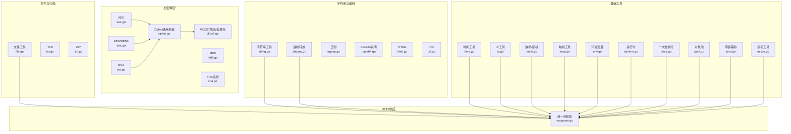
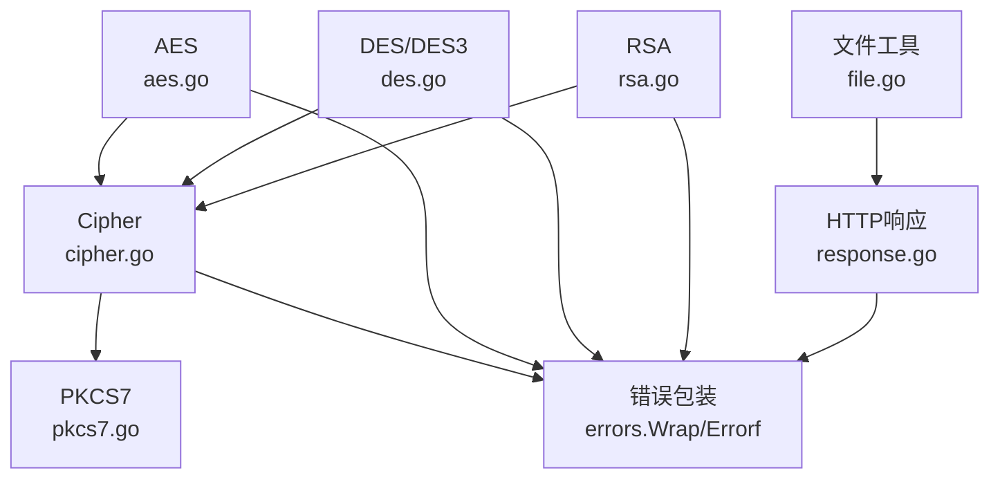
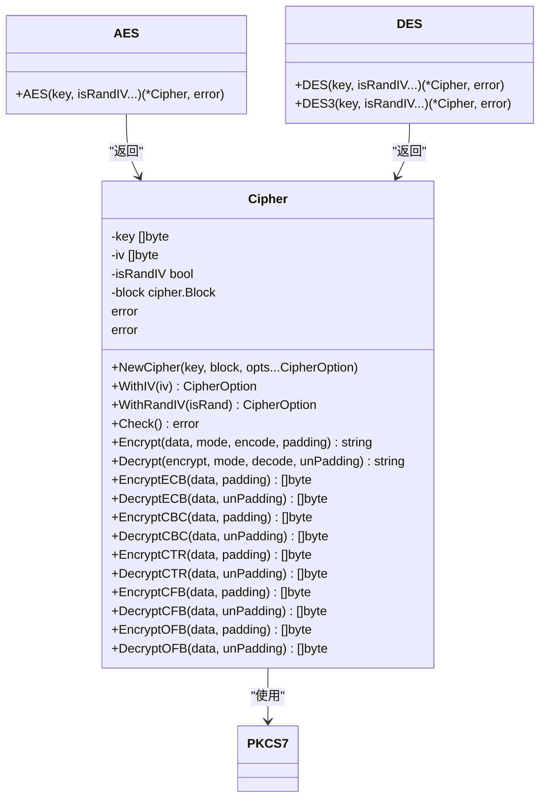
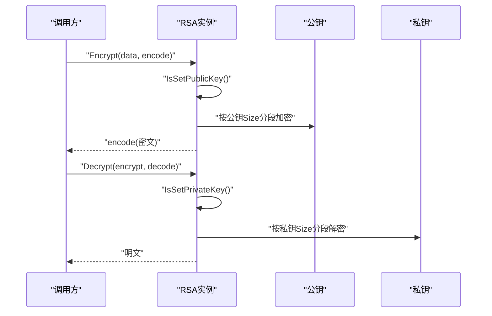
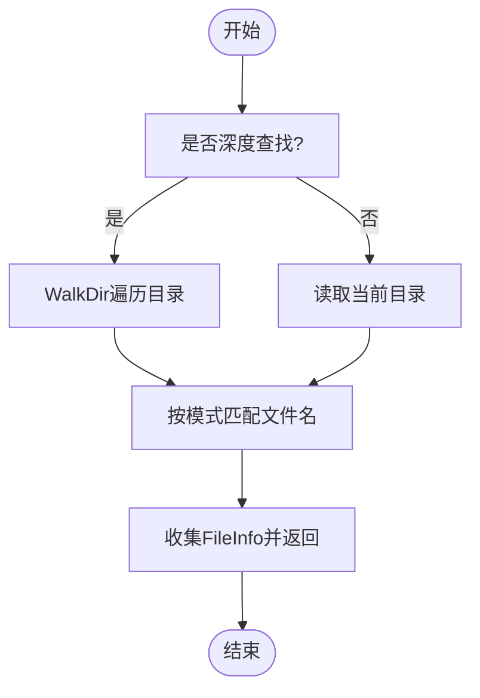
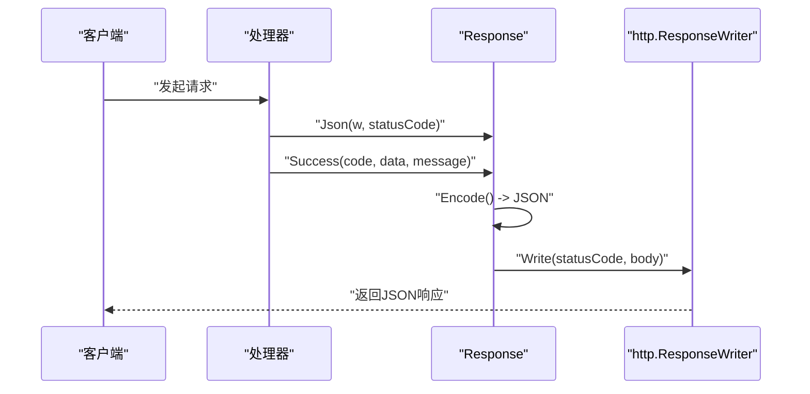
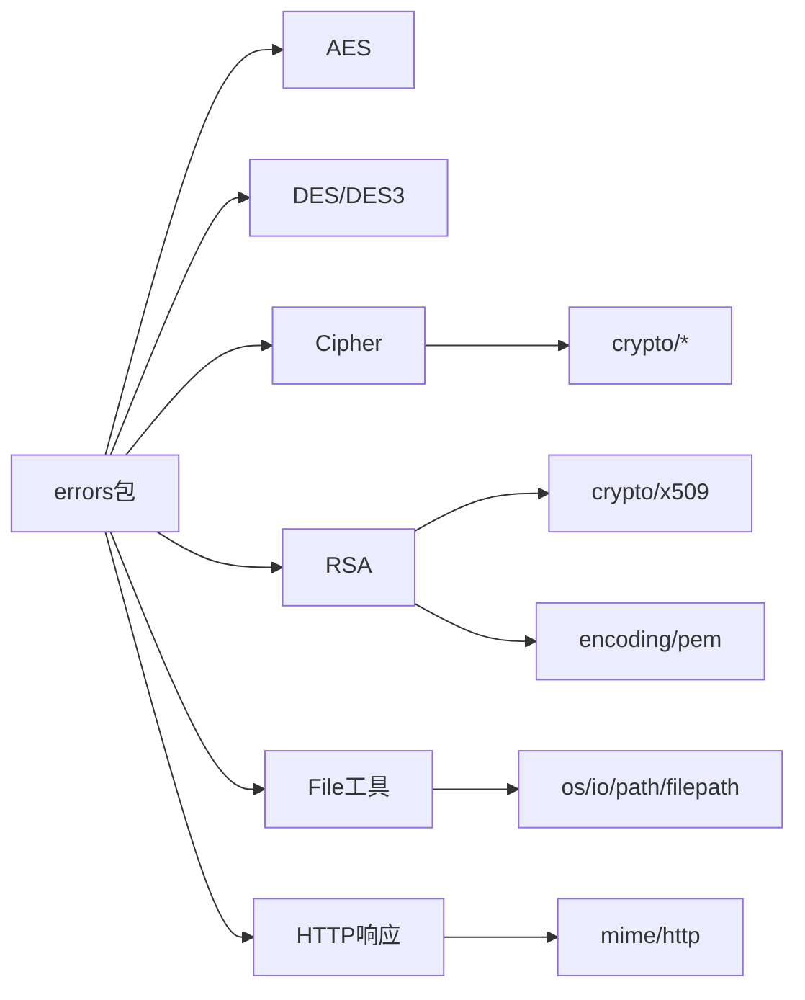

# API参考

<cite>
**本文引用的文件**
- [README.md](file://README.md)
- [aes.go](file://aes.go)
- [cipher.go](file://cipher.go)
- [des.go](file://des.go)
- [pkcs7.go](file://pkcs7.go)
- [md5.go](file://md5.go)
- [sha.go](file://sha.go)
- [rsa.go](file://rsa.go)
- [file.go](file://file.go)
- [response.go](file://response.go)
- [string.go](file://string.go)
- [strconv.go](file://strconv.go)
- [math.go](file://math.go)
- [map.go](file://map.go)
- [time.go](file://time.go)
- [ip.go](file://ip.go)
- [base64.go](file://base64.go)
- [html.go](file://html.go)
- [url.go](file://url.go)
- [env.go](file://env.go)
- [runtime.go](file://runtime.go)
- [once.go](file://once.go)
- [pool.go](file://pool.go)
- [zero.go](file://zero.go)
- [misce.go](file://misce.go)
- [regexp.go](file://regexp.go)
- [tar.go](file://tar.go)
- [zip.go](file://zip.go)
- [curl.go](file://curl.go)
- [json.go](file://json.go)
- [types.go](file://types.go)
- [consts.go](file://consts.go)
- [go.mod](file://go.mod)
</cite>

## 目录

1. [简介](#简介)
2. [项目结构](#项目结构)
3. [核心组件](#核心组件)
4. [架构总览](#架构总览)
5. [详细组件分析](#详细组件分析)
6. [依赖分析](#依赖分析)
7. [性能考虑](#性能考虑)
8. [故障排查指南](#故障排查指南)
9. [结论](#结论)
10. [附录](#附录)

## 简介

本API参考面向Go
Utils库，系统性梳理了加密解密、文件处理、HTTP响应、字符串处理、基础工具与辅助工具等模块的公共接口，覆盖函数签名、参数说明、返回值、错误处理、使用示例与注意事项。文档同时提供关键流程的时序与类图，帮助开发者快速定位实现细节与集成方式。

## 项目结构

仓库采用按功能域划分的文件组织方式，核心模块分布如下：

- 加密解密：aes.go、des.go、cipher.go、pkcs7.go、md5.go、sha.go、rsa.go
- 文件处理：file.go、tar.go、zip.go
- HTTP响应：response.go
- 字符串处理：string.go、strconv.go、regexp.go、base64.go、html.go、url.go
- 基础工具：math.go、map.go、time.go、ip.go、env.go、runtime.go、once.go、pool.go、zero.go、misce.go
- JSON与类型：json.go、types.go、consts.go
- 示例与测试：example_test.go、各模块对应的_test.go文件
- 文档与元信息：README.md、go.mod

图表来源

- [aes.go](file://aes.go#L1-L23)
- [des.go](file://des.go#L1-L45)
- [cipher.go](file://cipher.go#L1-L498)
- [pkcs7.go](file://pkcs7.go#L1-L31)
- [md5.go](file://md5.go#L1-L13)
- [sha.go](file://sha.go#L1-L27)
- [rsa.go](file://rsa.go#L1-L527)
- [file.go](file://file.go#L1-L451)
- [response.go](file://response.go#L1-L342)
- [string.go](file://string.go#L1-L187)
- [strconv.go](file://strconv.go#L1-L109)
- [math.go](file://math.go#L1-L37)
- [map.go](file://map.go#L1-L134)
- [time.go](file://time.go#L1-L377)
- [ip.go](file://ip.go#L1-L89)

章节来源

- [go.mod](file://go.mod#L1-L200)

## 核心组件

本节概述各模块的关键公共接口与职责边界，便于快速检索。

- 加密解密
    - 对称加密：AES、DES/DES3、Cipher通用封装，支持多种分组模式与PKCS7填充
    - 哈希：MD5、SHA1/SHA256/SHA512
    - 非对称加密：RSA，支持PKCS1/8、PKCS1v15/OAEP/PSS签名与验签
- 文件处理
    - 文件存在性、大小、拷贝、信息枚举、按规则查找
    - 大文件/大行高效读取：Scan、Line、Read
    - 写入与缓冲：NewWrite、WriteFile
    - 文件类型检测与大小格式化
- HTTP响应
    - 统一响应体结构，支持JSON、XML、HTML、Text、下载、显示、重定向
    - 支持自定义状态码、Content-Type、Header
- 字符串与编码
    - 字符串替换、截取、反转、随机字符串、唯一ID
    - 进制转换（二/八/十/十六）、字符串到数值
    - Base64说明、HTML/URL工具、正则
- 基础工具
    - 数学与随机：Rand、Round
    - 映射工具：键/值提取、排序遍历、差集/交集、求和
    - 时间工具：时区、格式化/解析、日期校验、时间运算、比较
    - IP工具：服务器/本地/客户端IP
    - 环境变量、运行时、一次性执行、对象池、零值辅助、杂项

章节来源

- [aes.go](file://aes.go#L1-L23)
- [des.go](file://des.go#L1-L45)
- [cipher.go](file://cipher.go#L1-L498)
- [pkcs7.go](file://pkcs7.go#L1-L31)
- [md5.go](file://md5.go#L1-L13)
- [sha.go](file://sha.go#L1-L27)
- [rsa.go](file://rsa.go#L1-L527)
- [file.go](file://file.go#L1-L451)
- [response.go](file://response.go#L1-L342)
- [string.go](file://string.go#L1-L187)
- [strconv.go](file://strconv.go#L1-L109)
- [math.go](file://math.go#L1-L37)
- [map.go](file://map.go#L1-L134)
- [time.go](file://time.go#L1-L377)
- [ip.go](file://ip.go#L1-L89)

## 架构总览

下图展示加密解密与文件/HTTP模块的交互关系，以及错误包装与工具函数的复用。

图表来源

- [cipher.go](file://cipher.go#L1-L498)
- [aes.go](file://aes.go#L1-L23)
- [des.go](file://des.go#L1-L45)
- [pkcs7.go](file://pkcs7.go#L1-L31)
- [rsa.go](file://rsa.go#L1-L527)
- [file.go](file://file.go#L1-L451)
- [response.go](file://response.go#L1-L342)

## 详细组件分析

### 加密解密模块

#### 对称加密：AES/DES/DES3 与 Cipher封装

- AES(key, isRandIV...)：根据key长度校验（16/24/32字节），返回Cipher或错误
- DES(key, isRandIV...)：支持8字节DES与24字节3DES，自动调用DES3
- DES3(key, isRandIV...)：仅支持24字节3DES
- Cipher.NewCipher(key, block, isRandIV)：通用构造，设置密钥与IV策略
- Cipher：通过CipherOption（WithIV/WithRandIV）在构造时配置密钥与IV
- Cipher.Encrypt/Decrypt(mode, encode, padding)：支持ECB/CBC/CTR/CFB/OFB
- PKCS7Padding/Pkcs7UnPadding：标准填充与去填充

图表来源

- [cipher.go](file://cipher.go#L20-L498)
- [aes.go](file://aes.go#L1-L23)
- [des.go](file://des.go#L1-L45)
- [pkcs7.go](file://pkcs7.go#L1-L31)

章节来源

- [aes.go](file://aes.go#L1-L23)
- [des.go](file://des.go#L1-L45)
- [cipher.go](file://cipher.go#L1-L498)
- [pkcs7.go](file://pkcs7.go#L1-L31)

#### 哈希：MD5与SHA系列

- Md5(str)：返回十六进制字符串
- Sha1/Sha256/Sha512(str)：返回十六进制字符串

章节来源

- [md5.go](file://md5.go#L1-L13)
- [sha.go](file://sha.go#L1-L27)

#### 非对称加密：RSA

- RSA结构体：包含公钥与私钥指针
- NewRSA/NewPubRSA/NewPriRSA：实例化并设置公/私钥
- SetPublicKey/SetPrivateKey：支持文件路径或字符串，自动识别PKCS1/PKCS8
- Encrypt/Decrypt：PKCS1v15，按公钥/私钥大小分段加密/解密
- EncryptOAEP/DecryptOAEP：OAEP模式，需指定hash
- Sign/Verify：PKCS1v15签名与验签
- SignPSS/VerifyPSS：PSS模式，需PSSOptions
- GenerateKeyRSA：生成密钥对文件（可选PKCS格式）
- RemovePEMHeaders/AddPEMHeaders：PEM头尾处理

图表来源

- [rsa.go](file://rsa.go#L162-L223)

章节来源

- [rsa.go](file://rsa.go#L1-L527)

### 文件处理模块

#### 文件与目录

- IsDir/IsFile/IsExist/Size：路径与大小检查
- Copy(src, dst)：文件拷贝，保留权限
- FileInfo：封装fs.FileInfo与绝对路径
- FindFiles(path, depth, match...)：多模式匹配（*, 精确, 前缀, 后缀, 正则）

图表来源

- [file.go](file://file.go#L89-L225)

章节来源

- [file.go](file://file.go#L1-L451)

#### 大文件/大行高效读取

- Scan(r, handle, size...)：基于bufio.Scanner，支持自定义maxTokenSize
- Line(r, handle)：基于bufio.NewReaderSize，适合大行
- Read(r, handle)：分块读取，适合无换行或超大文件

章节来源

- [file.go](file://file.go#L227-L309)

#### 写入与缓冲

- NewWrite(fileName, opts...WriteOption)：创建/打开文件，支持权限与追加
- WriteFile：线程安全写入，支持Write/WriteString/WriteBuf
- Close：关闭文件句柄

章节来源

- [file.go](file://file.go#L311-L395)

#### 文件类型与大小格式化

- SizeFormat(size, decimals)：格式化显示文件大小
- FileType(f)：基于扩展名与内容探测MIME类型

章节来源

- [file.go](file://file.go#L397-L451)

### HTTP响应模块

#### 统一响应体

- Response：包含Body、状态码、Writer
- Body：Success/Fail字段，Code/Message/Data
- Success/Fail：设置成功/失败状态并编码输出
- Text/Html/Xml：文本、HTML、XML响应
- Download/Show：下载与显示文件内容
- Write/StatusCode/ContentType/Header/Encode：底层写入与头部设置
- Json/View/Redirect：便捷工厂与重定向

图表来源

- [response.go](file://response.go#L24-L83)

章节来源

- [response.go](file://response.go#L1-L342)

### 字符串与编码模块

#### 字符串工具

- Replace(s, oldnew)：批量替换
- Substr(str, start, length)：支持负索引与长度
- StrRev(str)：反转字符串
- RandStr/RandStr2/RandStr3：随机字符串生成
- UniqId(l, r...)：生成可排序唯一ID（16-32位）

章节来源

- [string.go](file://string.go#L1-L187)

#### 进制转换

- Str2Int/Str2Int64/Str2Float：字符串转数值
- BinOct/BinDec/BinHex、OctBin/OctDec/OctHex、DecBin/DecOct/DecHex、HexBin/HexOct/HexDec：二/八/十/十六进制互转

章节来源

- [strconv.go](file://strconv.go#L1-L109)

#### Base64说明

- 提供标准与URL安全编码/解码的说明与建议

章节来源

- [base64.go](file://base64.go#L1-L8)

#### HTML/URL工具

- HTML与URL相关工具函数（具体实现见对应文件）

章节来源

- [html.go](file://html.go#L1-L200)
- [url.go](file://url.go#L1-L200)

#### 正则

- 正则工具函数（具体实现见对应文件）

章节来源

- [regexp.go](file://regexp.go#L1-L200)

### 基础工具模块

#### 数学与随机

- Rand(min, max, r...)：含边界随机数
- Round(num, precision)：四舍五入

章节来源

- [math.go](file://math.go#L1-L37)

#### 映射工具

- MapKeys/MapValues/MapRange/MapFilter：键/值提取、排序遍历、过滤
- MapDiff/MapIntersect/MapDiffKey/MapIntersectKey：集合运算
- SumMap：求和

章节来源

- [map.go](file://map.go#L1-L134)

#### 时间工具

- 时区：Local/CST/UTC
- 格式化/解析：TimeFormat/TimeParse/Date/Strtotime
- 日期校验：CheckDate/MonthDay
- 时间运算：AddTime
- 比较：Before/After/Equal/Sub

章节来源

- [time.go](file://time.go#L1-L377)

#### IP工具

- ServerIP/LocalIP/ClientIP：服务器外网IP、本地IP、客户端IP解析

章节来源

- [ip.go](file://ip.go#L1-L89)

#### 环境变量、运行时、一次性执行、对象池、零值辅助、杂项

- env.go、runtime.go、once.go、pool.go、zero.go、misce.go：提供环境读取、运行时信息、一次性执行、对象池、零值辅助与杂项工具

章节来源

- [env.go](file://env.go#L1-L200)
- [runtime.go](file://runtime.go#L1-L200)
- [once.go](file://once.go#L1-L200)
- [pool.go](file://pool.go#L1-L200)
- [zero.go](file://zero.go#L1-L200)
- [misce.go](file://misce.go#L1-L200)

## 依赖分析

- 错误处理：统一使用errors.Wrap与errors.Errorf进行错误包装与传播
- 编码/解码：Response模块使用Marshal进行JSON编码，Xml使用xml.MarshalIndent
- 文件与HTTP：File工具依赖os、io、path/filepath、mime、net/http；Response依赖net/http、log/slog
- 加密解密：Cipher依赖crypto/cipher、crypto/rand；RSA依赖crypto/*、encoding/pem、crypto/x509

图表来源

- [cipher.go](file://cipher.go#L1-L498)
- [aes.go](file://aes.go#L1-L23)
- [des.go](file://des.go#L1-L45)
- [rsa.go](file://rsa.go#L1-L527)
- [file.go](file://file.go#L1-L451)
- [response.go](file://response.go#L1-L342)

章节来源

- [cipher.go](file://cipher.go#L1-L498)
- [rsa.go](file://rsa.go#L1-L527)
- [file.go](file://file.go#L1-L451)
- [response.go](file://response.go#L1-L342)

## 性能考虑

- 大文件读取：优先使用Line或Read以避免单行过大导致Scanner失败；Scan可调整maxTokenSize
- 写入优化：WriteBuf使用bufio.Writer减少系统调用
- 加密分段：RSA按公钥/私钥大小分段处理，避免超长明文
- 随机生成：批量生成时复用随机源以降低开销
- 哈希与编码：MD5/SHA系列为纯CPU计算，注意批量场景下的并发与缓存

## 故障排查指南

- 加密解密
    - 密钥长度错误：AES/DES/DES3会返回明确错误，检查key长度（16/24/32或8/24）
    - IV长度不匹配：CBC/CTR/CFB/OFB要求IV长度等于分组大小（AES=16，DES=8）
    - PKCS7去填充失败：输入数据长度或填充格式异常
- RSA
    - 公钥/私钥未设置：调用前先SetPublicKey/SetPrivateKey
    - PEM格式错误：确认头尾标记与换行，必要时使用AddPEMHeaders/RemovePEMHeaders
    - OAEP/PSS参数：确保hash与PSSOptions配置正确
- 文件处理
    - 文件不存在/权限不足：检查IsExist与权限设置
    - 正则表达式错误：FindFiles会校验并返回格式错误提示
- HTTP响应
    - 编码失败：Success/Fail/Xml在编码失败时记录错误并返回内部错误
    - 下载/显示：若打开文件或类型检测失败，返回内部错误并附追踪码

章节来源

- [cipher.go](file://cipher.go#L42-L99)
- [pkcs7.go](file://pkcs7.go#L17-L30)
- [rsa.go](file://rsa.go#L53-L144)
- [file.go](file://file.go#L89-L225)
- [response.go](file://response.go#L24-L116)

## 结论

本API参考系统梳理了Go
Utils库的核心能力，覆盖对称/非对称加密、文件处理、HTTP响应、字符串与编码、基础工具等模块。通过参数约束、错误处理与使用示例，开发者可快速集成并稳定使用。建议在生产环境中关注密钥管理、文件权限与错误追踪，并结合性能考量选择合适的读写与加密模式。

## 附录

### 版本兼容性与废弃功能

- 本仓库未发现明确的废弃API标注
- 若涉及第三方依赖（如crypto/*、encoding/*），请遵循Go官方版本兼容策略
- 建议在升级Go版本时，对照go.mod与各模块实现进行回归测试

章节来源

- [go.mod](file://go.mod#L1-L200)

### 使用示例与最佳实践

- 加密解密
    - AES/DES：先校验key长度，再选择合适模式（CBC推荐），必要时启用随机IV
    - RSA：优先使用OAEP/PSS增强安全性；密钥文件建议使用PKCS8/PKCS1规范
- 文件处理
    - 大文件读取：Line适用于超长行；Read适用于无换行场景
    - 写入：批量写入使用WriteBuf；注意并发写入的锁保护
- HTTP响应
    - 统一使用Json封装业务响应；错误时使用Fail并记录追踪码
- 字符串与编码
    - 随机字符串：RandStr3支持自定义字符集；UniqId用于生成可排序ID
    - 进制转换：注意ParseInt/FormatInt的进制参数与溢出处理