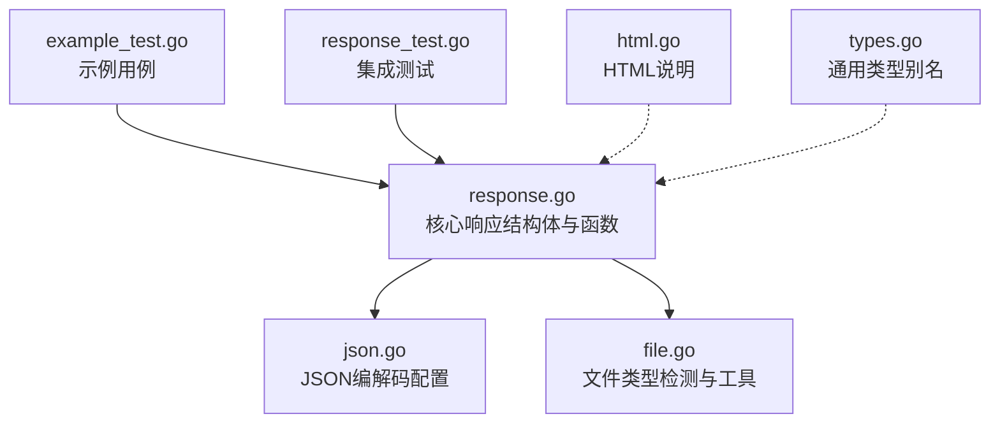
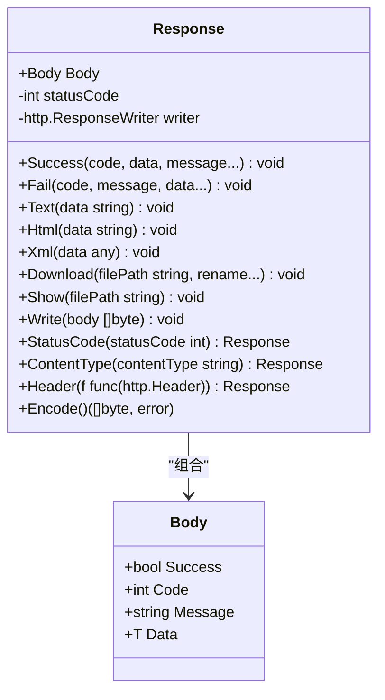
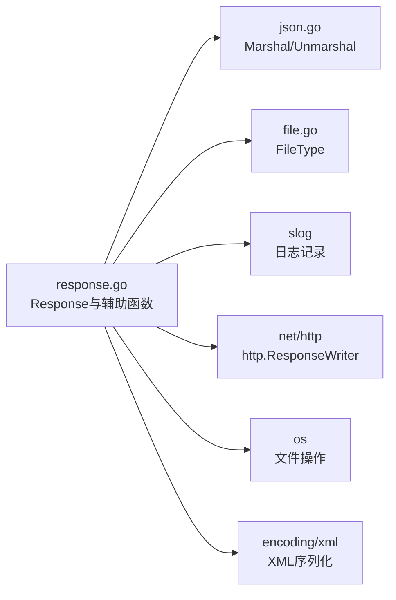
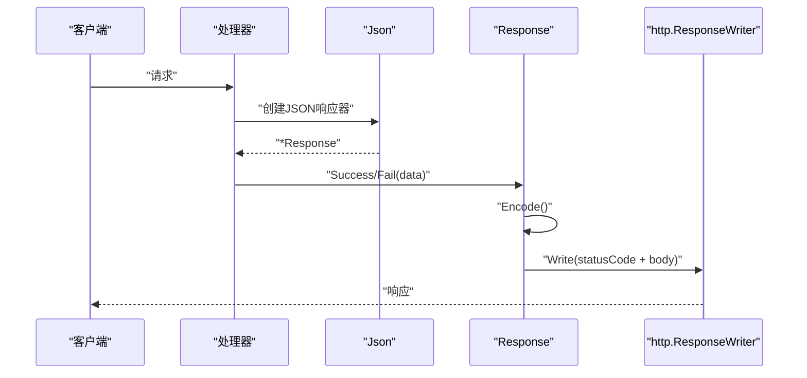

# HTTP响应API

<cite>
**本文引用的文件**
- [response.go](file://response.go)
- [response_test.go](file://response_test.go)
- [example_test.go](file://example_test.go)
- [json.go](file://json.go)
- [file.go](file://file.go)
- [types.go](file://types.go)
- [html.go](file://html.go)
</cite>

## 目录

1. [简介](#简介)
2. [项目结构](#项目结构)
3. [核心组件](#核心组件)
4. [架构总览](#架构总览)
5. [详细组件分析](#详细组件分析)
6. [依赖关系分析](#依赖关系分析)
7. [性能考量](#性能考量)
8. [故障排查指南](#故障排查指南)
9. [结论](#结论)
10. [附录](#附录)

## 简介

本文件为HTTP响应模块的API参考文档，聚焦于Response结构体及其辅助函数，涵盖：

- Response的构造与公共方法：成功/失败响应、文本/HTML/XML输出、下载/显示文件、状态码与响应头设置、编码与写入。
- Json、View、Redirect等HTTP响应输出函数的API接口与使用方式。
- 数据类型参数的使用方法与约束条件。
- JSON、XML、HTML、文件下载/显示等多格式响应的完整使用示例。
- HTTP状态码设置、Content-Type自动检测、文件下载处理等高级功能说明。

## 项目结构

HTTP响应模块主要由以下文件构成：

- response.go：核心响应结构体与方法、辅助函数（Json、View、Redirect）。
- json.go：JSON编解码配置与工具（可替换标准库实现）。
- file.go：文件类型检测（MIME）、文件读写等工具。
- example_test.go/response_test.go：示例与测试用例，展示典型用法。
- html.go：HTML相关说明（转义/反转义）。
- types.go：通用类型别名与接口（与响应模块配合使用）。



图表来源

- [response.go](file://response.go#L1-L342)
- [json.go](file://json.go#L1-L67)
- [file.go](file://file.go#L1-L451)
- [example_test.go](file://example_test.go#L1-L108)
- [response_test.go](file://response_test.go#L1-L82)
- [html.go](file://html.go#L1-L5)
- [types.go](file://types.go#L1-L98)

章节来源

- [response.go](file://response.go#L1-L342)
- [json.go](file://json.go#L1-L67)
- [file.go](file://file.go#L1-L451)
- [example_test.go](file://example_test.go#L1-L108)
- [response_test.go](file://response_test.go#L1-L82)
- [html.go](file://html.go#L1-L5)
- [types.go](file://types.go#L1-L98)

## 核心组件

- Response：响应容器，封装响应体Body、状态码、底层http.ResponseWriter。
- Body：统一响应体结构，包含success/code/message/data字段，支持JSON序列化。
- 辅助函数：
    - Json：创建JSON响应器，设置默认Content-Type为application/json，并可选设置配置选项。
    - View：创建文本视图响应器，适用于HTML/XML/Text/文件显示/下载场景。
    - Redirect：发送HTTP重定向响应。

章节来源

- [response.go](file://response.go#L11-L342)

## 架构总览

HTTP响应模块围绕Response展开，通过链式调用设置状态码、响应头、内容类型，最终编码并写入http.ResponseWriter。Json/View/Redirect作为便捷工厂函数，简化常见响应场景。



图表来源

- [response.go](file://response.go#L11-L342)

## 详细组件分析

### Response 结构体与字段

- 字段
    - Body：统一响应体，包含success/code/message/data。
    - statusCode：HTTP状态码，默认200。
    - writer：底层http.ResponseWriter，负责写入响应。
- 设计要点
    - data字段承载业务数据，支持任意类型；Body统一序列化格式。
    - 方法均以接收者形式存在，便于链式调用。

章节来源

- [response.go](file://response.go#L11-L22)

### Response 公共方法

#### Success(code, data, message...)

- 功能：构造成功响应，设置success=true、code/message/data，并将statusCode设为200。
- 参数
    - code：业务识别码（int）
    - data：业务数据（any）
    - message：可选消息（...string），未提供时默认“SUCCESS”
- 返回：无
- 错误处理：内部编码失败时记录日志并返回500错误，同时返回唯一错误码供追踪。

章节来源

- [response.go](file://response.go#L24-L54)

#### Fail(code, message, data...)

- 功能：构造失败响应，设置success=false、code/message/data。
- 参数
    - code：业务识别码（int）
    - message：错误信息（string）
    - data：可选业务数据（...any）
- 返回：无
- 错误处理：内部编码失败时记录日志并返回500错误，同时返回唯一错误码供追踪。

章节来源

- [response.go](file://response.go#L56-L83)

#### Text(data)

- 功能：发送纯文本响应（Content-Type: text/plain; charset=utf-8）。
- 参数：data（string）
- 返回：无
- 错误处理：内部写入失败时记录日志并返回500错误。

章节来源

- [response.go](file://response.go#L85-L89)

#### Html(data)

- 功能：发送HTML响应（Content-Type: text/html; charset=utf-8）。
- 参数：data（string）
- 返回：无
- 错误处理：内部写入失败时记录日志并返回500错误。

章节来源

- [response.go](file://response.go#L91-L95)

#### Xml(data)

- 功能：发送XML响应（Content-Type: application/xml; charset=utf-8），自动添加XML声明。
- 参数：data（any），将被序列化为XML
- 返回：无
- 错误处理：XML编码失败时记录日志并返回500错误；写入失败同样记录日志并返回500错误。

章节来源

- [response.go](file://response.go#L97-L116)

#### Download(filePath, rename...)

- 功能：发送文件下载响应（Content-Disposition: attachment; filename=...），自动检测Content-Type。
- 参数
    - filePath：文件路径（string）
    - rename：可选重命名（...string），未提供时使用文件名
- 返回：无
- 错误处理：
    - 打开文件失败：记录日志并返回500错误。
    - 获取文件信息失败：记录日志并返回500错误。
    - 文件类型检测失败：记录日志并返回500错误。
    - 写入失败：记录日志并返回500错误。

章节来源

- [response.go](file://response.go#L118-L199)
- [file.go](file://file.go#L434-L450)

#### Show(filePath)

- 功能：显示文件内容（Content-Type根据文件自动检测），常用于图片等资源预览。
- 参数：filePath（string）
- 返回：无
- 错误处理：与Download类似，失败时返回500错误并记录日志。

章节来源

- [response.go](file://response.go#L201-L251)
- [file.go](file://file.go#L434-L450)

#### Write(body)

- 功能：写入响应体并设置状态码。
- 参数：body（[]byte）
- 返回：无
- 错误处理：写入失败时记录日志并返回500错误。

章节来源

- [response.go](file://response.go#L253-L269)

#### StatusCode(statusCode)

- 功能：设置HTTP状态码，支持链式调用。
- 参数：statusCode（int）
- 返回：*Response
- 错误处理：无

章节来源

- [response.go](file://response.go#L271-L275)

#### ContentType(contentType)

- 功能：设置Content-Type（自动附加charset=utf-8），支持链式调用。
- 参数：contentType（string）
- 返回：*Response
- 错误处理：无

章节来源

- [response.go](file://response.go#L277-L281)

#### Header(f)

- 功能：设置其他响应头（如Cache-Control、Authorization等），支持链式调用。
- 参数：f（func(http.Header)）
- 返回：*Response
- 错误处理：无

章节来源

- [response.go](file://response.go#L283-L287)

#### Encode()

- 功能：对Body进行JSON编码。
- 参数：无
- 返回：([]byte, error)
- 错误处理：委托至Marshal函数（可替换标准库实现）

章节来源

- [response.go](file://response.go#L289-L292)
- [json.go](file://json.go#L52-L66)

### 辅助函数

#### Json(w, opts...)

- 功能：创建JSON响应器，设置默认Content-Type为application/json；可选设置状态码。
- 参数
    - w：http.ResponseWriter
    - opts：可选配置项（...ResponseOption），未提供时默认200
- 返回：*Response
- 错误处理：无
- 使用建议：与Success/Fail配合，自动设置状态码与Content-Type。

章节来源

- [response.go](file://response.go#L294-L308)

#### View(w, opts...ResponseOption)

- 功能：创建文本视图响应器，适用于HTML/XML/Text/文件显示/下载场景。
- 参数
    - w：http.ResponseWriter
    - opts：可选配置项（...ResponseOption），未提供时默认200
- 返回：*Response
- 错误处理：无
- 使用建议：与Html/Xml/Text/Show/Download配合。

章节来源

- [response.go](file://response.go#L310-L323)

#### Redirect(w, url, opts...ResponseOption)

- 功能：发送HTTP重定向响应（默认302 Found），设置Location头并写入状态码。
- 参数
    - w：http.ResponseWriter
    - url：重定向目标URL（string）
    - opts：可选配置项（...ResponseOption），未提供时默认302
- 返回：无
- 错误处理：无
- 使用建议：用于页面跳转或API重定向。

章节来源

- [response.go](file://response.go#L325-L341)

### ResponseOption配置项

ResponseOption提供了灵活的配置方式,用于设置HTTP响应的各项参数:

- **WithStatusCode(statusCode int) ResponseOption**
    - 功能:设置HTTP状态码
    - 参数:statusCode为HTTP状态码(如200、404、500等)

- **WithContentType(contentType string) ResponseOption**
    - 功能:设置Content-Type响应头
    - 参数:contentType为MIME类型(如"application/json"、"text/html"等)

- **WithHeader(f func(http.Header)) ResponseOption**
    - 功能:设置自定义响应头
    - 参数:f为Header设置回调函数

**使用示例:**

```go
// 使用单个配置项
resp := utils.Json(w, utils.WithStatusCode(201))

// 使用多个配置项
resp := utils.Json(w, 
    utils.WithStatusCode(200),
    utils.WithContentType("application/json"),
    utils.WithHeader(func(h http.Header) {
        h.Set("X-Custom-Header", "value")
    }),
)
```

章节来源

- [response.go](file://response.go#L18-L46)

### 使用示例（概览）

- JSON响应:使用Json创建响应器,通过opts配置项设置参数,调用Success/Fail返回统一结构体。
- HTML/XML/Text:使用View创建响应器,通过opts配置项设置参数,调用Html/Xml/Text输出。
- 文件下载/显示:使用View创建响应器,调用Download/Show处理文件。
- 重定向:使用Redirect发送重定向响应,通过opts配置项设置状态码。
- data字段为any类型,可承载任意业务数据(结构体、切片、映射等)。

章节来源

- [example_test.go](file://example_test.go#L17-L107)
- [response_test.go](file://response_test.go#L51-L81)

### 使用示例（概览）

- JSON响应：使用Json创建响应器，调用Success/Fail返回统一结构体。
- HTML/XML/Text：使用View创建响应器，调用Html/Xml/Text输出。
- 文件下载/显示：使用View创建响应器，调用Download/Show处理文件。
- 重定向：使用Redirect发送重定向响应。

章节来源

- [example_test.go](file://example_test.go#L17-L107)
- [response_test.go](file://response_test.go#L51-L81)

## 依赖关系分析



图表来源

- [response.go](file://response.go#L1-L342)
- [json.go](file://json.go#L1-L67)
- [file.go](file://file.go#L1-L451)

章节来源

- [response.go](file://response.go#L1-L342)
- [json.go](file://json.go#L1-L67)
- [file.go](file://file.go#L1-L451)

## 性能考量

- JSON/XML编码：优先使用内置Marshal/Unmarshal；可通过SetJsonMethod注入第三方高性能实现以降低延迟。
- 文件下载：使用io.Copy高效传输文件内容，避免一次性加载至内存。
- Content-Type检测：FileType基于扩展名与魔数检测，首次读取后重置文件指针，避免重复解析开销。
- 日志与错误码：统一使用唯一ID（UniqId）记录错误，便于定位问题，减少重复日志开销。

章节来源

- [json.go](file://json.go#L38-L66)
- [file.go](file://file.go#L434-L450)
- [response.go](file://response.go#L118-L199)

## 故障排查指南

- JSON/XML编码失败
    - 现象：返回500错误，响应体包含唯一错误码。
    - 排查：检查T是否满足JSON/XML序列化要求；查看日志中trace信息。
- 文件打开/读取失败
    - 现象：返回500错误，响应体包含唯一错误码。
    - 排查：确认文件路径存在且可读；检查权限与磁盘空间。
- Content-Type检测失败
    - 现象：返回500错误，响应体包含唯一错误码。
    - 排查：确认文件扩展名或内容是否可识别；必要时手动设置Content-Type。
- 写入失败
    - 现象：返回500错误，响应体包含唯一错误码。
    - 排查：检查网络连接、客户端断开、缓冲区溢出等问题。

章节来源

- [response.go](file://response.go#L40-L52)
- [response.go](file://response.go#L69-L82)
- [response.go](file://response.go#L99-L115)
- [response.go](file://response.go#L122-L198)
- [response.go](file://response.go#L202-L250)
- [response.go](file://response.go#L254-L268)

## 结论

HTTP响应模块通过Response与辅助函数，提供了统一、易用且可扩展的HTTP响应能力。其特性包括：

- 统一的JSON响应结构（Body）与链式API设计。
- 多格式输出（JSON/HTML/XML/文本/文件）与状态码、响应头灵活控制。
- 高级功能（文件下载/显示、Content-Type自动检测、重定向）覆盖常见业务场景。
- 错误处理与日志记录完善，便于问题定位与运维。

## 附录

### API清单与签名（概览）

- Response
    - Success(code int, data any, message ...string) void
    - Fail(code int, message string, data ...any) void
    - Text(data string) void
    - Html(data string) void
    - Xml(data any) void
    - Download(filePath string, rename ...string) void
    - Show(filePath string) void
    - Write(body []byte) void
    - StatusCode(statusCode int) *Response
    - ContentType(contentType string) *Response
    - Header(f func(http.Header)) *Response
    - Encode() ([]byte, error)
- 辅助函数
    - Json(w http.ResponseWriter, opts ...ResponseOption) *Response
    - View(w http.ResponseWriter, opts ...ResponseOption) *Response
    - Redirect(w http.ResponseWriter, url string, opts ...ResponseOption) void

章节来源

- [response.go](file://response.go#L24-L341)

### 使用流程示意



图表来源

- [response.go](file://response.go#L294-L308)
- [response.go](file://response.go#L24-L54)