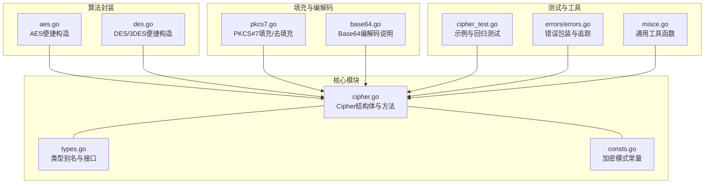
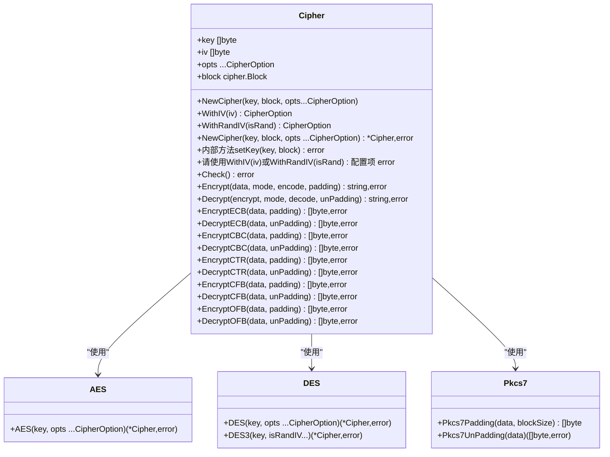
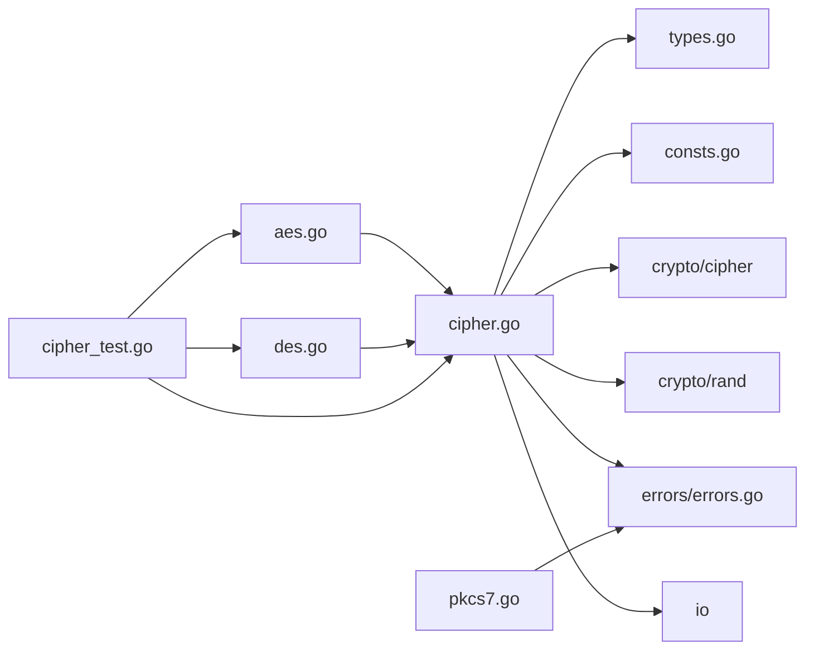

# Cipher核心API

<cite>
**本文引用的文件列表**
- [cipher.go](file://cipher.go)
- [types.go](file://types.go)
- [consts.go](file://consts.go)
- [aes.go](file://aes.go)
- [des.go](file://des.go)
- [pkcs7.go](file://pkcs7.go)
- [cipher_test.go](file://cipher_test.go)
- [errors/errors.go](file://errors/errors.go)
- [base64.go](file://base64.go)
- [misce.go](file://misce.go)
</cite>

## 目录

1. [简介](#简介)
2. [项目结构](#项目结构)
3. [核心组件](#核心组件)
4. [架构总览](#架构总览)
5. [详细组件分析](#详细组件分析)
6. [依赖关系分析](#依赖关系分析)
7. [性能考量](#性能考量)
8. [故障排查指南](#故障排查指南)
9. [结论](#结论)
10. [附录](#附录)

## 简介

本文件为Cipher核心API的权威参考文档，聚焦以下关键能力：

- 构造函数NewCipher的完整API接口，包括参数说明、返回值与错误处理
- 密钥通过NewCipher构造时自动设置，覆盖AES-128/192/256、DES-56、3DES-168的密钥长度校验与错误处理
- IV通过WithIV或WithRandIV配置项设置，IV长度要求与自动IV生成机制
- Encrypt与Decrypt通用加密/解密方法，涵盖模式参数、编码器与填充处理器的使用
- 提供函数签名、参数类型、返回值说明与实际使用示例路径

## 项目结构

围绕Cipher核心API的相关文件组织如下：

- cipher.go：Cipher结构体与所有加密/解密方法的实现
- types.go：加密模式、编码/解码、填充/去填充、密码块工厂等类型定义
- consts.go：加密模式常量（ECB/CBC/CTR/CFB/OFB）
- aes.go、des.go：便捷构造函数，封装NewCipher并进行算法特定的密钥长度校验
- pkcs7.go：PKCS#7填充与去填充实现
- cipher_test.go：端到端示例，展示AES在各模式下的加密/解密流程
- errors/errors.go：统一错误包装与追踪
- base64.go：Base64编解码说明
- misce.go：通用工具函数（如三元条件运算）

图表来源

- [cipher.go](file://cipher.go#L1-L498)
- [types.go](file://types.go#L44-L74)
- [consts.go](file://consts.go#L4-L10)
- [aes.go](file://aes.go#L1-L23)
- [des.go](file://des.go#L1-L45)
- [pkcs7.go](file://pkcs7.go#L1-L31)
- [cipher_test.go](file://cipher_test.go#L1-L62)
- [errors/errors.go](file://errors/errors.go#L1-L282)
- [base64.go](file://base64.go#L1-L8)
- [misce.go](file://misce.go#L1-L133)

章节来源

- [cipher.go](file://cipher.go#L1-L498)
- [types.go](file://types.go#L44-L74)
- [consts.go](file://consts.go#L4-L10)
- [aes.go](file://aes.go#L1-L23)
- [des.go](file://des.go#L1-L45)
- [pkcs7.go](file://pkcs7.go#L1-L31)
- [cipher_test.go](file://cipher_test.go#L1-L62)
- [errors/errors.go](file://errors/errors.go#L1-L282)
- [base64.go](file://base64.go#L1-L8)
- [misce.go](file://misce.go#L1-L133)

## 核心组件

- 结构体：Cipher
    - 字段：key、iv、isRandIV、block
    - 方法：NewCipher(支持opts配置)、Check、Encrypt/Decrypt系列（ECB/CBC/CTR/CFB/OFB）
- 类型与接口：McryptMode、Encode/Decode、Padding/UnPadding、CipherBlock
- 算法封装：AES、DES、DES3
- 填充：PKCS#7
- 错误处理：errors包统一包装与追踪

章节来源

- [cipher.go](file://cipher.go#L20-L25)
- [types.go](file://types.go#L46-L74)
- [consts.go](file://consts.go#L4-L10)
- [aes.go](file://aes.go#L12-L22)
- [des.go](file://des.go#L12-L44)
- [pkcs7.go](file://pkcs7.go#L8-L30)
- [errors/errors.go](file://errors/errors.go#L14-L53)

## 架构总览

Cipher通过组合“密码块工厂”（CipherBlock）与“填充处理器”（Padding/UnPadding）实现对多种对称加密算法（AES/DES）与多种工作模式（ECB/CBC/CTR/CFB/OFB）的统一抽象。便捷构造函数（AES、DES、DES3）在内部完成密钥长度校验，确保后续Encrypt/Decrypt流程的正确性。

图表来源

- [cipher.go](file://cipher.go#L20-L498)
- [aes.go](file://aes.go#L12-L22)
- [des.go](file://des.go#L12-L44)
- [pkcs7.go](file://pkcs7.go#L8-L30)

## 详细组件分析

### 构造函数 NewCipher

- 函数签名
    - NewCipher(key string, block CipherBlock, opts ...CipherOption) (*Cipher, error)
- 参数说明
    - key：密钥字符串（字节序列）
    - block：密码块工厂，如aes.NewCipher、des.NewCipher、des.NewTripleDESCipher
    - isRandIV：是否在加密时随机生成IV并将其附加到密文头部
- 返回值
    - *Cipher：成功时返回Cipher实例
    - error：当密钥长度不符合算法要求或block创建失败时返回错误
- 错误处理
    - 若block创建失败，使用errors.Wrap包装底层错误
    - 若密钥长度不符合算法要求，由NewCipher阶段触发错误（见下文）
- 使用示例路径
    - AES便捷构造：[AES](file://aes.go#L12-L22)
    - DES/3DES便捷构造：[DES](file://des.go#L12-L27)、[DES3](file://des.go#L33-L44)
    - 通用构造：[NewCipher](file://cipher.go#L32-L40)

章节来源

- [cipher.go](file://cipher.go#L32-L40)
- [aes.go](file://aes.go#L12-L22)
- [des.go](file://des.go#L12-L27)
- [des.go](file://des.go#L33-L44)
- [errors/errors.go](file://errors/errors.go#L24-L53)

### 密钥设置

- 函数签名
    - 密钥在NewCipher构造时通过key参数设置
- 参数说明
    - key：密钥字符串
    - block：密码块工厂
- 长度校验规则
    - AES：仅允许16、24、32字节（对应AES-128/192/256）
    - DES：仅允许8字节（对应DES-56）
    - 3DES：仅允许24字节（对应3DES-168）
- 错误处理
    - 密钥长度不合法：返回格式化错误
    - block创建失败：使用errors.Wrap包装
- 使用示例路径
    - AES密钥长度校验：[AES](file://aes.go#L13-L17)
    - DES/3DES密钥长度校验：[DES](file://des.go#L13-L19)、[DES3](file://des.go#L34-L36)
    - 通用密钥设置：[setKey](file://cipher.go#L43-L58)（内部方法，由NewCipher调用）

章节来源

- [cipher.go](file://cipher.go#L43-L58)
- [aes.go](file://aes.go#L13-L17)
- [des.go](file://des.go#L13-L19)
- [des.go](file://des.go#L34-L36)
- [errors/errors.go](file://errors/errors.go#L19-L22)

### 初始化向量设置

- 函数签名
    - IV通过WithIV(iv)或WithRandIV(isRand) CipherOption配置项设置
- 参数说明
    - iv：初始化向量字符串
- 长度要求
    - IV长度必须等于当前算法的分组大小：AES为16字节，DES为8字节
- 自动IV生成
    - 当isRandIV为true时，加密前会随机生成IV并附加到密文头部；解密时会从密文头部提取IV
- 错误处理
    - 未设置密钥：返回提示先设置密钥
    - IV长度不匹配：返回格式化错误
- 使用示例路径
    -
    自动IV生成（EncryptCBC/CTR/CFB/OFB）：[EncryptCBC](file://cipher.go#L156-L162)、[EncryptCTR](file://cipher.go#L227-L233)、[EncryptCFB](file://cipher.go#L298-L304)、[EncryptOFB](file://cipher.go#L369-L375)
    -
    IV提取与校验（DecryptCBC/CTR/CFB/OFB）：[DecryptCBC](file://cipher.go#L184-L190)、[DecryptCTR](file://cipher.go#L255-L261)、[DecryptCFB](file://cipher.go#L326-L332)、[DecryptOFB](file://cipher.go#L397-L403)
    - 显式设置IV：通过 `WithIV(iv)` CipherOption 在构造时传入

章节来源

- [cipher.go](file://cipher.go#L87-L99)
- [cipher.go](file://cipher.go#L156-L162)
- [cipher.go](file://cipher.go#L227-L233)
- [cipher.go](file://cipher.go#L298-L304)
- [cipher.go](file://cipher.go#L369-L375)
- [cipher.go](file://cipher.go#L184-L190)
- [cipher.go](file://cipher.go#L255-L261)
- [cipher.go](file://cipher.go#L326-L332)
- [cipher.go](file://cipher.go#L397-L403)

### 通用加密/解密 Encrypt/Decrypt

- 函数签名
    - (c *Cipher) Encrypt(data string, mode McryptMode, encode Encode, padding Padding) (string, error)
    - (c *Cipher) Decrypt(encrypt string, mode McryptMode, decode Decode, unPadding UnPadding) (string, error)
- 参数说明
    - data/encrypt：待加密/待解密的原始字符串
    - mode：加密模式（ECB/CBC/CTR/CFB/OFB）
    - encode/decode：编码/解码器（如Base64）
    - padding/unPadding：填充/去填充处理器（如PKCS#7）
- 模式行为
    - ECB：无需IV，直接分块加密/解密
    - CBC/CTR/CFB/OFB：需校验密钥与IV（或自动IV），执行相应流/块模式加密/解密
- 错误处理
    - 模式非法：返回错误
    - 编解码失败：使用errors.Wrap包装
    - CBC/CTR/CFB/OFB解密时密文长度或IV长度不足：返回错误
- 使用示例路径
    - Encrypt/Decrypt总体流程：[Encrypt](file://cipher.go#L434-L460)、[Decrypt](file://cipher.go#L473-L497)
    -
    各模式具体实现：[EncryptECB](file://cipher.go#L102-L119)、[DecryptECB](file://cipher.go#L122-L137)、[EncryptCBC](file://cipher.go#L140-L171)、[DecryptCBC](file://cipher.go#L174-L208)、[EncryptCTR](file://cipher.go#L211-L242)、[DecryptCTR](file://cipher.go#L245-L279)、[EncryptCFB](file://cipher.go#L282-L313)、[DecryptCFB](file://cipher.go#L316-L350)、[EncryptOFB](file://cipher.go#L353-L384)、[DecryptOFB](file://cipher.go#L387-L421)
    - 示例测试：[cipher_test.go](file://cipher_test.go#L34-L58)

章节来源

- [cipher.go](file://cipher.go#L434-L460)
- [cipher.go](file://cipher.go#L473-L497)
- [cipher.go](file://cipher.go#L102-L119)
- [cipher.go](file://cipher.go#L122-L137)
- [cipher.go](file://cipher.go#L140-L171)
- [cipher.go](file://cipher.go#L174-L208)
- [cipher.go](file://cipher.go#L211-L242)
- [cipher.go](file://cipher.go#L245-L279)
- [cipher.go](file://cipher.go#L282-L313)
- [cipher.go](file://cipher.go#L316-L350)
- [cipher.go](file://cipher.go#L353-L384)
- [cipher.go](file://cipher.go#L387-L421)
- [cipher_test.go](file://cipher_test.go#L34-L58)

### 填充与去填充（PKCS#7）

- 函数签名
    - Pkcs7Padding(data []byte, blockSize int) []byte
    - Pkcs7UnPadding(data []byte) ([]byte, error)
- 行为说明
    - Pkcs7Padding：按块大小补齐至整数倍
    - Pkcs7UnPadding：去除填充，若输入为空或填充长度异常则返回错误
- 使用示例路径
    - 填充：[Pkcs7Padding](file://pkcs7.go#L9-L15)
    - 去填充：[Pkcs7UnPadding](file://pkcs7.go#L18-L30)

章节来源

- [pkcs7.go](file://pkcs7.go#L9-L15)
- [pkcs7.go](file://pkcs7.go#L18-L30)

### 编解码（Base64）

- 说明
    - 提供Base64编码与解码的使用说明
- 使用示例路径
    - Base64说明：[base64.go](file://base64.go#L3-L7)

章节来源

- [base64.go](file://base64.go#L3-L7)

### 辅助工具（三元条件）

- 函数签名
    - Ternary[T any](expr bool, trueVal, falseVal T) T
- 用途
    - 在加密流程中根据isRandIV动态选择密文缓冲区起始位置
- 使用示例路径
    - 三元条件：[Ternary](file://misce.go#L14-L19)

章节来源

- [misce.go](file://misce.go#L14-L19)

## 依赖关系分析

- Cipher依赖
    - types.go：模式、编解码、填充接口
    - consts.go：模式常量
    - crypto/cipher：标准库块/流加密模式
    - crypto/rand：随机IV生成
    - errors/errors.go：统一错误包装
    - io：读取随机源
- 算法封装依赖
    - aes.go：依赖crypto/aes与cipher.go
    - des.go：依赖crypto/des与cipher.go
- 填充依赖
    - pkcs7.go：依赖errors/errors.go
- 测试依赖
    - cipher_test.go：依赖crypto/aes、encoding/base64与cipher.go

图表来源

- [cipher.go](file://cipher.go#L1-L8)
- [types.go](file://types.go#L3-L3)
- [consts.go](file://consts.go#L1-L3)
- [aes.go](file://aes.go#L3-L6)
- [des.go](file://des.go#L3-L6)
- [pkcs7.go](file://pkcs7.go#L3-L6)
- [cipher_test.go](file://cipher_test.go#L3-L8)

章节来源

- [cipher.go](file://cipher.go#L1-L8)
- [aes.go](file://aes.go#L3-L6)
- [des.go](file://des.go#L3-L6)
- [pkcs7.go](file://pkcs7.go#L3-L6)
- [cipher_test.go](file://cipher_test.go#L3-L8)

## 性能考量

- 分块处理
    - ECB/CBC/CTR/CFB/OFB均采用分块处理，避免一次性分配超大内存
- 随机IV
    - isRandIV开启时，加密前随机生成IV并附加到密文头部，增加少量CPU开销但提升安全性
- 编解码
    - Base64等编解码在Encrypt/Decrypt链路中进行，注意I/O与内存拷贝成本
- 建议
    - 对于大文件，优先使用流式模式（CTR/CFB/OFB）并配合合适的缓冲策略
    - 合理选择填充方式，避免不必要的额外处理

## 故障排查指南

- 常见错误与定位
    - “请先设置密钥”：检查是否已通过AES/DES/DES3工厂函数或NewCipher完成初始化
    - “iv的长度只能是N个字节”：确认IV长度与算法分组大小一致（AES=16、DES=8）
    - “密文太短”：isRandIV开启时，密文应包含头部IV
    - “密文不是块大小的倍数”：检查密文长度与算法分组大小的关系
    - “错误的加密模式”：确认mode为ECB/CBC/CTR/CFB/OFB之一
- 错误包装与追踪
    - 所有错误通过errors.Wrap/Errorf进行包装，便于定位调用栈
- 示例参考
    - 端到端示例：[cipher_test.go](file://cipher_test.go#L34-L58)

章节来源

- [cipher.go](file://cipher.go#L69-L84)
- [cipher.go](file://cipher.go#L87-L99)
- [cipher.go](file://cipher.go#L184-L190)
- [cipher.go](file://cipher.go#L255-L261)
- [cipher.go](file://cipher.go#L326-L332)
- [cipher.go](file://cipher.go#L397-L403)
- [cipher.go](file://cipher.go#L451-L453)
- [cipher.go](file://cipher.go#L492-L494)
- [errors/errors.go](file://errors/errors.go#L24-L53)
- [cipher_test.go](file://cipher_test.go#L34-L58)

## 结论

Cipher核心API提供了对称加密的统一抽象，通过可插拔的密码块工厂、填充处理器与编解码器，支持AES/DES/3DES与ECB/CBC/CTR/CFB/OFB多种模式。其设计强调：

- 明确的密钥长度约束与错误提示
- 可选的自动IV生成与严格的IV长度校验
- 清晰的模式选择与编解码/填充扩展点
- 统一的错误包装与追踪，便于问题定位

## 附录

### API速查表

- NewCipher
    - 签名：NewCipher(key string, block CipherBlock, opts ...CipherOption) (*Cipher, error)
    - 说明：创建Cipher实例，内部调用setKey，通过CipherOption配置IV
- WithIV
    - 签名：WithIV(iv string) CipherOption
    - 说明：设置固定IV，长度需与算法分组大小一致
- WithRandIV
    - 签名：WithRandIV(isRand bool) CipherOption
    - 说明：设置是否随机生成IV，IV值会放在密文头部
- Encrypt/Decrypt
    - 签名：Encrypt(data string, mode McryptMode, encode Encode, padding Padding) (string, error)
    - 签名：Decrypt(encrypt string, mode McryptMode, decode Decode, unPadding UnPadding) (string, error)
    - 说明：按模式进行加密/解密，支持Base64等编码器与PKCS#7等填充器

章节来源

- [cipher.go](file://cipher.go#L32-L40)
- [cipher.go](file://cipher.go#L43-L58)
- [cipher.go](file://cipher.go#L87-L99)
- [cipher.go](file://cipher.go#L434-L460)
- [cipher.go](file://cipher.go#L473-L497)