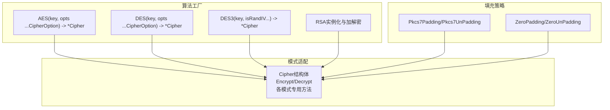
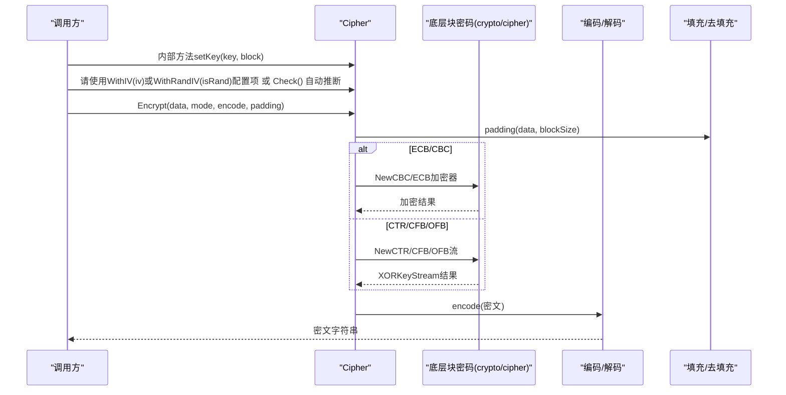
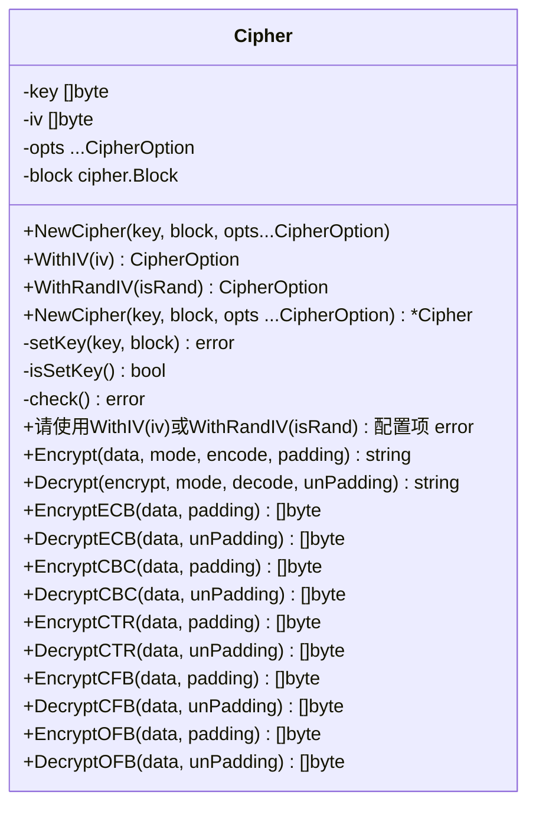
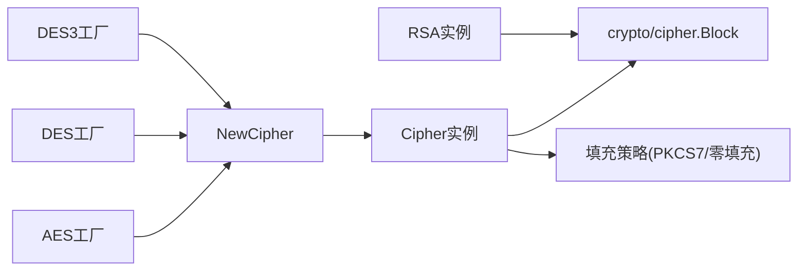

# 加密解密API

<cite>
**本文档引用的文件**
- [cipher.go](file://cipher.go)
- [aes.go](file://aes.go)
- [des.go](file://des.go)
- [rsa.go](file://rsa.go)
- [pkcs7.go](file://pkcs7.go)
- [zero.go](file://zero.go)
- [consts.go](file://consts.go)
- [types.go](file://types.go)
- [cipher_test.go](file://cipher_test.go)
- [aes_test.go](file://aes_test.go)
- [des_test.go](file://des_test.go)
- [rsa_test.go](file://rsa_test.go)
</cite>

## 目录

1. [简介](#简介)
2. [项目结构](#项目结构)
3. [核心组件](#核心组件)
4. [架构总览](#架构总览)
5. [详细组件分析](#详细组件分析)
6. [依赖关系分析](#依赖关系分析)
7. [性能考量](#性能考量)
8. [故障排查指南](#故障排查指南)
9. [结论](#结论)
10. [附录](#附录)

## 简介

本文件为加密解密模块的API参考文档，聚焦于对称加密与非对称加密两大类算法的统一抽象与使用方式。文档覆盖以下要点：

- Cipher结构体的完整API：构造函数、密钥设置、IV设置、通用加解密入口与各模式专用加解密方法
- 加密模式：ECB、CBC、CTR、CFB、OFB
- 填充机制：PKCS7、零填充
- 算法支持：AES、DES、3DES、RSA
- 错误处理与参数校验规则
- 每个API的函数签名、参数说明、返回值描述与使用示例（以测试用例路径形式给出）

## 项目结构

该模块采用“算法工厂 + 模式适配 + 填充策略”的分层设计：

- 算法工厂：AES、DES、DES3、RSA的便捷构造函数
- 模式适配：Cipher封装具体算法与模式，统一对外接口
- 填充策略：PKCS7与零填充的填充/去填充函数
- 类型与常量：加密模式枚举、编码/解码/填充函数类型定义

图表来源

- [aes.go](file://aes.go#L12-L22)
- [des.go](file://des.go#L12-L27)
- [des.go](file://des.go#L33-L44)
- [cipher.go](file://cipher.go#L20-L25)
- [pkcs7.go](file://pkcs7.go#L8-L15)
- [zero.go](file://zero.go#L8-L15)
- [rsa.go](file://rsa.go#L18-L21)

章节来源

- [cipher.go](file://cipher.go#L1-L498)
- [aes.go](file://aes.go#L1-L23)
- [des.go](file://des.go#L1-L45)
- [rsa.go](file://rsa.go#L1-L527)
- [pkcs7.go](file://pkcs7.go#L1-L31)
- [zero.go](file://zero.go#L1-L29)
- [consts.go](file://consts.go#L5-L12)
- [types.go](file://types.go#L44-L74)

## 核心组件

- Cipher结构体：封装密钥、IV、块密码实例，提供统一的加解密入口与各模式专用方法
- 算法工厂：AES、DES、DES3、RSA的便捷构造函数
- 填充策略：PKCS7与零填充的填充/去填充函数
- 类型与常量：加密模式枚举、编码/解码/填充函数类型定义

章节来源

- [cipher.go](file://cipher.go#L20-L25)
- [aes.go](file://aes.go#L12-L22)
- [des.go](file://des.go#L12-L27)
- [des.go](file://des.go#L33-L44)
- [rsa.go](file://rsa.go#L18-L21)
- [pkcs7.go](file://pkcs7.go#L8-L15)
- [zero.go](file://zero.go#L8-L15)
- [consts.go](file://consts.go#L5-L12)
- [types.go](file://types.go#L44-L74)

## 架构总览

下图展示Cipher在不同加密模式下的调用流程与关键校验点。

图表来源

- [cipher.go](file://cipher.go#L42-L58)
- [cipher.go](file://cipher.go#L86-L99)
- [cipher.go](file://cipher.go#L101-L119)
- [cipher.go](file://cipher.go#L139-L171)
- [cipher.go](file://cipher.go#L210-L242)
- [cipher.go](file://cipher.go#L281-L313)
- [cipher.go](file://cipher.go#L352-L384)

## 详细组件分析

### Cipher结构体与核心API

- 结构体字段
    - key：密钥字节数组
    - iv：初始化向量字节数组
    - isRandIV：是否随机生成IV并置于密文头部
    - block：底层块密码实例
- 关键方法
    - NewCipher：构造函数，完成密钥设置与可选的IV配置（通过CipherOption）
    - check：内部校验密钥与IV状态
    - WithIV：CipherOption，设置固定IV（长度需与块大小一致）
    - WithRandIV：CipherOption，设置是否随机生成IV
    - Encrypt/Decrypt：通用入口，根据模式分派到各模式方法
    -
    各模式专用方法：EncryptECB/DecryptECB、EncryptCBC/DecryptCBC、EncryptCTR/DecryptCTR、EncryptCFB/DecryptCFB、EncryptOFB/DecryptOFB

章节来源

- [cipher.go](file://cipher.go#L20-L25)
- [cipher.go](file://cipher.go#L27-L40)
- [cipher.go](file://cipher.go#L42-L58)
- [cipher.go](file://cipher.go#L60-L66)
- [cipher.go](file://cipher.go#L68-L84)
- [cipher.go](file://cipher.go#L86-L99)
- [cipher.go](file://cipher.go#L423-L460)
- [cipher.go](file://cipher.go#L462-L497)

#### Cipher类图

图表来源

- [cipher.go](file://cipher.go#L20-L25)
- [cipher.go](file://cipher.go#L27-L40)
- [cipher.go](file://cipher.go#L42-L58)
- [cipher.go](file://cipher.go#L68-L84)
- [cipher.go](file://cipher.go#L86-L99)
- [cipher.go](file://cipher.go#L101-L119)
- [cipher.go](file://cipher.go#L139-L171)
- [cipher.go](file://cipher.go#L210-L242)
- [cipher.go](file://cipher.go#L281-L313)
- [cipher.go](file://cipher.go#L352-L384)

### AES算法API

- 函数签名
    - AES(key string, opts ...CipherOption) (*Cipher, error)
- 参数说明
    - key：AES密钥，长度必须为16、24或32字节
    - isRandIV：可选布尔参数，控制是否在密文中携带随机IV
- 返回值
    - 成功：返回Cipher指针
    - 失败：返回错误
- 使用示例（测试用例路径）
    - [AES基本用法与各模式对比](file://aes_test.go#L52-L93)
    - [AES随机IV模式用法](file://aes_test.go#L118-L146)

章节来源

- [aes.go](file://aes.go#L12-L22)
- [aes_test.go](file://aes_test.go#L10-L148)

### DES与3DES算法API

- 函数签名
    - DES(key string, opts ...CipherOption) (*Cipher, error)
    - DES3(key string, isRandIV ...bool) (*Cipher, error)
- 参数说明
    - DES：key长度必须为8字节；若传入24字节则自动走3DES分支
    - DES3：key长度必须为24字节
    - isRandIV：可选布尔参数，控制是否在密文中携带随机IV
- 返回值
    - 成功：返回Cipher指针
    - 失败：返回错误
- 使用示例（测试用例路径）
    - [DES基本用法与各模式对比](file://des_test.go#L44-L81)
    - [DES3用法与各模式对比](file://des_test.go#L36-L42)

章节来源

- [des.go](file://des.go#L12-L27)
- [des.go](file://des.go#L33-L44)
- [des_test.go](file://des_test.go#L10-L82)

### RSA算法API

- 结构体
    - RSA：包含公钥与私钥字段
- 方法
    - NewRSA(pub, pri, opts ...RSAOption)：同时设置公钥与私钥
    - NewPubRSA(pub, opts...RSAOption)：仅设置公钥
    - NewPriRSA(pri, opts...RSAOption)：仅设置私钥
    - SetPublicKey/publicKey：设置公钥（支持文件路径或直接传入PEM字符串）
    - SetPrivateKey/privateKey：设置私钥（支持文件路径或直接传入PEM字符串）
    - IsSetPublicKey/IsSetPrivateKey：校验公钥/私钥是否已设置
    - Encrypt/Decrypt：PKCS1v15加解密
    - EncryptOAEP/DecryptOAEP：OAEP加解密
    - Sign/Verify：PKCS1v15签名与验签
    - SignPSS/VerifyPSS：PSS签名与验签
    - GenerateKeyRSA：生成RSA密钥对（支持PKCS1/PKCS8）
    - RemovePEMHeaders/AddPEMHeaders：PEM头尾标记处理
- 使用示例（测试用例路径）
    - [RSA密钥生成与加解密](file://rsa_test.go#L22-L54)
    - [RSA公钥加密/私钥解密（PKCS1v15/OAEP）](file://rsa_test.go#L108-L143)
    - [RSA签名与验签（PKCS1v15/PSS）](file://rsa_test.go#L147-L237)
    - [PEM头尾标记处理](file://rsa_test.go#L240-L270)

章节来源

- [rsa.go](file://rsa.go#L18-L21)
- [rsa.go](file://rsa.go#L23-L33)
- [rsa.go](file://rsa.go#L35-L51)
- [rsa.go](file://rsa.go#L53-L97)
- [rsa.go](file://rsa.go#L99-L144)
- [rsa.go](file://rsa.go#L162-L223)
- [rsa.go](file://rsa.go#L268-L331)
- [rsa.go](file://rsa.go#L333-L375)
- [rsa.go](file://rsa.go#L377-L481)
- [rsa.go](file://rsa.go#L483-L527)
- [rsa_test.go](file://rsa_test.go#L22-L270)

### 加密模式API

- 模式枚举
    - ECB、CBC、CTR、CFB、OFB
- Cipher通用入口
    - Encrypt(data, mode, encode, padding) string
    - Decrypt(encrypt, mode, decode, unPadding) string
- 各模式专用方法
    - ECB：EncryptECB/DecryptECB
    - CBC：EncryptCBC/DecryptCBC（支持随机IV）
    - CTR：EncryptCTR/DecryptCTR（支持随机IV）
    - CFB：EncryptCFB/DecryptCFB（支持随机IV）
    - OFB：EncryptOFB/DecryptOFB（支持随机IV）
- 参数说明
    - mode：加密模式枚举
    - encode/decode：编码/解码函数（如Base64、Hex）
    - padding/unPadding：填充/去填充函数（PKCS7或零填充）
- 使用示例（测试用例路径）
    - [Cipher通用模式测试](file://cipher_test.go#L31-L61)
    - [AES各模式测试](file://aes_test.go#L25-L49)
    - [DES各模式测试](file://des_test.go#L24-L42)

章节来源

- [consts.go](file://consts.go#L5-L12)
- [cipher.go](file://cipher.go#L423-L460)
- [cipher.go](file://cipher.go#L462-L497)
- [cipher.go](file://cipher.go#L101-L119)
- [cipher.go](file://cipher.go#L139-L171)
- [cipher.go](file://cipher.go#L210-L242)
- [cipher.go](file://cipher.go#L281-L313)
- [cipher.go](file://cipher.go#L352-L384)
- [cipher_test.go](file://cipher_test.go#L10-L62)
- [aes_test.go](file://aes_test.go#L10-L148)
- [des_test.go](file://des_test.go#L10-L82)

### 填充机制API

- PKCS7填充
    - Pkcs7Padding(data []byte, blockSize int) []byte
    - Pkcs7UnPadding(data []byte) ([]byte, error)
- 零填充
    - ZeroPadding(data []byte, blockSize int) []byte
    - ZeroUnPadding(data []byte) ([]byte, error)
- 使用示例（测试用例路径）
    - [AES各模式+PKCS7填充测试](file://aes_test.go#L25-L49)
    - [DES各模式+PKCS7填充测试](file://des_test.go#L24-L42)

章节来源

- [pkcs7.go](file://pkcs7.go#L8-L15)
- [pkcs7.go](file://pkcs7.go#L17-L30)
- [zero.go](file://zero.go#L8-L15)
- [zero.go](file://zero.go#L17-L29)
- [aes_test.go](file://aes_test.go#L25-L49)
- [des_test.go](file://des_test.go#L24-L42)

### 错误处理与参数验证规则

- 密钥长度校验
    - AES：16、24、32字节
    - DES：8字节；24字节时走DES3
    - DES3：24字节
- IV长度校验
    - AES：16字节
    - DES：8字节
- 模式校验
    - Encrypt/Decrypt：mode必须为合法枚举值
- 随机IV行为
    - isRandIV=true：加密时随机生成IV并置于密文头部；解密时自动从密文头部提取IV
- 填充校验
    - CBC/CTR/CFB/OFB：需配合填充函数使用
    - ECB：可直接加密，但通常仍建议使用填充以保证完整性
- 错误包装
    - 所有错误均通过统一的错误包装工具返回，便于追踪

章节来源

- [aes.go](file://aes.go#L13-L17)
- [des.go](file://des.go#L13-L19)
- [des.go](file://des.go#L34-L36)
- [cipher.go](file://cipher.go#L44-L48)
- [cipher.go](file://cipher.go#L92-L95)
- [cipher.go](file://cipher.go#L440-L453)
- [cipher.go](file://cipher.go#L155-L162)
- [cipher.go](file://cipher.go#L226-L233)
- [cipher.go](file://cipher.go#L297-L304)
- [cipher.go](file://cipher.go#L368-L375)
- [cipher.go](file://cipher.go#L184-L190)
- [cipher.go](file://cipher.go#L254-L261)
- [cipher.go](file://cipher.go#L325-L332)
- [cipher.go](file://cipher.go#L396-L403)
- [pkcs7.go](file://pkcs7.go#L18-L30)
- [zero.go](file://zero.go#L17-L29)

## 依赖关系分析

- Cipher依赖底层块密码接口（crypto/cipher.Block）
- AES/DES/DES3通过NewCipher工厂函数创建Cipher实例
- 填充策略作为回调注入到Encrypt/Decrypt流程
- RSA独立于Cipher，提供自身的一套公私钥管理与加解密方法

图表来源

- [aes.go](file://aes.go#L21)
- [des.go](file://des.go#L26)
- [des.go](file://des.go#L43)
- [cipher.go](file://cipher.go#L32-L40)
- [cipher.go](file://cipher.go#L24)
- [pkcs7.go](file://pkcs7.go#L8-L15)
- [zero.go](file://zero.go#L8-L15)
- [rsa.go](file://rsa.go#L18-L21)

章节来源

- [aes.go](file://aes.go#L12-L22)
- [des.go](file://des.go#L12-L44)
- [cipher.go](file://cipher.go#L20-L25)
- [pkcs7.go](file://pkcs7.go#L8-L15)
- [zero.go](file://zero.go#L8-L15)
- [rsa.go](file://rsa.go#L18-L21)

## 性能考量

- 模式选择
    - ECB：简单快速，但安全性较低，不建议用于长文本或重复明文场景
    - CBC/CTR/CFB/OFB：更安全，适合大多数场景；CTR通常具有较好的并发性能
- 填充开销
    - PKCS7填充在明文长度非块大小整数倍时增加额外字节，需注意编码后的体积
- 随机IV
    - isRandIV=true时，密文头部包含IV，增加少量存储开销，但提升安全性
- RSA
    - 适用于小数据或对称密钥的保护；长文本建议先用对称加密，再用RSA保护对称密钥

## 故障排查指南

- “请先设置密钥”
    - 现象：调用Encrypt/Decrypt前未通过工厂函数设置密钥
    - 处理：使用AES/DES/DES3工厂函数构造Cipher实例
- “IV长度不正确”
    - 现象：IV长度与块大小不一致（AES=16字节，DES=8字节）
    - 处理：确保IV长度与所用算法块大小一致
- “密文太短”或“密文不是块大小的倍数”
    - 现象：使用CBC/CTR/CFB/OFB且isRandIV=false时，密文长度异常
    - 处理：确认密文来源正确，或开启isRandIV以自动处理IV
- “错误的加密模式”
    - 现象：mode参数非法
    - 处理：使用合法的枚举值（ECB/CBC/CTR/CFB/OFB）
- “Pkcs7UnPadding() data 参数长度必须大于0！”
    - 现象：去填充时传入空数据
    - 处理：确保解密后数据非空

章节来源

- [cipher.go](file://cipher.go#L68-L84)
- [cipher.go](file://cipher.go#L86-L99)
- [cipher.go](file://cipher.go#L184-L195)
- [cipher.go](file://cipher.go#L254-L266)
- [cipher.go](file://cipher.go#L325-L337)
- [cipher.go](file://cipher.go#L396-L408)
- [cipher.go](file://cipher.go#L440-L453)
- [pkcs7.go](file://pkcs7.go#L18-L30)
- [zero.go](file://zero.go#L17-L29)

## 结论

本模块提供了统一、易用且健壮的对称与非对称加密API，通过Cipher抽象屏蔽了底层差异，结合多种填充策略与加密模式，满足不同场景的安全需求。建议在生产环境中优先使用CBC/CTR等模式，并配合PKCS7填充与随机IV，以获得更高的安全性与兼容性。

## 附录

- 常用函数签名速查
    - AES(key string, opts ...CipherOption) (*Cipher, error)
    - DES(key string, opts ...CipherOption) (*Cipher, error)
    - DES3(key string, opts ...CipherOption) (*Cipher, error)
    - NewCipher(key string, block CipherBlock, opts ...CipherOption) (*Cipher, error)
    - WithIV(iv string) CipherOption
    - WithRandIV(isRand bool) CipherOption
    - Cipher.Encrypt(data string, mode McryptMode, encode Encode, padding Padding) string
    - Cipher.Decrypt(encrypt string, mode McryptMode, decode Decode, unPadding UnPadding) string
    - Pkcs7Padding(data []byte, blockSize int) []byte
    - Pkcs7UnPadding(data []byte) ([]byte, error)
    - ZeroPadding(data []byte, blockSize int) []byte
    - ZeroUnPadding(data []byte) ([]byte, error)
    - RSA.NewRSA(pub, pri string, opts ...RSAOption) (*RSA, error)
    - RSA.Encrypt(data string, encode Encode) (string, error)
    - RSA.Decrypt(encrypt string, decode Decode) (string, error)
    - RSA.EncryptOAEP(data string, encode Encode, hash hash.Hash) (string, error)
    - RSA.DecryptOAEP(encrypt string, decode Decode, hash hash.Hash) (string, error)
    - RSA.Sign(data string, hash crypto.Hash, encode Encode) (string, error)
    - RSA.Verify(data, sign string, hash crypto.Hash, decode Decode) error
    - RSA.SignPSS(data string, hash crypto.Hash, encode Encode, opts *rsa.PSSOptions) (string, error)
    - RSA.VerifyPSS(data, sign string, hash crypto.Hash, decode Decode, opts *rsa.PSSOptions) error
    - RSA.GenerateKeyRSA(path string, bits int, pkcs ...bool) ([]string, error)
    - RSA.RemovePEMHeaders(pem string) string
    - RSA.AddPEMHeaders(key, keyType string) (string, error)

- 使用示例（测试用例路径）
    - [Cipher通用模式测试](file://cipher_test.go#L31-L61)
    - [AES各模式测试](file://aes_test.go#L25-L49)
    - [AES随机IV测试](file://aes_test.go#L118-L146)
    - [DES各模式测试](file://des_test.go#L24-L42)
    - [RSA密钥生成与加解密](file://rsa_test.go#L22-L54)
    - [RSA公钥加密/私钥解密（PKCS1v15/OAEP）](file://rsa_test.go#L108-L143)
    - [RSA签名与验签（PKCS1v15/PSS）](file://rsa_test.go#L147-L237)
    - [PEM头尾标记处理](file://rsa_test.go#L240-L270)