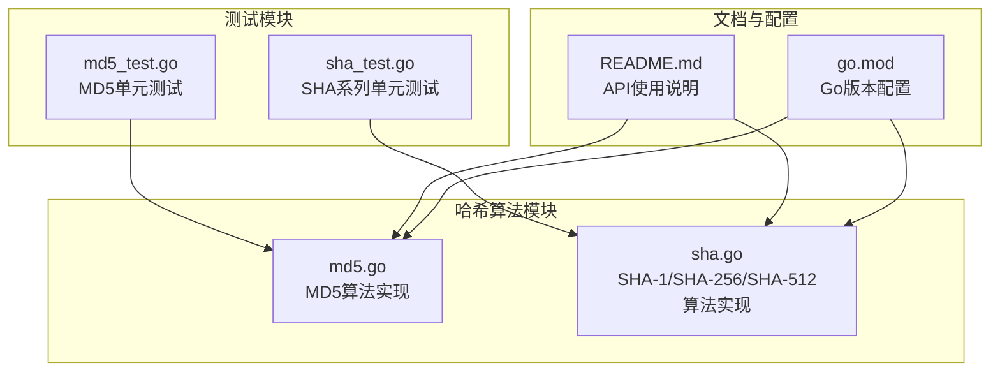
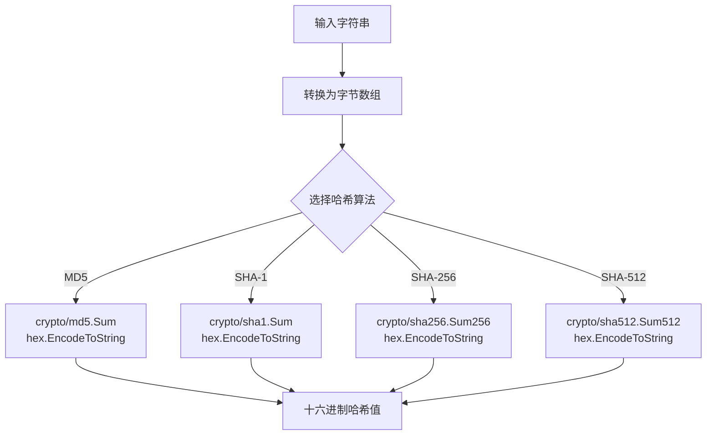
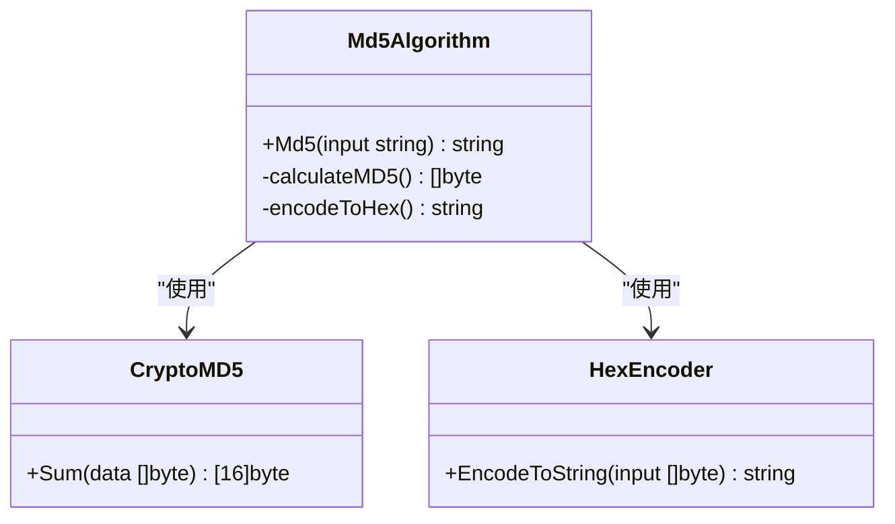
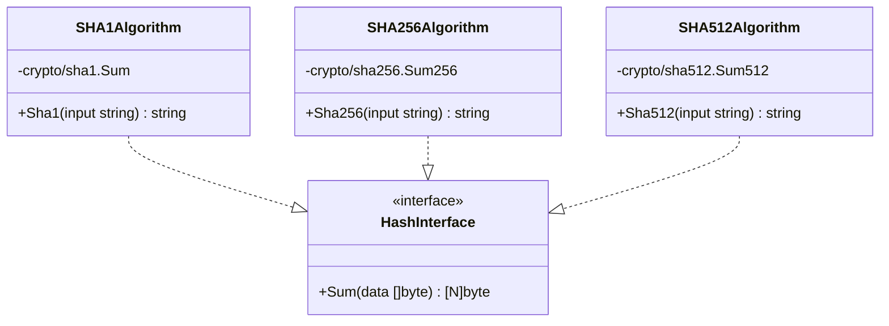
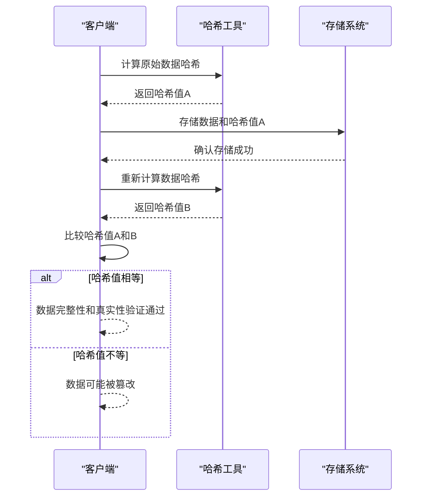
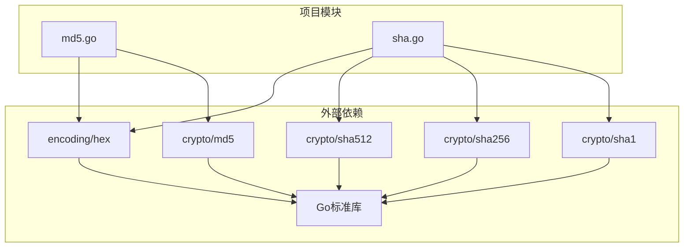

# 哈希算法API

<cite>
**本文档引用的文件**
- [md5.go](file://md5.go)
- [sha.go](file://sha.go)
- [md5_test.go](file://md5_test.go)
- [sha_test.go](file://sha_test.go)
- [README.md](file://README.md)
- [go.mod](file://go.mod)
</cite>

## 目录

1. [简介](#简介)
2. [项目结构](#项目结构)
3. [核心组件](#核心组件)
4. [架构概览](#架构概览)
5. [详细组件分析](#详细组件分析)
6. [依赖分析](#依赖分析)
7. [性能考虑](#性能考虑)
8. [故障排除指南](#故障排除指南)
9. [结论](#结论)
10. [附录](#附录)

## 简介

本文件为哈希算法API的详细参考文档，专注于MD5和SHA系列算法的实现与使用。文档涵盖以下内容：

- MD5哈希算法的实现原理与应用场景
- SHA-1、SHA-256、SHA-512等不同强度哈希算法的特点与选择原则
- 哈希值的生成、比较与验证功能
- 各种哈希算法的完整使用示例，包括文件哈希计算、数据完整性校验和密码存储
- 不同哈希算法的安全性评估与适用场景

## 项目结构

该项目采用简洁的模块化设计，哈希算法相关的核心代码位于以下文件：

- md5.go：提供MD5哈希算法的实现
- sha.go：提供SHA-1、SHA-256、SHA-512三种哈希算法的实现
- md5_test.go：MD5算法的单元测试
- sha_test.go：SHA系列算法的单元测试
- README.md：包含完整的API使用说明与示例
- go.mod：项目Go版本配置（1.22）

**图表来源**

- [md5.go](file://md5.go#L1-L13)
- [sha.go](file://sha.go#L1-L27)
- [md5_test.go](file://md5_test.go#L1-L28)
- [sha_test.go](file://sha_test.go#L1-L70)
- [README.md](file://README.md#L1603-L1647)
- [go.mod](file://go.mod#L1-L4)

**章节来源**

- [md5.go](file://md5.go#L1-L13)
- [sha.go](file://sha.go#L1-L27)
- [README.md](file://README.md#L1603-L1647)
- [go.mod](file://go.mod#L1-L4)

## 核心组件

本项目提供的哈希算法API非常简洁，仅包含三个核心函数：

### MD5算法

- 函数名：Md5
- 输入：字符串
- 输出：十六进制编码的MD5哈希值
- 特点：基于Go标准库crypto/md5实现，返回固定长度的32字符十六进制字符串

### SHA系列算法

- 函数名：Sha1、Sha256、Sha512
- 输入：字符串
- 输出：对应算法的十六进制编码哈希值
- 特点：
    - Sha1：返回40字符十六进制字符串
    - Sha256：返回64字符十六进制字符串
    - Sha512：返回128字符十六进制字符串

### 数据处理流程

所有算法均遵循相同的处理模式：

1. 将输入字符串转换为字节数组
2. 调用相应算法的Sum函数计算哈希值
3. 使用hex编码将二进制哈希值转换为十六进制字符串

**章节来源**

- [md5.go](file://md5.go#L8-L12)
- [sha.go](file://sha.go#L10-L26)
- [README.md](file://README.md#L1607-L1644)

## 架构概览

哈希算法API采用极简架构设计，所有功能均由标准库支持：

**图表来源**

- [md5.go](file://md5.go#L9-L11)
- [sha.go](file://sha.go#L11-L25)

### 算法复杂度分析

- 时间复杂度：O(n)，其中n为输入字符串长度
- 空间复杂度：O(n)，用于存储输入字节数组和中间结果
- 所有操作均为线性时间复杂度，适合大规模数据处理

## 详细组件分析

### MD5算法实现分析

MD5算法是最简单的哈希实现，具有以下特点：

**图表来源**

- [md5.go](file://md5.go#L9-L11)

#### 实现细节

- 使用crypto/md5包的Sum函数计算哈希值
- 通过encoding/hex包进行十六进制编码
- 返回固定长度的32字符十六进制字符串

#### 安全性评估

- 已知存在碰撞攻击，不适用于安全敏感场景
- 适合数据完整性校验和非安全用途
- 不建议用于密码存储

**章节来源**

- [md5.go](file://md5.go#L1-L13)
- [md5_test.go](file://md5_test.go#L8-L26)

### SHA系列算法实现分析

SHA系列算法提供不同强度的安全保障：

**图表来源**

- [sha.go](file://sha.go#L10-L26)

#### 算法特性对比

| 算法      | 输出长度  | 安全性等级 | 适用场景    | 性能特征 |
|---------|-------|-------|---------|------|
| MD5     | 32字符  | 低     | 数据完整性校验 | 最快   |
| SHA-1   | 40字符  | 低     | 历史兼容性   | 快    |
| SHA-256 | 64字符  | 中高    | 一般安全应用  | 中等   |
| SHA-512 | 128字符 | 高     | 高安全性应用  | 较慢   |

**章节来源**

- [sha.go](file://sha.go#L1-L27)
- [sha_test.go](file://sha_test.go#L8-L69)

### 使用示例与最佳实践

#### 基本使用模式

所有哈希算法均遵循统一的使用模式：

1. 导入utils包
2. 调用相应函数（Md5、Sha1、Sha256、Sha512）
3. 处理返回的十六进制字符串

#### 数据完整性校验示例

**图表来源**

- [md5.go](file://md5.go#L9-L11)
- [sha.go](file://sha.go#L11-L25)

## 依赖分析

哈希算法API的依赖关系极其简单，仅依赖Go标准库：

**图表来源**

- [md5.go](file://md5.go#L3-L8)
- [sha.go](file://sha.go#L3-L8)

### 依赖关系特点

- **低耦合**：每个模块只依赖必要的标准库功能
- **无循环依赖**：所有依赖都是单向的外部依赖
- **版本兼容性**：基于Go 1.22标准库，确保跨平台兼容性

**章节来源**

- [md5.go](file://md5.go#L3-L8)
- [sha.go](file://sha.go#L3-L8)
- [go.mod](file://go.mod#L1-L4)

## 性能考虑

哈希算法的性能特征直接影响实际应用的选择：

### 时间复杂度分析

- **线性时间复杂度**：O(n)，与输入数据长度成正比
- **内存占用**：O(n)，需要临时存储输入数据
- **常数因子**：SHA-512 > SHA-256 > SHA-1 > MD5

### 性能优化建议

1. **批量处理**：对于大量数据，考虑分块处理以减少内存峰值
2. **算法选择**：根据安全需求选择合适强度的算法
3. **缓存策略**：对重复计算的结果进行缓存

### 性能基准测试

项目提供了完整的单元测试，可用于性能基准测试：

- 测试覆盖所有主要算法
- 包含多个测试用例验证正确性
- 可作为性能测试的基础框架

**章节来源**

- [md5_test.go](file://md5_test.go#L8-L26)
- [sha_test.go](file://sha_test.go#L8-L69)

## 故障排除指南

### 常见问题与解决方案

#### 1. 算法选择困惑

**问题**：不知道选择哪种哈希算法
**解决方案**：

- 一般数据完整性校验：SHA-256
- 高安全性应用：SHA-512
- 历史兼容性：SHA-1
- 不推荐：MD5（存在安全漏洞）

#### 2. 输出格式不一致

**问题**：不同系统返回的哈希值不一致
**解决方案**：

- 确保输入数据完全相同（包括空白字符）
- 检查编码格式（UTF-8）
- 验证十六进制编码的一致性

#### 3. 性能问题

**问题**：处理大数据时性能不佳
**解决方案**：

- 考虑分块处理策略
- 使用更高效的算法（如SHA-256）
- 实施缓存机制

### 调试技巧

1. **单元测试验证**：使用提供的测试用例验证实现正确性
2. **边界条件测试**：测试空字符串、特殊字符等边界情况
3. **性能监控**：监控内存使用和执行时间

**章节来源**

- [md5_test.go](file://md5_test.go#L8-L26)
- [sha_test.go](file://sha_test.go#L8-L69)

## 结论

本哈希算法API提供了简洁、高效的数据完整性校验解决方案。其设计特点包括：

### 优势

- **简洁性**：仅包含必要的哈希算法，易于理解和使用
- **性能**：基于标准库实现，性能稳定可靠
- **兼容性**：支持多种主流哈希算法，满足不同需求
- **测试完善**：提供完整的单元测试，确保代码质量

### 适用场景

- 数据完整性校验
- 文件指纹生成
- 非安全性的数据标识
- 历史兼容性需求

### 安全建议

- 避免在安全敏感场景使用MD5
- 优先选择SHA-256或更高强度算法
- 考虑使用专门的密码学哈希函数（如bcrypt、scrypt）进行密码存储

## 附录

### API参考表

#### MD5算法

| 函数  | 参数     | 返回值    | 说明                     |
|-----|--------|--------|------------------------|
| Md5 | string | string | 计算MD5哈希值，返回32字符十六进制字符串 |

#### SHA算法

| 函数     | 参数     | 返回值    | 说明                          |
|--------|--------|--------|-----------------------------|
| Sha1   | string | string | 计算SHA-1哈希值，返回40字符十六进制字符串    |
| Sha256 | string | string | 计算SHA-256哈希值，返回64字符十六进制字符串  |
| Sha512 | string | string | 计算SHA-512哈希值，返回128字符十六进制字符串 |

### 使用示例路径

- MD5基本使用：[md5.go](file://md5.go#L9-L11)
- SHA-1使用：[sha.go](file://sha.go#L11-L13)
- SHA-256使用：[sha.go](file://sha.go#L17-L19)
- SHA-512使用：[sha.go](file://sha.go#L23-L25)

### 测试用例参考

- MD5测试：[md5_test.go](file://md5_test.go#L8-L26)
- SHA-1测试：[sha_test.go](file://sha_test.go#L8-L26)
- SHA-256测试：[sha_test.go](file://sha_test.go#L29-L47)
- SHA-512测试：[sha_test.go](file://sha_test.go#L50-L68)