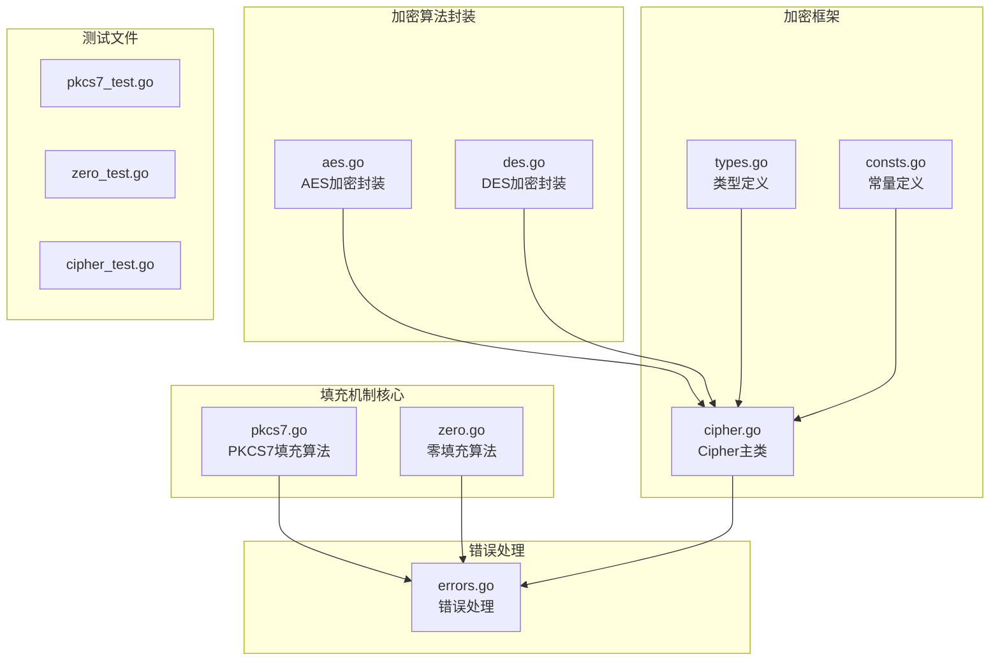
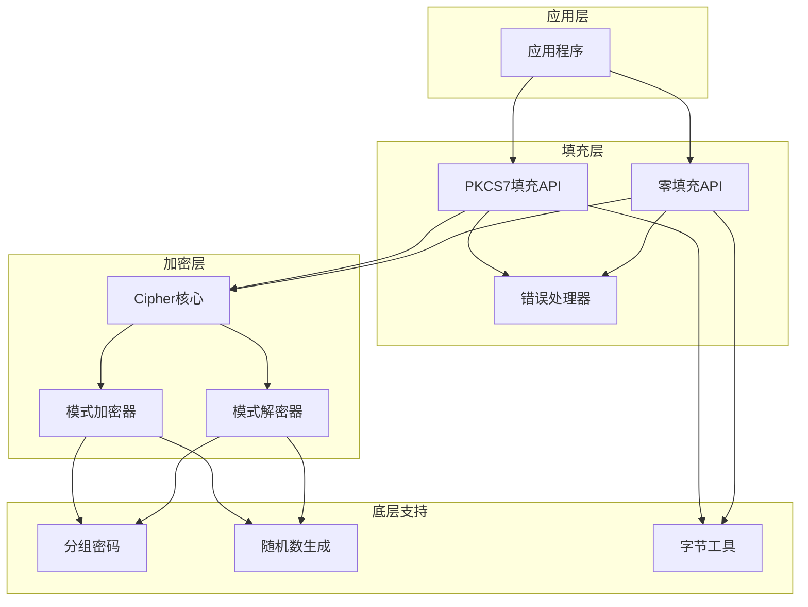
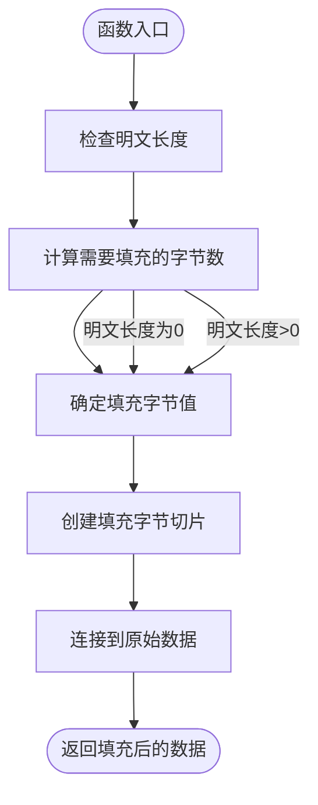
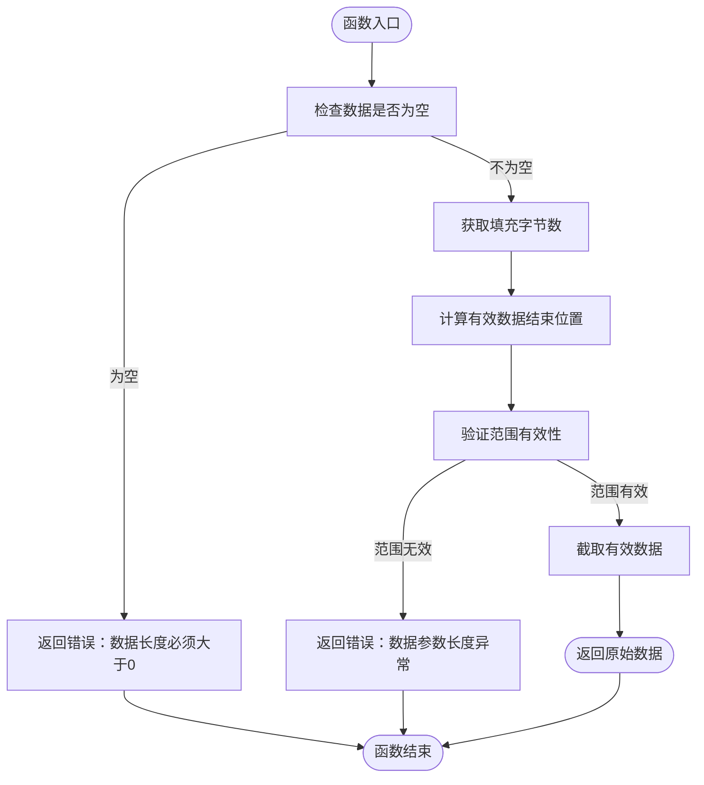
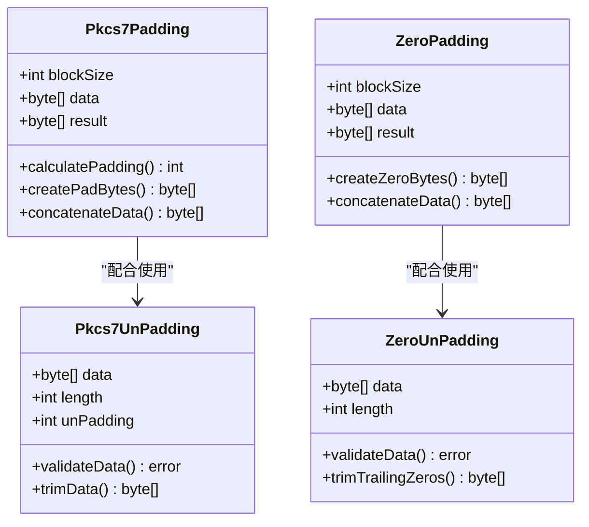
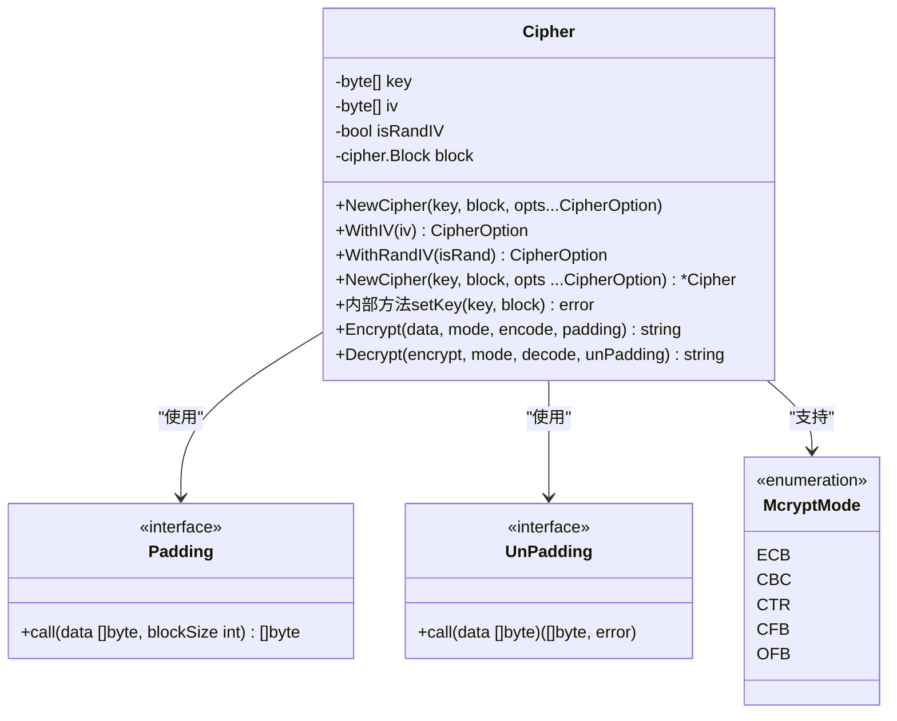
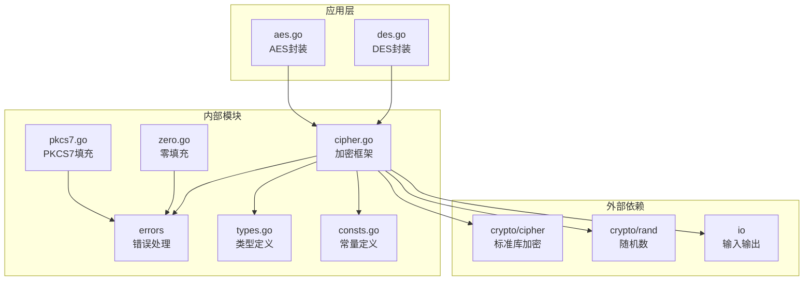
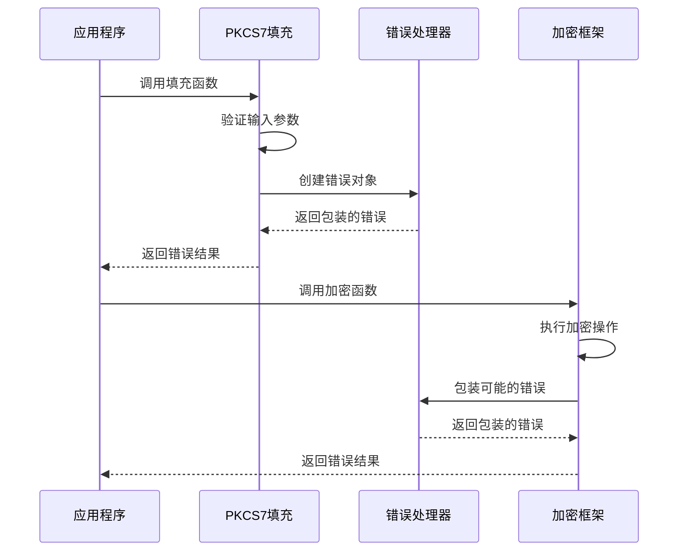
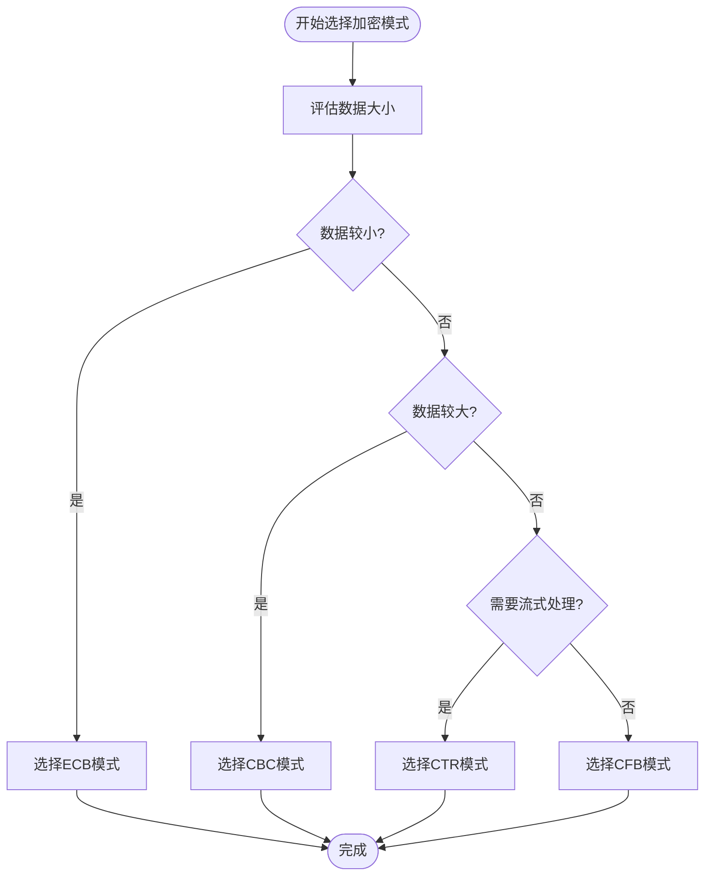

# 填充机制API

<cite>
**本文档引用的文件**
- [pkcs7.go](file://pkcs7.go)
- [zero.go](file://zero.go)
- [cipher.go](file://cipher.go)
- [types.go](file://types.go)
- [consts.go](file://consts.go)
- [aes.go](file://aes.go)
- [des.go](file://des.go)
- [errors.go](file://errors/errors.go)
- [pkcs7_test.go](file://pkcs7_test.go)
- [zero_test.go](file://zero_test.go)
- [cipher_test.go](file://cipher_test.go)
</cite>

## 目录

1. [简介](#简介)
2. [项目结构](#项目结构)
3. [核心组件](#核心组件)
4. [架构概览](#架构概览)
5. [详细组件分析](#详细组件分析)
6. [依赖关系分析](#依赖关系分析)
7. [性能考虑](#性能考虑)
8. [故障排除指南](#故障排除指南)
9. [结论](#结论)

## 简介

本文档详细介绍了Go-utils库中的填充机制API，重点涵盖了PKCS7填充算法的完整实现和使用方法。填充机制在对称加密中扮演着至关重要的角色，特别是在分组密码算法中，确保明文数据能够适配加密算法的固定块大小要求。

该库提供了两种主要的填充方式：PKCS7填充和零填充，以及完整的加密和解密流程，支持多种加密模式（ECB、CBC、CTR、CFB、OFB）。文档将深入解析填充算法的实现原理、使用场景、错误处理机制，并提供实际的使用示例。

## 项目结构

Go-utils库采用模块化的文件组织方式，填充机制相关的代码分布在多个文件中：



**图表来源**

- [pkcs7.go](file://pkcs7.go#L1-L31)
- [cipher.go](file://cipher.go#L1-L498)
- [types.go](file://types.go#L1-L98)

**章节来源**

- [pkcs7.go](file://pkcs7.go#L1-L31)
- [zero.go](file://zero.go#L1-L29)
- [cipher.go](file://cipher.go#L1-L498)
- [types.go](file://types.go#L1-L98)
- [consts.go](file://consts.go#L1-L23)

## 核心组件

### 填充算法接口

填充机制API的核心是两个主要的填充函数：

1. **PKCS7填充算法** (`Pkcs7Padding`)
2. **零填充算法** (`ZeroPadding`)

这两个函数都遵循相同的接口模式，接受原始数据和块大小参数，返回填充后的字节数组。

### 去填充算法接口

对应的去填充函数提供完整的反向操作：

1. **PKCS7去填充** (`Pkcs7UnPadding`)
2. **零去填充** (`ZeroUnPadding`)

这些函数负责从填充后的数据中恢复原始明文。

### 加密框架集成

填充机制与Cipher加密框架深度集成，支持多种加密模式：

- **ECB模式**：无需IV，适合小数据块
- **CBC模式**：需要IV，最常用的模式
- **CTR模式**：流密码模式
- **CFB模式**：流密码模式
- **OFB模式**：流密码模式

**章节来源**

- [pkcs7.go](file://pkcs7.go#L8-L30)
- [zero.go](file://zero.go#L8-L28)
- [cipher.go](file://cipher.go#L10-L498)
- [types.go](file://types.go#L46-L74)

## 架构概览

填充机制API采用分层架构设计，确保了高内聚低耦合的代码结构：



**图表来源**

- [cipher.go](file://cipher.go#L20-L25)
- [types.go](file://types.go#L46-L74)
- [errors.go](file://errors/errors.go#L14-L53)

## 详细组件分析

### PKCS7填充算法

PKCS7填充是最广泛使用的填充标准，特别适用于对称加密算法。

#### 算法原理

PKCS7填充的核心思想是在明文末尾添加特定数量的字节，每个字节的值等于需要填充的总字节数：

```
填充长度 = 块大小 - (明文长度 % 块大小)
```

例如，在AES算法中（块大小16字节）：

- 明文长度为15字节时，填充1字节，值为0x01
- 明文长度为10字节时，填充6字节，每个字节值为0x06
- 明文长度为16字节时，填充16字节，每个字节值为0x10

#### 实现细节



**图表来源**

- [pkcs7.go](file://pkcs7.go#L9-L15)

#### 错误处理机制

PKCS7去填充提供了严格的错误检查：



**图表来源**

- [pkcs7.go](file://pkcs7.go#L18-L30)

**章节来源**

- [pkcs7.go](file://pkcs7.go#L8-L30)

### 零填充算法

零填充是一种简单的填充方式，使用0字节进行填充。

#### 算法特点

零填充相比PKCS7填充更加简单直接：

- 填充字节值始终为0
- 去填充时需要移除所有尾随的0字节
- 不提供填充长度信息，仅能通过上下文推断

#### 实现差异



**图表来源**

- [pkcs7.go](file://pkcs7.go#L8-L30)
- [zero.go](file://zero.go#L8-L28)

**章节来源**

- [zero.go](file://zero.go#L8-L28)

### 加密框架集成

填充机制与Cipher加密框架的集成体现了良好的设计原则：

#### 类型系统设计



**图表来源**

- [cipher.go](file://cipher.go#L20-L25)
- [types.go](file://types.go#L46-L74)
- [consts.go](file://consts.go#L4-L10)

#### 模式特定的填充策略

不同的加密模式对填充有不同的需求：

| 模式  | 填充需求 | 原因             | IV要求 |
|-----|------|----------------|------|
| ECB | 必需   | 明文长度必须是块大小的整数倍 | 无    |
| CBC | 必需   | 明文长度必须是块大小的整数倍 | 有    |
| CTR | 可选   | 流密码不需要填充       | 有    |
| CFB | 可选   | 流密码不需要填充       | 有    |
| OFB | 可选   | 流密码不需要填充       | 有    |

**章节来源**

- [cipher.go](file://cipher.go#L10-L18)
- [consts.go](file://consts.go#L4-L10)

## 依赖关系分析

填充机制API的依赖关系体现了清晰的层次结构：



**图表来源**

- [cipher.go](file://cipher.go#L3-L8)
- [pkcs7.go](file://pkcs7.go#L3-L6)
- [zero.go](file://zero.go#L3-L6)

### 错误处理策略

错误处理是填充机制API的重要组成部分，采用了统一的错误包装策略：



**图表来源**

- [errors.go](file://errors/errors.go#L14-L53)
- [cipher.go](file://cipher.go#L42-L58)

**章节来源**

- [errors.go](file://errors/errors.go#L14-L53)
- [cipher.go](file://cipher.go#L42-L58)

## 性能考虑

### 时间复杂度分析

填充算法的时间复杂度为O(n)，其中n是明文数据的长度：

- **PKCS7填充**：O(n) - 需要计算填充字节数并创建相应数量的字节
- **零填充**：O(n) - 需要创建填充字节切片
- **去填充操作**：O(n) - 需要验证填充字节或移除尾随字节

### 空间复杂度分析

填充操作的空间复杂度同样为O(n)：

- 新增的填充字节数量取决于明文长度和块大小的比值
- 最坏情况下，填充字节数量为块大小-1

### 优化建议

1. **批量处理**：对于大量数据，考虑批量处理以减少函数调用开销
2. **内存复用**：在循环中重用缓冲区以减少内存分配
3. **零拷贝优化**：在某些情况下可以避免不必要的数据复制

## 故障排除指南

### 常见问题诊断

#### 填充相关错误

| 错误类型   | 可能原因           | 解决方案                             |
|--------|----------------|----------------------------------|
| 数据长度异常 | 去填充时检测到无效的填充字节 | 检查填充算法一致性，确认使用相同的填充方式            |
| IV长度错误 | CBC模式下IV长度不正确  | 确保IV长度与块大小一致（AES: 16字节，DES: 8字节） |
| 密文长度错误 | 密文长度不是块大小的整数倍  | 检查编码/解码过程，确认数据完整性                |

#### 加密模式选择



**图表来源**

- [cipher.go](file://cipher.go#L10-L18)

### 调试技巧

1. **验证填充一致性**：确保加密和解密使用相同的填充算法
2. **检查块大小**：确认使用的块大小与加密算法匹配
3. **验证密钥长度**：不同算法支持不同的密钥长度
4. **监控错误信息**：利用统一的错误处理机制获取详细的错误信息

**章节来源**

- [cipher.go](file://cipher.go#L10-L18)
- [errors.go](file://errors/errors.go#L14-L53)

## 结论

Go-utils库的填充机制API提供了完整、可靠且高效的填充解决方案。通过PKCS7和零填充两种算法，满足了不同应用场景的需求。API的设计充分考虑了安全性、性能和易用性，为开发者提供了灵活而强大的加密工具。

### 主要优势

1. **标准化实现**：PKCS7填充符合行业标准，确保与其他系统的兼容性
2. **错误处理**：完善的错误处理机制提供了可靠的错误诊断能力
3. **多模式支持**：支持多种加密模式，适应不同的安全需求
4. **类型安全**：强类型接口确保了编译时的类型检查
5. **性能优化**：合理的内存管理和算法选择保证了良好的性能表现

### 最佳实践建议

1. **优先使用PKCS7填充**：在大多数情况下，PKCS7填充提供了更好的安全性
2. **保持填充一致性**：确保加密和解密使用相同的填充算法
3. **正确选择加密模式**：根据具体需求选择合适的加密模式
4. **妥善管理密钥和IV**：确保密钥和初始化向量的安全存储和传输
5. **实施适当的错误处理**：利用提供的错误处理机制进行有效的错误管理

通过遵循这些指导原则，开发者可以充分利用Go-utils库的填充机制API，构建安全可靠的加密应用。