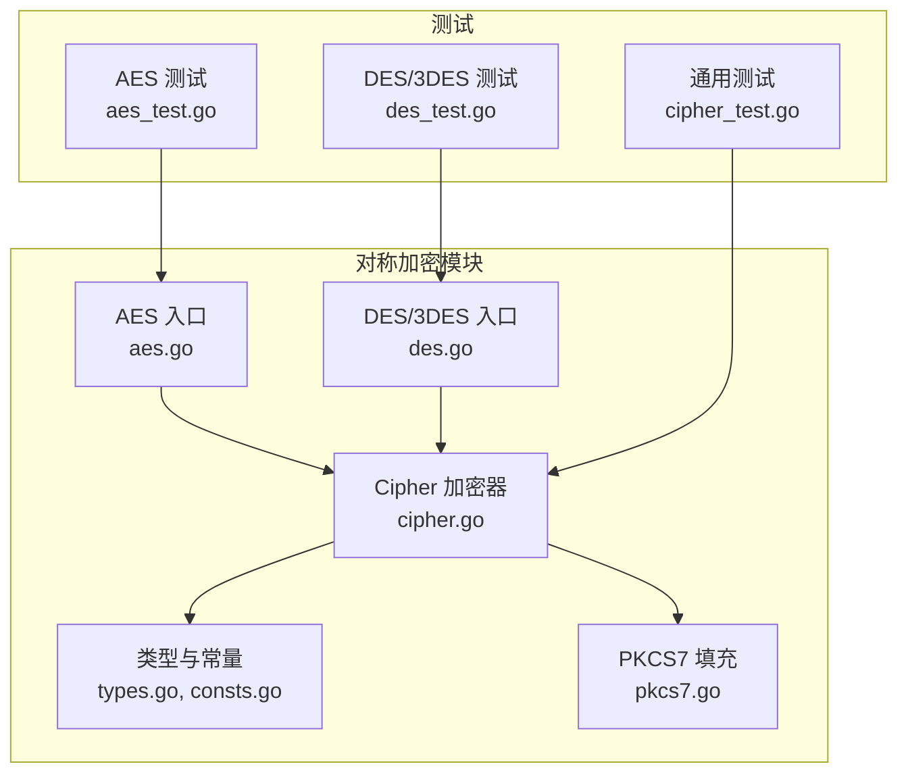
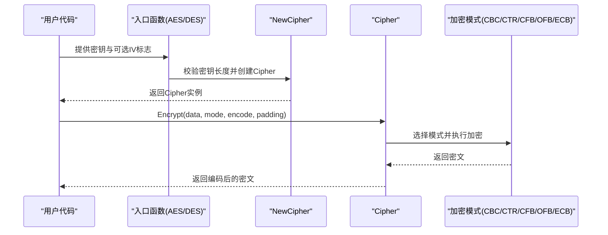
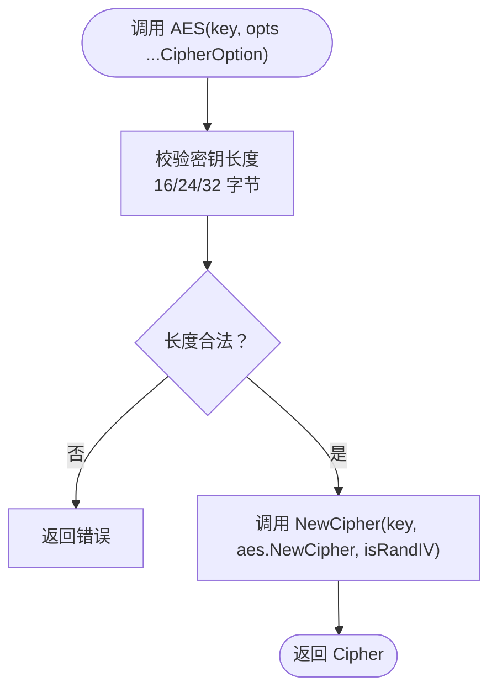
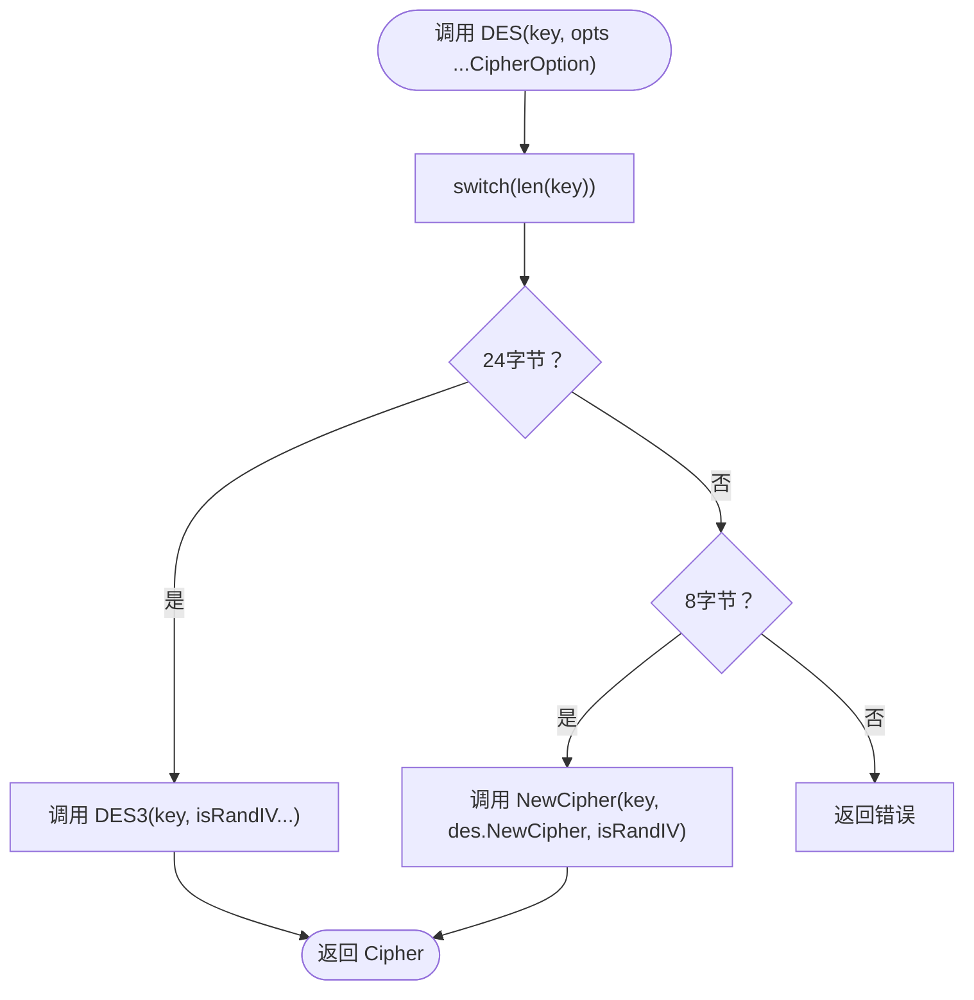
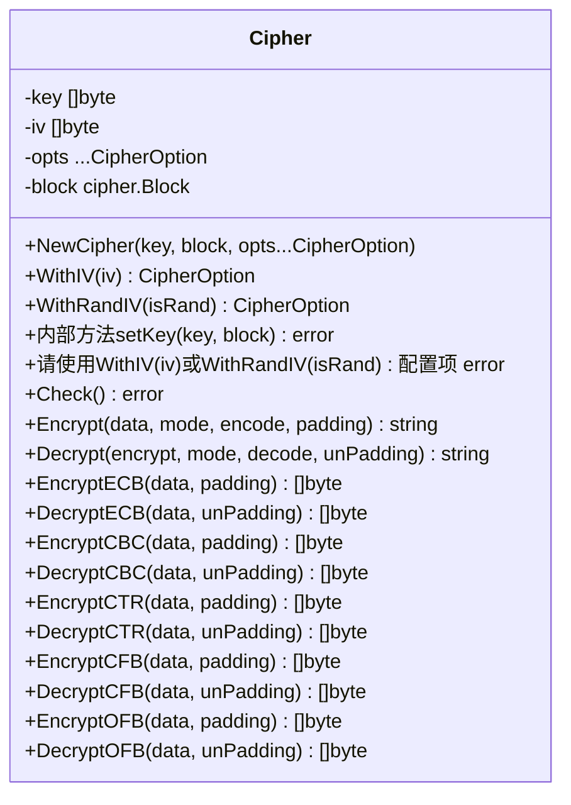
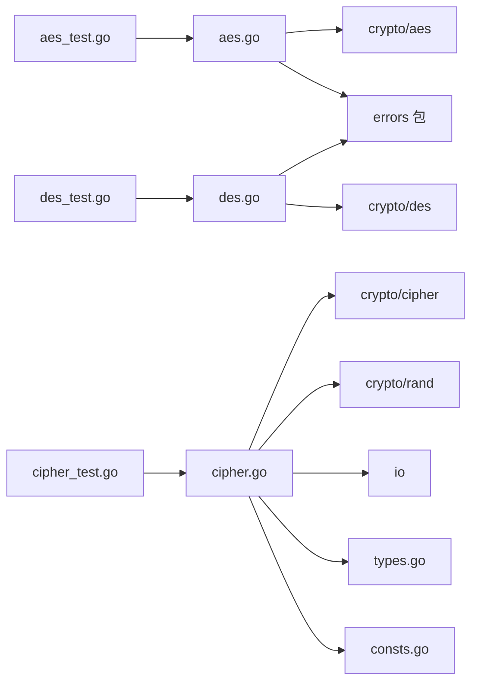

# 对称加密算法API

<cite>
**本文引用的文件列表**
- [aes.go](file://aes.go)
- [des.go](file://des.go)
- [cipher.go](file://cipher.go)
- [cipher_test.go](file://cipher_test.go)
- [aes_test.go](file://aes_test.go)
- [des_test.go](file://des_test.go)
- [pkcs7.go](file://pkcs7.go)
- [types.go](file://types.go)
- [consts.go](file://consts.go)
- [README.md](file://README.md)
</cite>

## 目录

1. [简介](#简介)
2. [项目结构](#项目结构)
3. [核心组件](#核心组件)
4. [架构总览](#架构总览)
5. [详细组件分析](#详细组件分析)
6. [依赖关系分析](#依赖关系分析)
7. [性能与安全考量](#性能与安全考量)
8. [故障排查指南](#故障排查指南)
9. [结论](#结论)
10. [附录：API使用示例与最佳实践](#附录api使用示例与最佳实践)

## 简介

本文件为对称加密算法API的权威参考，覆盖AES、DES、3DES三种算法的实现与使用。重点说明：

- AES三种变体（AES-128、AES-192、AES-256）的密钥长度与使用方法
- DES与3DES的密钥长度规范与兼容性
- CipherBlock接口的实现方式与算法选择机制
- 模式支持：ECB、CBC、CTR、CFB、OFB
- 完整API使用流程：密钥生成、加密解密、错误处理
- 性能与安全性注意事项

## 项目结构

围绕对称加密的核心文件组织如下：

- 算法入口与适配层：aes.go、des.go
- 通用加密器实现：cipher.go
- 类型与常量定义：types.go、consts.go
- 填充与解填充：pkcs7.go
- 单元测试：cipher_test.go、aes_test.go、des_test.go
- 文档与说明：README.md

图表来源

- [aes.go](file://aes.go#L1-L23)
- [des.go](file://des.go#L1-L45)
- [cipher.go](file://cipher.go#L1-L498)
- [types.go](file://types.go#L1-L98)
- [consts.go](file://consts.go#L1-L23)
- [pkcs7.go](file://pkcs7.go#L1-L31)
- [cipher_test.go](file://cipher_test.go#L1-L62)
- [aes_test.go](file://aes_test.go#L1-L148)
- [des_test.go](file://des_test.go#L1-L82)

章节来源

- [aes.go](file://aes.go#L1-L23)
- [des.go](file://des.go#L1-L45)
- [cipher.go](file://cipher.go#L1-L498)
- [types.go](file://types.go#L1-L98)
- [consts.go](file://consts.go#L1-L23)
- [pkcs7.go](file://pkcs7.go#L1-L31)
- [cipher_test.go](file://cipher_test.go#L1-L62)
- [aes_test.go](file://aes_test.go#L1-L148)
- [des_test.go](file://des_test.go#L1-L82)

## 核心组件

- Cipher 加密器：统一管理密钥、IV、块密码实现与多种加密模式（ECB/CBC/CTR/CFB/OFB），提供 Encrypt/Decrypt 主入口。
- AES/DES/3DES 入口：根据密钥长度自动选择具体算法，封装 NewCipher 调用。
- PKCS7 填充/去填充：满足分组密码对明文长度的要求。
- 类型与常量：McryptMode、Encode/Decode、Padding/UnPadding、CipherBlock 等。

章节来源

- [cipher.go](file://cipher.go#L20-L498)
- [aes.go](file://aes.go#L12-L22)
- [des.go](file://des.go#L12-L44)
- [pkcs7.go](file://pkcs7.go#L8-L30)
- [types.go](file://types.go#L46-L74)
- [consts.go](file://consts.go#L4-L10)

## 架构总览

对称加密API采用“入口函数 + 通用加密器”的分层设计：

- 入口函数（AES/DES/3DES）负责密钥长度校验与算法选择，委托 NewCipher 创建 Cipher 实例。
- Cipher 统一处理密钥设置、IV 校验与设置、各模式加密/解密流程。
- 填充策略通过外部函数注入，便于扩展不同填充方案。

图表来源

- [aes.go](file://aes.go#L12-L22)
- [des.go](file://des.go#L12-L44)
- [cipher.go](file://cipher.go#L32-L498)

## 详细组件分析

### AES 算法

- 密钥长度要求：16、24、32 字节（对应 AES-128、AES-192、AES-256）
- 入口函数行为：
    - 校验密钥长度，非法长度直接返回错误
    - isRandIV=true 时，加密结果在密文开头附加随机IV，解密时自动解析IV
    - 委托 NewCipher 创建 Cipher 实例
- Cipher 支持模式：ECB、CBC、CTR、CFB、OFB
- 填充：默认使用 PKCS7，确保明文长度为16字节的整数倍

图表来源

- [aes.go](file://aes.go#L12-L22)
- [cipher.go](file://cipher.go#L32-L40)

章节来源

- [aes.go](file://aes.go#L12-L22)
- [cipher.go](file://cipher.go#L10-L18)
- [cipher_test.go](file://cipher_test.go#L10-L61)
- [aes_test.go](file://aes_test.go#L10-L148)

### DES 与 3DES 算法

- DES 密钥长度：8 字节
- 3DES 密钥长度：24 字节
- 兼容性：
    - DES(key) 若 key 长度为 24 字节，自动走 DES3
    - DES(key) 若 key 长度为 8 字节，走单DES
- 入口函数行为：
    - 校验密钥长度，非法长度返回错误
    - isRandIV 默认 false；若传入 true，行为与 AES 一致（CBC/CTR/CFB/OFB 模式下在密文开头附加随机IV）

图表来源

- [des.go](file://des.go#L12-L27)
- [des.go](file://des.go#L33-L44)
- [cipher.go](file://cipher.go#L32-L40)

章节来源

- [des.go](file://des.go#L12-L44)
- [cipher.go](file://cipher.go#L10-L18)
- [cipher_test.go](file://cipher_test.go#L10-L61)
- [des_test.go](file://des_test.go#L10-L82)

### Cipher 加密器

- 关键职责
    - setKey（内部）：校验密钥长度（8/16/24/32），创建底层 cipher.Block
    - WithIV：CipherOption，设置固定IV（长度需与块大小一致：AES=16字节，DES=8字节）
    - WithRandIV：CipherOption，设置是否随机生成IV
    - Check：在未显式设置IV时，根据密钥长度推导默认IV或在 isRandIV=true 时自动生成IV
    - Encrypt/Decrypt：按模式分派到具体实现（ECB/CBC/CTR/CFB/OFB）
- 模式实现要点
    - ECB：逐块加密，无需IV
    - CBC/CTR/CFB/OFB：支持可选随机IV（isRandIV=true），在密文头部附加IV，解密时自动解析
    - 填充：通过外部函数注入（如 PKCS7），解密时配套去填充

图表来源

- [cipher.go](file://cipher.go#L20-L498)

章节来源

- [cipher.go](file://cipher.go#L20-L498)
- [pkcs7.go](file://pkcs7.go#L8-L30)
- [types.go](file://types.go#L46-L74)
- [consts.go](file://consts.go#L4-L10)

### PKCS7 填充与去填充

- Pkcs7Padding：按块大小补齐至整数倍
- Pkcs7UnPadding：按最后字节指示的长度去除填充
- 错误处理：输入为空或去填充长度异常时返回错误

章节来源

- [pkcs7.go](file://pkcs7.go#L8-L30)

## 依赖关系分析

- 入口函数依赖：
    - aes.go 依赖 crypto/aes 与自定义错误包装
    - des.go 依赖 crypto/des 与自定义错误包装
- Cipher 依赖：
    - crypto/cipher、crypto/rand、io
    - types.go 中的 McryptMode、Encode/Decode、Padding/UnPadding、CipherBlock
    - consts.go 中的加密模式常量
- 测试依赖：
    - cipher_test.go 验证通用流程
    - aes_test.go/ des_test.go 验证不同密钥长度与模式组合

图表来源

- [aes.go](file://aes.go#L3-L6)
- [des.go](file://des.go#L3-L6)
- [cipher.go](file://cipher.go#L3-L8)
- [types.go](file://types.go#L3-L74)
- [consts.go](file://consts.go#L3-L10)
- [aes_test.go](file://aes_test.go#L3-L8)
- [des_test.go](file://des_test.go#L3-L8)
- [cipher_test.go](file://cipher_test.go#L3-L8)

章节来源

- [aes.go](file://aes.go#L3-L6)
- [des.go](file://des.go#L3-L6)
- [cipher.go](file://cipher.go#L3-L8)
- [types.go](file://types.go#L3-L74)
- [consts.go](file://consts.go#L3-L10)
- [aes_test.go](file://aes_test.go#L3-L8)
- [des_test.go](file://des_test.go#L3-L8)
- [cipher_test.go](file://cipher_test.go#L3-L8)

## 性能与安全考量

- 性能
    - ECB 模式最简单，但安全性较低，且易暴露明文模式特征
    - CBC/CTR/CFB/OFB 模式更安全，其中 CTR 在硬件上通常具备良好并行性能
    - 随机IV（isRandIV=true）会增加密文长度（块大小），但显著提升安全性
- 安全
    - 建议优先使用 CBC/CTR/CFB/OFB，避免 ECB
    - 使用随机IV，避免固定IV导致的可预测性
    - 合理选择填充方案（推荐PKCS7），避免填充攻击
    - 密钥长度选择：AES-256 提供更强抗暴力破解能力，但性能略低；AES-128 已能满足多数场景
    - 传输与存储时建议对密文进行编码（如Base64），并妥善保护密钥与IV

[本节为通用指导，不直接分析具体文件]

## 故障排查指南

- 常见错误与定位
    - “密钥长度不合法”：检查 AES 密钥长度（16/24/32）、DES（8）、3DES（24）
    - “IV长度不匹配”：确认IV长度与算法块大小一致（AES=16、DES=8）
    - “密文太短/非块倍数”：检查是否遗漏IV或密文被截断
    - “去填充失败”：确认使用的填充方案与加密一致
- 建议排查步骤
    - 确认入口函数参数与 isRandIV 设置
    - 明确所选模式与编码方式（如Base64）
    - 核对填充/去填充函数是否匹配
    - 使用单元测试样例对比验证

章节来源

- [cipher.go](file://cipher.go#L69-L84)
- [cipher.go](file://cipher.go#L87-L99)
- [cipher.go](file://cipher.go#L183-L196)
- [cipher.go](file://cipher.go#L255-L266)
- [cipher.go](file://cipher.go#L325-L337)
- [cipher.go](file://cipher.go#L397-L407)
- [cipher.go](file://cipher.go#L406-L420)
- [pkcs7.go](file://pkcs7.go#L18-L30)

## 结论

本API以简洁统一的接口封装了AES、DES、3DES三种对称加密算法，支持多种加密模式与可插拔填充方案。通过合理的密钥长度与IV策略，可在保证安全性的前提下满足不同性能需求。建议在生产环境中优先选用CBC/CTR/CFB/OFB模式，并配合随机IV与PKCS7填充。

[本节为总结性内容，不直接分析具体文件]

## 附录：API使用示例与最佳实践

### AES 使用示例（含密钥长度与模式）

- AES-128（16字节密钥）
    - 入口：AES(key, isRandIV=false)
    - 模式：CBC/ECB/CTR/CFB/OFB
    - 填充：PKCS7
    - 示例路径：[aes_test.go](file://aes_test.go#L26-L36)
- AES-192（24字节密钥）
    - 入口：AES(key, isRandIV=false)
    - 模式：CBC/ECB/CTR/CFB/OFB
    - 填充：PKCS7
    - 示例路径：[aes_test.go](file://aes_test.go#L37-L43)
- AES-256（32字节密钥）
    - 入口：AES(key, isRandIV=false)
    - 模式：CBC/ECB/CTR/CFB/OFB
    - 填充：PKCS7
    - 示例路径：[aes_test.go](file://aes_test.go#L44-L48)

章节来源

- [aes_test.go](file://aes_test.go#L26-L48)

### DES/3DES 使用示例

- DES（8字节密钥）
    - 入口：DES(key, isRandIV=false)
    - 模式：CBC/ECB/CTR/CFB/OFB
    - 填充：PKCS7
    - 示例路径：[des_test.go](file://des_test.go#L25-L31)
- 3DES（24字节密钥）
    - 入口：DES(key) 自动识别为3DES
    - 或显式调用 DES3(key, isRandIV=false)
    - 模式：CBC/ECB/CTR/CFB/OFB
    - 填充：PKCS7
    - 示例路径：[des_test.go](file://des_test.go#L36-L42)

章节来源

- [des_test.go](file://des_test.go#L25-L42)

### 通用流程（Encrypt/Decrypt）

- 步骤
    - 选择算法入口（AES/DES/3DES）
    - 设置密钥（必要时设置IV）
    - 选择模式（ECB/CBC/CTR/CFB/OFB）
    - 选择编码（如Base64）
    - 选择填充（如PKCS7）
    - 执行 Encrypt/Decrypt
- 示例路径
    - 通用流程验证：[cipher_test.go](file://cipher_test.go#L34-L59)
    - AES 多模式与随机IV：[aes_test.go](file://aes_test.go#L52-L92)
    - DES 多模式与随机IV：[des_test.go](file://des_test.go#L44-L79)

章节来源

- [cipher_test.go](file://cipher_test.go#L34-L59)
- [aes_test.go](file://aes_test.go#L52-L92)
- [des_test.go](file://des_test.go#L44-L79)

### 错误处理最佳实践

- 明确区分“密钥/IV长度错误”、“模式错误”、“密文格式错误”
- 在调用 Encrypt/Decrypt 前确保通过工厂函数正确构造 Cipher 实例
- 使用统一的错误包装与日志记录（参考项目错误处理风格）

章节来源

- [cipher.go](file://cipher.go#L69-L84)
- [cipher.go](file://cipher.go#L87-L99)
- [cipher.go](file://cipher.go#L423-L497)