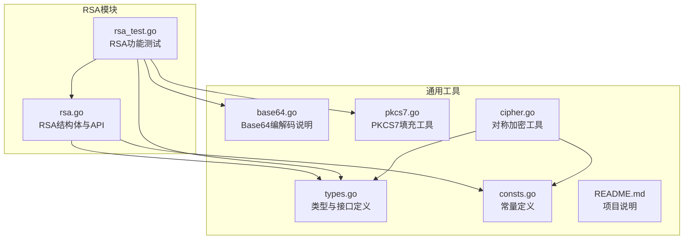
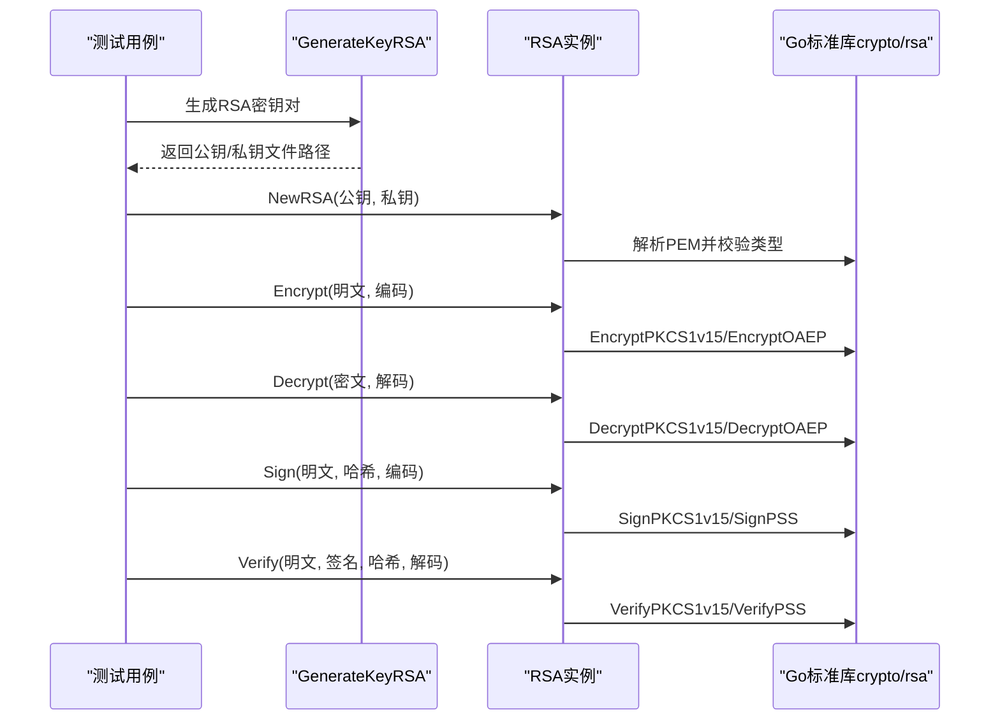
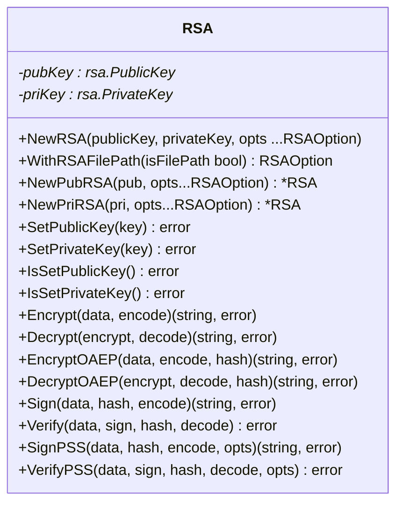
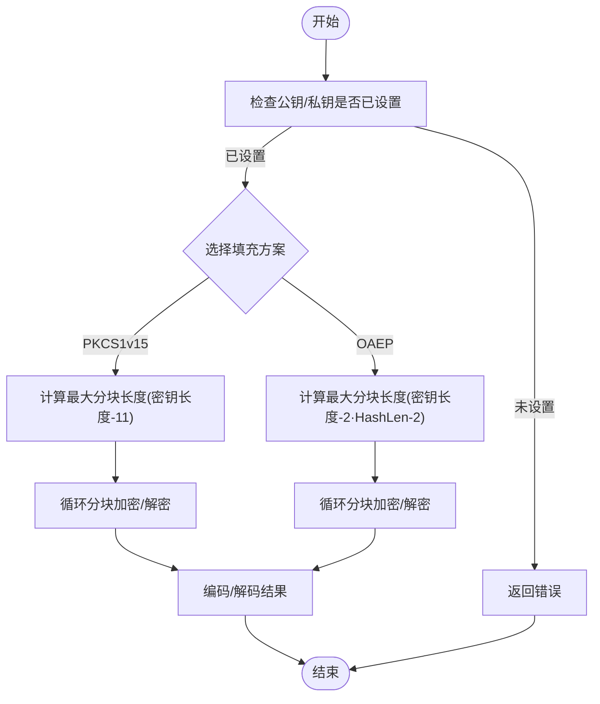
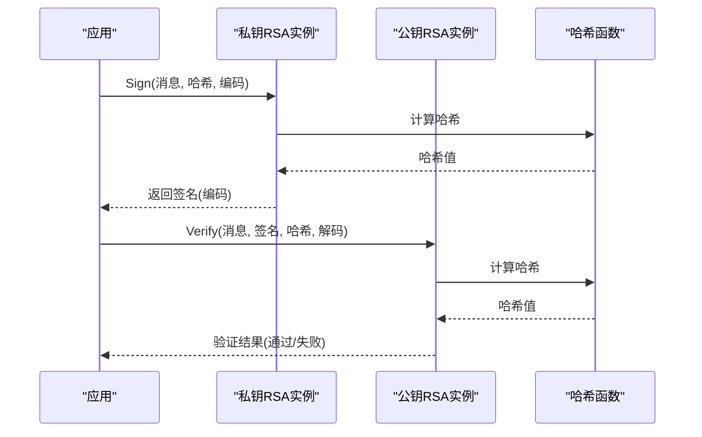
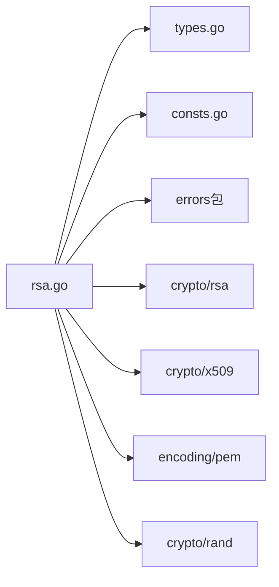

# 非对称加密算法API

<cite>
**本文档引用的文件**
- [rsa.go](file://rsa.go)
- [rsa_test.go](file://rsa_test.go)
- [cipher.go](file://cipher.go)
- [consts.go](file://consts.go)
- [types.go](file://types.go)
- [base64.go](file://base64.go)
- [pkcs7.go](file://pkcs7.go)
- [README.md](file://README.md)
</cite>

## 目录

1. [简介](#简介)
2. [项目结构](#项目结构)
3. [核心组件](#核心组件)
4. [架构总览](#架构总览)
5. [详细组件分析](#详细组件分析)
6. [依赖关系分析](#依赖关系分析)
7. [性能考量](#性能考量)
8. [故障排查指南](#故障排查指南)
9. [结论](#结论)
10. [附录](#附录)

## 简介

本文件为仓库中RSA非对称加密算法API的权威参考文档。内容覆盖RSA密钥生成、公钥加密、私钥解密、数字签名与验证、密钥格式处理等完整能力，并提供可直接定位到源码的路径指引，便于开发者快速理解与集成。

## 项目结构

该仓库采用按功能域划分的组织方式，RSA相关能力集中在单文件模块中，同时配套了对称加密、常量定义、类型定义、编码辅助等通用工具。

图表来源

- [rsa.go](file://rsa.go#L1-L527)
- [rsa_test.go](file://rsa_test.go#L1-L270)
- [types.go](file://types.go#L1-L98)
- [consts.go](file://consts.go#L1-L23)
- [base64.go](file://base64.go#L1-L8)
- [pkcs7.go](file://pkcs7.go#L1-L31)
- [cipher.go](file://cipher.go#L1-L498)
- [README.md](file://README.md#L1-L800)

章节来源

- [rsa.go](file://rsa.go#L1-L527)
- [rsa_test.go](file://rsa_test.go#L1-L270)
- [types.go](file://types.go#L1-L98)
- [consts.go](file://consts.go#L1-L23)
- [base64.go](file://base64.go#L1-L8)
- [pkcs7.go](file://pkcs7.go#L1-L31)
- [cipher.go](file://cipher.go#L1-L498)
- [README.md](file://README.md#L1-L800)

## 核心组件

- RSA结构体：封装公钥与私钥对象，提供加密、解密、签名、验签、密钥生成、PEM头处理等方法。
- 工厂方法：NewRSA/NewPubRSA/NewPriRSA用于实例化并设置公钥/私钥。
- 密钥生成：GenerateKeyRSA支持选择PKCS1/PKCS8格式与密钥长度。
- 加密/解密：支持PKCS1v15与OAEP两种填充方案；对长文本自动分块处理。
- 签名/验签：支持PKCS1v15与PSS两种方案，可配置PSS选项。
- PEM处理：RemovePEMHeaders/AddPEMHeaders用于去头尾标记与添加头尾标记。

章节来源

- [rsa.go](file://rsa.go#L18-L527)

## 架构总览

RSA模块围绕RSA结构体展开，通过工厂方法注入密钥，再调用具体算法实现。测试用例展示了典型使用流程：密钥生成、公钥加密/私钥解密、签名/验签、PEM头处理。

图表来源

- [rsa.go](file://rsa.go#L24-L527)
- [rsa_test.go](file://rsa_test.go#L22-L270)

## 详细组件分析

### RSA结构体与方法族

RSA结构体持有公钥与私钥指针，提供以下关键方法：

- 实例化与密钥设置：NewRSA/NewPubRSA/NewPriRSA、SetPublicKey/SetPrivateKey、IsSetPublicKey/IsSetPrivateKey
- 加密/解密：Encrypt/Decrypt（PKCS1v15）、EncryptOAEP/DecryptOAEP（OAEP）
- 签名/验签：Sign/Verify（PKCS1v15）、SignPSS/VerifyPSS（PSS）
- 密钥生成：GenerateKeyRSA（支持PKCS1/PKCS8与多种位数）
- PEM处理：RemovePEMHeaders/AddPEMHeaders

图表来源

- [rsa.go](file://rsa.go#L18-L527)

章节来源

- [rsa.go](file://rsa.go#L24-L527)

### 密钥生成API

GenerateKeyRSA支持：

- 路径参数：生成的密钥文件保存目录
- 位数参数：支持常见位数（如1024、2048、4096等）
- PKCS格式控制：可分别选择公钥PKCS8/私钥PKCS1/两者混合
- 返回值：生成的公钥与私钥文件名数组

使用要点：

- 生成私钥后，按需选择PKCS1或PKCS8序列化格式
- 公钥统一使用PKIX（PKCS#8）格式序列化
- 文件命名包含时间戳，避免覆盖

章节来源

- [rsa.go](file://rsa.go#L377-L481)
- [rsa_test.go](file://rsa_test.go#L22-L54)

### 公钥加密与私钥解密

支持两种填充方案：

- PKCS1v15：适用于大多数场景，适合小块数据
- OAEP：更安全，适合大块数据，需指定哈希函数

分块策略：

- 明文按最大允许长度分块，逐块加密/解密
- OAEP的最大长度计算包含哈希长度与固定开销

图表来源

- [rsa.go](file://rsa.go#L162-L331)

章节来源

- [rsa.go](file://rsa.go#L162-L331)

### 数字签名与验证

支持两种签名方案：

- PKCS1v15：经典方案，兼容性好
- PSS：更现代的安全方案，可配置Salt长度等参数

流程：

- 私钥签名：先对消息进行哈希，再用私钥签名
- 公钥验证：先对消息进行相同哈希，再用公钥验证签名

图表来源

- [rsa.go](file://rsa.go#L225-L266)
- [rsa.go](file://rsa.go#L333-L375)

章节来源

- [rsa.go](file://rsa.go#L225-L266)
- [rsa.go](file://rsa.go#L333-L375)
- [rsa_test.go](file://rsa_test.go#L147-L237)

### PEM密钥头处理

- 去除头尾标记：RemovePEMHeaders用于清理PEM字符串中的BEGIN/END与换行
- 添加头尾标记：AddPEMHeaders用于将纯密钥字符串包装为标准PEM格式（含64字符分行）

适用场景：

- 与外部系统交互时，统一密钥格式
- 存储或传输时去除冗余信息

章节来源

- [rsa.go](file://rsa.go#L483-L526)
- [rsa_test.go](file://rsa_test.go#L240-L269)

## 依赖关系分析

- 内部依赖：RSA模块依赖types.go中的Encode/Decode/Padding/UnPadding等类型定义，以及consts.go中的常量。
- 外部依赖：基于Go标准库crypto/rsa、crypto/x509、encoding/pem、crypto/rand等。
- 错误处理：统一使用自定义errors包进行Wrap/Error/New等封装，便于追踪。

图表来源

- [rsa.go](file://rsa.go#L3-L16)
- [types.go](file://types.go#L45-L74)
- [consts.go](file://consts.go#L4-L10)

章节来源

- [rsa.go](file://rsa.go#L3-L16)
- [types.go](file://types.go#L45-L74)
- [consts.go](file://consts.go#L4-L10)

## 性能考量

- 分块处理：对长文本采用分块加密/解密，避免一次性处理超大数据导致内存压力。
- 填充开销：PKCS1v15最大分块长度为密钥长度减11；OAEP最大分块长度还受哈希长度影响。
- 哈希成本：签名/验签涉及哈希计算，建议选择合适哈希算法平衡安全性与性能。
- I/O开销：密钥文件读取与PEM编码/解码存在I/O与CPU开销，建议缓存已解析的密钥对象。

章节来源

- [rsa.go](file://rsa.go#L171-L174)
- [rsa.go](file://rsa.go#L278-L281)
- [rsa.go](file://rsa.go#L236-L238)
- [rsa.go](file://rsa.go#L345-L347)

## 故障排查指南

常见问题与定位：

- 公钥/私钥未设置：调用Encrypt/Decrypt/Sign/Verify前应确保已通过NewRSA/NewPubRSA/NewPriRSA或SetPublicKey/SetPrivateKey完成设置。
- PEM格式错误：SetPublicKey/SetPrivateKey会解析PEM并校验类型，若类型不符会报错。
- 最大加密长度不足：当密钥过小或OAEP哈希过大时可能导致最大分块长度≤0，需调整密钥长度或填充方案。
- 解码失败：Verify/Decrypt需要正确的解码函数，确保与编码函数一致。
- PSS选项：SignPSS/VerifyPSS可传入PSSOptions，若不传默认使用标准参数。

章节来源

- [rsa.go](file://rsa.go#L146-L160)
- [rsa.go](file://rsa.go#L57-L96)
- [rsa.go](file://rsa.go#L103-L144)
- [rsa.go](file://rsa.go#L171-L174)
- [rsa.go](file://rsa.go#L278-L281)
- [rsa.go](file://rsa.go#L258-L265)
- [rsa.go](file://rsa.go#L367-L374)

## 结论

该RSA模块提供了完整的非对称加密能力：密钥生成、公钥加密/私钥解密、数字签名/验证、PEM格式处理等。通过工厂方法与类型定义，使用者可以灵活地组合公钥/私钥实例，满足不同安全需求。测试用例覆盖了主要使用场景，便于快速集成与验证。

## 附录

### API一览与使用示例路径

- 密钥生成：[GenerateKeyRSA](file://rsa.go#L377-L481)，测试示例：[TestGenerateKeyRSA](file://rsa_test.go#L22-L54)
- 公钥加密/私钥解密（PKCS1v15）：[Encrypt](file://rsa.go#L162-L189)、[Decrypt](file://rsa.go#L191-L223)
  ，测试示例：[TestRSA](file://rsa_test.go#L56-L144)
- 公钥加密/私钥解密（OAEP）：[EncryptOAEP](file://rsa.go#L268-L296)、[DecryptOAEP](file://rsa.go#L298-L331)
  ，测试示例：[TestRSA](file://rsa_test.go#L124-L138)
- 签名/验签（PKCS1v15）：[Sign](file://rsa.go#L225-L244)、[Verify](file://rsa.go#L246-L266)
  ，测试示例：[TestRSA_SignAndVerify](file://rsa_test.go#L147-L237)
- 签名/验签（PSS）：[SignPSS](file://rsa.go#L333-L353)、[VerifyPSS](file://rsa.go#L355-L375)
  ，测试示例：[TestRSA_SignAndVerify](file://rsa_test.go#L221-L235)
- PEM头处理：[RemovePEMHeaders](file://rsa.go#L483-L495)、[AddPEMHeaders](file://rsa.go#L497-L526)
  ，测试示例：[TestRSA_PEMHeaders](file://rsa_test.go#L240-L269)

### 密钥长度与安全建议

- 常见位数：1024、2048、4096等，位数越高安全性越高但性能越低。
- 建议：优先使用2048位及以上；OAEP场景下注意哈希长度对最大分块的影响。
- 密钥格式：公钥建议PKCS#8（PKIX），私钥可选PKCS#1或PKCS#8，视兼容性需求而定。

章节来源

- [rsa.go](file://rsa.go#L387-L481)
- [rsa_test.go](file://rsa_test.go#L33-L37)