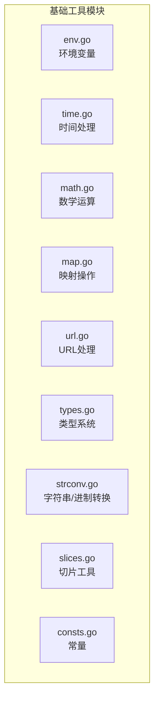
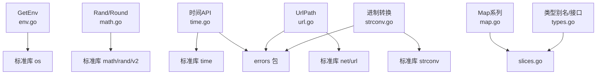
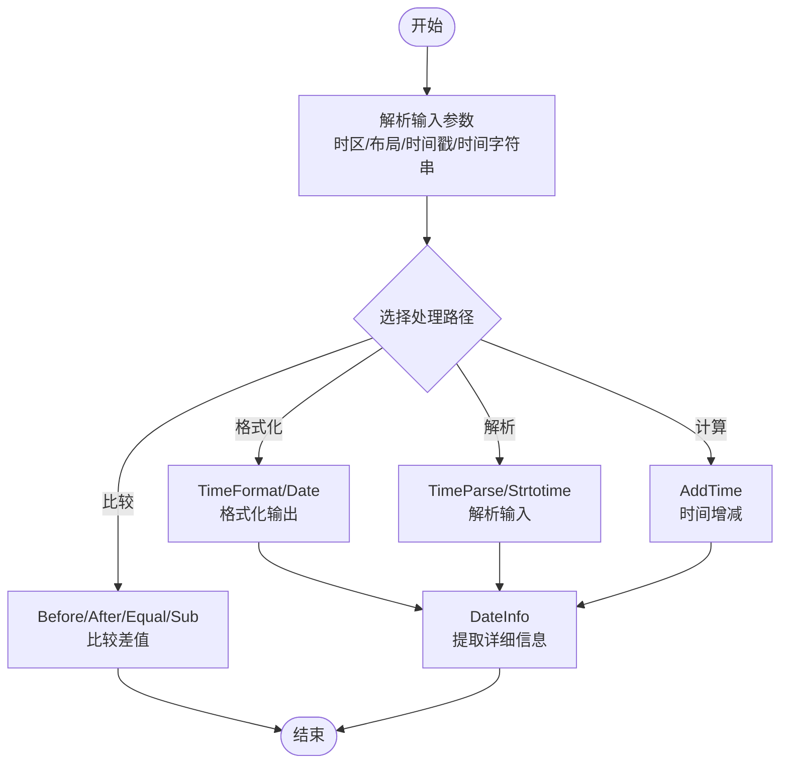
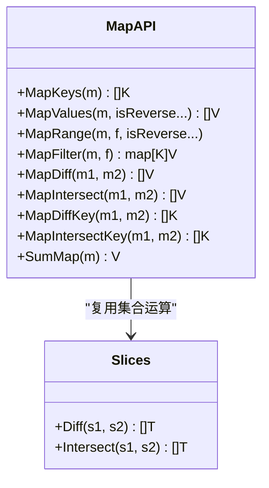
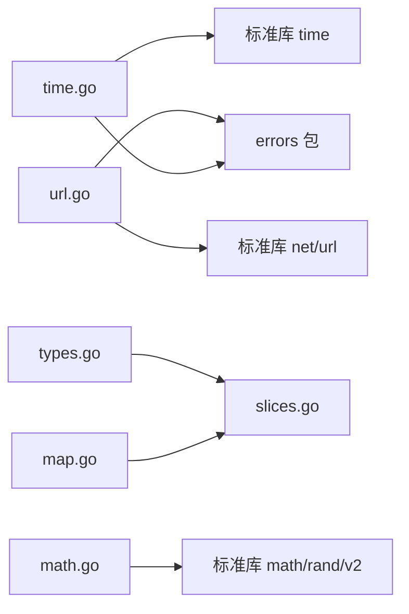

# 基础工具API

<cite>
**本文档引用的文件**
- [env.go](file://env.go)
- [env_test.go](file://env_test.go)
- [time.go](file://time.go)
- [time_test.go](file://time_test.go)
- [math.go](file://math.go)
- [math_test.go](file://math_test.go)
- [map.go](file://map.go)
- [map_test.go](file://map_test.go)
- [url.go](file://url.go)
- [types.go](file://types.go)
- [strconv.go](file://strconv.go)
- [slices.go](file://slices.go)
- [consts.go](file://consts.go)
- [README.md](file://README.md)
</cite>

## 目录

1. [简介](#简介)
2. [项目结构](#项目结构)
3. [核心组件](#核心组件)
4. [架构总览](#架构总览)
5. [详细组件分析](#详细组件分析)
6. [依赖关系分析](#依赖关系分析)
7. [性能考量](#性能考量)
8. [故障排查指南](#故障排查指南)
9. [结论](#结论)
10. [附录](#附录)

## 简介

本文件为“基础工具模块”的API参考文档，覆盖以下主题：

- 环境变量管理：GetEnv 等环境变量操作API
- 时间处理：时间格式化、解析、计算、比较与信息提取
- 数学运算：随机数生成、数值四舍五入与精度控制
- 映射操作：MapKeys、MapValues、MapRange、MapFilter、集合运算与求和
- URL处理：URL路径组装与查询参数合并
- 类型系统：数字类型别名、有序切片与通用接口
- 辅助转换：字符串与多进制数互转
- 常量：加密模式与存储单位常量

本参考文档提供每个API的函数签名、参数说明、返回值描述与使用示例的定位路径，便于快速查阅与集成。

## 项目结构

基础工具模块位于仓库根目录下，核心文件如下：

- 环境变量：env.go
- 时间处理：time.go
- 数学运算：math.go
- 映射操作：map.go
- URL处理：url.go
- 类型系统：types.go
- 字符串与进制转换：strconv.go
- 切片工具：slices.go
- 常量：consts.go
- 示例与说明：README.md

**图表来源**

- [env.go](file://env.go#L1-L19)
- [time.go](file://time.go#L1-L340)
- [math.go](file://math.go#L1-L37)
- [map.go](file://map.go#L1-L134)
- [url.go](file://url.go#L1-L27)
- [types.go](file://types.go#L1-L98)
- [strconv.go](file://strconv.go#L1-L109)
- [slices.go](file://slices.go#L1-L83)
- [consts.go](file://consts.go#L1-L23)

**章节来源**

- [README.md](file://README.md#L1-L200)

## 核心组件

- 环境变量管理：提供获取环境变量值的便捷函数，支持默认值回退
- 时间处理：提供时区获取、格式化布局、日期校验、时间增减、信息提取、解析与比较
- 数学运算：提供随机数生成与数值四舍五入
- 映射操作：提供键值访问、有序遍历、过滤、集合运算与求和
- URL处理：提供URL路径与查询参数合并
- 类型系统：提供数字类型别名、有序切片与通用接口
- 字符串与进制转换：提供多进制数相互转换与安全解析
- 切片工具：提供通用切片操作（去重、差集、交集、求和等）
- 常量：提供加密模式与存储单位常量

**章节来源**

- [env.go](file://env.go#L1-L19)
- [time.go](file://time.go#L1-L340)
- [math.go](file://math.go#L1-L37)
- [map.go](file://map.go#L1-L134)
- [url.go](file://url.go#L1-L27)
- [types.go](file://types.go#L1-L98)
- [strconv.go](file://strconv.go#L1-L109)
- [slices.go](file://slices.go#L1-L83)
- [consts.go](file://consts.go#L1-L23)

## 架构总览

基础工具模块采用单一包设计，各功能模块相对独立，通过清晰的函数边界与类型约束提供易用的API。时间处理模块内置布局映射与多种解析策略；映射操作模块基于泛型实现通用能力；URL处理模块封装标准库行为并统一错误包装。

**图表来源**

- [env.go](file://env.go#L1-L19)
- [time.go](file://time.go#L1-L340)
- [math.go](file://math.go#L1-L37)
- [map.go](file://map.go#L1-L134)
- [url.go](file://url.go#L1-L27)
- [strconv.go](file://strconv.go#L1-L109)
- [slices.go](file://slices.go#L1-L83)
- [types.go](file://types.go#L1-L98)

## 详细组件分析

### 环境变量管理 API

- GetEnv
    - 功能：获取环境变量值，若未设置且提供了默认值则返回默认值
    - 函数签名：GetEnv(key string, defaultVal ...string) string
    - 参数：
        - key：环境变量键名
        - defaultVal：可选，默认值列表；若提供多个，默认取第一个
    - 返回值：字符串类型的环境变量值或默认值
    - 使用示例定位：[示例测试](file://env_test.go#L8-L27)

**章节来源**

- [env.go](file://env.go#L9-L18)
- [env_test.go](file://env_test.go#L8-L27)

### 时间处理 API

- 时区与布局
    - Local() *time.Location：获取系统本地时区
    - UTC() *time.Location：获取UTC时区
    - CST() *time.Location：获取UTC+8时区
    - patterns：内置布局映射表，支持自定义布局占位符到Go Layout的替换
- 日期与时间计算
    - MonthDay(year, month) int：返回指定年月的天数
    - CheckDate(year, month, day) bool：验证日期合法性
    - AddTime(t time.Time, addTimes ...string) (time.Time, error)：对时间进行增量/减量计算，支持年(Y)、月(M)、日(D)、时(H)
      、分(I)、秒(S)、毫秒(L)、微秒(C)、纳秒(N)
- 时间格式化与解析
    - Date(timeZone *time.Location, layout string, timestamp ...int64) string：使用内置patterns进行格式化输出
    - TimeFormat(timeZone *time.Location, layout string, timestamp ...int64) string：按指定layout格式化时间戳（秒/纳秒）
    - TimeParse(timeZone *time.Location, layout, timeStr string) (time.Time, error)：按指定layout解析时间字符串
    - Strtotime(timeZone *time.Location, parse ...string) (time.Time, error)：尝试多种常见格式解析时间字符串
- 时间比较与差值
    - Before(layout string, t1, t2 string) (bool, error)：判断t1是否早于t2
    - After(layout string, t1, t2 string) (bool, error)：判断t1是否晚于t2
    - Equal(layout string, t1, t2 string) (bool, error)：判断t1与t2是否相等
    - Sub(layout string, t1, t2 string) (time.Duration, error)：返回t1-t2的时间差
- 时间信息提取
    - DateInfo(t time.Time) map[string]interface{}：提取年、月、日、时、分、秒、毫秒、微秒、纳秒、UNIX时间戳、星期、ISO周数、一年中的第几天、格式化字符串等

**图表来源**

- [time.go](file://time.go#L11-L340)

**章节来源**

- [time.go](file://time.go#L11-L340)
- [time_test.go](file://time_test.go#L9-L299)

### 数学运算 API

- Rand(minInt, maxInt int64, r ...*rand.Rand) int64
    - 功能：生成[minInt,maxInt]范围内的随机数，支持复用随机源以提升批量生成效率
    - 参数：
        - minInt：最小值
        - maxInt：最大值
        - r：可选的随机源指针，用于批量高效生成
    - 返回值：范围内的随机整数
    - 使用示例定位：[基准测试与并发测试](file://math_test.go#L9-L123)
- Round(num float64, precision int) float64
    - 功能：对浮点数进行四舍五入，并保留指定小数位或按数量级取整
    - 参数：
        - num：待处理的浮点数
        - precision：精度位数（正数为小数位，负数为数量级）
    - 返回值：处理后的浮点数
    - 使用示例定位：[精度测试](file://math_test.go#L84-L123)

**章节来源**

- [math.go](file://math.go#L8-L37)
- [math_test.go](file://math_test.go#L9-L123)

### 映射操作 API

- MapKeys[K Ordered, V any](m map[K]V) []K
    - 功能：返回map的所有键（顺序取决于语言实现）
    - 返回值：键数组
- MapValues[K Ordered, V any](m map[K]V, isReverse ...bool) []V
    - 功能：对键排序后返回对应的值；isReverse=true为降序
    - 返回值：值数组
- MapRange[K Ordered, V any](m map[K]V, f func(key K, value V) bool, isReverse ...bool)
    - 功能：按键排序遍历map；若f返回false则提前终止
- MapFilter[K Ordered, V any](m map[K]V, f func(key K, value V) bool) map[K]V
    - 功能：根据回调过滤元素（删除不满足条件的键值）
- MapDiff[K, V Ordered](m1, m2 map[K]V) []V
    - 功能：计算m1与m2的值差集（m1中有但m2中没有）
- MapIntersect[K, V Ordered](m1, m2 map[K]V) []V
    - 功能：计算m1与m2的值交集
- MapDiffKey[K Ordered, V any](m1, m2 map[K]V) []K
    - 功能：计算m1与m2的键差集
- MapIntersectKey[K Ordered, V any](m1, m2 map[K]V) []K
    - 功能：计算m1与m2的键交集
- SumMap[K Ordered, V Number](m map[K]V) V
    - 功能：对map的值求和

**图表来源**

- [map.go](file://map.go#L7-L134)
- [slices.go](file://slices.go#L45-L83)

**章节来源**

- [map.go](file://map.go#L7-L134)
- [map_test.go](file://map_test.go#L10-L319)

### URL处理 API

- UrlPath(urlPath string, params url.Values) (string, error)
    - 功能：将params合并到urlPath的查询参数中，返回新的URL字符串
    - 参数：
        - urlPath：原始URL
        - params：查询参数映射
    - 返回值：合并后的URL字符串，或错误
    - 使用示例定位：[curl测试中对UrlPath的使用](file://curl_test.go#L1-L200)

**章节来源**

- [url.go](file://url.go#L11-L27)

### 类型系统 API

- 数字类型别名
    - Signed：有符号整数集合
    - Unsigned：无符号整数集合
    - Integer：整数集合
    - Float：浮点数集合
    - Number：数字集合（整数+浮点）
    - Ordered：数字或字符串集合
- Slice[T Ordered]：泛型切片，实现排序接口
- 密码与文件相关类型别名（见types.go）

**章节来源**

- [types.go](file://types.go#L5-L98)

### 字符串与进制转换 API

- 数值解析（失败返回零值）
    - Str2Int(s string) int
    - Str2Int64(s string) int64
    - Str2Float(s string) float64
- 进制转换（二/八/十/十六）
    - BinOct/BinDec/BinHex/OctBin/OctDec/OctHex/DecBin/DecOct/DecHex/HexBin/HexOct/HexDec
    - 返回值：转换结果或错误（错误统一包装）
- 使用示例定位：
    - [strconv测试](file://strconv.go#L1-L109)

**章节来源**

- [strconv.go](file://strconv.go#L8-L109)

### 切片工具 API

- IsHas[T Ordered](v T, s []T) bool：检查元素是否存在
- HasCount[T Ordered](v T, s []T) int：统计元素出现次数
- Reverse[T Ordered](s []T) []T：反转切片
- Unique[T Ordered](s []T) []T：去重
- Diff[T Ordered](s1, s2 []T) []T：差集
- Intersect[T Ordered](s1, s2 []T) []T：交集
- SumSlice[T Number](nums []T) T：求和

**章节来源**

- [slices.go](file://slices.go#L3-L83)

### 常量 API

- 加密模式常量：ECB、CBC、CTR、CFB、OFB
- 存储单位常量：Byte、KB、MB、GB、TB、PB、EB

**章节来源**

- [consts.go](file://consts.go#L3-L23)

## 依赖关系分析

- 时间处理模块依赖标准库 time 与自定义 errors 包，提供统一错误包装
- 映射操作模块依赖切片工具模块，复用集合运算
- URL处理模块依赖标准库 net/url 与自定义 errors 包
- 数学运算模块依赖标准库 math/rand/v2
- 类型系统模块为其他模块提供泛型约束与通用接口

**图表来源**

- [time.go](file://time.go#L3-L9)
- [map.go](file://map.go#L3-L5)
- [url.go](file://url.go#L3-L6)
- [math.go](file://math.go#L3-L6)
- [types.go](file://types.go#L3-L4)

**章节来源**

- [time.go](file://time.go#L3-L9)
- [map.go](file://map.go#L3-L5)
- [url.go](file://url.go#L3-L6)
- [math.go](file://math.go#L3-L6)
- [types.go](file://types.go#L3-L4)

## 性能考量

- Rand：支持传入共享随机源，避免重复初始化开销，适合批量生成场景
- MapValues/MapRange：按键排序后访问，注意键类型需实现有序接口；对大map建议谨慎使用排序
- TimeFormat/Date：内置patterns替换减少重复布局字符串书写；解析时优先使用明确layout以避免多次尝试
- UrlPath：仅在params非空时进行解析与合并，避免不必要的字符串处理

[本节为通用指导，无需具体文件引用]

## 故障排查指南

- 环境变量
    - 若期望默认值生效，请确保未设置同名环境变量或显式传入默认值
    - 参考测试用例定位：[env_test.go](file://env_test.go#L8-L27)
- 时间处理
    - AddTime参数格式错误会返回错误；请确认单位后缀（Y/M/D/H/I/S/L/C/N）
    - Strtotime无法解析时会返回错误；建议提供明确layout或检查输入格式
    - 参考测试用例定位：
        - [time_test.go（AddTime/Date）](file://time_test.go#L43-L107)
        - [time_test.go（Strtotime）](file://time_test.go#L144-L179)
- URL处理
    - UrlPath在解析URL失败时返回错误；请检查urlPath合法性
    - 参考测试用例定位：[curl_test.go中对UrlPath的使用](file://curl_test.go#L1-L200)
- 数学运算
    - Rand边界值与并发安全性：参考基准与并发测试
    - Round精度异常：检查precision正负与数值范围
    - 参考测试用例定位：
        - [math_test.go（Rand）](file://math_test.go#L9-L123)
        - [math_test.go（Round）](file://math_test.go#L84-L123)
- 映射操作
    - MapValues/MapRange的排序依赖键类型实现有序接口；确保键类型为Number或string
    - MapFilter会就地修改原map；如需保留原map，请先复制
    - 参考测试用例定位：
        - [map_test.go（MapKeys/MapValues/MapDiff/MapIntersect/MapFilter/MapRange）](file://map_test.go#L10-L319)

**章节来源**

- [env_test.go](file://env_test.go#L8-L27)
- [time_test.go](file://time_test.go#L43-L179)
- [curl_test.go](file://curl_test.go#L1-L200)
- [math_test.go](file://math_test.go#L9-L123)
- [map_test.go](file://map_test.go#L10-L319)

## 结论

基础工具模块提供了简洁、一致且易于使用的API，覆盖环境变量、时间处理、数学运算、映射操作、URL处理、类型系统与进制转换等常用场景。通过泛型与标准库的良好结合，既保证了易用性，又兼顾了性能与可维护性。建议在实际项目中结合测试用例与本参考文档，快速定位并正确使用相应API。

[本节为总结，无需具体文件引用]

## 附录

- 使用示例定位汇总
    - 环境变量：[env_test.go](file://env_test.go#L8-L27)
    - 时间处理：[time_test.go](file://time_test.go#L9-L299)
    - 数学运算：[math_test.go](file://math_test.go#L9-L123)
    - 映射操作：[map_test.go](file://map_test.go#L10-L319)
    - URL处理：[curl_test.go](file://curl_test.go#L1-L200)
    - 字符串与进制转换：[strconv.go](file://strconv.go#L1-L109)
    - 类型系统：[types.go](file://types.go#L1-L98)
    - 切片工具：[slices.go](file://slices.go#L1-L83)
    - 常量：[consts.go](file://consts.go#L1-L23)

[本节为补充说明，无需具体文件引用]