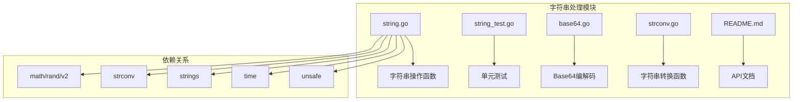
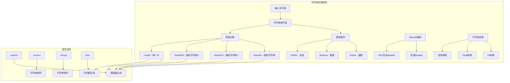
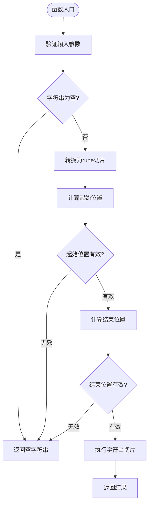
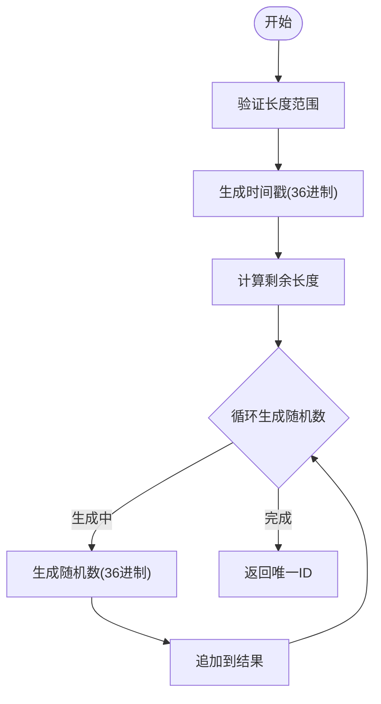
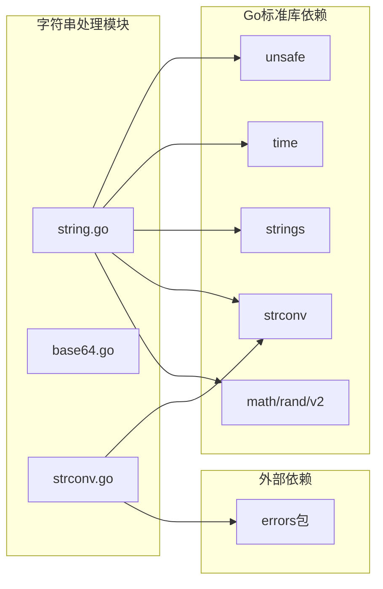

# 字符串处理API

<cite>
**本文档引用的文件**
- [string.go](file://string.go)
- [string_test.go](file://string_test.go)
- [base64.go](file://base64.go)
- [strconv.go](file://strconv.go)
- [README.md](file://README.md)
</cite>

## 目录

1. [简介](#简介)
2. [项目结构](#项目结构)
3. [核心组件](#核心组件)
4. [架构概览](#架构概览)
5. [详细组件分析](#详细组件分析)
6. [依赖关系分析](#依赖关系分析)
7. [性能考虑](#性能考虑)
8. [故障排除指南](#故障排除指南)
9. [结论](#结论)

## 简介

go-utils
字符串处理模块提供了丰富的字符串操作功能，涵盖基础的字符串截取、替换、查找、统计等操作，以及高级的随机字符串生成、唯一ID生成等功能。该模块特别注重Unicode支持和性能优化，为开发者提供了高效、可靠的字符串处理解决方案。

## 项目结构

字符串处理模块主要包含以下核心文件：



**图表来源**

- [string.go](file://string.go#L1-L187)
- [base64.go](file://base64.go#L1-L8)
- [strconv.go](file://strconv.go#L1-L109)

**章节来源**

- [string.go](file://string.go#L1-L187)
- [base64.go](file://base64.go#L1-L8)
- [strconv.go](file://strconv.go#L1-L109)

## 核心组件

### 字符串操作函数

字符串处理模块的核心功能由以下主要函数组成：

1. **字符串截取**: Substr - 支持Unicode字符的安全截取
2. **字符串替换**: Replace - 基于映射表的批量替换
3. **字符串反转**: StrRev - 完整的Unicode支持
4. **随机字符串生成**: RandStr, RandStr2, RandStr3 - 多种生成策略
5. **唯一ID生成**: UniqId - 时间戳+随机数的组合ID

### Base64编解码

提供标准Base64和URL安全Base64两种编码方案：

- 标准Base64编码/解码
- URL安全Base64编码/解码

### 字符串转换工具

基于strconv包的便捷函数：

- 整数转换
- 浮点数转换
- 进制转换

**章节来源**

- [string.go](file://string.go#L22-L187)
- [base64.go](file://base64.go#L1-L8)
- [strconv.go](file://strconv.go#L1-L109)

## 架构概览



**图表来源**

- [string.go](file://string.go#L1-L187)
- [base64.go](file://base64.go#L1-L8)
- [strconv.go](file://strconv.go#L1-L109)

## 详细组件分析

### 字符串截取功能 (Substr)

Substr函数提供了安全的Unicode字符串截取功能，支持复杂的索引计算：



**图表来源**

- [string.go](file://string.go#L47-L84)

**函数签名**: `func Substr(str string, start, length int) string`

**参数说明**:

- `str`: 源字符串
- `start`: 起始位置（支持负数索引）
- `length`: 截取长度（支持负数表示相对位置）

**使用示例**:

- `Substr("你好世界", 0, 2)` → `"你好"`
- `Substr("你好世界", -2, 2)` → `"世界"`

**章节来源**

- [string.go](file://string.go#L38-L84)
- [string_test.go](file://string_test.go#L34-L59)

### 字符串替换功能 (Replace)

Replace函数提供了基于映射表的批量字符串替换功能：

**函数签名**: `func Replace(s string, oldnew map[string]string) string`

**实现特点**:

- 使用strings.NewReplacer提高替换效率
- 支持同时替换多个不同的字符串
- 自动处理重叠的替换模式

**使用示例**:

```go
pairs := map[string]string{
    "hello": "hi",
    "world": "universe",
}
result := Replace("hello world", pairs) // "hi universe"
```

**章节来源**

- [string.go](file://string.go#L22-L36)
- [string_test.go](file://string_test.go#L10-L32)

### 字符串反转功能 (StrRev)

StrRev函数提供了完整的Unicode字符串反转功能：

**函数签名**: `func StrRev(str string) string`

**实现原理**:

- 将字符串转换为rune切片
- 反转rune切片
- 转换回字符串

**使用示例**:

- `StrRev("Hello")` → `"olleH"`
- `StrRev("你好")` → `"好你"`

**章节来源**

- [string.go](file://string.go#L86-L89)
- [string_test.go](file://string_test.go#L61-L87)

### 随机字符串生成器

#### RandStr - 基础随机字符串生成

**函数签名**: `func RandStr(n int, r ...*rand.Rand) string`

**特点**:

- 使用ALPHA字符集（A-Z, a-z）
- 支持自定义随机源
- 适合生成纯字母随机字符串

#### RandStr2 - 字母数字随机字符串生成

**函数签名**: `func RandStr2(n int, r ...*rand.Rand) string`

**特点**:

- 使用ALNUM字符集（A-Z, a-z, 0-9）
- 第一个字符必须是字母
- 适合生成用户名或标识符

#### RandStr3 - 自定义字符集随机字符串生成

**函数签名**: `func RandStr3(n int, alpha string, r ...*rand.Rand) string`

**特点**:

- 支持完全自定义字符集
- 高度灵活的配置选项
- 性能优化的内存分配

**章节来源**

- [string.go](file://string.go#L91-L131)

### 唯一ID生成器 (UniqId)

UniqId函数生成可排序的时间戳+随机数组合的唯一ID：

**函数签名**: `func UniqId(l uint8, r ...*rand.Rand) string`

**设计特点**:

- 长度范围16-32位可配置
- 前12位为时间戳（36进制）
- 后续位为随机数（36进制）
- 支持批量生成优化

**生成流程**:



**图表来源**

- [string.go](file://string.go#L137-L183)

**使用示例**:

- `UniqId(16)` → `"18k5j2m9p4q7r8s0"`
- `UniqId(32)` → `"18k5j2m9p4q7r8s0t1u2v3w4x5y6z7a8"`

**章节来源**

- [string.go](file://string.go#L133-L183)
- [string_test.go](file://string_test.go#L234-L270)

### Base64编解码功能

#### 标准Base64编解码

**编码**: `base64.StdEncoding.EncodeToString(src)`
**解码**: `base64.StdEncoding.DecodeString(s)`

#### URL安全Base64编解码

**编码**: `base64.URLEncoding.EncodeToString(src)`  
**解码**: `base64.URLEncoding.DecodeString(s)`

**使用场景**:

- 标准数据传输：使用标准Base64
- URL和文件名：使用URL安全Base64
- Web API：推荐URL安全Base64

**章节来源**

- [base64.go](file://base64.go#L1-L8)

### 字符串转换工具

#### 数值转换函数

**整数转换**:

- `Str2Int(s string) int` - 转换为int
- `Str2Int64(s string) int64` - 转换为int64

**浮点数转换**:

- `Str2Float(s string) float64` - 转换为float64

**使用示例**:

```go
result := Str2Int("123")    // 123
result := Str2Float("123.45") // 123.45
```

#### 进制转换函数

**二进制转换**:

- `BinOct(str string) (string, error)` - 二进制转八进制
- `BinDec(str string) (int64, error)` - 二进制转十进制
- `BinHex(str string) (string, error)` - 二进制转十六进制

**八进制转换**:

- `OctBin(data string) (string, error)` - 八进制转二进制
- `OctDec(str string) (int64, error)` - 八进制转十进制
- `OctHex(data string) (string, error)` - 八进制转十六进制

**十进制转换**:

- `DecBin(number int64) string` - 十进制转二进制
- `DecOct(number int64) string` - 十进制转八进制
- `DecHex(number int64) string` - 十进制转十六进制

**十六进制转换**:

- `HexBin(data string) (string, error)` - 十六进制转二进制
- `HexOct(str string) (string, error)` - 十六进制转八进制
- `HexDec(str string) (int64, error)` - 十六进制转十进制

**章节来源**

- [strconv.go](file://strconv.go#L1-L109)

## 依赖关系分析



**图表来源**

- [string.go](file://string.go#L1-L9)
- [strconv.go](file://strconv.go#L1-L7)

**章节来源**

- [string.go](file://string.go#L1-L9)
- [strconv.go](file://strconv.go#L1-L7)

## 性能考虑

### 内存优化策略

1. **字符串切片优化**: Substr函数使用rune切片避免UTF-8字符截断
2. **批量生成优化**: 随机字符串生成支持共享随机源减少内存分配
3. **Builder模式**: 推荐使用strings.Builder进行字符串拼接

### 算法复杂度

- **Substr**: O(n) 时间复杂度，n为字符串长度
- **Replace**: O(m+n) 时间复杂度，m为替换次数，n为字符串长度
- **RandStr系列**: O(n) 时间复杂度，n为字符串长度
- **UniqId**: O(k) 时间复杂度，k为随机数生成次数

### 性能基准测试

模块提供了完整的基准测试覆盖：

- 随机字符串生成性能测试
- 唯一ID生成性能测试
- 字符串操作功能测试

**章节来源**

- [string_test.go](file://string_test.go#L174-L200)
- [string_test.go](file://string_test.go#L272-L291)

## 故障排除指南

### 常见问题及解决方案

#### Unicode字符处理问题

**问题**: 中文等宽字符截取异常
**解决方案**: 使用Substr函数而非直接切片操作

**问题**: 字符串反转后出现乱码
**解决方案**: 确保输入字符串为有效的UTF-8编码

#### 随机字符串生成问题

**问题**: 生成的字符串包含特殊字符
**解决方案**: 使用RandStr2确保第一个字符为字母

**问题**: 多线程环境下性能问题
**解决方案**: 共享同一个随机源实例

#### Base64编解码问题

**问题**: URL中Base64编码导致特殊字符
**解决方案**: 使用URL安全的Base64编码方案

### 错误处理机制

模块采用统一的错误处理策略：

- 转换函数失败时返回零值
- 进制转换使用errors包包装错误
- 提供详细的错误信息和上下文

**章节来源**

- [strconv.go](file://strconv.go#L27-L32)
- [strconv.go](file://strconv.go#L42-L46)

## 结论

go-utils字符串处理模块提供了全面而高效的字符串操作功能，具有以下优势：

1. **完整的Unicode支持**: 所有字符串操作都正确处理UTF-8字符
2. **高性能实现**: 优化的算法和内存管理策略
3. **丰富的功能集合**: 从基础操作到高级功能的完整覆盖
4. **良好的设计**: 清晰的API设计和完善的错误处理机制
5. **充分的测试**: 完整的单元测试和基准测试覆盖

该模块特别适合需要处理国际化文本、生成随机标识符、进行Base64编码解码等场景的应用程序使用。