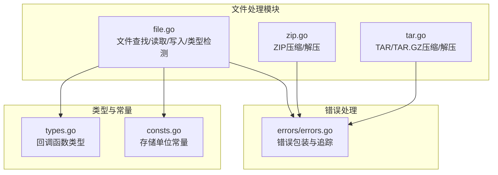
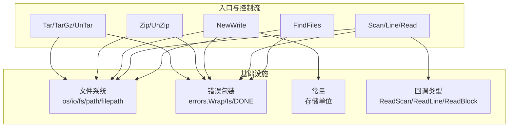
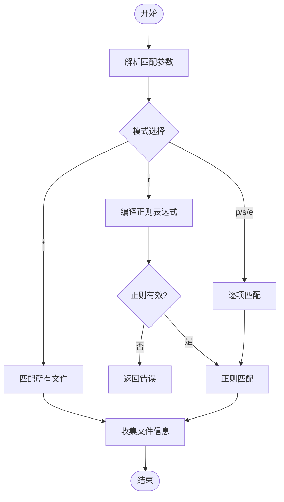
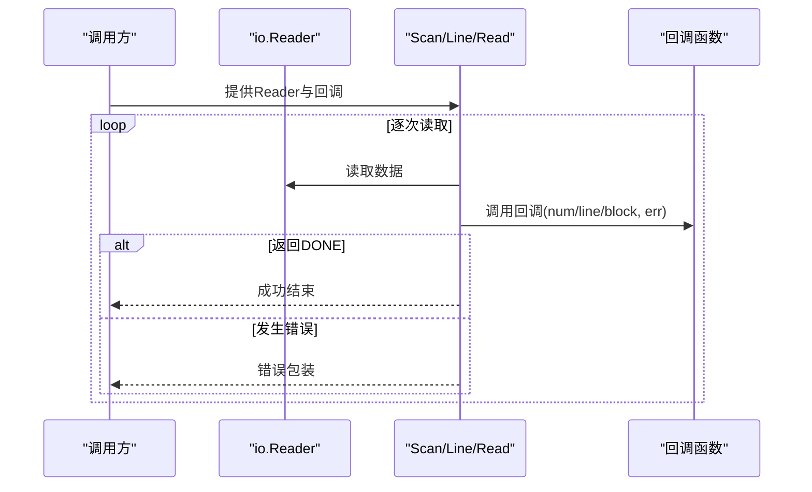
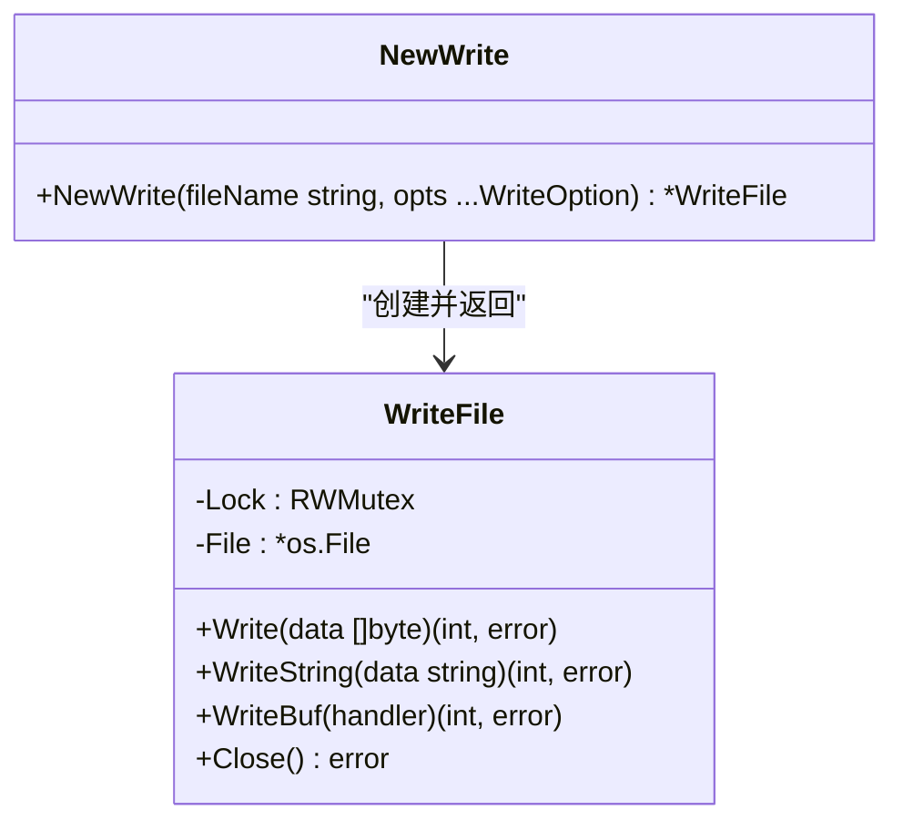
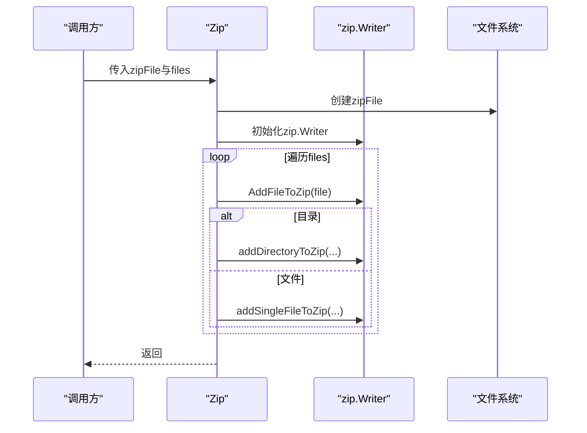
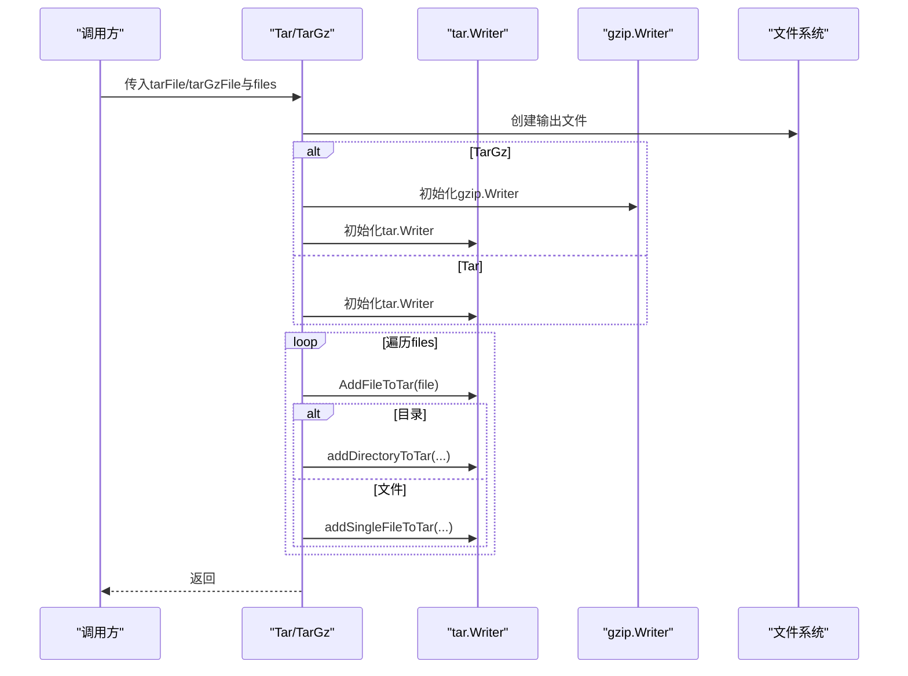
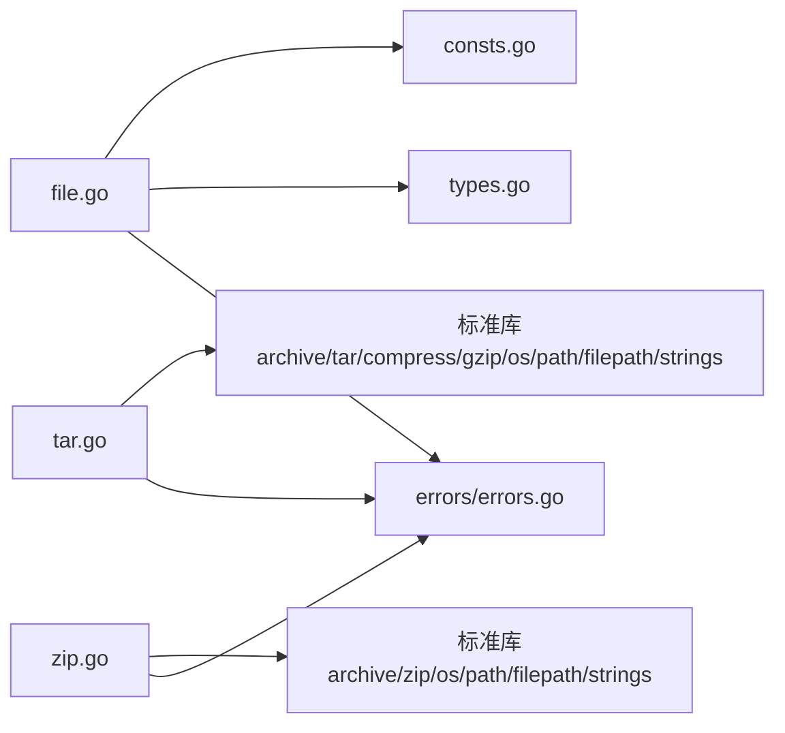

# 文件处理API

<cite>
**本文档引用的文件**
- [file.go](file://file.go)
- [zip.go](file://zip.go)
- [tar.go](file://tar.go)
- [file_test.go](file://file_test.go)
- [zip_test.go](file://zip_test.go)
- [tar_test.go](file://tar_test.go)
- [consts.go](file://consts.go)
- [types.go](file://types.go)
- [errors/errors.go](file://errors/errors.go)
- [README.md](file://README.md)
</cite>

## 目录

1. [简介](#简介)
2. [项目结构](#项目结构)
3. [核心组件](#核心组件)
4. [架构总览](#架构总览)
5. [详细组件分析](#详细组件分析)
6. [依赖关系分析](#依赖关系分析)
7. [性能考虑](#性能考虑)
8. [故障排除指南](#故障排除指南)
9. [结论](#结论)

## 简介

本文件处理API参考文档聚焦于文件查找、读取、写入、扫描以及压缩打包（ZIP/TAR）等核心能力。文档覆盖以下关键接口：

- 文件查找：FindFiles
- 文件读取：Scan、Line、Read
- 文件写入：NewWrite、WriteFile.Write、WriteFile.WriteString、WriteFile.WriteBuf
- 文件类型检测：FileType
- 压缩打包：Zip、Tar、TarGz
- 解压缩：UnZip、UnTar

同时，文档说明了文件路径处理、权限检查、并发安全等重要概念，并给出错误处理机制与最佳实践。

## 项目结构

仓库采用按功能分层的组织方式，文件处理相关的核心代码集中在以下文件：

- file.go：文件系统操作、文件读取、写入、类型检测
- zip.go：ZIP压缩与解压
- tar.go：TAR与TAR.GZ压缩与解压
- file_test.go、zip_test.go、tar_test.go：各模块的单元测试
- consts.go：常量定义（如存储单位）
- types.go：回调函数类型定义（ReadScan、ReadLine、ReadBlock）
- errors/errors.go：统一错误包装与追踪

**图表来源**

- [file.go](file://file.go#L1-L451)
- [zip.go](file://zip.go#L1-L213)
- [tar.go](file://tar.go#L1-L263)
- [consts.go](file://consts.go#L1-L23)
- [types.go](file://types.go#L1-L98)
- [errors/errors.go](file://errors/errors.go#L1-L282)

**章节来源**

- [file.go](file://file.go#L1-L451)
- [zip.go](file://zip.go#L1-L213)
- [tar.go](file://tar.go#L1-L263)
- [consts.go](file://consts.go#L1-L23)
- [types.go](file://types.go#L1-L98)
- [errors/errors.go](file://errors/errors.go#L1-L282)

## 核心组件

- 文件查找与匹配：FindFiles 支持深度/当前目录模式，支持通配、前缀、后缀、精确匹配与正则匹配。
- 文件读取管线：Scan（基于bufio.Scanner）、Line（基于bufio.Reader）、Read（基于io.Read）三种读取策略，分别适用于不同场景。
- 文件写入与并发安全：NewWrite 创建带锁保护的WriteFile实例，提供 Write、WriteString、WriteBuf 三种写入方式。
- 文件类型检测：FileType 基于扩展名与内容探测，自动回退并复位文件指针。
- 压缩打包：Zip（.zip）、Tar（.tar）、TarGz（.tar.gz）三类打包接口。
- 解压缩：UnZip（.zip）、UnTar（.tar/.tar.gz）两类解压接口。

**章节来源**

- [file.go](file://file.go#L89-L225)
- [file.go](file://file.go#L227-L309)
- [file.go](file://file.go#L311-L395)
- [file.go](file://file.go#L434-L450)
- [zip.go](file://zip.go#L12-L41)
- [tar.go](file://tar.go#L13-L79)
- [tar.go](file://tar.go#L176-L262)

## 架构总览

文件处理模块围绕“文件系统操作”“流式读取”“并发写入”“压缩打包”四大维度构建，统一通过错误包装层(errors)进行异常处理与追踪。

**图表来源**

- [file.go](file://file.go#L1-L451)
- [zip.go](file://zip.go#L1-L213)
- [tar.go](file://tar.go#L1-L263)
- [consts.go](file://consts.go#L12-L22)
- [types.go](file://types.go#L76-L97)
- [errors/errors.go](file://errors/errors.go#L24-L72)

## 详细组件分析

### 文件查找 FindFiles

- 功能概述：在指定目录下查找匹配的文件，支持深度遍历与当前目录两种模式，支持多种匹配规则。
- 函数签名与参数
    - path: 目标目录路径
    - depth: 是否深度遍历
    - match...: 可选匹配规则，支持以下形式：
        - 仅一个参数且非"*"：视为精确匹配，等价于 e 规则
        - 两个及以上参数：
            - 第一个参数为 "*", "p"(前缀), "s"(后缀), "r"(正则), "e"(精确)之一
            - 后续参数为对应规则的匹配项
- 返回值：[]FileInfo（包含文件信息与绝对路径），error
- 匹配规则
    - "*": 匹配所有文件
    - "p": 前缀匹配
    - "s": 后缀匹配
    - "r": 正则表达式匹配（需验证正则有效性）
    - "e": 精确匹配
- 错误处理：匹配规则校验失败、WalkDir/ReadDir错误、文件信息获取错误均通过错误包装返回
- 并发安全：内部使用只读遍历，无共享状态，天然线程安全

**图表来源**

- [file.go](file://file.go#L89-L225)

**章节来源**

- [file.go](file://file.go#L89-L225)

### 文件读取 API

- Scan：基于bufio.Scanner，适合逐行读取，支持自定义Scanner缓冲区大小
    - 参数：io.Reader、ReadScan回调、可选缓冲区大小
    - 回调：num(行号)、line(行数据)、err(扫描错误)
    - 结束条件：回调返回DONE时终止
- Line：基于bufio.Reader，逐行读取，适合大文件或大行数据
    - 回调：num(行号)、line(行数据)、lineDone(当前行是否完整)
    - 结束条件：回调返回DONE时终止
- Read：基于io.Read，按固定块大小读取，适合无换行或大文件
    - 回调：size(本次读取字节数)、block(数据块)
    - 结束条件：回调返回DONE时终止

**图表来源**

- [file.go](file://file.go#L227-L309)
- [types.go](file://types.go#L78-L97)

**章节来源**

- [file.go](file://file.go#L227-L309)
- [types.go](file://types.go#L78-L97)

### 文件写入 API

- NewWrite：创建带锁保护的WriteFile实例
    - 参数：fileName(文件路径)、opts(可选配置项，如WithWriteAppend、WithWritePerm)
    - 自动创建目录（若不存在），默认目录权限根据文件权限推导
    - 返回：*WriteFile、error
- WriteFile.Write：写入字节切片，内部加锁
- WriteFile.WriteString：写入字符串，内部加锁
- WriteFile.WriteBuf：使用bufio.Writer写入，内部加锁并在结束后Flush
- WriteFile.Close：关闭文件句柄

**图表来源**

- [file.go](file://file.go#L311-L395)

**章节来源**

- [file.go](file://file.go#L311-L395)

### 文件类型检测 FileType

- 功能概述：根据扩展名或文件内容检测MIME类型，必要时回退到内容探测并复位文件指针
- 参数：*os.File
- 返回：string(类型)、error
- 注意：读取内容后会Seek回文件起始位置

**章节来源**

- [file.go](file://file.go#L434-L450)

### ZIP 压缩与解压

- Zip：将多个文件/目录打包为.zip
    - 参数：zipFile(.zip文件路径)、files(待打包文件/目录列表)
    - 内部：逐个调用AddFileToZip，支持目录递归
- AddFileToZip：根据路径类型选择单文件或目录处理
- addSingleFileToZip：创建zip.Header并写入文件数据
- addDirectoryToZip：递归处理目录内文件
- UnZip：解压.zip文件至目标目录
    - 参数：zipFile、destDir
    - 内部：遍历zip.File，按目录/文件分别创建

**图表来源**

- [zip.go](file://zip.go#L12-L41)
- [zip.go](file://zip.go#L43-L138)

**章节来源**

- [zip.go](file://zip.go#L12-L41)
- [zip.go](file://zip.go#L43-L138)
- [zip.go](file://zip.go#L140-L212)

### TAR 压缩与解压

- Tar：生成.tar文件
    - 参数：tarFile(.tar文件路径)、files(待打包文件/目录列表)
    - 内部：AddFileToTar -> addSingleFileToTar/addDirectoryToTar
- TarGz：生成.tar.gz文件
    - 参数：tarGzFile(.tar.gz文件路径)、files
    - 内部：先创建gzip.Writer，再创建tar.Writer
- UnTar：解压.tar或.tar.gz
    - 参数：tarFile、destDir
    - 内部：根据后缀判断是否使用gzip.Reader，逐条读取tar.Header并写入文件

**图表来源**

- [tar.go](file://tar.go#L13-L79)
- [tar.go](file://tar.go#L176-L262)

**章节来源**

- [tar.go](file://tar.go#L13-L79)
- [tar.go](file://tar.go#L176-L262)

## 依赖关系分析

- 组件耦合
    - file.go 依赖 errors 包进行错误包装，依赖标准库 io/fs、path/filepath、mime、net/http 等
    - zip.go 依赖 archive/zip、os、path/filepath、strings
    - tar.go 依赖 archive/tar、compress/gzip、os、path/filepath、strings
    - types.go 定义回调类型，供 file.go 的读取API使用
    - consts.go 提供存储单位常量，供 file.go 的 SizeFormat 使用
- 错误处理契约
    - 所有公开API返回error，内部统一使用 errors.Wrap 包装
    - DONE 作为特殊错误信号，用于提前终止扫描/读取流程
- 并发安全
    - WriteFile 内部使用 sync.RWMutex 保证写入线程安全
    - 文件查找与读取API无共享状态，天然线程安全

**图表来源**

- [file.go](file://file.go#L1-L16)
- [zip.go](file://zip.go#L1-L10)
- [tar.go](file://tar.go#L1-L11)
- [types.go](file://types.go#L1-L98)
- [consts.go](file://consts.go#L1-L23)
- [errors/errors.go](file://errors/errors.go#L1-L282)

**章节来源**

- [file.go](file://file.go#L1-L16)
- [zip.go](file://zip.go#L1-L10)
- [tar.go](file://tar.go#L1-L11)
- [types.go](file://types.go#L1-L98)
- [consts.go](file://consts.go#L1-L23)
- [errors/errors.go](file://errors/errors.go#L1-L282)

## 性能考虑

- 读取策略选择
    - Scan：适合常规文本文件，可自定义缓冲区大小，避免超大行导致的扫描失败
    - Line：适合大文件或大行数据，逐行读取更稳定
    - Read：适合无换行或大文件，按固定块大小读取，避免内存峰值过高
- 写入策略选择
    - WriteBuf：使用bufio.Writer，批量写入，性能最优
    - WriteString/Write：逐次写入，适合小量数据或需要即时落盘的场景
- 并发写入
    - WriteFile 内部加锁，建议在高并发场景下合并写入批次，减少锁竞争
- 压缩打包
    - Zip/Tar/TarGz 均采用流式写入，避免一次性加载整个归档
    - TarGz 在大文件场景下额外增加压缩开销，需权衡存储空间与CPU消耗

[本节为通用性能指导，无需特定文件来源]

## 故障排除指南

- 常见错误与处理
    - 文件路径错误：检查路径存在性与权限，使用 IsExist/IsDir/IsFile 辅助判断
    - 匹配规则错误：FindFiles 对正则表达式进行编译校验，错误信息明确指出无效表达式
    - 读取超大行：Scan 支持调整缓冲区大小，避免 MaxTokenSize 限制
    - 写入并发冲突：使用 WriteFile.WriteBuf 或在业务层合并写入批次
    - 压缩/解压失败：确认文件扩展名与API匹配（.zip/.tar/.tar.gz），检查目标目录权限
- 错误包装与追踪
    - 所有错误通过 errors.Wrap 包装，支持链式追踪与日志记录
    - 使用 errors.Is/DONE 控制流程终止与错误识别

**章节来源**

- [file.go](file://file.go#L35-L48)
- [file.go](file://file.go#L121-L136)
- [file.go](file://file.go#L234-L240)
- [zip.go](file://zip.go#L17-L19)
- [tar.go](file://tar.go#L18-L20)
- [errors/errors.go](file://errors/errors.go#L24-L72)

## 结论

文件处理API提供了从文件查找、读取、写入到压缩打包的完整能力，具备良好的错误处理与并发安全设计。通过合理的读取策略与写入策略选择，可在不同场景下获得稳定的性能表现。建议在生产环境中结合权限检查与路径校验，确保操作的安全性与可靠性。