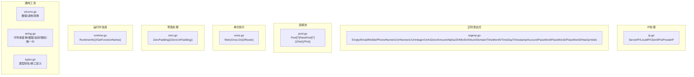
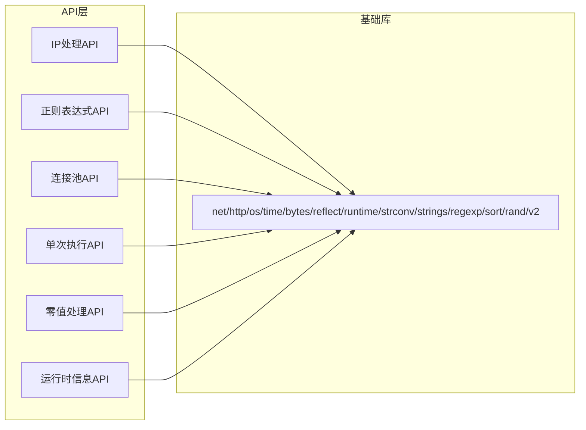
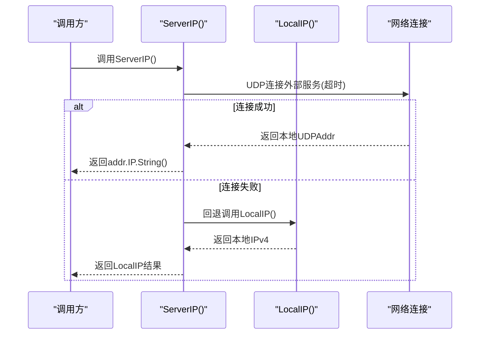
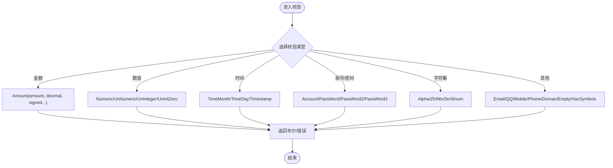
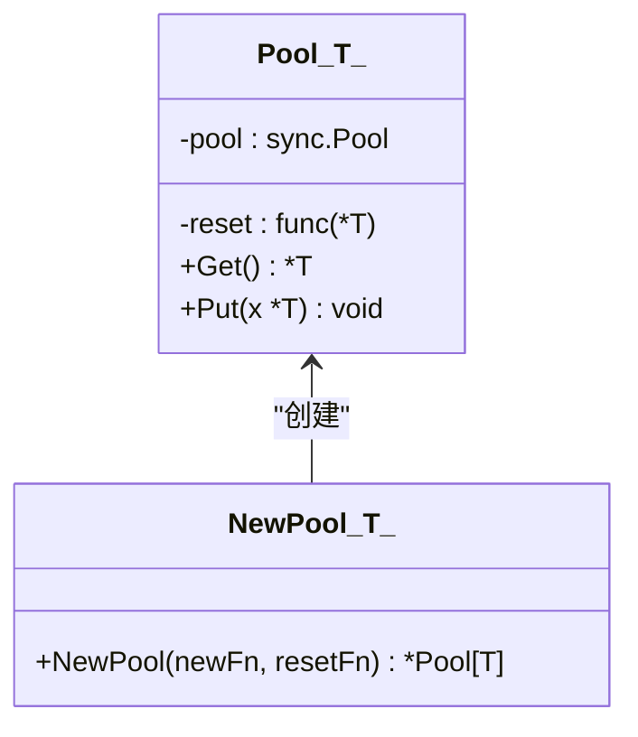
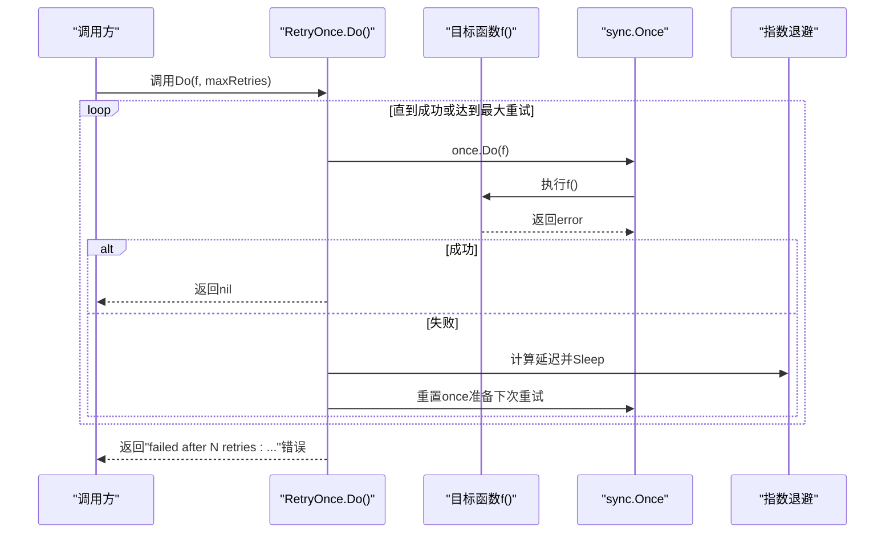
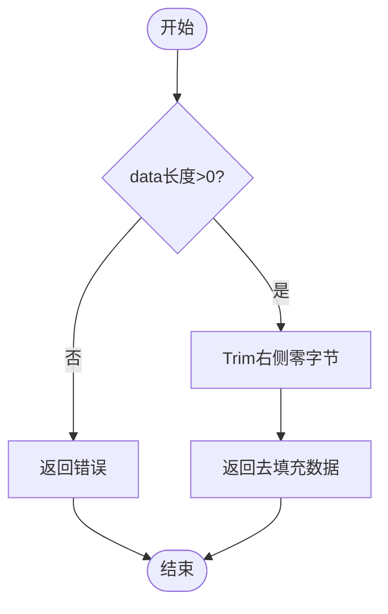
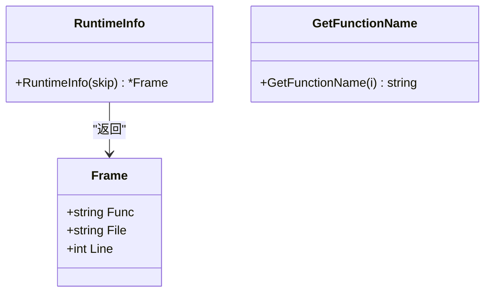
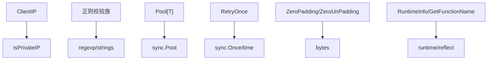

# 辅助工具API

<cite>
**本文档引用的文件**
- [ip.go](file://ip.go)
- [regexp.go](file://regexp.go)
- [pool.go](file://pool.go)
- [once.go](file://once.go)
- [zero.go](file://zero.go)
- [runtime.go](file://runtime.go)
- [strconv.go](file://strconv.go)
- [string.go](file://string.go)
- [types.go](file://types.go)
- [ip_test.go](file://ip_test.go)
- [regexp_test.go](file://regexp_test.go)
- [zero_test.go](file://zero_test.go)
- [runtime_test.go](file://runtime_test.go)
</cite>

## 目录

1. [简介](#简介)
2. [项目结构](#项目结构)
3. [核心组件](#核心组件)
4. [架构总览](#架构总览)
5. [详细组件分析](#详细组件分析)
6. [依赖分析](#依赖分析)
7. [性能考虑](#性能考虑)
8. [故障排查指南](#故障排查指南)
9. [结论](#结论)

## 简介

本文件为“辅助工具模块”的完整API参考文档，覆盖以下能力域：

- IP地址处理：服务器外网IP、本地IP、客户端IP解析与私网判定
- 正则表达式处理：多种格式校验与密码/账号规则校验
- 连接池管理：泛型对象池Pool的创建、获取、放回与重置
- 单次执行控制：带重试与指数退避的Once机制
- 零值处理：字节填充与去填充
- 运行时信息：函数名与调用栈帧信息获取

## 项目结构

本仓库采用按功能域划分的文件组织方式，各API模块独立成文件，便于维护与复用。

图表来源

- [ip.go](file://ip.go#L1-L89)
- [regexp.go](file://regexp.go#L1-L299)
- [pool.go](file://pool.go#L1-L34)
- [once.go](file://once.go#L1-L81)
- [zero.go](file://zero.go#L1-L29)
- [runtime.go](file://runtime.go#L1-L41)
- [strconv.go](file://strconv.go#L1-L109)
- [string.go](file://string.go#L1-L187)
- [types.go](file://types.go#L1-L98)

章节来源

- [ip.go](file://ip.go#L1-L89)
- [regexp.go](file://regexp.go#L1-L299)
- [pool.go](file://pool.go#L1-L34)
- [once.go](file://once.go#L1-L81)
- [zero.go](file://zero.go#L1-L29)
- [runtime.go](file://runtime.go#L1-L41)
- [strconv.go](file://strconv.go#L1-L109)
- [string.go](file://string.go#L1-L187)
- [types.go](file://types.go#L1-L98)

## 核心组件

- IP地址处理：提供服务器外网IP、本地IP、客户端IP解析与私网判定
- 正则表达式处理：提供常用格式校验与强弱密码/账号规则校验
- 连接池管理：泛型Pool封装sync.Pool，支持可选重置
- 单次执行控制：RetryOnce实现带重试与指数退避的单次执行
- 零值处理：ZeroPadding/ZeroUnPadding实现固定块大小的零填充与去填充
- 运行时信息：RuntimeInfo/GetFunctionName获取调用栈与函数名

章节来源

- [ip.go](file://ip.go#L11-L88)
- [regexp.go](file://regexp.go#L11-L298)
- [pool.go](file://pool.go#L5-L33)
- [once.go](file://once.go#L9-L80)
- [zero.go](file://zero.go#L8-L28)
- [runtime.go](file://runtime.go#L8-L40)

## 架构总览

整体以“功能域文件”为中心，API之间低耦合，通过标准库与错误包装库协作，形成清晰的职责边界。

图表来源

- [ip.go](file://ip.go#L3-L9)
- [regexp.go](file://regexp.go#L3-L9)
- [pool.go](file://pool.go#L3)
- [once.go](file://once.go#L3-L7)
- [zero.go](file://zero.go#L3-L6)
- [runtime.go](file://runtime.go#L3-L6)

## 详细组件分析

### IP地址处理API

- 功能概述
    - 获取服务器对外IP：尝试UDP连接外部服务以探测出站IP，失败回退到本地IP
    - 获取本地IP：优先解析主机名对应IPv4，否则遍历接口地址取首个非回环IPv4
    - 获取客户端IP：解析HTTP请求头X-Forwarded-For与X-Real-Ip，若为空回退RemoteAddr
    - 私网判定：对给定字符串进行IP解析并判断是否为回环或私网

- API清单与说明
    - ServerIP(): 返回服务器对外IP字符串
        - 返回值：string
        - 说明：内部超时连接外部UDP服务以确定出站IP，失败时回退至LocalIP
        - 示例：参见测试用例对返回值的断言
    - LocalIP(): 返回本机可用的IPv4地址
        - 返回值：string
        - 说明：优先解析主机名，否则遍历接口地址
    - ClientIP(r): 从HTTP请求中解析客户端IP
        - 参数：r *http.Request
        - 返回值：string
        - 说明：优先级X-Forwarded-For（剔除内网IP），其次X-Real-Ip，最后RemoteAddr
    - isPrivateIP(ip): 判断字符串是否为私网或回环IP
        - 参数：ip string
        - 返回值：bool

- 使用示例（基于测试）
    - 服务器IP：调用ServerIP()，断言返回非空字符串
    - 本地IP：调用LocalIP()，断言返回非空字符串
    - 客户端IP：构造http.Request并设置Header与RemoteAddr，断言ClientIP返回期望IP

图表来源

- [ip.go](file://ip.go#L12-L24)
- [ip.go](file://ip.go#L27-L51)

章节来源

- [ip.go](file://ip.go#L11-L88)
- [ip_test.go](file://ip_test.go#L9-L86)

### 正则表达式处理API

- 功能概述
    - 基础校验：空字符串、英文字母、中文、混合字符串、字母数字、域名等
    - 数值校验：有符号/无符号数字、无符号整数、含零无符号整数、金额（可带小数位与符号）
    - 时间校验：年月、年月日、时间戳（含分隔符一致性与日期有效性）
    - 账号/密码校验：账号规则（长度、首字母、连续下划线限制）、弱/强密码规则（字符集与组成要求）

- API清单与说明
    - Empty(value): 空字符串校验（去除空白后判空）
        - 参数：value string
        - 返回：bool
    - QQ(value)/Email(value)/Mobile(value)/Phone(value): 社会化/通信类格式校验
        - 返回：bool
    - Numeric(value)/UnNumeric(value)/UnInteger(value)/UnIntZero(value): 数值格式校验
        - 返回：bool
    - Amount(amount, decimal, signed...): 金额格式校验（可配置小数位与符号）
        - 参数：amount string, decimal uint8, signed ...bool
        - 返回：bool
    - Alpha(value)/Zh(value)/MixStr(value)/Alnum(value): 字符集/混合字符串校验
        - 返回：bool
    - Domain(value): 域名格式校验（支持http(s)前缀与中文域名）
        - 返回：bool
    - TimeMonth(value)/TimeDay(value)/Timestamp(value): 时间格式校验（含分隔符一致性与日期有效性）
        - 返回：bool
    - Account(value, min, max): 账号规则校验（长度、首字母、连续下划线限制）
        - 返回：error
    - PassWord(value, min, max)/PassWord2(value, min, max)/PassWord3(value, min, max): 密码规则校验（弱/强/更强）
        - 返回：error
    - HasSymbols(value): 是否包含符号/分隔符/标点
        - 返回：bool

- 使用示例（基于测试）
    - Amount：断言正确/错误格式组合
    -
    Email/Alnum/Alpha/UnInteger/MixStr/Mobile/Empty/Numeric/Phone/QQ/TimeDay/TimeMonth/Timestamp/UnNumeric/UnIntZero/Zh/Domain/PassWord/PassWord2/PassWord3/Account/HasSymbols：分别断言通过/失败场景

图表来源

- [regexp.go](file://regexp.go#L11-L298)

章节来源

- [regexp.go](file://regexp.go#L11-L298)
- [regexp_test.go](file://regexp_test.go#L8-L743)

### 连接池管理API（Pool[T]）

- 功能概述
    - 泛型对象池：基于sync.Pool封装，支持自定义New与可选Reset
    - 生命周期：NewPool创建池 -> Get取出对象 -> Put放回并可选重置 -> 复用减少GC压力

- API清单与说明
    - type Pool[T any]: 结构体，包含sync.Pool与可选reset函数
    - NewPool[T](newFn, resetFn): 创建池实例
        - 参数：newFn func() *T, resetFn func(*T)
        - 返回：*Pool[T]
    - (p *Pool[T]) Get(): 从池中获取对象
        - 返回：*T
    - (p *Pool[T]) Put(x *T): 放回对象（若存在reset则先执行）
        - 参数：x *T

图表来源

- [pool.go](file://pool.go#L5-L20)
- [pool.go](file://pool.go#L22-L33)

章节来源

- [pool.go](file://pool.go#L5-L33)

### 单次执行控制API（RetryOnce）

- 功能概述
    - 带重试与指数退避的单次执行：sync.Once确保目标函数在单次循环内仅执行一次
    - 支持最大重试次数、并发安全、状态重置

- API清单与说明
    - type RetryOnce: 结构体，包含sync.Once、互斥锁、完成标志与错误
    - (r *RetryOnce) Do(f func() error, maxRetries int) error: 执行带重试的函数
        - 参数：f无参且返回error，maxRetries最大重试次数
        - 返回：error（成功返回nil，失败返回包含重试次数与原始错误的错误）
        - 特性：指数退避、并发安全、单次执行
    - (r *RetryOnce) Reset(): 重置状态以便再次执行

图表来源

- [once.go](file://once.go#L30-L71)
- [once.go](file://once.go#L73-L80)

章节来源

- [once.go](file://once.go#L9-L80)

### 零值处理API（ZeroPadding/ZeroUnPadding）

- 功能概述
    - ZeroPadding：按固定块大小对字节切片进行零填充
    - ZeroUnPadding：去除零填充，返回原始数据并进行长度校验

- API清单与说明
    - ZeroPadding(data []byte, blockSize int) []byte: 返回填充后的字节切片
        - 参数：data源数据，blockSize块大小
        - 返回：[]byte
    - ZeroUnPadding(data []byte) ([]byte, error): 去除零填充并返回数据与错误
        - 参数：data待处理字节切片
        - 返回：[]byte, error（空数据时返回错误）

- 使用示例（基于测试）
    - ZeroPadding：断言不同输入长度与块大小下的填充结果
    - ZeroUnPadding：断言去填充后的字节序列与错误情况

图表来源

- [zero.go](file://zero.go#L17-L28)

章节来源

- [zero.go](file://zero.go#L8-L28)
- [zero_test.go](file://zero_test.go#L9-L64)

### 运行时信息API（RuntimeInfo/GetFunctionName）

- 功能概述
    - RuntimeInfo：根据skip层级获取调用栈帧（文件、行号、函数名）
    - GetFunctionName：获取任意接口所指向函数的名称（支持普通函数、方法、匿名函数）

- API清单与说明
    - type Frame: 结构体，包含Func、File、Line
    - RuntimeInfo(skip int) *Frame: 获取调用栈帧
        - 参数：skip跳过层级
        - 返回：*Frame
    - GetFunctionName(i interface{}) string: 获取函数名
        - 参数：i任意接口
        - 返回：string（未知时返回特定字符串）

- 使用示例（基于测试）
    - RuntimeInfo：调用并记录返回的Frame信息

图表来源

- [runtime.go](file://runtime.go#L8-L30)
- [runtime.go](file://runtime.go#L32-L40)

章节来源

- [runtime.go](file://runtime.go#L8-L40)
- [runtime_test.go](file://runtime_test.go#L8-L24)

## 依赖分析

- 内部依赖关系
    - ClientIP依赖isPrivateIP进行私网判定
    - 正则校验函数依赖regexp与strings包
    - Pool[T]依赖sync.Pool
    - RetryOnce依赖sync.Once与time
    - ZeroPadding/ZeroUnPadding依赖bytes
    - RuntimeInfo依赖runtime与reflect

图表来源

- [ip.go](file://ip.go#L54-L88)
- [regexp.go](file://regexp.go#L3-L9)
- [pool.go](file://pool.go#L3)
- [once.go](file://once.go#L3-L7)
- [zero.go](file://zero.go#L3-L6)
- [runtime.go](file://runtime.go#L3-L6)

章节来源

- [ip.go](file://ip.go#L54-L88)
- [regexp.go](file://regexp.go#L3-L9)
- [pool.go](file://pool.go#L3)
- [once.go](file://once.go#L3-L7)
- [zero.go](file://zero.go#L3-L6)
- [runtime.go](file://runtime.go#L3-L6)

## 性能考虑

- 连接池
    - 利用sync.Pool减少频繁分配与GC压力，建议配合Reset清理对象状态
- 正则表达式
    - 预编译正则可降低重复编译开销；注意避免复杂回溯导致的性能问题
- 字符串与字节处理
    - 使用strings.Builder与bytes.Buffer预分配容量，减少扩容
- 运行时信息
    - RuntimeInfo涉及runtime.Caller，建议在高频路径谨慎使用

## 故障排查指南

- IP解析失败
    - ServerIP回退LocalIP，若仍为空，检查网络连通性与主机名解析
    - ClientIP为空时检查请求头是否正确设置
- 正则校验异常
    - 注意分隔符一致性与时效性（如时间格式）
    - 密码/账号规则错误时，依据返回的错误信息定位具体约束
- 连接池
    - 放回对象前确保Reset逻辑正确，避免状态泄漏
- 单次执行
    - 若Do返回“达到最大重试”，检查目标函数是否幂等且可重试
- 零填充
    - ZeroUnPadding对空数据返回错误，确保输入非空
- 运行时信息
    - skip层级不当可能导致文件/行号不准确，按需调整

## 结论

本模块提供了覆盖IP解析、正则校验、对象池、单次执行、零值处理与运行时信息的完整工具集，接口设计简洁、职责明确，适合在业务系统中作为通用辅助能力复用。建议结合测试用例与实际场景进行集成与优化。