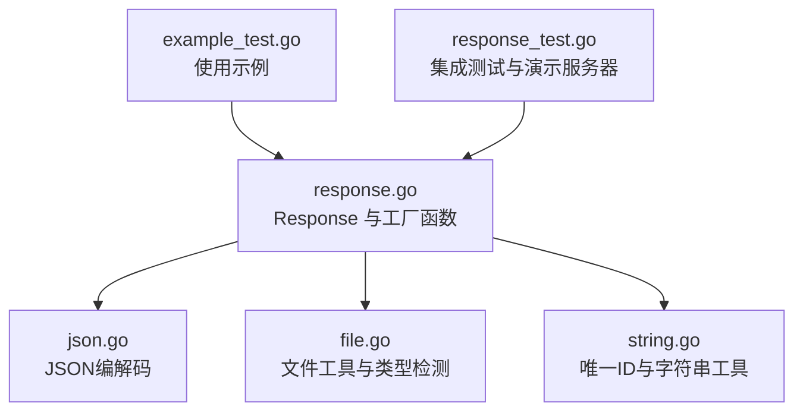
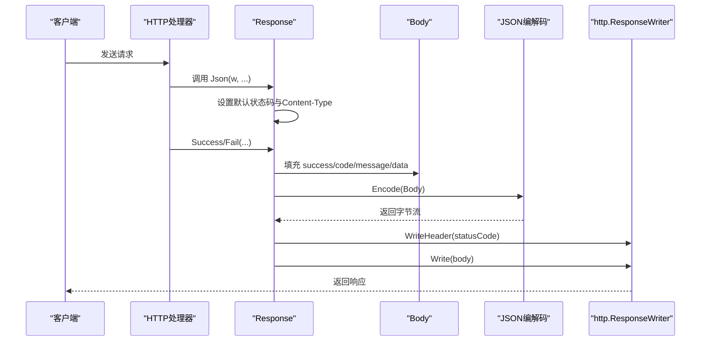
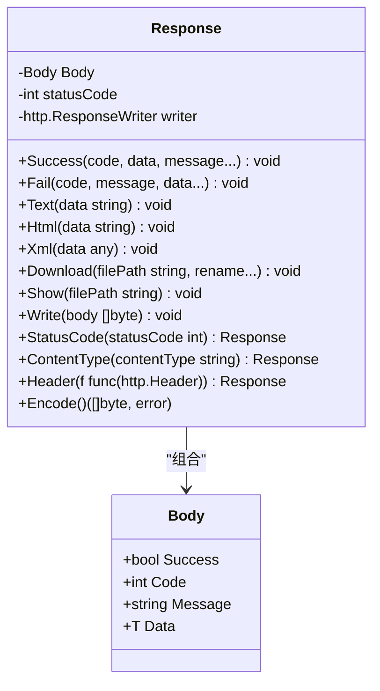
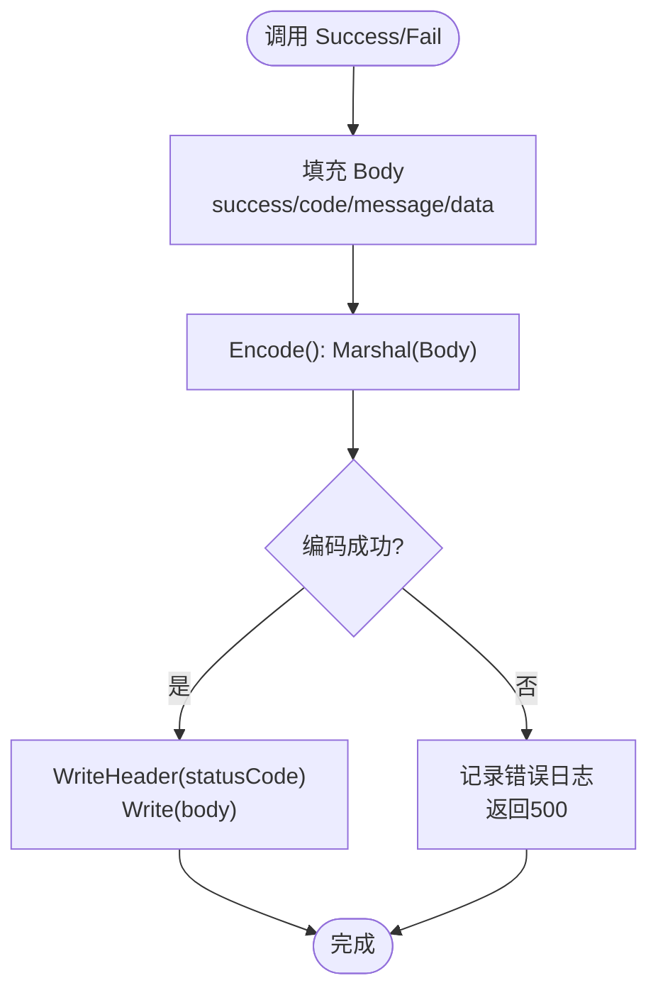
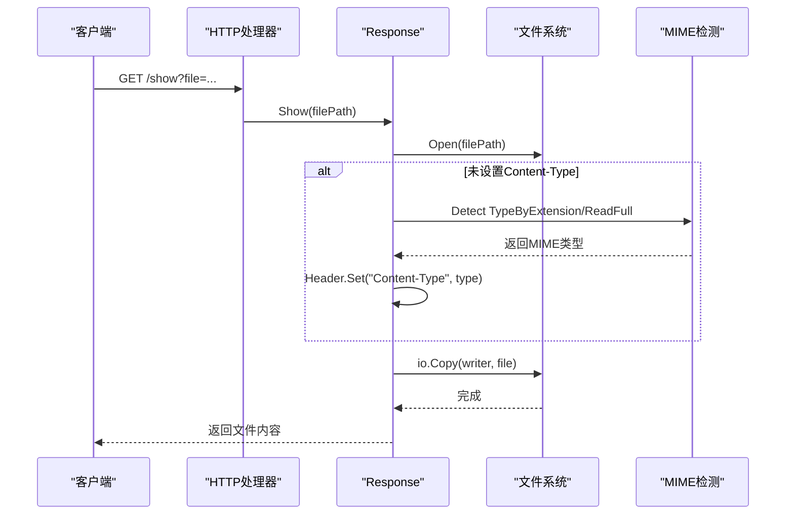
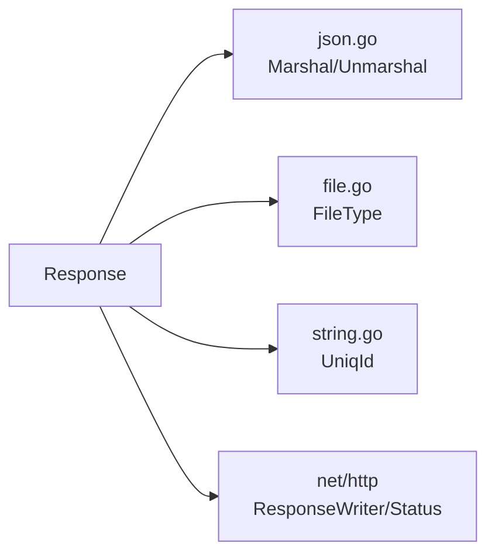

# HTTP响应模块

<cite>
**本文档引用的文件**
- [response.go](file://response.go)
- [response_test.go](file://response_test.go)
- [example_test.go](file://example_test.go)
- [json.go](file://json.go)
- [file.go](file://file.go)
- [string.go](file://string.go)
- [types.go](file://types.go)
- [README.md](file://README.md)
</cite>

## 目录

1. [简介](#简介)
2. [项目结构](#项目结构)
3. [核心组件](#核心组件)
4. [架构总览](#架构总览)
5. [详细组件分析](#详细组件分析)
6. [依赖关系分析](#依赖关系分析)
7. [性能考量](#性能考量)
8. [故障排查指南](#故障排查指南)
9. [结论](#结论)
10. [附录](#附录)

## 简介

本模块提供统一的HTTP响应封装，围绕Response结构体 设计，支持多种输出格式（JSON、XML、HTML、纯文本）、文件下载与显示、响应头设置与Content-Type自动检测，并与
net/http 包无缝集成。模块通过统一的 Body 结构体实现“成功/失败”状态、业务状态码、消息与数据的标准化输出，便于前端与客户端统一解析。

## 项目结构

- response.go：核心响应模块，包含 Response、Body、各类响应方法与工厂函数
- response_test.go：响应模块的集成测试与演示服务器
- example_test.go：响应模块的使用示例，覆盖JSON、HTML/XML、文本、文件下载/显示、重定向
- json.go：JSON编解码配置与工具，支持自定义编解码器
- file.go：文件工具，包含文件类型检测 FileType、文件存在性判断等
- string.go：字符串与唯一ID工具，提供 UniqId 用于错误追踪
- types.go：通用类型别名与接口定义
- README.md：项目说明与历史变更

图表来源

- [response.go](file://response.go#L1-L342)
- [json.go](file://json.go#L1-L67)
- [file.go](file://file.go#L1-L451)
- [string.go](file://string.go#L1-L187)
- [example_test.go](file://example_test.go#L1-L108)
- [response_test.go](file://response_test.go#L1-L82)

章节来源

- [response.go](file://response.go#L1-L342)
- [example_test.go](file://example_test.go#L1-L108)
- [response_test.go](file://response_test.go#L1-L82)

## 核心组件

- Response：响应对象，持有 Body、状态码与 http.ResponseWriter
- Body：统一响应载体，包含 success、code、message、data
- 工厂函数：
    - Json：创建JSON响应对象，预设 Content-Type 为 application/json
    - View：创建文本视图响应对象，不预设 Content-Type
    - Redirect：直接发送重定向响应
- 方法族：
    - Success/Fail：统一JSON响应
    - Text/Html/Xml：纯文本、HTML、XML响应
    - Download/Show：文件下载与显示
    - StatusCode/ContentType/Header：状态码与响应头控制
    - Write/Encode：底层写入与编码

章节来源

- [response.go](file://response.go#L11-L342)

## 架构总览

Response 作为门面，将业务数据封装进 Body，并通过 Encode() 序列化为字节流，再由 Write() 写入 http.ResponseWriter。文件下载/显示通过
FileType() 自动推断 MIME 类型并设置 Content-Type，同时根据场景设置 Content-Disposition 或直接输出文件内容。

图表来源

- [response.go](file://response.go#L29-L54)
- [response.go](file://response.go#L289-L292)
- [json.go](file://json.go#L52-L58)

## 详细组件分析

### Response 与 Body

- data字段使用any类型，支持任意数据结构
- 统一字段：Body 提供 success、code、message、data 四要素，便于前端统一解析
- 生命周期：Response 在构造时绑定 http.ResponseWriter，后续所有写入均作用于该连接

图表来源

- [response.go](file://response.go#L11-L22)
- [response.go](file://response.go#L29-L342)

章节来源

- [response.go](file://response.go#L11-L22)

### JSON 响应：Success/Fail 与 Json

- Json：创建响应对象并预设 Content-Type 为 application/json，支持传入初始状态码
- Success：设置 success=true、默认状态码为 200，可选自定义 message
- Fail：设置 success=false，可选 data
- Encode：通过 Marshal(Body) 进行序列化，失败时记录带唯一ID的错误并返回 500

图表来源

- [response.go](file://response.go#L29-L54)
- [response.go](file://response.go#L61-L83)
- [response.go](file://response.go#L289-L292)
- [json.go](file://json.go#L52-L58)

章节来源

- [response.go](file://response.go#L24-L83)
- [json.go](file://json.go#L52-L58)

### 文本/HTML/XML 响应

- Text：设置 Content-Type 为 text/plain，直接写入字符串
- Html：设置 Content-Type 为 text/html，直接写入HTML字符串
- Xml：使用 xml.MarshalIndent 序列化任意结构体，设置 Content-Type 为 application/xml，并写入XML声明与缩进后的数据

章节来源

- [response.go](file://response.go#L85-L116)

### 文件下载与显示：Download/Show

- Show：打开文件，若未设置 Content-Type 则通过 FileType() 自动检测 MIME 类型，随后直接复制文件内容到响应
- Download：与 Show 类似，但额外设置 Content-Disposition 为 attachment 并指定文件名，实现浏览器下载行为
- FileType：优先使用扩展名映射，若为空则读取文件前512字节进行类型检测，并将文件指针回退到起点

图表来源

- [response.go](file://response.go#L201-L251)
- [file.go](file://file.go#L434-L450)

章节来源

- [response.go](file://response.go#L118-L251)
- [file.go](file://file.go#L434-L450)

### 响应头与状态码管理

- StatusCode：设置响应状态码（如 http.StatusOK）
- ContentType：设置 Content-Type，并自动附加 ; charset=utf-8
- Header：允许传入回调函数对 http.Header 进行自由定制（如设置自定义头）

章节来源

- [response.go](file://response.go#L271-L287)

### 重定向

- Redirect：设置 Location 头与状态码（默认 302），立即返回重定向响应

章节来源

- [response.go](file://response.go#L325-L341)

### 与 net/http 的集成

- Response 直接持有 http.ResponseWriter，所有写入操作均作用于该连接
- 工厂函数 Json、View、Redirect 直接接收 http.ResponseWriter，无需额外适配
- 示例中通过 http.ServeMux 注册路由并调用相应响应方法

章节来源

- [example_test.go](file://example_test.go#L17-L107)
- [response_test.go](file://response_test.go#L51-L81)

## 依赖关系分析

- Response 依赖：
    - json.go：Marshal/Unmarshal，支持自定义JSON编解码器
    - file.go：FileType，用于文件下载/显示时的MIME类型检测
    - string.go：UniqId，用于错误日志的唯一ID生成
    - net/http：http.ResponseWriter、状态码常量
- 内聚性高：所有响应逻辑集中在 response.go，耦合点清晰
- 外部依赖：仅依赖标准库与本仓库其他工具模块

图表来源

- [response.go](file://response.go#L1-L342)
- [json.go](file://json.go#L1-L67)
- [file.go](file://file.go#L1-L451)
- [string.go](file://string.go#L1-L187)

章节来源

- [response.go](file://response.go#L1-L342)

## 性能考量

- JSON序列化：通过可插拔的 Marshal/Unmarshal，可在启动阶段通过 SetJsonMethod 配置高性能第三方库，避免每次序列化使用反射
- 文件传输：Download/Show 使用 io.Copy 直接从文件句柄复制到响应，减少中间缓冲
- MIME检测：FileType 先尝试扩展名映射，失败时仅读取少量字节进行检测，避免全量读取
- 唯一ID：UniqId 使用36进制字符串拼接，避免频繁分配，适合高频错误日志场景

章节来源

- [json.go](file://json.go#L38-L58)
- [file.go](file://file.go#L434-L450)
- [string.go](file://string.go#L133-L183)

## 故障排查指南

- JSON编码错误：Success/Fail 在 Encode() 失败时会记录带唯一ID的错误日志，并返回 500，可通过唯一ID定位问题
- XML编码错误：Xml 在 xml.MarshalIndent 失败时同样记录错误并返回 500
- 文件打开/统计/类型检测错误：Download/Show 在文件操作失败时记录错误并返回 500
- 写入错误：Write 在写入 http.ResponseWriter 失败时记录错误并返回 500
- 调试技巧：
    - 使用唯一ID快速定位错误来源
    - 在需要自定义JSON行为时，使用 SetJsonMethod 注入自定义编解码器
    - 对于大文件下载，确保目标路径存在且可读

章节来源

- [response.go](file://response.go#L40-L53)
- [response.go](file://response.go#L69-L82)
- [response.go](file://response.go#L98-L116)
- [response.go](file://response.go#L122-L198)
- [response.go](file://response.go#L201-L268)
- [json.go](file://json.go#L38-L58)

## 结论

本模块以 Response 为核心，结合 Body 实现统一响应格式，提供丰富的输出能力与良好的扩展性。通过与 net/http
的深度集成、完善的错误处理与调试支持，能够满足大多数Web服务的响应需求。建议在应用启动阶段配置合适的JSON编解码器，并在需要时对Content-Type与响应头进行精细化控制。

## 附录

### API 参考

- Response
    - Success(code, data, message...)：成功JSON响应
    - Fail(code, message, data...)：失败JSON响应
    - Text(data)：纯文本响应
    - Html(data)：HTML响应
    - Xml(data)：XML响应
    - Download(filePath, rename...)：文件下载
    - Show(filePath)：文件显示
    - StatusCode(statusCode)：设置状态码
    - ContentType(contentType)：设置Content-Type
    - Header(f)：设置响应头
    - Encode()：编码Body
    - Write(body)：写入响应

- 工厂函数
    - Json(w, opts...ResponseOption)
- ResponseOption: WithStatusCode(code), WithContentType(ct), WithHeader(key, value)：创建JSON响应对象
    - View(w, opts...ResponseOption)：创建文本视图响应对象
    - Redirect(w, url, opts...ResponseOption)：重定向

- 工具函数
    - SetJsonMethod(opts...)：配置JSON编解码器
    - Marshal(v)：JSON编码
    - Unmarshal(data, v)：JSON解码
    - FileType(file)：文件类型检测
    - UniqId(l, r...)：生成唯一ID

章节来源

- [response.go](file://response.go#L29-L341)
- [json.go](file://json.go#L38-L66)
- [file.go](file://file.go#L434-L450)
- [string.go](file://string.go#L133-L183)

### 使用示例

- JSON响应：示例展示成功与失败两种场景
- HTML/XML/文本：示例展示不同格式的响应
- 文件下载/显示：示例展示文件下载与显示，包含错误处理
- 重定向：示例展示如何进行重定向

章节来源

- [example_test.go](file://example_test.go#L17-L107)
- [response_test.go](file://response_test.go#L51-L81)