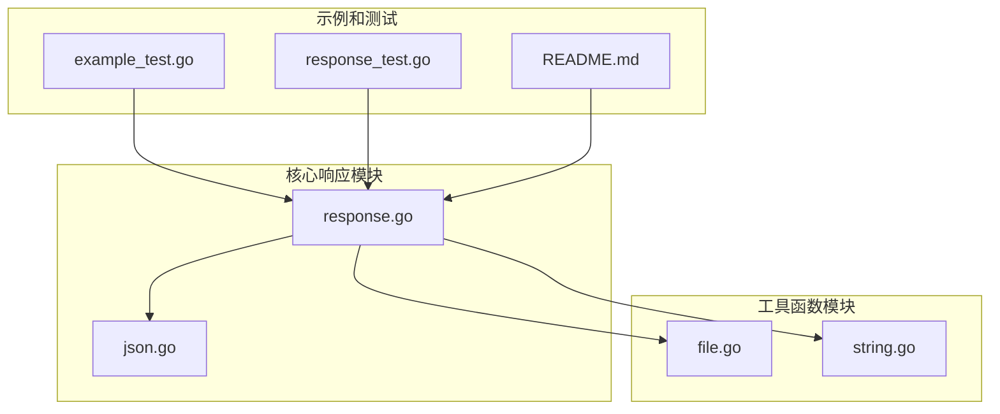
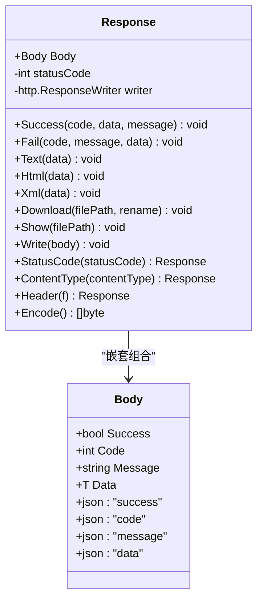
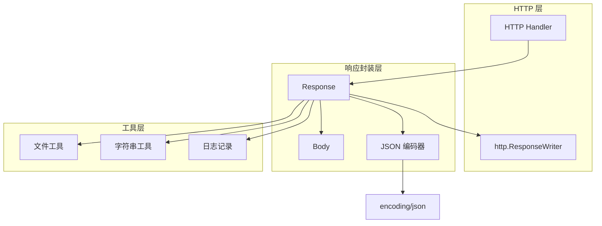
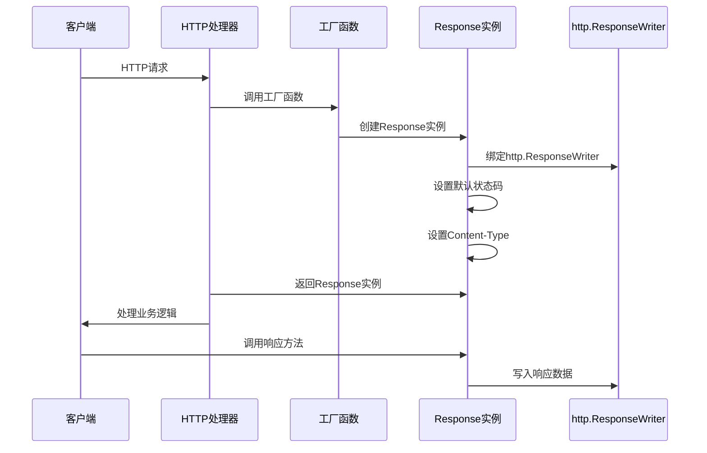
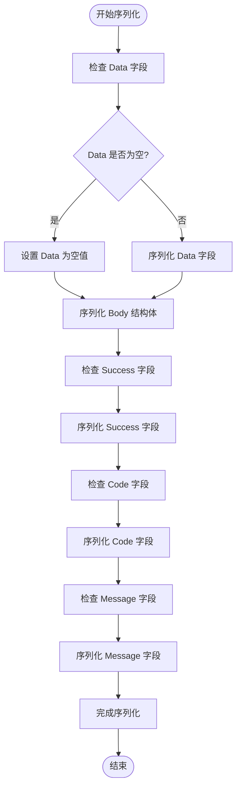
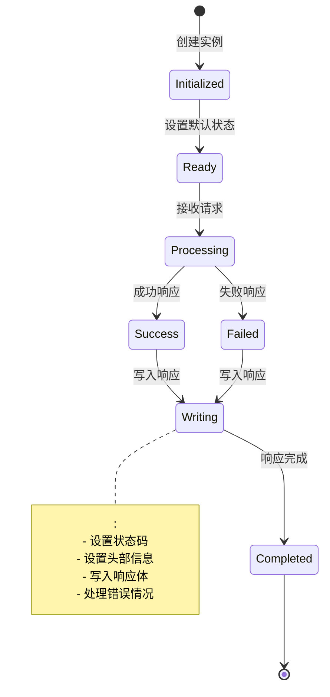
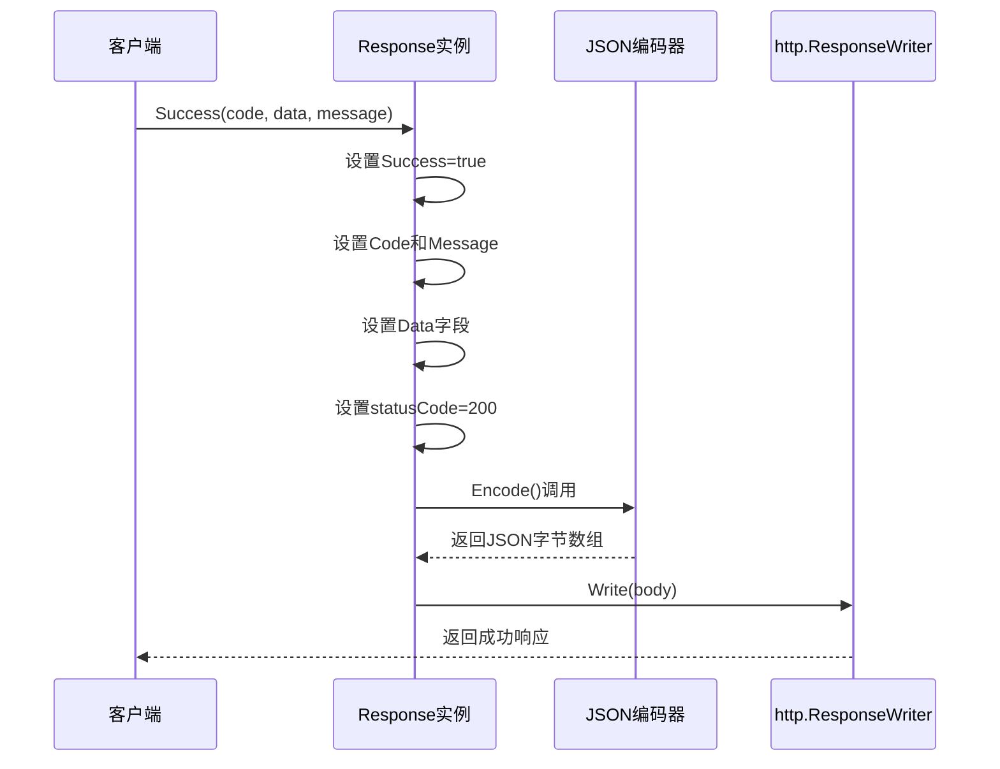
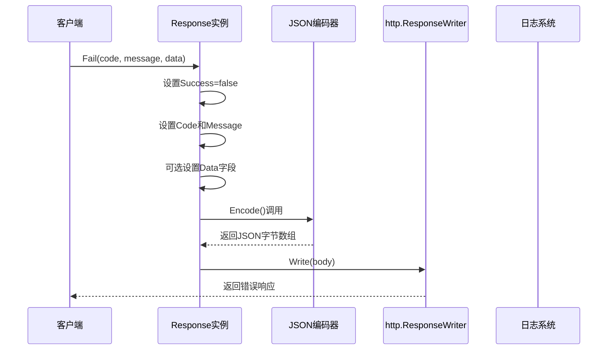
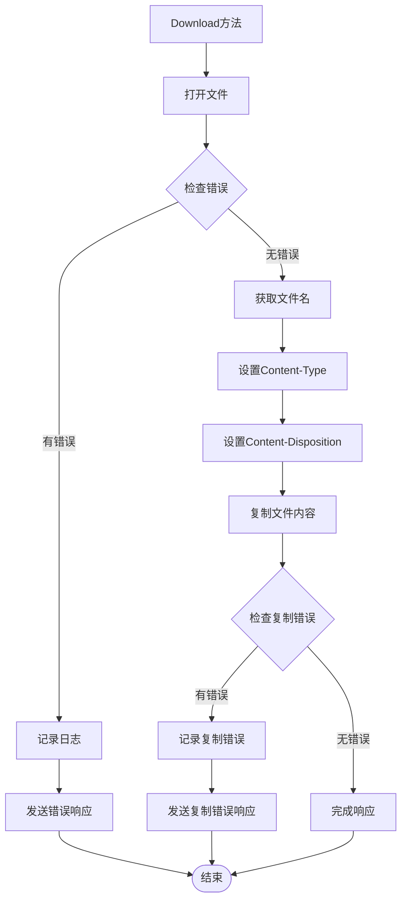
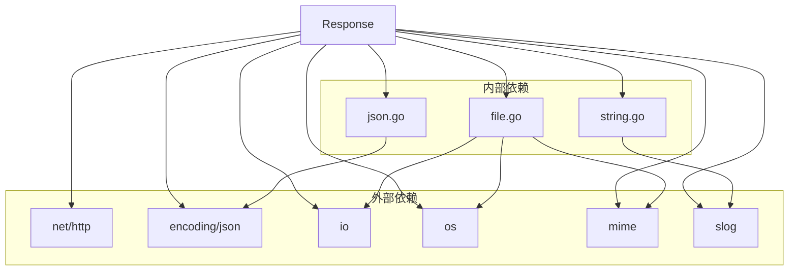

# Response结构体设计

<cite>
**本文档引用的文件**
- [response.go](file://response.go)
- [json.go](file://json.go)
- [file.go](file://file.go)
- [string.go](file://string.go)
- [example_test.go](file://example_test.go)
- [response_test.go](file://response_test.go)
- [README.md](file://README.md)
</cite>

## 目录

1. [简介](#简介)
2. [项目结构](#项目结构)
3. [核心组件](#核心组件)
4. [架构概览](#架构概览)
5. [详细组件分析](#详细组件分析)
6. [依赖关系分析](#依赖关系分析)
7. [性能考虑](#性能考虑)
8. [故障排除指南](#故障排除指南)
9. [结论](#结论)

## 简介

Response 是 Go-utils 库中的一个响应结构体，专为简化 HTTP 响应处理而设计。它提供了统一的响应格式，支持多种数据类型的序列化，并与
http.ResponseWriter 无缝集成。该结构体通过any类型实现灵活的数据传输，确保编译时就能发现类型错误。

Response 结构体的核心设计理念是提供一个简洁、类型安全且功能丰富的响应封装，使得开发者能够专注于业务逻辑而非底层的响应细节。它支持
JSON、XML、HTML、纯文本以及文件下载等多种响应格式。

## 项目结构

Go-utils 项目采用模块化的文件组织方式，每个功能模块都有独立的文件：



**图表来源**

- [response.go](file://response.go#L1-L342)
- [json.go](file://json.go#L1-L67)
- [file.go](file://file.go#L1-L200)
- [string.go](file://string.go#L133-L186)

**章节来源**

- [response.go](file://response.go#L1-L342)
- [json.go](file://json.go#L1-L67)

## 核心组件

Response 结构体由两个主要部分组成：主体和嵌套的 Body 结构体。

### 结构体定义



**图表来源**

- [response.go](file://response.go#L11-L22)

### 字段详细说明

#### Body 结构体字段

| 字段名     | 类型     | JSON 标签   | 描述                          | 默认值    |
|---------|--------|-----------|-----------------------------|--------|
| Success | bool   | "success" | 响应状态标志，true 表示成功，false 表示失败 | false  |
| Code    | int    | "code"    | 响应识别码，用于标识操作结果              | 0      |
| Message | string | "message" | 响应信息描述，提供操作结果的详细说明          | ""     |
| Data    | T      | "data"    | 响应数据主体，any类型，可承载任意数据类型      | 需要显式赋值 |

#### Response 主结构体字段

| 字段名        | 类型                  | 描述         | 生命周期                     |
|------------|---------------------|------------|--------------------------|
| Body       | Body                | 嵌套的响应主体结构体 | 组合关系，随 Response 实例存在     |
| statusCode | int                 | HTTP 响应状态码 | 运行时可修改，影响最终响应            |
| writer     | http.ResponseWriter | HTTP 响应写入器 | 从 http.Handler 接收，负责实际输出 |

**章节来源**

- [response.go](file://response.go#L11-L22)

## 架构概览

Response 的整体架构体现了良好的面向对象设计原则，通过组合而非继承实现功能扩展。



**图表来源**

- [response.go](file://response.go#L1-L342)
- [json.go](file://json.go#L1-L67)

## 详细组件分析

### 初始化过程

Response 结构体的初始化遵循以下流程：



**图表来源**

- [response.go](file://response.go#L297-L308)
- [response.go](file://response.go#L313-L323)

### any类型的作用和约束

Response 使用any类型作为data字段，具有以下特点：

#### 类型安全性

- 编译时类型检查，防止运行时类型错误
- 支持任意数据类型，包括基础类型、结构体、切片等
- 保持数据完整性，避免类型转换错误

#### 使用场景

- **JSON 响应**：`Response` (User 数据)、`Response` ([]User 数据)
- **错误响应**：`Response` 用于携带错误详情
- **简单响应**：`Response` 用于纯文本响应

### JSON 序列化机制

Response 通过嵌套的 Body 结构体实现统一的 JSON 序列化：



**图表来源**

- [response.go](file://response.go#L17-L22)
- [response.go](file://response.go#L289-L292)

### HTTP 响应生命周期管理

Response 与 http.ResponseWriter 的生命周期管理体现了良好的资源管理原则：



**图表来源**

- [response.go](file://response.go#L253-L269)

### 方法族详解

#### 成功响应方法 (Success)

Success 方法专门处理成功的业务场景：



**图表来源**

- [response.go](file://response.go#L24-L54)

#### 失败响应方法 (Fail)

Fail 方法处理各种错误场景：



**图表来源**

- [response.go](file://response.go#L56-L83)

#### 文件处理方法

Response 提供了完整的文件处理能力：



**图表来源**

- [response.go](file://response.go#L118-L199)

### 工厂函数设计

Response 提供了多个工厂函数来满足不同的使用场景：

#### Json 工厂函数

Json 是最常用的工厂函数，专门用于 JSON 响应：

```go
func Json[T any](w http.ResponseWriter, opts ...ResponseOption) *Response
```

- **用途**：创建用于 JSON 响应的 Response 实例
- **默认状态码**：200 (http.StatusOK)
- **默认 Content-Type**：application/json
- **返回类型**：*Response，支持链式调用

#### View 工厂函数

View 函数用于创建通用的文本响应：

```go
func View(w http.ResponseWriter, opts ...ResponseOption) *Response
```

- **用途**：创建用于 HTML、XML、纯文本等响应的 Response 实例
- **默认状态码**：200 (http.StatusOK)
- **默认类型参数**：string
- **返回类型**：*Response

#### Redirect 函数

Redirect 提供了简化的重定向功能：

```go
func Redirect(w http.ResponseWriter, url string, opts ...ResponseOption)
```

- **用途**：直接执行 HTTP 重定向
- **默认状态码**：302 (http.StatusFound)
- **返回类型**：无返回值

**章节来源**

- [response.go](file://response.go#L297-L341)

## 依赖关系分析

Response 的依赖关系体现了模块化设计的优势：



**图表来源**

- [response.go](file://response.go#L3-L9)
- [json.go](file://json.go#L3-L6)
- [file.go](file://file.go#L3-L16)
- [string.go](file://string.go#L1-L20)

### 关键依赖说明

#### JSON 编码器依赖

- **json.go**：提供自定义 JSON 编码器支持
- **功能**：允许替换默认的 encoding/json 实现
- **优势**：支持第三方高性能 JSON 库

#### 文件处理依赖

- **file.go**：提供文件类型检测和文件操作
- **功能**：自动检测文件 MIME 类型
- **优势**：无需手动设置 Content-Type

#### 日志记录依赖

- **slog**：结构化日志记录
- **功能**：统一的错误日志格式
- **优势**：便于调试和监控

**章节来源**

- [response.go](file://response.go#L1-L342)
- [json.go](file://json.go#L1-L67)
- [file.go](file://file.go#L434-L450)
- [string.go](file://string.go#L133-L186)

## 性能考虑

### 编码性能优化

Response 在性能方面采用了多项优化策略：

#### JSON 编码缓存

- **实现**：通过 json.go 中的全局变量缓存编码器
- **效果**：避免重复创建编码器实例
- **适用场景**：高并发环境下的 JSON 编码

#### 内存分配优化

- **StringBuilder**：使用 strings.Builder 避免频繁内存分配
- **预分配容量**：Grow 方法预估字符串长度
- **效果**：减少内存碎片和垃圾回收压力

#### 错误处理优化

- **快速失败**：编码失败时立即返回错误
- **唯一 ID 生成**：使用 UniqId 生成可追踪的错误标识
- **日志记录**：结构化日志便于性能分析

### 并发安全性

Response 在并发环境下的表现：

#### 线程安全

- **http.ResponseWriter**：由 HTTP 服务器保证线程安全
- **结构体字段**：每个请求创建独立实例，避免共享状态
- **全局变量**：JSON 编码器通过 sync.Once 保证初始化安全

#### 资源管理

- **defer 关闭**：文件操作使用 defer 确保资源释放
- **超时控制**：HTTP 服务器提供内置超时机制
- **内存泄漏防护**：及时清理临时变量

## 故障排除指南

### 常见问题及解决方案

#### JSON 编码错误

**问题现象**：

- 响应返回 "Json encoding error, code-XXXX"
- 控制台出现编码错误日志

**可能原因**：

- Data 字段包含不可序列化的类型
- 循环引用导致的编码问题
- 自定义类型缺少适当的 JSON 标签

**解决方案**：

1. 检查 Data 字段的类型兼容性
2. 确保自定义类型实现了正确的 JSON 序列化
3. 使用简单的数据结构进行测试

#### 文件操作错误

**问题现象**：

- 文件下载失败，返回 "Open file error, code-XXXX"
- 文件显示失败，返回 "Stat file error, code-XXXX"

**可能原因**：

- 文件路径不正确或文件不存在
- 权限不足无法访问文件
- 文件被其他进程占用

**解决方案**：

1. 验证文件路径的正确性
2. 检查文件权限设置
3. 确认文件未被其他进程锁定

#### 内存溢出问题

**问题现象**：

- 大文件下载导致内存使用过高
- 响应时间过长

**解决方案**：

1. 使用流式传输替代一次性加载
2. 实施文件大小限制
3. 添加进度报告机制

### 调试技巧

#### 错误追踪

- 利用 UniqId 生成的唯一标识符追踪错误
- 查看结构化日志中的 trace 信息
- 使用 HTTP 状态码区分不同类型的错误

#### 性能监控

- 监控 JSON 编码耗时
- 跟踪文件传输速度
- 分析内存使用情况

**章节来源**

- [response.go](file://response.go#L42-L52)
- [response.go](file://response.go#L125-L136)
- [response.go](file://response.go#L257-L268)

## 结论

Response 结构体是 Go-utils 库中一个精心设计的响应封装组件，它通过类型系统实现了类型安全的 HTTP 响应处理。其核心优势包括：

### 设计优势

- **类型安全**：编译时类型检查，防止运行时错误
- **功能丰富**：支持多种响应格式和文件操作
- **易于使用**：简洁的 API 设计，支持链式调用
- **性能优化**：多项性能优化措施，适合高并发场景

### 最佳实践建议

1. **合理选择响应类型**
    - 使用 `Response` (User 数据) 处理结构体数据
    - 使用 `Response` 处理复杂错误信息
    - 使用 `Response` 处理简单文本响应

2. **错误处理策略**
    - 始终检查编码和文件操作的返回值
    - 使用结构化日志记录错误信息
    - 提供有意义的错误消息

3. **性能优化**
    - 对于大文件使用流式传输
    - 避免不必要的数据复制
    - 合理设置超时时间

4. **代码组织**
    - 将 Response 实例作为函数参数传递
    - 避免在多个地方共享同一实例
    - 使用工厂函数创建响应实例

Response 结构体为 Go 语言的 Web 开发提供了强大而灵活的响应处理能力，通过合理的使用和优化，可以显著提升应用的开发效率和运行性能。