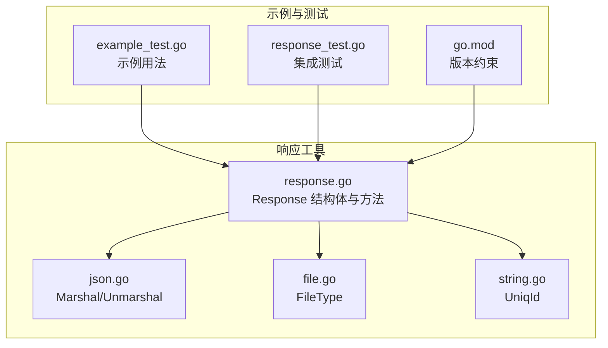
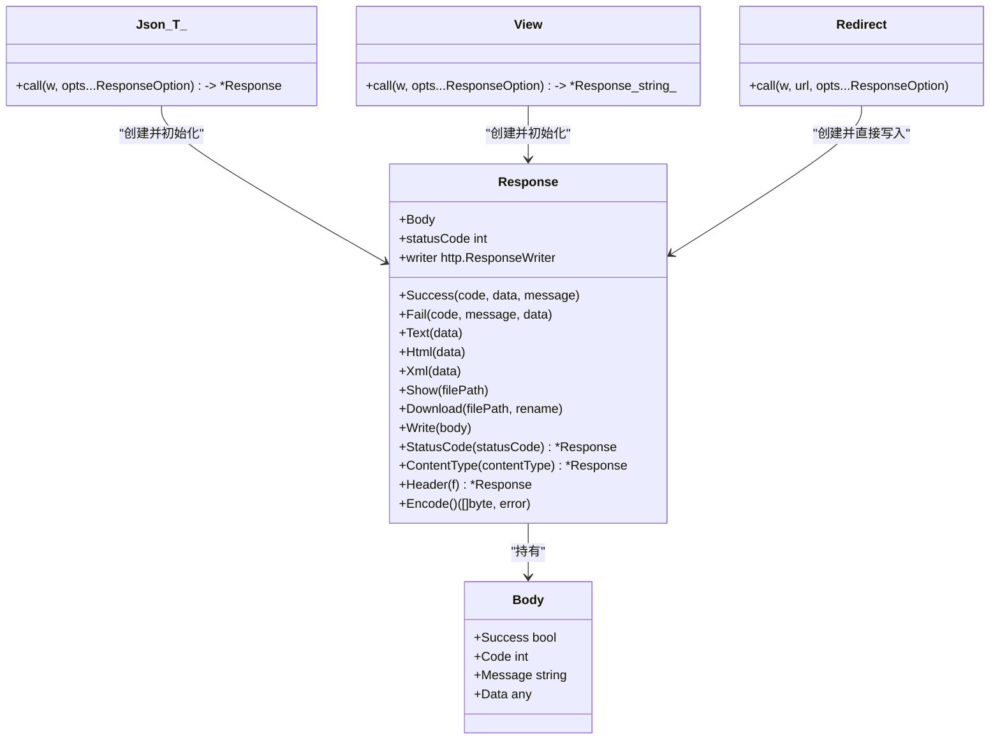
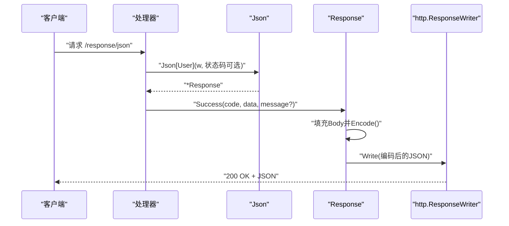
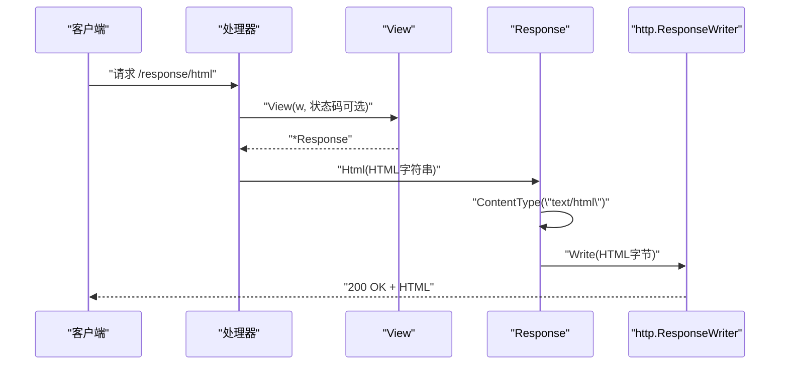
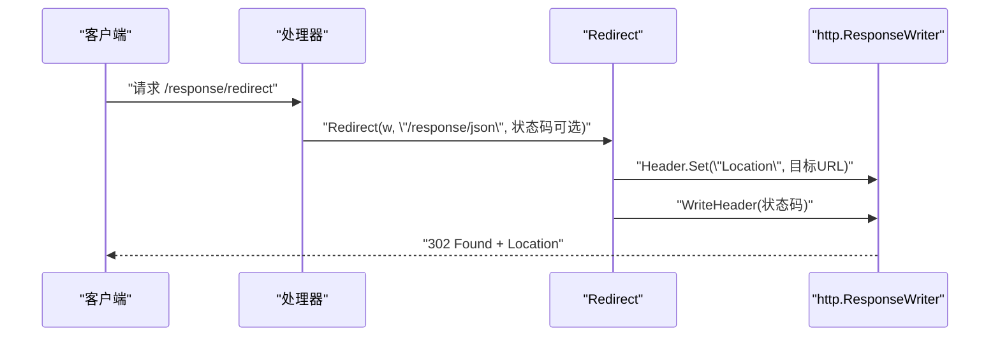
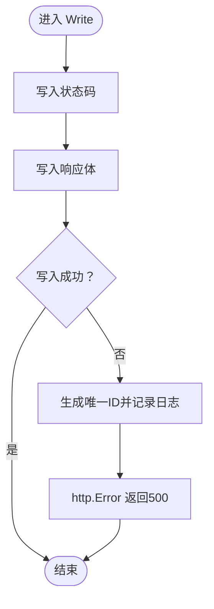
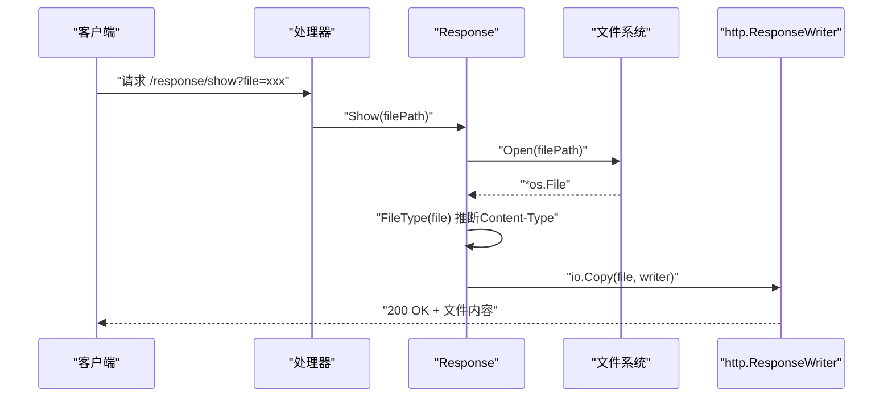
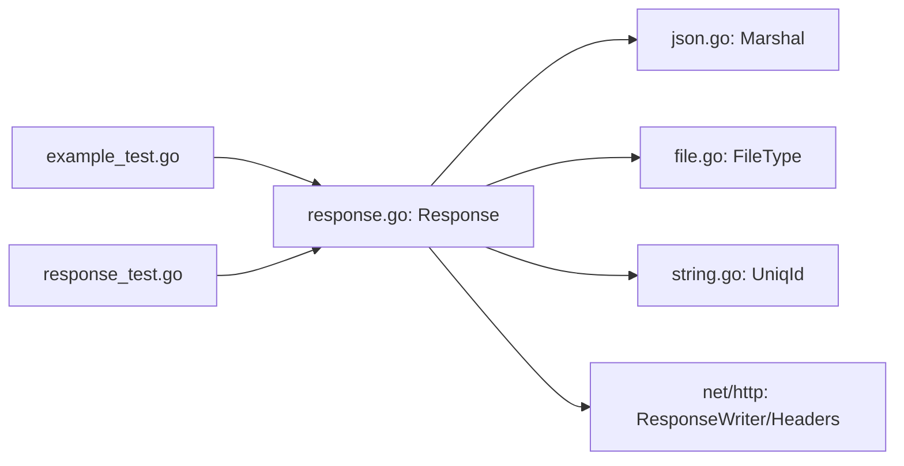

# 响应工具函数

<cite>
**本文档引用的文件**
- [response.go](file://response.go)
- [example_test.go](file://example_test.go)
- [response_test.go](file://response_test.go)
- [json.go](file://json.go)
- [file.go](file://file.go)
- [string.go](file://string.go)
- [README.md](file://README.md)
- [go.mod](file://go.mod)
</cite>

## 目录

1. [简介](#简介)
2. [项目结构](#项目结构)
3. [核心组件](#核心组件)
4. [架构总览](#架构总览)
5. [详细组件分析](#详细组件分析)
6. [依赖关系分析](#依赖关系分析)
7. [性能考量](#性能考量)
8. [故障排查指南](#故障排查指南)
9. [结论](#结论)
10. [附录](#附录)

## 简介

本文件系统性地介绍响应工具函数，重点覆盖以下能力：

- Json：统一的JSON响应入口，自动设置状态码与Content-Type，并支持Success/Fail两种业务响应形态
- View：文本视图响应，支持Text、Html、Xml、Show、Download等多形态输出
- Redirect：HTTP重定向，支持自定义状态码与目标URL
- StatusCode、ContentType、Header：辅助方法，用于灵活控制响应状态码与头部
- Write：底层响应输出与错误处理
- 与net/http的集成使用与调试技巧

## 项目结构

该项目采用“按功能域划分”的组织方式，响应相关的核心逻辑集中在response.go中，配合json.go、file.go、string.go等工具模块完成编码、文件类型检测与唯一ID生成等支撑能力。

**图表来源**

- [response.go](file://response.go#L1-L342)
- [json.go](file://json.go#L50-L67)
- [file.go](file://file.go#L434-L451)
- [string.go](file://string.go#L133-L183)
- [example_test.go](file://example_test.go#L1-L108)
- [response_test.go](file://response_test.go#L1-L82)
- [go.mod](file://go.mod#L1-L4)

**章节来源**

- [response.go](file://response.go#L1-L342)
- [go.mod](file://go.mod#L1-L4)

## 核心组件

-
Response：响应容器，封装Body结构、状态码、Writer，提供Success/Fail/Text/Html/Xml/Show/Download/Write/StatusCode/ContentType/Header/Encode等方法
- Body：统一JSON响应体结构，包含success、code、message、data字段
- Json：JSON响应入口，返回*Response，默认状态码200，Content-Type自动设置为application/json
- View：文本视图入口，返回*Response，默认状态码200
- Redirect：重定向入口，设置Location与状态码，默认302

**章节来源**

- [response.go](file://response.go#L11-L342)

## 架构总览

下图展示响应工具的整体架构与关键交互：

**图表来源**

- [response.go](file://response.go#L11-L342)

## 详细组件分析

### Json 函数

- 功能定位：JSON响应入口，返回*Response，便于链式调用Success/Fail
- 默认行为：
    - 状态码：若未显式设置，使用http.StatusOK
    - Content-Type：自动设置为application/json（带charset=utf-8）
- 典型流程：
    1) 创建Response实例，设置writer与statusCode
    2) 调用ContentType("application/json")完成头部设置
    3) 通过Success/Fail填充Body并编码为JSON
    4) 调用Write输出响应体

**图表来源**

- [response.go](file://response.go#L294-L308)
- [response.go](file://response.go#L29-L54)
- [json.go](file://json.go#L52-L58)

**章节来源**

- [response.go](file://response.go#L294-L308)
- [response.go](file://response.go#L29-L54)
- [json.go](file://json.go#L52-L58)

### View 函数

- 功能定位：文本视图响应入口，返回*Response，适合HTML/XML/纯文本/文件展示/下载等场景
- 默认行为：
    - 状态码：若未显式设置，使用http.StatusOK
    - Content-Type：由具体方法自动设置（Html为text/html，Text为text/plain，Xml会追加XML声明）
- 使用场景：
    - Html：渲染HTML页面片段
    - Xml：输出格式化XML
    - Text：输出纯文本
    - Show：直接输出文件内容（根据文件类型推断Content-Type）
    - Download：以附件形式下载文件（设置Content-Disposition）

**图表来源**

- [response.go](file://response.go#L310-L323)
- [response.go](file://response.go#L91-L95)

**章节来源**

- [response.go](file://response.go#L310-L323)
- [response.go](file://response.go#L91-L95)

### Redirect 函数

- 功能定位：HTTP重定向，设置Location与状态码
- 默认行为：
    - 状态码：http.StatusFound（302）
    - URL：由调用方传入
- 实现要点：直接设置Header("Location")并写入状态码，不输出响应体

**图表来源**

- [response.go](file://response.go#L325-L341)

**章节来源**

- [response.go](file://response.go#L325-L341)

### StatusCode、ContentType、Header 辅助方法

- StatusCode(statusCode)：设置响应状态码，返回*Response以支持链式调用
- ContentType(contentType)：设置Content-Type并附加charset=utf-8，返回*Response
- Header(f)：接收回调函数对http.Header进行自定义设置，返回*Response

使用建议：

- 在需要覆盖默认状态码或自定义头部时优先使用这些方法
- ContentType通常由Json/View的具体方法自动设置，如需覆盖可手动调用

**章节来源**

- [response.go](file://response.go#L271-L287)

### Write 方法

- 功能定位：底层响应输出与错误处理
- 行为细节：
    - 先写入状态码，再写入响应体
    - 若写入失败，生成唯一ID并记录日志，随后通过http.Error返回500错误
- 适用场景：所有响应输出均通过Write完成，确保错误处理一致性

**图表来源**

- [response.go](file://response.go#L253-L269)

**章节来源**

- [response.go](file://response.go#L253-L269)

### 文件类型与下载/展示

- FileType：基于扩展名与文件内容探测MIME类型，必要时重置文件指针
- Show：打开文件并直接复制到响应，自动设置Content-Type
- Download：打开文件并设置Content-Disposition为附件下载，自动设置Content-Type

**图表来源**

- [response.go](file://response.go#L201-L251)
- [file.go](file://file.go#L434-L451)

**章节来源**

- [response.go](file://response.go#L201-L251)
- [file.go](file://file.go#L434-L451)

## 依赖关系分析

- Response依赖：
    - json.go：Marshal用于Body编码
    - file.go：FileType用于文件类型推断
    - string.go：UniqId用于错误追踪与日志标识
    - net/http：http.ResponseWriter、状态码常量、Header操作
- 示例与测试：
    - example_test.go：演示Json、View、Redirect的典型用法
    - response_test.go：集成测试，启动HTTP服务验证各响应路径

**图表来源**

- [response.go](file://response.go#L1-L342)
- [json.go](file://json.go#L52-L58)
- [file.go](file://file.go#L434-L451)
- [string.go](file://string.go#L133-L183)
- [example_test.go](file://example_test.go#L1-L108)
- [response_test.go](file://response_test.go#L1-L82)

**章节来源**

- [response.go](file://response.go#L1-L342)
- [json.go](file://json.go#L52-L58)
- [file.go](file://file.go#L434-L451)
- [string.go](file://string.go#L133-L183)
- [example_test.go](file://example_test.go#L1-L108)
- [response_test.go](file://response_test.go#L1-L82)

## 性能考量

- 编码与写入：
    - JSON编码使用统一的Marshal，避免重复实现
    - Write先写状态码再写体，减少不必要的系统调用
- 文件传输：
    - Show/Download使用io.Copy，零拷贝友好，适合大文件
    - FileType在无法仅凭扩展名判断时，读取固定大小缓冲区并重置指针，兼顾准确性与性能
- 日志与错误：
    - 写入失败时生成唯一ID并记录日志，便于快速定位问题

[本节为通用性能建议，无需特定文件引用]

## 故障排查指南

- JSON编码失败：
    - 现象：返回500错误，消息包含追踪码
    - 处理：检查数据结构是否可JSON编码，查看日志中的追踪码
    - 参考：Success/Fail内部的Encode与错误分支
- XML编码失败：
    - 现象：返回500错误，消息包含追踪码
    - 处理：检查Xml输入数据的可序列化性
- 文件打开/读取失败：
    - 现象：返回500错误，消息包含追踪码
    - 处理：确认文件路径存在且可读，检查权限与磁盘空间
- 写入响应失败：
    - 现象：返回500错误，日志记录Write错误
    - 处理：检查网络连接、客户端提前关闭、缓冲区溢出等

**章节来源**

- [response.go](file://response.go#L40-L53)
- [response.go](file://response.go#L69-L82)
- [response.go](file://response.go#L98-L116)
- [response.go](file://response.go#L122-L198)
- [response.go](file://response.go#L253-L269)

## 结论

本套响应工具函数围绕Response构建，提供统一的JSON与文本视图响应能力，辅以重定向与文件处理，满足常见Web场景需求。通过链式调用与统一错误处理，既提升了开发效率，也增强了可观测性与可维护性。

[本节为总结性内容，无需特定文件引用]

## 附录

### 与net/http的集成使用指南

- 处理器签名：使用标准库的http.HandlerFunc，接收http.ResponseWriter与*http.Request
- 路由注册：使用http.HandleFunc或更高层路由器（如gin、chi），将上述处理器注册到对应路径
- 状态码选择：根据业务语义选择合适的状态码，必要时通过StatusCode覆盖默认值
- 头部设置：优先使用ContentType与Header方法，避免直接操作底层Header

**章节来源**

- [example_test.go](file://example_test.go#L17-L48)
- [example_test.go](file://example_test.go#L50-L107)
- [response_test.go](file://response_test.go#L51-L81)

### 调试技巧

- 使用response_test.go中的本地HTTP服务器进行端到端验证
- 通过唯一ID追踪日志，快速定位编码、文件、写入等环节的问题
- 在开发环境使用较低状态码（如200）便于浏览器调试，生产环境按规范设置

**章节来源**

- [response_test.go](file://response_test.go#L16-L49)
- [string.go](file://string.go#L133-L183)

### 组合使用示例与最佳实践

- JSON成功响应：Json(w).Success(code, data)
- JSON失败响应：Json(w, 自定义状态码).Fail(code, msg, optionalData)
- 文本视图：View(w).Html/XML/Text/Show/Download
- 重定向：Redirect(w, url, 自定义状态码)
- 自定义头部：View(w).Header(func(h) { h.Set("X-Custom", "value") })

**章节来源**

- [README.md](file://README.md#L3489-L3577)
- [example_test.go](file://example_test.go#L17-L107)