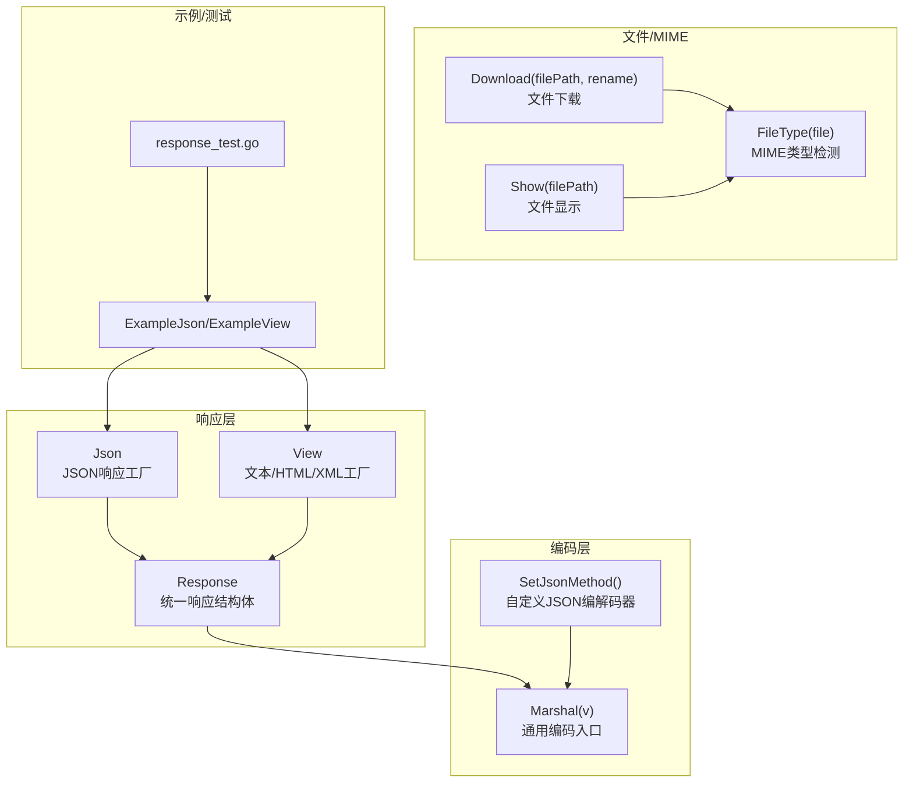
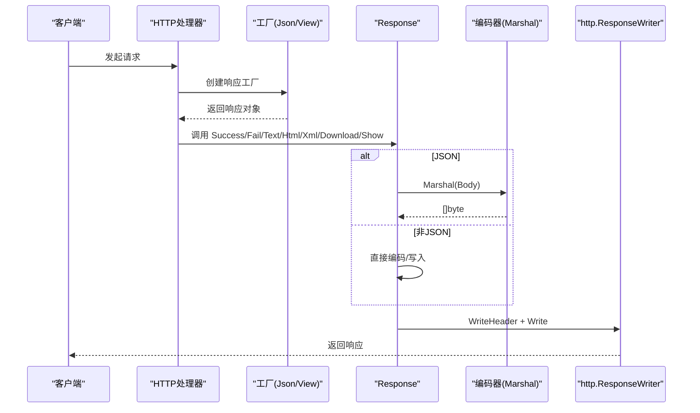
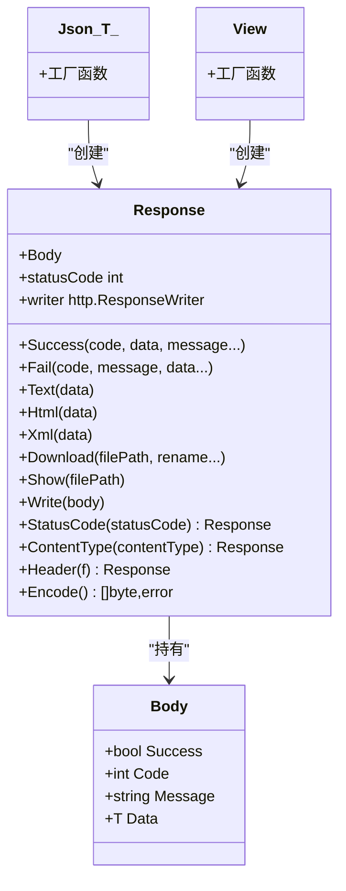
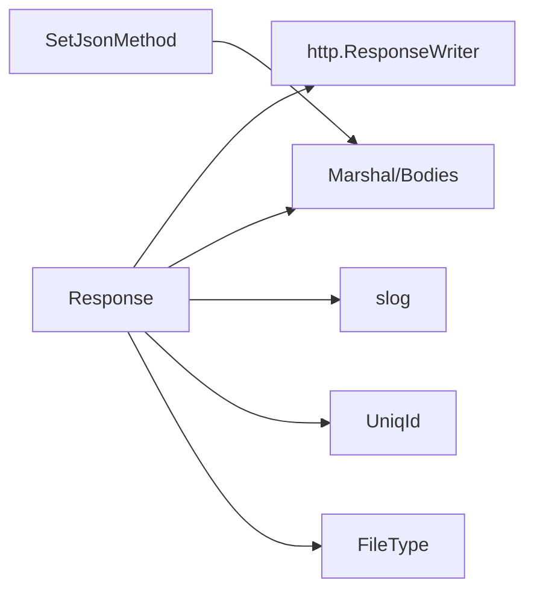

# 多格式响应支持

<cite>
**本文引用的文件列表**
- [response.go](file://response.go)
- [json.go](file://json.go)
- [html.go](file://html.go)
- [file.go](file://file.go)
- [errors.go](file://errors/errors.go)
- [example_test.go](file://example_test.go)
- [response_test.go](file://response_test.go)
- [README.md](file://README.md)
</cite>

## 目录

1. [简介](#简介)
2. [项目结构](#项目结构)
3. [核心组件](#核心组件)
4. [架构总览](#架构总览)
5. [详细组件分析](#详细组件分析)
6. [依赖关系分析](#依赖关系分析)
7. [性能考量](#性能考量)
8. [故障排查指南](#故障排查指南)
9. [结论](#结论)
10. [附录](#附录)

## 简介

本文件系统性地介绍多格式响应支持功能，覆盖以下方面：

- JSON 响应的实现机制与使用方式，包括 Success 和 Fail 方法的参数与行为
- XML 响应的编码流程与格式化选项
- HTML 与纯文本响应的适用场景与调用方式
- 响应头设置机制，包括 Content-Type 的自动检测与手动配置
- Marshal 函数在数据编码中的作用以及自定义编解码器的支持
- 各种响应格式的完整使用示例与最佳实践
- 错误处理策略与调试技巧

## 项目结构

该功能主要由以下模块组成：

- 响应核心：统一的 Response 泛型结构体与一组便捷方法
- JSON 编解码：可插拔的 JSON 编解码器注册与默认实现
- 文件与 MIME 类型：文件类型检测与下载/显示响应
- 示例与测试：演示不同响应格式的使用方式
- 错误与日志：统一的错误包装与日志追踪

图表来源

- [response.go](file://response.go#L11-L342)
- [json.go](file://json.go#L1-L67)
- [file.go](file://file.go#L434-L450)
- [example_test.go](file://example_test.go#L24-L107)
- [response_test.go](file://response_test.go#L51-L81)

章节来源

- [response.go](file://response.go#L11-L342)
- [json.go](file://json.go#L1-L67)
- [file.go](file://file.go#L434-L450)
- [example_test.go](file://example_test.go#L24-L107)
- [response_test.go](file://response_test.go#L51-L81)

## 核心组件

- Response：响应容器，封装 Body、状态码与 http.ResponseWriter，并提供
  Success/Fail/Text/Html/Xml/Download/Show/Write/StatusCode/ContentType/Heder/Encode/Json/View/Redirect 等方法
- Body：统一响应体结构，包含 success、code、message、data 字段
- Json：JSON 响应工厂，负责设置 Content-Type 为 application/json，并可设置初始状态码
- View：文本/HTML/XML 工厂，不强制 JSON 结构，适合纯文本、HTML、XML 等
- Marshal：统一编码入口，内部委托 JSON 编码器（可替换）

章节来源

- [response.go](file://response.go#L11-L342)
- [json.go](file://json.go#L52-L66)

## 架构总览

响应系统以 Response 为核心，通过 Json 或 View 工厂创建响应对象，随后根据业务选择
Success/Fail（JSON）、Text/Html/Xml（纯文本/HTML/XML），或 Download/Show（文件）。编码阶段统一走 Marshal，底层可注入自定义 JSON
编解码器；文件类响应通过 FileType 进行 MIME 自动检测。

图表来源

- [response.go](file://response.go#L29-L83)
- [response.go](file://response.go#L85-L116)
- [response.go](file://response.go#L254-L269)
- [json.go](file://json.go#L52-L66)

## 详细组件分析

### JSON 响应：Success 与 Fail

- Success(code, data, message...)：设置成功标志、状态码、消息与数据，调用 Encode 后写入响应
- Fail(code, message, data...)：设置失败标志、状态码、消息与可选数据，调用 Encode 后写入响应
- Encode：委托 Marshal 对 Body 进行编码
- 错误处理：编码失败时生成唯一 ID，记录日志并返回 500 错误

适用场景

- API 接口统一返回结构化 JSON
- 需要 success/code/message/data 四要素的标准响应

参数说明

- code：业务状态码
- data：任意数据，作为 data 字段
- message：可变参数，未提供时默认“SUCCESS”

最佳实践

- 统一使用 Json 初始化，便于设置初始状态码
- 失败场景优先使用 Fail，成功场景使用 Success
- 对复杂数据结构确保可 JSON 序列化

章节来源

- [response.go](file://response.go#L24-L83)
- [response.go](file://response.go#L289-L292)
- [json.go](file://json.go#L52-L66)

### XML 响应：编码与格式化

- Xml(data any)：使用 xml.MarshalIndent 对任意数据进行缩进格式化编码
- Content-Type：显式设置为 application/xml
- 写入顺序：先写入 xml.Header，再写入格式化后的 XML 数据
- 错误处理：编码失败时生成唯一 ID，记录日志并返回 500 错误

适用场景

- 需要兼容 XML 客户端的接口
- 配置文件、清单等场景

格式化选项

- 缩进：使用空字符串作为前缀，空格作为缩进，便于阅读

章节来源

- [response.go](file://response.go#L97-L116)

### HTML 响应与纯文本响应

- Html(data string)：设置 Content-Type 为 text/html，直接写入 HTML 文本
- Text(data string)：设置 Content-Type 为 text/plain，直接写入纯文本
- 适用场景：模板渲染结果、调试页面、简单文本输出

章节来源

- [response.go](file://response.go#L85-L95)

### 响应头设置与 Content-Type 自动检测

- StatusCode(statusCode)：设置响应状态码
- ContentType(contentType)：设置 Content-Type，并附加 charset=utf-8
- Header(f)：允许自定义设置其他响应头
- 文件类响应的 Content-Type 自动检测：
    - Show(filePath)：若未设置 Content-Type，则通过 FileType(file) 检测 MIME 类型
    - Download(filePath, rename)：若未设置 Content-Type，则通过 FileType(file) 检测 MIME 类型，并设置 Content-Disposition
      为附件下载

章节来源

- [response.go](file://response.go#L271-L287)
- [file.go](file://file.go#L434-L450)

### Marshal 函数与自定义编解码器

- Marshal(v any)：统一编码入口，若未设置自定义编码器则使用标准库 encoding/json
- SetJsonMethod(opts...)：一次性设置自定义 JSON 编码/解码器（通过 WithJSONEncoder/WithJSONDecoder）
- 优势：可在应用启动阶段替换 JSON 实现，满足性能或兼容性需求

章节来源

- [json.go](file://json.go#L38-L50)
- [json.go](file://json.go#L52-L66)
- [response.go](file://response.go#L289-L292)

### 文件下载与显示

- Show(filePath)：直接流式复制文件内容到响应，自动检测 Content-Type
- Download(filePath, rename)：设置 Content-Disposition 为附件下载，自动检测 Content-Type
- 错误处理：文件打开失败、统计信息失败、MIME 检测失败、IO 复制失败均生成唯一 ID 并返回 500

章节来源

- [response.go](file://response.go#L201-L251)
- [response.go](file://response.go#L118-L199)
- [file.go](file://file.go#L434-L450)

### 重定向

- Redirect(w, url, opts...ResponseOption)：设置 Location 头并写入状态码，实现 HTTP 重定向

章节来源

- [response.go](file://response.go#L325-L341)

### 类关系图（代码级）

图表来源

- [response.go](file://response.go#L11-L342)

## 依赖关系分析

- Response 依赖：
    - http.ResponseWriter：写入响应
    - Marshal：统一编码入口
    - 日志：slog 记录错误与追踪
    - 唯一 ID：UniqId 生成错误追踪码
    - 文件类型：FileType 用于自动检测 MIME
- JSON 编解码：
    - SetJsonMethod 注册自定义编解码器，仅在首次调用生效
    - Marshal/Unmarshal 委托至内部函数，避免重复设置

图表来源

- [response.go](file://response.go#L29-L83)
- [response.go](file://response.go#L97-L116)
- [response.go](file://response.go#L254-L269)
- [json.go](file://json.go#L38-L50)

章节来源

- [response.go](file://response.go#L29-L83)
- [response.go](file://response.go#L97-L116)
- [response.go](file://response.go#L254-L269)
- [json.go](file://json.go#L38-L50)

## 性能考量

- JSON 编解码器替换：通过 SetJsonMethod 在应用启动阶段设置，避免运行期切换带来的额外开销
- 编码路径：Success/Fail 统一走 Encode -> Marshal，减少分支判断
- 文件传输：Download/Show 使用 io.Copy 流式传输，降低内存占用
- Content-Type 自动检测：FileType 仅在未手动设置时触发，避免重复检测

[本节为通用建议，无需特定文件来源]

## 故障排查指南

常见问题与定位思路

- JSON 编码失败：检查数据结构是否可序列化，必要时提供自定义编解码器
- XML 编码失败：确认传入数据可被 xml.MarshalIndent 序列化
- 文件下载/显示失败：检查文件路径是否存在、权限是否足够、MIME 检测是否成功
- 响应写入失败：关注 WriteHeader/Write 的错误日志，结合唯一 ID 快速定位

调试技巧

- 使用日志追踪：错误发生时会记录 trace 与唯一 ID，便于回溯
- 自定义 JSON 编解码器：在开发环境可替换为更详细的错误信息输出
- 响应头检查：通过 Header 自定义头，验证 Content-Type 与状态码

章节来源

- [response.go](file://response.go#L40-L53)
- [response.go](file://response.go#L99-L111)
- [response.go](file://response.go#L254-L269)
- [errors.go](file://errors/errors.go#L14-L82)

## 结论

该多格式响应支持以 Response 为核心，提供了统一、可扩展且易用的响应能力：

- JSON：标准化四要素响应，内置错误处理与日志追踪
- XML/HTML/Text：简洁直接，适用于非结构化或兼容性场景
- 文件下载/显示：自动 MIME 检测与流式传输，兼顾性能与可用性
- 编解码器可插拔：满足不同场景下的性能与兼容性需求

[本节为总结，无需特定文件来源]

## 附录

### 使用示例与最佳实践

- JSON 示例：参考示例函数与测试用例，展示 Success/Fail 的使用
- HTML/XML/Text 示例：参考示例函数与测试用例，展示纯文本与结构化文本的响应
- 文件下载/显示：参考示例函数与测试用例，展示自动 MIME 检测与下载行为

章节来源

- [example_test.go](file://example_test.go#L24-L107)
- [response_test.go](file://response_test.go#L51-L81)
- [README.md](file://README.md#L3489-L3643)

### API 一览（方法与用途）

- Response
    - Success(code, data, message...)
    - Fail(code, message, data...)
    - Text(data)
    - Html(data)
    - Xml(data)
    - Download(filePath, rename...)
    - Show(filePath)
    - Write(body)
    - StatusCode(statusCode)
    - ContentType(contentType)
    - Header(f)
    - Encode()
- 工厂
    - Json(w, opts...ResponseOption)
- ResponseOption: WithStatusCode(code), WithContentType(ct), WithHeader(key, value)
    - View(w, opts...ResponseOption)
    - Redirect(w, url, opts...ResponseOption)

章节来源

- [response.go](file://response.go#L24-L341)