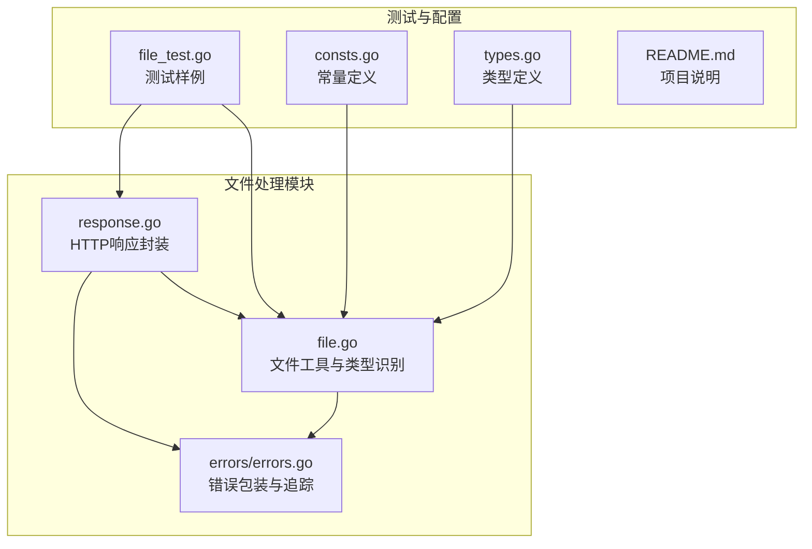
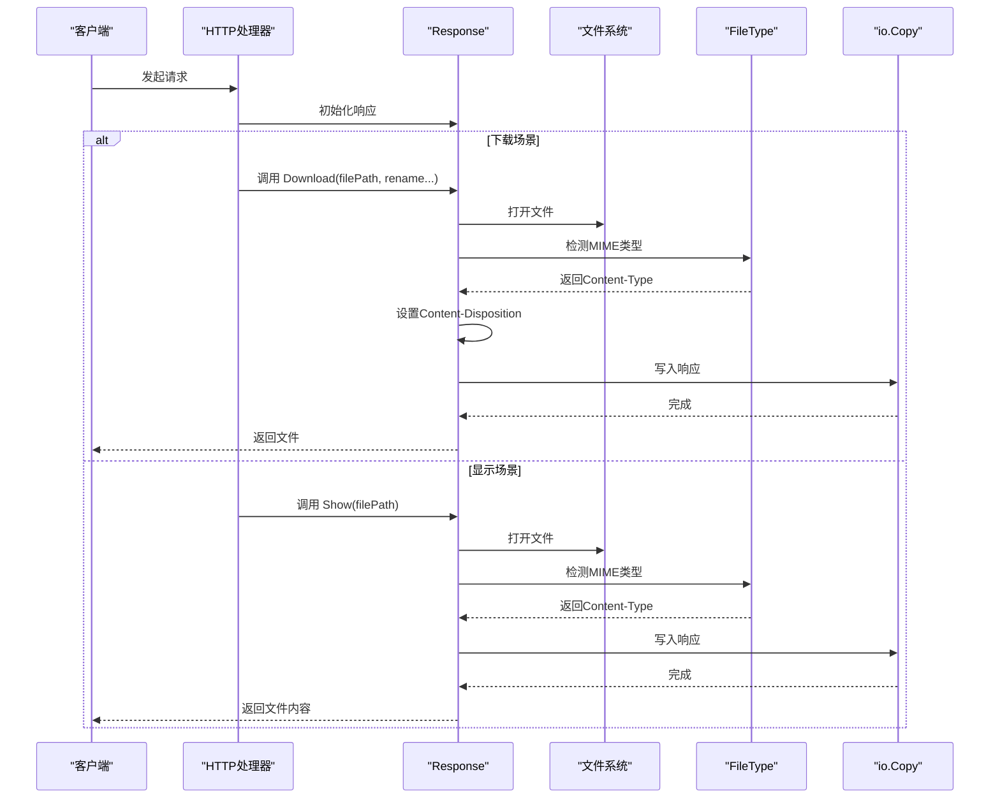
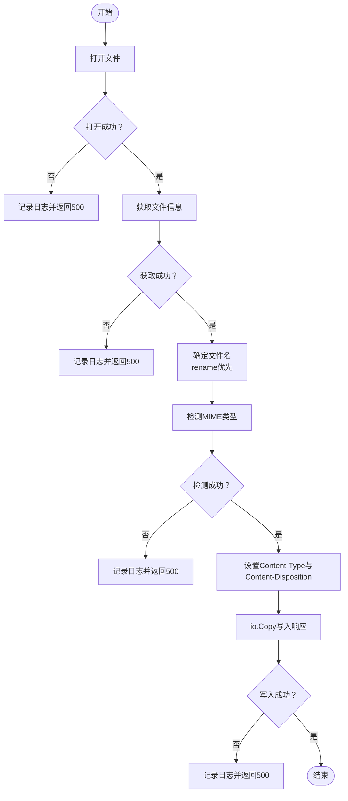
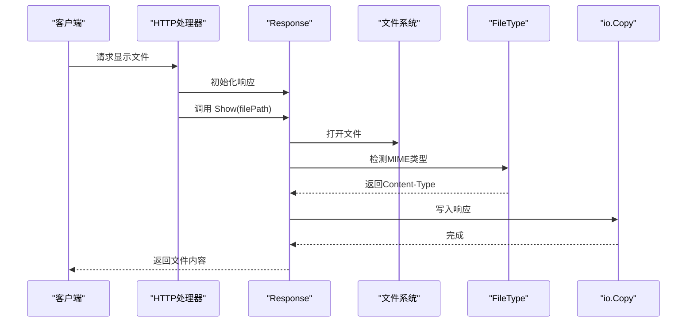
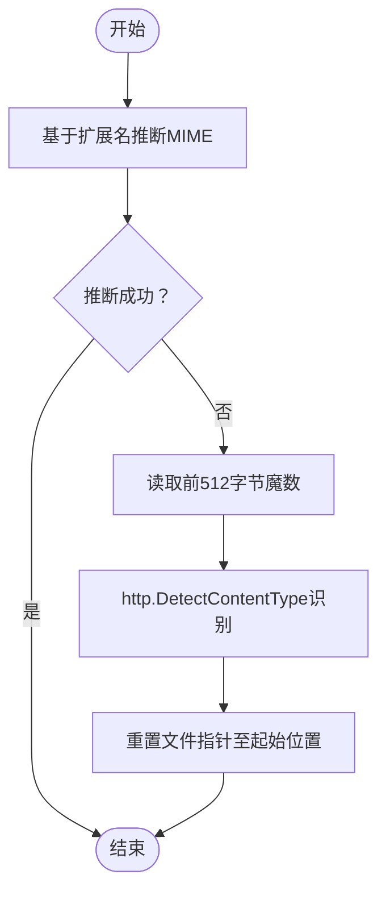
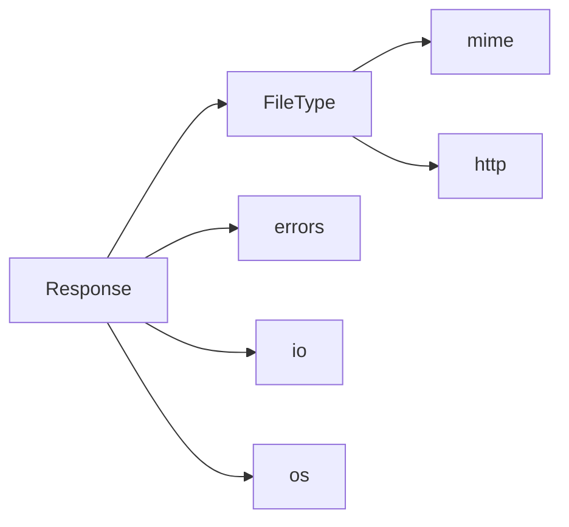

# 文件处理功能

<cite>
**本文档引用的文件**
- [file.go](file://file.go)
- [response.go](file://response.go)
- [errors.go](file://errors/errors.go)
- [file_test.go](file://file_test.go)
- [consts.go](file://consts.go)
- [types.go](file://types.go)
- [README.md](file://README.md)
</cite>

## 目录

1. [简介](#简介)
2. [项目结构](#项目结构)
3. [核心组件](#核心组件)
4. [架构总览](#架构总览)
5. [详细组件分析](#详细组件分析)
6. [依赖关系分析](#依赖关系分析)
7. [性能考量](#性能考量)
8. [故障排查指南](#故障排查指南)
9. [结论](#结论)
10. [附录](#附录)

## 简介

本文件处理功能围绕HTTP响应中的文件下载与显示两大场景展开，重点覆盖以下方面：

- Download方法的文件下载实现：文件路径解析、MIME类型检测、Content-Disposition头部设置、文件重命名功能
- Show方法的文件显示机制：文件读取、类型检测和直接输出
- 错误处理策略：文件打开失败、类型检测错误、IO操作异常的处理
- FileType函数在MIME类型识别中的应用
- 安全考虑与性能优化建议
- 完整使用示例与常见问题解决方案

## 项目结构

该仓库采用按职责分层的组织方式，文件处理能力位于utils包内，并通过统一的Response封装对外提供HTTP响应能力。关键文件如下：

- file.go：文件工具函数与文件类型识别
- response.go：HTTP响应封装，包含Download与Show方法
- errors/errors.go：统一错误包装与追踪
- file_test.go：文件处理相关测试样例
- consts.go与types.go：常量与类型定义
- README.md：项目说明与使用指南

图表来源

- [file.go](file://file.go#L1-L451)
- [response.go](file://response.go#L1-L342)
- [errors.go](file://errors/errors.go#L1-L282)
- [file_test.go](file://file_test.go#L1-L680)
- [consts.go](file://consts.go#L1-L23)
- [types.go](file://types.go#L1-L98)
- [README.md](file://README.md#L1-L800)

章节来源

- [file.go](file://file.go#L1-L451)
- [response.go](file://response.go#L1-L342)
- [errors.go](file://errors/errors.go#L1-L282)
- [file_test.go](file://file_test.go#L1-L680)
- [consts.go](file://consts.go#L1-L23)
- [types.go](file://types.go#L1-L98)
- [README.md](file://README.md#L1-L800)

## 核心组件

- Response：HTTP响应封装，提供Success/Fail/Text/Html/Xml/Download/Show等方法，统一设置Content-Type、状态码与响应体
- Download(filePath, rename...)：下载文件，自动设置Content-Type与Content-Disposition，支持文件重命名
- Show(filePath)：显示文件内容，自动设置Content-Type并直接输出
- FileType(file)：基于扩展名与魔数检测MIME类型，必要时重置文件指针
- 错误处理：统一使用errors包进行包装与追踪，结合日志记录与HTTP错误响应

章节来源

- [response.go](file://response.go#L11-L342)
- [file.go](file://file.go#L434-L450)
- [errors.go](file://errors/errors.go#L14-L82)

## 架构总览

文件处理流程由HTTP请求触发，Response封装根据目标场景选择Download或Show，二者均依赖FileType进行MIME类型识别，并通过io.Copy将文件内容写入http.ResponseWriter。

图表来源

- [response.go](file://response.go#L118-L251)
- [file.go](file://file.go#L434-L450)

## 详细组件分析

### Download方法：文件下载实现

- 文件路径解析
    - 通过os.Open打开目标文件，若失败则记录唯一ID并返回HTTP 500错误
    - 若未提供rename参数，则从文件句柄Stat获取原始文件名；若提供rename参数，则使用传入的新文件名
- MIME类型检测
    - 若响应头未设置Content-Type，则调用FileType(file)进行检测
    - FileType优先使用扩展名推断，若为空则读取文件前512字节魔数并通过http.DetectContentType识别
    - 检测完成后将文件指针重置至起始位置，确保后续IO正常
- Content-Disposition头部设置
    - 通过Header回调设置Content-Disposition为attachment并附带文件名
- 文件重命名功能
    - rename可选参数控制下载时的文件名，便于跨平台或业务场景下的命名规范
- IO输出与错误处理
    - 使用io.Copy将文件内容写入http.ResponseWriter
    - 任何阶段发生错误均记录唯一ID并返回HTTP 500错误

图表来源

- [response.go](file://response.go#L118-L199)
- [file.go](file://file.go#L434-L450)

章节来源

- [response.go](file://response.go#L118-L199)
- [file.go](file://file.go#L434-L450)

### Show方法：文件显示机制

- 文件读取
    - 通过os.Open打开目标文件，失败则记录唯一ID并返回HTTP 500错误
- 类型检测
    - 若响应头未设置Content-Type，则调用FileType(file)进行检测
- 直接输出
    - 使用io.Copy将文件内容直接写入http.ResponseWriter
- 错误处理
    - 任何阶段发生错误均记录唯一ID并返回HTTP 500错误

图表来源

- [response.go](file://response.go#L201-L251)
- [file.go](file://file.go#L434-L450)

章节来源

- [response.go](file://response.go#L201-L251)
- [file.go](file://file.go#L434-L450)

### FileType函数：MIME类型识别

- 优先策略
    - 使用mime.TypeByExtension(filepath.Ext(f.Name()))基于扩展名推断
    - 若扩展名无法识别，则读取文件前512字节作为魔数，调用http.DetectContentType识别
- 指针复位
    - 识别完成后通过Seek(0, io.SeekStart)将文件指针重置至起始位置，保证后续IO操作不受影响
- 错误处理
    - Seek失败时通过errors.Wrap(err)进行包装并返回

图表来源

- [file.go](file://file.go#L434-L450)

章节来源

- [file.go](file://file.go#L434-L450)

### 错误处理策略

- 统一包装与追踪
    - 所有错误通过errors包进行包装，支持链式追踪与日志记录
- HTTP错误响应
    - 在Download与Show各阶段发生错误时，记录唯一ID并返回HTTP 500错误
- 日志记录
    - 使用slog记录错误详情与上下文，便于定位问题

章节来源

- [response.go](file://response.go#L124-L136)
- [response.go](file://response.go#L143-L155)
- [response.go](file://response.go#L162-L177)
- [response.go](file://response.go#L186-L198)
- [response.go](file://response.go#L204-L216)
- [response.go](file://response.go#L220-L235)
- [response.go](file://response.go#L237-L250)
- [errors.go](file://errors/errors.go#L14-L82)

## 依赖关系分析

- Response依赖FileType进行MIME类型识别
- FileType依赖mime与http标准库进行扩展名与魔数检测
- 错误处理统一通过errors包包装，贯穿Download与Show流程
- 常量与类型定义为文件处理提供基础支撑

图表来源

- [response.go](file://response.go#L118-L251)
- [file.go](file://file.go#L434-L450)
- [errors.go](file://errors/errors.go#L1-L282)

章节来源

- [response.go](file://response.go#L118-L251)
- [file.go](file://file.go#L434-L450)
- [errors.go](file://errors/errors.go#L1-L282)

## 性能考量

- MIME类型检测
    - FileType仅读取前512字节魔数，避免全文件扫描带来的额外开销
- IO复制
    - 使用io.Copy进行高效文件到响应流的复制
- 并发安全
    - 写文件相关能力提供互斥保护，避免并发写入冲突
- 缓冲策略
    - 提供多种读取方式（Scan/Line/Read）以适配不同文件特征，减少内存占用

章节来源

- [file.go](file://file.go#L434-L450)
- [response.go](file://response.go#L186-L198)
- [response.go](file://response.go#L237-L250)
- [file.go](file://file.go#L227-L309)

## 故障排查指南

- 文件打开失败
    - 症状：Download/Show返回HTTP 500
    - 排查：检查文件路径是否存在、权限是否足够、磁盘空间是否充足
    - 参考：错误日志中包含唯一ID，可用于定位具体调用栈
- MIME类型检测错误
    - 症状：Content-Type未设置或识别异常
    - 排查：确认文件扩展名是否合理；若无扩展名，确保文件魔数可识别
- IO操作异常
    - 症状：响应中断或数据不完整
    - 排查：检查网络连接、服务器资源限制、响应写入是否被提前关闭
- 测试验证
    - 可参考file_test.go中的相关测试用例，验证不同场景下的行为

章节来源

- [response.go](file://response.go#L124-L136)
- [response.go](file://response.go#L143-L155)
- [response.go](file://response.go#L162-L177)
- [response.go](file://response.go#L186-L198)
- [response.go](file://response.go#L204-L216)
- [response.go](file://response.go#L220-L235)
- [response.go](file://response.go#L237-L250)
- [file_test.go](file://file_test.go#L1-L680)

## 结论

文件处理功能通过Response封装提供了简洁一致的下载与显示能力，配合FileType的智能MIME识别与统一错误处理机制，能够稳定地满足大多数文件传输场景。在实际部署中，建议关注文件路径与权限、MIME类型识别的边界情况以及IO性能与并发安全。

## 附录

### 使用示例（路径指引）

- 下载文件（含重命名）
    - 参考路径：[response.go](file://response.go#L118-L199)
- 显示文件内容
    - 参考路径：[response.go](file://response.go#L201-L251)
- MIME类型识别
    - 参考路径：[file.go](file://file.go#L434-L450)
- 错误包装与追踪
    - 参考路径：[errors.go](file://errors/errors.go#L14-L82)

章节来源

- [response.go](file://response.go#L118-L251)
- [file.go](file://file.go#L434-L450)
- [errors.go](file://errors/errors.go#L14-L82)