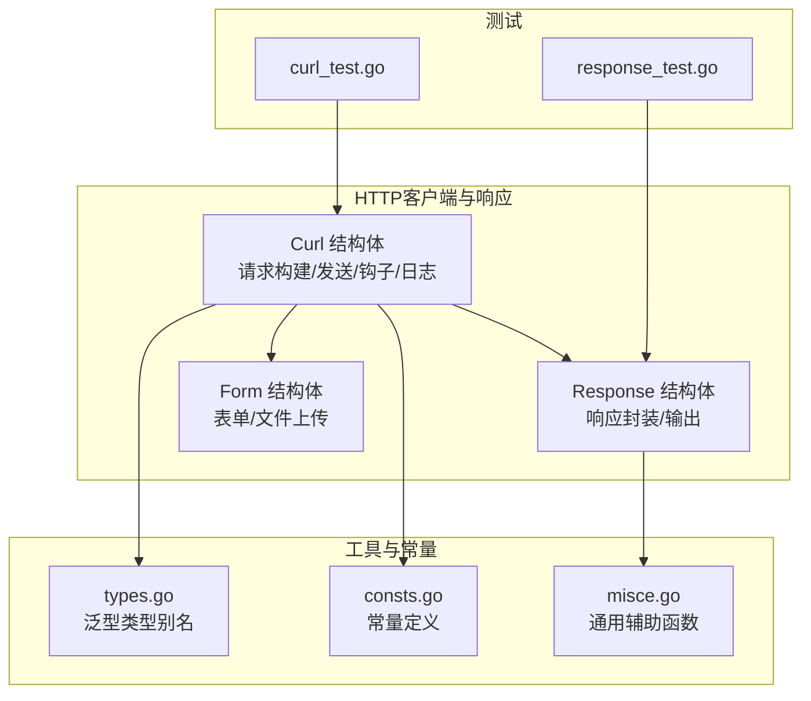
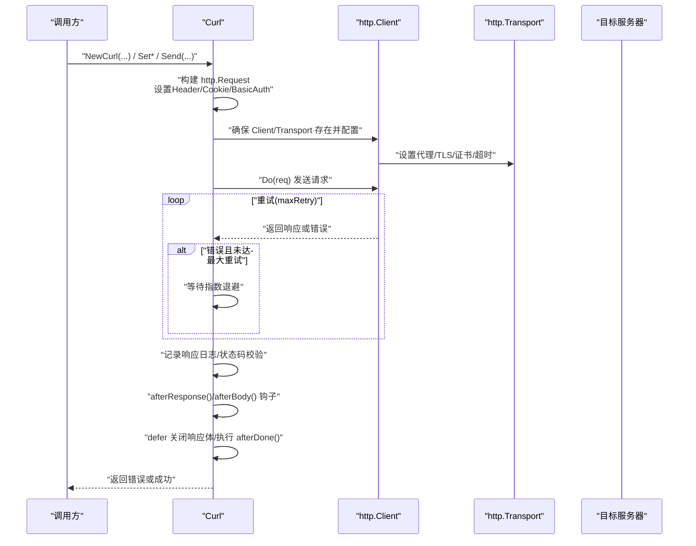
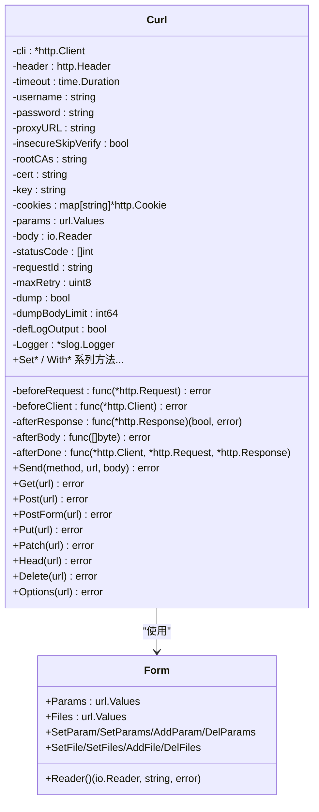
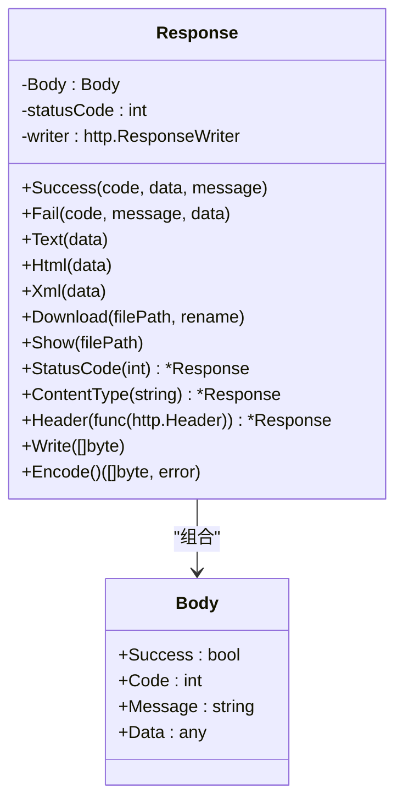
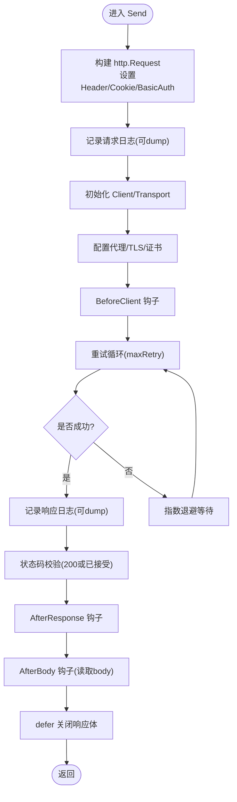
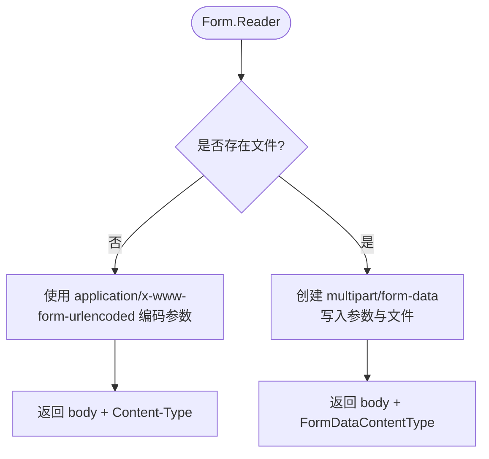
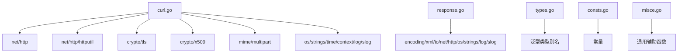

# Http Client

<cite>
**本文引用的文件列表**
- [README.md](file://README.md)
- [curl.go](file://curl.go)
- [response.go](file://response.go)
- [curl_test.go](file://curl_test.go)
- [response_test.go](file://response_test.go)
- [types.go](file://types.go)
- [consts.go](file://consts.go)
- [misce.go](file://misce.go)
</cite>

## 目录

1. [简介](#简介)
2. [项目结构](#项目结构)
3. [核心组件](#核心组件)
4. [架构总览](#架构总览)
5. [详细组件分析](#详细组件分析)
6. [依赖关系分析](#依赖关系分析)
7. [性能考量](#性能考量)
8. [故障排查指南](#故障排查指南)
9. [结论](#结论)
10. [附录](#附录)

## 简介

本项目提供一套简洁易用的 HTTP 客户端与响应封装工具，核心围绕 Curl 结构体与 Response 结构体展开：

- Curl：面向 HTTP 请求的高级封装，支持请求头、参数、Cookie、Basic 认证、代理、TLS 证书、重试机制、请求/响应钩子、日志记录等。
- Response：面向 HTTP 响应的便捷封装，支持 JSON、HTML、XML、文本、文件下载/展示、重定向等。

文档将从系统架构、组件关系、数据流、处理逻辑、集成点、错误处理与性能特性等方面进行深入剖析，并辅以可视化图表与排障建议，帮助读者快速理解与高效使用。

## 项目结构

仓库采用按功能域划分的组织方式，HTTP 客户端与响应相关的核心文件如下：

- curl.go：HTTP 客户端实现，包含 Curl 结构体、请求发送流程、TLS/代理配置、重试与钩子等。
- response.go：HTTP 响应封装，包含响应体结构、多种响应类型输出方法与工具函数。
- curl_test.go / response_test.go：配套测试，演示典型用法与行为验证。
- 其他通用工具：types.go（泛型类型别名）、consts.go（常量定义）、misce.go（通用辅助函数）等。

**图表来源**

- [curl.go](file://curl.go#L22-L88)
- [response.go](file://response.go#L12-L16)
- [types.go](file://types.go#L5-L33)
- [consts.go](file://consts.go#L14-L22)
- [misce.go](file://misce.go#L9-L19)
- [curl_test.go](file://curl_test.go#L39-L221)
- [response_test.go](file://response_test.go#L51-L82)

**章节来源**

- [README.md](file://README.md#L1-L520)
- [curl.go](file://curl.go#L1-L1301)
- [response.go](file://response.go#L1-L373)
- [curl_test.go](file://curl_test.go#L1-L732)
- [response_test.go](file://response_test.go#L1-L82)

## 核心组件

- Curl 结构体：封装 HTTP 客户端、请求头、参数、Cookie、认证、代理、TLS、超时、重试、钩子回调、日志等。
- Response 结构体：封装响应体数据结构与多种响应输出方法，支持 JSON、HTML、XML、文本、文件下载/展示、重定向。
- Form 结构体：封装表单参数与文件上传，生成 multipart/form-data 或 application/x-www-form-urlencoded 的请求体与
  Content-Type。
- 通用工具：包括三元运算、数字格式化、重试辅助等。

**章节来源**

- [curl.go](file://curl.go#L22-L88)
- [response.go](file://response.go#L12-L53)
- [curl.go](file://curl.go#L1067-L1209)
- [misce.go](file://misce.go#L9-L117)

## 架构总览

下图展示了 Curl 发送一次 HTTP 请求的完整流程，包括请求构建、客户端初始化、TLS/代理配置、重试策略、日志记录、状态码校验、响应钩子与资源清理。

**图表来源**

- [curl.go](file://curl.go#L599-L934)

**章节来源**

- [curl.go](file://curl.go#L599-L934)

## 详细组件分析

### Curl 组件

Curl 是 HTTP 客户端的核心抽象，支持丰富的配置与扩展点：

- 关键字段
    -
    http.Client、http.Header、timeout、username/password、proxyURL、insecureSkipVerify、rootCAs/cert/key、cookies、params、body、statusCode、钩子回调、requestId、maxRetry、dump/dumpBodyLimit、defLogOutput、Logger。
- 配置选项
    -
    WithCurlTimeout、WithCurlLogger、WithCurlDefLogOutput、WithCurlRequestId、WithCurlContentType、WithCurlHeader/Headers、WithCurlParams、WithCurlBody/Bytes、WithCurlCookies、WithCurlBasicAuth、WithCurlProxyURL、WithCurlInsecureSkipVerify、WithCurlRootCAs、WithCurlCertKey、WithCurlStatusCode、WithCurlMaxRetry、WithCurlDump、WithCurlDumpBodyLimit。
- 请求方法
    - Send(method, url, body)：统一入口，负责请求构建、客户端初始化、TLS/代理配置、重试、日志、状态码校验、钩子与资源清理。
    - Get/Post/PostForm/Put/Patch/Head/Delete/Options：便捷方法，自动拼接 params 与 body。
- 钩子与回调
    - BeforeRequest、BeforeClient、AfterResponse、AfterBody、AfterDone：在请求生命周期不同阶段注入自定义逻辑。
- TLS/代理/证书
    - RootCAs、Certificate、ProxyURL：分别用于设置根证书、客户端证书与私钥、HTTP 代理。
- 工具函数
    - DrainBody：安全读取并恢复响应体流。
    - dumpRequestSafe/dumpResponseSafe/readBodyPreview/readBodyPreviewAndRestore/formatDumpWithBody：用于日志安全预览与格式化。

**图表来源**

- [curl.go](file://curl.go#L22-L88)
- [curl.go](file://curl.go#L1067-L1209)

**章节来源**

- [curl.go](file://curl.go#L22-L88)
- [curl.go](file://curl.go#L936-L1023)
- [curl.go](file://curl.go#L1025-L1065)
- [curl.go](file://curl.go#L1067-L1209)
- [curl.go](file://curl.go#L1211-L1301)

### Response 组件

Response 提供统一的响应封装与多种输出方式：

- 结构体
    - Body：包含 success/code/message/data 四要素。
    - Response：组合 Body，持有 http.ResponseWriter、状态码。
- 方法
    - Success/Fail：输出 JSON 响应。
    - Text/Html/Xml：输出文本、HTML、XML。
    - Download/Show：文件下载与展示。
    - StatusCode/ContentType/Header/Write/Encode/Redirect：响应控制与输出。
- 工厂函数
    - Json(View)/Redirect：快速构造响应对象。

**图表来源**

- [response.go](file://response.go#L12-L53)
- [response.go](file://response.go#L12-L16)

**章节来源**

- [response.go](file://response.go#L12-L53)
- [response.go](file://response.go#L55-L373)

### 请求发送流程（Send）

Send 是 Curl 的核心流程，涵盖请求构建、客户端初始化、TLS/代理配置、重试、日志、状态码校验与钩子。

**图表来源**

- [curl.go](file://curl.go#L599-L934)

**章节来源**

- [curl.go](file://curl.go#L599-L934)

### 表单上传（Form）

Form 支持普通表单参数与文件上传，自动选择合适的 Content-Type 并生成请求体。

**图表来源**

- [curl.go](file://curl.go#L1151-L1209)

**章节来源**

- [curl.go](file://curl.go#L1151-L1209)

## 依赖关系分析

- Curl 依赖
    - 标准库 net/http、net/http/httputil、crypto/tls、crypto/x509、mime/multipart、os、strings、time、context、log/slog。
    - 自定义错误包装与日志追踪（errors 包）。
- Response 依赖
    - 标准库 encoding/xml、io、net/http、os、strings。
    - 日志记录与通用工具。
- 通用工具
    - types.go 提供泛型类型别名；consts.go 提供常量；misce.go 提供三元运算、数字格式化、重试等辅助。

**图表来源**

- [curl.go](file://curl.go#L3-L20)
- [response.go](file://response.go#L3-L10)
- [types.go](file://types.go#L5-L33)
- [consts.go](file://consts.go#L14-L22)
- [misce.go](file://misce.go#L9-L117)

**章节来源**

- [curl.go](file://curl.go#L3-L20)
- [response.go](file://response.go#L3-L10)
- [types.go](file://types.go#L5-L33)
- [consts.go](file://consts.go#L14-L22)
- [misce.go](file://misce.go#L9-L117)

## 性能考量

- 重试策略
    - 默认最多重试若干次，每次等待时间呈指数增长，避免对目标系统造成雪崩效应。
- 日志与 dump
    - dump 模式会完整记录请求/响应，便于调试但可能带来额外 IO 与内存开销；可通过 dumpBodyLimit 控制预览长度。
- TLS/代理
    - 仅在必要时初始化 Transport，避免重复创建；证书加载与代理设置为一次性配置。
- 响应体处理
    - 使用 DrainBody 安全读取并恢复响应体流，避免多次拷贝；AfterBody 钩子中尽量避免重复读取。
- 连接管理
    - 提供 CloseIdleConnections 以释放空闲连接，减少资源占用。

[本节为通用指导，无需特定文件来源]

## 故障排查指南

- 常见问题与定位
    - 状态码异常：检查 SetStatusCode 配置与响应状态码校验逻辑。
    - TLS/证书问题：确认 RootCAs/Certificate 配置正确；必要时启用 InsecureSkipVerify（仅调试）。
    - 代理不可用：确认 ProxyURL 格式正确，网络可达。
    - 重试失败：查看重试次数与指数退避日志，定位网络波动或服务端限流。
    - 日志缺失：确认 defLogOutput 开关与 slog 日志级别。
- 建议步骤
    - 开启 dump 模式与默认日志，观察请求/响应摘要与完整内容。
    - 使用 AfterResponse/AfterBody 钩子输出关键信息，便于定位业务层问题。
    - 对文件上传场景，优先使用 Form.Reader 生成正确的 Content-Type 与请求体。

**章节来源**

- [curl.go](file://curl.go#L599-L934)
- [curl.go](file://curl.go#L1211-L1301)
- [response.go](file://response.go#L55-L373)

## 结论

本项目通过 Curl 与 Response 两大核心组件，提供了简洁而强大的 HTTP 客户端与响应封装能力。其设计强调可配置性、可观测性与可扩展性，适合在各类应用中快速集成
HTTP 通信需求。配合完善的测试用例与工具函数，能够有效提升开发效率与系统稳定性。

[本节为总结性内容，无需特定文件来源]

## 附录

### API 一览（Curl）

- 构造与配置
    - NewCurl(opts...)、WithCurl* 系列
- 请求方法
    - Send、Get、Post、PostForm、Put、Patch、Head、Delete、Options
- 钩子与回调
    - BeforeRequest、BeforeClient、AfterResponse、AfterBody、AfterDone
- TLS/代理/证书
    - RootCAs、Certificate、ProxyURL
- 工具
    - DrainBody、dumpRequestSafe/dumpResponseSafe、CloseIdleConnections

**章节来源**

- [curl.go](file://curl.go#L93-L278)
- [curl.go](file://curl.go#L599-L934)
- [curl.go](file://curl.go#L1025-L1065)
- [curl.go](file://curl.go#L1211-L1301)

### API 一览（Response）

- 构造与配置
    - Json(View)/Redirect、WithStatusCode/ContentType/Header
- 响应输出
    - Success/Fail、Text/Html/Xml、Download/Show、StatusCode/ContentType/Header/Write/Encode

**章节来源**

- [response.go](file://response.go#L18-L373)

### 示例参考（测试）

- Curl GET/POST/POST FORM/POST FILE：演示参数、Body、钩子、重试、dump 等用法。
- Response JSON/HTML/XML/TEXT/FILE/REDIRECT：演示多种响应输出方式。

**章节来源**

- [curl_test.go](file://curl_test.go#L39-L724)
- [response_test.go](file://response_test.go#L51-L82)