# RSA算法实现文档

<cite>
**本文档引用的文件**
- [rsa.go](file://rsa.go)
- [rsa_test.go](file://rsa_test.go)
- [README.md](file://README.md)
- [go.mod](file://go.mod)
- [consts.go](file://consts.go)
- [cipher.go](file://cipher.go)
- [errors/errors.go](file://errors/errors.go)
- [types.go](file://types.go)
</cite>

## 目录

1. [简介](#简介)
2. [项目结构](#项目结构)
3. [核心组件](#核心组件)
4. [架构概览](#架构概览)
5. [详细组件分析](#详细组件分析)
6. [依赖关系分析](#依赖关系分析)
7. [性能考虑](#性能考虑)
8. [故障排除指南](#故障排除指南)
9. [结论](#结论)

## 简介

本项目提供了一个完整的RSA非对称加密算法实现，基于Go语言标准库的`crypto/rsa`和`crypto/x509`包构建。该实现支持多种加密模式，包括传统的PKCS#1
v1.5填充和现代的OAEP填充，同时提供了完整的密钥生成、加密解密、数字签名和验证功能。

RSA算法是一种非对称加密技术，使用一对密钥（公钥和私钥）进行数据加密和解密。公钥用于加密数据，私钥用于解密数据；或者私钥用于签名，公钥用于验证签名。这种特性使得RSA在网络安全通信中发挥着重要作用。

## 项目结构

该项目采用模块化的Go包结构，主要文件组织如下：

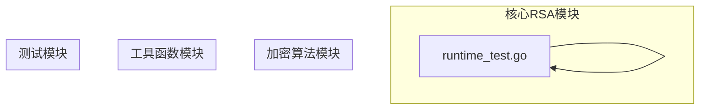

**图表来源**

- [rsa.go](file://rsa.go#L1-L564)
- [rsa_test.go](file://rsa_test.go#L1-L279)

**章节来源**

- [go.mod](file://go.mod#L1-L4)
- [README.md](file://README.md#L1-L800)

## 核心组件

### RSA结构体设计

RSA算法的核心实现围绕一个简洁的结构体展开：

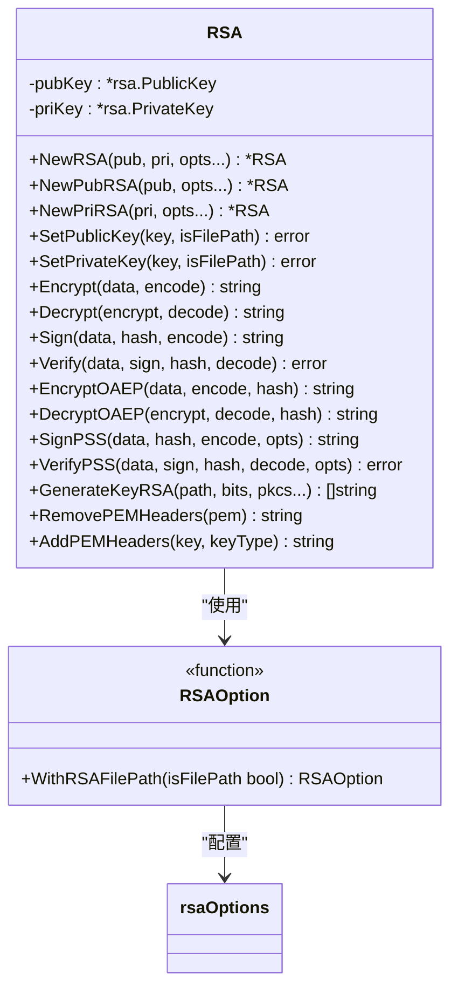

**图表来源**

- [rsa.go](file://rsa.go#L19-L564)

### 加密模式支持

该实现支持多种RSA加密模式：

| 加密模式        | 算法标准                                         | 用途   | 安全性 |
|-------------|----------------------------------------------|------|-----|
| PKCS#1 v1.5 | PKCS#1 v1.5                                  | 传统加密 | 中等  |
| OAEP        | OAEP (Optimal Asymmetric Encryption Padding) | 现代加密 | 高   |
| PSS         | Probabilistic Signature Scheme               | 数字签名 | 高   |

**章节来源**

- [rsa.go](file://rsa.go#L195-L408)

## 架构概览

### 整体架构设计

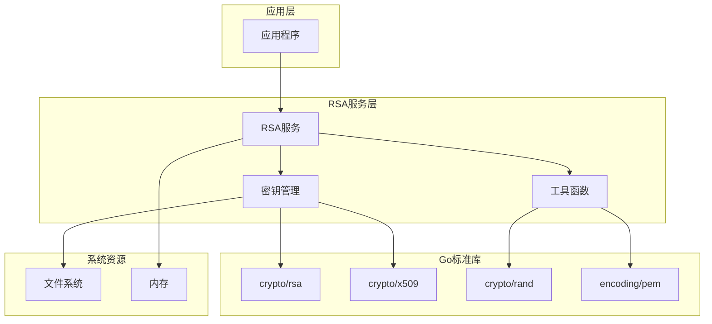

**图表来源**

- [rsa.go](file://rsa.go#L3-L17)
- [rsa.go](file://rsa.go#L410-L518)

### 数据流处理

RSA算法的处理流程遵循以下模式：

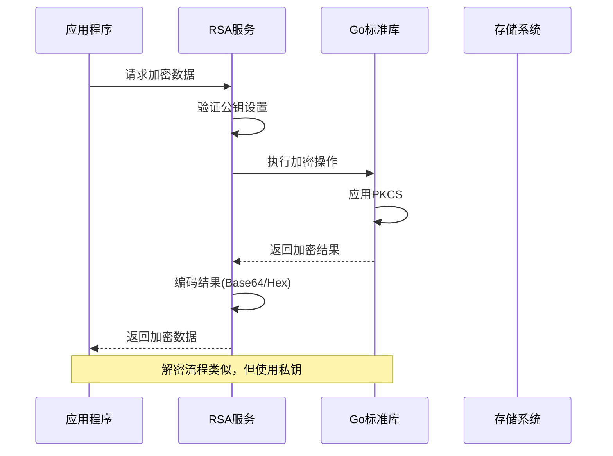

**图表来源**

- [rsa.go](file://rsa.go#L195-L256)
- [rsa.go](file://rsa.go#L301-L364)

## 详细组件分析

### 密钥管理组件

#### 公钥设置机制

公钥设置过程包含多个安全检查和格式验证：

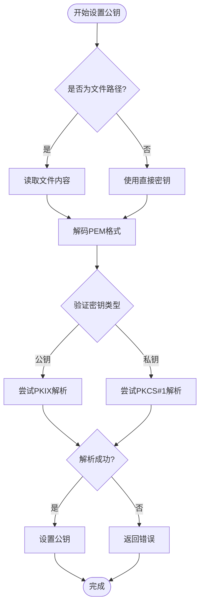

**图表来源**

- [rsa.go](file://rsa.go#L86-L130)

#### 私钥设置机制

私钥设置过程更加严格，确保密钥的安全性：

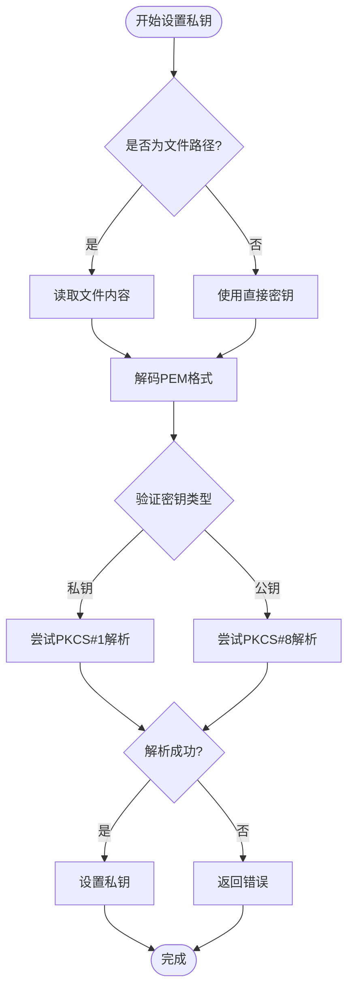

**图表来源**

- [rsa.go](file://rsa.go#L132-L177)

**章节来源**

- [rsa.go](file://rsa.go#L86-L177)

### 加密解密组件

#### PKCS#1 v1.5加密实现

PKCS#1 v1.5是最常用的RSA填充方案，具有良好的兼容性：

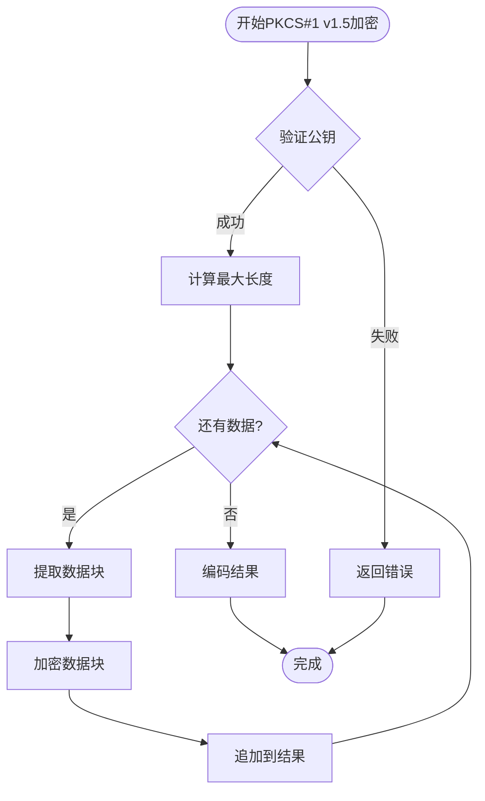

**图表来源**

- [rsa.go](file://rsa.go#L195-L222)

#### OAEP加密实现

OAEP提供了更强的安全性，适合现代应用场景：

```mermaid
flowchart TD
Start([开始OAEP加密]) --> ValidateKey{"验证公钥"}
ValidateKey --> |失败| ReturnError[返回错误]
ValidateKey --> |成功| CalcMaxLength[计算最大长度]
CalcMaxLength --> LoopChunks{"还有数据?"}
LoopChunks --> |是| ExtractChunk[提取数据块]
ExtractChunk --> EncryptChunk[加密数据块(OAEP)]
EncryptChunk --> AppendResult[追加到结果]
AppendResult --> LoopChunks
LoopChunks --> |否| EncodeResult[编码结果]
EncodeResult --> End([完成])
ReturnError --> End
```

**图表来源**

- [rsa.go](file://rsa.go#L301-L329)

**章节来源**

- [rsa.go](file://rsa.go#L195-L364)

### 数字签名组件

#### PKCS#1 v1.5签名实现

数字签名确保数据的完整性和不可否认性：

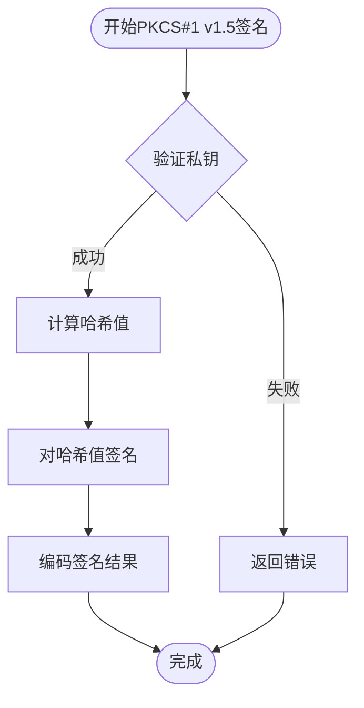

**图表来源**

- [rsa.go](file://rsa.go#L258-L277)

#### PSS签名实现

PSS提供了更现代的签名方案，具有更好的安全性：

```mermaid
flowchart TD
Start([开始PSS签名]) --> ValidateKey{"验证私钥"}
ValidateKey --> |失败| ReturnError[返回错误]
ValidateKey --> |成功| HashData[计算哈希值]
HashData --> SignHash[对哈希值签名(PSS)]
SignHash --> EncodeResult[编码签名结果]
EncodeResult --> End([完成])
ReturnError --> End
```

**图表来源**

- [rsa.go](file://rsa.go#L366-L386)

**章节来源**

- [rsa.go](file://rsa.go#L258-L408)

### 密钥生成组件

#### 密钥对生成流程

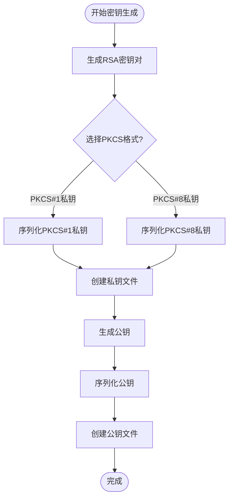

**图表来源**

- [rsa.go](file://rsa.go#L410-L518)

**章节来源**

- [rsa.go](file://rsa.go#L410-L518)

## 依赖关系分析

### 外部依赖

该RSA实现依赖于Go标准库的多个包：

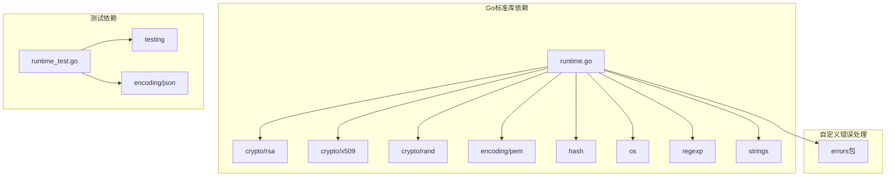

**图表来源**

- [rsa.go](file://rsa.go#L3-L17)
- [rsa_test.go](file://rsa_test.go#L3-L15)

### 内部依赖关系

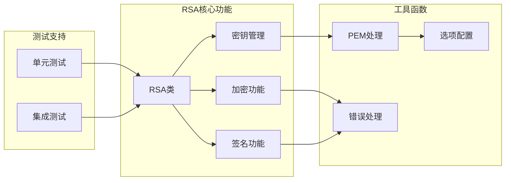

**图表来源**

- [rsa.go](file://rsa.go#L19-L564)
- [rsa_test.go](file://rsa_test.go#L1-L279)

**章节来源**

- [rsa.go](file://rsa.go#L3-L17)
- [rsa_test.go](file://rsa_test.go#L1-L279)

## 性能考虑

### 加密性能优化

1. **分块处理**: 对于长文本，系统采用分块处理策略，避免单次处理过大数据导致内存溢出
2. **缓冲区管理**: 使用`bytes.Buffer`进行高效的数据累积和处理
3. **内存复用**: 在可能的情况下重用缓冲区，减少内存分配开销

### 安全性考虑

1. **填充方案选择**: OAEP相比PKCS#1 v1.5提供更强的安全性
2. **随机数生成**: 使用`crypto/rand`确保加密过程中的随机性
3. **密钥格式**: 支持多种密钥格式，适应不同的安全需求

### 最佳实践建议

1. **密钥长度选择**: 建议使用至少2048位的密钥长度
2. **填充方案选择**: 对于新项目，优先选择OAEP填充
3. **编码方式**: 根据应用场景选择合适的编码方式（Base64、Hex等）

## 故障排除指南

### 常见问题及解决方案

#### 密钥加载失败

**问题描述**: 设置公钥或私钥时返回错误

**可能原因**:

- 密钥格式不正确
- 密钥文件权限问题
- 密钥内容损坏

**解决方案**:

1. 验证密钥文件格式是否为PEM格式
2. 检查密钥文件权限设置
3. 使用`RemovePEMHeaders`和`AddPEMHeaders`函数验证密钥格式

#### 加密失败

**问题描述**: 加密过程中出现错误

**可能原因**:

- 公钥未正确设置
- 数据长度超过限制
- 编码方式不匹配

**解决方案**:

1. 使用`IsSetPublicKey()`验证公钥状态
2. 检查数据长度是否超过密钥大小限制
3. 确保编码方式与解码方式一致

#### 签名验证失败

**问题描述**: 数字签名验证返回错误

**可能原因**:

- 数据被篡改
- 使用了错误的密钥
- 编码方式不匹配

**解决方案**:

1. 验证数据完整性
2. 确认使用正确的公钥进行验证
3. 检查编码方式的一致性

**章节来源**

- [rsa.go](file://rsa.go#L179-L193)
- [rsa.go](file://rsa.go#L86-L130)
- [rsa.go](file://rsa.go#L132-L177)

## 结论

本RSA算法实现提供了完整、安全且易于使用的非对称加密解决方案。通过支持多种填充方案、灵活的密钥管理和完善的错误处理机制，该实现能够满足大多数应用场景的需求。

### 主要优势

1. **安全性**: 支持多种现代加密标准，包括OAEP和PSS
2. **易用性**: 提供简洁的API接口，支持文件路径和直接密钥两种模式
3. **兼容性**: 兼容多种密钥格式，适应不同的部署环境
4. **可靠性**: 完善的错误处理和测试覆盖

### 适用场景

- 网络通信加密
- 数字签名验证
- 密钥交换协议
- 数据完整性保护

### 发展方向

未来可以考虑的功能扩展：

- 支持更多加密算法
- 增强性能优化
- 提供更丰富的配置选项
- 增加更多的安全特性