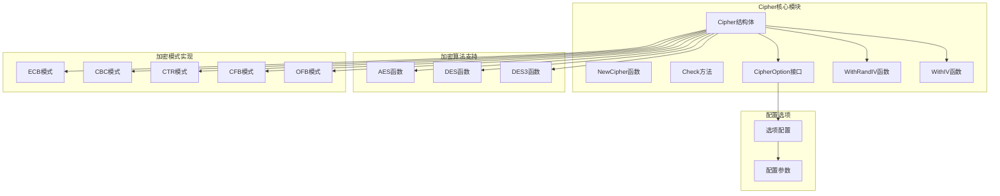
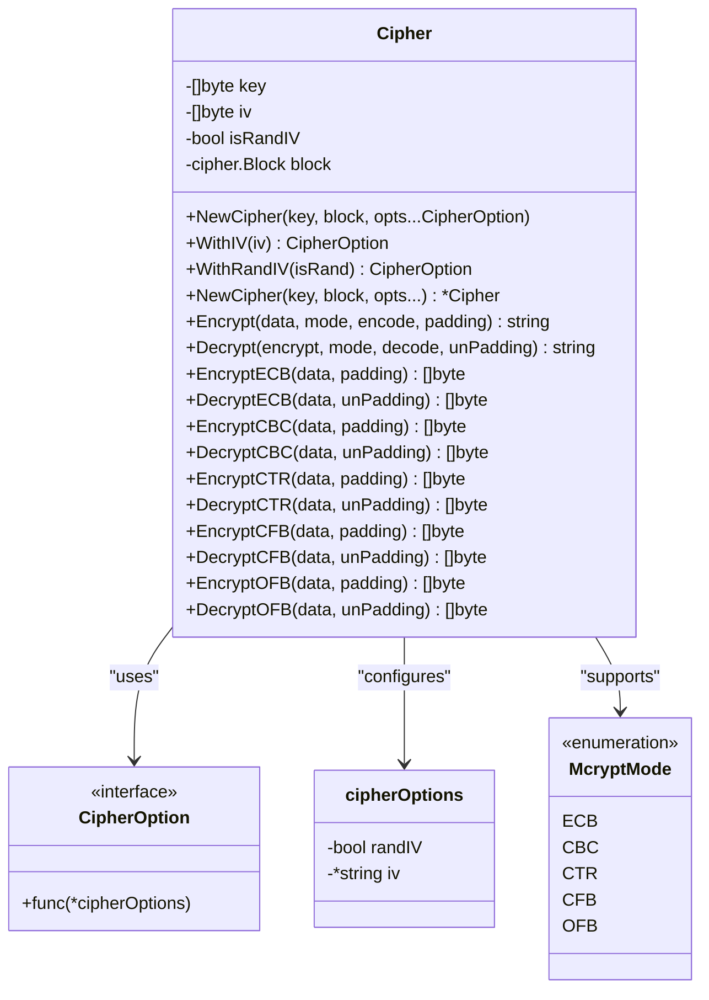
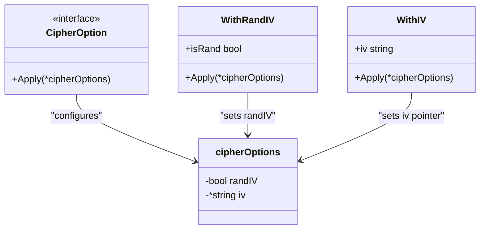
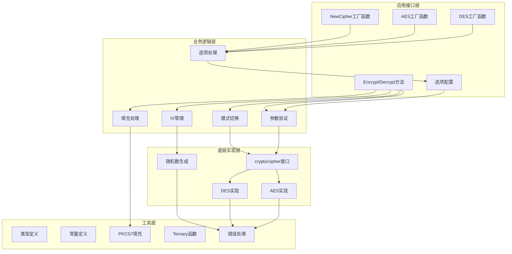
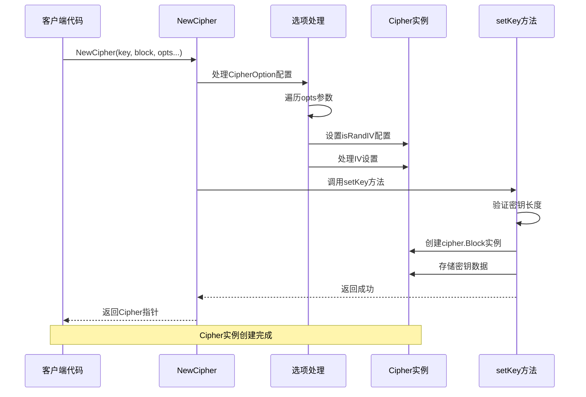
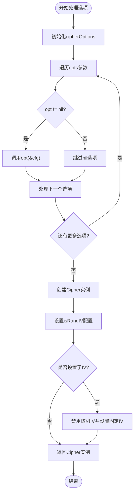
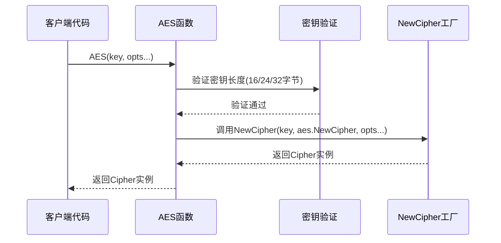
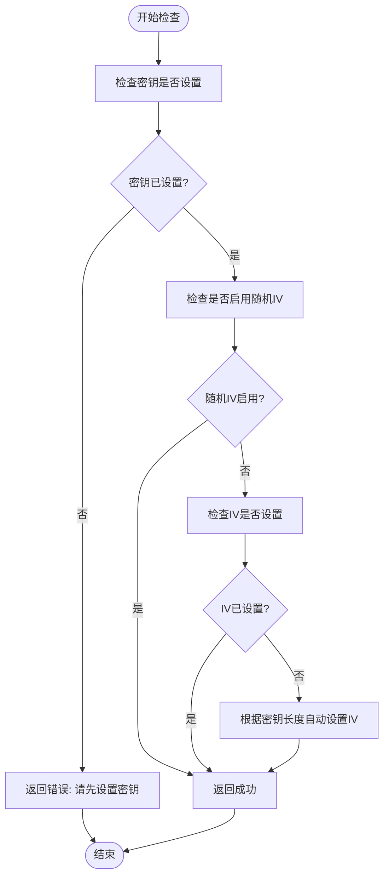

# Cipher核心结构体

<cite>
**本文档引用的文件**
- [cipher.go](file://cipher.go)
- [aes.go](file://aes.go)
- [des.go](file://des.go)
- [types.go](file://types.go)
- [consts.go](file://consts.go)
- [cipher_test.go](file://cipher_test.go)
- [aes_test.go](file://aes_test.go)
</cite>

## 更新摘要

**变更内容**

- 引入CipherOption模式替代传统的布尔参数
- 新增WithRandIV和WithIV选项函数
- 更新NewCipher函数签名支持可变参数配置
- AES和DES函数现在支持CipherOption参数
- 优化API设计，提供更直观的配置方式

## 目录

1. [简介](#简介)
2. [项目结构](#项目结构)
3. [核心组件](#核心组件)
4. [架构概览](#架构概览)
5. [详细组件分析](#详细组件分析)
6. [依赖关系分析](#依赖关系分析)
7. [性能考虑](#性能考虑)
8. [故障排除指南](#故障排除指南)
9. [结论](#结论)

## 简介

Cipher是Go-Utils库中的核心加密组件，提供了对称分组加密的统一接口。该组件支持多种加密算法（AES、DES、3DES）和加密模式（ECB、CBC、CTR、CFB、OFB），为开发者提供了一个简洁而强大的加密解决方案。Cipher的设计理念是通过统一的接口封装底层加密细节，同时保持高度的灵活性和安全性。

**更新** 引入了现代化的CipherOption配置模式，替代传统的布尔参数，提供更直观和可扩展的API设计。

## 项目结构

Cipher组件位于Go-Utils库的核心位置，与相关的加密工具函数共同构成了完整的加密生态系统：



**图表来源**

- [cipher.go](file://cipher.go#L21-L26)
- [cipher.go](file://cipher.go#L28-L48)
- [aes.go](file://aes.go#L9-L20)
- [des.go](file://des.go#L9-L33)

**章节来源**

- [cipher.go](file://cipher.go#L1-L530)
- [aes.go](file://aes.go#L1-L21)
- [des.go](file://des.go#L1-L34)

## 核心组件

### Cipher结构体设计

Cipher结构体是整个加密系统的核心，包含了所有必要的加密状态和配置信息：



**图表来源**

- [cipher.go](file://cipher.go#L21-L26)
- [cipher.go](file://cipher.go#L28-L48)
- [types.go](file://types.go#L46-L74)

### 字段详细说明

#### key（密钥）

- **类型**: `[]byte`
- **作用**: 存储加密算法的密钥数据
- **长度要求**:
    - AES: 16、24或32字节（对应AES-128、AES-192、AES-256）
    - DES: 8字节
    - 3DES: 24字节
- **存储方式**: 以字节数组形式存储，便于直接传递给底层加密库

#### iv（初始化向量）

- **类型**: `[]byte`
- **作用**: 在CBC、CTR、CFB、OFB等模式下提供随机性
- **长度要求**:
    - AES: 16字节（与块大小相同）
    - DES: 8字节（与块大小相同）
- **管理方式**: 通过`WithIV(iv)`选项在构造时设置,或通过`WithRandIV(true)`启用自动随机生成

#### isRandIV（随机IV标志）

- **类型**: `bool`
- **作用**: 控制是否在每次加密时自动生成新的IV
- **行为**:
    - `true`: 自动随机生成IV，IV值会附加到密文开头
    - `false`: 使用手动设置的IV或根据密钥推导IV

#### block（加密块接口）

- **类型**: `cipher.Block`
- **作用**: 底层加密算法的具体实现接口
- **支持算法**:
    - AES加密算法
    - DES加密算法
    - 3DES加密算法
- **生命周期**: 在内部setKey方法中创建并存储

**章节来源**

- [cipher.go](file://cipher.go#L21-L26)
- [cipher.go](file://cipher.go#L74-L90)

### CipherOption配置系统

**新增** CipherOption是现代化的配置系统，替代了传统的布尔参数：



**图表来源**

- [cipher.go](file://cipher.go#L28-L48)

#### WithRandIV选项

- **功能**: 设置是否启用随机IV模式
- **参数**: `isRand bool` - `true`启用随机IV，`false`禁用
- **行为**: 如果设置了IV，则以IV为准，不随机生成IV

#### WithIV选项

- **功能**: 设置固定的IV值
- **参数**: `iv string` - 固定的IV字符串
- **行为**: 设置后将覆盖随机IV配置

**章节来源**

- [cipher.go](file://cipher.go#L28-L48)

## 架构概览

Cipher组件采用了分层架构设计，从上到下分为应用接口层、业务逻辑层和底层加密实现层：



**图表来源**

- [cipher.go](file://cipher.go#L54-L72)
- [aes.go](file://aes.go#L12-L20)
- [des.go](file://des.go#L12-L22)

## 详细组件分析

### NewCipher函数

NewCipher是Cipher的工厂函数，负责创建和初始化Cipher实例：



**图表来源**

- [cipher.go](file://cipher.go#L54-L72)
- [cipher.go](file://cipher.go#L74-L90)

#### 参数配置详解

- **key**: 加密密钥字符串
- **block**: 加密算法工厂函数（如`aes.NewCipher`、`des.NewCipher`）
- **opts**: 可变参数的CipherOption配置项，包括：
    - `WithRandIV(isRand bool)`: 启用/禁用随机IV生成
    - `WithIV(iv string)`: 设置固定IV值

#### 选项处理机制

NewCipher内部通过遍历opts参数处理配置：



**图表来源**

- [cipher.go](file://cipher.go#L54-L72)

**章节来源**

- [cipher.go](file://cipher.go#L54-L72)
- [cipher.go](file://cipher.go#L74-L90)

### AES函数

**更新** AES函数现在支持CipherOption配置：



**图表来源**

- [aes.go](file://aes.go#L12-L20)

#### 密钥长度验证

- **支持长度**: 16、24、32字节
- **对应算法**: AES-128、AES-192、AES-256

**章节来源**

- [aes.go](file://aes.go#L12-L20)

### DES函数

**更新** DES函数现在支持CipherOption配置：

```mermaid
sequenceDiagram
participant Client as 客户端代码
participant DESFunc as DES函数
participant KeyValidator as 密钥验证
participant NewCipher as NewCipher工厂
Client->>DESFunc : DES(key, opts...)
DESFunc->>KeyValidator : 验证密钥长度(8/24字节)
KeyValidator --> CheckType{"长度=24?"}
CheckType --> |是| CallDES3["调用DES3函数"]
CheckType --> |否| Check8{"长度=8?"}
Check8 --> |是| Continue["继续处理"]
Check8 --> |否| ReturnError["返回错误"]
Continue --> NewCipherCall["调用NewCipher"]
NewCipherCall --> ReturnCipher["返回Cipher实例"]
CallDES3 --> ReturnCipher
ReturnError --> End([结束])
```

**图表来源**

- [des.go](file://des.go#L12-L22)

#### 密钥长度验证

- **8字节**: DES算法
- **24字节**: 3DES算法

**章节来源**

- [des.go](file://des.go#L12-L22)

### 内部方法说明

Cipher结构体包含以下内部方法（未导出）：

#### setKey方法（内部方法）

- **功能**: 设置和验证加密密钥
- **使用场景**:
    - 在NewCipher初始化时调用
    - 需要重新配置加密算法时
- **注意事项**:
    - 必须确保密钥长度符合相应算法要求
    - 设置新密钥会重新创建cipher.Block实例

#### setIV方法（内部方法）

- **功能**: 设置初始化向量
- **长度验证**: 必须与当前cipher.Block的块大小相同
    - AES: 16字节
    - DES: 8字节

**注意**: 在新的API设计中，IV通过`WithIV(iv)`选项在构造Cipher实例时设置，而非通过公开方法设置。

### Check方法

Check方法是Cipher的完整性检查方法，确保所有必需的配置都已正确设置：



**图表来源**

- [cipher.go](file://cipher.go#L100-L116)

#### 校验逻辑

1. **密钥检查**: 确保已通过工厂函数或NewCipher完成密钥设置
2. **随机IV处理**: 如果启用随机IV，直接通过检查
3. **IV设置检查**: 如果IV未设置，根据密钥长度自动推导

**章节来源**

- [cipher.go](file://cipher.go#L100-L116)

### 加密模式实现

Cipher支持五种主要的加密模式，每种模式都有其特定的应用场景和安全特性：

#### ECB模式（电子密码本）

- **特点**: 最简单的模式，相同明文块产生相同密文块
- **适用场景**: 对安全性要求不高的简单数据加密
- **限制**: 不推荐用于长文本或包含重复模式的数据

#### CBC模式（密码分组链接）

- **特点**: 每个明文块与前一个密文块进行XOR操作
- **优势**: 提供更好的安全性，相同明文产生不同密文
- **使用**: 默认推荐的加密模式

#### CTR模式（计数器模式）

- **特点**: 使用计数器生成密钥流
- **优势**: 支持并行处理，适合大数据量加密
- **应用场景**: 大文件加密、实时数据流加密

#### CFB模式（密码反馈）

- **特点**: 将块加密转换为流加密
- **适用场景**: 需要流式处理的加密应用

#### OFB模式（输出反馈）

- **特点**: 与CFB类似，但反馈的是加密输出
- **应用场景**: 需要错误传播特性的应用

**章节来源**

- [cipher.go](file://cipher.go#L133-L530)
- [consts.go](file://consts.go#L4-L10)

## 依赖关系分析

Cipher组件的依赖关系体现了清晰的分层架构：

```mermaid
graph TB
subgraph "外部依赖"
CryptoCipher[crypto/cipher]
CryptoRand[crypto/rand]
Errors[errors包]
Io[io包]
end
subgraph "内部依赖"
Cipher[Cipher核心]
AES[AES实现]
DES[DES实现]
CipherOption[CipherOption接口]
cipherOptions[cipherOptions结构]
Types[类型定义]
Consts[常量定义]
Ternary[Ternary函数]
End
subgraph "测试依赖"
Testing[testing包]
Base64[encoding/base64]
end
Cipher --> CryptoCipher
Cipher --> CryptoRand
Cipher --> Errors
Cipher --> Io
Cipher --> CipherOption
Cipher --> cipherOptions
Cipher --> Ternary
AES --> CryptoCipher
AES --> Errors
DES --> CryptoCipher
DES --> Errors
Testing --> Cipher
Testing --> Base64
```

**图表来源**

- [cipher.go](file://cipher.go#L3-L9)
- [aes.go](file://aes.go#L3-L7)
- [des.go](file://des.go#L3-L7)
- [cipher_test.go](file://cipher_test.go#L3-L10)

### 关键依赖关系

1. **crypto/cipher**: 提供底层加密算法接口
2. **crypto/rand**: 提供安全的随机数生成
3. **errors**: 统一的错误处理机制
4. **io**: 提供流式数据处理能力

**章节来源**

- [cipher.go](file://cipher.go#L3-L9)
- [cipher.go](file://cipher.go#L156-L162)
- [cipher.go](file://cipher.go#L228-L233)

## 性能考虑

### 内存管理

- **缓冲区复用**: 加密和解密过程中使用预先分配的缓冲区
- **零拷贝优化**: 在可能的情况下避免不必要的数据复制
- **内存清理**: 提供zero包用于敏感数据的安全清理

### 并发安全性

- **线程安全**: Cipher实例在设计上是线程安全的
- **状态隔离**: 每个加密操作都有独立的状态管理
- **资源管理**: 合理的资源释放和垃圾回收

### 性能优化建议

1. **批量处理**: 对大量数据进行批量加密以提高效率
2. **合适的模式选择**: 根据应用场景选择最适合的加密模式
3. **密钥缓存**: 在长时间运行的应用中缓存已设置的密钥
4. **选项复用**: 在多个Cipher实例间复用相同的CipherOption配置

## 故障排除指南

### 常见错误及解决方案

#### 密钥长度错误

**错误信息**: "AES秘钥的长度只能是16、24或32字节。当前预设置的秘钥[...]长度: X"

**原因**: 密钥长度不符合所选加密算法的要求

**解决方案**:

- 确认使用的加密算法类型
- 生成符合要求长度的密钥
- 使用标准的密钥生成方法

#### IV长度错误

**错误信息**: "iv的长度只能是X个字节, 当前预设置的iv[...]长度: Y"

**原因**: 初始化向量长度与块大小不匹配

**解决方案**:

- 确认使用的加密算法对应的IV长度
- 生成正确长度的IV
- 或者启用随机IV功能

#### 模式错误

**错误信息**: "错误的加密模式"

**原因**: 传入了不支持的加密模式

**解决方案**:

- 检查McryptMode枚举值
- 确保使用正确的模式常量

#### IV配置说明

**说明**: WithIV和WithRandIV可以同时使用，WithIV优先级更高

**行为**:

- 如果设置了WithIV，将使用固定IV值，并自动禁用随机IV
- 如果只设置了WithRandIV(true)，将在每次加密时生成随机IV

**最佳实践**:

- 使用WithIV(iv)设置固定IV时，无需额外设置WithRandIV(false)
- WithIV会自动禁用随机IV功能

**章节来源**

- [cipher.go](file://cipher.go#L76-L78)
- [cipher.go](file://cipher.go#L124-L127)
- [cipher.go](file://cipher.go#L483-L484)

### 调试技巧

1. **启用详细日志**: 在开发环境中启用详细的错误信息
2. **单元测试**: 使用提供的测试用例验证功能正确性
3. **边界测试**: 测试各种边界情况和异常输入
4. **选项验证**: 验证CipherOption配置的正确性

**章节来源**

- [cipher_test.go](file://cipher_test.go#L12-L63)
- [aes_test.go](file://aes_test.go#L11-L144)

## 结论

Cipher核心结构体通过精心设计的架构和完善的错误处理机制，为Go语言提供了强大而易用的加密解决方案。其主要优势包括：

1. **统一接口**: 为不同的加密算法提供一致的编程接口
2. **灵活配置**: 支持多种加密模式和参数配置
3. **现代化API**: 引入CipherOption模式提供更直观的配置方式
4. **安全可靠**: 采用标准的加密库和最佳实践
5. **易于使用**: 简洁的API设计降低了使用复杂度

**更新** 新的CipherOption配置系统显著提升了API的可用性和可维护性，开发者可以通过WithRandIV和WithIV等选项函数更直观地配置Cipher实例。

通过合理使用Cipher组件，开发者可以轻松实现各种加密需求，同时确保代码的安全性和可维护性。建议在生产环境中遵循以下最佳实践：

- 优先使用CBC模式进行数据加密
- 启用随机IV功能
- 使用适当的填充方案
- 正确管理密钥和IV的生命周期
- 实施适当的错误处理和日志记录
- 利用CipherOption配置系统简化配置流程
- 在多个实例间共享相同的配置选项以提高效率

**章节来源**

- [cipher.go](file://cipher.go#L28-L48)
- [aes.go](file://aes.go#L12-L20)
- [des.go](file://des.go#L12-L22)