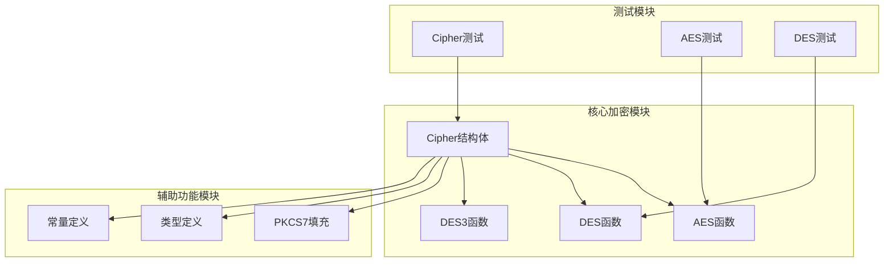
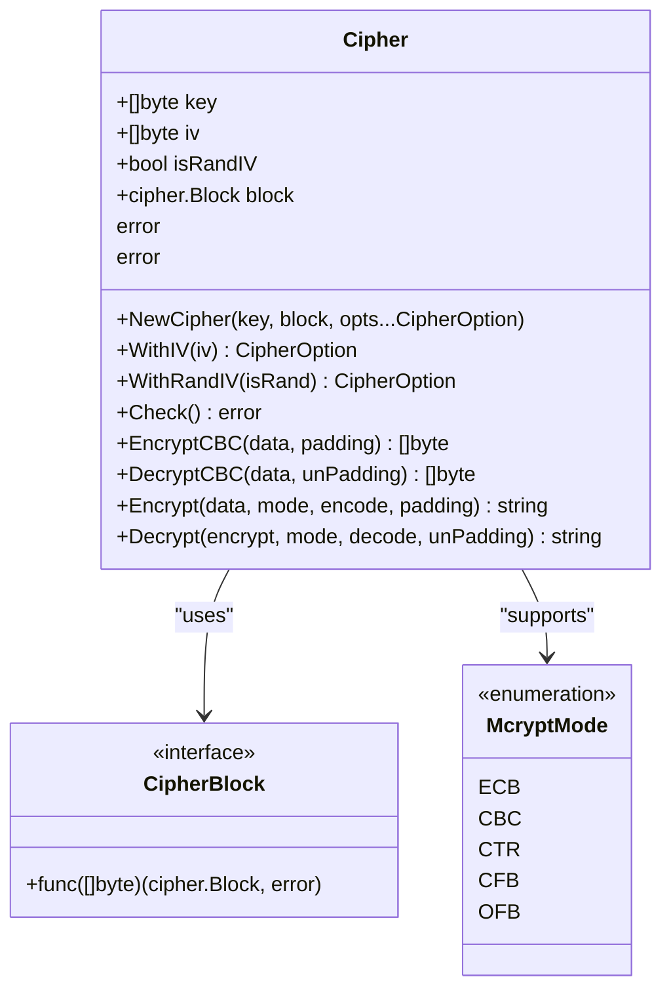
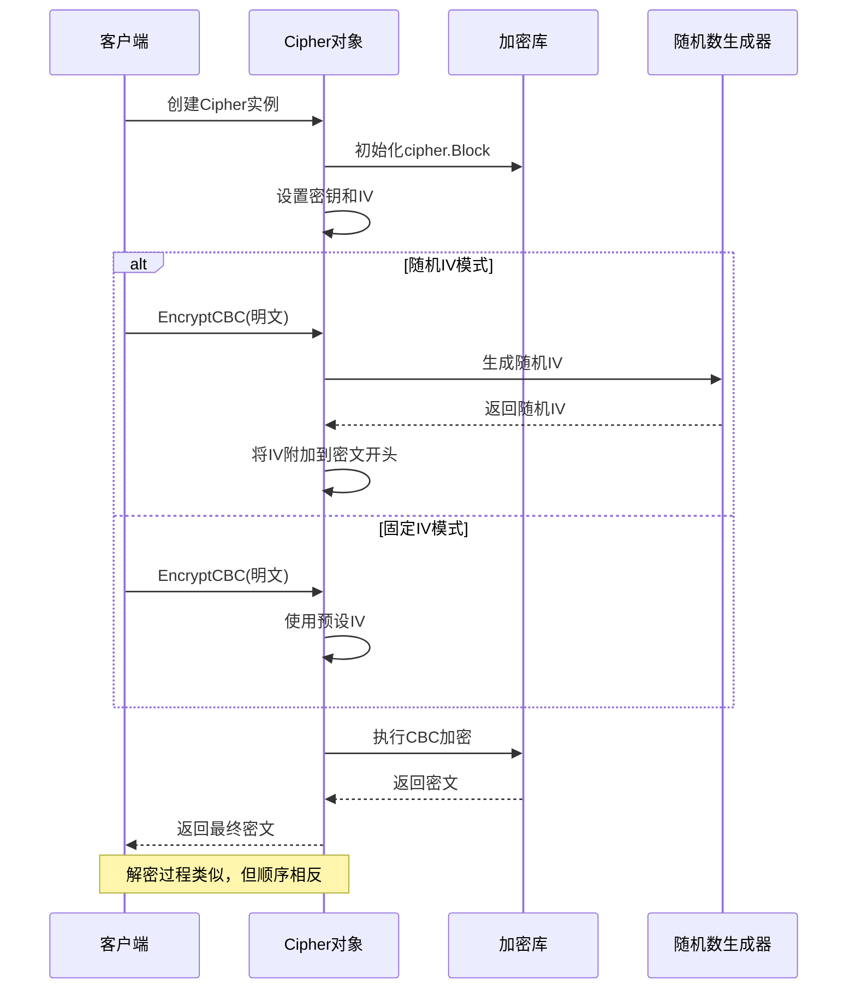
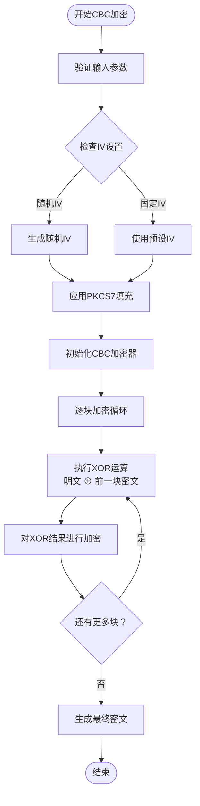
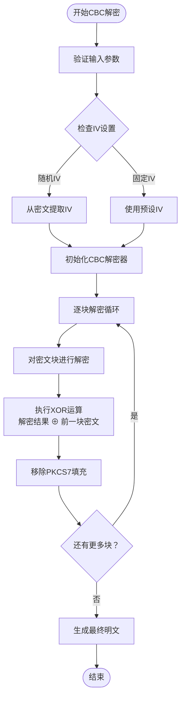
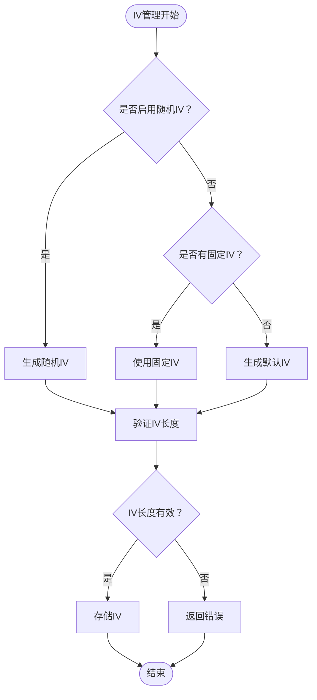
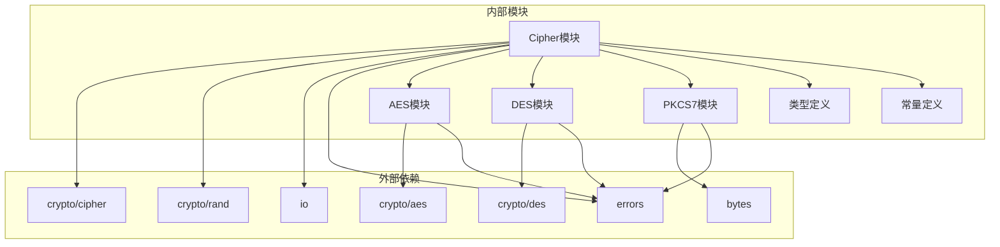

# CBC（密码分组链接模式）

<cite>
**本文档引用的文件**
- [cipher.go](file://cipher.go)
- [aes.go](file://aes.go)
- [des.go](file://des.go)
- [pkcs7.go](file://pkcs7.go)
- [consts.go](file://consts.go)
- [types.go](file://types.go)
- [aes_test.go](file://aes_test.go)
- [cipher_test.go](file://cipher_test.go)
- [des_test.go](file://des_test.go)
</cite>

## 目录

1. [简介](#简介)
2. [项目结构](#项目结构)
3. [核心组件](#核心组件)
4. [架构概览](#架构概览)
5. [详细组件分析](#详细组件分析)
6. [依赖关系分析](#依赖关系分析)
7. [性能考虑](#性能考虑)
8. [故障排除指南](#故障排除指南)
9. [结论](#结论)

## 简介

CBC（密码分组链接模式，Cipher Block Chaining）是一种重要的对称加密模式，它通过将每个明文字节块与前一个密文字节块进行异或运算，再对结果进行加密，从而实现高度安全的加密效果。CBC模式的核心特性包括：

- **安全性高**：每个明文字节块的加密都依赖于前一个密文字节块，使得相同的明文字节块会产生不同的密文字节块
- **抗重放攻击**：由于IV的存在，即使相同的明文也会产生不同的密文
- **错误传播**：单个密文字节块的损坏会影响当前和后续的解密结果
- **需要填充**：当明文长度不是分组大小的整数倍时，需要进行填充

CBC模式在现代密码学中被广泛应用于各种安全场景，包括数据传输加密、文件加密和数据库加密等。

## 项目结构

该项目采用模块化的Go语言设计，围绕Cipher核心结构体构建了完整的加密解决方案。主要文件组织如下：

**图表来源**

- [cipher.go](file://cipher.go#L1-L498)
- [aes.go](file://aes.go#L1-L23)
- [des.go](file://des.go#L1-L45)

**章节来源**

- [cipher.go](file://cipher.go#L1-L498)
- [aes.go](file://aes.go#L1-L23)
- [des.go](file://des.go#L1-L45)

## 核心组件

### Cipher结构体

Cipher是整个加密系统的核心结构体，负责管理密钥、初始化向量（IV）和加密模式：

**图表来源**

- [cipher.go](file://cipher.go#L20-L25)
- [types.go](file://types.go#L46-L74)

### 加密模式枚举

项目支持多种加密模式，其中CBC模式具有特殊的重要性：

| 模式名称 | 模式编号 | 特点描述       | IV需求 |
|------|------|------------|------|
| ECB  | 0    | 电码本模式，无IV  | 否    |
| CBC  | 1    | 密码分组链接，有IV | 是    |
| CTR  | 2    | 计算器模式，有IV  | 是    |
| CFB  | 3    | 密码反馈模式，有IV | 是    |
| OFB  | 4    | 输出反馈模式，有IV | 是    |

**章节来源**

- [consts.go](file://consts.go#L4-L10)
- [cipher.go](file://cipher.go#L10-L18)

## 架构概览

CBC加密模式的完整工作流程包括初始化、加密和解密三个阶段：

**图表来源**

- [cipher.go](file://cipher.go#L139-L171)
- [cipher.go](file://cipher.go#L173-L208)

## 详细组件分析

### CBC加密算法实现

CBC模式的核心算法遵循标准的密码学规范，确保了高度的安全性：

#### 加密流程

**图表来源**

- [cipher.go](file://cipher.go#L139-L171)
- [pkcs7.go](file://pkcs7.go#L8-L15)

#### 解密流程

**图表来源**

- [cipher.go](file://cipher.go#L173-L208)
- [pkcs7.go](file://pkcs7.go#L17-L30)

### 初始化向量（IV）管理

IV是CBC模式安全性的关键组件，项目提供了灵活的IV管理机制：

#### IV长度要求

| 加密算法 | 分组大小       | IV长度要求  |
|------|------------|---------|
| AES  | 128位（16字节） | 必须为16字节 |
| DES  | 64位（8字节）   | 必须为8字节  |
| 3DES | 64位（8字节）   | 必须为8字节  |

#### IV生成策略

**图表来源**

- [cipher.go](file://cipher.go#L68-L99)

### 密钥管理

项目支持多种密钥长度，确保与不同加密算法的兼容性：

| 加密算法 | 支持的密钥长度        | 对应的AES变体                |
|------|----------------|-------------------------|
| AES  | 16字节、24字节、32字节 | AES-128、AES-192、AES-256 |
| DES  | 8字节            | DES                     |
| 3DES | 24字节           | Triple DES              |

**章节来源**

- [cipher.go](file://cipher.go#L42-L58)
- [aes.go](file://aes.go#L13-L17)
- [des.go](file://des.go#L13-L19)

## 依赖关系分析

项目的依赖关系清晰明确，体现了良好的模块化设计：

**图表来源**

- [cipher.go](file://cipher.go#L3-L8)
- [aes.go](file://aes.go#L3-L6)
- [des.go](file://des.go#L3-L6)

**章节来源**

- [cipher.go](file://cipher.go#L3-L8)
- [aes.go](file://aes.go#L3-L6)
- [des.go](file://des.go#L3-L6)

## 性能考虑

CBC模式的性能特点和优化建议：

### 时间复杂度

- **加密/解密复杂度**：O(n)，其中n为明文字节块数量
- **内存使用**：O(n)，需要存储完整的明文和密文缓冲区
- **并行化**：CBC模式本身不支持并行处理，因为每个块依赖于前一个块

### 内存优化

- **流式处理**：对于大文件，建议使用流式处理减少内存占用
- **缓冲区管理**：合理设置缓冲区大小以平衡内存使用和性能
- **垃圾回收**：及时释放不再使用的加密缓冲区

### 安全性优化

- **IV随机性**：确保IV的生成使用密码学安全的随机数生成器
- **密钥轮换**：定期更换加密密钥以提高长期安全性
- **完整性保护**：结合消息认证码（MAC）确保数据完整性

## 故障排除指南

### 常见问题及解决方案

#### IV长度错误

**问题**：IV长度与分组大小不匹配
**解决方案**：确保IV长度等于相应算法的分组大小

- AES: 16字节
- DES: 8字节
- 3DES: 8字节

#### 密文格式错误

**问题**：密文格式不符合预期
**解决方案**：检查加密模式设置和编码方式的一致性

#### 解密失败

**问题**：解密过程中出现错误
**解决方案**：

1. 验证密钥和IV的正确性
2. 检查密文是否被篡改
3. 确认填充方案的一致性

**章节来源**

- [cipher.go](file://cipher.go#L86-L99)
- [cipher.go](file://cipher.go#L173-L208)

## 结论

CBC（密码分组链接模式）作为一种重要的对称加密模式，在现代密码学应用中发挥着关键作用。通过深入分析该项目的实现，我们可以看到其在以下方面的优秀设计：

### 安全性保障

- **IV管理**：提供灵活的IV生成和管理机制
- **填充方案**：集成PKCS7填充确保数据完整性
- **错误处理**：完善的错误检测和处理机制

### 功能完整性

- **多算法支持**：同时支持AES、DES和3DES算法
- **多种模式**：提供完整的加密模式选择
- **编码支持**：支持多种数据编码方式

### 开发友好性

- **接口设计**：简洁直观的API设计
- **类型安全**：强类型的Go语言实现
- **测试覆盖**：全面的单元测试保证质量

CBC模式的实现充分体现了现代密码学的最佳实践，为开发者提供了安全、可靠、易用的加密解决方案。通过正确理解和使用这些组件，开发者可以构建出满足各种安全需求的应用程序。