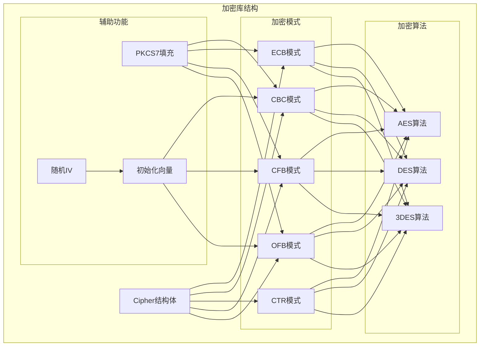
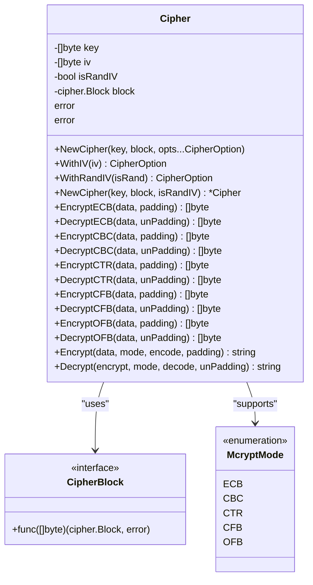
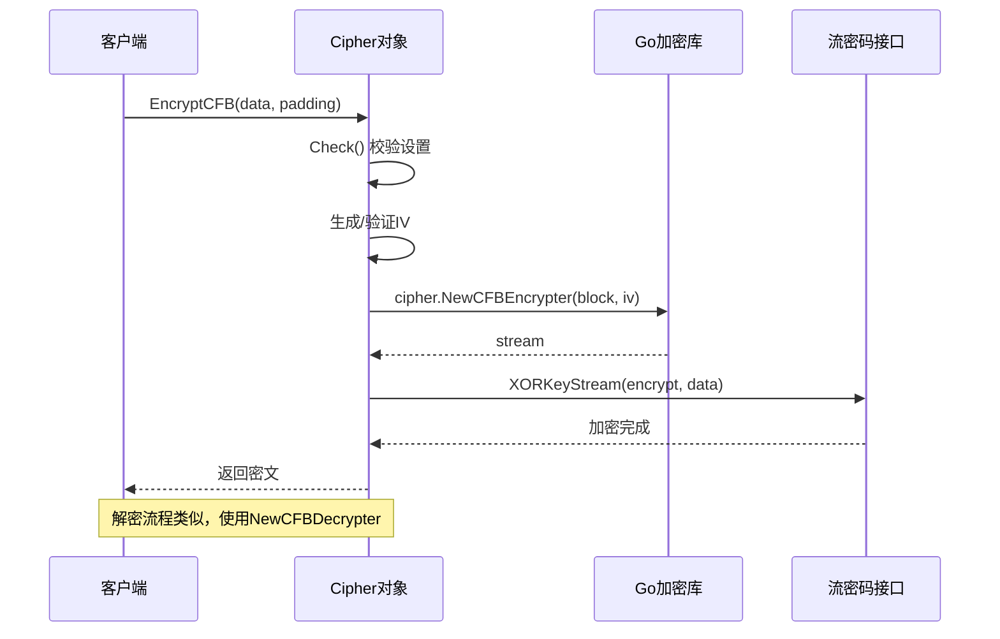
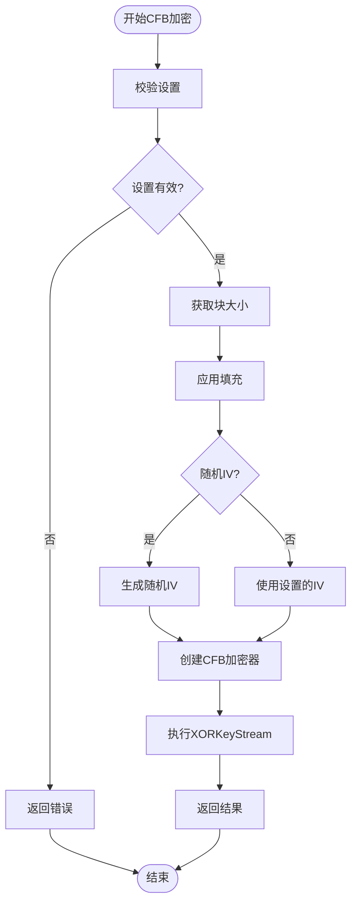
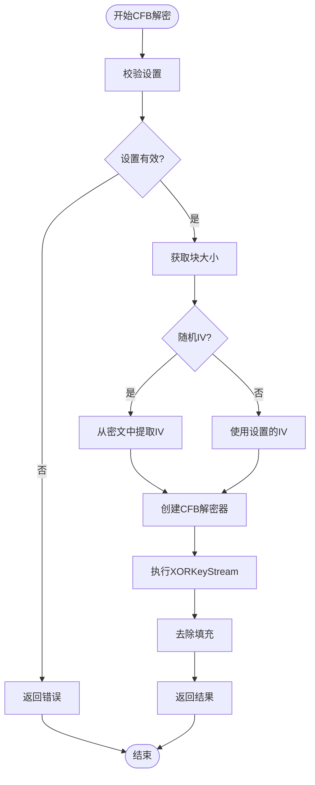
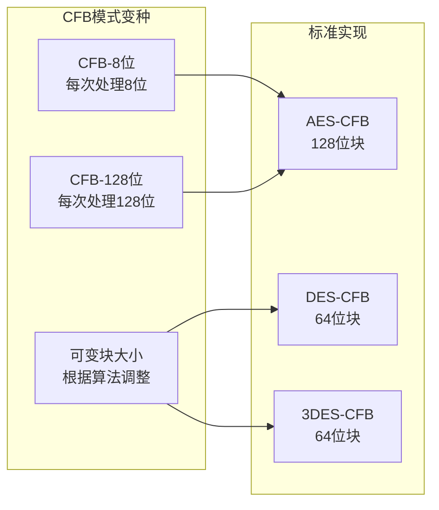
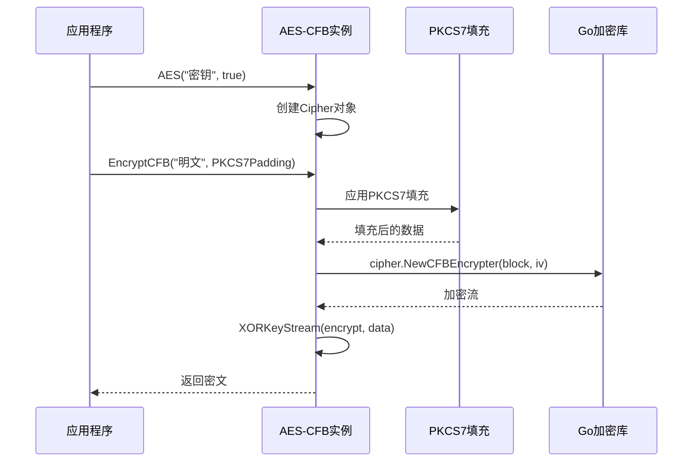
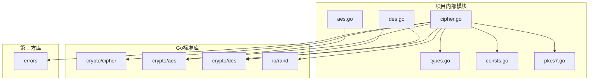

# CFB（密码反馈模式）

<cite>
**本文档引用的文件**
- [cipher.go](file://cipher.go)
- [aes.go](file://aes.go)
- [des.go](file://des.go)
- [consts.go](file://consts.go)
- [types.go](file://types.go)
- [pkcs7.go](file://pkcs7.go)
- [cipher_test.go](file://cipher_test.go)
- [aes_test.go](file://aes_test.go)
- [des_test.go](file://des_test.go)
</cite>

## 目录

1. [简介](#简介)
2. [项目结构](#项目结构)
3. [核心组件](#核心组件)
4. [架构概览](#架构概览)
5. [详细组件分析](#详细组件分析)
6. [依赖关系分析](#依赖关系分析)
7. [性能考虑](#性能考虑)
8. [故障排除指南](#故障排除指南)
9. [结论](#结论)

## 简介

CFB（Cipher Feedback，密码反馈）模式是一种流密码加密模式，它将分组密码转换为流密码。CFB模式通过将加密器的输出与明文进行XOR运算来生成密文，同时将密文反馈到加密器的输入端形成循环。这种设计使得CFB模式具有以下特点：

- **流密码特性**：可以处理任意长度的明文，无需填充
- **实时加密**：支持边接收边加密，适合实时数据传输
- **错误传播**：密文中的单比特错误会影响后续的明文解密
- **随机访问**：支持随机访问特定位置的数据

CFB模式的主要优势在于其能够处理任意长度的数据，不需要像CBC模式那样进行PKCS7填充，这使得它特别适合处理流式数据和实时通信场景。

## 项目结构

该项目是一个Go语言的加密工具库，提供了多种对称加密算法的封装，包括AES、DES和3DES。CFB模式作为其中一种加密模式，与其他加密模式（ECB、CBC、CTR、OFB）一起提供统一的接口。

**图表来源**

- [cipher.go](file://cipher.go#L10-L25)
- [consts.go](file://consts.go#L4-L10)
- [aes.go](file://aes.go#L12-L22)
- [des.go](file://des.go#L12-L27)

**章节来源**

- [cipher.go](file://cipher.go#L1-L498)
- [consts.go](file://consts.go#L1-L23)

## 核心组件

### Cipher结构体

Cipher是整个加密系统的核心结构体，它封装了密钥、初始化向量、密码块和各种加密模式的实现。

**图表来源**

- [cipher.go](file://cipher.go#L20-L25)
- [types.go](file://types.go#L46-L74)

### 加密模式枚举

项目中定义了五种不同的加密模式，CFB模式在其中占据重要地位：

| 模式  | 编号 | 特点         | 用途        |
|-----|----|------------|-----------|
| ECB | 0  | 无IV，简单但不安全 | 小数据块，不推荐  |
| CBC | 1  | 需要IV和填充    | 通用，最常用    |
| CTR | 2  | 流密码，可并行    | 大数据，高性能   |
| CFB | 3  | 流密码，可随机访问  | 实时数据，流式传输 |
| OFB | 4  | 流密码，无错误传播  | 语音数据      |

**章节来源**

- [consts.go](file://consts.go#L4-L10)
- [cipher.go](file://cipher.go#L10-L18)

## 架构概览

CFB模式的实现遵循Go标准库的加密接口设计，使用`crypto/cipher`包提供的流密码接口。整个架构采用分层设计，提供了统一的API接口和灵活的配置选项。

**图表来源**

- [cipher.go](file://cipher.go#L281-L313)
- [cipher.go](file://cipher.go#L315-L350)

**章节来源**

- [cipher.go](file://cipher.go#L281-L350)

## 详细组件分析

### CFB加密实现

CFB模式的加密过程涉及三个主要步骤：初始化、加密和清理。每个步骤都有明确的职责和错误处理机制。

**图表来源**

- [cipher.go](file://cipher.go#L281-L313)

#### 加密流程详解

CFB模式的加密过程可以分为以下几个关键步骤：

1. **设置校验**：确保密钥和IV已经正确设置
2. **块大小确定**：根据使用的加密算法确定块大小
3. **数据填充**：对明文进行PKCS7填充
4. **IV处理**：根据配置决定是否使用随机生成的IV
5. **流创建**：使用`cipher.NewCFBEncrypter`创建加密流
6. **数据加密**：通过`XORKeyStream`方法进行实际加密

#### 解密流程详解

CFB模式的解密过程与加密过程几乎完全对称：

**图表来源**

- [cipher.go](file://cipher.go#L315-L350)

**章节来源**

- [cipher.go](file://cipher.go#L281-L350)

### CFB与OFB模式对比

虽然CFB和OFB都是流密码模式，但它们在工作原理和适用场景上有显著差异：

| 特性        | CFB模式      | OFB模式     |
|-----------|------------|-----------|
| **反馈机制**  | 密文反馈到加密器输入 | 明文不参与反馈   |
| **错误传播**  | 密文错误影响后续明文 | 仅影响当前明文   |
| **随机访问**  | 支持         | 支持        |
| **并行处理**  | 不支持        | 支持        |
| **实现复杂度** | 较高         | 较低        |
| **适用场景**  | 实时数据传输     | 语音数据，容错性强 |

### CFB模式的变种

项目中提供的CFB实现基于Go标准库的流密码接口，支持所有块大小的加密算法。虽然标准库没有直接提供CFB-8位或CFB-128位的专门实现，但可以通过调整块大小来实现类似的效果。

**图表来源**

- [cipher.go](file://cipher.go#L281-L350)
- [aes.go](file://aes.go#L12-L22)
- [des.go](file://des.go#L12-L27)

**章节来源**

- [cipher.go](file://cipher.go#L281-L350)

### 具体使用示例

#### AES-CFB加密示例

**图表来源**

- [aes.go](file://aes.go#L12-L22)
- [cipher.go](file://cipher.go#L281-L313)
- [pkcs7.go](file://pkcs7.go#L8-L15)

#### DES-CFB加密示例

**图表来源**

- [des.go](file://des.go#L12-L27)
- [cipher.go](file://cipher.go#L281-L313)
- [pkcs7.go](file://pkcs7.go#L8-L15)

**章节来源**

- [aes.go](file://aes.go#L12-L22)
- [des.go](file://des.go#L12-L27)
- [cipher.go](file://cipher.go#L281-L350)

## 依赖关系分析

### 外部依赖

项目对外部依赖的管理非常清晰，主要依赖于Go标准库的加密功能：

**图表来源**

- [cipher.go](file://cipher.go#L3-L8)
- [aes.go](file://aes.go#L3-L6)
- [des.go](file://des.go#L3-L6)

### 内部模块依赖

项目内部模块之间的依赖关系简洁明了，遵循单一职责原则：

| 模块             | 依赖模块                                | 用途      |
|----------------|-------------------------------------|---------|
| cipher.go      | types.go, consts.go, errors         | 核心加密逻辑  |
| aes.go         | cipher.go, errors                   | AES算法封装 |
| des.go         | cipher.go, errors                   | DES算法封装 |
| pkcs7.go       | errors                              | 数据填充功能  |
| cipher_test.go | cipher.go, aes_test.go, des_test.go | 单元测试    |

**章节来源**

- [cipher.go](file://cipher.go#L3-L8)
- [aes.go](file://aes.go#L3-L6)
- [des.go](file://des.go#L3-L6)

## 性能考虑

### CFB模式的性能特征

CFB模式作为一种流密码，在性能方面具有以下特点：

1. **内存效率**：不需要额外的缓冲区来存储中间状态
2. **计算开销**：每次加密都需要进行一次块加密操作
3. **并行处理**：不支持并行处理，因为存在反馈机制
4. **延迟特性**：由于反馈机制，无法实现真正的零延迟

### 性能优化建议

针对CFB模式的性能优化，可以从以下几个方面考虑：

1. **批量处理**：尽量批量处理数据，减少函数调用开销
2. **IV管理**：合理管理IV的生成和存储
3. **内存复用**：重用加密和解密缓冲区
4. **算法选择**：根据具体需求选择合适的加密算法

## 故障排除指南

### 常见问题及解决方案

#### IV相关问题

| 问题     | 可能原因         | 解决方案                            |
|--------|--------------|---------------------------------|
| IV长度错误 | IV长度不匹配块大小   | 确保IV长度等于块大小（AES: 16字节，DES: 8字节） |
| IV重复使用 | 同一密钥重复使用相同IV | 使用随机IV或自定义IV                    |
| IV丢失   | IV未正确传递      | 在密文中包含IV或单独安全传输IV               |

#### 数据完整性问题

| 问题   | 可能原因       | 解决方案         |
|------|------------|--------------|
| 数据损坏 | 传输过程中数据被篡改 | 添加消息认证码（MAC） |
| 填充错误 | 填充不正确      | 确保使用相同的填充方案  |
| 解密失败 | 密钥或IV错误    | 验证密钥和IV的正确性  |

#### 性能问题

| 问题    | 可能原因       | 解决方案              |
|-------|------------|-------------------|
| 加密速度慢 | 单线程处理      | 考虑使用CTR模式或其他并行化方案 |
| 内存占用高 | 大量小块处理     | 批量处理数据            |
| 错误传播  | 密文错误影响后续数据 | 考虑使用其他模式或添加错误检测   |

**章节来源**

- [cipher.go](file://cipher.go#L68-L84)
- [cipher.go](file://cipher.go#L86-L99)

### 调试技巧

1. **日志记录**：在关键步骤添加详细的日志信息
2. **单元测试**：编写全面的单元测试覆盖各种边界情况
3. **性能监控**：监控加密和解密的性能指标
4. **错误追踪**：使用包装错误来追踪问题的根源

## 结论

CFB（Cipher Feedback）模式作为流密码的重要实现，在Go加密工具库中得到了完整而优雅的实现。通过统一的Cipher接口，用户可以轻松地在不同的加密模式之间切换，同时享受CFB模式带来的实时加密和任意长度数据处理的优势。

### 主要优势

1. **灵活性**：支持多种加密算法和填充方案
2. **易用性**：提供简洁的API接口
3. **安全性**：遵循最佳实践，包含完善的错误处理
4. **性能**：针对流式数据进行了优化

### 适用场景

CFB模式特别适合以下应用场景：

- **实时数据传输**：如网络通信、实时音频视频传输
- **流式数据加密**：如数据库日志、文件流处理
- **嵌入式系统**：资源受限环境下的加密需求
- **移动应用**：需要高效加密的移动端应用

### 发展建议

随着技术的发展，可以在以下几个方面进一步改进：

1. **性能优化**：探索并行化和硬件加速的可能性
2. **安全性增强**：集成更多安全特性，如侧信道攻击防护
3. **兼容性扩展**：支持更多的加密算法和标准
4. **用户体验**：提供更丰富的工具和实用函数

通过持续的改进和完善，这个CFB加密模式实现将继续为开发者提供可靠、高效的加密解决方案。