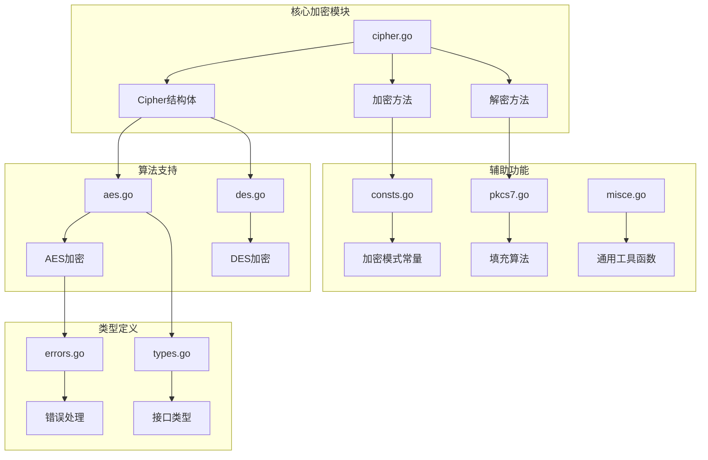
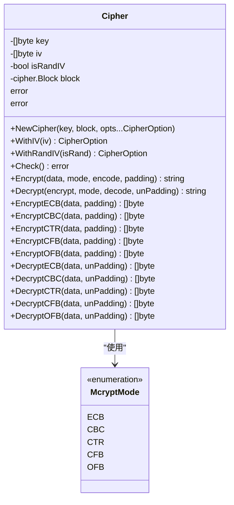
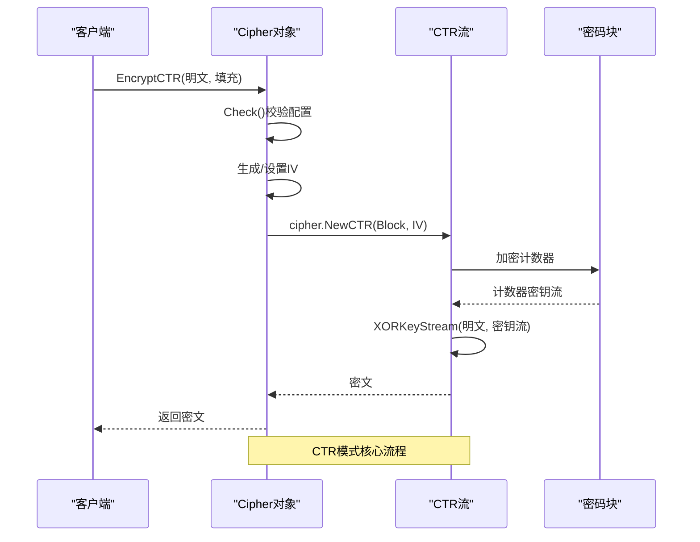
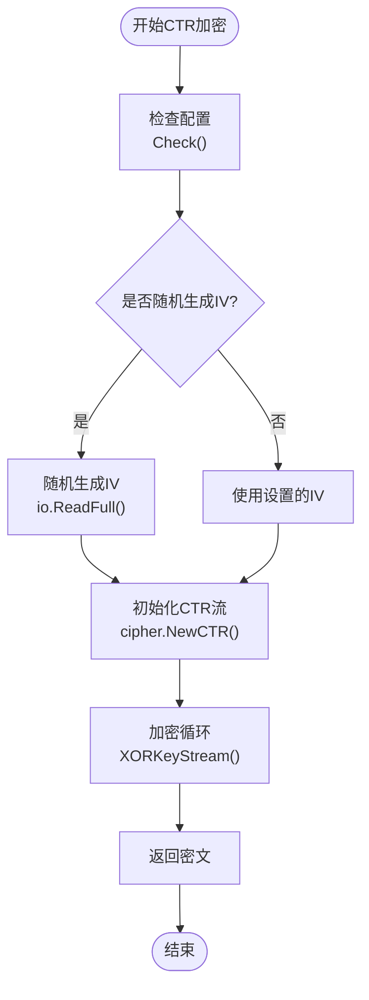
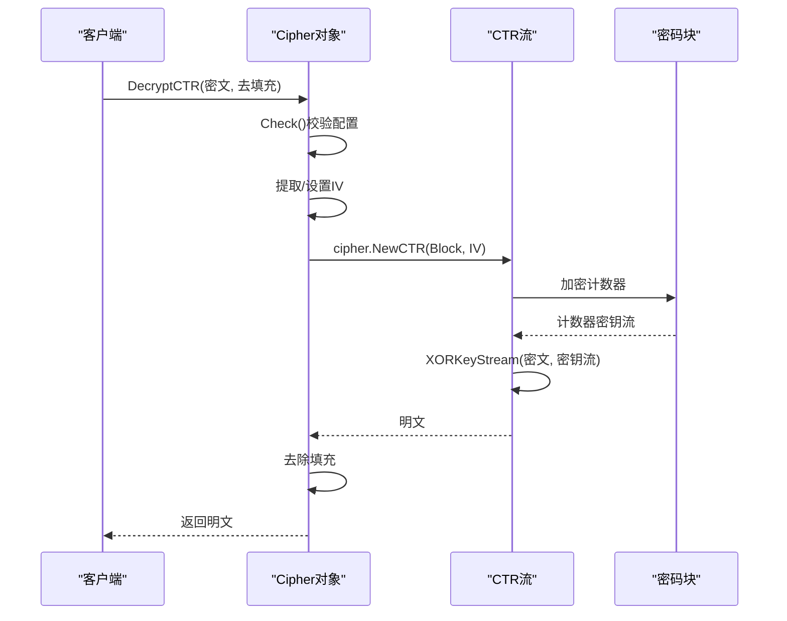
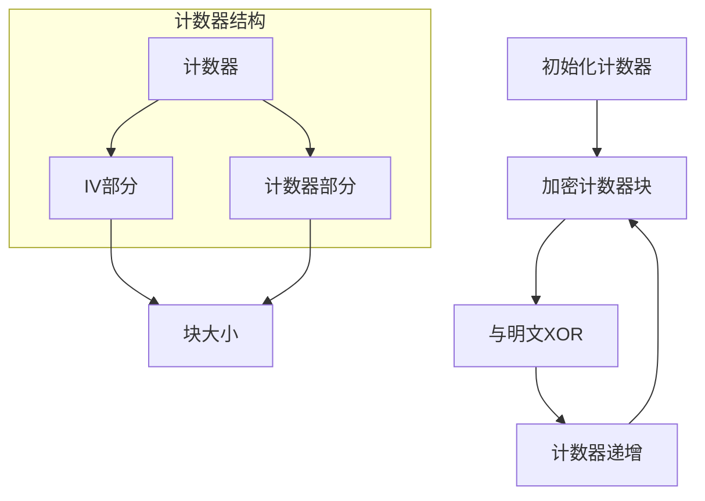
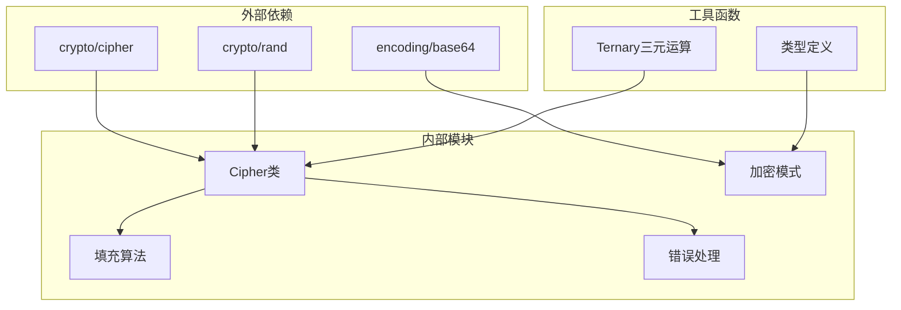
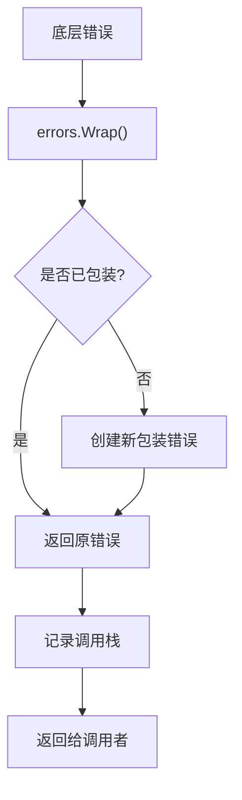

# CTR（计算器模式）

<cite>
**本文档引用的文件**
- [cipher.go](file://cipher.go)
- [aes.go](file://aes.go)
- [consts.go](file://consts.go)
- [types.go](file://types.go)
- [pkcs7.go](file://pkcs7.go)
- [cipher_test.go](file://cipher_test.go)
- [misce.go](file://misce.go)
- [errors.go](file://errors/errors.go)
</cite>

## 目录

1. [简介](#简介)
2. [项目结构](#项目结构)
3. [核心组件](#核心组件)
4. [架构概览](#架构概览)
5. [详细组件分析](#详细组件分析)
6. [依赖关系分析](#依赖关系分析)
7. [性能考虑](#性能考虑)
8. [故障排除指南](#故障排除指南)
9. [结论](#结论)

## 简介

CTR（计算器模式，Counter
Mode）是一种重要的对称加密工作模式，属于流密码模式的一种。它通过使用加密器对递增的计数器进行加密，然后将产生的密钥流与明文进行XOR运算来生成密文。CTR模式具有许多重要特性：它是流密码模式、支持并行加密、不需要填充、支持随机访问等。

本项目提供了完整的CTR模式实现，包括AES和DES算法的支持，以及完善的错误处理机制。本文档将深入解释CTR模式的工作原理、特点、安全性考虑和使用场景。

## 项目结构

该项目采用模块化设计，主要文件组织如下：

**图表来源**

- [cipher.go](file://cipher.go#L1-L50)
- [aes.go](file://aes.go#L1-L23)
- [consts.go](file://consts.go#L1-L23)
- [types.go](file://types.go#L1-L98)

**章节来源**

- [cipher.go](file://cipher.go#L1-L50)
- [aes.go](file://aes.go#L1-L23)
- [consts.go](file://consts.go#L1-L23)

## 核心组件

### Cipher结构体

Cipher是整个加密系统的核心结构体，负责管理密钥、初始化向量（IV）和底层密码块。

**图表来源**

- [cipher.go](file://cipher.go#L20-L25)
- [consts.go](file://consts.go#L4-L10)

### 加密模式枚举

项目支持五种不同的加密模式，其中CTR模式专门用于流密码加密：

| 模式  | 全称     | 特点       | IV需求 |
|-----|--------|----------|------|
| ECB | 电子密码本  | 简单但不安全   | 否    |
| CBC | 密码分组链接 | 需要填充     | 是    |
| CTR | 计算器模式  | 流密码，无需填充 | 是    |
| CFB | 密码反馈   | 流密码      | 是    |
| OFB | 输出反馈   | 流密码      | 是    |

**章节来源**

- [consts.go](file://consts.go#L4-L10)
- [cipher.go](file://cipher.go#L10-L19)

## 架构概览

CTR模式的加密架构基于Go标准库的crypto/cipher包，实现了完整的流密码加密流程：

**图表来源**

- [cipher.go](file://cipher.go#L210-L242)
- [cipher.go](file://cipher.go#L244-L279)

**章节来源**

- [cipher.go](file://cipher.go#L210-L279)

## 详细组件分析

### CTR加密实现

CTR模式的加密过程包含三个关键步骤：

1. **计数器生成**：使用加密器对递增的计数器进行加密
2. **密钥流生成**：每个计数器块产生对应的密钥流
3. **XOR运算**：密钥流与明文进行异或运算得到密文

**图表来源**

- [cipher.go](file://cipher.go#L210-L242)

#### EncryptCTR方法详解

EncryptCTR方法实现了CTR模式的完整加密流程：

1. **配置验证**：调用Check()确保密钥和IV已正确设置
2. **IV处理**：根据isRandIV标志决定是否随机生成IV
3. **流初始化**：使用cipher.NewCTR创建CTR流
4. **数据加密**：通过XORKeyStream方法进行实际加密

**章节来源**

- [cipher.go](file://cipher.go#L210-L242)

### CTR解密实现

CTR模式的解密过程与加密过程完全相同，因为XOR运算具有可逆性：

**图表来源**

- [cipher.go](file://cipher.go#L244-L279)

**章节来源**

- [cipher.go](file://cipher.go#L244-L279)

### 计数器管理机制

CTR模式的核心在于计数器的有效管理：

**图表来源**

- [cipher.go](file://cipher.go#L236-L239)

### 随机IV实现

项目支持两种IV管理模式：

1. **随机IV模式**：每次加密自动生成新的IV，IV值存储在密文开头
2. **固定IV模式**：使用预设的IV值进行加密

**章节来源**

- [cipher.go](file://cipher.go#L227-L233)
- [cipher.go](file://cipher.go#L156-L162)

## 依赖关系分析

### 核心依赖关系

**图表来源**

- [cipher.go](file://cipher.go#L3-L8)
- [misce.go](file://misce.go#L9-L19)

### 错误处理机制

项目采用统一的错误处理策略，所有错误都会被包装并保留调用栈信息：

**图表来源**

- [errors.go](file://errors/errors.go#L24-L44)

**章节来源**

- [cipher.go](file://cipher.go#L36-L38)
- [errors.go](file://errors/errors.go#L24-L44)

## 性能考虑

### CTR模式的优势

1. **并行处理能力**：CTR模式天然支持并行加密，可以充分利用多核处理器
2. **无填充开销**：由于是流密码，不需要进行PKCS7填充
3. **随机访问支持**：可以直接访问任意位置的数据块
4. **硬件加速友好**：现代CPU通常提供AES-NI指令集优化

### 性能对比分析

| 特性   | CTR模式  | CBC模式  | ECB模式  |
|------|--------|--------|--------|
| 并行处理 | ✅ 支持   | ❌ 不支持  | ❌ 不支持  |
| 随机访问 | ✅ 支持   | ❌ 不支持  | ❌ 不支持  |
| 填充需求 | ❌ 无需填充 | ✅ 需要填充 | ❌ 无需填充 |
| 安全性  | ✅ 高    | ✅ 中等   | ❌ 低    |
| 性能   | ✅ 优秀   | ⚠️ 一般  | ⚠️ 一般  |

### 优化建议

1. **批量处理**：对于大量数据，建议使用批量处理减少函数调用开销
2. **内存管理**：合理分配缓冲区大小，避免频繁的内存分配
3. **并发控制**：在多线程环境中注意Cipher对象的线程安全性

## 故障排除指南

### 常见问题及解决方案

#### 1. IV长度错误

**问题**：IV长度与块大小不匹配
**解决方案**：确保IV长度等于密码块大小（AES为16字节，DES为8字节）

#### 2. 密钥长度错误

**问题**：密钥长度不符合要求
**解决方案**：AES密钥必须为16、24或32字节；DES密钥为8字节；3DES为24字节

#### 3. 密文格式错误

**问题**：密文格式不正确导致解密失败
**解决方案**：确保使用相同的编码方式（Base64、Hex等）进行编码和解码

#### 4. 计数器重复使用

**问题**：同一个IV被重复使用
**解决方案**：每次加密都应使用唯一的IV，避免计数器重复

**章节来源**

- [cipher.go](file://cipher.go#L87-L99)
- [cipher.go](file://cipher.go#L43-L58)

### 调试技巧

1. **启用详细日志**：使用errors包提供的跟踪功能查看完整的调用栈
2. **验证数据完整性**：在加密前后检查数据的哈希值
3. **单元测试**：运行现有的测试用例验证功能正确性

**章节来源**

- [cipher_test.go](file://cipher_test.go#L10-L62)

## 结论

CTR（计算器模式）作为一种先进的加密模式，在现代密码学应用中发挥着重要作用。通过本项目的实现，我们可以看到CTR模式在以下方面具有显著优势：

1. **安全性**：相比ECB模式，CTR提供了更好的安全性保证
2. **性能**：支持并行处理和随机访问，适合大数据量加密
3. **灵活性**：无需填充，适应性强
4. **易用性**：API设计简洁，易于集成到各种应用场景

在使用CTR模式时，需要注意以下关键点：

- 确保IV的唯一性和随机性
- 正确处理密文格式和编码
- 在多线程环境中考虑Cipher对象的线程安全性
- 根据具体应用场景选择合适的填充方案

通过遵循这些最佳实践，CTR模式可以为各种加密需求提供高效、安全的解决方案。