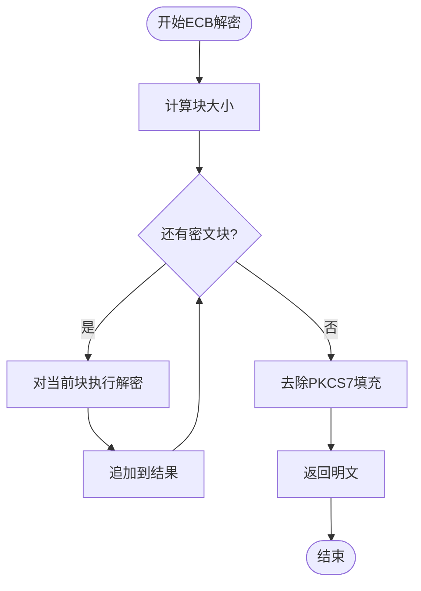

# ECB（电子密码本模式）

<cite>
**本文档引用的文件**
- [cipher.go](file://cipher.go)
- [aes.go](file://aes.go)
- [des.go](file://des.go)
- [pkcs7.go](file://pkcs7.go)
- [types.go](file://types.go)
- [consts.go](file://consts.go)
- [cipher_test.go](file://cipher_test.go)
- [aes_test.go](file://aes_test.go)
- [des_test.go](file://des_test.go)
</cite>

## 目录

1. [简介](#简介)
2. [项目结构](#项目结构)
3. [核心组件](#核心组件)
4. [架构概览](#架构概览)
5. [详细组件分析](#详细组件分析)
6. [依赖关系分析](#依赖关系分析)
7. [性能考虑](#性能考虑)
8. [故障排除指南](#故障排除指南)
9. [结论](#结论)

## 简介

ECB（电子密码本模式，Electronic Codebook
Mode）是AES和DES等分组密码中最简单的加密模式。它将明文数据分割成固定大小的数据块，每个数据块独立进行加密处理。ECB模式具有实现简单、并行处理能力强、不需要初始化向量（IV）等特点，但同时也存在安全性问题，容易受到频率分析攻击。

本项目提供了完整的ECB模式实现，包括AES和DES两种对称加密算法的支持，以及PKCS7填充方案和多种编码方式。

## 项目结构

该项目是一个Go语言工具库，专注于提供各种实用功能，其中加密模块位于核心目录中。ECB模式的实现主要集中在以下文件中：

**图表来源**

- [cipher.go](file://cipher.go#L1-L498)
- [aes.go](file://aes.go#L1-L23)
- [des.go](file://des.go#L1-L45)
- [pkcs7.go](file://pkcs7.go#L1-L31)

**章节来源**

- [cipher.go](file://cipher.go#L1-L498)
- [aes.go](file://aes.go#L1-L23)
- [des.go](file://des.go#L1-L45)
- [pkcs7.go](file://pkcs7.go#L1-L31)

## 核心组件

### Cipher类（核心加密类）

Cipher类是整个加密系统的核心，封装了所有加密操作。它支持多种加密模式，包括ECB、CBC、CTR、CFB和OFB。

**图表来源**

- [cipher.go](file://cipher.go#L20-L58)
- [aes.go](file://aes.go#L8-L22)
- [des.go](file://des.go#L8-L44)
- [pkcs7.go](file://pkcs7.go#L8-L30)

### 加密模式常量

项目定义了五种不同的加密模式，其中ECB模式具有特殊地位：

| 模式  | 常量名 | 特点            | IV需求 |
|-----|-----|---------------|------|
| ECB | ECB | 电码本模式，无须设置IV  | 否    |
| CBC | CBC | 密码分组链接模式，需要填充 | 是    |
| CTR | CTR | 计算器模式         | 是    |
| CFB | CFB | 密码反馈模式        | 是    |
| OFB | OFB | 输出反馈模式        | 是    |

**章节来源**

- [consts.go](file://consts.go#L4-L10)
- [cipher.go](file://cipher.go#L10-L18)

## 架构概览

ECB模式的加密流程遵循分组密码的标准流程：明文分块、填充、独立加密、组合输出。

**图表来源**

- [cipher.go](file://cipher.go#L101-L119)
- [pkcs7.go](file://pkcs7.go#L8-L15)

## 详细组件分析

### ECB加密实现

ECB模式的加密过程相对简单直接，主要包含以下几个步骤：

1. **数据填充**：使用PKCS7填充确保数据长度为块大小的整数倍
2. **块大小计算**：根据使用的密码算法确定块大小（AES为16字节，DES为8字节）
3. **逐块加密**：对每个数据块独立进行加密操作
4. **结果组合**：将所有密文块连接成最终的密文

**图表来源**

- [cipher.go](file://cipher.go#L101-L119)
- [pkcs7.go](file://pkcs7.go#L8-L15)

**章节来源**

- [cipher.go](file://cipher.go#L101-L119)

### ECB解密实现

ECB解密过程与加密过程完全相反，但同样保持简单：

1. **逐块解密**：对每个密文块独立进行解密操作
2. **去除填充**：使用PKCS7去填充算法移除填充数据
3. **结果输出**：返回原始明文

**图表来源**

- [cipher.go](file://cipher.go#L121-L137)
- [pkcs7.go](file://pkcs7.go#L17-L30)

**章节来源**

- [cipher.go](file://cipher.go#L121-L137)

### 填充机制

ECB模式使用PKCS7填充方案，这是最常用的填充标准：

**图表来源**

- [pkcs7.go](file://pkcs7.go#L8-L15)

**章节来源**

- [pkcs7.go](file://pkcs7.go#L8-L30)

### 加密入口函数

项目提供了便捷的加密入口函数，支持AES和DES两种算法：

**图表来源**

- [aes.go](file://aes.go#L12-L22)
- [des.go](file://des.go#L12-L44)
- [cipher.go](file://cipher.go#L32-L58)

**章节来源**

- [aes.go](file://aes.go#L8-L22)
- [des.go](file://des.go#L8-L44)

## 依赖关系分析

ECB模式的实现涉及多个层次的依赖关系：

**图表来源**

- [cipher.go](file://cipher.go#L3-L8)
- [aes.go](file://aes.go#L3-L6)
- [des.go](file://des.go#L3-L6)

**章节来源**

- [cipher.go](file://cipher.go#L1-L498)
- [aes.go](file://aes.go#L1-L23)
- [des.go](file://des.go#L1-L45)

## 性能考虑

### ECB模式的优势

1. **实现简单**：ECB模式是最简单的分组密码模式，代码实现简洁
2. **并行处理能力强**：由于每个数据块独立加密，可以充分利用多核处理器进行并行计算
3. **内存效率高**：不需要维护状态信息，内存占用相对较少
4. **无IV开销**：不需要初始化向量，减少了额外的存储和传输开销

### ECB模式的局限性

1. **安全性问题**：相同明文块总是产生相同密文块，容易受到频率分析攻击
2. **模式泄露**：明文中的模式会在密文中体现出来
3. **完整性验证困难**：ECB模式本身不提供数据完整性保护

### 性能对比

虽然项目中没有提供具体的性能基准测试，但从代码实现可以看出各模式的性能特征：

| 模式  | 加密复杂度 | 解密复杂度 | 并行能力 | 内存开销 |
|-----|-------|-------|------|------|
| ECB | O(n)  | O(n)  | 最强   | 最低   |
| CBC | O(n)  | O(n)  | 弱    | 中等   |
| CTR | O(n)  | O(n)  | 强    | 中等   |
| CFB | O(n)  | O(n)  | 弱    | 中等   |
| OFB | O(n)  | O(n)  | 弱    | 中等   |

**章节来源**

- [cipher.go](file://cipher.go#L101-L137)

## 故障排除指南

### 常见错误及解决方案

1. **密钥长度错误**
    - **错误信息**：密钥长度必须是16、24或32字节（AES）或8字节（DES）
    - **解决方案**：确保使用正确的密钥长度

2. **填充问题**
    - **错误信息**：去填充时数据长度异常
    - **解决方案**：检查填充算法的一致性和数据完整性

3. **数据长度问题**
    - **错误信息**：密文长度不是块大小的倍数
    - **解决方案**：确保数据经过适当的填充处理

### 调试技巧

1. **验证加密流程**：通过测试用例验证ECB模式的正确性
2. **检查数据完整性**：确保明文和密文的长度关系正确
3. **验证填充效果**：确认填充和去填充过程的正确性

**章节来源**

- [cipher.go](file://cipher.go#L43-L58)
- [cipher.go](file://cipher.go#L68-L84)
- [cipher.go](file://cipher.go#L121-L137)

## 结论

ECB（电子密码本模式）作为最简单的分组密码模式，在特定场景下具有独特的优势。其简单实现、强大的并行处理能力和无IV需求的特点使其适用于加密大量相同格式的数据，如固定长度的标识符。

然而，ECB模式的安全性问题不容忽视。由于相同明文块产生相同密文块，这种模式容易受到频率分析攻击，不适合保护敏感数据。因此，在选择加密模式时，应该根据具体的安全需求和应用场景来决定。

项目提供的ECB模式实现具有良好的代码结构和完善的测试覆盖，为开发者提供了可靠的加密工具。通过合理使用PKCS7填充和适当的密钥管理，可以在保证安全性的前提下充分利用ECB模式的优势。

对于需要更高安全性的应用场景，建议考虑使用CBC、CTR或其他更安全的加密模式。只有在明确了解ECB模式局限性的情况下，才应该在项目中使用这种加密模式。