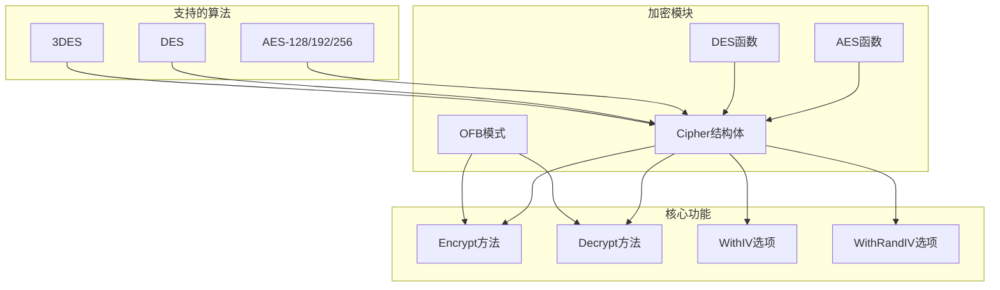
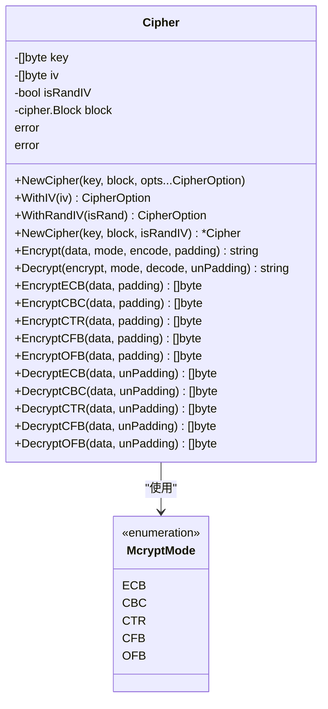
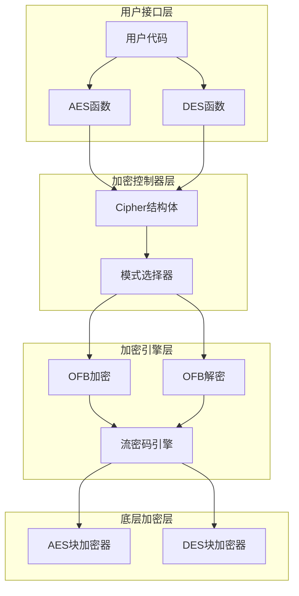
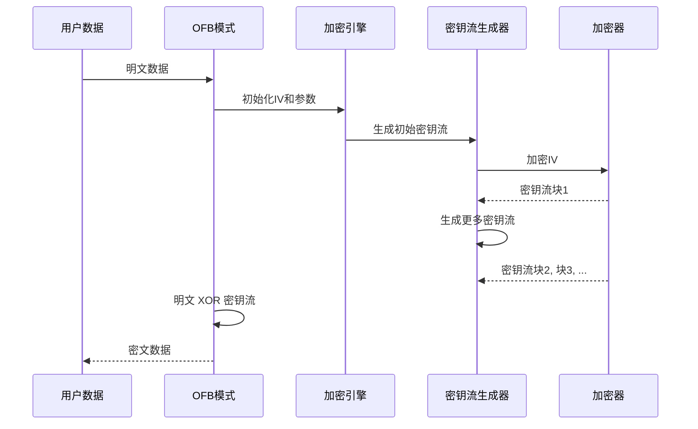
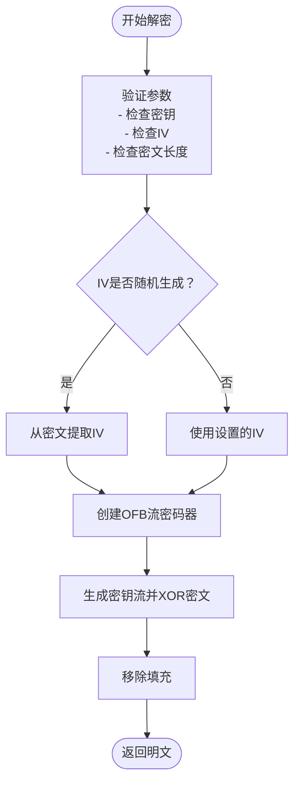
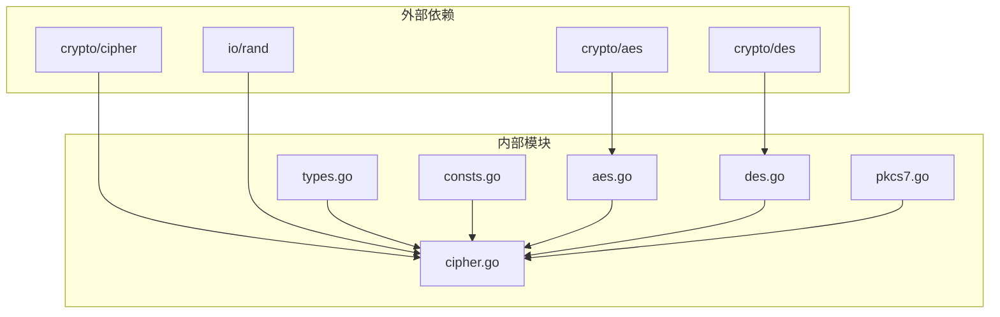
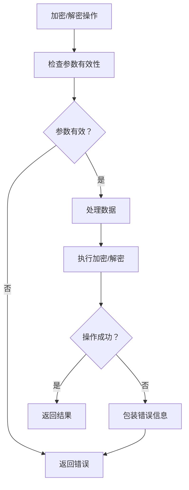

# OFB（输出反馈模式）

<cite>
**本文档引用的文件**
- [cipher.go](file://cipher.go)
- [consts.go](file://consts.go)
- [types.go](file://types.go)
- [aes.go](file://aes.go)
- [des.go](file://des.go)
- [cipher_test.go](file://cipher_test.go)
- [aes_test.go](file://aes_test.go)
- [des_test.go](file://des_test.go)
- [pkcs7.go](file://pkcs7.go)
</cite>

## 目录

1. [简介](#简介)
2. [项目结构](#项目结构)
3. [核心组件](#核心组件)
4. [架构概览](#架构概览)
5. [详细组件分析](#详细组件分析)
6. [依赖关系分析](#依赖关系分析)
7. [性能考虑](#性能考虑)
8. [故障排除指南](#故障排除指南)
9. [结论](#结论)

## 简介

OFB（Output
Feedback，输出反馈）模式是一种流密码加密模式，它通过将加密器应用于初始化向量（IV）来产生密钥流，然后将密钥流与明文进行XOR运算得到密文。与传统的分组密码模式不同，OFB模式不直接参与反馈循环，这使得它具有独特的特性和应用场景。

在Go工具库中，OFB模式作为多种对称加密算法（AES、DES、3DES）的加密模式之一被实现，提供了简单易用的API接口，支持随机IV生成和各种编码方式。

## 项目结构

该项目是一个通用的Go语言工具库，包含了多种实用功能，其中加密模块位于cipher.go文件中，支持多种加密算法和模式：

**图表来源**

- [cipher.go](file://cipher.go#L20-L25)
- [aes.go](file://aes.go#L12-L22)
- [des.go](file://des.go#L12-L27)

**章节来源**

- [cipher.go](file://cipher.go#L1-L50)
- [consts.go](file://consts.go#L4-L10)

## 核心组件

### Cipher结构体

Cipher是加密模块的核心结构体，负责管理密钥、初始化向量和底层加密块：

**图表来源**

- [cipher.go](file://cipher.go#L20-L25)
- [consts.go](file://consts.go#L4-L10)

### 加密模式常量

项目定义了五种主要的加密模式，其中OFB模式是其中之一：

| 模式  | 常量  | 描述     | IV需求 | 填充需求     |
|-----|-----|--------|------|----------|
| ECB | ECB | 电码本模式  | 否    | 是（PKCS7） |
| CBC | CBC | 密码分组链接 | 是    | 是（PKCS7） |
| CTR | CTR | 计数器模式  | 是    | 否        |
| CFB | CFB | 密码反馈   | 是    | 否        |
| OFB | OFB | 输出反馈   | 是    | 否        |

**章节来源**

- [consts.go](file://consts.go#L4-L10)
- [cipher.go](file://cipher.go#L10-L19)

## 架构概览

OFB模式在整体加密架构中的位置如下：

**图表来源**

- [cipher.go](file://cipher.go#L423-L497)
- [aes.go](file://aes.go#L12-L22)
- [des.go](file://des.go#L12-L27)

## 详细组件分析

### OFB模式工作原理

OFB模式的核心特性是其流密码性质，它通过以下步骤工作：

1. **密钥流生成**：使用加密器对初始化向量（IV）进行连续加密
2. **密钥流扩展**：将生成的密钥流继续输入到加密器中，产生更多密钥流
3. **明文异或**：将密钥流与明文进行XOR运算得到密文
4. **无需反馈**：密文不参与后续的密钥流生成过程

**图表来源**

- [cipher.go](file://cipher.go#L352-L384)
- [cipher.go](file://cipher.go#L386-L421)

### OFB模式实现细节

#### 加密流程

OFB模式的加密实现遵循以下步骤：

1. **参数验证**：检查密钥和IV的有效性
2. **IV处理**：支持固定IV或随机IV生成
3. **密钥流生成**：使用cipher.NewOFB创建流密码器
4. **数据处理**：对填充后的数据应用XOR密钥流
5. **结果输出**：返回最终的密文

#### 解密流程

OFB模式的解密流程与加密完全相同，因为XOR操作是可逆的：

**图表来源**

- [cipher.go](file://cipher.go#L352-L384)
- [cipher.go](file://cipher.go#L386-L421)

**章节来源**

- [cipher.go](file://cipher.go#L352-L421)

### 与其他模式的对比分析

#### OFB vs CFB模式

| 特性        | OFB模式    | CFB模式  |
|-----------|----------|--------|
| **反馈机制**  | 无反馈循环    | 有反馈循环  |
| **容错性**   | 单位错误不传播  | 错误会传播  |
| **并行处理**  | 支持并行     | 支持并行   |
| **填充需求**  | 不需要填充    | 不需要填充  |
| **实现复杂度** | 简单       | 相对复杂   |
| **安全性**   | 较弱       | 较强     |
| **适用场景**  | 流媒体、语音通信 | 一般数据传输 |

#### OFB vs CTR模式

| 特性        | OFB模式  | CTR模式  |
|-----------|--------|--------|
| **计数器使用** | 不使用计数器 | 使用计数器  |
| **随机访问**  | 不支持    | 支持随机访问 |
| **并行处理**  | 支持     | 支持     |
| **安全性**   | 较弱     | 更强     |
| **实现复杂度** | 简单     | 中等     |
| **应用场景**  | 实时通信   | 通用数据保护 |

**章节来源**

- [cipher.go](file://cipher.go#L10-L19)

### 使用场景和最佳实践

#### 适合OFB模式的应用场景

1. **实时音频/视频流**：OFB模式的容错性使其非常适合流媒体传输
2. **网络协议加密**：在网络通信中提供透明的加密
3. **硬件加密设备**：简单的硬件实现需求
4. **嵌入式系统**：资源受限环境下的加密需求

#### 不适合OFB模式的应用场景

1. **高安全要求的数据**：如金融交易、敏感文档
2. **需要随机访问的数据**：CTR模式更适合
3. **需要抗重放攻击的场景**：OFB模式缺乏完整性保护

**章节来源**

- [cipher.go](file://cipher.go#L10-L19)

## 依赖关系分析

### 核心依赖关系

**图表来源**

- [cipher.go](file://cipher.go#L3-L8)
- [aes.go](file://aes.go#L3-L6)
- [des.go](file://des.go#L3-L6)

### 错误处理和依赖

项目使用统一的错误处理机制，所有加密操作都会返回包装后的错误信息：

**图表来源**

- [cipher.go](file://cipher.go#L354-L357)
- [cipher.go](file://cipher.go#L389-L391)

**章节来源**

- [cipher.go](file://cipher.go#L3-L8)

## 性能考虑

### OFB模式的性能特点

1. **计算效率**：OFB模式的计算开销相对较低，适合实时应用
2. **内存使用**：不需要额外的缓冲区，内存占用较少
3. **并行处理**：支持多线程并行处理，提高吞吐量
4. **缓存友好**：顺序访问模式有利于CPU缓存

### 性能优化建议

1. **批量处理**：对于大量数据，建议批量处理以减少函数调用开销
2. **内存预分配**：预先分配足够大的缓冲区，避免频繁的内存分配
3. **并行化**：利用OFB模式的并行特性，使用多个goroutine处理数据
4. **IV复用**：在同一批次内复用IV，避免重复的IV生成开销

## 故障排除指南

### 常见问题和解决方案

#### IV相关问题

| 问题     | 可能原因        | 解决方案                           |
|--------|-------------|--------------------------------|
| IV长度错误 | IV长度不符合算法要求 | 确保IV长度为16字节（AES）或8字节（DES/3DES） |
| IV重复使用 | 同一密钥下重复使用IV | 使用随机IV或确保IV的唯一性                |
| IV丢失   | IV未正确传递     | 在随机IV模式下，确保IV随密文一起传输           |

#### 数据完整性问题

| 问题     | 可能原因          | 解决方案           |
|--------|---------------|----------------|
| 数据损坏检测 | OFB模式不提供完整性保护 | 结合消息认证码（MAC）使用 |
| 错误传播   | CFB模式下的错误传播   | 选择OFB模式或使用其他模式 |
| 填充问题   | PKCS7填充错误     | 确保填充和去填充的一致性   |

#### 性能问题

| 问题      | 可能原因   | 解决方案          |
|---------|--------|---------------|
| 处理速度慢   | 单线程处理  | 实现并行处理或多线程优化  |
| 内存不足    | 大数据集处理 | 使用流式处理或分块处理   |
| CPU使用率高 | 低效的实现  | 优化算法实现或使用硬件加速 |

**章节来源**

- [cipher.go](file://cipher.go#L87-L99)
- [cipher.go](file://cipher.go#L354-L357)

## 结论

OFB（输出反馈）模式作为一种流密码加密模式，在现代加密体系中具有独特的地位和价值。它通过简单的设计实现了高效的加密功能，特别适合对实时性要求较高但安全性要求相对较低的应用场景。

### 主要优势

1. **实现简单**：OFB模式的算法实现相对简单，易于理解和维护
2. **容错性强**：单个位错误不会在整个数据流中传播
3. **并行处理**：支持多线程并行处理，提高性能
4. **无需填充**：简化了数据处理流程
5. **实时适用**：非常适合流媒体和实时通信应用

### 局限性

1. **安全性较弱**：相比现代加密模式，OFB模式的安全性相对较弱
2. **无完整性保护**：不提供数据完整性和认证功能
3. **重放攻击风险**：缺乏内置的防重放机制
4. **密钥管理要求**：需要安全的IV管理和密钥轮换策略

### 现代替代方案

随着密码学的发展，OFB模式正在被更安全的模式所替代：

1. **GCM模式**：提供机密性和完整性保护
2. **CCM模式**：结合认证和加密功能
3. **ChaCha20-Poly1305**：现代流密码算法
4. **Salsa20**：高性能流密码算法

### 最佳实践建议

1. **评估安全需求**：根据具体应用场景评估安全需求
2. **考虑替代方案**：优先考虑更安全的现代加密模式
3. **实施完整性保护**：即使使用OFB模式，也要添加独立的完整性保护
4. **定期更新**：定期评估和更新加密方案
5. **专业咨询**：在关键应用中寻求密码学专家的建议

OFB模式虽然在现代加密中不再是首选方案，但其简单性和实用性使其在特定场景中仍然具有重要价值。理解其工作原理和局限性，有助于开发者做出明智的技术选择。