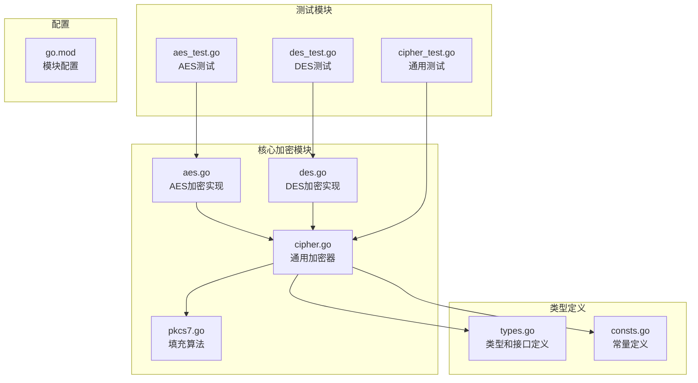
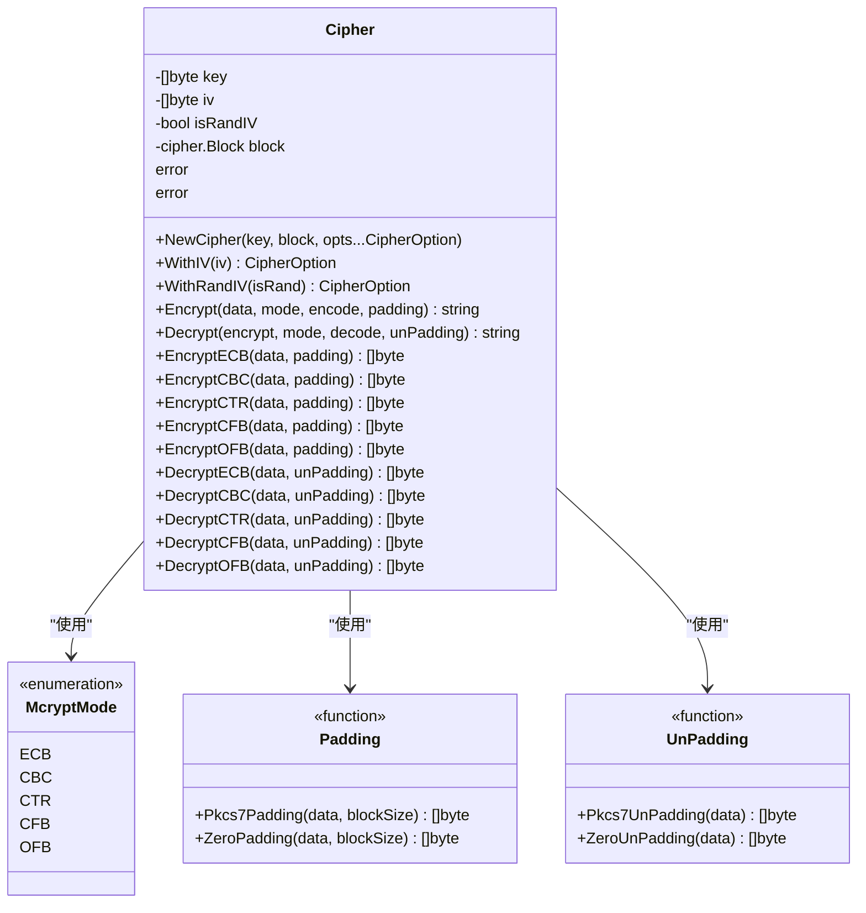
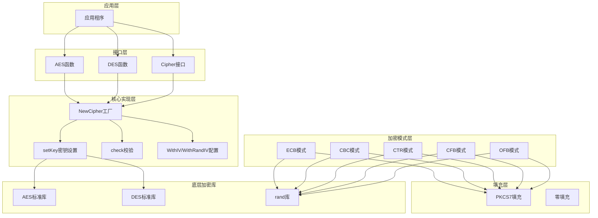
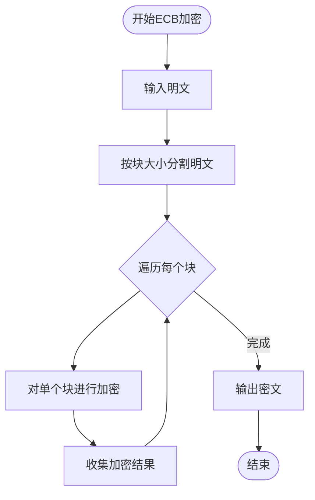
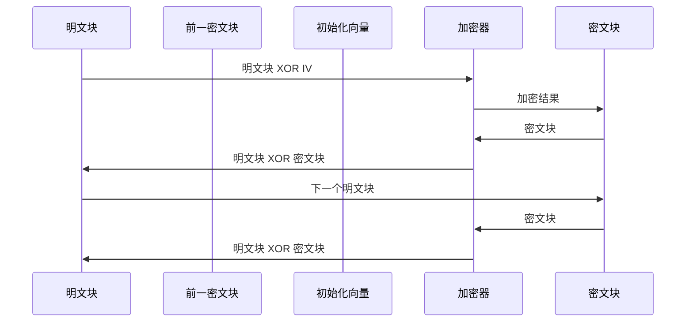
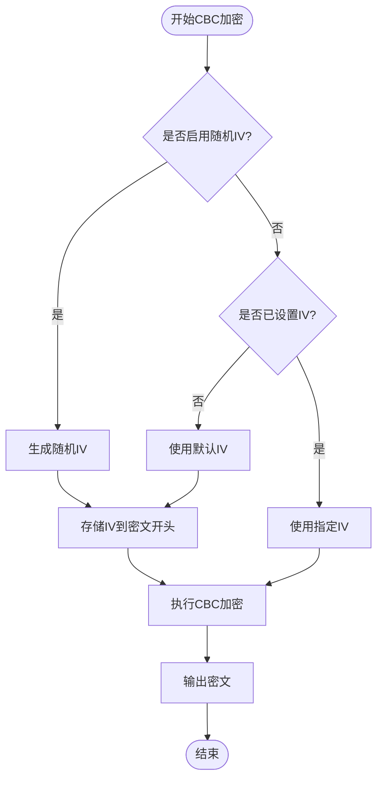
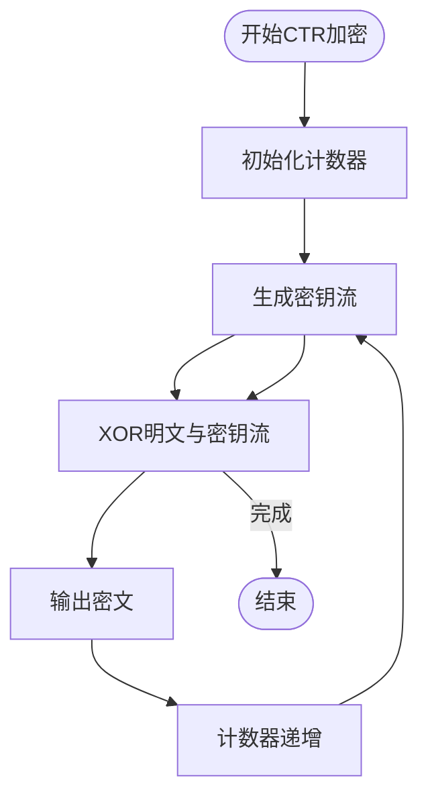
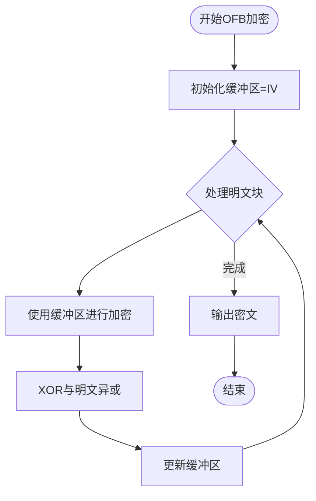
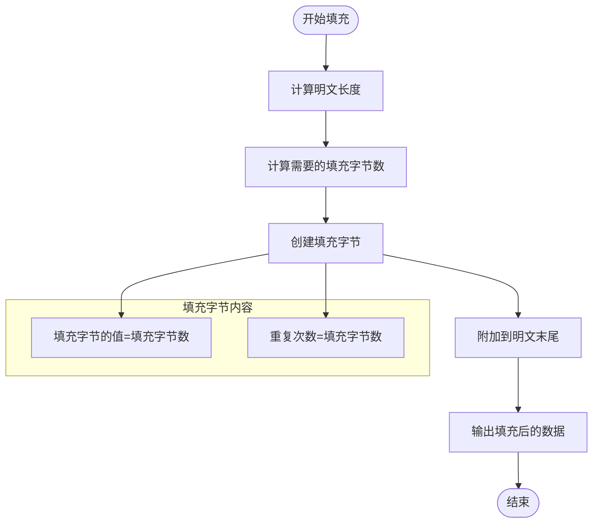
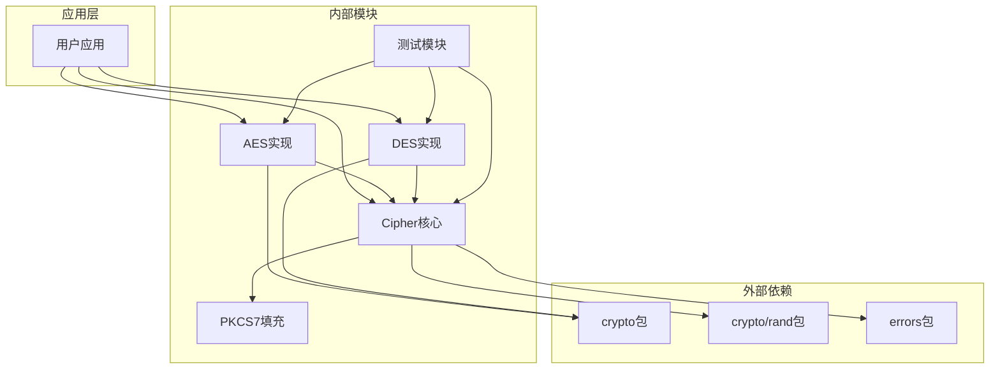

# 加密模式详解

<cite>
**本文档引用的文件**
- [aes.go](file://aes.go)
- [cipher.go](file://cipher.go)
- [des.go](file://des.go)
- [pkcs7.go](file://pkcs7.go)
- [cipher_test.go](file://cipher_test.go)
- [aes_test.go](file://aes_test.go)
- [des_test.go](file://des_test.go)
- [types.go](file://types.go)
- [consts.go](file://consts.go)
- [go.mod](file://go.mod)
</cite>

## 目录

1. [简介](#简介)
2. [项目结构](#项目结构)
3. [核心组件](#核心组件)
4. [架构概览](#架构概览)
5. [详细组件分析](#详细组件分析)
6. [依赖关系分析](#依赖关系分析)
7. [性能考虑](#性能考虑)
8. [故障排除指南](#故障排除指南)
9. [结论](#结论)

## 简介

本项目提供了Go语言版本的对称加密工具库，支持多种加密模式，包括AES和DES两种分组密码算法。该库实现了五种主要的加密模式：ECB（电子密码本模式）、CBC（密码分组链接模式）、CTR（计算器模式）、CFB（密码反馈模式）和OFB（输出反馈模式）。每个模式都有其独特的特点、适用场景和安全考虑。

该项目特别注重实用性，提供了完整的加密和解密功能，包括自动填充处理、初始化向量（IV）管理以及随机IV生成功能。所有实现都基于Go标准库的加密包，确保了安全性和可靠性。

## 项目结构

项目采用模块化的文件组织方式，每个核心功能都有专门的文件负责：

**图表来源**

- [aes.go](file://aes.go#L1-L23)
- [cipher.go](file://cipher.go#L1-L498)
- [des.go](file://des.go#L1-L45)
- [pkcs7.go](file://pkcs7.go#L1-L31)

**章节来源**

- [go.mod](file://go.mod#L1-L4)
- [aes.go](file://aes.go#L1-L23)
- [cipher.go](file://cipher.go#L1-L498)
- [des.go](file://des.go#L1-L45)

## 核心组件

### Cipher结构体

Cipher是整个加密系统的核心结构体，负责管理密钥、初始化向量和具体的加密算法实现：

**图表来源**

- [cipher.go](file://cipher.go#L20-L25)
- [types.go](file://types.go#L46-L74)

### 加密算法支持

项目支持两种主要的对称加密算法：

| 算法  | 分组大小       | 密钥长度         | 特点         |
|-----|------------|--------------|------------|
| AES | 128位（16字节） | 128/192/256位 | 现代标准，安全性高  |
| DES | 64位（8字节）   | 56位有效密钥      | 传统算法，安全性较低 |

**章节来源**

- [cipher.go](file://cipher.go#L10-L19)
- [aes.go](file://aes.go#L1-L23)
- [des.go](file://des.go#L1-L45)

## 架构概览

整个加密系统采用分层架构设计，从底层的加密算法到高层的应用接口：

**图表来源**

- [cipher.go](file://cipher.go#L28-L40)
- [aes.go](file://aes.go#L12-L22)
- [des.go](file://des.go#L12-L27)

## 详细组件分析

### ECB（电子密码本模式）

ECB是最简单的加密模式，它将明文分成固定大小的块，然后独立地对每个块进行加密。

#### 工作原理

ECB模式的特点是相同的明文字节在加密后会产生相同的密文字节，这使得模式识别成为可能。

**图表来源**

- [cipher.go](file://cipher.go#L102-L119)

#### 优缺点分析

**优点：**

- 实现简单，性能优异
- 支持并行处理
- 不需要初始化向量

**缺点：**

- 明文中的重复模式会在密文中暴露
- 安全性较低，容易受到统计分析攻击
- 不适合加密大量数据

#### 适用场景

- 图像加密（像素级处理）
- 短文本加密
- 不敏感数据的快速加密

**章节来源**

- [cipher.go](file://cipher.go#L101-L137)

### CBC（密码分组链接模式）

CBC模式通过将明文块与前一个密文块进行异或操作来增加安全性。

#### 工作原理

CBC模式引入了初始化向量（IV）的概念，使得相同的明文块会产生不同的密文块。

**图表来源**

- [cipher.go](file://cipher.go#L139-L171)

#### 初始化向量（IV）的重要性

IV是CBC模式安全性的关键因素：

1. **随机性要求**：IV必须是不可预测的随机值
2. **唯一性**：每个加密操作应使用唯一的IV
3. **公开性**：IV不需要保密，可以与密文一起传输
4. **长度匹配**：IV长度必须等于分组大小

#### 随机IV实现机制

项目提供了两种IV管理方式：

**图表来源**

- [cipher.go](file://cipher.go#L155-L162)

#### 优缺点分析

**优点：**

- 消除了明文模式泄露
- 更高的安全性
- 支持随机访问

**缺点：**

- 需要填充处理
- 无法并行处理
- 需要IV管理

#### 适用场景

- 文件加密
- 数据库字段加密
- 通信协议加密

**章节来源**

- [cipher.go](file://cipher.go#L139-L208)

### CTR（计算器模式）

CTR模式将分组密码转换为流密码，通过递增计数器产生密钥流。

#### 工作原理

CTR模式的核心思想是使用计数器作为输入，对每个计数器值进行加密产生密钥流。

**图表来源**

- [cipher.go](file://cipher.go#L210-L242)

#### 优缺点分析

**优点：**

- 完全可并行化
- 支持随机访问
- 无需填充
- 无错误传播

**缺点：**

- 计数器管理复杂
- 需要唯一性保证
- 不提供完整性保护

#### 适用场景

- 大文件加密
- 流媒体加密
- 随机访问数据

**章节来源**

- [cipher.go](file://cipher.go#L210-L279)

### CFB（密码反馈模式）

CFB模式将分组密码转换为自同步流密码，具有反馈机制。

#### 工作原理

CFB模式使用前一个密文块作为输入，产生新的密钥流。

**图表来源**

- [cipher.go](file://cipher.go#L281-L313)

#### 优缺点分析

**优点：**

- 支持任意长度的明文
- 自同步特性
- 无需填充

**缺点：**

- 错误传播
- 无法并行处理
- 需要IV管理

#### 适用场景

- 实时数据流
- 通信协议
- 嵌入式系统

**章节来源**

- [cipher.go](file://cipher.go#L281-L350)

### OFB（输出反馈模式）

OFB模式与CFB类似，但使用加密器的输出作为密钥流。

#### 工作原理

OFB模式完全独立于明文，只依赖于密钥和IV。

**图表来源**

- [cipher.go](file://cipher.go#L352-L384)

#### 优缺点分析

**优点：**

- 无错误传播
- 简单的实现
- 支持任意长度

**缺点：**

- 无错误检测
- 无法并行处理
- 需要IV管理

#### 适用场景

- 语音加密
- 实时音频
- 低延迟应用

**章节来源**

- [cipher.go](file://cipher.go#L352-L421)

### 填充算法

项目实现了PKCS7填充算法，这是最常用的填充方案：

**图表来源**

- [pkcs7.go](file://pkcs7.go#L9-L15)

**章节来源**

- [pkcs7.go](file://pkcs7.go#L1-L31)

## 依赖关系分析

项目采用了清晰的依赖层次结构：

**图表来源**

- [aes.go](file://aes.go#L3-L6)
- [cipher.go](file://cipher.go#L3-L8)
- [des.go](file://des.go#L3-L6)

### 关键依赖关系

1. **加密算法依赖**：所有加密模式都依赖于Go标准库的加密算法
2. **随机数依赖**：CBC、CTR、CFB、OFB模式都依赖随机数生成
3. **错误处理依赖**：统一的错误处理机制
4. **测试覆盖**：完整的单元测试确保各模式的正确性

**章节来源**

- [cipher.go](file://cipher.go#L1-L498)
- [aes.go](file://aes.go#L1-L23)
- [des.go](file://des.go#L1-L45)

## 性能考虑

### 各模式性能对比

| 模式  | 并行性 | 内存使用 | CPU开销 | 安全性 |
|-----|-----|------|-------|-----|
| ECB | 高   | 低    | 低     | 低   |
| CBC | 低   | 中等   | 中等    | 中等  |
| CTR | 高   | 低    | 中等    | 中等  |
| CFB | 低   | 中等   | 中等    | 中等  |
| OFB | 低   | 中等   | 中等    | 中等  |

### 性能优化建议

1. **大文件处理**：优先选择CTR模式，支持完全并行化
2. **实时应用**：选择CFB或OFB模式，支持流式处理
3. **内存受限**：选择ECB模式，内存开销最小
4. **安全性优先**：选择CBC模式，提供最佳安全性

### 内存管理

项目在设计时考虑了内存效率：

- **流式处理**：支持大数据的分块处理
- **零拷贝优化**：尽量减少不必要的数据复制
- **缓冲区复用**：重用内部缓冲区避免频繁分配

## 故障排除指南

### 常见问题及解决方案

#### 1. 密钥长度错误

**问题**：密钥长度不符合要求
**解决方案**：检查密钥长度是否为16、24或32字节（AES）或8字节（DES）

#### 2. IV长度错误

**问题**：IV长度不匹配分组大小
**解决方案**：确保AES使用16字节IV，DES使用8字节IV

#### 3. 填充错误

**问题**：解密后数据损坏
**解决方案**：确认使用相同的填充算法进行解密

#### 4. 随机IV问题

**问题**：使用随机IV时解密失败
**解决方案**：确保随机IV随密文一起传输

**章节来源**

- [cipher.go](file://cipher.go#L68-L84)
- [cipher.go](file://cipher.go#L86-L99)

### 调试技巧

1. **日志记录**：启用详细的日志输出
2. **单元测试**：运行现有的测试套件
3. **边界测试**：测试各种输入边界情况
4. **性能测试**：评估不同模式的性能表现

## 结论

本项目提供了一个完整、安全且高效的加密工具库，支持五种主要的加密模式。每种模式都有其独特的优势和适用场景：

- **ECB模式**：适用于简单场景和图像处理
- **CBC模式**：提供平衡的安全性和性能
- **CTR模式**：最适合大文件和高性能场景
- **CFB/OFB模式**：适合流式数据处理

项目的设计充分考虑了实用性，提供了完善的错误处理、测试覆盖和文档支持。开发者可以根据具体需求选择合适的加密模式，同时注意各模式的安全特性和性能影响。

通过合理选择加密模式和正确的实现方式，可以构建既安全又高效的加密解决方案。