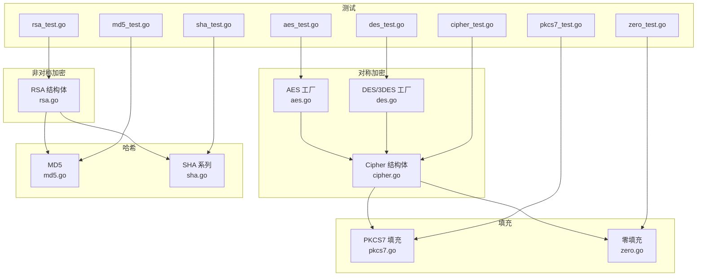
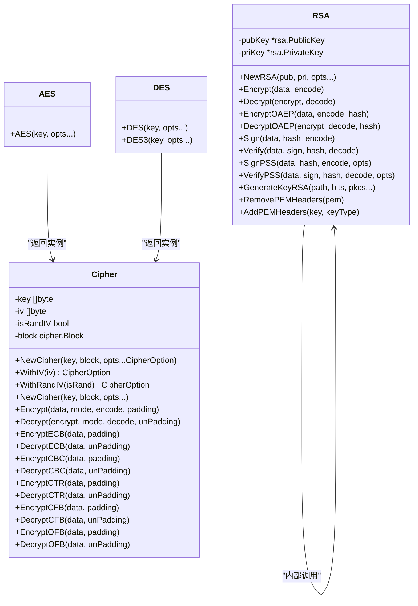
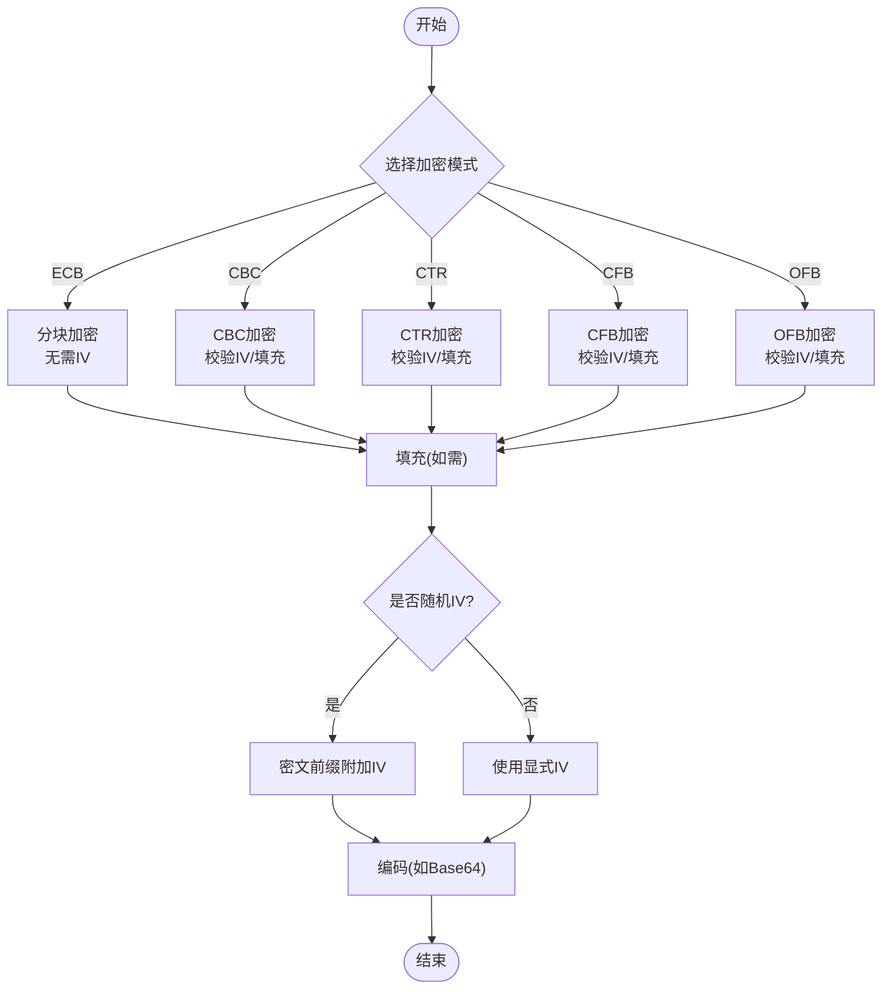
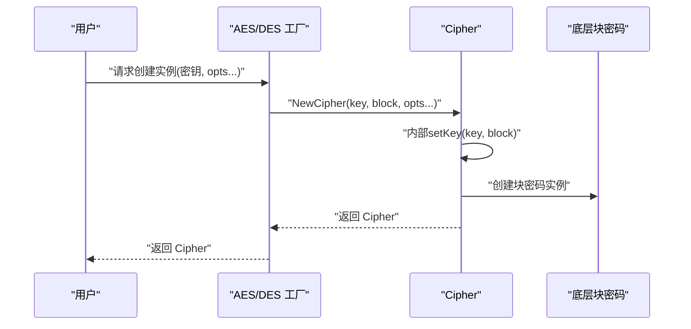
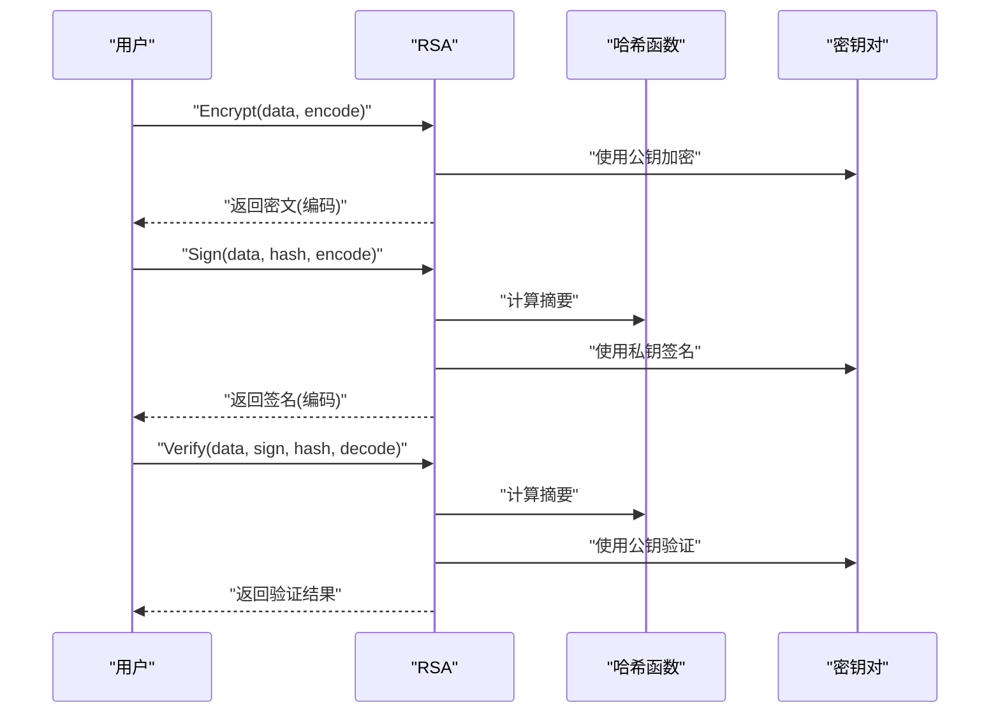
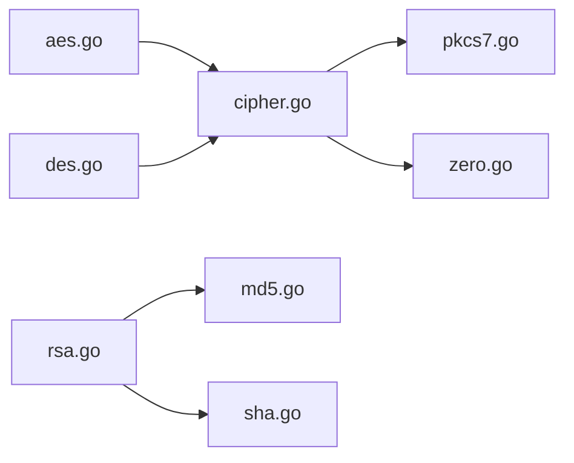

# 加密解密模块

<cite>
**本文引用的文件**
- [cipher.go](file://cipher.go)
- [aes.go](file://aes.go)
- [des.go](file://des.go)
- [rsa.go](file://rsa.go)
- [md5.go](file://md5.go)
- [sha.go](file://sha.go)
- [pkcs7.go](file://pkcs7.go)
- [zero.go](file://zero.go)
- [cipher_test.go](file://cipher_test.go)
- [aes_test.go](file://aes_test.go)
- [des_test.go](file://des_test.go)
- [rsa_test.go](file://rsa_test.go)
- [md5_test.go](file://md5_test.go)
- [sha_test.go](file://sha_test.go)
- [pkcs7_test.go](file://pkcs7_test.go)
- [zero_test.go](file://zero_test.go)
</cite>

## 目录

1. [简介](#简介)
2. [项目结构](#项目结构)
3. [核心组件](#核心组件)
4. [架构总览](#架构总览)
5. [详细组件分析](#详细组件分析)
6. [依赖关系分析](#依赖关系分析)
7. [性能考量](#性能考量)
8. [故障排查指南](#故障排查指南)
9. [结论](#结论)
10. [附录](#附录)

## 简介

本加密解密模块提供了对称加密（AES、DES、3DES）、非对称加密（RSA）、哈希（MD5、SHA
系列）以及填充（PKCS7、零填充）的完整实现与使用示例。模块以统一接口封装了多种加密模式（ECB、CBC、CTR、CFB、OFB），并支持可选的随机初始化向量（IV）策略，便于在不同安全需求与性能场景下灵活选择。

## 项目结构

- 对称加密核心：cipher.go 定义通用 Cipher 结构体与各加密模式方法
- 算法工厂：aes.go、des.go 提供 AES/DES/3DES 快捷构造
- 非对称加密：rsa.go 提供 RSA 加密、解密、签名、验签、密钥生成与 PEM 工具
- 哈希算法：md5.go、sha.go 提供 MD5、SHA1、SHA256、SHA512
- 填充工具：pkcs7.go、zero.go 提供 PKCS7 与零填充
- 测试用例：cipher_test.go、aes_test.go、des_test.go、rsa_test.go、md5_test.go、sha_test.go、pkcs7_test.go、zero_test.go
  展示典型用法与行为验证

**图表来源**

- [cipher.go](file://cipher.go#L20-L25)
- [aes.go](file://aes.go#L12-L22)
- [des.go](file://des.go#L12-L44)
- [rsa.go](file://rsa.go#L18-L21)
- [md5.go](file://md5.go#L8-L12)
- [sha.go](file://sha.go#L10-L26)
- [pkcs7.go](file://pkcs7.go#L8-L30)
- [zero.go](file://zero.go#L8-L28)
- [cipher_test.go](file://cipher_test.go#L10-L61)
- [aes_test.go](file://aes_test.go#L10-L147)
- [des_test.go](file://des_test.go#L10-L81)
- [rsa_test.go](file://rsa_test.go#L56-L270)
- [md5_test.go](file://md5_test.go#L8-L27)
- [sha_test.go](file://sha_test.go#L8-L69)
- [pkcs7_test.go](file://pkcs7_test.go#L9-L64)
- [zero_test.go](file://zero_test.go#L9-L64)

**章节来源**

- [cipher.go](file://cipher.go#L1-L498)
- [aes.go](file://aes.go#L1-L23)
- [des.go](file://des.go#L1-L45)
- [rsa.go](file://rsa.go#L1-L527)
- [md5.go](file://md5.go#L1-L13)
- [sha.go](file://sha.go#L1-L27)
- [pkcs7.go](file://pkcs7.go#L1-L31)
- [zero.go](file://zero.go#L1-L29)

## 核心组件

- Cipher 结构体：封装密钥、IV、块大小、随机 IV 策略与底层块密码实现，提供统一的加密/解密入口与各模式方法
- AES/DES/3DES 工厂：负责密钥长度校验与 Cipher 实例化
- RSA 结构体：封装公钥/私钥，提供加密、解密、签名、验签、OAEP 加解密、密钥生成与 PEM 工具
- 哈希函数：MD5、SHA1、SHA256、SHA512
- 填充函数：PKCS7、零填充及其去填充

**章节来源**

- [cipher.go](file://cipher.go#L20-L58)
- [aes.go](file://aes.go#L12-L22)
- [des.go](file://des.go#L12-L44)
- [rsa.go](file://rsa.go#L18-L21)
- [md5.go](file://md5.go#L8-L12)
- [sha.go](file://sha.go#L10-L26)
- [pkcs7.go](file://pkcs7.go#L8-L30)
- [zero.go](file://zero.go#L8-L28)

## 架构总览

模块采用“工厂 + 组合”的设计：上层通过 AES/DES/3DES 工厂快速获得 Cipher 实例，Cipher 再组合底层 crypto/cipher
块密码实现，统一暴露加密模式方法；RSA 单独封装非对称能力；哈希与填充作为辅助工具被 Cipher 与 RSA 复用。

**图表来源**

- [cipher.go](file://cipher.go#L20-L497)
- [aes.go](file://aes.go#L12-L22)
- [des.go](file://des.go#L12-L44)
- [rsa.go](file://rsa.go#L18-L527)

## 详细组件分析

### Cipher 结构体与对称加密模式

- 设计要点
    - 密钥与 IV 长度由底层块密码决定（AES 16/24/32 字节，DES/3DES 8/24 字节；IV 长度等于块大小）
    - 支持随机 IV：isRandIV=true 时，加密结果前缀附加随机 IV，解密时自动从密文首部提取
    - 统一的加密/解密入口 Encrypt/Decrypt，内部路由到具体模式方法
- 模式特性与适用场景
    - ECB：简单、并行友好，但易受重放与统计分析影响，适合固定格式、不可重用的短片段
    - CBC：链式加密，抗统计分析，需填充；推荐通用场景
    - CTR：流式、并行友好、可随机访问；适合大文件与网络传输
    - CFB/OFB：流式变体，CFB 可变块大小，OFB更接近纯流密码
- 填充机制
    - PKCS7：最通用，适用于任意块大小；去填充严格校验
    - 零填充：简单但去填充可能误判，仅在明确无零尾时使用

**图表来源**

- [cipher.go](file://cipher.go#L101-L421)

**章节来源**

- [cipher.go](file://cipher.go#L20-L58)
- [cipher.go](file://cipher.go#L101-L137)
- [cipher.go](file://cipher.go#L139-L208)
- [cipher.go](file://cipher.go#L210-L279)
- [cipher.go](file://cipher.go#L281-L350)
- [cipher.go](file://cipher.go#L352-L421)
- [cipher.go](file://cipher.go#L423-L497)

### AES/DES/3DES 工厂与密钥管理

- AES：密钥长度 16/24/32 字节，工厂函数返回 Cipher 实例
- DES：密钥长度 8 字节；若 24 字节则走 3DES
- 3DES：密钥长度 24 字节
- 配置选项：通过CipherOption配置IV策略，如`WithRandIV(true)`启用随机IV，或`WithIV(iv)`设置固定IV

**图表来源**

- [aes.go](file://aes.go#L12-L22)
- [des.go](file://des.go#L12-L44)
- [cipher.go](file://cipher.go#L27-L58)

**章节来源**

- [aes.go](file://aes.go#L12-L22)
- [des.go](file://des.go#L12-L44)
- [cipher.go](file://cipher.go#L27-L58)

### RSA 非对称加密与数字签名

- 功能覆盖
    - 公钥加密（PKCS1v15/OAEP）、私钥解密
    - 私钥签名（PKCS1v15/PSS）、公钥验签
    - 密钥生成（PKCS8 公钥、PKCS1/8 私钥可选）
    - PEM 头尾处理与去头尾处理
- 使用建议
    - 数据量大时优先 OAEP；对兼容性要求高时可用 PKCS1v15
    - 签名建议使用 PSS 并指定强哈希（如 SHA256）

**图表来源**

- [rsa.go](file://rsa.go#L162-L266)
- [rsa.go](file://rsa.go#L268-L331)
- [rsa.go](file://rsa.go#L333-L375)
- [rsa.go](file://rsa.go#L377-L481)

**章节来源**

- [rsa.go](file://rsa.go#L18-L21)
- [rsa.go](file://rsa.go#L162-L266)
- [rsa.go](file://rsa.go#L268-L331)
- [rsa.go](file://rsa.go#L333-L375)
- [rsa.go](file://rsa.go#L377-L481)

### 哈希算法与安全性考量

- MD5：已不建议用于安全场景，适合非安全用途的校验
- SHA1：已不推荐用于安全场景
- SHA256/SHA512：推荐用于安全场景，抗碰撞能力强
- 使用建议：签名与完整性校验优先 SHA256/512；仅在历史系统兼容时考虑 MD5/SHA1

**章节来源**

- [md5.go](file://md5.go#L8-L12)
- [sha.go](file://sha.go#L10-L26)

### 填充机制与选择原则

- PKCS7：通用、健壮，推荐用于 CBC/CFB/OFB 等需要填充的模式
- 零填充：简单但存在歧义，仅在确定无零尾且明确语义时使用
- 去填充严格校验，避免错误数据被静默接受

**章节来源**

- [pkcs7.go](file://pkcs7.go#L8-L30)
- [zero.go](file://zero.go#L8-L28)

## 依赖关系分析

- Cipher 依赖底层 crypto/cipher 块密码与随机源
- AES/DES 工厂依赖各自算法库与 Cipher
- RSA 依赖 crypto/rsa、crypto/x509、encoding/pem
- 哈希依赖 crypto/* 与 encoding/hex
- 填充工具为纯函数，无外部依赖

**图表来源**

- [aes.go](file://aes.go#L3-L6)
- [des.go](file://des.go#L3-L6)
- [cipher.go](file://cipher.go#L3-L8)
- [rsa.go](file://rsa.go#L3-L15)
- [md5.go](file://md5.go#L3-L6)
- [sha.go](file://sha.go#L3-L8)
- [pkcs7.go](file://pkcs7.go#L3-L6)
- [zero.go](file://zero.go#L3-L6)

**章节来源**

- [aes.go](file://aes.go#L3-L6)
- [des.go](file://des.go#L3-L6)
- [cipher.go](file://cipher.go#L3-L8)
- [rsa.go](file://rsa.go#L3-L15)
- [md5.go](file://md5.go#L3-L6)
- [sha.go](file://sha.go#L3-L8)
- [pkcs7.go](file://pkcs7.go#L3-L6)
- [zero.go](file://zero.go#L3-L6)

## 性能考量

- 模式选择
    - CTR/CFB/OFB 为流式，适合大块数据与网络传输，具备并行潜力
    - CBC 抗统计分析，但需填充与顺序处理
    - ECB 无链式依赖，但安全性较低
- IV 策略
    - 随机 IV 提升安全性，但会增加密文长度；显式 IV 降低开销
- 哈希选择
    - SHA256/512 计算成本高于 MD5/SHA1，安全收益更高
- 建议
    - 大文件优先 CTR；通用场景 CBC；历史兼容用 ECB（不推荐）
    - 随机 IV 优先于固定 IV

[本节为通用指导，无需特定文件来源]

## 故障排查指南

- “请先设置密钥”：未通过工厂函数或 NewCipher 完成密钥设置
- “iv的长度只能是 N 字节”：IV 长度与块大小不一致
- “密文太短/密文不是块大小的倍数”：随机 IV 未正确处理或密文损坏
- “Public/Private key error”：PEM 格式不正确或密钥类型不符
- “加密失败：最大加密长度小于等于 0”：密钥过小导致无法承载数据
- 去填充错误：输入数据长度或填充字节异常

**章节来源**

- [cipher.go](file://cipher.go#L68-L84)
- [cipher.go](file://cipher.go#L86-L99)
- [cipher.go](file://cipher.go#L183-L195)
- [cipher.go](file://cipher.go#L254-L266)
- [cipher.go](file://cipher.go#L334-L337)
- [cipher.go](file://cipher.go#L405-L408)
- [rsa.go](file://rsa.go#L70-L96)
- [rsa.go](file://rsa.go#L117-L143)
- [rsa.go](file://rsa.go#L171-L174)
- [pkcs7.go](file://pkcs7.go#L18-L30)
- [zero.go](file://zero.go#L17-L28)

## 结论

该模块以统一接口封装了主流对称与非对称加密、哈希与填充方案，支持多模式与随机 IV 策略，满足从通用到高安全性的多种需求。建议在生产环境优先选用
CBC/CTR 等现代模式，配合 PKCS7 填充与强哈希；避免使用 MD5/SHA1；严格管理密钥与 IV 生命周期。

[本节为总结，无需特定文件来源]

## 附录

### 使用示例与最佳实践

- 对称加密（AES/CBC + PKCS7 + Base64）
    - 工厂：参考 [aes.go](file://aes.go#L12-L22)
    - 测试：参考 [aes_test.go](file://aes_test.go#L50-L93)
    - 随机 IV：参考 [aes_test.go](file://aes_test.go#L96-L147)
- 对称加密（DES/CBC + PKCS7 + Base64）
    - 工厂：参考 [des.go](file://des.go#L12-L27)
    - 测试：参考 [des_test.go](file://des_test.go#L43-L81)
- 非对称加密（RSA PKCS1v15/OAEP + Base64/Hex）
    - 测试：参考 [rsa_test.go](file://rsa_test.go#L56-L144)
    - 签名/验签：参考 [rsa_test.go](file://rsa_test.go#L147-L237)
    - PEM 工具：参考 [rsa_test.go](file://rsa_test.go#L240-L270)
- 哈希（MD5/SHA1/SHA256/SHA512）
    - 函数：参考 [md5.go](file://md5.go#L8-L12)、[sha.go](file://sha.go#L10-L26)
    - 测试：参考 [md5_test.go](file://md5_test.go#L8-L27)、[sha_test.go](file://sha_test.go#L8-L69)
- 填充（PKCS7/零填充）
    - 函数：参考 [pkcs7.go](file://pkcs7.go#L8-L30)、[zero.go](file://zero.go#L8-L28)
    - 测试：参考 [pkcs7_test.go](file://pkcs7_test.go#L9-L64)、[zero_test.go](file://zero_test.go#L9-L64)

**章节来源**

- [aes.go](file://aes.go#L12-L22)
- [aes_test.go](file://aes_test.go#L50-L93)
- [aes_test.go](file://aes_test.go#L96-L147)
- [des.go](file://des.go#L12-L27)
- [des_test.go](file://des_test.go#L43-L81)
- [rsa_test.go](file://rsa_test.go#L56-L144)
- [rsa_test.go](file://rsa_test.go#L147-L237)
- [rsa_test.go](file://rsa_test.go#L240-L270)
- [md5.go](file://md5.go#L8-L12)
- [sha.go](file://sha.go#L10-L26)
- [md5_test.go](file://md5_test.go#L8-L27)
- [sha_test.go](file://sha_test.go#L8-L69)
- [pkcs7.go](file://pkcs7.go#L8-L30)
- [zero.go](file://zero.go#L8-L28)
- [pkcs7_test.go](file://pkcs7_test.go#L9-L64)
- [zero_test.go](file://zero_test.go#L9-L64)