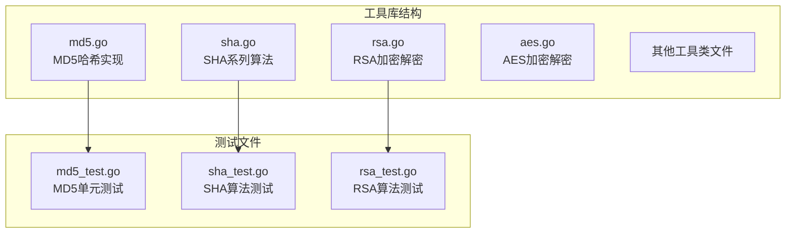
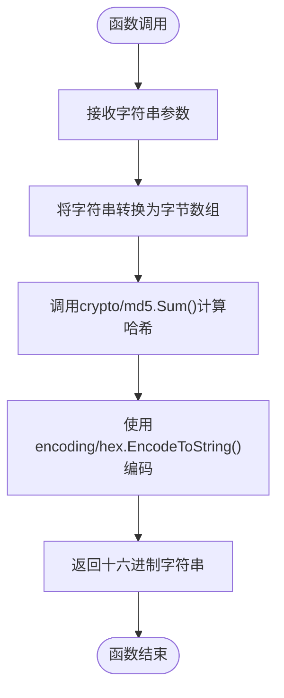
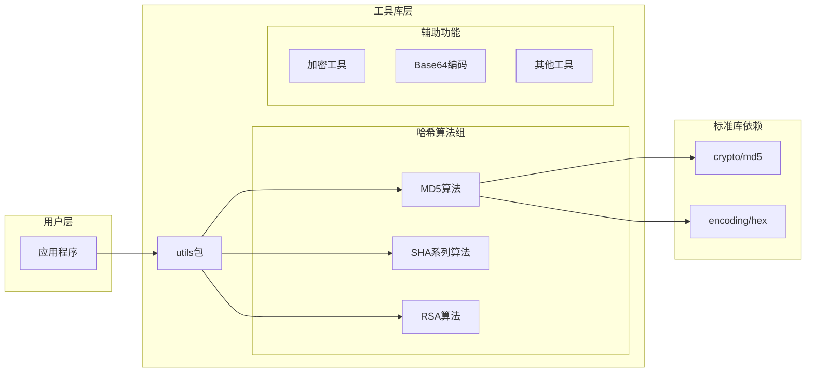
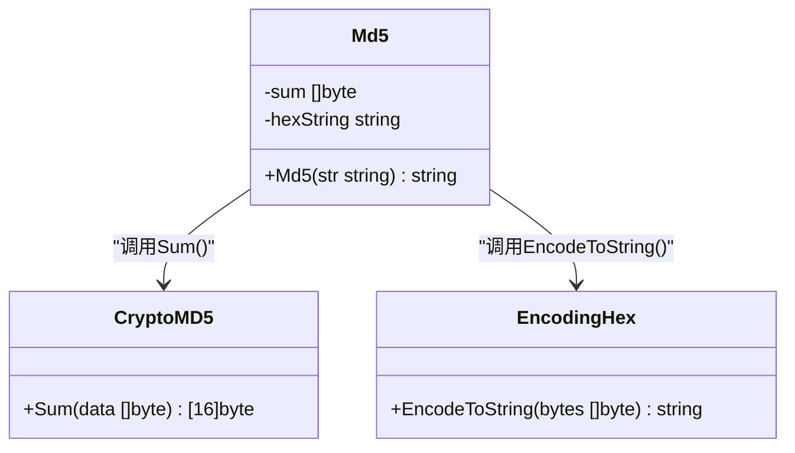
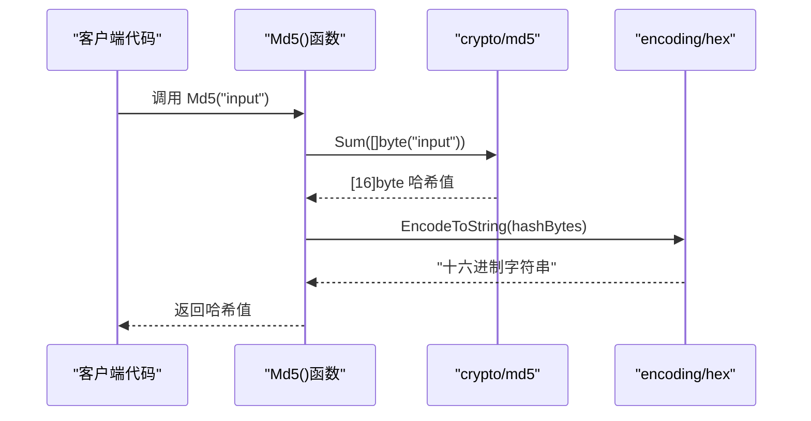
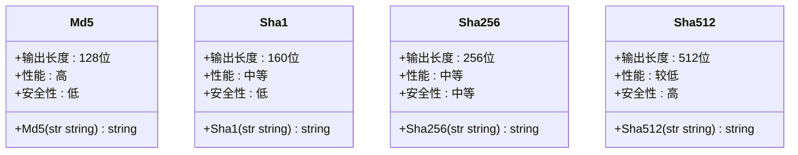
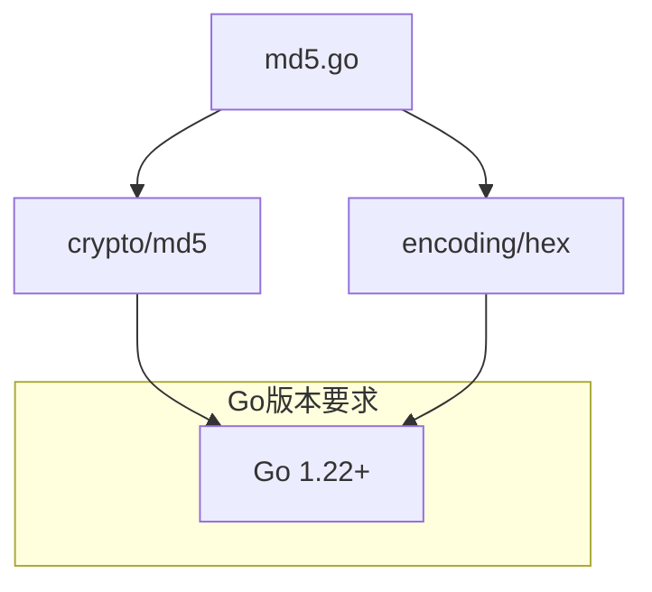
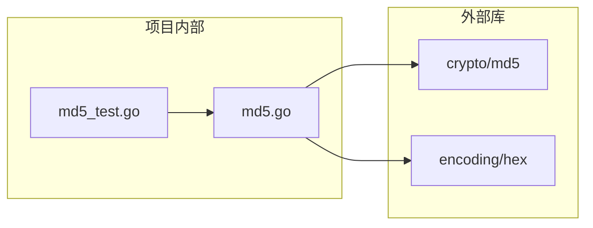
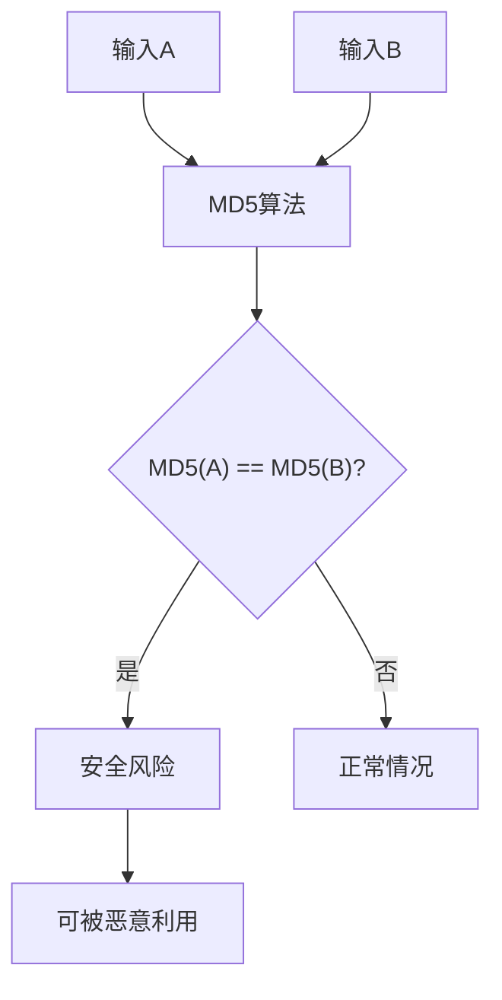

# MD5哈希算法

<cite>
**本文档引用的文件**
- [md5.go](file://md5.go)
- [md5_test.go](file://md5_test.go)
- [sha.go](file://sha.go)
- [sha_test.go](file://sha_test.go)
- [rsa.go](file://rsa.go)
- [rsa_test.go](file://rsa_test.go)
- [README.md](file://README.md)
- [go.mod](file://go.mod)
</cite>

## 目录

1. [简介](#简介)
2. [项目结构](#项目结构)
3. [核心组件](#核心组件)
4. [架构概览](#架构概览)
5. [详细组件分析](#详细组件分析)
6. [依赖关系分析](#依赖关系分析)
7. [性能考虑](#性能考虑)
8. [安全性分析](#安全性分析)
9. [使用场景建议](#使用场景建议)
10. [故障排除指南](#故障排除指南)
11. [结论](#结论)

## 简介

MD5（Message Digest Algorithm 5）是一种广泛使用的哈希算法，由Ron
Rivest在1991年设计。它将任意长度的输入数据转换为128位（16字节）的固定长度哈希值。MD5算法以其简单性和高效性而闻名，在许多应用场景中被用来验证数据完整性、生成文件校验码等。

在Go语言的标准库中，MD5算法通过`crypto/md5`包实现，提供了高效的哈希计算功能。本项目中的`Md5()`函数是对Go标准库的简单封装，提供了便捷的字符串哈希功能。

## 项目结构

该项目是一个Go语言工具库，包含了多种加密、解密和实用工具函数。MD5相关功能位于专门的文件中，与其它哈希算法（如SHA系列）并列组织。

**图表来源**

- [md5.go](file://md5.go#L1-L13)
- [sha.go](file://sha.go#L1-L27)
- [md5_test.go](file://md5_test.go#L1-L28)

**章节来源**

- [md5.go](file://md5.go#L1-L13)
- [sha.go](file://sha.go#L1-L27)
- [go.mod](file://go.mod#L1-L4)

## 核心组件

### Md5() 函数

`Md5()`函数是本项目提供的主要MD5哈希接口，其核心实现非常简洁：

**图表来源**

- [md5.go](file://md5.go#L9-L12)

该函数的工作流程：

1. 接收输入字符串参数
2. 将字符串转换为字节数组
3. 调用标准库的MD5算法计算哈希值
4. 将二进制哈希值编码为十六进制字符串
5. 返回最终结果

**章节来源**

- [md5.go](file://md5.go#L8-L12)

## 架构概览

项目采用模块化的架构设计，MD5算法作为独立的功能模块存在，与其他加密算法形成互补关系。

**图表来源**

- [md5.go](file://md5.go#L3-L6)
- [sha.go](file://sha.go#L3-L8)

## 详细组件分析

### MD5算法实现分析

#### 函数签名和返回值

**图表来源**

- [md5.go](file://md5.go#L9-L12)

#### 数据流处理

MD5算法的数据处理流程遵循标准的哈希计算模式：

**图表来源**

- [md5.go](file://md5.go#L9-L12)

#### 测试验证

项目提供了完整的单元测试来验证MD5函数的正确性：

**章节来源**

- [md5_test.go](file://md5_test.go#L8-L27)

### 与其他哈希算法的对比

#### SHA系列算法对比

项目同时提供了SHA1、SHA256和SHA512算法，便于进行性能和安全性对比：

**图表来源**

- [md5.go](file://md5.go#L9-L12)
- [sha.go](file://sha.go#L10-L26)

**章节来源**

- [sha.go](file://sha.go#L1-L27)

## 依赖关系分析

### 外部依赖

MD5实现依赖于Go标准库的两个核心包：

**图表来源**

- [md5.go](file://md5.go#L3-L6)
- [go.mod](file://go.mod#L3)

### 内部依赖关系

项目中的依赖关系相对简单，MD5算法独立运行，不依赖其他内部模块：

**图表来源**

- [md5.go](file://md5.go#L3-L6)
- [md5_test.go](file://md5_test.go#L3-L6)

**章节来源**

- [go.mod](file://go.mod#L1-L4)

## 性能考虑

### 算法复杂度分析

MD5算法的时间复杂度为O(n)，其中n是输入数据的长度。空间复杂度为O(1)，因为输出长度固定为128位。

### 性能基准测试

虽然项目中没有提供正式的性能测试，但可以从以下角度进行分析：

1. **内存使用**：MD5只需要固定的16字节输出缓冲区
2. **CPU效率**：MD5算法相对简单，计算速度快
3. **I/O开销**：主要取决于输入数据大小
4. **内存分配**：函数内部会产生少量临时对象

### 与其他算法的性能对比

基于算法特性，可以得出以下性能趋势：

- **MD5**: 最快，适合大量数据的快速校验
- **SHA1**: 中等速度，兼容性好
- **SHA256**: 较慢，安全性更高
- **SHA512**: 最慢，安全性最高

## 安全性分析

### 已知安全漏洞

MD5算法存在严重的安全问题：

#### 碰撞攻击

- **定义**: 找到两个不同的输入产生相同的MD5输出
- **现状**: 2008年已有公开的碰撞攻击方法
- **影响**: 破坏数据完整性验证机制

#### 哈希碰撞示例

#### 彩虹表攻击

- **原理**: 预先计算常见密码的MD5值
- **威胁**: 可以快速破解常见密码
- **防护**: 使用盐值（salt）和更安全的算法

### 安全性评级

| 安全属性   | MD5评级 | 建议        |
|--------|-------|-----------|
| 碰撞抗性   | 弱     | 不推荐用于安全场景 |
| 第二原像抗性 | 弱     | 不推荐用于安全场景 |
| 原像抗性   | 弱     | 不推荐用于安全场景 |
| 性能     | 优秀    | 适合非安全场景   |

**章节来源**

- [md5_test.go](file://md5_test.go#L17-L18)
- [sha_test.go](file://sha_test.go#L17-L18)

## 使用场景建议

### 推荐使用场景

#### 非安全敏感应用

1. **文件完整性检查**（非安全环境）
2. **缓存键生成**
3. **数据去重**
4. **简单校验码**
5. **日志文件校验**

#### 具体代码示例路径

**章节来源**

- [md5_test.go](file://md5_test.go#L17-L24)

### 不推荐使用场景

#### 安全敏感应用

1. **密码存储** - 必须使用专用的密码哈希算法
2. **数字签名** - 需要更强的抗碰撞能力
3. **证书验证** - 需要更高的安全性
4. **区块链应用** - 需要防碰撞特性
5. **金融系统** - 需要严格的安全保证

## 故障排除指南

### 常见问题和解决方案

#### 输出格式问题

- **问题**: 返回的十六进制字符串长度不符合预期
- **原因**: MD5输出应为32个字符（128位/4位）
- **解决**: 检查输入数据和编码方式

#### 性能问题

- **问题**: 处理大量数据时性能不佳
- **原因**: MD5算法本身很快，问题可能在I/O或内存管理
- **解决**: 考虑使用更合适的算法或优化数据处理流程

#### 兼容性问题

- **问题**: 不同平台或版本间结果不一致
- **原因**: 字符编码差异
- **解决**: 明确指定UTF-8编码

### 调试技巧

1. **验证输入**: 确保输入字符串编码正确
2. **检查长度**: 验证输出是否为32个十六进制字符
3. **对比测试**: 与其他MD5实现进行结果对比
4. **边界测试**: 测试空字符串、特殊字符等边界情况

**章节来源**

- [md5_test.go](file://md5_test.go#L8-L27)

## 结论

MD5算法作为一种经典的哈希算法，在非安全敏感场景中仍有其价值。然而，由于其已知的安全漏洞，特别是在现代安全应用中不应再使用。

### 主要发现

1. **实现简洁**: 项目中的MD5实现非常简洁，仅13行代码
2. **性能优异**: MD5算法计算速度快，适合大量数据处理
3. **安全风险**: 存在已知的碰撞攻击和彩虹表攻击风险
4. **兼容性好**: 与其他系统和工具具有良好的兼容性

### 最佳实践建议

1. **非安全场景**: 在文件校验、缓存键生成等场景中可以使用
2. **安全场景**: 必须使用更安全的算法（如SHA-256或更高）
3. **迁移策略**: 对现有系统进行安全评估，逐步替换MD5
4. **监控告警**: 建立安全监控机制，及时发现潜在风险

### 未来发展方向

随着网络安全威胁的不断演进，建议：

- 逐步淘汰MD5在安全场景中的使用
- 采用更安全的哈希算法
- 实施多层安全防护策略
- 定期进行安全审计和评估