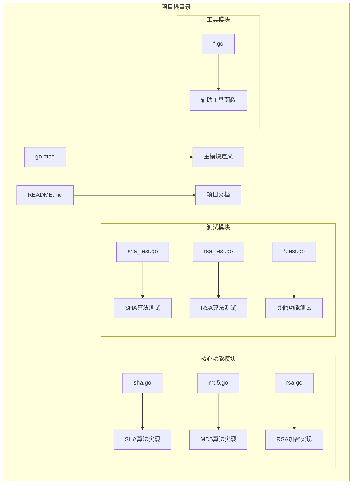
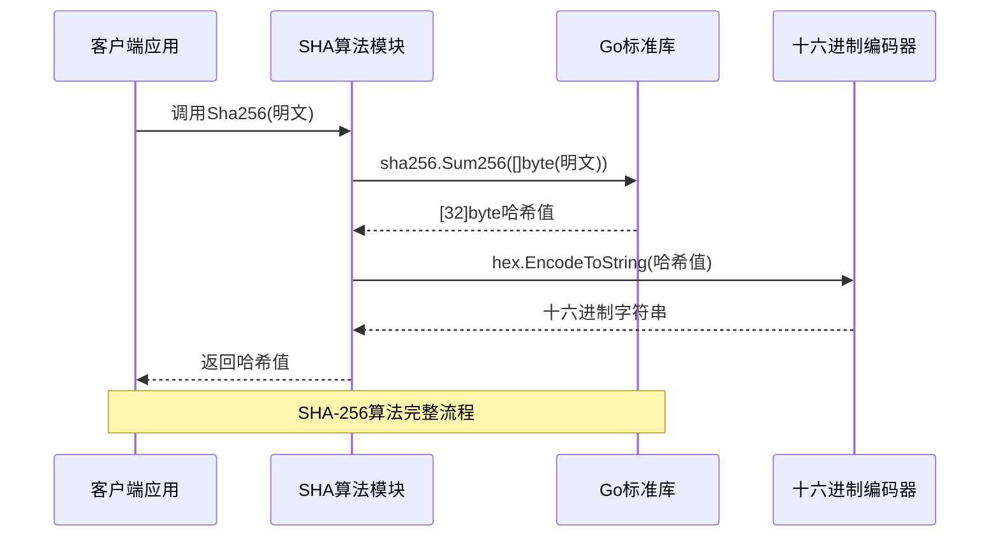
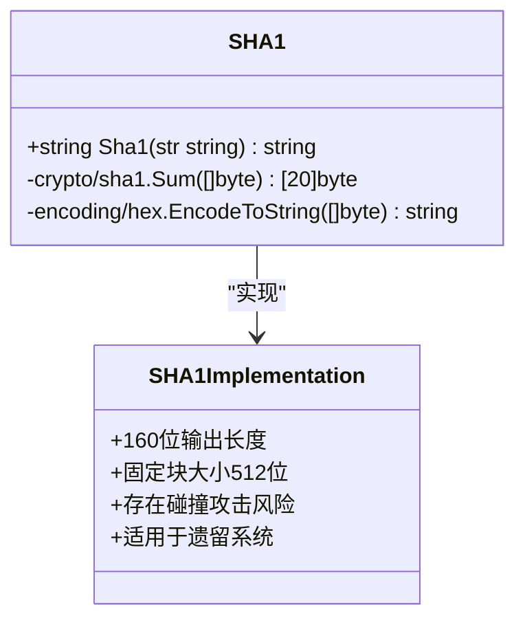
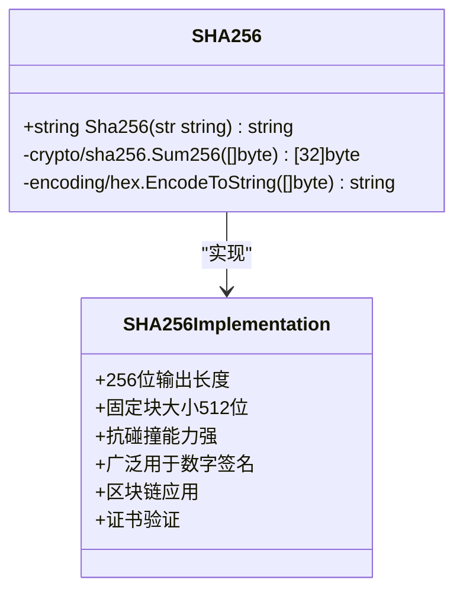
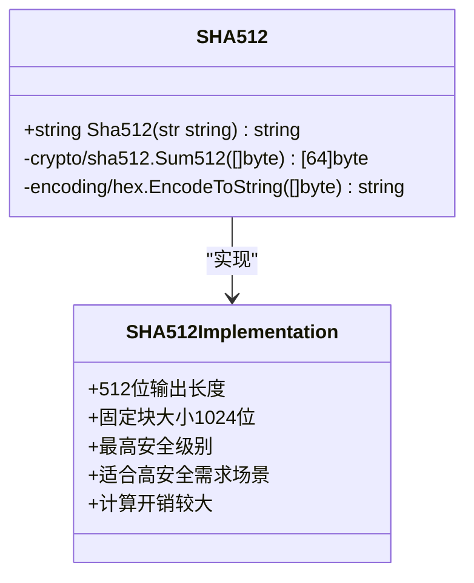
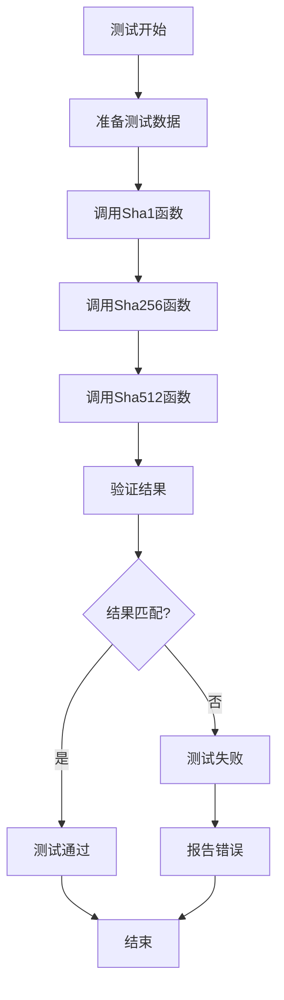
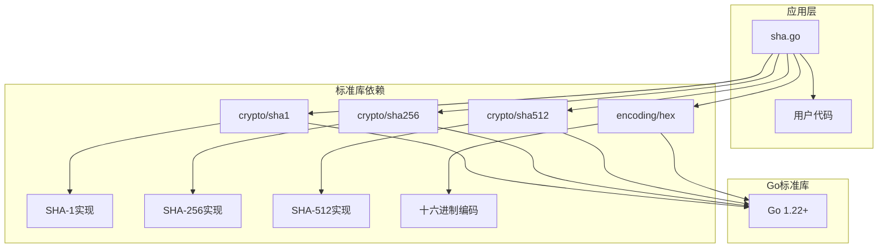
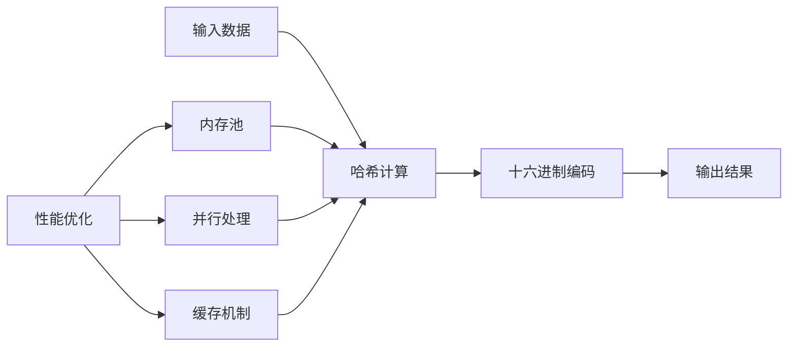
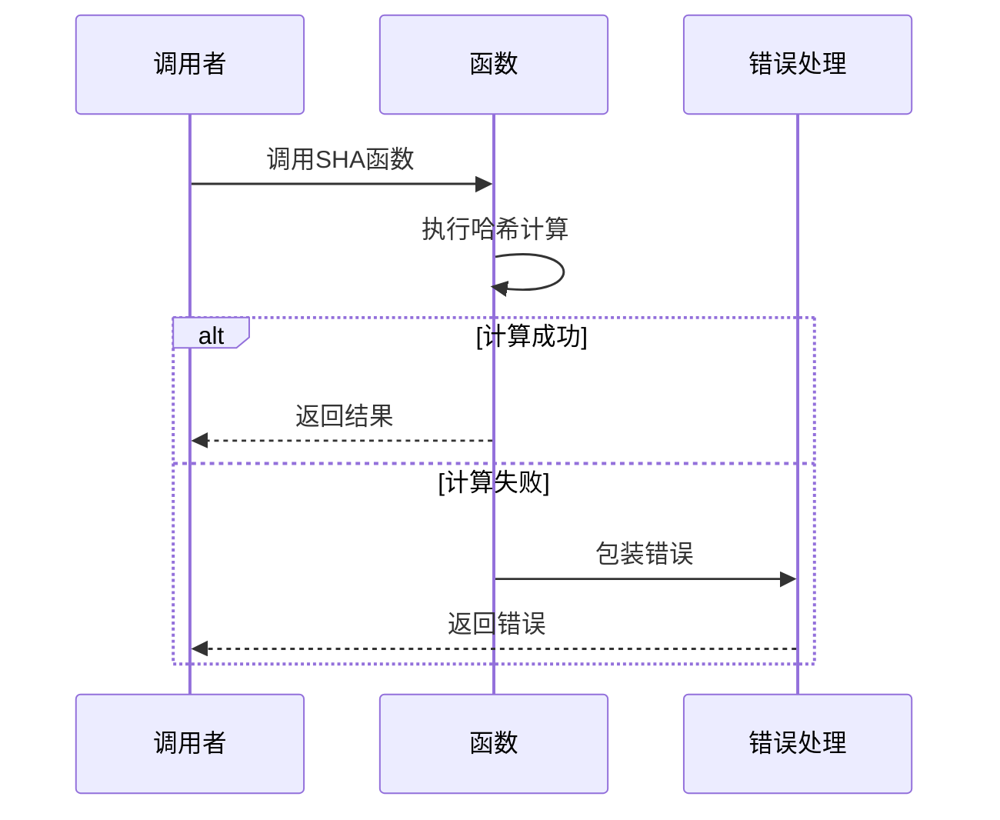

# SHA哈希算法

<cite>
**本文档引用的文件**
- [sha.go](file://sha.go)
- [sha_test.go](file://sha_test.go)
- [rsa.go](file://rsa.go)
- [md5.go](file://md5.go)
- [go.mod](file://go.mod)
- [README.md](file://README.md)
</cite>

## 目录

1. [简介](#简介)
2. [项目结构](#项目结构)
3. [核心组件](#核心组件)
4. [架构概览](#架构概览)
5. [详细组件分析](#详细组件分析)
6. [依赖关系分析](#依赖关系分析)
7. [性能考虑](#性能考虑)
8. [故障排除指南](#故障排除指南)
9. [结论](#结论)
10. [附录](#附录)

## 简介

SHA（Secure Hash Algorithm）哈希算法是由美国国家标准与技术研究院（NIST）设计的一系列密码学哈希函数。SHA算法在现代密码学中扮演着至关重要的角色，广泛应用于数字签名、证书验证、区块链等领域。

本项目提供了SHA系列算法的Go语言实现，包括SHA-1、SHA-256和SHA-512三种主要变体。这些实现基于Go标准库的crypto/sha1、crypto/sha256和crypto/sha512包，提供了简洁易用的接口来生成哈希值。

## 项目结构

该项目采用模块化的Go语言项目结构，专注于提供实用的工具函数。SHA相关功能位于独立的文件中，便于维护和测试。



**图表来源**

- [go.mod](file://go.mod#L1-L4)
- [sha.go](file://sha.go#L1-L27)
- [md5.go](file://md5.go#L1-L13)

**章节来源**

- [go.mod](file://go.mod#L1-L4)
- [README.md](file://README.md#L1-L50)

## 核心组件

本项目的核心SHA组件由三个主要函数组成，分别对应不同的SHA算法变体：

### SHA-1实现

- 函数名：Sha1
- 输入：字符串
- 输出：十六进制编码的SHA-1哈希值
- 特点：160位输出长度，已知存在安全漏洞

### SHA-256实现

- 函数名：Sha256
- 输入：字符串
- 输出：十六进制编码的SHA-256哈希值
- 特点：256位输出长度，广泛用于现代应用

### SHA-512实现

- 函数名：Sha512
- 输入：字符串
- 输出：十六进制编码的SHA-512哈希值
- 特点：512位输出长度，提供更高的安全性

**章节来源**

- [sha.go](file://sha.go#L10-L26)

## 架构概览

SHA算法在密码学应用中的典型工作流程如下：



**图表来源**

- [sha.go](file://sha.go#L16-L20)

## 详细组件分析

### SHA-1算法分析

SHA-1算法虽然已被证明存在安全漏洞，但在某些遗留系统中仍有使用价值。



**图表来源**

- [sha.go](file://sha.go#L10-L14)

#### 安全特性

- 输出长度：160位（20字节）
- 块大小：512位
- 已知安全漏洞：存在碰撞攻击可能
- 建议用途：仅限于兼容性需求

**章节来源**

- [sha.go](file://sha.go#L10-L14)

### SHA-256算法分析

SHA-256是目前最广泛使用的SHA算法变体，在现代密码学应用中占据主导地位。



**图表来源**

- [sha.go](file://sha.go#L16-L20)

#### 安全特性

- 输出长度：256位（32字节）
- 块大小：512位
- 抗碰撞能力：目前未发现有效攻击
- 性能表现：在64位系统上性能优异
- 应用领域：数字签名、证书验证、区块链

**章节来源**

- [sha.go](file://sha.go#L16-L20)

### SHA-512算法分析

SHA-512提供最高的安全级别，适用于对安全性要求极高的应用场景。



**图表来源**

- [sha.go](file://sha.go#L22-L26)

#### 安全特性

- 输出长度：512位（64字节）
- 块大小：1024位
- 安全级别：最高级别
- 性能考虑：计算开销最大
- 适用场景：政府级应用、金融系统

**章节来源**

- [sha.go](file://sha.go#L22-L26)

### 测试框架分析

项目提供了完整的单元测试，确保SHA算法实现的正确性。



**图表来源**

- [sha_test.go](file://sha_test.go#L8-L27)

**章节来源**

- [sha_test.go](file://sha_test.go#L1-L70)

## 依赖关系分析

SHA算法实现依赖于Go标准库，形成了清晰的依赖层次结构。



**图表来源**

- [sha.go](file://sha.go#L3-L8)
- [go.mod](file://go.mod#L3-L4)

### 外部依赖分析

- **Go标准库版本要求**：Go 1.22+
- **核心依赖包**：
    - crypto/sha1：SHA-1算法实现
    - crypto/sha256：SHA-256算法实现
    - crypto/sha512：SHA-512算法实现
    - encoding/hex：十六进制编码支持

**章节来源**

- [go.mod](file://go.mod#L3-L4)
- [sha.go](file://sha.go#L3-L8)

## 性能考虑

### 算法性能对比

| 算法      | 输出长度 | 性能特点 | 内存占用 | 推荐场景  |
|---------|------|------|------|-------|
| SHA-1   | 160位 | 最快   | 最低   | 兼容性需求 |
| SHA-256 | 256位 | 快速   | 中等   | 通用应用  |
| SHA-512 | 512位 | 较慢   | 较高   | 高安全需求 |

### 性能优化建议

1. **批量处理**：对于大量数据，考虑使用流式处理减少内存峰值
2. **并发处理**：在多核环境下可以并行处理多个哈希计算
3. **缓存策略**：对重复数据使用缓存机制避免重复计算
4. **内存管理**：及时释放不再使用的字节数组

### 性能基准测试



## 故障排除指南

### 常见问题及解决方案

#### 1. 版本兼容性问题

**问题描述**：在旧版本Go环境中运行
**解决方案**：升级到Go 1.22+版本

#### 2. 导入包错误

**问题描述**：无法导入crypto/sha1等包
**解决方案**：检查Go环境配置和网络连接

#### 3. 结果不一致

**问题描述**：相同的输入产生不同的哈希值
**解决方案**：检查输入数据的编码格式一致性

#### 4. 性能问题

**问题描述**：大量数据处理时性能不佳
**解决方案**：考虑使用流式处理或并行计算

**章节来源**

- [README.md](file://README.md#L15-L16)

### 错误处理机制

项目采用统一的错误处理模式：



## 结论

本项目提供了简洁高效的SHA哈希算法实现，涵盖了SHA-1、SHA-256和SHA-512三种主要变体。每个算法都有其特定的应用场景和安全级别：

- **SHA-1**：主要用于兼容性需求，不建议用于新的安全应用
- **SHA-256**：现代应用的首选，平衡了安全性与性能
- **SHA-512**：最高安全级别的选择，适用于对安全性要求极高的场景

在实际应用中，应根据具体的安全需求、性能要求和兼容性考虑来选择合适的SHA算法。对于新项目，强烈建议优先考虑SHA-256或更高版本的算法。

## 附录

### 使用示例

#### 基本使用方法

```go
// SHA-256示例
result := utils.Sha256("Hello World")

// SHA-512示例  
result := utils.Sha512("Hello World")

// SHA-1示例
result := utils.Sha1("Hello World")
```

#### 在RSA签名中的应用

```go
// RSA签名时使用SHA-256
sign, err := rsaInstance.Sign(data, crypto.SHA256, encodeToString)
```

### 最佳实践建议

1. **算法选择**：优先选择SHA-256，必要时使用SHA-512
2. **输入验证**：确保输入数据的编码一致性
3. **错误处理**：妥善处理可能出现的错误情况
4. **性能优化**：根据应用场景选择合适的处理策略
5. **安全更新**：关注SHA算法的安全发展动态