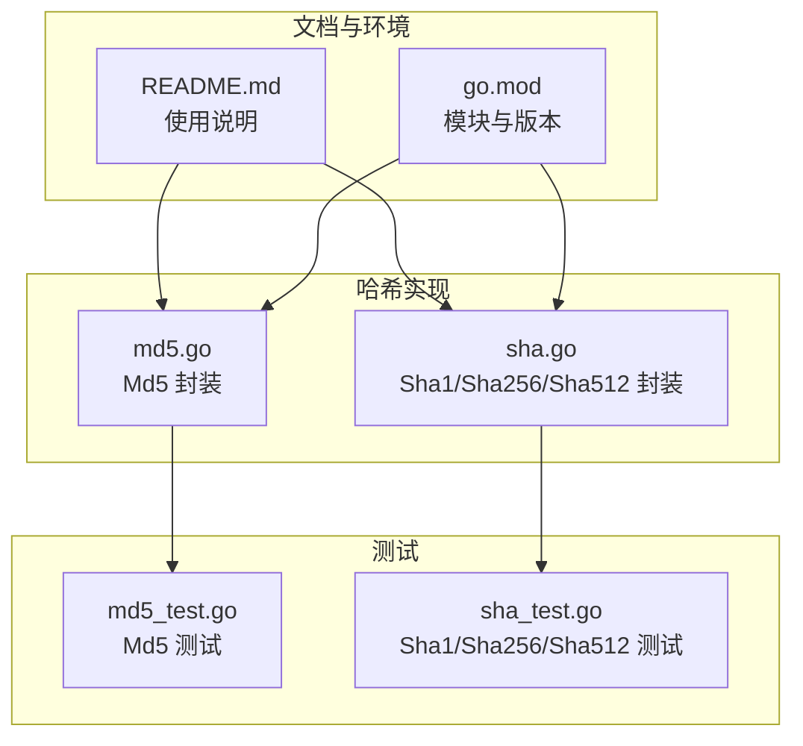
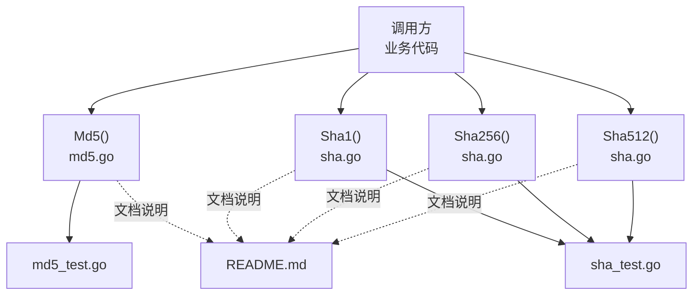
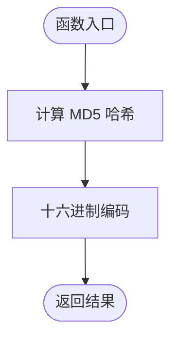
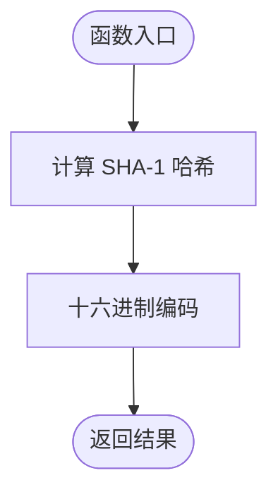
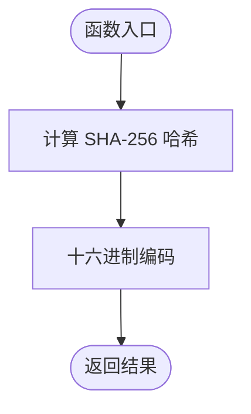
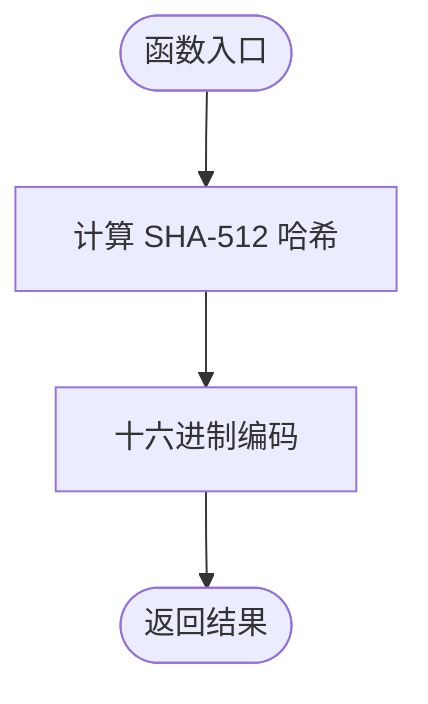
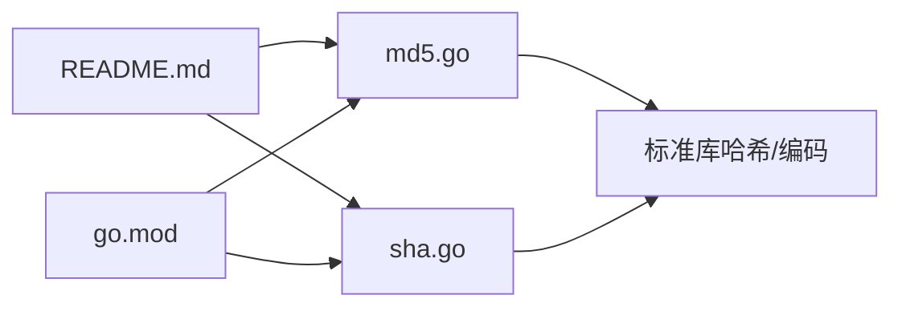

# 哈希算法

<cite>
**本文引用的文件**
- [md5.go](file://md5.go)
- [sha.go](file://sha.go)
- [md5_test.go](file://md5_test.go)
- [sha_test.go](file://sha_test.go)
- [README.md](file://README.md)
- [go.mod](file://go.mod)
</cite>

## 目录

1. [简介](#简介)
2. [项目结构](#项目结构)
3. [核心组件](#核心组件)
4. [架构总览](#架构总览)
5. [详细组件分析](#详细组件分析)
6. [依赖关系分析](#依赖关系分析)
7. [性能考量](#性能考量)
8. [故障排查指南](#故障排查指南)
9. [结论](#结论)
10. [附录](#附录)

## 简介

本文件围绕仓库中的哈希算法实现进行系统性说明，重点覆盖以下方面：

- 哈希函数的基本概念与在密码学中的作用（数据完整性验证、密码存储、数字指纹等）
- MD5 与 SHA 系列算法的特点、安全性评估与使用建议
- MD5 的局限性与安全风险，以及为何在安全敏感场景不推荐使用
- SHA-1、SHA-256、SHA-512 的输出长度与安全性等级
- 密码存储的正确实践（加盐技术）
- 各类哈希算法的使用示例与性能对比，辅助开发者做出合适选择

说明：本仓库提供了 MD5 与 SHA 系列的便捷封装，便于在业务中快速使用。但出于安全考虑，建议在密码存储等敏感场景优先采用现代、抗碰撞更强的算法，并配合加盐与专用的密码哈希方案。

## 项目结构

本仓库与哈希相关的核心文件如下：

- md5.go：提供 Md5 字符串哈希封装
- sha.go：提供 Sha1、Sha256、Sha512 字符串哈希封装
- md5_test.go、sha_test.go：分别提供对应算法的功能测试样例
- README.md：在文档中明确列出 Md5、Sha1、Sha256、Sha512 的使用说明
- go.mod：声明模块与 Go 版本要求

图表来源

- [md5.go](file://md5.go#L1-L13)
- [sha.go](file://sha.go#L1-L27)
- [md5_test.go](file://md5_test.go#L1-L28)
- [sha_test.go](file://sha_test.go#L1-L70)
- [README.md](file://README.md#L1600-L1647)
- [go.mod](file://go.mod#L1-L4)

章节来源

- [md5.go](file://md5.go#L1-L13)
- [sha.go](file://sha.go#L1-L27)
- [md5_test.go](file://md5_test.go#L1-L28)
- [sha_test.go](file://sha_test.go#L1-L70)
- [README.md](file://README.md#L1600-L1647)
- [go.mod](file://go.mod#L1-L4)

## 核心组件

- Md5：对输入字符串执行 MD5 哈希，并返回十六进制编码结果
- Sha1：对输入字符串执行 SHA-1 哈希，并返回十六进制编码结果
- Sha256：对输入字符串执行 SHA-256 哈希，并返回十六进制编码结果
- Sha512：对输入字符串执行 SHA-512 哈希，并返回十六进制编码结果

这些函数均基于 Go 标准库的哈希与编码库实现，封装简洁，便于直接调用。

章节来源

- [md5.go](file://md5.go#L8-L12)
- [sha.go](file://sha.go#L10-L26)
- [README.md](file://README.md#L1603-L1647)

## 架构总览

下图展示了哈希算法在本仓库中的组织与调用关系，以及与测试、文档的关系。

图表来源

- [md5.go](file://md5.go#L8-L12)
- [sha.go](file://sha.go#L10-L26)
- [md5_test.go](file://md5_test.go#L8-L27)
- [sha_test.go](file://sha_test.go#L8-L69)
- [README.md](file://README.md#L1603-L1647)

## 详细组件分析

### Md5 组件分析

- 功能：对字符串进行 MD5 哈希，返回十六进制字符串
- 输入：字符串
- 输出：十六进制字符串
- 关键点：基于标准库哈希与编码库，实现简单、易用
- 安全性：MD5 已被广泛认为不适用于安全敏感场景（存在碰撞攻击风险）

图表来源

- [md5.go](file://md5.go#L8-L12)

章节来源

- [md5.go](file://md5.go#L8-L12)
- [md5_test.go](file://md5_test.go#L8-L27)
- [README.md](file://README.md#L1603-L1613)

### Sha1 组件分析

- 功能：对字符串进行 SHA-1 哈希，返回十六进制字符串
- 输入：字符串
- 输出：十六进制字符串
- 关键点：SHA-1 已不再推荐用于安全用途（存在已知的碰撞攻击）
- 应用场景：仅限非安全敏感的场景或遗留系统兼容

图表来源

- [sha.go](file://sha.go#L10-L14)

章节来源

- [sha.go](file://sha.go#L10-L14)
- [sha_test.go](file://sha_test.go#L8-L27)
- [README.md](file://README.md#L1617-L1627)

### Sha256 组件分析

- 功能：对字符串进行 SHA-256 哈希，返回十六进制字符串
- 输入：字符串
- 输出：十六进制字符串
- 关键点：SHA-256 在当前仍广泛用于安全场景，抗碰撞能力较强
- 应用场景：密码存储、数字签名、数据完整性校验等

图表来源

- [sha.go](file://sha.go#L16-L20)

章节来源

- [sha.go](file://sha.go#L16-L20)
- [sha_test.go](file://sha_test.go#L29-L48)
- [README.md](file://README.md#L1617-L1637)

### Sha512 组件分析

- 功能：对字符串进行 SHA-512 哈希，返回十六进制字符串
- 输入：字符串
- 输出：十六进制字符串
- 关键点：SHA-512 输出更长，抗碰撞能力更强，适合高安全需求场景
- 应用场景：高安全要求的数据完整性校验、密码存储等

图表来源

- [sha.go](file://sha.go#L22-L26)

章节来源

- [sha.go](file://sha.go#L22-L26)
- [sha_test.go](file://sha_test.go#L50-L69)
- [README.md](file://README.md#L1617-L1647)

### 使用示例与测试参考

- Md5 示例：可参考测试用例中的输入与期望输出，了解典型用法
- Sha1/Sha256/Sha512 示例：可参考各自测试用例中的输入与期望输出，了解典型用法

章节来源

- [md5_test.go](file://md5_test.go#L8-L27)
- [sha_test.go](file://sha_test.go#L8-L69)

## 依赖关系分析

- md5.go 依赖标准库哈希与编码库
- sha.go 依赖标准库哈希与编码库
- README.md 提供使用说明与示例链接
- go.mod 指定模块与 Go 版本要求

图表来源

- [md5.go](file://md5.go#L3-L6)
- [sha.go](file://sha.go#L3-L8)
- [README.md](file://README.md#L1603-L1647)
- [go.mod](file://go.mod#L1-L4)

章节来源

- [md5.go](file://md5.go#L3-L6)
- [sha.go](file://sha.go#L3-L8)
- [README.md](file://README.md#L1603-L1647)
- [go.mod](file://go.mod#L1-L4)

## 性能考量

- 本仓库提供的封装均为一次性哈希计算，时间复杂度为 O(n)，n 为输入长度
- 输出长度：
    - MD5：128 位（32 十六进制字符）
    - SHA-1：160 位（40 十六进制字符）
    - SHA-256：256 位（64 十六进制字符）
    - SHA-512：512 位（128 十六进制字符）
- 性能对比（通用指导）：
    - MD5 最快，但安全性不足，不建议用于安全场景
    - SHA-1 次之，但已被视为不安全
    - SHA-256 与 SHA-512 抗碰撞能力更强，SHA-512 更强但计算开销更大
- 实际性能受硬件与输入规模影响，建议在真实环境中通过基准测试确定具体表现

章节来源

- [md5.go](file://md5.go#L8-L12)
- [sha.go](file://sha.go#L10-L26)

## 故障排查指南

- 结果与预期不符
    - 检查输入字符串是否一致（大小写、空白、编码）
    - 确认使用的算法与测试用例一致
    - 参考测试用例中的输入与期望输出进行比对
- 编译或运行错误
    - 确认 Go 版本满足模块要求
    - 确保导入的标准库可用
- 安全性问题
    - 若用于密码存储，请改用更强的算法并配合加盐
    - 避免使用 MD5 与 SHA-1 于安全敏感场景

章节来源

- [md5_test.go](file://md5_test.go#L8-L27)
- [sha_test.go](file://sha_test.go#L8-L69)
- [go.mod](file://go.mod#L1-L4)

## 结论

- 本仓库提供了 MD5 与 SHA 系列的便捷封装，便于在非安全场景快速使用
- 在密码存储等安全敏感场景，强烈建议使用 SHA-256 或 SHA-512，并结合加盐与专用密码哈希方案
- MD5 与 SHA-1 因安全性不足，不建议用于安全相关用途
- 选择算法时应综合考虑安全性、性能与兼容性需求

## 附录

### 哈希算法概述与安全建议

- 数据完整性验证：用于校验数据未被篡改
- 密码存储：应使用抗碰撞强、带加盐的现代算法，并配合专用密码哈希流程
- 数字指纹：用于唯一标识数据，需选择抗碰撞能力强的算法
- MD5：输出短、速度快，但存在碰撞风险，不建议用于安全场景
- SHA-1：输出较短，已被视为不安全
- SHA-256/SHA-512：输出较长，抗碰撞能力强，适合安全场景

章节来源

- [md5.go](file://md5.go#L8-L12)
- [sha.go](file://sha.go#L10-L26)
- [README.md](file://README.md#L1603-L1647)