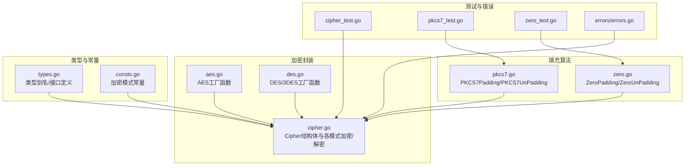
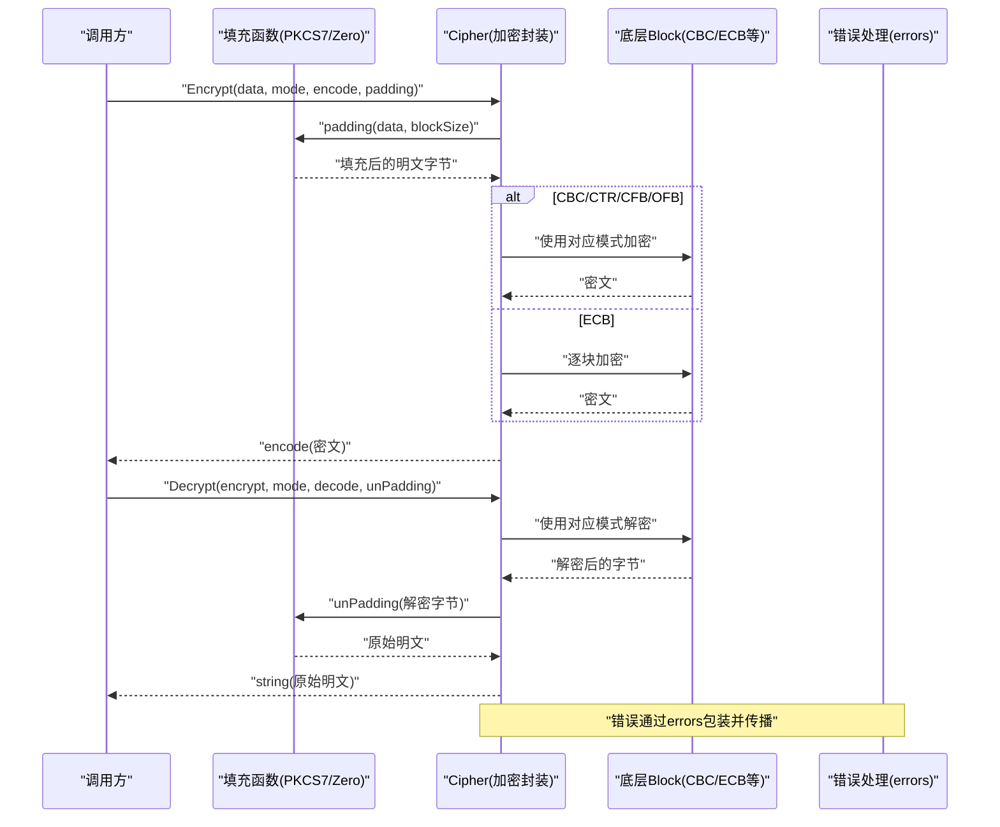
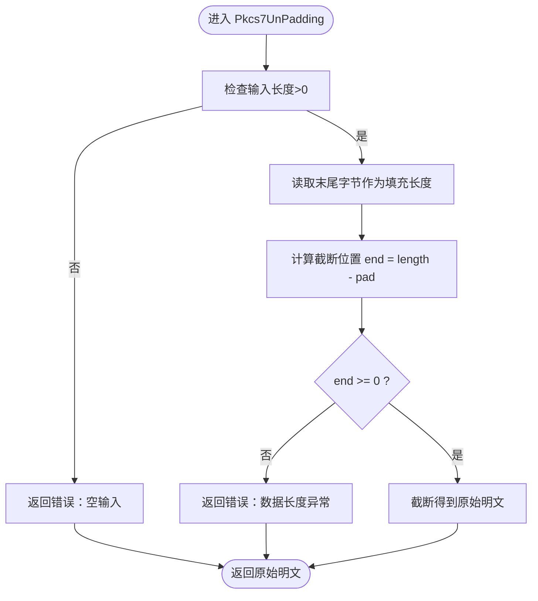
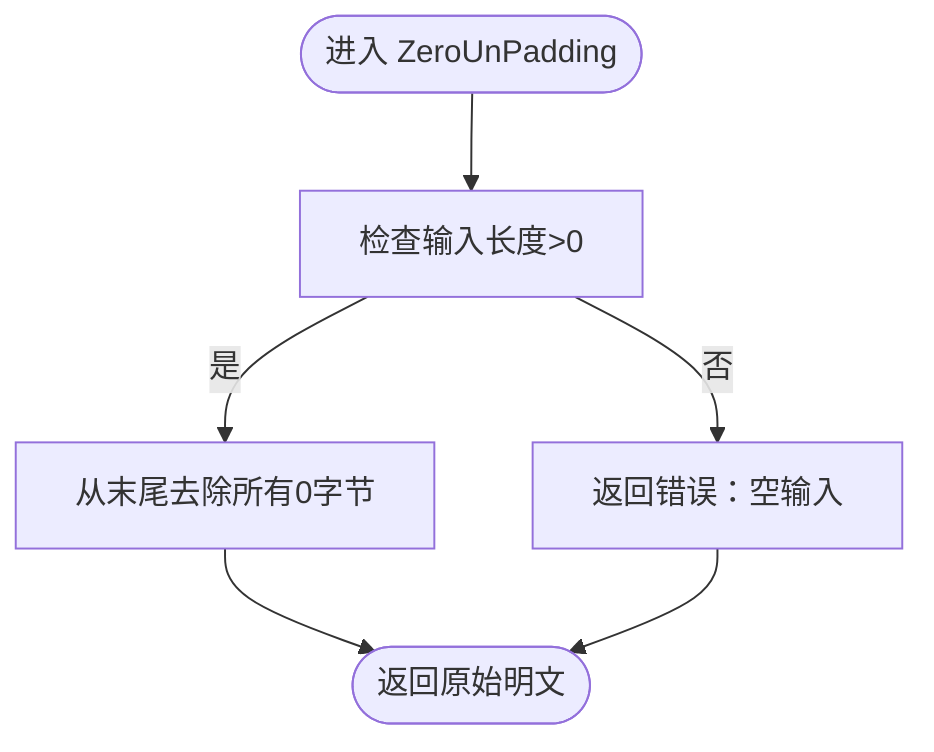
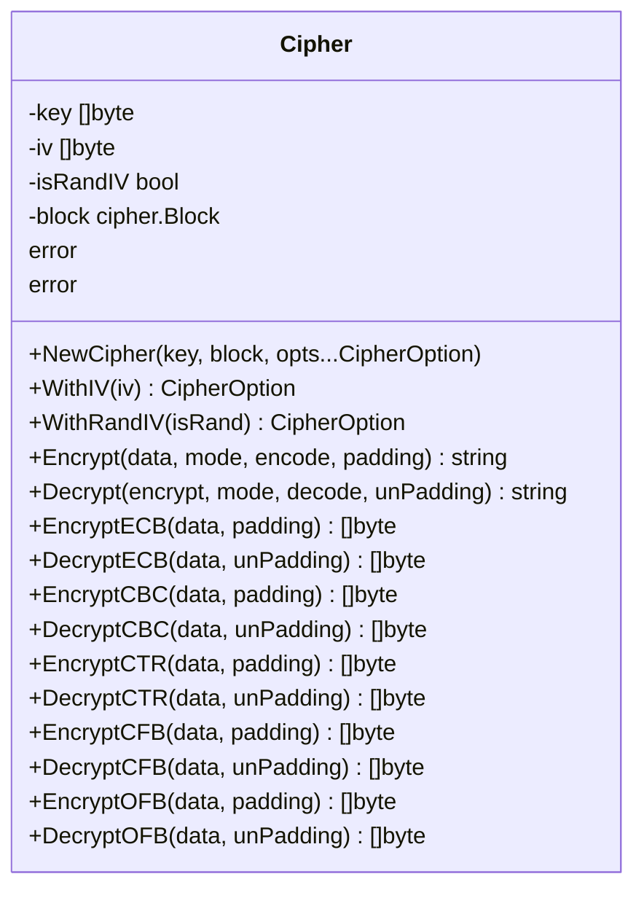
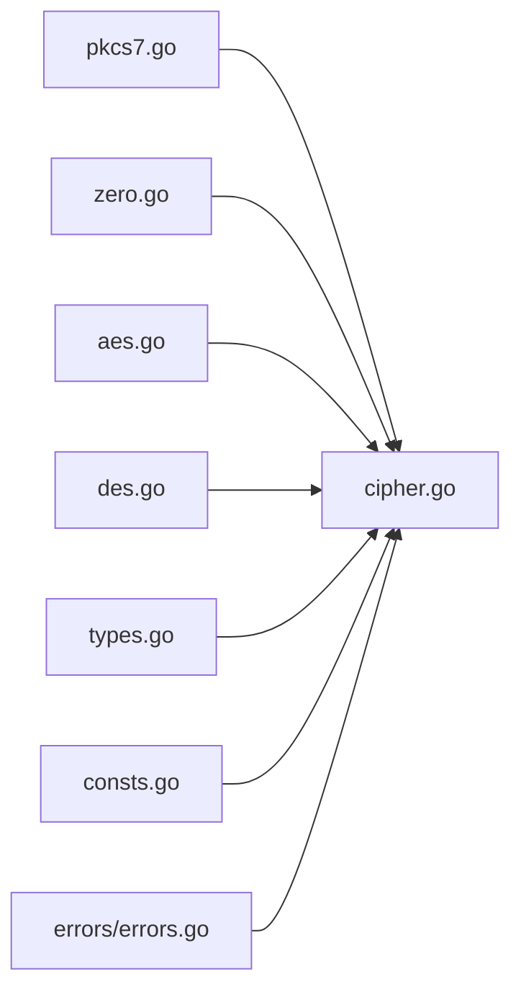

# 填充机制

<cite>
**本文引用的文件**
- [pkcs7.go](file://pkcs7.go)
- [zero.go](file://zero.go)
- [cipher.go](file://cipher.go)
- [aes.go](file://aes.go)
- [des.go](file://des.go)
- [types.go](file://types.go)
- [consts.go](file://consts.go)
- [cipher_test.go](file://cipher_test.go)
- [pkcs7_test.go](file://pkcs7_test.go)
- [zero_test.go](file://zero_test.go)
- [errors.go](file://errors/errors.go)
</cite>

## 目录

1. [简介](#简介)
2. [项目结构](#项目结构)
3. [核心组件](#核心组件)
4. [架构总览](#架构总览)
5. [详细组件分析](#详细组件分析)
6. [依赖关系分析](#依赖关系分析)
7. [性能考量](#性能考量)
8. [故障排查指南](#故障排查指南)
9. [结论](#结论)
10. [附录](#附录)

## 简介

本文件围绕分组密码的填充机制展开，系统讲解以下内容：

- 分组密码为何需要填充：明文长度需为分组大小的整数倍。
- PKCS7填充算法的实现原理、使用方法与去填充流程。
- 零填充（ZeroPadding）的实现与局限性。
- 不同填充方式对加密结果与安全性的差异。
- 在多种加密模式（ECB/CBC/CTR/CFB/OFB）下的正确使用方法与注意事项。
- 填充相关的安全风险与防护建议。

## 项目结构

该仓库提供了通用的对称加密封装与填充工具，关键文件如下：

- 填充算法：pkcs7.go、zero.go
- 加密封装：cipher.go（统一的Cipher结构体与多模式加密/解密方法）
- 算法适配：aes.go、des.go（针对AES/DES/3DES的便捷构造）
- 类型与常量：types.go、consts.go
- 测试用例：cipher_test.go、pkcs7_test.go、zero_test.go
- 错误处理：errors/errors.go

图表来源

- [cipher.go](file://cipher.go#L1-L498)
- [pkcs7.go](file://pkcs7.go#L1-L31)
- [zero.go](file://zero.go#L1-L29)
- [aes.go](file://aes.go#L1-L23)
- [des.go](file://des.go#L1-L45)
- [types.go](file://types.go#L1-L98)
- [consts.go](file://consts.go#L1-L23)
- [cipher_test.go](file://cipher_test.go#L1-L62)
- [pkcs7_test.go](file://pkcs7_test.go#L1-L65)
- [zero_test.go](file://zero_test.go#L1-L65)
- [errors.go](file://errors/errors.go#L1-L282)

章节来源

- [cipher.go](file://cipher.go#L1-L498)
- [pkcs7.go](file://pkcs7.go#L1-L31)
- [zero.go](file://zero.go#L1-L29)
- [aes.go](file://aes.go#L1-L23)
- [des.go](file://des.go#L1-L45)
- [types.go](file://types.go#L1-L98)
- [consts.go](file://consts.go#L1-L23)
- [cipher_test.go](file://cipher_test.go#L1-L62)
- [pkcs7_test.go](file://pkcs7_test.go#L1-L65)
- [zero_test.go](file://zero_test.go#L1-L65)
- [errors.go](file://errors/errors.go#L1-L282)

## 核心组件

- 填充算法
    - PKCS7Padding：按分组大小补齐至整数倍，填充字节值为“需要补齐的字节数”。
    - PKCS7UnPadding：从末尾读取填充字节值，截断相应长度得到原始明文。
    - ZeroPadding：以0字节补齐至整数倍。
    - ZeroUnPadding：从末尾去除连续的0字节，得到原始明文。
- 加密封装 Cipher
    - 支持多种模式：ECB、CBC、CTR、CFB、OFB。
    - 统一的加密/解密入口，内部调用具体填充/去填充函数。
    - 支持可选的随机IV（随机IV会写入密文头部，解密时自动提取）。
- 算法适配
    - AES：支持16/24/32字节密钥。
    - DES/3DES：支持8字节（DES）与24字节（3DES）密钥。
- 类型与常量
    - 定义了加密模式常量、编码/解码函数类型、填充/去填充函数类型等。
- 错误处理
    - 提供带堆栈追踪的错误包装，便于定位问题。

章节来源

- [pkcs7.go](file://pkcs7.go#L8-L30)
- [zero.go](file://zero.go#L8-L28)
- [cipher.go](file://cipher.go#L10-L497)
- [aes.go](file://aes.go#L12-L22)
- [des.go](file://des.go#L12-L44)
- [types.go](file://types.go#L44-L74)
- [consts.go](file://consts.go#L3-L10)
- [errors.go](file://errors/errors.go#L14-L53)

## 架构总览

下图展示了填充与加密封装的整体交互关系，以及在不同模式下的调用路径。

图表来源

- [cipher.go](file://cipher.go#L101-L497)
- [pkcs7.go](file://pkcs7.go#L8-L30)
- [zero.go](file://zero.go#L8-L28)
- [errors.go](file://errors/errors.go#L24-L53)

## 详细组件分析

### PKCS7填充与去填充

- 填充规则
    - 计算需要补齐的字节数：padding = blockSize - len(data)%blockSize。
    - 若能整除，则补齐一个完整分组（padding==blockSize）。
    - 以“字节值=补齐字节数”的方式重复填充。
- 去填充规则
    - 从末尾读取最后一个字节作为填充长度。
    - 截断相应长度得到原始明文。
    - 若末尾字节值不在有效范围内或截断后为负，视为数据异常。
- 安全性
    - PKCS7填充在语义上明确，便于严格校验，适合大多数场景。
    - 去填充失败应视为解密失败或数据损坏，不应静默忽略。

图表来源

- [pkcs7.go](file://pkcs7.go#L17-L30)

章节来源

- [pkcs7.go](file://pkcs7.go#L8-L30)
- [pkcs7_test.go](file://pkcs7_test.go#L9-L64)

### 零填充与去填充

- 填充规则
    - 以0字节补齐至整数倍。
- 去填充规则
    - 从末尾去除所有连续的0字节。
- 局限性
    - 若原始明文中末尾存在0字节，去填充会错误地移除这些字节，导致数据丢失。
    - 因此不适合包含任意二进制数据或可能以0结尾的文本。
- 适用场景
    - 明确仅包含ASCII可打印字符且不会以0结尾的文本，或特殊协议约定。

图表来源

- [zero.go](file://zero.go#L17-L28)

章节来源

- [zero.go](file://zero.go#L8-L28)
- [zero_test.go](file://zero_test.go#L9-L64)

### Cipher加密封装与填充集成

- 设计要点
    - Cipher结构体统一管理密钥、IV、块大小与底层Block。
    - 各模式加密/解密方法均接受填充/去填充函数作为参数，实现策略注入。
    - CBC/CTR/CFB/OFB支持可选随机IV（写入密文头部），解密时自动提取。
- ECB模式
    - 无需IV，直接按块加密。
- CBC/CTR/CFB/OFB模式
    - 加密前先填充，解密后去填充。
    - 对密文长度进行校验，确保为块大小的整数倍。
- 错误处理
    - 所有错误通过errors包装，保留调用栈信息，便于调试。

图表来源

- [cipher.go](file://cipher.go#L20-L497)

章节来源

- [cipher.go](file://cipher.go#L10-L497)
- [types.go](file://types.go#L44-L74)
- [consts.go](file://consts.go#L3-L10)

### AES/DES/3DES适配

- AES
    - 支持16/24/32字节密钥，自动选择对应AES变种。
- DES/3DES
    - DES支持8字节密钥；3DES支持24字节密钥。
    - DES函数内部可切换到3DES实现。
- 工厂函数
    - AES/DES/DES3返回Cipher实例，可直接用于加密/解密。

章节来源

- [aes.go](file://aes.go#L12-L22)
- [des.go](file://des.go#L12-L44)

### 在不同加密模式下的使用方法

- ECB
    - 适合短消息或已知明文长度的场景；不推荐用于长消息或重复模式敏感数据。
    - 加密/解密时均需填充/去填充。
- CBC
    - 需要IV；推荐使用随机IV（isRandIV=true）。
    - 明文长度非整数倍时必须填充。
- CTR/CFB/OFB
    - 流式模式，通常不需要填充；但若需要与分组模式保持一致的输入长度语义，也可采用填充策略。
    - 注意密文长度校验与IV处理。

章节来源

- [cipher.go](file://cipher.go#L10-L19)
- [cipher_test.go](file://cipher_test.go#L25-L29)

## 依赖关系分析

- 填充函数被Cipher的各模式方法调用，形成“策略注入”关系。
- Cipher依赖底层Block（AES/DES/3DES）与加密模式实现。
- 错误处理模块提供统一的错误包装与追踪能力。

图表来源

- [cipher.go](file://cipher.go#L1-L498)
- [pkcs7.go](file://pkcs7.go#L1-L31)
- [zero.go](file://zero.go#L1-L29)
- [aes.go](file://aes.go#L1-L23)
- [des.go](file://des.go#L1-L45)
- [types.go](file://types.go#L1-L98)
- [consts.go](file://consts.go#L1-L23)
- [errors.go](file://errors/errors.go#L1-L282)

章节来源

- [cipher.go](file://cipher.go#L1-L498)
- [pkcs7.go](file://pkcs7.go#L1-L31)
- [zero.go](file://zero.go#L1-L29)
- [aes.go](file://aes.go#L1-L23)
- [des.go](file://des.go#L1-L45)
- [types.go](file://types.go#L1-L98)
- [consts.go](file://consts.go#L1-L23)
- [errors.go](file://errors/errors.go#L1-L282)

## 性能考量

- 填充/去填充的时间复杂度为O(n)，其中n为明文长度。
- CBC/CTR/CFB/OFB模式在加密/解密过程中会进行分块处理，整体复杂度为O(n)。
- 随机IV写入/读取带来一次额外的内存拷贝，开销较小。
- 建议：
    - 对于大文件，优先使用流式模式（CTR/CFB/OFB）以减少内存占用。
    - 在需要兼容分组模式语义时再使用填充，避免不必要的数据扩展。

## 故障排查指南

- 常见错误与定位
    - “密文不是块大小的倍数”：检查密文是否被截断或编码/解码过程出错。
    - “密文太短”：随机IV开启时，确认密文包含IV头。
    - “数据参数长度必须大于0”：检查输入是否为空。
    - “数据长度异常”：去填充失败，可能是填充不匹配或数据损坏。
- 建议排查步骤
    - 确认使用的填充与去填充一致（PKCS7/PKCS7 或 Zero/Zero）。
    - 确认密钥长度与算法匹配（AES: 16/24/32；DES: 8；3DES: 24）。
    - 确认模式与IV配置一致（CBC/CTR/CFB/OFB）。
    - 使用测试用例验证填充/去填充逻辑。

章节来源

- [cipher.go](file://cipher.go#L192-L195)
- [cipher.go](file://cipher.go#L255-L259)
- [cipher.go](file://cipher.go#L334-L337)
- [cipher.go](file://cipher.go#L405-L408)
- [cipher.go](file://cipher.go#L18-L28)
- [cipher.go](file://cipher.go#L255-L261)
- [cipher.go](file://cipher.go#L334-L347)
- [cipher.go](file://cipher.go#L405-L418)
- [pkcs7.go](file://pkcs7.go#L18-L28)
- [zero.go](file://zero.go#L18-L27)
- [cipher_test.go](file://cipher_test.go#L25-L29)

## 结论

- 分组密码必须对明文进行填充，以满足块大小整数倍的要求。
- PKCS7填充语义清晰、可严格校验，适用于大多数场景；零填充简单但存在潜在数据破坏风险，需谨慎使用。
- 在Cipher封装中，填充/去填充通过函数参数注入，便于在不同模式下灵活组合。
- 正确的错误处理与严格的输入校验是保证系统稳定性的关键。

## 附录

### 填充与去填充的使用示例（路径参考）

- PKCS7填充/去填充
    - [Pkcs7Padding](file://pkcs7.go#L8-L15)
    - [Pkcs7UnPadding](file://pkcs7.go#L17-L30)
- 零填充/去填充
    - [ZeroPadding](file://zero.go#L8-L15)
    - [ZeroUnPadding](file://zero.go#L17-L28)
- 在Cipher中使用
    - [EncryptECB/DecryptECB](file://cipher.go#L101-L137)
    - [EncryptCBC/DecryptCBC](file://cipher.go#L139-L208)
    - [EncryptCTR/DecryptCTR](file://cipher.go#L210-L279)
    - [EncryptCFB/DecryptCFB](file://cipher.go#L281-L350)
    - [EncryptOFB/DecryptOFB](file://cipher.go#L352-L421)
- 测试用例参考
    - [cipher_test.go](file://cipher_test.go#L25-L29)
    - [pkcs7_test.go](file://pkcs7_test.go#L9-L64)
    - [zero_test.go](file://zero_test.go#L9-L64)

### 安全性与填充攻击

- 填充攻击（Padding Oracle Attack）
    - 在CBC模式下，若服务端在去填充阶段暴露“填充无效”的错误信息，攻击者可通过试探性修改密文块，逐步恢复明文。
- 防护措施
    - 使用认证加密（如AEAD）替代纯分组加密。
    - 若必须使用CBC，避免泄露“填充无效”的具体错误细节，统一返回一般性错误。
    - 使用随机IV并确保密文长度校验严格。
    - 在应用层引入完整性校验（如HMAC）以检测篡改。

章节来源

- [cipher.go](file://cipher.go#L10-L19)
- [cipher.go](file://cipher.go#L139-L208)
- [cipher.go](file://cipher.go#L18-L28)