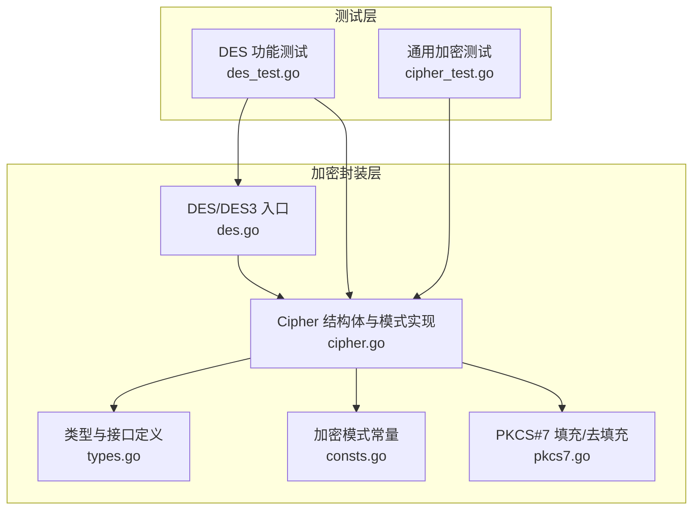
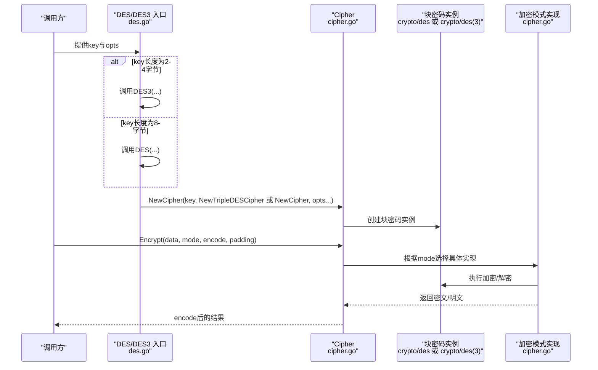
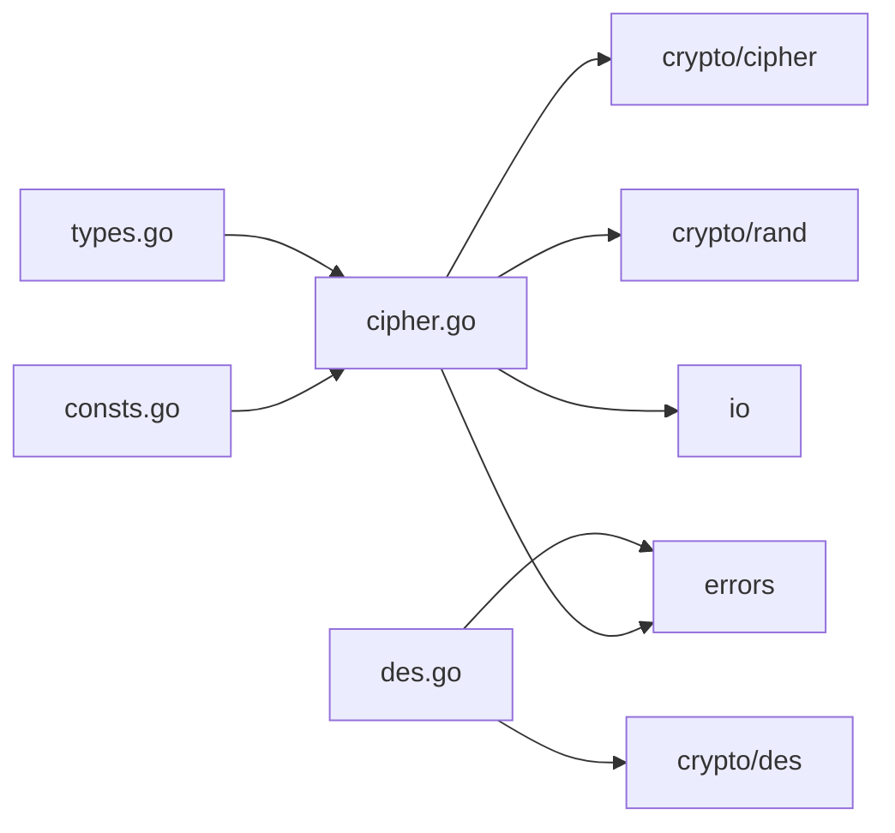

# 3DES加密算法

<cite>
**本文引用的文件列表**
- [des.go](file://des.go)
- [cipher.go](file://cipher.go)
- [types.go](file://types.go)
- [consts.go](file://consts.go)
- [pkcs7.go](file://pkcs7.go)
- [des_test.go](file://des_test.go)
- [cipher_test.go](file://cipher_test.go)
- [README.md](file://README.md)
</cite>

## 目录

1. [简介](#简介)
2. [项目结构](#项目结构)
3. [核心组件](#核心组件)
4. [架构总览](#架构总览)
5. [详细组件分析](#详细组件分析)
6. [依赖关系分析](#依赖关系分析)
7. [性能与安全考量](#性能与安全考量)
8. [故障排查指南](#故障排查指南)
9. [结论](#结论)
10. [附录：使用示例与最佳实践](#附录使用示例与最佳实践)

## 简介

本文件围绕仓库中的3DES（Triple
DES）实现，系统梳理其工作原理、密钥模式、密钥长度、加密模式、错误处理与使用示例，并结合现代密码学背景讨论其现状与迁移建议。读者无需深入密码学背景，亦可基于本文完成3DES的正确使用与排错。

## 项目结构

本仓库提供了统一的对称加密封装，支持DES与3DES两种算法，以及多种分组密码模式（ECB、CBC、CTR、CFB、OFB）。核心实现位于以下文件：

- des.go：提供DES与3DES入口，负责密钥长度校验与Cipher实例构造
- cipher.go：通用Cipher结构体与各加密模式的具体实现
- types.go：类型定义（加密模式、编码/解码、填充/去填充、密码块工厂）
- consts.go：加密模式常量定义
- pkcs7.go：PKCS#7填充与去填充工具
- des_test.go、cipher_test.go：功能与回归测试样例

图表来源

- [des.go](file://des.go#L1-L45)
- [cipher.go](file://cipher.go#L1-L498)
- [types.go](file://types.go#L44-L74)
- [consts.go](file://consts.go#L4-L10)
- [pkcs7.go](file://pkcs7.go#L8-L30)
- [des_test.go](file://des_test.go#L10-L82)
- [cipher_test.go](file://cipher_test.go#L10-L62)

章节来源

- [des.go](file://des.go#L1-L45)
- [cipher.go](file://cipher.go#L1-L498)
- [types.go](file://types.go#L44-L74)
- [consts.go](file://consts.go#L4-L10)
- [pkcs7.go](file://pkcs7.go#L8-L30)
- [des_test.go](file://des_test.go#L10-L82)
- [cipher_test.go](file://cipher_test.go#L10-L62)

## 核心组件

- DES/3DES入口
    - DES(key, isRandIV...)：当key长度为8字节时走DES；当为24字节时自动走3DES
    - DES3(key, isRandIV...)：强制使用3DES，key必须为24字节
- Cipher结构体
    - 统一封装密钥、IV、块密码实例与各模式加密/解密方法
    - 支持随机IV与固定IV两种模式
- 加密模式
    - ECB、CBC、CTR、CFB、OFB五种模式，均基于底层crypto/cipher实现
- 填充与去填充
    - 默认采用PKCS#7填充，确保明文长度满足块大小要求

章节来源

- [des.go](file://des.go#L8-L44)
- [cipher.go](file://cipher.go#L20-L498)
- [consts.go](file://consts.go#L4-L10)
- [pkcs7.go](file://pkcs7.go#L8-L30)

## 架构总览

下图展示DES/3DES入口如何选择底层块密码实现，并驱动Cipher完成加密/解密流程。

图表来源

- [des.go](file://des.go#L12-L44)
- [cipher.go](file://cipher.go#L32-L498)

## 详细组件分析

### 3DES工作原理与密钥模式

- 工作原理
    - 3DES通过对数据进行三次DES变换来提升安全性，典型流程为“加密-解密-加密”（EDE）
    - 本实现通过底层块密码工厂选择Triple DES实现，从而达到三次DES的效果
- 密钥长度与组合
    - 3DES密钥长度为24字节（两组8字节密钥的组合，或视为两组独立密钥）
    - 本实现仅支持24字节密钥；若传入其他长度将直接报错
- 三种常见密钥模式的差异与安全影响
    - EDE（Encrypt-Decrypt-Encrypt）：最常用且安全性最高，能抵御中间人攻击
    - EEE（Encrypt-Encrypt-Encrypt）：安全性较低，易受特定攻击
    - DED（Decrypt-Decrypt-Decrypt）：安全性较低，不推荐使用
    - 本实现默认使用EDE（通过Triple DES实现），不暴露显式配置选项

章节来源

- [des.go](file://des.go#L12-L44)
- [cipher.go](file://cipher.go#L32-L44)

### 密钥管理与IV策略

- 密钥长度校验
    - DES：8字节
    - 3DES：24字节
    - 其他长度将触发错误
- IV策略
    - 固定IV：从密钥派生（块大小为8字节）或通过 WithIV 选项设置
    - 随机IV：isRandIV=true时，每次加密随机生成8字节IV并置于密文开头，解密时自动提取
- 错误处理
    - 未设置密钥、IV长度不匹配、密文格式异常等情况均有明确错误提示

章节来源

- [des.go](file://des.go#L13-L26)
- [des.go](file://des.go#L33-L43)
- [cipher.go](file://cipher.go#L43-L58)
- [cipher.go](file://cipher.go#L68-L99)

### 加密模式详解与特点

- ECB（电子密码本）
    - 优点：简单、并行友好
    - 缺点：相同明文块产生相同密文块，易受统计分析
    - 适用场景：短且无规律的明文片段
- CBC（密码分组链接）
    - 优点：引入IV与前一分组密文，避免重复模式
    - 要求：明文需PKCS#7填充
- CTR（计数器模式）
    - 优点：可并行、无填充需求
    - 注意：计数器重用会导致严重安全问题
- CFB（密码反馈）
    - 优点：流式处理、可变长度
    - 注意：错误传播特性
- OFB（输出反馈）
    - 优点：与CFB类似但无错误传播
    - 注意：同样存在计数器重用风险

章节来源

- [cipher.go](file://cipher.go#L10-L19)
- [cipher.go](file://cipher.go#L101-L137)
- [cipher.go](file://cipher.go#L139-L208)
- [cipher.go](file://cipher.go#L210-L279)
- [cipher.go](file://cipher.go#L281-L350)
- [cipher.go](file://cipher.go#L352-L421)

### 数据填充与去填充

- PKCS#7填充
    - 填充值为“缺少的字节数”，范围1至块大小
- 去填充
    - 读取末字节作为填充长度，校验合法性并裁剪

章节来源

- [pkcs7.go](file://pkcs7.go#L8-L30)

### 错误处理与边界条件

- 密钥长度非法
- IV长度不匹配
- 密文过短或非块大小倍数
- 未设置密钥或IV
- 去填充失败（如末字节值越界）

章节来源

- [des.go](file://des.go#L13-L18)
- [des.go](file://des.go#L33-L36)
- [cipher.go](file://cipher.go#L43-L58)
- [cipher.go](file://cipher.go#L68-L99)
- [cipher.go](file://cipher.go#L183-L195)
- [cipher.go](file://cipher.go#L254-L266)
- [cipher.go](file://cipher.go#L334-L337)
- [cipher.go](file://cipher.go#L405-L408)
- [pkcs7.go](file://pkcs7.go#L18-L30)

## 依赖关系分析

- des.go依赖
    - crypto/des：底层DES/Triple DES实现
    - errors：统一错误包装与追踪
- cipher.go依赖
    - crypto/cipher：CBC/CTR/CFB/OFB模式
    - crypto/rand：随机IV生成
    - errors：统一错误包装
    - io：读取随机源
- types.go与consts.go提供类型与常量支撑

图表来源

- [des.go](file://des.go#L3-L6)
- [cipher.go](file://cipher.go#L3-L8)
- [types.go](file://types.go#L3-L4)
- [consts.go](file://consts.go#L1-L1)

章节来源

- [des.go](file://des.go#L3-L6)
- [cipher.go](file://cipher.go#L3-L8)
- [types.go](file://types.go#L3-L4)
- [consts.go](file://consts.go#L1-L1)

## 性能与安全考量

- 性能
    - 3DES相较AES更慢，且为三次DES变换
    - ECB模式可并行处理，但安全性低；CBC/CTR/CFB/OFB需顺序处理或计数器管理
- 安全性
    - 3DES已不再推荐用于新系统，建议迁移到AES（AES-128/192/256）
    - 若必须使用3DES，请优先选择CBC/CTR模式，避免ECB
    - 严格避免计数器重用与IV重用

章节来源

- [cipher.go](file://cipher.go#L10-L19)

## 故障排查指南

- “密钥长度非法”
    - 确认DES使用8字节密钥，3DES使用24字节密钥
- “IV长度不匹配”
    - DES模式IV应为8字节；若使用随机IV，确认isRandIV设置正确
- “密文过短或非块大小倍数”
    - 检查编码/解码链路是否完整，确认密文包含IV（当isRandIV为true时）
- “去填充失败”
    - 检查填充是否一致（PKCS#7），以及明文是否被截断

章节来源

- [des.go](file://des.go#L13-L18)
- [des.go](file://des.go#L33-L36)
- [cipher.go](file://cipher.go#L68-L99)
- [cipher.go](file://cipher.go#L183-L195)
- [cipher.go](file://cipher.go#L254-L266)
- [cipher.go](file://cipher.go#L334-L337)
- [cipher.go](file://cipher.go#L405-L408)
- [pkcs7.go](file://pkcs7.go#L18-L30)

## 结论

本实现提供了简洁、健壮的3DES封装，覆盖DES与3DES两种路径、五种常见模式与PKCS#7填充。对于新系统，建议优先采用AES；若必须使用3DES，请遵循本文的安全与性能建议，并在迁移计划中逐步替换为AES。

## 附录：使用示例与最佳实践

- 示例思路（不直接展示代码）
    - 准备密钥：DES使用8字节，3DES使用24字节
    - 选择模式：CBC/CTR优先，避免ECB
    - 设置IV：推荐isRandIV=true并使用默认IV派生策略
    - 编码：使用Base64等安全编码保存密文
    - 填充：默认PKCS#7，确保明文长度满足块大小
    - 错误处理：捕获并记录所有错误，定位密钥/IV/编码问题
- 测试参考
    - des_test.go展示了DES/3DES在多种模式下的加解密与回环校验
    - cipher_test.go展示了通用加密流程与模式切换

章节来源

- [des_test.go](file://des_test.go#L10-L82)
- [cipher_test.go](file://cipher_test.go#L10-L62)