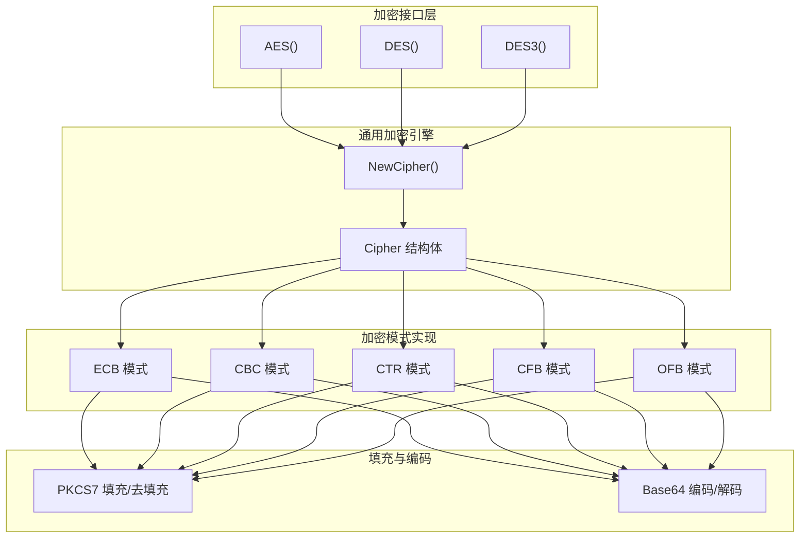
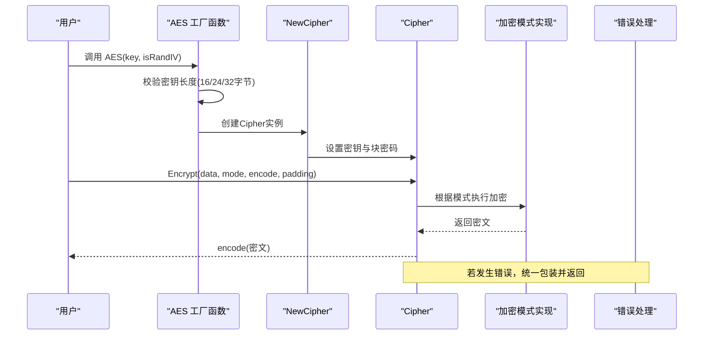
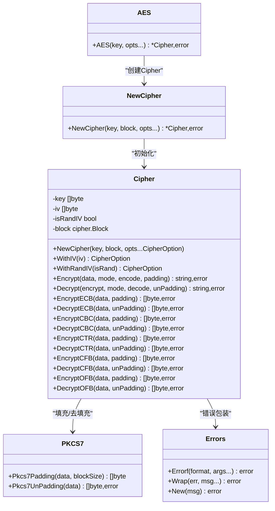

# AES加密算法

<cite>
**本文档引用的文件**
- [aes.go](file://aes.go)
- [cipher.go](file://cipher.go)
- [cipher_test.go](file://cipher_test.go)
- [aes_test.go](file://aes_test.go)
- [types.go](file://types.go)
- [consts.go](file://consts.go)
- [pkcs7.go](file://pkcs7.go)
- [errors.go](file://errors/errors.go)
- [des.go](file://des.go)
- [des_test.go](file://des_test.go)
</cite>

## 目录

1. [简介](#简介)
2. [项目结构](#项目结构)
3. [核心组件](#核心组件)
4. [架构总览](#架构总览)
5. [详细组件分析](#详细组件分析)
6. [依赖关系分析](#依赖关系分析)
7. [性能考虑](#性能考虑)
8. [故障排除指南](#故障排除指南)
9. [结论](#结论)
10. [附录](#附录)

## 简介

本文件系统性地阐述AES（高级加密标准）算法在该Go工具库中的实现与使用方法。内容涵盖：

- AES工作原理与密钥长度要求（128位、192位、256位）及其对应的加密强度差异
- 三种密钥长度的使用场景与性能表现
- 加密轮数与密钥长度的关系
- 初始化向量（IV）的作用与随机IV生成机制
- 完整的加密/解密使用示例（含密钥验证、加密流程、解密流程、错误处理）
- 不同加密模式（ECB、CBC、CTR、CFB、OFB）的表现与适用场景

## 项目结构

该工具库采用模块化设计，围绕对称分组加密算法提供统一接口，支持AES、DES与3DES。AES实现位于独立文件中，通过通用的Cipher结构体封装不同模式的加密/解密逻辑。

图表来源

- [aes.go](file://aes.go#L12-L22)
- [cipher.go](file://cipher.go#L20-L40)
- [cipher.go](file://cipher.go#L101-L421)
- [pkcs7.go](file://pkcs7.go#L8-L30)
- [consts.go](file://consts.go#L4-L10)

章节来源

- [aes.go](file://aes.go#L1-L23)
- [cipher.go](file://cipher.go#L1-L498)
- [consts.go](file://consts.go#L1-L23)

## 核心组件

- AES工厂函数：根据密钥长度自动选择AES-128/192/256，并可配置是否随机生成IV
- Cipher结构体：封装密钥、IV、块密码实例与各模式的加解密方法
- 加密模式：ECB、CBC、CTR、CFB、OFB
- 填充与编码：PKCS7填充/去填充，Base64编码/解码
- 错误处理：统一的包装错误类型，支持堆栈追踪

章节来源

- [aes.go](file://aes.go#L12-L22)
- [cipher.go](file://cipher.go#L20-L498)
- [types.go](file://types.go#L46-L74)
- [consts.go](file://consts.go#L4-L10)
- [pkcs7.go](file://pkcs7.go#L8-L30)
- [errors.go](file://errors/errors.go#L14-L53)

## 架构总览

AES实现遵循“工厂函数 + 通用引擎 + 模式适配”的架构。工厂函数负责密钥长度校验与IV策略，通用引擎负责密钥设置、IV校验与各模式的具体实现，模式实现复用标准库的cipher.Block与流式接口。

图表来源

- [aes.go](file://aes.go#L12-L22)
- [cipher.go](file://cipher.go#L32-L58)
- [cipher.go](file://cipher.go#L423-L460)

## 详细组件分析

### AES工厂函数与密钥长度校验

- 支持的密钥长度：16字节（AES-128）、24字节（AES-192）、32字节（AES-256）
- 错误处理：当密钥长度不在允许范围内时，返回明确的错误信息
- IV策略：isRandIV为true时，加密结果在密文开头附加随机IV；解密时自动从密文提取IV

章节来源

- [aes.go](file://aes.go#L12-L22)
- [cipher.go](file://cipher.go#L42-L58)
- [cipher.go](file://cipher.go#L68-L84)

### Cipher结构体与通用接口

- 字段：key（密钥）、iv（初始化向量）、isRandIV（是否随机IV）、block（块密码实例）
- 方法：Encrypt、Decrypt、各模式加密/解密方法（IV通过CipherOption在构造时配置）
- 校验逻辑：若未设置密钥或IV长度不匹配，统一报错

章节来源

- [cipher.go](file://cipher.go#L20-L25)
- [cipher.go](file://cipher.go#L42-L84)
- [cipher.go](file://cipher.go#L423-L497)

### 加密模式实现（ECB/CBC/CTR/CFB/OFB）

- ECB：无需IV，直接对每个16字节块进行加密/解密
- CBC：需要IV，使用CBC加密器/解密器，支持随机IV
- CTR：计数器模式，使用流式接口，支持随机IV
- CFB：密码反馈模式，使用流式接口，支持随机IV
- OFB：输出反馈模式，使用流式接口，支持随机IV

章节来源

- [cipher.go](file://cipher.go#L101-L137)
- [cipher.go](file://cipher.go#L139-L208)
- [cipher.go](file://cipher.go#L210-L279)
- [cipher.go](file://cipher.go#L281-L350)
- [cipher.go](file://cipher.go#L352-L421)

### 填充与编码（PKCS7与Base64）

- PKCS7填充：确保明文长度为16字节的倍数
- PKCS7去填充：从密文末尾移除填充
- Base64编码/解码：便于传输与存储

章节来源

- [pkcs7.go](file://pkcs7.go#L8-L30)
- [cipher_test.go](file://cipher_test.go#L25-L29)
- [aes_test.go](file://aes_test.go#L27-L36)

### 错误处理与日志追踪

- 统一的包装错误类型，支持错误链与堆栈追踪
- 在关键路径上进行错误包装，便于定位问题

章节来源

- [errors.go](file://errors/errors.go#L14-L53)
- [cipher.go](file://cipher.go#L36-L55)
- [cipher.go](file://cipher.go#L158-L160)

## 依赖关系分析

图表来源

- [aes.go](file://aes.go#L12-L22)
- [cipher.go](file://cipher.go#L32-L58)
- [cipher.go](file://cipher.go#L101-L421)
- [pkcs7.go](file://pkcs7.go#L8-L30)
- [errors.go](file://errors/errors.go#L14-L53)

## 性能考虑

- 加密轮数与密钥长度：AES-128使用10轮、AES-192使用12轮、AES-256使用14轮。轮数越多，安全性越高但性能越低
- 模式选择：
    - ECB：简单快速，但安全性较低，不推荐用于长文本或重复模式数据
    - CBC/CTR/CFB/OFB：适合大多数场景，CTR通常具有较好的并发与性能特性
- IV策略：随机IV增加安全性，但会带来额外的存储开销（IV长度为16字节）

章节来源

- [cipher.go](file://cipher.go#L10-L18)
- [cipher.go](file://cipher.go#L156-L162)
- [cipher.go](file://cipher.go#L227-L233)

## 故障排除指南

常见问题与解决建议：

- 密钥长度错误：确保密钥长度为16、24或32字节
- IV长度错误：CBC/CTR/CFB/OFB模式下IV长度必须为16字节
- 随机IV：启用isRandIV时，解密端会自动从密文头部提取IV
- 填充异常：确认使用PKCS7填充/去填充，避免手动处理
- 模式错误：检查传入的加密模式是否为ECB、CBC、CTR、CFB或OFB之一

章节来源

- [aes.go](file://aes.go#L14-L16)
- [cipher.go](file://cipher.go#L92-L95)
- [cipher.go](file://cipher.go#L156-L162)
- [cipher.go](file://cipher.go#L227-L233)
- [cipher.go](file://cipher.go#L451-L453)

## 结论

该AES实现提供了简洁而强大的接口，支持多种加密模式与填充方案，并通过统一的错误处理机制提升了可靠性。在实际应用中，应根据安全需求与性能要求选择合适的密钥长度与加密模式，并正确管理IV与填充。

## 附录

### AES密钥长度与轮数对照表

- AES-128：16字节密钥，10轮加密
- AES-192：24字节密钥，12轮加密
- AES-256：32字节密钥，14轮加密

章节来源

- [cipher.go](file://cipher.go#L16-L17)

### 加密模式对比与适用场景

- ECB：适合短文本且无重复模式的场景，安全性最低
- CBC：适合大多数通用场景，需注意IV管理
- CTR：适合高并发与流式数据，性能较好
- CFB/OFB：适合流式数据与实时通信

章节来源

- [cipher.go](file://cipher.go#L10-L15)
- [consts.go](file://consts.go#L4-L10)

### 使用示例（基于测试用例）

以下示例展示了如何使用AES进行加密与解密，包括密钥验证、加密流程、解密流程与错误处理。示例均来自单元测试，展示了不同密钥长度与模式的组合。

- AES-128（CBC/ECB/CTR/CFB/OFB）：参考测试用例
- AES-192（CBC/ECB/CTR/CFB/OFB）：参考测试用例
- AES-256（CBC/ECB/CTR/CFB/OFB）：参考测试用例
- 随机IV（isRandIV=true）：参考测试用例

章节来源

- [aes_test.go](file://aes_test.go#L10-L94)
- [aes_test.go](file://aes_test.go#L96-L147)
- [cipher_test.go](file://cipher_test.go#L10-L61)

### IV作用与随机IV生成机制

- IV作用：确保相同明文在不同加密中产生不同的密文，提升安全性
- 随机IV：isRandIV=true时，加密前随机生成16字节IV并附加到密文开头；解密时自动从密文提取IV

章节来源

- [cipher.go](file://cipher.go#L22-L23)
- [cipher.go](file://cipher.go#L156-L162)
- [cipher.go](file://cipher.go#L227-L233)
- [cipher.go](file://cipher.go#L298-L304)
- [cipher.go](file://cipher.go#L369-L375)