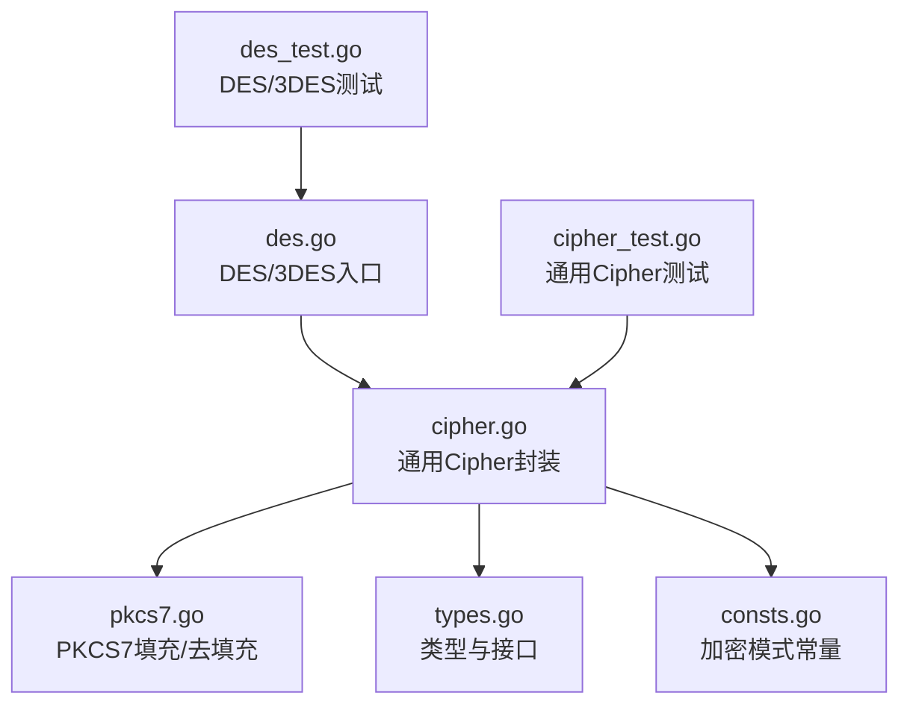
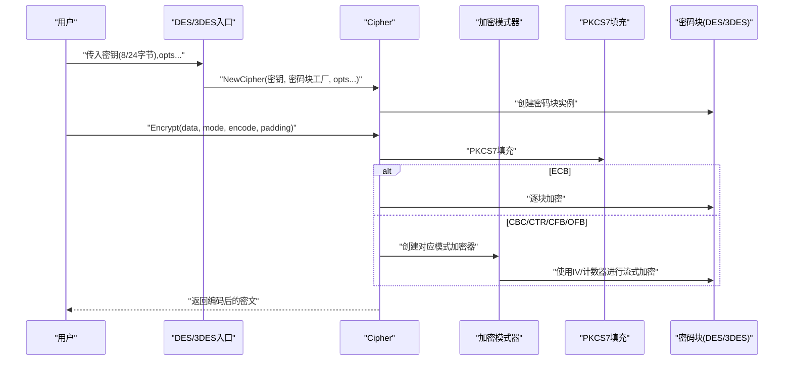
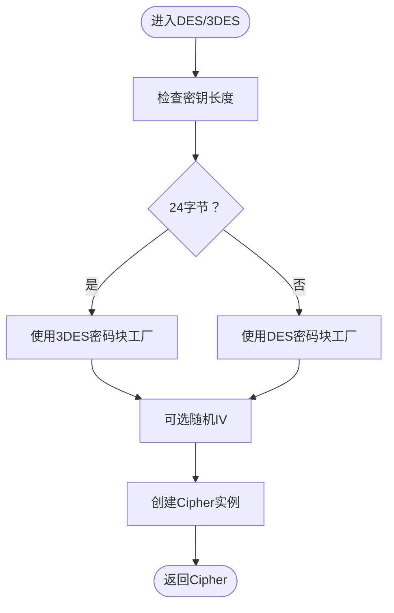
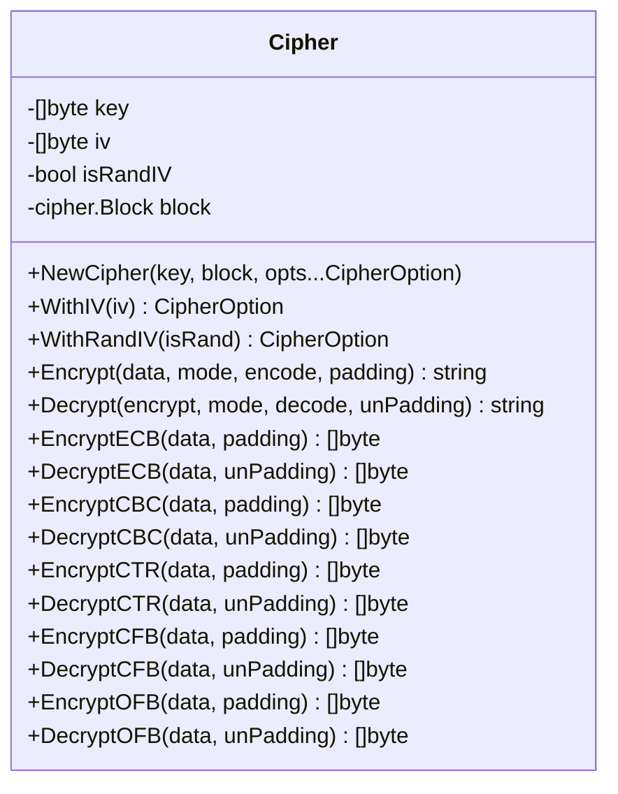
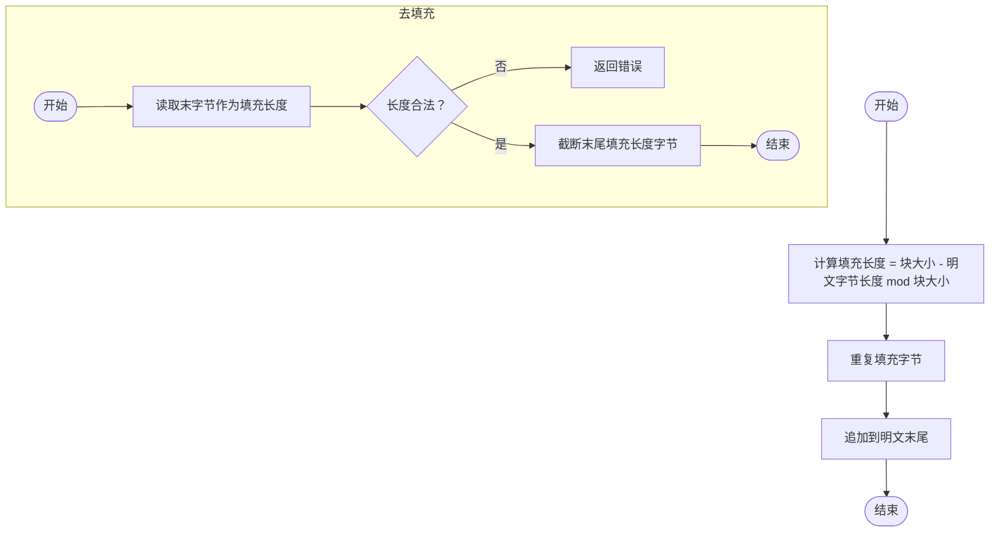
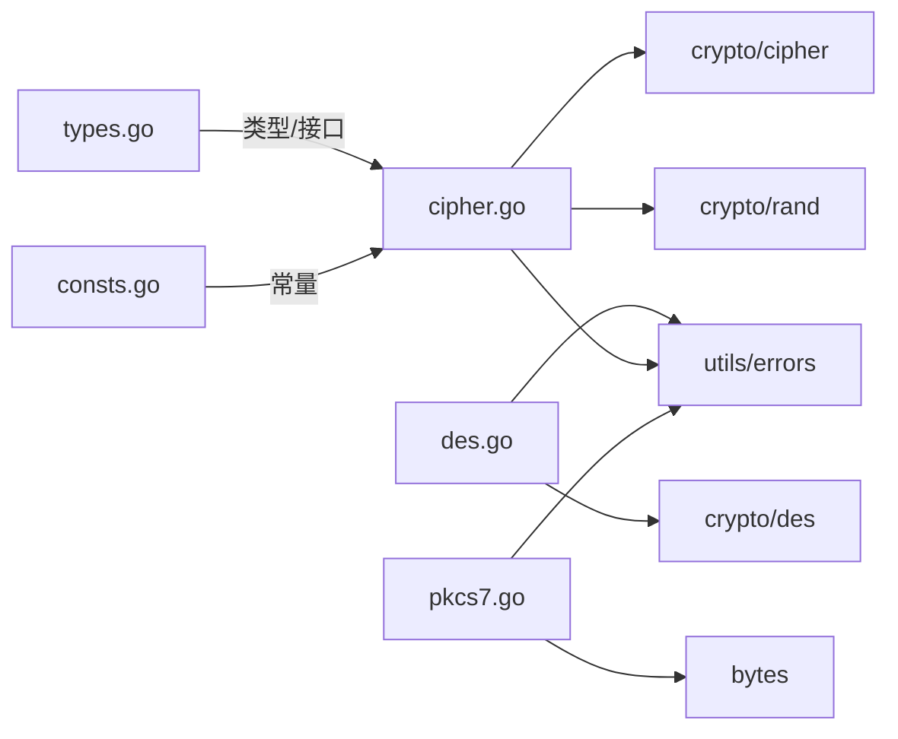

# DES加密算法

<cite>
**本文档引用的文件**
- [des.go](file://des.go)
- [cipher.go](file://cipher.go)
- [pkcs7.go](file://pkcs7.go)
- [types.go](file://types.go)
- [consts.go](file://consts.go)
- [des_test.go](file://des_test.go)
- [cipher_test.go](file://cipher_test.go)
</cite>

## 目录

1. [简介](#简介)
2. [项目结构](#项目结构)
3. [核心组件](#核心组件)
4. [架构总览](#架构总览)
5. [详细组件分析](#详细组件分析)
6. [依赖关系分析](#依赖关系分析)
7. [性能考量](#性能考量)
8. [故障排查指南](#故障排查指南)
9. [结论](#结论)
10. [附录](#附录)

## 简介

本文件系统性梳理仓库中DES加密算法的实现与使用，覆盖DES与3DES的密钥长度要求、分组长度、加密模式（ECB/CBC/CTR/CFB/OFB）、填充方案（PKCS7）、错误处理与密钥管理实践。同时给出基于仓库实现的完整使用流程与最佳实践，帮助读者在理解DES工作原理的同时，安全地选择与使用加密模式。

## 项目结构

DES相关功能集中在以下文件中：

- des.go：DES与3DES入口封装，负责密钥长度校验与Cipher实例构造
- cipher.go：通用对称加密封装（AES/DES/3DES），统一提供多种加密模式与填充/去填充
- pkcs7.go：PKCS7填充与去填充工具
- types.go：类型别名与接口定义（加密模式、编码/解码、填充/去填充、密码块工厂）
- consts.go：加密模式常量定义（ECB/CBC/CTR/CFB/OFB）
- des_test.go：DES/3DES多模式端到端测试样例
- cipher_test.go：通用Cipher多模式测试样例（便于对比）

图表来源

- [des.go](file://des.go#L1-L45)
- [cipher.go](file://cipher.go#L1-L498)
- [pkcs7.go](file://pkcs7.go#L1-L31)
- [types.go](file://types.go#L1-L98)
- [consts.go](file://consts.go#L1-L23)
- [des_test.go](file://des_test.go#L1-L82)
- [cipher_test.go](file://cipher_test.go#L1-L62)

章节来源

- [des.go](file://des.go#L1-L45)
- [cipher.go](file://cipher.go#L1-L498)
- [pkcs7.go](file://pkcs7.go#L1-L31)
- [types.go](file://types.go#L1-L98)
- [consts.go](file://consts.go#L1-L23)
- [des_test.go](file://des_test.go#L1-L82)
- [cipher_test.go](file://cipher_test.go#L1-L62)

## 核心组件

- DES/3DES入口
    - DES：支持8字节密钥；若传入24字节则自动降级为3DES
    - DES3：仅支持24字节密钥
- Cipher通用封装
    - 支持AES/DES/3DES三种密码块
    - 提供ECB/CBC/CTR/CFB/OFB五种模式
    - 自动处理IV（可选随机IV并置于密文头部）
    - 统一填充/去填充接口
- PKCS7填充
    - 明确的填充与去填充逻辑，保证解密一致性
- 类型与常量
    - McryptMode枚举与Encode/Decode/Padding/UnPadding函数签名
    - ECB/CBC/CTR/CFB/OFB常量

章节来源

- [des.go](file://des.go#L8-L27)
- [des.go](file://des.go#L29-L44)
- [cipher.go](file://cipher.go#L20-L58)
- [cipher.go](file://cipher.go#L101-L137)
- [cipher.go](file://cipher.go#L139-L208)
- [cipher.go](file://cipher.go#L210-L279)
- [cipher.go](file://cipher.go#L281-L350)
- [cipher.go](file://cipher.go#L352-L421)
- [cipher.go](file://cipher.go#L423-L497)
- [pkcs7.go](file://pkcs7.go#L8-L30)
- [types.go](file://types.go#L46-L74)
- [consts.go](file://consts.go#L4-L10)

## 架构总览

DES/3DES通过DES入口函数创建Cipher实例，Cipher再根据模式选择具体加密器（CBC/CTR/CFB/OFB）或直接对明文分组进行ECB加密。所有模式均支持PKCS7填充，CBC/CTR/CFB/OFB模式可配置IV或随机IV。

图表来源

- [des.go](file://des.go#L12-L26)
- [des.go](file://des.go#L33-L43)
- [cipher.go](file://cipher.go#L423-L460)
- [cipher.go](file://cipher.go#L101-L137)
- [cipher.go](file://cipher.go#L139-L208)
- [cipher.go](file://cipher.go#L210-L279)
- [cipher.go](file://cipher.go#L281-L350)
- [cipher.go](file://cipher.go#L352-L421)
- [pkcs7.go](file://pkcs7.go#L8-L15)

## 详细组件分析

### DES/3DES入口与密钥处理

- DES
    - 8字节密钥：直接使用DES密码块
    - 24字节密钥：自动切换为3DES密码块
    - 可选isRandIV：随机生成IV并置于密文头部
- DES3
    - 严格24字节密钥
    - 可选isRandIV：随机生成IV并置于密文头部
- 错误处理
    - 密钥长度非法时返回明确错误
    - 密码块创建失败时包装错误

图表来源

- [des.go](file://des.go#L12-L26)
- [des.go](file://des.go#L33-L43)

章节来源

- [des.go](file://des.go#L8-L27)
- [des.go](file://des.go#L29-L44)

### Cipher通用封装与加密模式

- Cipher结构
    - key/iv/isRandIV/block字段
    - WithIV/WithRandIV等CipherOption辅助配置
- 模式实现
    - ECB：逐块加密，无需IV
    - CBC：CBC加密器，支持随机IV
    - CTR：计数器流加密，支持随机IV
    - CFB：反馈流加密，支持随机IV
    - OFB：输出反馈流加密，支持随机IV
- 填充策略
    - 统一使用PKCS7填充，确保解密一致性
- 错误处理
    - 密钥/IV长度校验、随机IV读取失败、密文长度校验等

图表来源

- [cipher.go](file://cipher.go#L20-L58)
- [cipher.go](file://cipher.go#L101-L137)
- [cipher.go](file://cipher.go#L139-L208)
- [cipher.go](file://cipher.go#L210-L279)
- [cipher.go](file://cipher.go#L281-L350)
- [cipher.go](file://cipher.go#L352-L421)
- [cipher.go](file://cipher.go#L423-L497)

章节来源

- [cipher.go](file://cipher.go#L20-L58)
- [cipher.go](file://cipher.go#L101-L137)
- [cipher.go](file://cipher.go#L139-L208)
- [cipher.go](file://cipher.go#L210-L279)
- [cipher.go](file://cipher.go#L281-L350)
- [cipher.go](file://cipher.go#L352-L421)
- [cipher.go](file://cipher.go#L423-L497)

### PKCS7填充与去填充

- 填充
    - 根据块大小计算填充长度，重复填充字节
- 去填充
    - 读取末字节作为填充长度，截断末尾字节
    - 异常情况返回错误（空数据、填充长度越界）

图表来源

- [pkcs7.go](file://pkcs7.go#L8-L15)
- [pkcs7.go](file://pkcs7.go#L17-L30)

章节来源

- [pkcs7.go](file://pkcs7.go#L8-L30)

### 加密模式详解

- ECB
    - 优点：简单、并行友好
    - 缺点：相同明文块产生相同密文块，易受统计攻击
- CBC
    - 优点：引入IV，避免重复明文块产生相同密文块
    - 注意：需正确处理IV与密文长度
- CTR
    - 优点：流式、可并行、无填充
    - 注意：计数器与IV需唯一
- CFB/OFB
    - 优点：流式、可并行
    - 注意：IV/计数器与密文长度校验

章节来源

- [cipher.go](file://cipher.go#L101-L137)
- [cipher.go](file://cipher.go#L139-L208)
- [cipher.go](file://cipher.go#L210-L279)
- [cipher.go](file://cipher.go#L281-L350)
- [cipher.go](file://cipher.go#L352-L421)

### 使用示例（基于仓库测试）

- DES/3DES多模式端到端测试
    - 支持ECB/CBC/CTR/CFB/OFB
    - 使用Base64编解码与PKCS7填充/去填充
    - 验证加密后数据与原数据一致

章节来源

- [des_test.go](file://des_test.go#L10-L81)
- [cipher_test.go](file://cipher_test.go#L10-L61)

## 依赖关系分析

- des.go依赖
    - crypto/des：DES/3DES密码块工厂
    - utils/errors：错误包装与格式化
- cipher.go依赖
    - crypto/cipher：CBC/CTR/CFB/OFB模式器
    - crypto/rand：随机IV生成
    - utils/errors：错误包装与格式化
- pkcs7.go依赖
    - bytes：字节切片重复
    - utils/errors：错误包装与格式化
- types.go/consts.go提供类型与常量支撑

图表来源

- [des.go](file://des.go#L3-L6)
- [cipher.go](file://cipher.go#L3-L8)
- [pkcs7.go](file://pkcs7.go#L3-L6)
- [types.go](file://types.go#L3)
- [consts.go](file://consts.go#L1-L23)

章节来源

- [des.go](file://des.go#L3-L6)
- [cipher.go](file://cipher.go#L3-L8)
- [pkcs7.go](file://pkcs7.go#L3-L6)
- [types.go](file://types.go#L3)
- [consts.go](file://consts.go#L1-L23)

## 性能考量

- ECB：逐块加密，适合小数据或并行场景，但安全性较低
- CBC/CTR/CFB/OFB：流式或分组链式处理，CTR通常具备良好并行性
- 填充开销：PKCS7在明文长度非块大小整数倍时增加填充字节
- IV管理：随机IV会增加密文长度，但提升安全性

## 故障排查指南

- 密钥长度错误
    - DES/3DES入口会拒绝非8/24字节密钥
- IV长度错误
    - WithIV会校验IV长度与块大小一致
- 随机IV读取失败
    - CBC/CTR/CFB/OFB在isRandIV=true时会尝试读取随机IV，失败则返回错误
- 密文长度校验
    - CBC/CTR/CFB/OFB要求密文长度为块大小整数倍
- 去填充异常
    - PKCS7UnPadding在空数据或填充长度越界时返回错误

章节来源

- [des.go](file://des.go#L13-L18)
- [des.go](file://des.go#L34-L36)
- [cipher.go](file://cipher.go#L87-L99)
- [cipher.go](file://cipher.go#L156-L162)
- [cipher.go](file://cipher.go#L255-L261)
- [cipher.go](file://cipher.go#L326-L332)
- [cipher.go](file://cipher.go#L397-L403)
- [cipher.go](file://cipher.go#L405-L407)
- [cipher.go](file://cipher.go#L423-L497)
- [pkcs7.go](file://pkcs7.go#L18-L30)

## 结论

仓库提供了简洁而健壮的DES/3DES实现，统一抽象出Cipher封装，支持多种加密模式与PKCS7填充，便于在不同场景下安全使用。尽管DES存在安全性限制，但在特定历史遗留或低强度需求场景中仍可作为过渡方案。建议优先采用更安全的AES算法，并在必要时使用3DES作为兼容性补充。

## 附录

### DES与3DES密钥与分组长度

- DES
    - 密钥长度：8字节
    - 分组长度：8字节
- 3DES
    - 密钥长度：24字节
    - 分组长度：8字节

章节来源

- [cipher.go](file://cipher.go#L16-L18)
- [des.go](file://des.go#L13-L18)
- [des.go](file://des.go#L34-L36)

### 加密模式与IV要求

- ECB：无需IV
- CBC/CTR/CFB/OFB：需要IV或随机IV
- 随机IV：isRandIV=true时，IV置于密文头部

章节来源

- [cipher.go](file://cipher.go#L10-L18)
- [cipher.go](file://cipher.go#L68-L84)
- [cipher.go](file://cipher.go#L156-L162)
- [cipher.go](file://cipher.go#L227-L233)
- [cipher.go](file://cipher.go#L298-L304)
- [cipher.go](file://cipher.go#L369-L375)

### 使用流程与最佳实践

- 密钥管理
    - 使用强随机源生成密钥
    - 严格控制密钥存储与访问权限
    - 定期轮换密钥
- IV管理
    - CBC/CTR/CFB/OFB模式建议使用随机IV
    - 若使用固定IV，确保与密钥绑定且唯一
- 填充与编码
    - 统一使用PKCS7填充
    - 使用Base64/Hex等安全编码保存密文
- 错误处理
    - 对密钥长度、IV长度、密文长度进行严格校验
    - 对随机IV读取失败与去填充异常进行捕获

章节来源

- [des.go](file://des.go#L12-L26)
- [des.go](file://des.go#L33-L43)
- [cipher.go](file://cipher.go#L423-L497)
- [pkcs7.go](file://pkcs7.go#L8-L30)
- [des_test.go](file://des_test.go#L10-L81)
- [cipher_test.go](file://cipher_test.go#L10-L61)