# 对称加密算法

<cite>
**本文档引用的文件**
- [aes.go](file://aes.go)
- [des.go](file://des.go)
- [cipher.go](file://cipher.go)
- [pkcs7.go](file://pkcs7.go)
- [consts.go](file://consts.go)
- [types.go](file://types.go)
- [aes_test.go](file://aes_test.go)
- [des_test.go](file://des_test.go)
- [cipher_test.go](file://cipher_test.go)
- [base64.go](file://base64.go)
</cite>

## 目录

1. [简介](#简介)
2. [项目结构](#项目结构)
3. [核心组件](#核心组件)
4. [架构概览](#架构概览)
5. [详细组件分析](#详细组件分析)
6. [依赖关系分析](#依赖关系分析)
7. [性能考虑](#性能考虑)
8. [故障排除指南](#故障排除指南)
9. [结论](#结论)
10. [附录](#附录)

## 简介

本项目提供了一个完整的对称加密算法实现，支持AES、DES和3DES三种主流对称加密算法。通过对称加密技术，可以实现数据的机密性保护，在现代密码学应用中发挥着重要作用。

对称加密算法具有以下特点：

- **高性能**：加密解密速度快，适合大量数据处理
- **简单易用**：算法相对简单，实现成本低
- **密钥管理挑战**：需要安全地分发和管理共享密钥
- **适用场景**：大量数据的快速加密、文件加密、数据库加密等

## 项目结构

该项目采用模块化设计，将不同的加密算法分离到独立的文件中，便于维护和扩展。

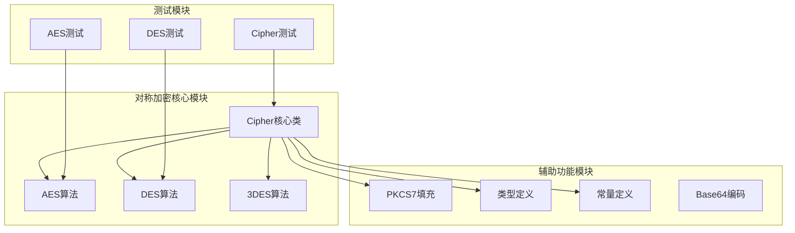

**图表来源**

- [cipher.go](file://cipher.go#L1-L498)
- [aes.go](file://aes.go#L1-L23)
- [des.go](file://des.go#L1-L45)

**章节来源**

- [cipher.go](file://cipher.go#L1-L498)
- [aes.go](file://aes.go#L1-L23)
- [des.go](file://des.go#L1-L45)

## 核心组件

### Cipher核心类

Cipher是整个对称加密系统的核心类，提供了统一的加密接口和多种加密模式支持。

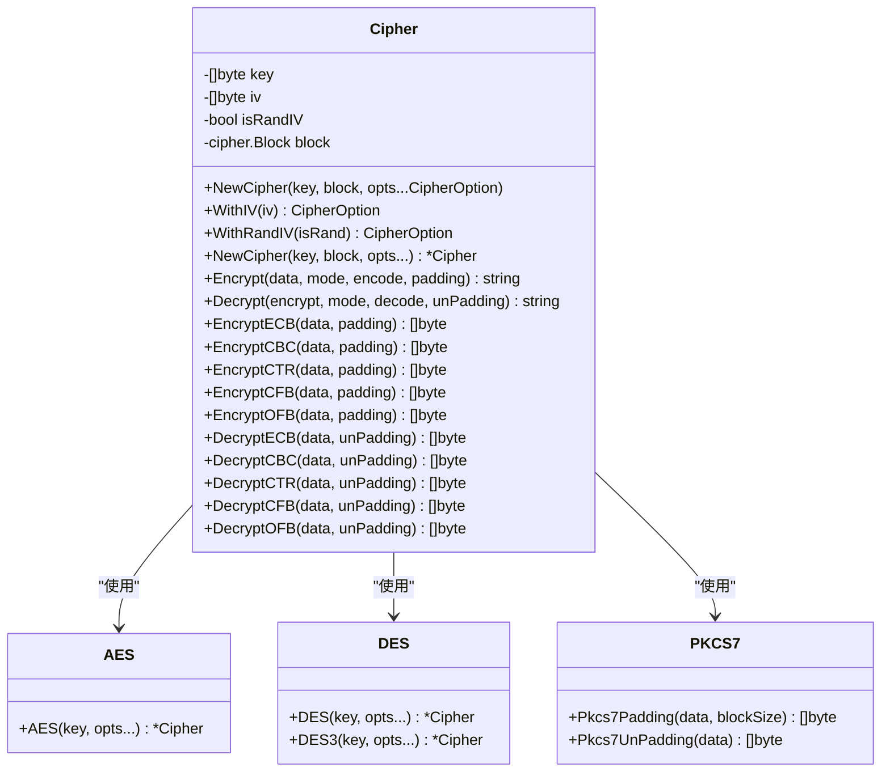

**图表来源**

- [cipher.go](file://cipher.go#L20-L25)
- [aes.go](file://aes.go#L8-L22)
- [des.go](file://des.go#L8-L44)
- [pkcs7.go](file://pkcs7.go#L8-L30)

### 加密模式支持

系统支持五种主流的对称加密模式：

| 模式  | 全称     | 特点            | 适用场景        |
|-----|--------|---------------|-------------|
| ECB | 电子密码本  | 简单并行处理，但安全性较低 | 小数据块，不需要保密性 |
| CBC | 密码分组链接 | 需要IV，安全性较高    | 大多数通用场景     |
| CTR | 计数器模式  | 流密码特性，可并行处理   | 高性能需求场景     |
| CFB | 密码反馈   | 流密码特性，错误传播    | 实时数据传输      |
| OFB | 输出反馈   | 流密码特性，无错误传播   | 需要可靠传输的场景   |

**章节来源**

- [cipher.go](file://cipher.go#L10-L18)
- [consts.go](file://consts.go#L3-L10)

## 架构概览

整个对称加密系统的架构采用分层设计，确保了良好的可扩展性和维护性。

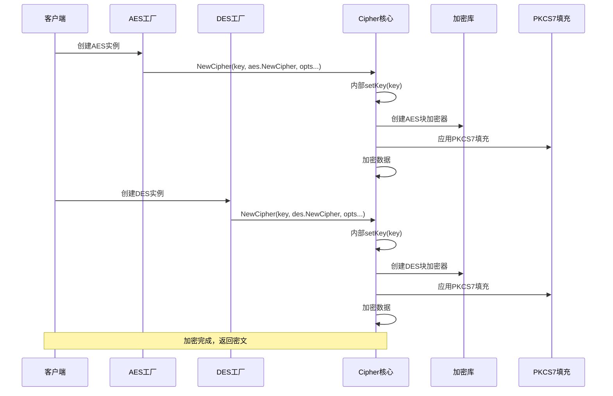

**图表来源**

- [aes.go](file://aes.go#L12-L22)
- [des.go](file://des.go#L12-L27)
- [cipher.go](file://cipher.go#L32-L58)
- [pkcs7.go](file://pkcs7.go#L8-L15)

## 详细组件分析

### AES算法实现

AES（Advanced Encryption Standard）是目前最广泛使用的对称加密算法，支持三种密钥长度。

#### AES密钥长度规格

| 密钥长度 | AES类型   | 分组轮数 | 性能特征     |
|------|---------|------|----------|
| 128位 | AES-128 | 10轮  | 最快，推荐使用  |
| 192位 | AES-192 | 12轮  | 中等性能     |
| 256位 | AES-256 | 14轮  | 较慢，最高安全性 |

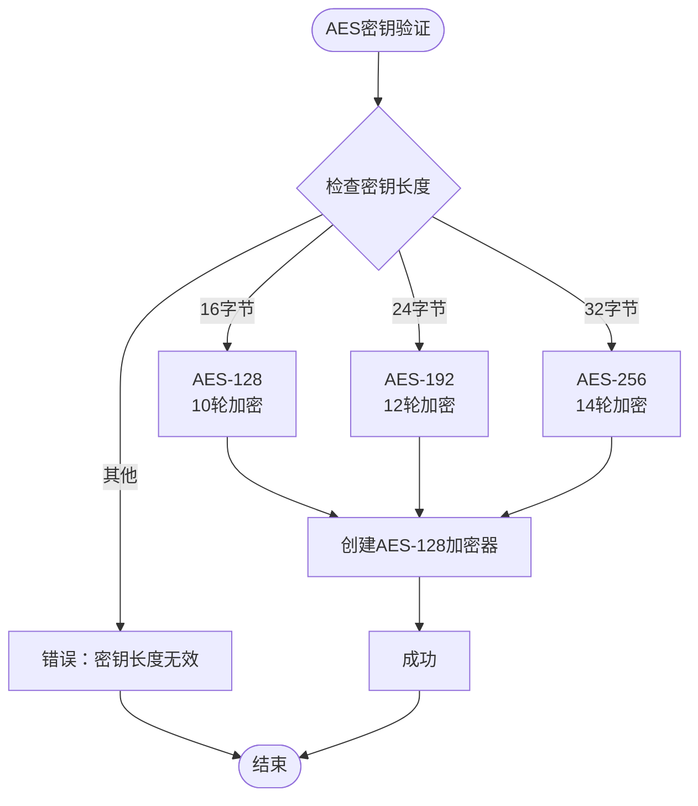

**图表来源**

- [aes.go](file://aes.go#L13-L17)
- [cipher.go](file://cipher.go#L44-L48)

#### AES加密流程

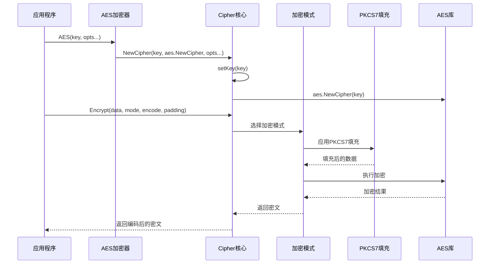

**图表来源**

- [aes.go](file://aes.go#L12-L22)
- [cipher.go](file://cipher.go#L432-L460)
- [pkcs7.go](file://pkcs7.go#L8-L15)

**章节来源**

- [aes.go](file://aes.go#L1-L23)
- [aes_test.go](file://aes_test.go#L10-L94)

### DES算法实现

DES（Data Encryption Standard）是较老的对称加密算法，由于其安全性限制，现在主要用于兼容性目的。

#### DES密钥规格

| 算法类型 | 密钥长度 | 分组长度 | 轮数   |
|------|------|------|------|
| DES  | 8字节  | 8字节  | 16轮  |
| 3DES | 24字节 | 8字节  | 168轮 |

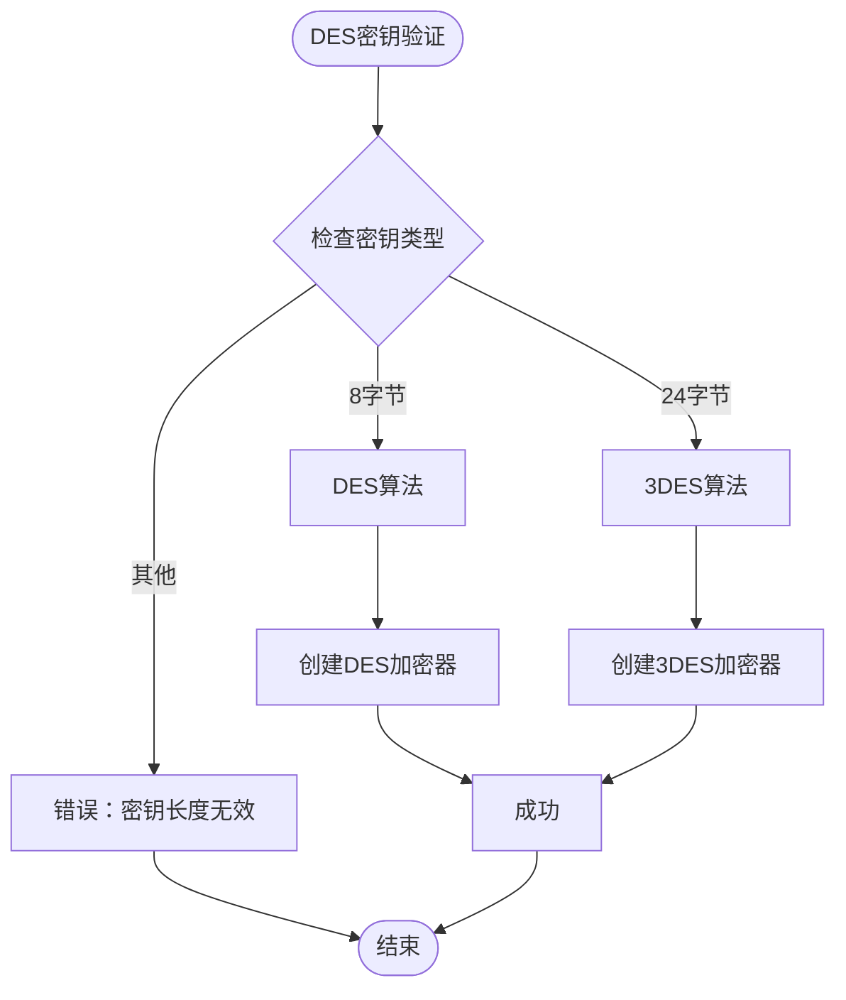

**图表来源**

- [des.go](file://des.go#L13-L19)
- [des.go](file://des.go#L33-L43)

#### DES加密模式支持

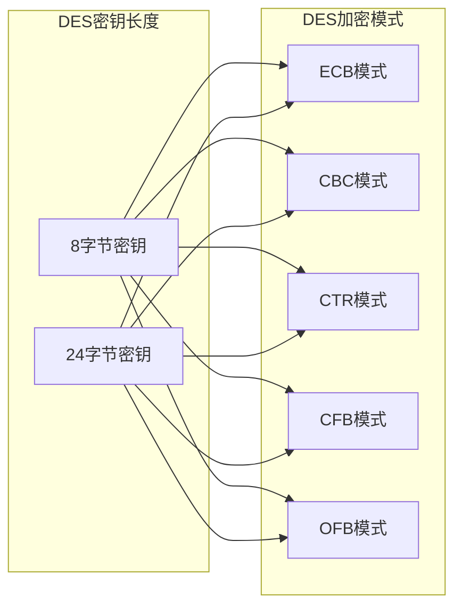

**图表来源**

- [des.go](file://des.go#L12-L27)
- [des.go](file://des.go#L33-L44)

**章节来源**

- [des.go](file://des.go#L1-L45)
- [des_test.go](file://des_test.go#L10-L82)

### Cipher核心类详解

Cipher类是整个对称加密系统的核心，提供了统一的接口和强大的功能。

#### 核心功能特性

1. **多算法支持**：通过工厂模式支持AES、DES、3DES
2. **多种加密模式**：支持ECB、CBC、CTR、CFB、OFB五种模式
3. **自动IV管理**：支持随机IV生成和管理
4. **灵活的填充机制**：支持PKCS7等填充方案
5. **编码解码支持**：内置Base64等编码支持

#### 加密流程控制

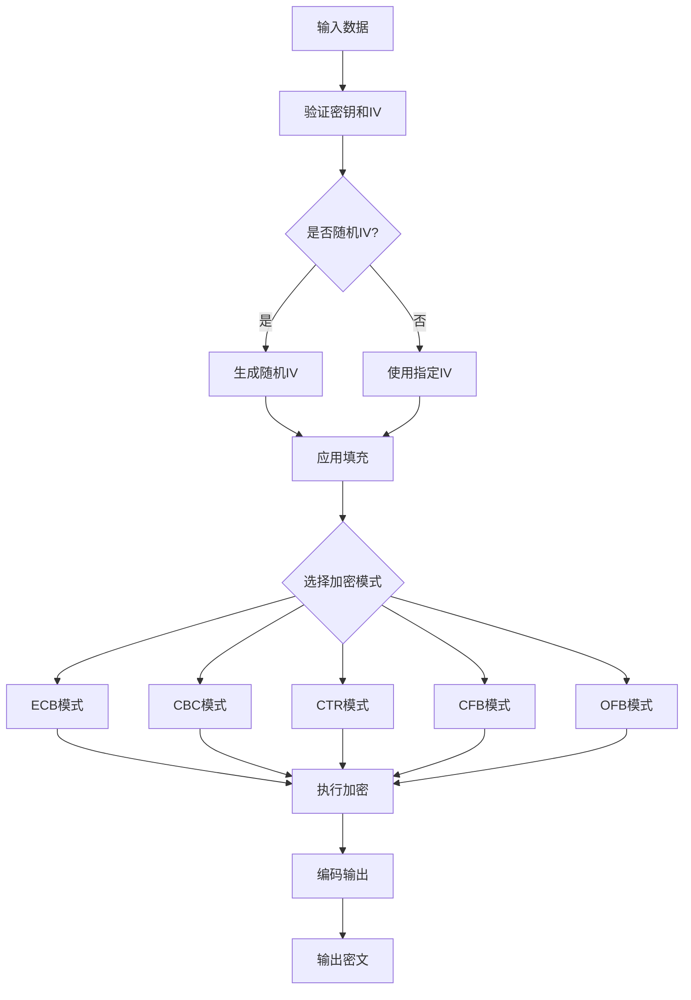

**图表来源**

- [cipher.go](file://cipher.go#L68-L84)
- [cipher.go](file://cipher.go#L139-L171)
- [cipher.go](file://cipher.go#L210-L242)

**章节来源**

- [cipher.go](file://cipher.go#L20-L498)

### PKCS7填充机制

PKCS7是标准的块加密填充方案，确保明文长度与块大小匹配。

#### 填充算法原理

```mermaid
flowchart TD
Start([明文数据]) --> CalcPad[计算填充长度]
CalcPad --> PadLen{填充长度 = 块大小 - (明文长度 % 块大小)}
PadLen --> AppendPad[追加填充字节]
AppendPad --> PadValue[填充值 = 填充长度]
PadValue --> PaddedData[填充后的数据]
PaddedData --> End([完成])
PaddedData --> RemovePad[解密后移除填充]
RemovePad --> CheckPad{检查填充字节}
CheckPad --> |填充字节值=填充长度| RemoveBytes[移除指定数量字节]
CheckPad --> |其他| Error[填充错误]
RemoveBytes --> OriginalData[原始明文]
Error --> End2([结束])
OriginalData --> End2
```

**图表来源**

- [pkcs7.go](file://pkcs7.go#L8-L15)
- [pkcs7.go](file://pkcs7.go#L17-L30)

**章节来源**

- [pkcs7.go](file://pkcs7.go#L1-L31)

## 依赖关系分析

### 模块间依赖关系

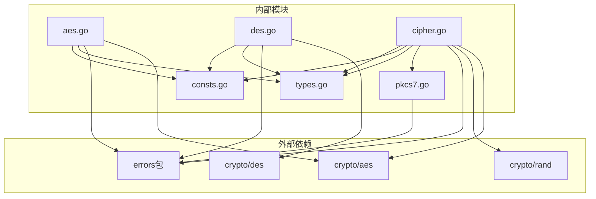

**图表来源**

- [aes.go](file://aes.go#L3-L6)
- [des.go](file://des.go#L3-L6)
- [cipher.go](file://cipher.go#L3-L8)

### 类型系统设计

系统采用了清晰的类型定义，确保编译时的安全性。

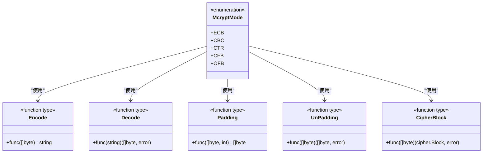

**图表来源**

- [types.go](file://types.go#L46-L74)
- [consts.go](file://consts.go#L3-L10)

**章节来源**

- [types.go](file://types.go#L1-L98)
- [consts.go](file://consts.go#L1-L23)

## 性能考虑

### 加密算法性能对比

| 算法      | 密钥长度 | 加密速度 | 安全性等级 | 推荐场景    |
|---------|------|------|-------|---------|
| AES-128 | 128位 | 最快   | 高     | 大多数应用场景 |
| AES-192 | 192位 | 中等   | 高     | 高安全性需求  |
| AES-256 | 256位 | 较慢   | 最高    | 绝密级数据   |
| DES     | 64位  | 快速   | 低     | 兼容性需求   |
| 3DES    | 168位 | 中等   | 中等    | 过渡期使用   |

### 性能优化建议

1. **选择合适的算法**：优先使用AES-128，平衡性能和安全性
2. **合理使用加密模式**：CTR模式适合高性能场景，CBC模式适合通用场景
3. **批量处理**：对大量数据进行批量加密，减少函数调用开销
4. **内存管理**：避免频繁分配内存，复用缓冲区

### 内存使用分析

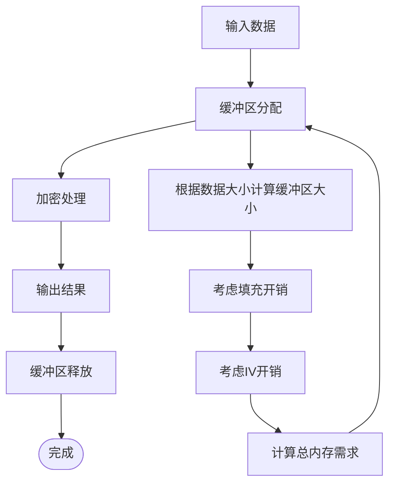

**章节来源**

- [cipher.go](file://cipher.go#L101-L119)
- [cipher.go](file://cipher.go#L139-L171)

## 故障排除指南

### 常见错误及解决方案

#### 密钥长度错误

**错误信息**：`AES秘钥的长度只能是16、24或32字节`

**解决方案**：

1. 确保密钥长度符合要求
2. 使用Base64等编码方式处理密钥
3. 验证密钥生成过程

#### IV长度错误

**错误信息**：`iv的长度只能是16个字节`

**解决方案**：

1. AES使用16字节IV，DES使用8字节IV
2. 自动IV生成时无需手动设置
3. 确保IV长度与算法要求一致

#### 加密模式错误

**错误信息**：`错误的加密模式`

**解决方案**：

1. 检查加密模式常量定义
2. 确保使用正确的模式枚举值
3. 验证模式与算法的兼容性

#### 填充错误

**错误信息**：`Pkcs7UnPadding() data 参数长度异常！`

**解决方案**：

1. 确保密文长度正确
2. 检查填充算法的一致性
3. 验证编码解码过程

**章节来源**

- [cipher.go](file://cipher.go#L69-L84)
- [cipher.go](file://cipher.go#L87-L99)
- [cipher.go](file://cipher.go#L452-L453)
- [pkcs7.go](file://pkcs7.go#L18-L30)

### 调试技巧

1. **启用详细日志**：记录加密过程的关键步骤
2. **单元测试验证**：使用提供的测试用例验证功能
3. **边界条件测试**：测试最小和最大数据长度
4. **错误场景模拟**：故意制造错误条件验证错误处理

**章节来源**

- [aes_test.go](file://aes_test.go#L10-L94)
- [des_test.go](file://des_test.go#L10-L82)
- [cipher_test.go](file://cipher_test.go#L10-L62)

## 结论

本对称加密算法实现提供了完整、可靠的加密解决方案，具有以下优势：

1. **功能完整**：支持主流的对称加密算法和加密模式
2. **易于使用**：提供简洁的API接口和完善的错误处理
3. **安全可靠**：遵循标准的加密实践和最佳安全实践
4. **性能优秀**：针对不同场景提供性能优化建议

在实际应用中，建议：

- 优先使用AES-128满足大多数需求
- 对高安全性场景考虑AES-256
- 合理选择加密模式以平衡性能和安全性
- 重视密钥管理和IV的安全性

## 附录

### 使用示例

#### AES加密示例

```go
// 创建AES加密器,使用WithRandIV启用随机IV
cipher, err := utils.AES("1234567812345678", utils.WithRandIV(true))
if err != nil {
    // 处理错误
}

// 或设置固定IV
cipher, err := utils.AES("1234567812345678", utils.WithIV("1234567812345678"))
if err != nil {
    // 处理错误
}

// 加密数据
encrypted, err := cipher.Encrypt("Hello World", 
    utils.CBC, 
    base64.StdEncoding.EncodeToString, 
    utils.Pkcs7Padding)
if err != nil {
    // 处理错误
}

// 解密数据
decrypted, err := cipher.Decrypt(encrypted, 
    utils.CBC, 
    base64.StdEncoding.DecodeString, 
    utils.Pkcs7UnPadding)
if err != nil {
    // 处理错误
}
```

#### DES加密示例

```go
// 创建DES加密器,不使用随机IV
cipher, err := utils.DES("E9F1EFED", utils.WithRandIV(false))
if err != nil {
    // 处理错误
}

// 加密数据
encrypted, err := cipher.Encrypt("Hello World", 
    utils.CBC, 
    base64.StdEncoding.EncodeToString, 
    utils.Pkcs7Padding)
if err != nil {
    // 处理错误
}
```

### 安全最佳实践

1. **密钥管理**：使用安全的密钥生成器，定期更换密钥
2. **IV使用**：每次加密使用不同的随机IV
3. **数据完整性**：结合消息认证码确保数据完整性
4. **错误处理**：妥善处理加密过程中的错误
5. **性能监控**：监控加密性能，及时发现性能问题

### 相关资源

- [Go官方加密库文档](https://pkg.go.dev/crypto)
- [PKCS7填充标准](https://tools.ietf.org/html/rfc5652)
- [对称加密算法比较](https://en.wikipedia.org/wiki/Symmetric-key_algorithm)