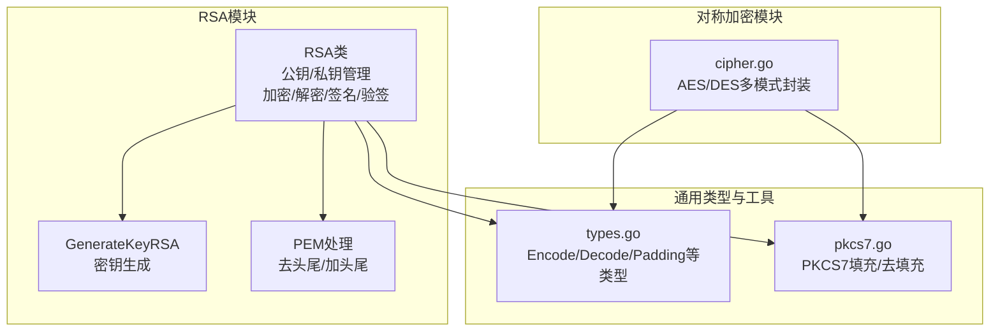
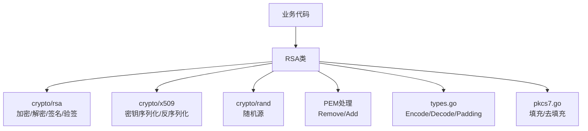
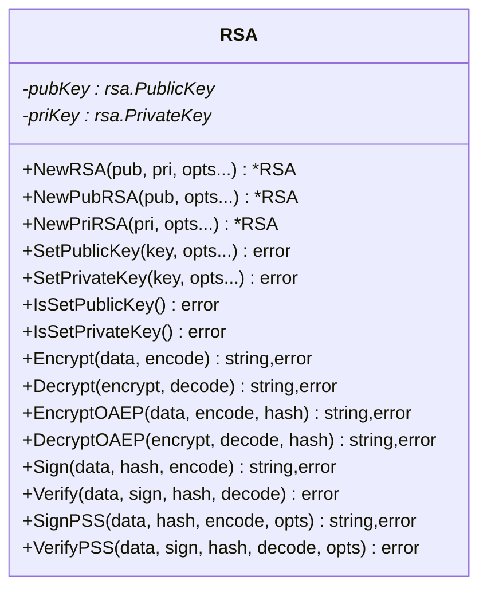
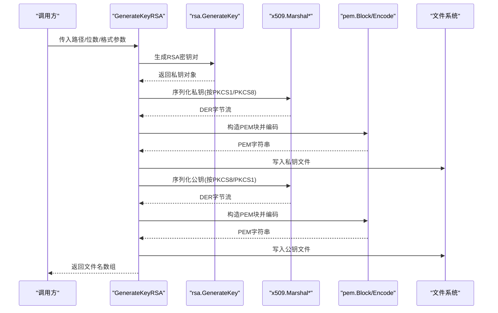
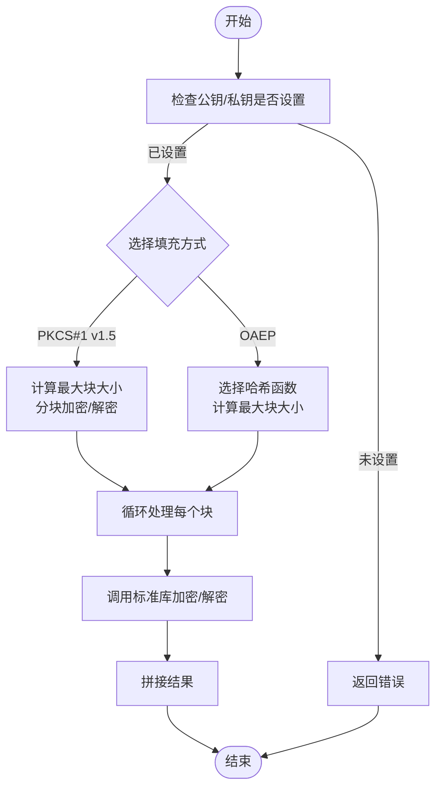
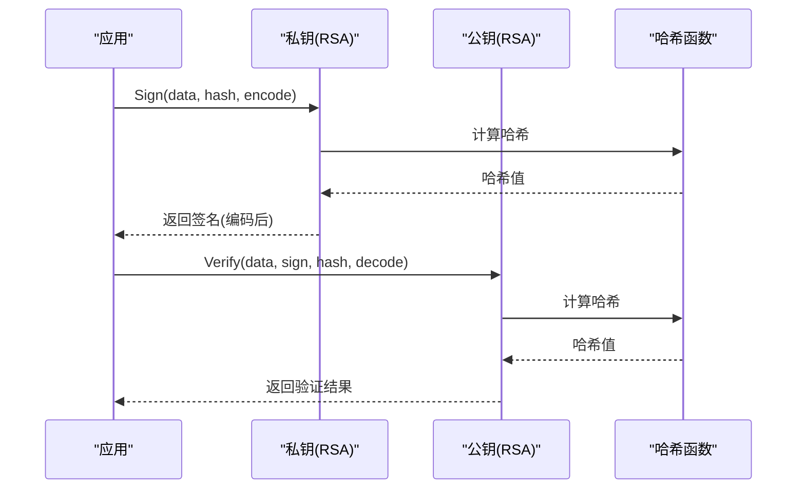
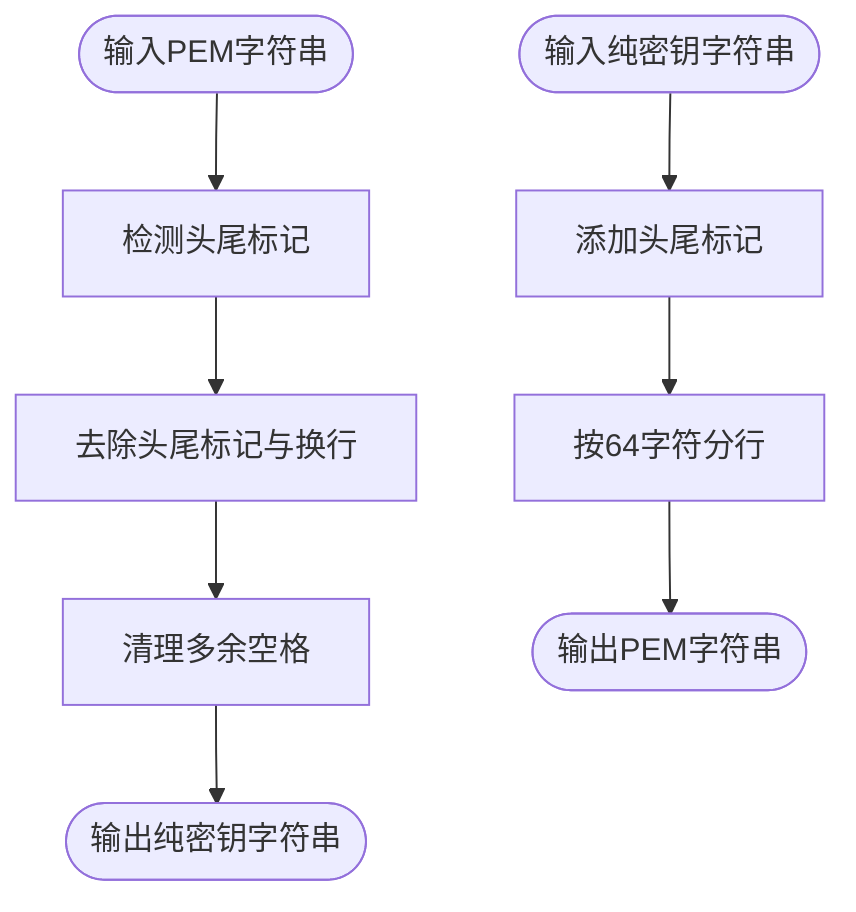
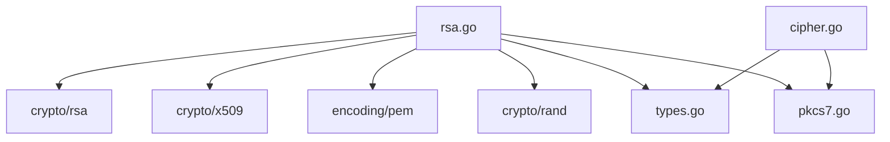

# 非对称加密算法

<cite>
**本文档引用的文件**
- [rsa.go](file://rsa.go)
- [rsa_test.go](file://rsa_test.go)
- [README.md](file://README.md)
- [types.go](file://types.go)
- [pkcs7.go](file://pkcs7.go)
- [cipher.go](file://cipher.go)
- [go.mod](file://go.mod)
</cite>

## 目录

1. [简介](#简介)
2. [项目结构](#项目结构)
3. [核心组件](#核心组件)
4. [架构总览](#架构总览)
5. [详细组件分析](#详细组件分析)
6. [依赖关系分析](#依赖关系分析)
7. [性能考量](#性能考量)
8. [故障排查指南](#故障排查指南)
9. [结论](#结论)
10. [附录](#附录)

## 简介

本项目提供了基于Go语言的RSA非对称加密算法实现，涵盖密钥生成、公钥加密/私钥解密、数字签名/验签、以及PEM密钥格式处理等功能。RSA模块支持多种填充方式（PKCS#1
v1.5和OAEP），并提供PKCS#1与PKCS#8两种私钥格式的兼容解析与导出。同时，项目还提供了混合加密方案的实践思路，结合对称加密算法实现高效的数据保护。

## 项目结构

该项目采用“功能模块化”组织方式，RSA相关能力集中在单个文件中，配合通用类型定义、填充工具与对称加密模块，形成完整的密码学工具集。

图表来源

- [rsa.go](file://rsa.go#L18-L526)
- [types.go](file://types.go#L44-L97)
- [pkcs7.go](file://pkcs7.go#L8-L30)
- [cipher.go](file://cipher.go#L20-L497)

章节来源

- [rsa.go](file://rsa.go#L1-L527)
- [types.go](file://types.go#L1-L98)
- [pkcs7.go](file://pkcs7.go#L1-L31)
- [cipher.go](file://cipher.go#L1-L498)

## 核心组件

- RSA类：封装公钥/私钥对象与操作方法，支持PKCS#1 v1.5与OAEP两种加密方式，支持PKCS#1与PSS两种签名方式。
- 密钥生成：支持生成指定位数的RSA密钥对，并可选择公钥PKCS#8、私钥PKCS#1或PKCS#8格式输出。
- PEM处理：提供PEM头尾标记的去除与添加，便于跨系统传输与存储。
- 类型与填充：统一的编码/解码与PKCS7填充接口，便于与对称加密模块协同使用。

章节来源

- [rsa.go](file://rsa.go#L18-L526)
- [types.go](file://types.go#L44-L97)
- [pkcs7.go](file://pkcs7.go#L8-L30)

## 架构总览

RSA模块通过Go标准库的crypto/rsa、crypto/x509与crypto/rand实现核心功能，并通过自定义类型与工具函数提供易用的接口。

图表来源

- [rsa.go](file://rsa.go#L3-L16)
- [types.go](file://types.go#L44-L97)
- [pkcs7.go](file://pkcs7.go#L8-L30)

## 详细组件分析

### RSA类设计与职责

RSA类持有公钥与私钥指针，提供以下能力：

- 公钥/私钥设置：支持从PEM字符串或文件路径加载，通过`WithRSAFilePath(true)`选项指定是否为文件路径，自动识别PKCS#1与PKCS#8格式。
- 加密/解密：支持PKCS#1 v1.5与OAEP两种填充方式，自动分块处理超长数据。
- 签名/验签：支持PKCS#1 v1.5与PSS两种签名方案，支持自定义哈希算法。
- 密钥生成：生成指定位数的RSA密钥对，可选择输出格式。
- PEM处理：提供去头尾与加头尾的工具函数，便于跨平台传输。

图表来源

- [rsa.go](file://rsa.go#L18-L526)

章节来源

- [rsa.go](file://rsa.go#L24-L51)

### 密钥生成流程

密钥生成函数支持指定位数与输出格式，内部使用标准库生成密钥对，并通过x509进行序列化与PEM编码。

图表来源

- [rsa.go](file://rsa.go#L377-L481)

章节来源

- [rsa.go](file://rsa.go#L377-L481)

### 加密/解密流程（PKCS#1 v1.5与OAEP）

- PKCS#1 v1.5：适用于传统场景，加密前需进行分块处理，块大小受密钥长度与填充影响。
- OAEP：更现代的安全填充方式，支持自定义哈希函数，适合对安全性要求更高的场景。

图表来源

- [rsa.go](file://rsa.go#L166-L223)
- [rsa.go](file://rsa.go#L273-L331)

章节来源

- [rsa.go](file://rsa.go#L166-L223)
- [rsa.go](file://rsa.go#L273-L331)

### 数字签名与验证流程（PKCS#1 v1.5与PSS）

- 签名：对消息进行哈希，再使用私钥进行签名，支持多种哈希算法。
- 验签：使用公钥对签名进行验证，确保消息完整性与来源可信。

图表来源

- [rsa.go](file://rsa.go#L232-L266)
- [rsa.go](file://rsa.go#L341-L375)

章节来源

- [rsa.go](file://rsa.go#L232-L266)
- [rsa.go](file://rsa.go#L341-L375)

### PEM密钥格式处理

- 去头尾：去除PEM头尾标记与换行，便于传输与存储。
- 加头尾：将纯密钥字符串按规范添加头尾标记与换行，便于跨系统使用。

图表来源

- [rsa.go](file://rsa.go#L483-L526)

章节来源

- [rsa.go](file://rsa.go#L483-L526)

## 依赖关系分析

- 标准库依赖：crypto/rsa、crypto/x509、crypto/rand、encoding/pem、hash等。
- 自定义类型：Encode/Decode/Padding/UnPadding等，统一了编码与填充策略。
- 工具函数：PEM处理与PKCS7填充，为RSA与对称加密模块提供通用能力。

图表来源

- [rsa.go](file://rsa.go#L3-L16)
- [types.go](file://types.go#L44-L97)
- [pkcs7.go](file://pkcs7.go#L8-L30)
- [cipher.go](file://cipher.go#L20-L497)

章节来源

- [rsa.go](file://rsa.go#L3-L16)
- [types.go](file://types.go#L44-L97)
- [pkcs7.go](file://pkcs7.go#L8-L30)
- [cipher.go](file://cipher.go#L20-L497)

## 性能考量

- 加密数据长度限制：
    - PKCS#1 v1.5：最大块大小为密钥长度减去11字节（填充开销）。
    - OAEP：最大块大小为密钥长度减去两倍哈希长度再减2。
- 大数据分块：当待处理数据超过单块上限时，需进行分块处理，增加CPU与内存开销。
- 签名/验签：签名过程涉及哈希计算与大数运算，PSS相比PKCS#1 v1.5更安全但性能略低。
- 密钥位数：位数越高安全性越强，但计算开销越大；常见选择为2048/4096位。

章节来源

- [rsa.go](file://rsa.go#L171-L174)
- [rsa.go](file://rsa.go#L278-L281)
- [rsa.go](file://rsa.go#L181-L188)
- [rsa.go](file://rsa.go#L288-L295)

## 故障排查指南

- 公钥/私钥未设置：调用加密/解密/签名/验签前需确保密钥已正确设置。
- PEM格式错误：确认PEM头尾标记与内容格式正确，必要时使用去头尾/加头尾工具修复。
- 填充错误：PKCS#1 v1.5与OAEP的块大小限制不同，需根据所选填充方式调整数据长度。
- 哈希算法不匹配：签名与验签使用的哈希算法需保持一致。
- 随机源问题：加密/签名依赖随机源，若环境不可用可能导致失败。

章节来源

- [rsa.go](file://rsa.go#L147-L160)
- [rsa.go](file://rsa.go#L483-L526)
- [rsa.go](file://rsa.go#L232-L266)

## 结论

本项目提供了完整且易用的RSA非对称加密实现，覆盖密钥管理、加密解密、数字签名与PEM处理等核心功能。通过分块处理与多种填充方式，满足不同场景的安全与性能需求。结合对称加密模块，可进一步构建混合加密方案，兼顾安全性与效率。

## 附录

### 使用示例（代码路径参考）

- 密钥生成：[GenerateKeyRSA](file://rsa.go#L377-L481)
- 公钥加密（PKCS#1 v1.5）：[Encrypt](file://rsa.go#L166-L189)
- 私钥解密（PKCS#1 v1.5）：[Decrypt](file://rsa.go#L195-L223)
- 公钥加密（OAEP）：[EncryptOAEP](file://rsa.go#L273-L296)
- 私钥解密（OAEP）：[DecryptOAEP](file://rsa.go#L303-L331)
- 私钥签名（PKCS#1 v1.5）：[Sign](file://rsa.go#L232-L244)
- 公钥验签（PKCS#1 v1.5）：[Verify](file://rsa.go#L254-L266)
- 私钥签名（PSS）：[SignPSS](file://rsa.go#L341-L353)
- 公钥验签（PSS）：[VerifyPSS](file://rsa.go#L363-L375)
- PEM去头尾/加头尾：[RemovePEMHeaders/AddPEMHeaders](file://rsa.go#L483-L526)

### 混合加密方案（RSA + 对称加密）

- 密钥交换：使用RSA公钥加密对称密钥，私钥解密获取对称密钥。
- 数据加密：使用对称加密算法（如AES）对大量数据进行加密，提升性能。
- 签名与完整性：对称密钥与数据摘要可结合数字签名保证完整性与抗抵赖性。

章节来源

- [cipher.go](file://cipher.go#L10-L18)
- [types.go](file://types.go#L44-L97)
- [pkcs7.go](file://pkcs7.go#L8-L30)