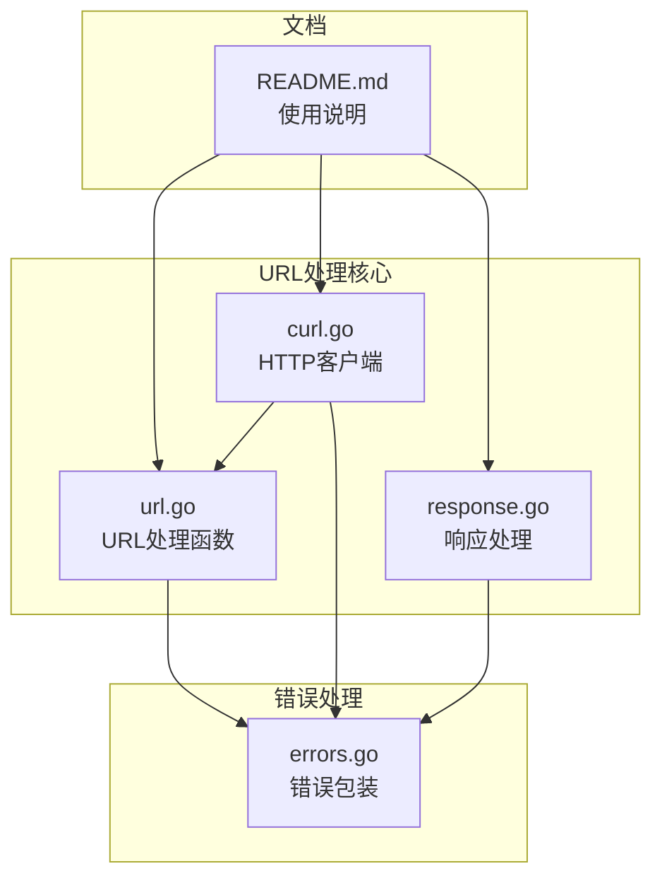
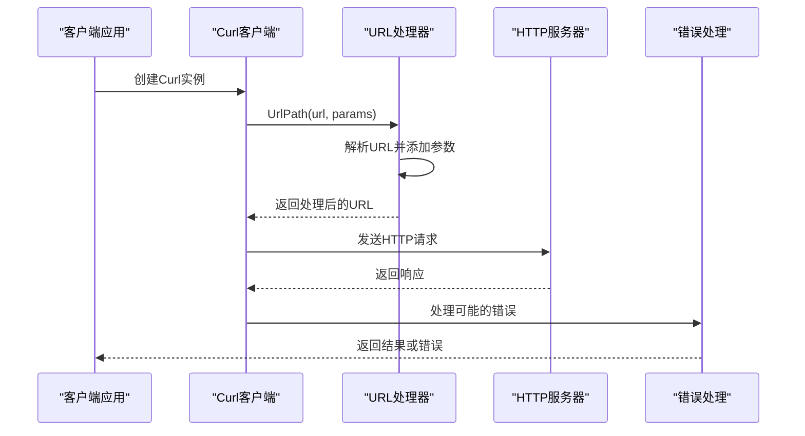
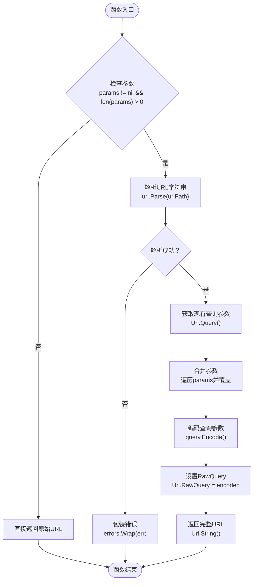
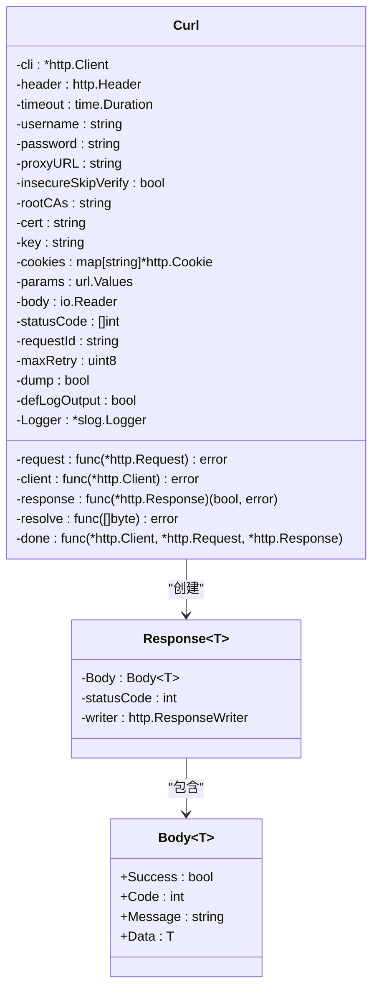
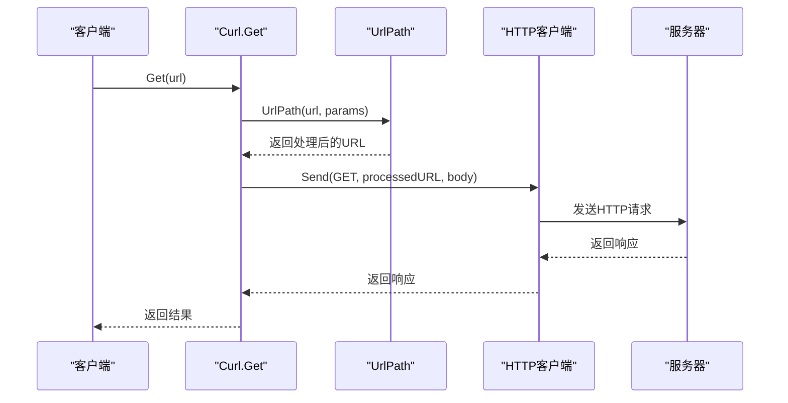
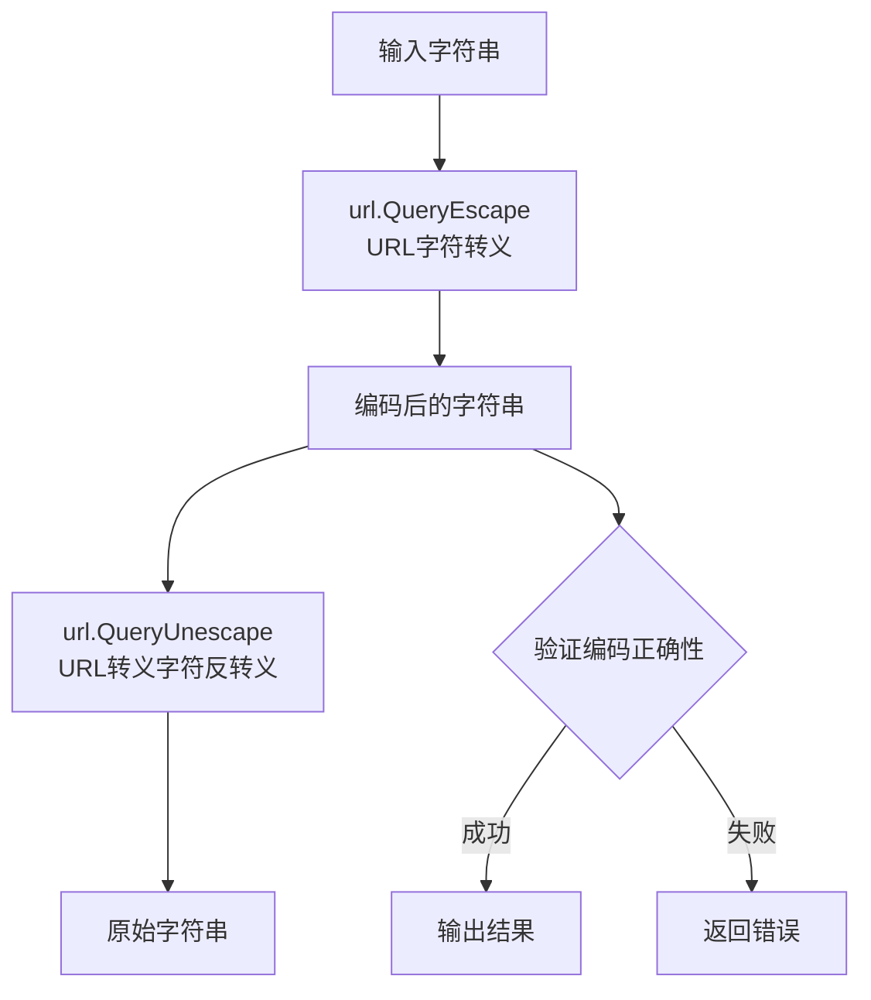
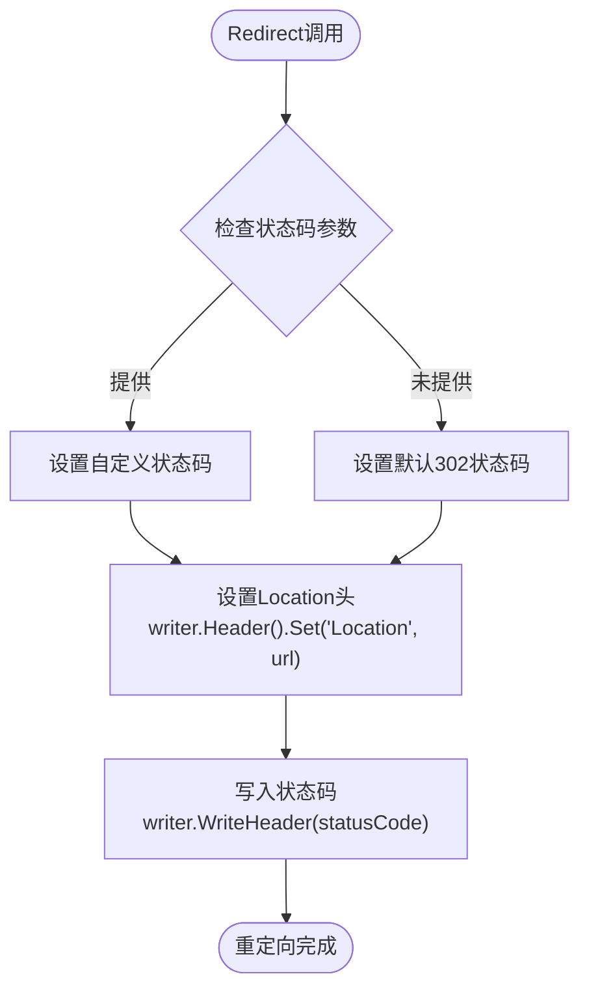
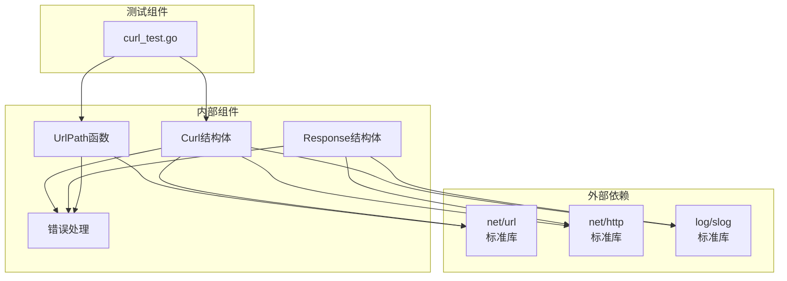
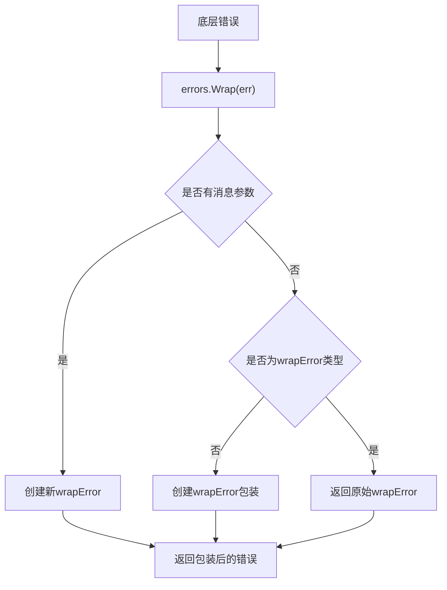

# URL处理

<cite>
**本文档引用的文件**
- [url.go](file://url.go)
- [curl.go](file://curl.go)
- [response.go](file://response.go)
- [errors.go](file://errors/errors.go)
- [README.md](file://README.md)
- [curl_test.go](file://curl_test.go)
</cite>

## 目录

1. [简介](#简介)
2. [项目结构](#项目结构)
3. [核心组件](#核心组件)
4. [架构概览](#架构概览)
5. [详细组件分析](#详细组件分析)
6. [依赖关系分析](#依赖关系分析)
7. [性能考虑](#性能考虑)
8. [故障排除指南](#故障排除指南)
9. [结论](#结论)

## 简介

本项目提供了一套完整的URL处理解决方案，专注于Go语言中的URL解析、构建、编码和解码功能。该工具库通过简洁的API设计，为开发者提供了处理HTTP请求、构建URL参数、处理重定向等常见场景的能力。

主要特性包括：

- URL解析和组件提取
- 动态URL参数构建
- 查询参数编码解码
- HTTP请求集成
- 重定向处理
- 错误处理和日志记录

## 项目结构

该项目采用模块化的Go包结构，URL处理功能主要集中在以下几个核心文件中：

**图表来源**

- [url.go](file://url.go#L1-L27)
- [curl.go](file://curl.go#L1-L118)
- [response.go](file://response.go#L1-L342)

**章节来源**

- [url.go](file://url.go#L1-L27)
- [curl.go](file://curl.go#L1-L118)
- [response.go](file://response.go#L1-L342)

## 核心组件

### URL处理函数

项目的核心URL处理功能由`UrlPath`函数提供，该函数专门用于将查询参数动态添加到现有URL中。

### HTTP客户端集成

`Curl`结构体提供了完整的HTTP客户端功能，包括：

- 支持多种HTTP方法（GET、POST、PUT、DELETE等）
- 参数管理（URL参数和表单参数）
- 认证支持（Basic认证、证书认证）
- 代理设置
- 重试机制
- 日志记录

### 响应处理

`Response`结构体提供了统一的响应处理接口，支持：

- JSON响应
- HTML响应
- 下载文件
- 重定向处理

**章节来源**

- [url.go](file://url.go#L11-L26)
- [curl.go](file://curl.go#L21-L84)
- [response.go](file://response.go#L11-L342)

## 架构概览

系统采用分层架构设计，各组件职责清晰分离：

**图表来源**

- [curl.go](file://curl.go#L783-L789)
- [url.go](file://url.go#L12-L26)
- [errors.go](file://errors/errors.go#L24-L53)

## 详细组件分析

### URL解析和构建组件

#### UrlPath函数分析

`UrlPath`函数是URL处理的核心组件，负责将查询参数动态添加到现有URL中：

**图表来源**

- [url.go](file://url.go#L12-L26)

**章节来源**

- [url.go](file://url.go#L11-L26)

#### Curl结构体分析

Curl结构体提供了完整的HTTP客户端功能，包含以下关键组件：

**图表来源**

- [curl.go](file://curl.go#L21-L84)
- [response.go](file://response.go#L11-L22)

**章节来源**

- [curl.go](file://curl.go#L21-L84)
- [response.go](file://response.go#L11-L22)

### HTTP请求处理流程

#### GET请求处理序列

**图表来源**

- [curl.go](file://curl.go#L783-L789)
- [url.go](file://url.go#L12-L26)

**章节来源**

- [curl.go](file://curl.go#L783-L789)

### URL编码和解码功能

项目通过Go标准库的`net/url`包提供完整的URL编码和解码功能：

#### 查询参数编码解码

**图表来源**

- [url.go](file://url.go#L8-L9)

**章节来源**

- [url.go](file://url.go#L8-L9)

### 重定向处理

#### Redirect函数分析

重定向功能通过`Redirect`函数实现，支持自定义状态码：

**图表来源**

- [response.go](file://response.go#L329-L341)

**章节来源**

- [response.go](file://response.go#L329-L341)

## 依赖关系分析

### 组件依赖图

**图表来源**

- [url.go](file://url.go#L3-L6)
- [curl.go](file://curl.go#L3-L18)
- [response.go](file://response.go#L3-L9)

### 错误处理机制

项目采用统一的错误处理策略，通过`errors.Wrap`函数提供链式错误包装：

**图表来源**

- [errors.go](file://errors/errors.go#L24-L53)

**章节来源**

- [errors.go](file://errors/errors.go#L24-L53)

## 性能考虑

### URL处理性能优化

1. **内存复用**: 使用`strings.Builder`和`bytes.Buffer`减少内存分配
2. **延迟初始化**: HTTP客户端和传输层仅在需要时创建
3. **参数合并**: 直接覆盖现有查询参数，避免重复编码
4. **错误快速返回**: 对无效参数立即返回错误

### HTTP客户端性能

1. **连接复用**: 使用`http.Client`的内置连接池
2. **超时控制**: 默认30秒超时，可配置
3. **重试机制**: 指数退避算法，最多5次重试
4. **资源清理**: 自动关闭响应体和清理连接

## 故障排除指南

### 常见问题和解决方案

#### URL解析错误

**问题**: URL格式不正确导致解析失败
**解决方案**:

- 确保URL包含完整的协议部分（http://或https://）
- 检查URL中的特殊字符是否正确编码
- 验证URL格式的有效性

#### 参数编码问题

**问题**: 查询参数包含特殊字符导致URL失效
**解决方案**:

- 使用`UrlPath`函数自动处理参数编码
- 避免手动拼接URL参数
- 确保中文字符正确编码

#### HTTP请求失败

**问题**: 网络请求超时或连接失败
**解决方案**:

- 检查网络连接状态
- 调整超时时间设置
- 验证目标服务器可达性
- 查看详细的错误日志信息

**章节来源**

- [curl.go](file://curl.go#L440-L491)
- [errors.go](file://errors/errors.go#L24-L53)

## 结论

本URL处理工具库提供了完整而实用的URL操作解决方案，具有以下特点：

1. **简洁易用**: API设计直观，易于理解和使用
2. **功能完整**: 覆盖URL解析、构建、编码解码等核心功能
3. **错误处理**: 提供完善的错误包装和日志记录机制
4. **性能优化**: 采用多种优化技术确保高效运行
5. **扩展性强**: 模块化设计便于功能扩展和维护

该工具库特别适用于需要频繁处理URL参数、构建HTTP请求和处理重定向的应用场景，为Go开发者提供了一套可靠的URL处理解决方案。