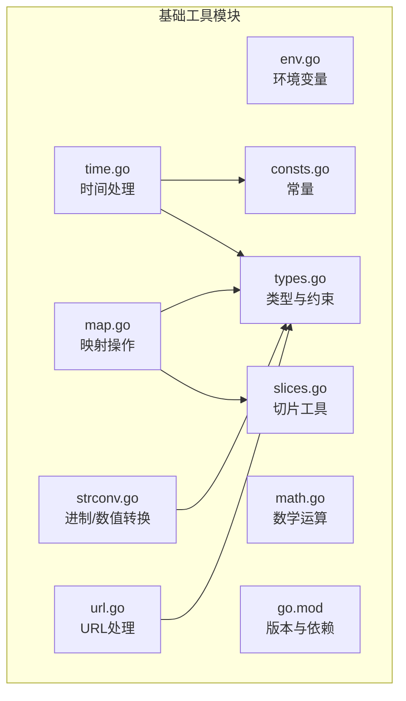
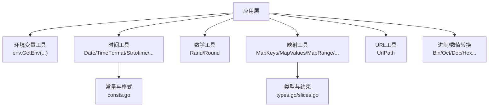
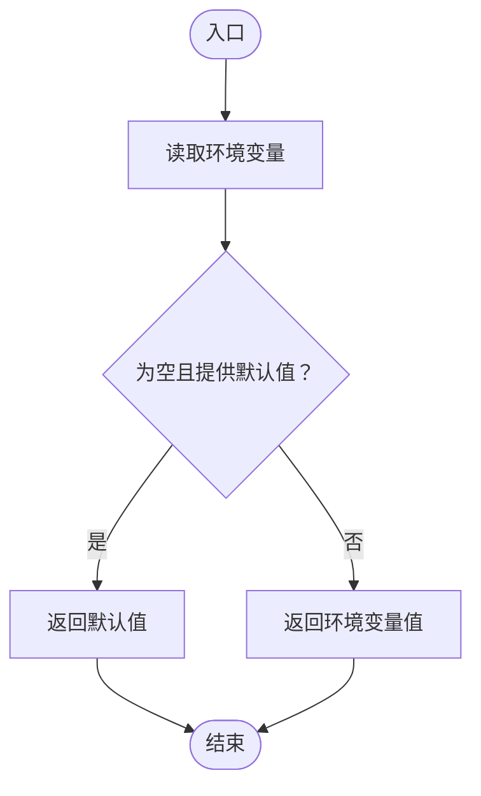
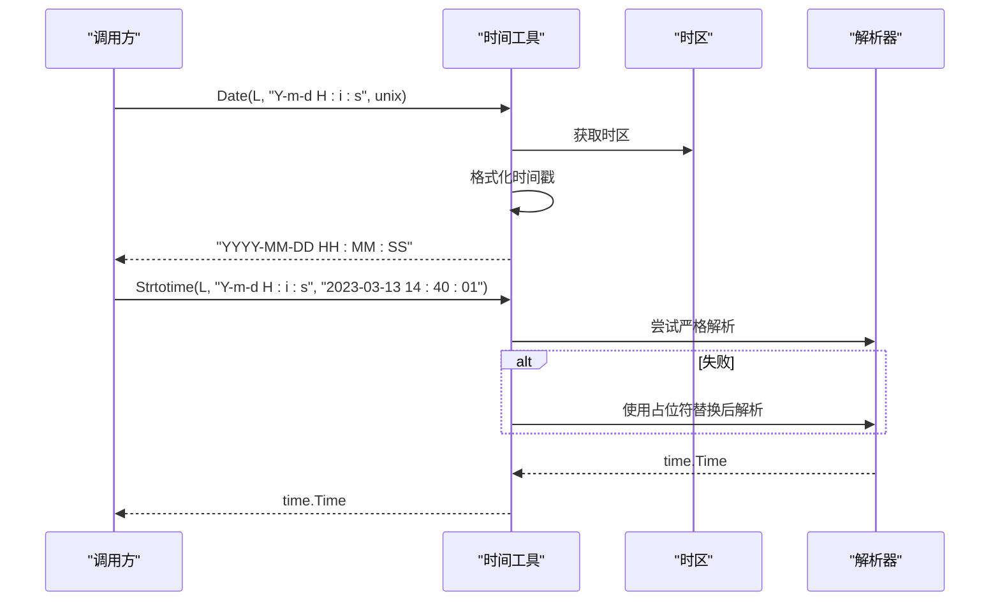
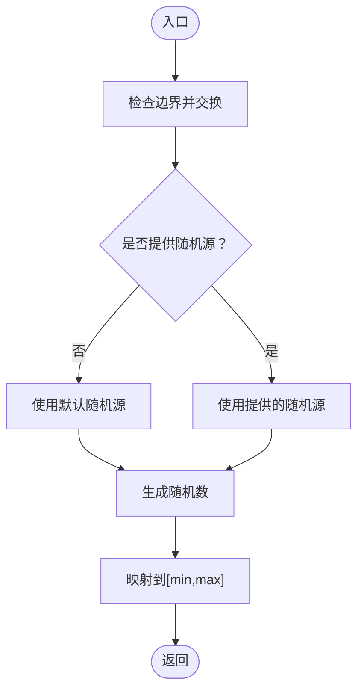
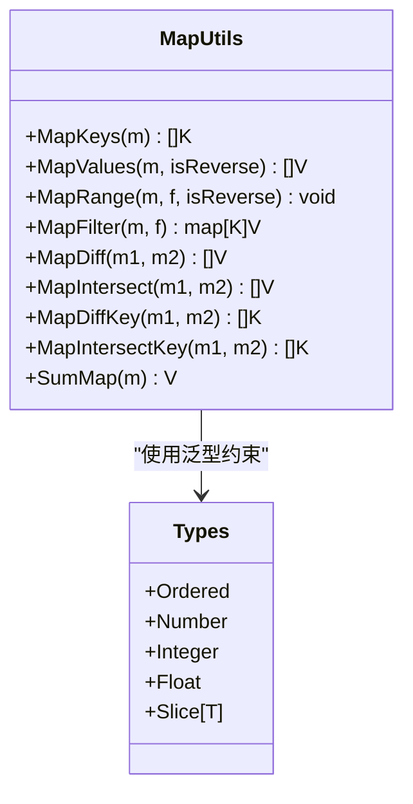
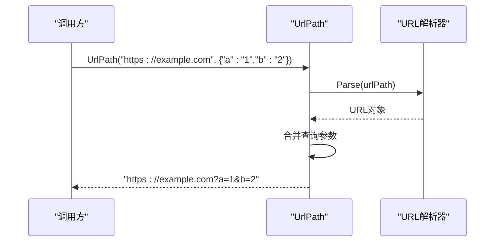
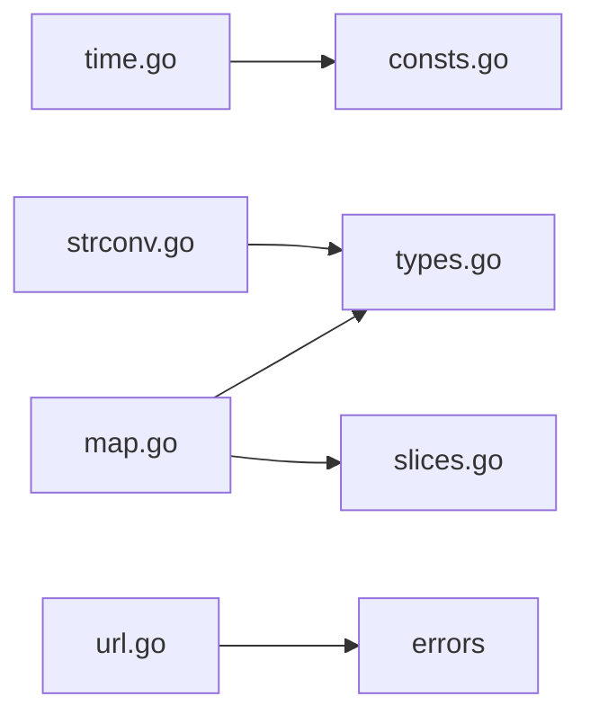

# 基础工具模块

<cite>
**本文档引用的文件**
- [env.go](file://env.go)
- [env_test.go](file://env_test.go)
- [time.go](file://time.go)
- [time_test.go](file://time_test.go)
- [math.go](file://math.go)
- [math_test.go](file://math_test.go)
- [map.go](file://map.go)
- [map_test.go](file://map_test.go)
- [url.go](file://url.go)
- [strconv.go](file://strconv.go)
- [types.go](file://types.go)
- [consts.go](file://consts.go)
- [slices.go](file://slices.go)
- [go.mod](file://go.mod)
</cite>

## 目录

1. [简介](#简介)
2. [项目结构](#项目结构)
3. [核心组件](#核心组件)
4. [架构总览](#架构总览)
5. [详细组件分析](#详细组件分析)
6. [依赖关系分析](#依赖关系分析)
7. [性能考量](#性能考量)
8. [故障排查指南](#故障排查指南)
9. [结论](#结论)
10. [附录](#附录)

## 简介

本文件系统性梳理基础工具模块，覆盖以下能力：

- 环境变量管理：获取、设置、删除
- 时间处理：格式化、解析、计算、时区、日期校验
- 数学运算：随机数、四舍五入
- 映射操作：键值提取、排序遍历、过滤、集合运算、求和
- URL处理：路径拼接、查询参数组装、URL编码/解码
- 辅助类型与常量：泛型约束、通用类型别名、时间格式常量
- 字符串与数值转换：字符串到整数/浮点、进制转换

## 项目结构

模块采用按功能分层组织，核心文件如下：

- 环境变量：env.go
- 时间处理：time.go、consts.go
- 数学运算：math.go
- 映射操作：map.go、slices.go、types.go
- URL处理：url.go
- 进制与字符串转换：strconv.go
- 版本与依赖：go.mod

图表来源

- [env.go](file://env.go#L1-L19)
- [time.go](file://time.go#L1-L377)
- [math.go](file://math.go#L1-L37)
- [map.go](file://map.go#L1-L134)
- [url.go](file://url.go#L1-L27)
- [strconv.go](file://strconv.go#L1-L109)
- [types.go](file://types.go#L1-L98)
- [consts.go](file://consts.go#L1-L48)
- [slices.go](file://slices.go#L1-L83)
- [go.mod](file://go.mod#L1-L4)

章节来源

- [go.mod](file://go.mod#L1-L4)

## 核心组件

- 环境变量管理：提供获取环境变量的便捷方法，支持默认值回退
- 时间处理：提供多种格式化/解析策略、时区工具、日期校验、时间加减、比较与差值计算
- 数学运算：提供带种子的随机数生成与四舍五入
- 映射操作：提供键值提取、排序遍历、过滤、集合运算、求和
- URL处理：提供URL路径与查询参数拼接、URL编码/解码
- 类型与常量：定义泛型约束、通用类型别名、时间格式常量

章节来源

- [env.go](file://env.go#L1-L19)
- [time.go](file://time.go#L1-L377)
- [math.go](file://math.go#L1-L37)
- [map.go](file://map.go#L1-L134)
- [url.go](file://url.go#L1-L27)
- [strconv.go](file://strconv.go#L1-L109)
- [types.go](file://types.go#L1-L98)
- [consts.go](file://consts.go#L1-L48)
- [slices.go](file://slices.go#L1-L83)

## 架构总览

模块围绕“工具函数 + 泛型约束 + 常量”的设计，统一错误包装与日志记录风格，便于在业务中复用。

图表来源

- [env.go](file://env.go#L1-L19)
- [time.go](file://time.go#L1-L377)
- [consts.go](file://consts.go#L1-L48)
- [math.go](file://math.go#L1-L37)
- [map.go](file://map.go#L1-L134)
- [url.go](file://url.go#L1-L27)
- [strconv.go](file://strconv.go#L1-L109)
- [types.go](file://types.go#L1-L98)
- [slices.go](file://slices.go#L1-L83)

## 详细组件分析

### 环境变量管理

- 功能概述
    - 获取：支持默认值回退
    - 设置/删除：基于标准库封装
- 关键函数
    - GetEnv(key, defaultVal...) -> string
- 参数与返回
    - key: 环境变量键
    - defaultVal: 可选默认值
    - 返回：键对应的值或默认值
- 使用示例
    - 获取特定键的值，若不存在则返回默认值
- 常见场景
    - 读取配置项、端口、开关等

图表来源

- [env.go](file://env.go#L9-L18)

章节来源

- [env.go](file://env.go#L1-L19)
- [env_test.go](file://env_test.go#L1-L28)

### 时间处理

- 功能概述
    - 时区：本地、UTC、CST
    - 格式化：Go Layout与自定义占位符互转
    - 解析：严格Layout与灵活解析
    - 计算：AddTime按单位增量
    - 比较：Before/After/Equal/Sub
    - 信息：DateInfo输出丰富字段
    - 校验：CheckDate/MonthDay
- 关键函数
    - Local/CST/UTC -> *time.Location
    - Date(timeZone, layout, timestamp...) -> string
    - TimeFormat(timeZone, layout, timestamp...) -> string
    - TimeParse(timeZone, layout, timeStr) -> (time.Time, error)
    - Strtotime(timeZone, parse...) -> (time.Time, error)
    - AddTime(t, addTimes...) -> (time.Time, error)
    - Before/After/Equal/Sub(layout, t1, t2) -> (bool/error)
    - DateInfo(t) -> map[string]interface{}
    - CheckDate(year, month, day) -> bool
    - MonthDay(year, month) -> int
- 参数与返回
    - timeZone: 时区对象
    - layout: Go Layout或自定义占位符
    - timestamp: 秒/纳秒或单个纳秒时间戳
    - addTimes: 增量字符串，如“+1Y”、“-1D”等
    - parse: [layout, timeStr]或仅layout（自动推断）
    - DateInfo: 返回包含年、月、日、时、分、秒、毫秒、微秒、纳秒、周数、ISO周、Unix等字段
- 使用示例
    - 按自定义占位符格式化时间
    - 解析多种布局的字符串
    - 对时间进行加减
    - 比较两个时间先后
    - 校验日期合法性
- 常见场景
    - 日志时间格式化、跨时区展示、定时任务调度、报表统计周期

图表来源

- [time.go](file://time.go#L237-L324)

章节来源

- [time.go](file://time.go#L1-L377)
- [consts.go](file://consts.go#L26-L47)
- [time_test.go](file://time_test.go#L1-L299)

### 数学运算

- 功能概述
    - Rand：生成[min,max]范围内的随机数，支持传入随机源
    - Round：按精度四舍五入
- 关键函数
    - Rand(minInt, maxInt, r...) -> int64
    - Round(num, precision) -> float64
- 参数与返回
    - minInt/maxInt：整数边界
    - r：可选随机源，用于批量生成提升效率
    - precision：保留小数位或负数位（如-2表示百位取整）
- 使用示例
    - 生成指定范围随机数
    - 对浮点数按精度四舍五入
- 常见场景
    - 抽奖、打点采样、金额计算

图表来源

- [math.go](file://math.go#L13-L24)

章节来源

- [math.go](file://math.go#L1-L37)
- [math_test.go](file://math_test.go#L1-L123)

### 映射操作

- 功能概述
    - 键值提取：MapKeys、MapValues
    - 遍历：MapRange（支持升/降序）
    - 过滤：MapFilter
    - 集合运算：MapDiff/MapIntersect（基于值）、MapDiffKey/MapIntersectKey（基于键）
    - 求和：SumMap
- 关键函数
    - MapKeys[K Ordered,V any](m) -> []K
    - MapValues[K Ordered,V any](m, isReverse...) -> []V
    - MapRange[K Ordered,V any](m, f, isReverse...) -> void
    - MapFilter[K Ordered,V any](m, f) -> map[K]V
    - MapDiff/MapIntersect[K,V Ordered](m1,m2) -> []V
    - MapDiffKey/MapIntersectKey[K Ordered,V any](m1,m2) -> []K
    - SumMap[K Ordered,V Number](m) -> V
- 参数与返回
    - K、V：泛型键值类型，K需满足Ordered约束
    - isReverse：布尔，控制排序方向
    - f：回调函数，接收(key,value)，返回bool决定是否继续
- 使用示例
    - 对map按键排序并遍历
    - 过滤掉不符合条件的键值
    - 计算map中数值之和
- 常见场景
    - 配置项聚合、指标统计、数据清洗

图表来源

- [map.go](file://map.go#L1-L134)
- [types.go](file://types.go#L1-L98)
- [slices.go](file://slices.go#L1-L83)

章节来源

- [map.go](file://map.go#L1-L134)
- [map_test.go](file://map_test.go#L1-L319)
- [types.go](file://types.go#L1-L98)
- [slices.go](file://slices.go#L1-L83)

### URL处理

- 功能概述
    - UrlPath：将参数合并到URL查询串
    - QueryEscape/QueryUnescape：URL编码/解码
- 关键函数
    - UrlPath(urlPath, params) -> (string, error)
- 参数与返回
    - urlPath：原始URL
    - params：url.Values查询参数
    - 返回：拼接后的URL或原URL（无参数时）
- 使用示例
    - 为已有URL追加查询参数
- 常见场景
    - API请求参数拼装、重定向地址构造

图表来源

- [url.go](file://url.go#L11-L26)

章节来源

- [url.go](file://url.go#L1-L27)

### 进制与字符串转换

- 功能概述
    - 字符串到整数/浮点：安全转换，失败返回零值
    - 多进制转换：二进制、八进制、十进制、十六进制互转
- 关键函数
    - Str2Int/Str2Int64/Str2Float
    - BinOct/BinDec/BinHex
    - OctBin/OctDec/OctHex
    - DecBin/DecOct/DecHex
    - HexBin/HexOct/HexDec
- 参数与返回
    - 输入：字符串或整数
    - 返回：目标进制字符串或十进制整数，失败返回错误
- 使用示例
    - 将字符串解析为整数
    - 在不同进制间转换
- 常见场景
    - 用户输入校验、日志/调试打印、协议解析

章节来源

- [strconv.go](file://strconv.go#L1-L109)

## 依赖关系分析

- 模块内依赖
    - time.go 依赖 consts.go（时间格式常量）
    - map.go 依赖 types.go（泛型约束）与 slices.go（集合运算）
    - strconv.go 依赖 types.go（泛型约束）
    - url.go 依赖 errors（错误包装）
- 外部依赖
    - 标准库：time、net/url、strconv、sort
    - 第三方：errors（错误包装）

图表来源

- [time.go](file://time.go#L1-L377)
- [consts.go](file://consts.go#L1-L48)
- [map.go](file://map.go#L1-L134)
- [types.go](file://types.go#L1-L98)
- [slices.go](file://slices.go#L1-L83)
- [strconv.go](file://strconv.go#L1-L109)
- [url.go](file://url.go#L1-L27)

章节来源

- [time.go](file://time.go#L1-L377)
- [map.go](file://map.go#L1-L134)
- [strconv.go](file://strconv.go#L1-L109)
- [url.go](file://url.go#L1-L27)
- [types.go](file://types.go#L1-L98)
- [slices.go](file://slices.go#L1-L83)
- [consts.go](file://consts.go#L1-L48)

## 性能考量

- 随机数生成
    - 批量生成时传入同一随机源，避免重复初始化开销
- 时间格式化/解析
    - 优先使用严格Layout，减少多次尝试带来的开销
    - 对纳秒时间戳，注意区分秒与纳秒字段
- 映射操作
    - MapValues/MapRange在键较多时会进行排序，注意时间复杂度
    - MapFilter会就地修改原map，适合内存敏感场景
- URL拼接
    - UrlPath在存在参数时会解析并重建URL，建议在高频场景缓存已解析对象

## 故障排查指南

- 环境变量
    - 若GetEnv返回空且未提供默认值，确认键是否存在或作用域是否正确
- 时间处理
    - Strtotime解析失败时，检查占位符与Layout是否匹配
    - AddTime增量单位非法会返回错误，确认单位字符（Y/M/D/H/I/S/L/C/N）
    - Before/After/Equal/Sub解析失败会返回错误，检查输入字符串与Layout一致性
- 映射操作
    - MapRange回调返回false可提前终止遍历
    - MapFilter会删除不满足条件的键，注意副作用
- URL处理
    - UrlPath解析失败会返回错误，检查URL合法性与参数类型

章节来源

- [env.go](file://env.go#L1-L19)
- [time.go](file://time.go#L106-L143)
- [time.go](file://time.go#L221-L229)
- [time.go](file://time.go#L241-L324)
- [time.go](file://time.go#L326-L376)
- [map.go](file://map.go#L45-L64)
- [map.go](file://map.go#L66-L76)
- [url.go](file://url.go#L11-L26)

## 结论

本模块提供了环境变量、时间、数学、映射、URL与进制转换等高频基础能力，配合泛型约束与清晰的错误处理，适用于日常开发中的通用场景。建议在生产环境中结合单元测试与基准测试验证关键路径性能与稳定性。

## 附录

- 版本要求：Go 1.22
- 常用常量（时间格式）
    - Year/Month/Day/Hour/Minute/Second
    - DateMonth/DateHour/DateMinute
    - DateMillisecond/DateMicrosecond/DateNanosecond
    - MonthSeam/DaySeam/HourSeam/MinuteSeam/SecondSeam

章节来源

- [consts.go](file://consts.go#L26-L47)
- [go.mod](file://go.mod#L1-L4)