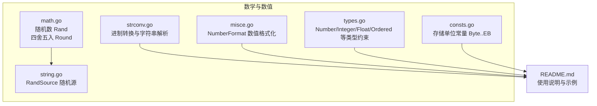
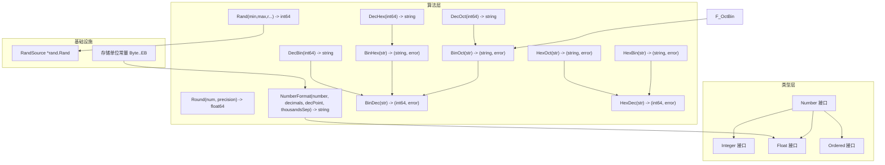
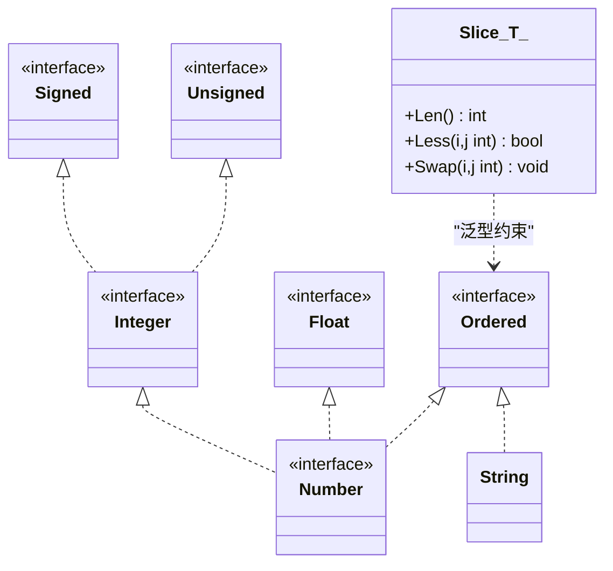
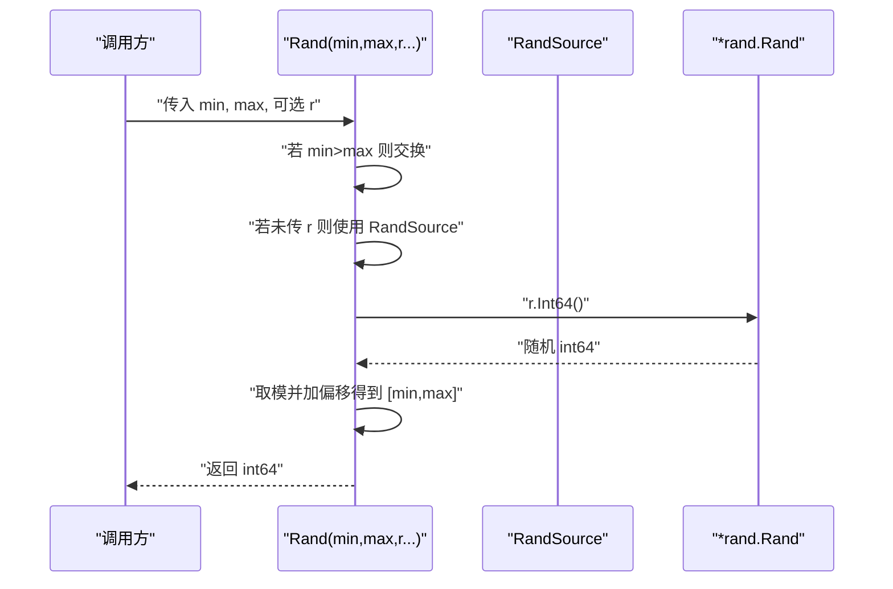
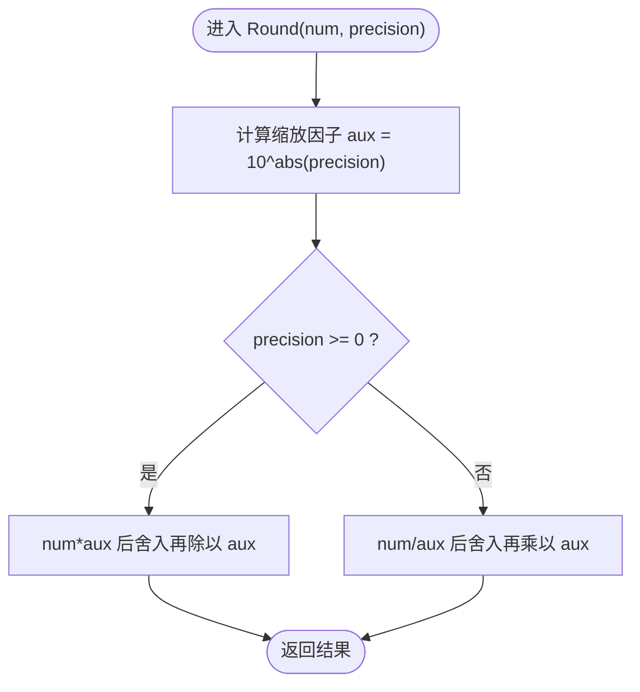
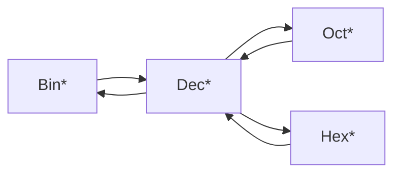
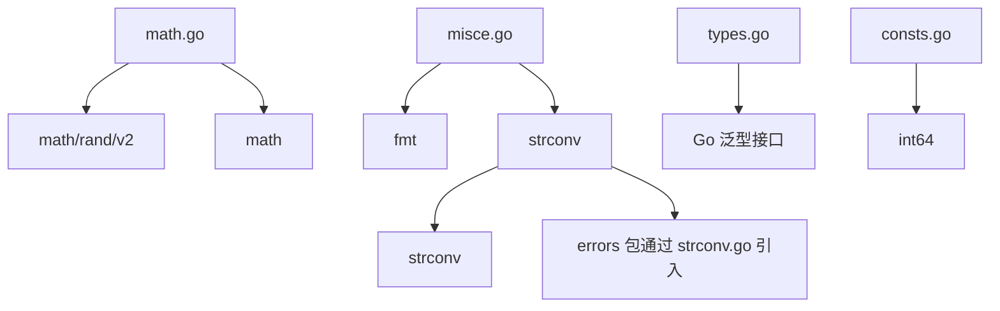

# 数学运算

<cite>
**本文引用的文件**
- [math.go](file://math.go)
- [math_test.go](file://math_test.go)
- [types.go](file://types.go)
- [consts.go](file://consts.go)
- [strconv.go](file://strconv.go)
- [strconv_test.go](file://strconv_test.go)
- [misce.go](file://misce.go)
- [misce_test.go](file://misce_test.go)
- [string.go](file://string.go)
- [README.md](file://README.md)
</cite>

## 目录

1. [简介](#简介)
2. [项目结构](#项目结构)
3. [核心组件](#核心组件)
4. [架构总览](#架构总览)
5. [组件详解](#组件详解)
6. [依赖关系分析](#依赖关系分析)
7. [性能与精度考量](#性能与精度考量)
8. [故障排查指南](#故障排查指南)
9. [结论](#结论)
10. [附录](#附录)

## 简介

本章节面向“数学运算”主题，系统梳理仓库中与数值类型、随机数生成、数值四舍五入、数值格式化、进制转换等相关的实现与使用方法。文档将从类型体系、算法实现、性能与精度注意事项、典型应用场景（数据统计、科学计算、工程计算）等方面展开，帮助读者快速理解并安全高效地使用这些工具函数。

## 项目结构

围绕数学运算相关的文件主要分布在以下模块：

- 数值类型与通用类型约束：types.go
- 常量定义：consts.go
- 数学运算（随机数、四舍五入）：math.go
- 数值格式化与通用工具：misce.go
- 进制转换与字符串解析：strconv.go
- README 文档补充：README.md
- 单元测试与基准测试：math_test.go、strconv_test.go、misce_test.go



图表来源

- [math.go](file://math.go#L1-L37)
- [types.go](file://types.go#L1-L98)
- [consts.go](file://consts.go#L1-L23)
- [misce.go](file://misce.go#L1-L133)
- [strconv.go](file://strconv.go#L1-L109)
- [string.go](file://string.go#L185-L187)
- [README.md](file://README.md#L1-L30)

章节来源

- [math.go](file://math.go#L1-L37)
- [types.go](file://types.go#L1-L98)
- [consts.go](file://consts.go#L1-L23)
- [misce.go](file://misce.go#L1-L133)
- [strconv.go](file://strconv.go#L1-L109)
- [string.go](file://string.go#L185-L187)
- [README.md](file://README.md#L1-L30)

## 核心组件

- 数值类型与泛型约束：通过 Number、Integer、Float、Signed、Unsigned、Ordered 等类型别名，统一抽象整数、浮点数与有序类型，便于在不同函数间复用。
- 随机数生成：基于 PCG 随机源的 Rand 函数，支持批量生成时复用同一 Rand 实例以提升性能。
- 四舍五入：Round 函数支持正负精度位数，兼顾小数与整数级别的舍入。
- 数值格式化：NumberFormat 提供千分位分隔、小数点与保留位数控制，满足报表与展示需求。
- 进制转换：提供二进制/八进制/十进制/十六进制之间的双向转换，含错误包装与校验。
- 常量：存储单位 Byte..EB 的定义，便于工程计算与容量显示。

章节来源

- [types.go](file://types.go#L5-L33)
- [math.go](file://math.go#L8-L36)
- [misce.go](file://misce.go#L21-L83)
- [strconv.go](file://strconv.go#L26-L108)
- [consts.go](file://consts.go#L12-L22)

## 架构总览

下图展示了数学运算相关模块的交互关系与职责边界。



图表来源

- [types.go](file://types.go#L5-L33)
- [math.go](file://math.go#L8-L36)
- [misce.go](file://misce.go#L21-L83)
- [strconv.go](file://strconv.go#L26-L108)
- [string.go](file://string.go#L185-L187)
- [consts.go](file://consts.go#L12-L22)

## 组件详解

### 数值类型与泛型约束

- Number：整数与浮点数的统一抽象，便于在需要“数字”的上下文中使用。
- Integer：Signed 与 Unsigned 的并集，覆盖 Go 泛型中的常见整数类型。
- Float：float32 与 float64 的并集。
- Ordered：Number 与 string 的并集，支持排序与比较。
- Slice[T Ordered]：基于 Ordered 的切片，可直接用于排序。



图表来源

- [types.go](file://types.go#L5-L33)
- [types.go](file://types.go#L35-L42)

章节来源

- [types.go](file://types.go#L5-L33)
- [types.go](file://types.go#L35-L42)

### 随机数生成（Rand）

- 功能：在闭区间 [min, max] 内生成随机整数，支持传入已有的 *rand.Rand 实例以减少重复初始化开销。
- 关键点：
    - 自动交换 min 与 max，保证输入顺序无关。
    - 若未传入 r，则使用全局 RandSource。
    - 使用模运算与偏移实现均匀分布近似。
- 性能：批量生成时复用同一个 *rand.Rand 实例可显著降低初始化成本。



图表来源

- [math.go](file://math.go#L13-L23)
- [string.go](file://string.go#L185-L187)

章节来源

- [math.go](file://math.go#L8-L24)
- [math_test.go](file://math_test.go#L9-L55)
- [math_test.go](file://math_test.go#L57-L82)
- [string.go](file://string.go#L185-L187)

### 四舍五入（Round）

- 功能：对浮点数按指定精度进行四舍五入，支持正负精度位数（如保留整数位、十位等）。
- 算法要点：
    - 通过乘除 10^precision 缩放后再舍入，避免直接对原始浮点数操作带来的误差累积。
    - precision 为负时，先缩放再舍入，再反向缩放，确保对高位进行取整。
- 测试覆盖：包含正负数、不同精度、边界值等多场景。



图表来源

- [math.go](file://math.go#L26-L36)
- [math_test.go](file://math_test.go#L84-L122)

章节来源

- [math.go](file://math.go#L26-L36)
- [math_test.go](file://math_test.go#L84-L122)

### 数值格式化（NumberFormat）

- 功能：将浮点数按指定的小数位、小数点与千分位分隔符格式化输出，支持负数处理。
- 关键流程：
    - 负数标记与绝对值处理。
    - 使用格式化字符串保留小数位。
    - 对整数部分按三位一组插入千分位分隔符。
    - 拼接小数部分与负号。
- 应用场景：报表、财务、统计展示等。

```mermaid
flowchart TD
S(["开始 NumberFormat"]) --> NegCheck{"number < 0 ?"}
NegCheck --> |是| NegMark["neg=true, number=-number"]
NegCheck --> |否| KeepPos["保持正值"]
NegMark --> Format["按 decimals 保留小数位"]
KeepPos --> Format
Format --> SepCheck{"decPoint==\".\" 且 thousandsSep==\"\" ?"}
SepCheck --> |是| RetNeg["若 neg 则加负号并返回"]
SepCheck --> |否| Split["分离整数与小数部分"]
Split --> Build["从右向左每三位插入分隔符"]
Build --> Join["拼接小数点与小数部分"]
Join --> AddNeg{"neg ?"}
AddNeg --> |是| Ret["加负号返回"]
AddNeg --> |否| Ret
Ret --> E(["结束"])
```

图表来源

- [misce.go](file://misce.go#L21-L83)
- [misce_test.go](file://misce_test.go#L48-L83)

章节来源

- [misce.go](file://misce.go#L21-L83)
- [misce_test.go](file://misce_test.go#L48-L83)

### 进制转换（strconv）

- 功能：提供二进制、八进制、十进制、十六进制之间的双向转换，包含错误包装与一致性校验。
- 主要函数族：
    - Bin*/Oct*/Dec*/Hex*：分别提供转换与回转校验。
    - 错误处理：解析失败时通过错误包装返回，便于上层定位。
- 使用建议：转换链路中建议进行 round-trip 校验（如二进制->其他->二进制），确保正确性。



图表来源

- [strconv.go](file://strconv.go#L26-L108)
- [strconv_test.go](file://strconv_test.go#L81-L144)

章节来源

- [strconv.go](file://strconv.go#L26-L108)
- [strconv_test.go](file://strconv_test.go#L81-L144)

### 常量：存储单位（Byte..EB）

- 定义：Byte、KB、MB、GB、TB、PB、EB，覆盖 int64 最大范围，适合工程与系统场景。
- 应用：在文件大小、内存容量、带宽等场景中统一换算与显示。

章节来源

- [consts.go](file://consts.go#L12-L22)

## 依赖关系分析

- 类型约束依赖：Number、Integer、Float、Ordered 作为上层函数的泛型约束基础。
- 算法依赖：
    - Rand 依赖全局 RandSource 或传入的 *rand.Rand。
    - Round 依赖 math 包的幂与舍入函数。
    - NumberFormat 依赖 fmt 与 strconv。
    - 进制转换依赖 strconv 与错误包装。
- 外部依赖：math、math/rand/v2、fmt、strconv、time。



图表来源

- [math.go](file://math.go#L3-L6)
- [misce.go](file://misce.go#L3-L7)
- [strconv.go](file://strconv.go#L3-L6)
- [types.go](file://types.go#L1-L4)
- [consts.go](file://consts.go#L1-L4)

章节来源

- [math.go](file://math.go#L3-L6)
- [misce.go](file://misce.go#L3-L7)
- [strconv.go](file://strconv.go#L3-L6)
- [types.go](file://types.go#L1-L4)
- [consts.go](file://consts.go#L1-L4)

## 性能与精度考量

### 随机数生成性能

- 批量生成时复用 *rand.Rand 实例，避免重复初始化与种子生成的开销。
- 在高并发场景下，建议使用 RandSource 或自建池化 Rand 实例，减少锁竞争与状态同步。

章节来源

- [math.go](file://math.go#L12-L23)
- [math_test.go](file://math_test.go#L57-L82)
- [string.go](file://string.go#L185-L187)

### 四舍五入精度与浮点陷阱

- 使用缩放后再舍入的方式，避免直接对原始浮点数进行格式化导致的精度误差。
- 对于极小或极大数值，注意精度上限与舍入方向，必要时结合 NumberFormat 控制显示位数。

章节来源

- [math.go](file://math.go#L26-L36)
- [math_test.go](file://math_test.go#L84-L122)

### 数值格式化性能

- NumberFormat 采用从右向左插入分隔符的方式，时间复杂度 O(n)，其中 n 为整数部分长度。
- 对于高频格式化场景，可考虑缓存格式模板或复用字符串缓冲区。

章节来源

- [misce.go](file://misce.go#L27-L83)
- [misce_test.go](file://misce_test.go#L48-L83)

### 进制转换一致性

- 建议在转换后进行 round-trip 校验，确保跨进制转换的正确性。
- 错误处理统一通过错误包装，便于定位与追踪。

章节来源

- [strconv.go](file://strconv.go#L26-L108)
- [strconv_test.go](file://strconv_test.go#L81-L144)

## 故障排查指南

- 随机数越界：确认 min 与 max 的大小关系已被自动交换，或显式传入正确的区间。
- 四舍五入异常：检查 precision 的正负与数值范围，避免过大或过小导致的溢出或精度丢失。
- 数值格式化异常：核对 decimals、decPoint、thousandsSep 的组合，确保与预期一致。
- 进制转换失败：检查输入字符串是否符合目标进制规范，解析失败时查看错误包装信息。

章节来源

- [math_test.go](file://math_test.go#L9-L55)
- [math_test.go](file://math_test.go#L84-L122)
- [misce_test.go](file://misce_test.go#L48-L83)
- [strconv_test.go](file://strconv_test.go#L81-L144)

## 结论

本项目提供了简洁而实用的数学运算工具集：类型约束统一抽象、随机数生成与四舍五入、数值格式化与进制转换。通过合理的泛型设计与错误处理，这些工具既易于使用又具备良好的扩展性。在实际工程中，建议结合批量生成复用
Rand 实例、缩放后舍入的精度策略、以及 round-trip 校验的进制转换流程，以获得更稳健的性能与可靠性。

## 附录

### 实际应用示例（概念性说明）

- 数据统计：使用 Round 对统计结果进行舍入，使用 NumberFormat 展示报表。
- 科学计算：使用 Rand 生成蒙特卡洛模拟样本，结合 NumberFormat 输出结果。
- 工程计算：使用存储单位常量进行容量换算与显示，使用进制转换进行底层数据处理。

章节来源

- [README.md](file://README.md#L1-L30)
- [consts.go](file://consts.go#L12-L22)
- [misce.go](file://misce.go#L21-L83)
- [strconv.go](file://strconv.go#L26-L108)