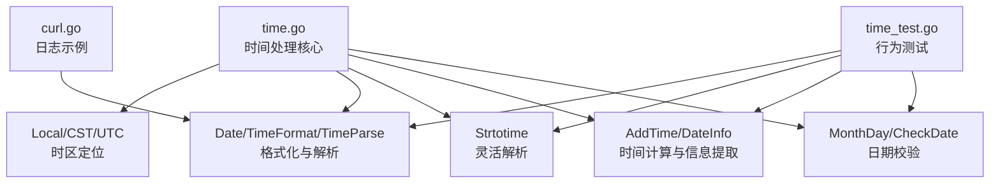
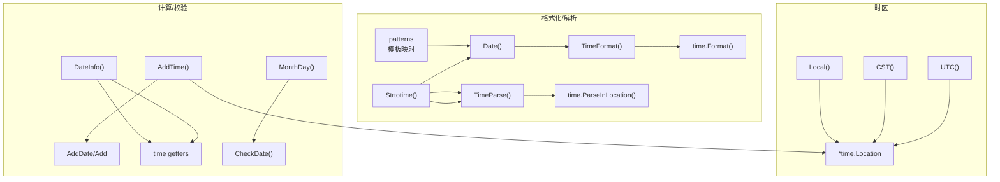
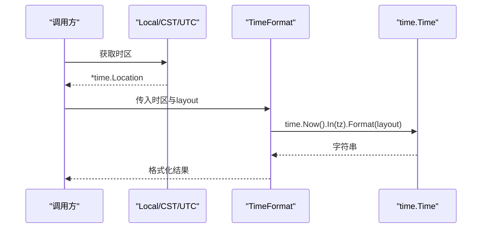
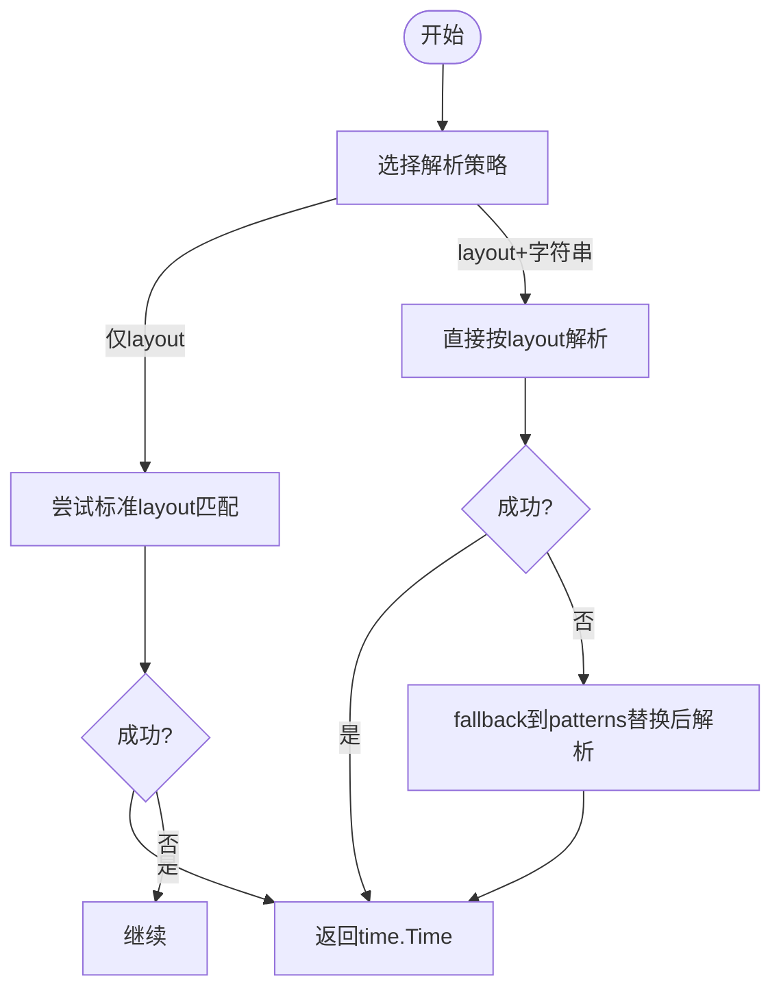
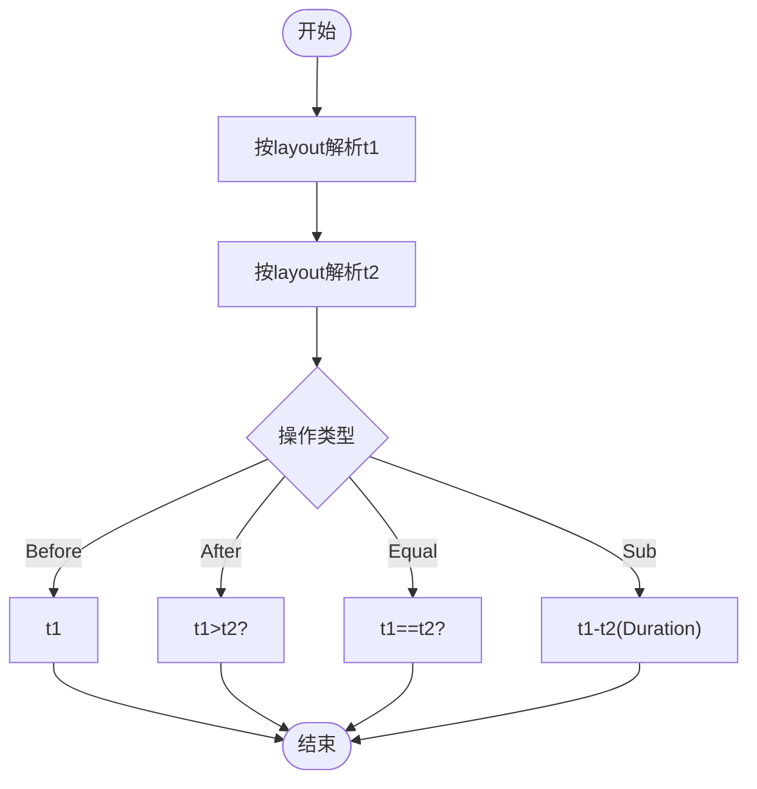
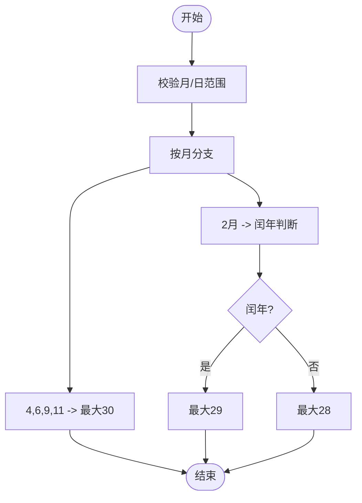
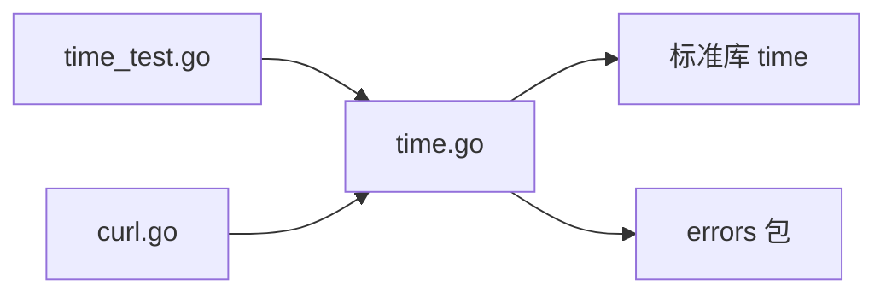

# 时间处理

<cite>
**本文引用的文件**
- [time.go](file://time.go)
- [time_test.go](file://time_test.go)
- [README.md](file://README.md)
- [go.mod](file://go.mod)
- [curl.go](file://curl.go)
</cite>

## 目录

1. [简介](#简介)
2. [项目结构](#项目结构)
3. [核心组件](#核心组件)
4. [架构总览](#架构总览)
5. [详细组件分析](#详细组件分析)
6. [依赖关系分析](#依赖关系分析)
7. [性能考量](#性能考量)
8. [故障排查指南](#故障排查指南)
9. [结论](#结论)
10. [附录](#附录)

## 简介

本文件系统性梳理仓库中的时间处理能力，覆盖时间格式化、时间计算、时区处理、日期校验与解析等关键功能，并结合测试用例给出典型使用场景与最佳实践建议。目标是帮助读者快速理解并正确使用时间处理相关接口，避免常见的时区、精度与边界问题。

## 项目结构

- 时间处理核心位于 time.go，提供时区定位、格式化/解析、时间计算、日期校验与信息提取等能力。
- 单元测试 time_test.go 覆盖格式化、解析、比较、差值计算等行为。
- README.md 提供整体项目背景与版本要求。
- go.mod 指明 Go 版本要求。
- curl.go 展示了在实际业务中对时间格式化的使用示例（日志记录）。

**图表来源**

- [time.go](file://time.go#L11-L24)
- [time.go](file://time.go#L26-L61)
- [time.go](file://time.go#L107-L144)
- [time.go](file://time.go#L146-L197)
- [time.go](file://time.go#L199-L240)
- [time.go](file://time.go#L242-L287)
- [time_test.go](file://time_test.go#L79-L179)
- [curl.go](file://curl.go#L449-L449)

**章节来源**

- [time.go](file://time.go#L1-L340)
- [time_test.go](file://time_test.go#L1-L299)
- [README.md](file://README.md#L1-L800)
- [go.mod](file://go.mod#L1-L4)
- [curl.go](file://curl.go#L1-L200)

## 核心组件

- 时区定位
    - Local：系统运行时区
    - CST：东八时区
    - UTC：UTC 时区
- 时间格式化
    - Date：基于自定义模板的格式化（支持毫秒/ms、微秒/us、纳秒/ns占位）
    - TimeFormat：基于 Go layout 的格式化，支持秒/纳秒输入自动识别
    - TimeParse：基于指定 layout 与时区解析字符串
    - Strtotime：尝试多种 layout 进行解析，支持自定义模板
- 时间计算
    - AddTime：对年/月/日/时/分/秒/毫秒/微秒/纳秒进行增量/减量运算
    - DateInfo：提取年、月、日、时、分、秒、毫秒、微秒、纳秒、Unix 秒/纳秒、星期、ISO 周、年中日、格式化字符串等
    - 比较与差值
        - Before/After/Equal：按给定 layout 比较两个时间字符串
        - Sub：计算两个时间字符串的时差（Duration）
- 日期校验
    - MonthDay：指定年月的天数
    - CheckDate：校验年、月、日是否合法

**章节来源**

- [time.go](file://time.go#L11-L24)
- [time.go](file://time.go#L26-L61)
- [time.go](file://time.go#L107-L144)
- [time.go](file://time.go#L146-L197)
- [time.go](file://time.go#L199-L240)
- [time.go](file://time.go#L242-L287)
- [time.go](file://time.go#L63-L105)

## 架构总览

下图展示时间处理模块的内部交互关系与调用链：

**图表来源**

- [time.go](file://time.go#L11-L24)
- [time.go](file://time.go#L26-L61)
- [time.go](file://time.go#L107-L144)
- [time.go](file://time.go#L146-L197)
- [time.go](file://time.go#L199-L240)
- [time.go](file://time.go#L242-L287)

## 详细组件分析

### 时区处理

- Local/CST/UTC 提供三种常用时区定位，便于在不同场景下进行格式化与解析。
- TimeFormat/TimeParse/Strtotime 均接收 *time.Location 作为时区参数，确保解析/格式化落在正确的时区上下文中。

**图表来源**

- [time.go](file://time.go#L11-L24)
- [time.go](file://time.go#L199-L220)

**章节来源**

- [time.go](file://time.go#L11-L24)
- [time.go](file://time.go#L199-L230)

### 时间格式化与解析

- 自定义模板映射（patterns）将 ms/us/ns 与 Go layout 的 000 对齐，同时映射 Y/y、m/n、M/F、d/j、D/l、g/h/H、a/A、i/s、e/P/O 等常见占位符。
- Date：先用 patterns.Replace 将自定义模板转换为 Go layout，再调用 TimeFormat。
- TimeFormat：支持仅秒或秒+纳秒两种输入；当仅传入秒且数值极大（纳秒级）时会自动拆分为秒与纳秒。
- TimeParse：严格按 layout 与时区解析字符串。
- Strtotime：优先尝试标准 layout（RFC3339Nano、DateTime、DateOnly），若失败再尝试自定义模板解析。

**图表来源**

- [time.go](file://time.go#L242-L287)
- [time.go](file://time.go#L26-L61)

**章节来源**

- [time.go](file://time.go#L26-L61)
- [time.go](file://time.go#L199-L240)
- [time.go](file://time.go#L242-L287)
- [time_test.go](file://time_test.go#L79-L179)

### 时间计算与信息提取

- AddTime：支持 Y/M/D/H/I/S/L/C/N 八种单位的增减，分别对应 AddDate/Add 系列操作。
- DateInfo：一次性提取年、月、日、时、分、秒、毫秒、微秒、纳秒、Unix 秒/纳秒、星期、ISO 周、年中日、格式化字符串等。
- 比较与差值：Before/After/Equal/ Sub 基于 time.Parse/layout 进行比较与差值计算。

**图表来源**

- [time.go](file://time.go#L289-L340)

**章节来源**

- [time.go](file://time.go#L107-L144)
- [time.go](file://time.go#L146-L197)
- [time.go](file://time.go#L289-L340)
- [time_test.go](file://time_test.go#L181-L298)

### 日期校验

- MonthDay：根据年份判断指定月份天数（含闰年）。
- CheckDate：对年、月、日进行范围与合法性校验。

**图表来源**

- [time.go](file://time.go#L63-L105)

**章节来源**

- [time.go](file://time.go#L63-L105)
- [time_test.go](file://time_test.go#L9-L41)

## 依赖关系分析

- time.go 依赖标准库 time 与 errors 包，提供统一的错误包装与追踪。
- 测试文件 time_test.go 通过多组用例覆盖格式化、解析、比较、差值与计算等行为。
- curl.go 展示了在日志记录中使用时间格式化的场景（如微秒级时间戳）。

**图表来源**

- [time.go](file://time.go#L3-L8)
- [time_test.go](file://time_test.go#L1-L8)
- [curl.go](file://curl.go#L1-L18)

**章节来源**

- [time.go](file://time.go#L3-L8)
- [time_test.go](file://time_test.go#L1-L8)
- [curl.go](file://curl.go#L1-L18)

## 性能考量

- 格式化路径
    - Date 先进行模板替换再调用 TimeFormat，避免重复构造 layout 字符串，减少字符串拼接开销。
    - TimeFormat 对秒/纳秒输入的自动拆分逻辑简单，建议在上层尽量传入明确的秒与纳秒，避免额外判断。
- 解析路径
    - Strtotime 优先尝试标准 layout，失败后再回退到自定义模板，可减少不必要的模板替换成本。
- 计算路径
    - AddTime 逐项累加，复杂度 O(n)，n 为增量参数数量；建议合并相近单位以减少调用次数。
- 错误处理
    - 统一使用 errors 包进行 Wrap/Errorf，便于定位问题但也会引入少量开销；在高频路径中可考虑缓存 layout 或复用解析结果。

[本节为通用性能建议，不直接分析具体文件，故无“章节来源”]

## 故障排查指南

- 解析失败
    - 若 Strtotime 返回错误，请确认 layout 与字符串长度一致，或提供显式的 layout+字符串组合。
    - 对于 RFC3339Nano、DateTime、DateOnly 等标准格式，确保字符串长度与 layout 完全匹配。
- 格式化异常
    - 自定义模板中 ms/us/ns 会被替换为 000，若期望保留精度，请使用对应的纳秒占位符。
    - TimeFormat 输入秒值极大时会自动视为纳秒级秒，注意上层传参意图。
- 比较与差值
    - Before/After/Equal/Sub 均依赖 layout，务必保证两个时间字符串使用同一 layout，否则比较结果不可预期。
- 时区问题
    - 格式化/解析必须传入正确的时区；Local() 依赖运行环境时区，跨主机部署时建议显式使用 CST/UTC。

**章节来源**

- [time.go](file://time.go#L242-L287)
- [time.go](file://time.go#L199-L240)
- [time.go](file://time.go#L289-L340)

## 结论

该时间处理模块提供了从格式化、解析、计算到校验的完整能力，配合测试用例展示了常见使用场景。建议在实际工程中：

- 明确时区与 layout，避免隐式依赖；
- 合理使用自定义模板与标准 layout；
- 在高频路径中减少不必要的字符串替换与解析；
- 对错误进行统一处理与记录，便于定位问题。

[本节为总结性内容，不直接分析具体文件，故无“章节来源”]

## 附录

### 实际使用示例（来自测试与业务）

- 日志记录
    - curl.go 中使用时间格式化记录请求开始时间，体现微秒级时间戳的记录方式。
- 定时任务
    - 可使用 DateInfo 提取当前时间的年、月、日、时、分、秒等字段，结合 AddTime 进行相对时间推导。
- 时间戳转换
    - TimeFormat 支持秒与纳秒两种输入，适合从数据库或外部系统接收不同精度的时间戳。

**章节来源**

- [curl.go](file://curl.go#L449-L449)
- [time_test.go](file://time_test.go#L43-L77)
- [time_test.go](file://time_test.go#L109-L142)