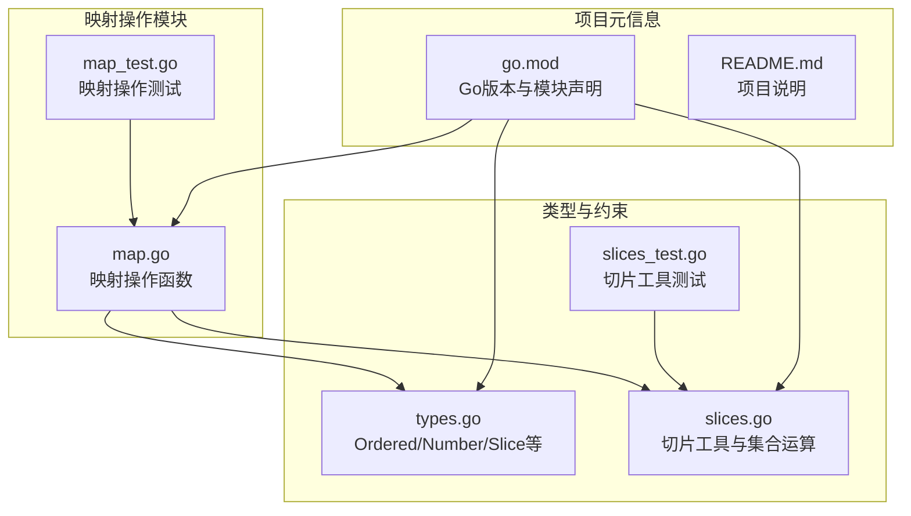
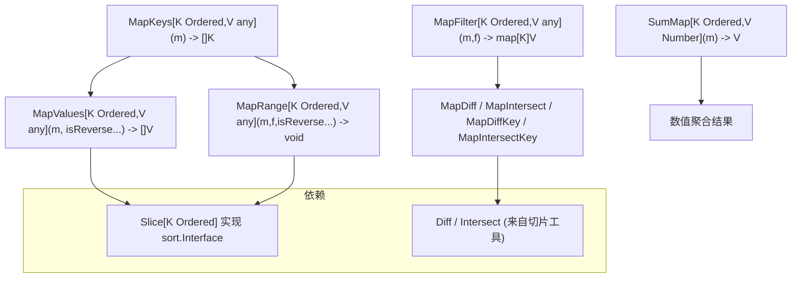
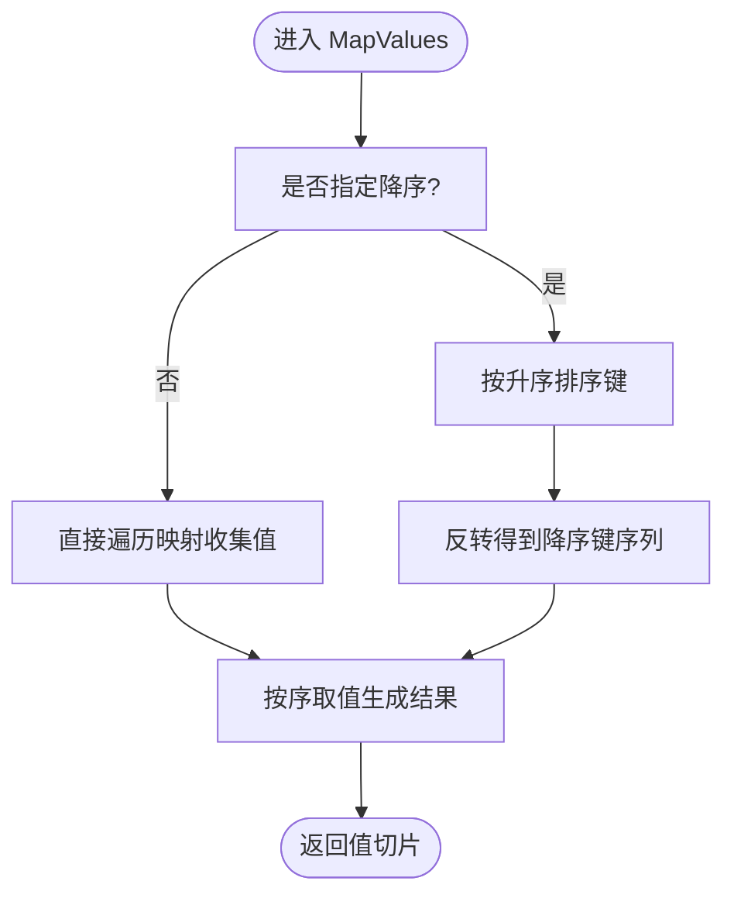
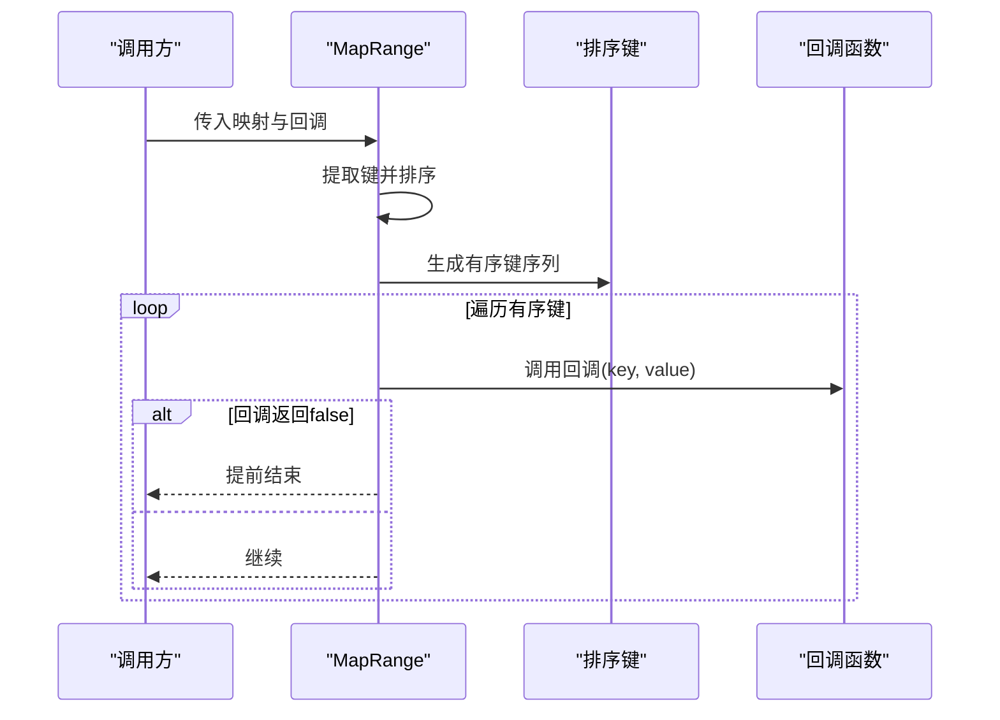
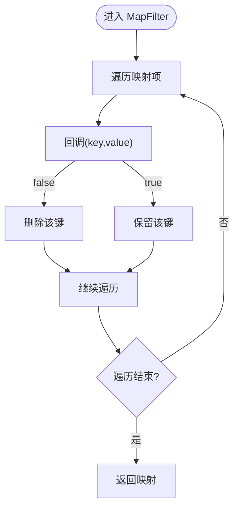
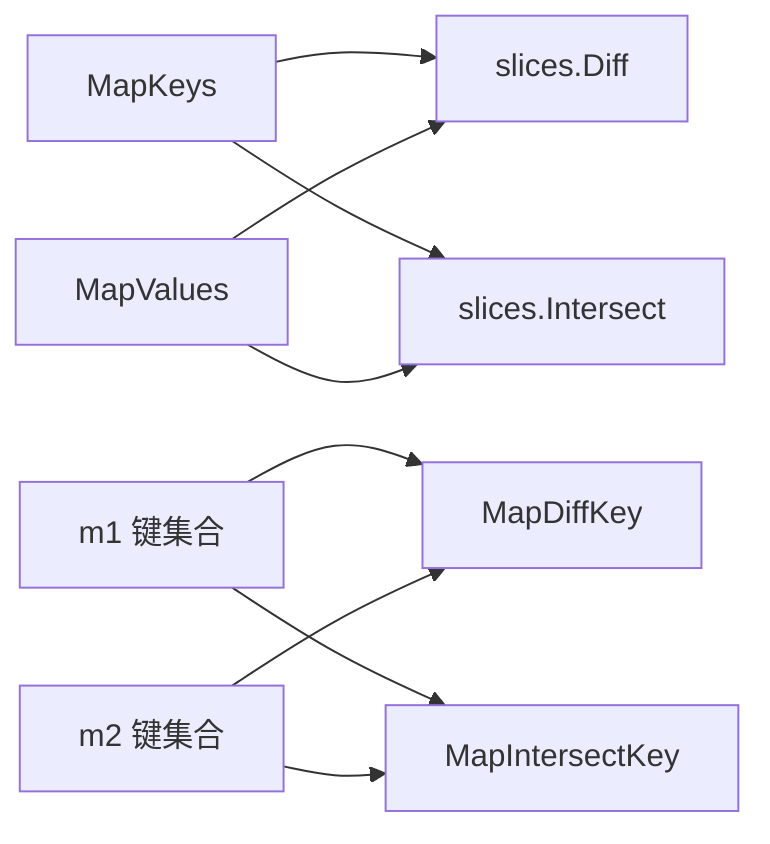
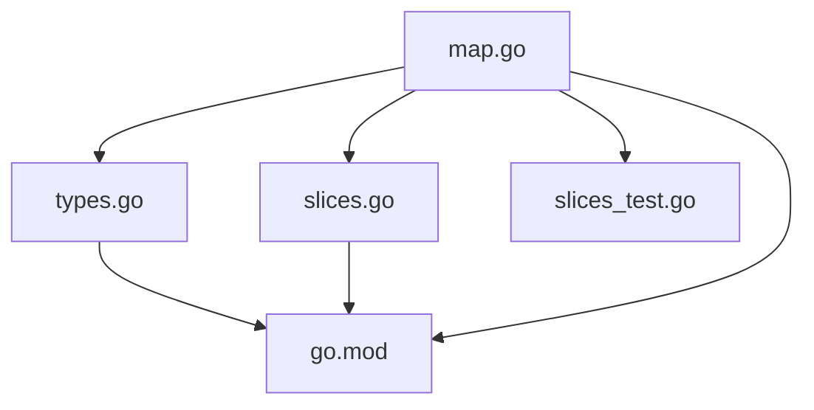

# 映射操作

<cite>
**本文引用的文件列表**
- [map.go](file://map.go)
- [map_test.go](file://map_test.go)
- [types.go](file://types.go)
- [slices.go](file://slices.go)
- [slices_test.go](file://slices_test.go)
- [go.mod](file://go.mod)
- [README.md](file://README.md)
</cite>

## 目录

1. [简介](#简介)
2. [项目结构](#项目结构)
3. [核心组件](#核心组件)
4. [架构总览](#架构总览)
5. [详细组件分析](#详细组件分析)
6. [依赖关系分析](#依赖关系分析)
7. [性能考量](#性能考量)
8. [故障排查指南](#故障排查指南)
9. [结论](#结论)
10. [附录](#附录)

## 简介

本文件系统性地梳理并说明映射（Map）操作功能，覆盖创建、初始化、基本操作、遍历、查找、插入与删除、与其他数据结构的转换、典型应用场景、性能特征与内存使用、最佳实践与常见陷阱。目标读者既包括初学者，也包括希望深入理解实现细节的工程师。

## 项目结构

本仓库采用按功能模块划分的组织方式，映射操作位于独立文件中，并通过类型系统与通用切片工具协同工作：

- 映射操作：map.go
- 映射操作测试：map_test.go
- 类型与泛型约束：types.go
- 切片工具与集合运算：slices.go
- 切片工具测试：slices_test.go
- 项目元信息：go.mod
- 项目说明：README.md

图表来源

- [map.go](file://map.go#L1-L134)
- [map_test.go](file://map_test.go#L1-L319)
- [types.go](file://types.go#L1-L98)
- [slices.go](file://slices.go#L1-L83)
- [slices_test.go](file://slices_test.go#L1-L232)
- [go.mod](file://go.mod#L1-L4)
- [README.md](file://README.md#L1-L800)

章节来源

- [map.go](file://map.go#L1-L134)
- [types.go](file://types.go#L1-L98)
- [slices.go](file://slices.go#L1-L83)
- [go.mod](file://go.mod#L1-L4)

## 核心组件

- 泛型与类型约束
    - Ordered：支持数字与字符串的有序比较，用于需要排序的场景
    - Number：整数与浮点数，用于数值计算
    - Slice[T Ordered]：可排序的切片类型，实现 sort.Interface
- 映射操作函数族
    - 键与值提取：MapKeys、MapValues
    - 有序遍历：MapRange
    - 过滤：MapFilter
    - 集合运算：MapDiff、MapIntersect、MapDiffKey、MapIntersectKey
    - 数值聚合：SumMap

章节来源

- [types.go](file://types.go#L1-L98)
- [map.go](file://map.go#L1-L134)

## 架构总览

映射操作围绕“键有序化 + 回调遍历/过滤 + 集合运算”展开，配合切片工具完成集合差集与交集计算，最终形成统一的映射处理能力。

图表来源

- [map.go](file://map.go#L7-L134)
- [slices.go](file://slices.go#L45-L83)
- [types.go](file://types.go#L35-L43)

## 详细组件分析

### 键与值提取：MapKeys 与 MapValues

- MapKeys
    - 功能：从映射中提取所有键，返回切片
    - 复杂度：O(n)，空间开销 O(n)
    - 适用：需要对键进行进一步处理（如排序、去重、集合运算）
- MapValues
    - 功能：可选升/降序返回值
    - 关键路径：先提取键，再排序，最后按序取值
    - 复杂度：O(n) 提取 + O(n log n) 排序 + O(n) 取值 = O(n log n)
    - 适用：需要稳定顺序输出值的场景

图表来源

- [map.go](file://map.go#L16-L43)

章节来源

- [map.go](file://map.go#L7-L43)

### 有序遍历：MapRange

- 功能：对键排序后逐个调用回调函数，支持提前终止
- 语义：回调返回 false 时停止遍历
- 复杂度：O(n log n) 排序 + O(n) 遍历
- 适用：需要按序处理映射元素且可能中途退出的场景

图表来源

- [map.go](file://map.go#L45-L64)

章节来源

- [map.go](file://map.go#L45-L64)

### 过滤：MapFilter

- 功能：基于回调函数删除不满足条件的键值对
- 语义：回调返回 false 时删除该元素
- 复杂度：O(n)
- 注意：在遍历过程中删除元素，需谨慎处理迭代器状态

图表来源

- [map.go](file://map.go#L66-L76)

章节来源

- [map.go](file://map.go#L66-L76)

### 集合运算：MapDiff、MapIntersect、MapDiffKey、MapIntersectKey

- MapDiff / MapIntersect
    - 将映射值投影为切片，再复用切片工具的集合运算
    - 复杂度：O(n) 投影 + O(n) 集合运算
- MapDiffKey / MapIntersectKey
    - 直接基于键集合进行查找与筛选
    - 复杂度：O(n) 遍历 + O(1) 查找（哈希表）

图表来源

- [map.go](file://map.go#L78-L124)
- [slices.go](file://slices.go#L45-L83)

章节来源

- [map.go](file://map.go#L78-L124)
- [slices.go](file://slices.go#L45-L83)

### 数值聚合：SumMap

- 功能：对映射值求和
- 复杂度：O(n)
- 适用：统计、评分、计数等场景

章节来源

- [map.go](file://map.go#L126-L133)

### 类型与排序：Slice[T Ordered]

- Slice[T] 实现 sort.Interface，支持升/降序排序
- 与 MapKeys/MV/MR 等函数配合，确保键的有序性

章节来源

- [types.go](file://types.go#L35-L43)

## 依赖关系分析

- 映射操作依赖类型系统（Ordered/Number/Slice）
- MapDiff / MapIntersect 依赖切片工具（Diff / Intersect）
- MapValues / MapRange 依赖 Slice 排序能力

图表来源

- [map.go](file://map.go#L1-L134)
- [types.go](file://types.go#L1-L98)
- [slices.go](file://slices.go#L1-L83)
- [slices_test.go](file://slices_test.go#L1-L232)
- [go.mod](file://go.mod#L1-L4)

章节来源

- [map.go](file://map.go#L1-L134)
- [types.go](file://types.go#L1-L98)
- [slices.go](file://slices.go#L1-L83)
- [slices_test.go](file://slices_test.go#L1-L232)
- [go.mod](file://go.mod#L1-L4)

## 性能考量

- 时间复杂度
    - MapKeys：O(n)
    - MapValues：O(n log n)（排序主导）
    - MapRange：O(n log n + n)（排序 + 遍历）
    - MapFilter：O(n)
    - MapDiff / MapIntersect：O(n)（依赖切片集合运算）
    - MapDiffKey / MapIntersectKey：O(n)
    - SumMap：O(n)
- 空间复杂度
    - MapKeys / MapValues / MapDiff / MapIntersect：O(n)
    - MapFilter：O(1)（原地修改）
    - MapDiffKey / MapIntersectKey：O(n)
    - SumMap：O(1)
- 排序策略
    - 使用 Slice[T] 实现 sort.Interface，避免重复造轮子
    - 降序通过 sort.Reverse 包裹实现，避免额外拷贝
- 避免不必要的排序
    - 若仅需遍历或聚合，优先使用 MapFilter 或 SumMap，避免排序开销

章节来源

- [map.go](file://map.go#L7-L134)
- [slices.go](file://slices.go#L45-L83)
- [types.go](file://types.go#L35-L43)

## 故障排查指南

- 遍历时删除元素导致异常
    - MapFilter 在遍历过程中删除元素，请确保回调逻辑正确，避免误删
- 键不可比较
    - Ordered 仅支持数字与字符串；若键为复合类型，需自定义比较或转换为可比较类型
- 降序与升序混淆
    - MapValues 与 MapRange 的 isReverse 参数控制排序方向，注意测试用例中的期望顺序
- 集合运算结果顺序
    - MapDiff / MapIntersect 基于切片运算，结果顺序取决于切片实现；如需稳定顺序，建议二次排序
- 性能问题定位
    - 若频繁调用 MapValues，考虑是否可以改为 SumMap 或直接遍历，减少排序成本

章节来源

- [map_test.go](file://map_test.go#L10-L319)
- [map.go](file://map.go#L16-L134)

## 结论

映射操作模块提供了面向键有序化、遍历控制、过滤与集合运算的完整工具链，结合类型系统与切片工具，能够高效处理常见的映射处理需求。在实际工程中，应根据具体场景选择合适的方法，避免不必要的排序与拷贝，充分利用回调与原地修改特性提升性能。

## 附录

### 实际使用示例（概念性说明）

- 数据缓存
    - 使用 MapFilter 清理过期条目，维持缓存容量
    - 使用 MapValues 获取稳定顺序的缓存条目，便于展示
- 配置管理
    - 使用 MapRange 逐项校验配置项，遇到非法值立即终止
    - 使用 MapIntersectKey 比较默认配置与用户配置的差异
- 索引构建
    - 使用 MapKeys 提取主键集合，再进行排序与索引化
    - 使用 MapDiffKey 识别新增/删除的索引项

### 最佳实践

- 优先使用 MapFilter 进行原地过滤，减少中间结构
- 需要稳定顺序输出时，使用 MapValues；否则直接遍历以节省排序成本
- 集合运算尽量复用切片工具，保持一致性
- 对于高频调用的场景，避免重复排序，必要时缓存排序结果

### 常见陷阱

- 在遍历过程中修改映射结构，可能导致迭代异常
- 键类型不符合 Ordered 约束，编译失败
- 误以为 MapDiff / MapIntersect 返回稳定顺序，应自行排序或接受无序结果