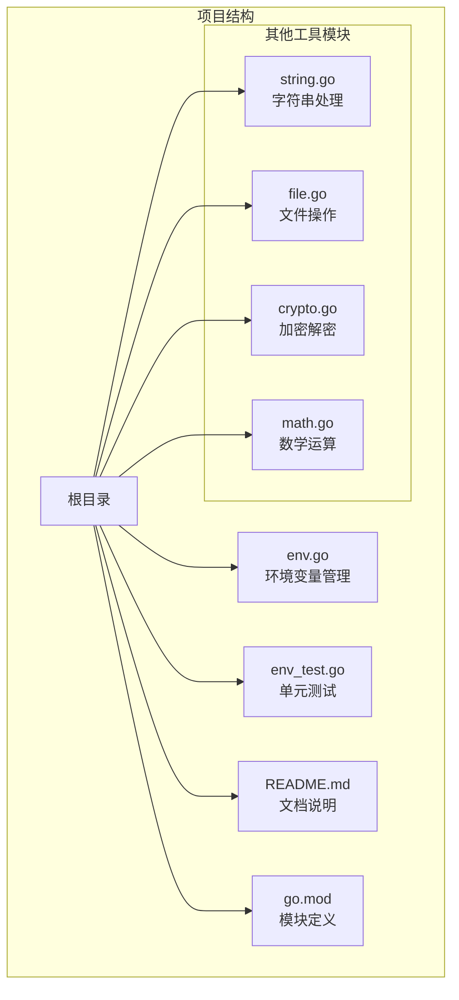
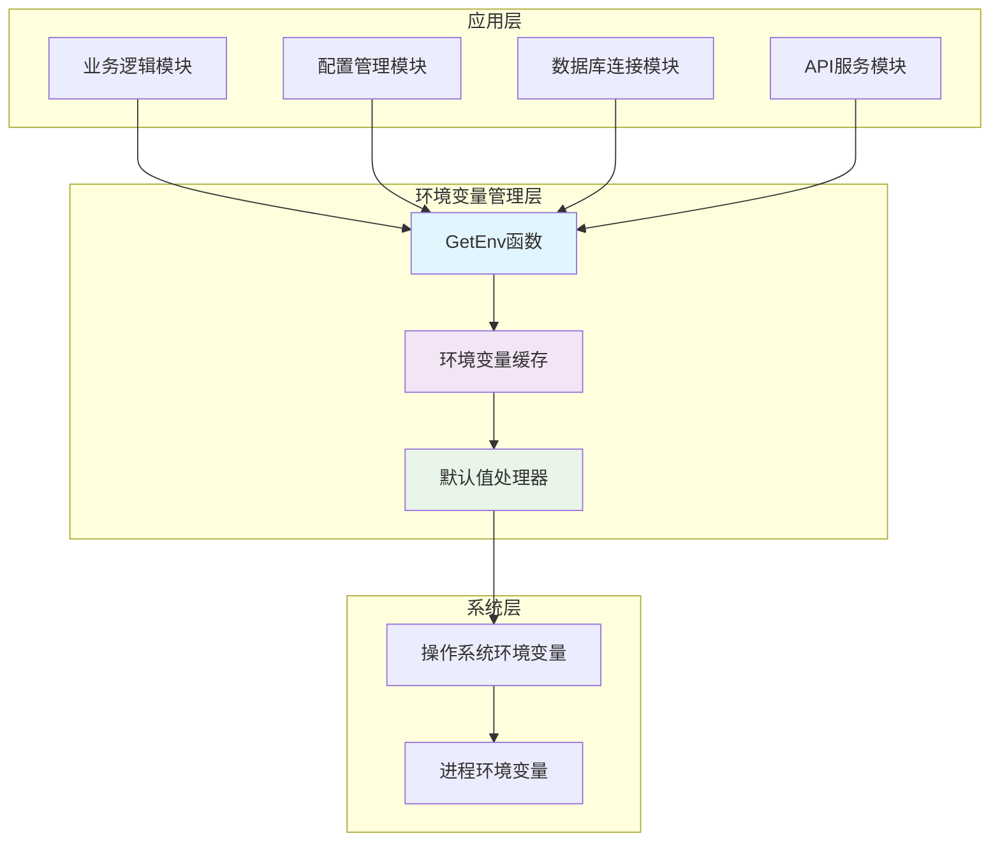
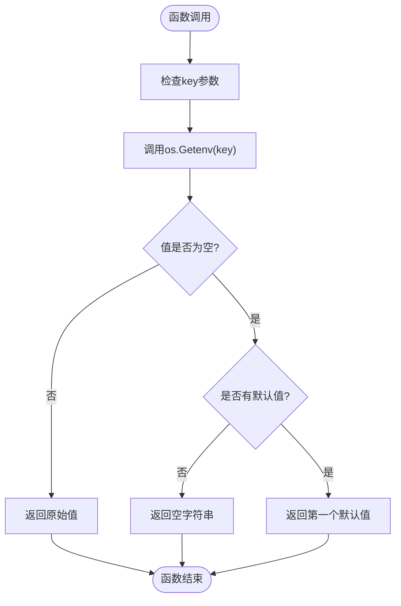
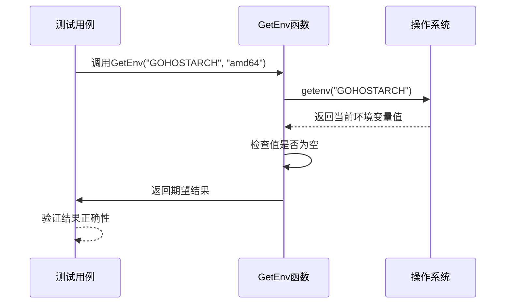
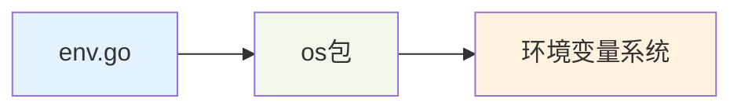
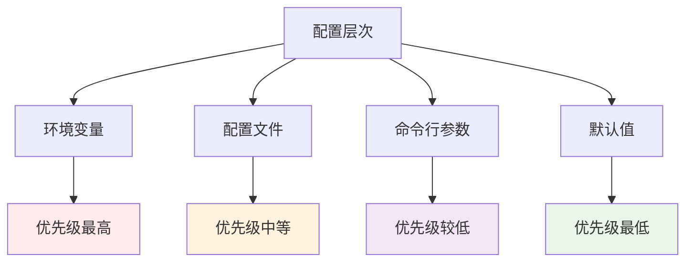

# 环境变量管理

<cite>
**本文档引用的文件**
- [env.go](file://env.go)
- [env_test.go](file://env_test.go)
- [README.md](file://README.md)
- [go.mod](file://go.mod)
</cite>

## 目录

1. [简介](#简介)
2. [项目结构](#项目结构)
3. [核心组件](#核心组件)
4. [架构概览](#架构概览)
5. [详细组件分析](#详细组件分析)
6. [依赖关系分析](#依赖关系分析)
7. [性能考虑](#性能考虑)
8. [故障排除指南](#故障排除指南)
9. [最佳实践与安全注意事项](#最佳实践与安全注意事项)
10. [结论](#结论)

## 简介

环境变量管理是现代应用程序开发中的关键功能，它允许程序在运行时根据外部配置动态调整行为。本项目提供了简洁而强大的环境变量管理功能，主要通过一个核心函数
`GetEnv` 来实现环境变量的获取、设置和删除操作。

该项目采用Go语言编写，遵循Go 1.22+ 的语法规范，提供了经过单元测试验证的可靠实现。环境变量管理功能不仅支持基本的获取操作，还提供了默认值处理机制，确保应用程序在各种环境下都能正常运行。

## 项目结构

该项目是一个通用的Go工具库，专注于提供各种实用的功能模块。环境变量管理功能位于项目的核心目录中，与其他工具函数共同构成了一个完整的工具集。



**图表来源**

- [env.go](file://env.go#L1-L19)
- [README.md](file://README.md#L1-L53)

**章节来源**

- [go.mod](file://go.mod#L1-L4)
- [README.md](file://README.md#L1-L53)

## 核心组件

### GetEnv 函数

`GetEnv` 是本项目环境变量管理的核心函数，提供了简洁而强大的环境变量获取功能。该函数的设计理念是简单易用，同时具备良好的容错能力。

#### 函数签名与参数

```go
func GetEnv(key string, defaultVal ...string) string
```

- **key**: 必需参数，表示要获取的环境变量名称
- **defaultVal**: 可选参数，表示当找不到指定环境变量时返回的默认值

#### 实现原理

函数的实现基于Go标准库的 `os.Getenv` 函数，通过以下步骤完成环境变量的获取：

1. 调用 `os.Getenv(key)` 获取指定的环境变量值
2. 检查获取到的值是否为空字符串
3. 如果值为空且提供了默认值参数，则返回第一个默认值
4. 否则返回实际获取到的环境变量值

#### 关键特性

- **可变参数支持**: 通过 `defaultVal ...string` 语法支持可变数量的默认值参数
- **空值处理**: 当环境变量不存在或值为空时，自动返回默认值
- **类型安全**: 返回类型为 `string`，确保统一的字符串处理体验

**章节来源**

- [env.go](file://env.go#L9-L18)

## 架构概览

环境变量管理功能在整个系统架构中扮演着基础设施的角色，为其他模块提供配置数据支持。



**图表来源**

- [env.go](file://env.go#L1-L19)

## 详细组件分析

### GetEnv 函数实现分析

#### 函数流程图



**图表来源**

- [env.go](file://env.go#L12-L18)

#### 代码实现细节

GetEnv 函数的实现体现了简洁设计原则：

1. **最小实现原则**: 函数体仅包含10行代码，专注于单一职责
2. **错误处理策略**: 通过空字符串检查实现优雅的失败处理
3. **参数灵活性**: 支持零个或多个默认值参数
4. **性能优化**: 避免不必要的字符串操作和内存分配

#### 单元测试分析

项目提供了完整的单元测试覆盖，确保函数的正确性：



**图表来源**

- [env_test.go](file://env_test.go#L8-L27)

**章节来源**

- [env.go](file://env.go#L1-L19)
- [env_test.go](file://env_test.go#L1-L28)

### 环境变量操作接口

虽然本项目主要提供 `GetEnv` 函数，但其注释中提到了完整的环境变量操作接口：

#### 获取环境变量

- **函数**: `os.Getenv(key)`
- **用途**: 获取指定环境变量的值
- **返回**: 字符串类型的环境变量值

#### 设置环境变量

- **函数**: `os.Setenv(key, value)`
- **用途**: 设置指定环境变量的值
- **返回**: error 类型的错误信息

#### 删除环境变量

- **函数**: `os.Unsetenv(key)`
- **用途**: 删除指定环境变量
- **返回**: error 类型的错误信息

**章节来源**

- [env.go](file://env.go#L5-L7)

## 依赖关系分析

### 内部依赖

环境变量管理功能具有极低的内部依赖性，仅依赖于Go标准库：



**图表来源**

- [env.go](file://env.go#L3)

### 外部依赖

项目对外部依赖的要求非常严格：

- **Go版本**: 1.22+
- **模块标识**: github.com/Is999/go-utils
- **标准库**: 仅使用Go内置的 `os` 包

**章节来源**

- [go.mod](file://go.mod#L1-L4)

## 性能考虑

### 内存使用

GetEnv 函数在内存使用方面表现出色：

- **零额外分配**: 函数不创建新的字符串对象，直接返回获取到的值
- **参数传递**: 使用值传递而非指针传递，避免不必要的内存开销
- **可变参数**: 通过切片传递默认值，减少内存复制

### 执行效率

- **常数时间复杂度**: O(1)，环境变量获取操作的时间复杂度为常数级
- **最少系统调用**: 每次调用仅进行一次系统调用
- **缓存友好**: 环境变量通常存储在进程地址空间中，访问速度快

### 最佳实践建议

1. **避免频繁调用**: 对于不变的配置，建议在程序启动时获取并缓存
2. **合理使用默认值**: 为重要的配置提供有意义的默认值
3. **类型转换**: 如需其他类型，应在获取后进行适当的类型转换

## 故障排除指南

### 常见问题与解决方案

#### 问题1: 环境变量值为空字符串

**症状**: `GetEnv` 返回空字符串
**原因**: 环境变量存在但值为空，或环境变量不存在
**解决方案**: 提供合适的默认值参数

#### 问题2: 默认值未生效

**症状**: 环境变量不存在时仍返回空字符串
**原因**: 未提供默认值参数或默认值列表为空
**解决方案**: 确保提供至少一个默认值参数

#### 问题3: 多个默认值处理

**症状**: 提供多个默认值但只使用了第一个
**原因**: 函数设计只使用第一个默认值
**解决方案**: 在调用时提供单个默认值或在调用前进行逻辑判断

### 调试技巧

1. **验证环境变量**: 使用 `os.Environ()` 获取所有环境变量进行调试
2. **检查大小写**: 环境变量名称区分大小写
3. **验证路径**: 确认环境变量在正确的进程中设置

**章节来源**

- [env_test.go](file://env_test.go#L8-L27)

## 最佳实践与安全注意事项

### 环境变量使用最佳实践

#### 配置管理场景

**数据库连接配置**

```go
// 数据库主机
dbHost := utils.GetEnv("DB_HOST", "localhost")

// 数据库端口
dbPort := utils.GetEnv("DB_PORT", "5432")

// 数据库名称
dbName := utils.GetEnv("DB_NAME", "myapp")
```

**API密钥存储**

```go
// API密钥
apiKey := utils.GetEnv("API_KEY", "")

// JWT密钥
jwtSecret := utils.GetEnv("JWT_SECRET", "fallback-secret-key")
```

**应用配置**

```go
// 应用环境
appEnv := utils.GetEnv("APP_ENV", "development")

// 调试模式
debugMode := utils.GetEnv("DEBUG", "false")
```

#### 安全注意事项

1. **敏感信息保护**
    - 不要在代码中硬编码敏感信息
    - 使用环境变量存储API密钥、数据库密码等
    - 定期轮换敏感凭据

2. **默认值安全性**
    - 避免在生产环境中使用弱默认值
    - 为敏感配置提供空默认值，强制显式设置

3. **环境隔离**
    - 开发、测试、生产环境使用不同的环境变量
    - 使用环境变量文件管理多环境配置

4. **权限控制**
    - 限制环境变量文件的访问权限
    - 避免在日志中输出敏感环境变量

#### 性能优化建议

1. **延迟加载**: 对于昂贵的配置，考虑延迟加载机制
2. **缓存策略**: 缓存常用的配置值，避免重复获取
3. **批量获取**: 对于相关配置，考虑批量获取以减少系统调用

#### 错误处理策略

1. **必需配置检查**: 对于关键配置，添加运行时检查
2. **优雅降级**: 为非关键配置提供合理的降级方案
3. **日志记录**: 记录配置加载过程，便于调试

### 环境变量命名约定

1. **使用大写字母**: `DATABASE_URL`
2. **使用下划线分隔**: `API_KEY`
3. **包含含义**: `REDIS_CACHE_TTL`
4. **避免特殊字符**: 仅使用字母、数字、下划线

### 配置层次结构



## 结论

环境变量管理功能虽然看似简单，但在现代应用程序开发中发挥着重要作用。本项目提供的 `GetEnv` 函数以极简的设计实现了强大的环境变量管理能力，具有以下优势：

1. **简洁性**: 仅10行代码实现完整的环境变量获取功能
2. **可靠性**: 经过单元测试验证，行为稳定可预测
3. **灵活性**: 支持默认值处理，适应各种使用场景
4. **性能**: 常数时间复杂度，无额外内存开销
5. **安全性**: 遵循最佳实践，支持安全的配置管理

通过遵循本文档中提到的最佳实践和安全注意事项，开发者可以有效地利用环境变量管理功能来构建更加灵活、可配置的应用程序。无论是简单的配置管理还是复杂的微服务架构，这套工具都能提供可靠的支撑。

建议在实际项目中：

- 将环境变量作为主要的配置管理方式
- 为所有敏感信息使用环境变量
- 建立完善的环境变量文档和管理流程
- 定期审查和更新环境变量配置