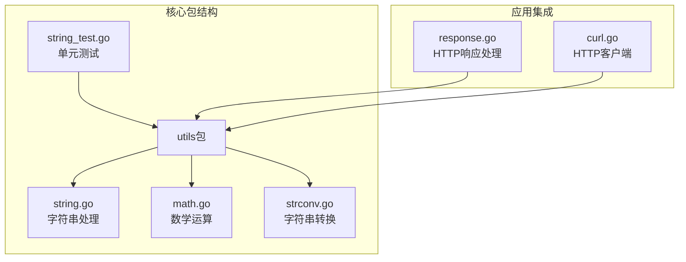
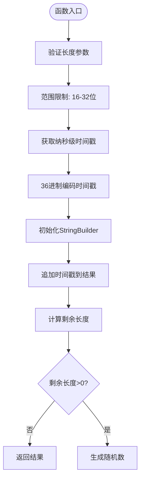
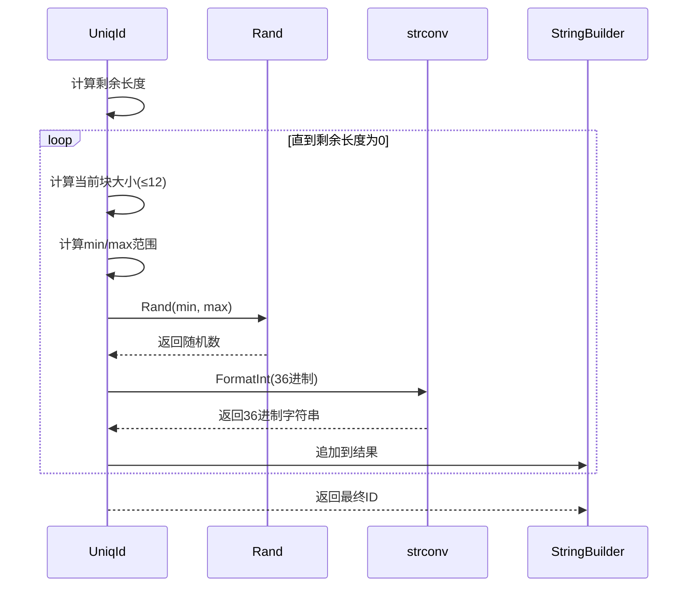
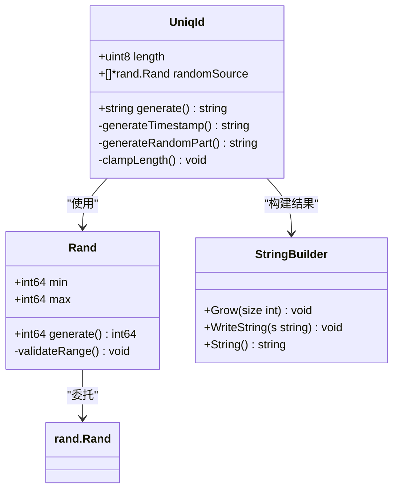
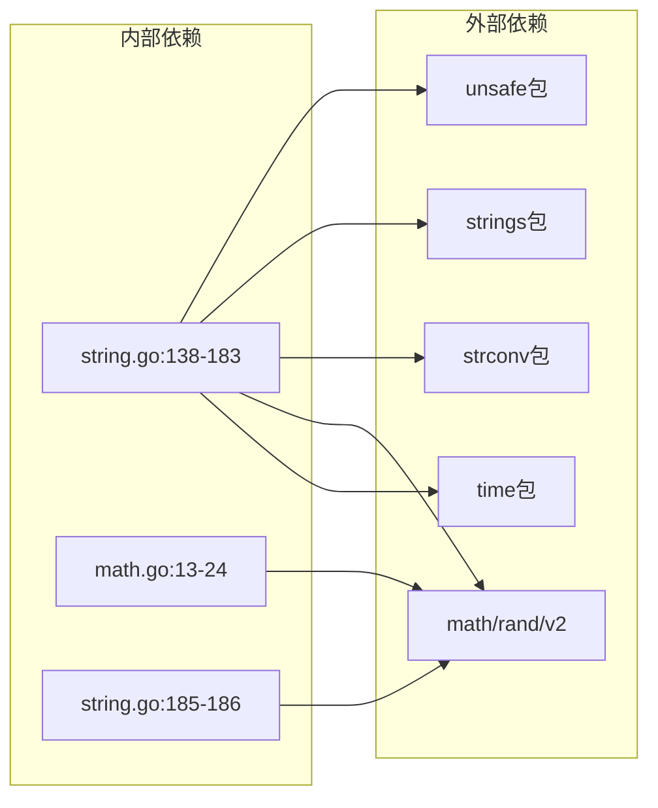

# 唯一ID生成

<cite>
**本文档引用的文件**
- [string.go](file://string.go)
- [string_test.go](file://string_test.go)
- [math.go](file://math.go)
- [strconv.go](file://strconv.go)
- [response.go](file://response.go)
- [curl.go](file://curl.go)
- [README.md](file://README.md)
</cite>

## 目录

1. [简介](#简介)
2. [项目结构](#项目结构)
3. [核心组件](#核心组件)
4. [架构概览](#架构概览)
5. [详细组件分析](#详细组件分析)
6. [依赖关系分析](#依赖关系分析)
7. [性能考虑](#性能考虑)
8. [故障排除指南](#故障排除指南)
9. [结论](#结论)

## 简介

唯一ID生成器是一个高效的Go语言工具库，专门用于生成长度范围在16-32位之间的唯一标识符字符串。该实现采用时间戳编码与随机数生成相结合的混合策略，确保生成的ID具有良好的排序特性和高熵特性。

该库提供了多种字符串生成工具，包括随机字符串生成、唯一ID生成等功能，广泛应用于Web开发、API设计、日志追踪等场景。

## 项目结构

该项目采用模块化设计，主要功能集中在utils包中，包含以下核心文件：



**图表来源**

- [string.go](file://string.go#L1-L187)
- [math.go](file://math.go#L1-L37)
- [strconv.go](file://strconv.go#L1-L109)

**章节来源**

- [README.md](file://README.md#L1-L50)

## 核心组件

### UniqId函数

UniqId是本库的核心功能，负责生成唯一标识符字符串。其主要特点包括：

- **长度范围控制**：支持16-32位长度，超出范围自动调整
- **时间戳编码**：使用纳秒级时间戳作为前缀，确保天然排序性
- **36进制编码**：采用36进制系统（0-9, a-z），提高空间效率
- **随机数扩展**：通过随机数生成器扩展ID长度和熵值

**章节来源**

- [string.go](file://string.go#L133-L183)
- [README.md](file://README.md#L840-L851)

### Rand函数

Rand函数提供范围随机数生成能力，是UniqId算法的重要组成部分：

- **范围控制**：支持任意范围内的整数生成
- **边界处理**：智能处理最小值和最大值的大小关系
- **性能优化**：支持复用随机源，减少性能开销

**章节来源**

- [math.go](file://math.go#L8-L24)

## 架构概览

唯一ID生成系统的整体架构采用分层设计：

```mermaid
graph TB
subgraph "用户接口层"
API[UniqId API]
Config[配置参数]
end
subgraph "核心算法层"
Timestamp[时间戳生成]
Encode[36进制编码]
Random[随机数生成]
Builder[StringBuilder]
end
subgraph "底层支撑层"
Time[time.Now()]
Rand[rand.NewPCG]
Strconv[strconv.FormatInt]
end
API --> Timestamp
API --> Encode
API --> Random
API --> Builder
Timestamp --> Time
Random --> Rand
Encode --> Strconv
Builder --> API
```

**图表来源**

- [string.go](file://string.go#L138-L183)
- [math.go](file://math.go#L13-L24)

## 详细组件分析

### UniqId算法实现

UniqId函数采用混合编码策略，结合时间戳和随机数生成：

#### 时间戳编码阶段



**图表来源**

- [string.go](file://string.go#L138-L183)

#### 随机数生成阶段

随机数生成采用分块策略，每次最多生成12位36进制字符：



**图表来源**

- [string.go](file://string.go#L164-L180)
- [math.go](file://math.go#L13-L24)

#### 36进制编码选择

选择36进制的主要原因：

1. **字符集优化**：使用0-9和a-z共36个字符，平衡可读性和空间效率
2. **排序特性**：保持字典序，便于数据库索引和排序
3. **性能优势**：相比64进制，字符集更小，处理更简单
4. **兼容性**：避免特殊字符，提高跨平台兼容性

**章节来源**

- [string.go](file://string.go#L133-L137)

### 数据结构设计



**图表来源**

- [string.go](file://string.go#L138-L183)
- [math.go](file://math.go#L13-L24)

**章节来源**

- [string.go](file://string.go#L185-L186)

## 依赖关系分析

唯一ID生成器的依赖关系相对简洁，主要依赖于Go标准库：



**图表来源**

- [string.go](file://string.go#L3-L9)
- [math.go](file://math.go#L3-L6)

**章节来源**

- [string.go](file://string.go#L1-L9)
- [math.go](file://math.go#L1-L6)

## 性能考虑

### 时间复杂度分析

- **时间复杂度**：O(n)，其中n为生成的ID长度
- **空间复杂度**：O(n)，主要用于StringBuilder和中间字符串存储
- **随机数生成**：O(k)，其中k为随机数块数量（k = ceil(n/12)）

### 性能优化建议

1. **批量生成优化**
    - 复用随机源：通过传递`r`参数避免重复创建随机数生成器
    - 预分配容量：使用`strings.Builder.Grow()`预分配内存

2. **算法优化点**
    - 避免不必要的字符串转换
    - 合理设置ID长度，避免过长导致的性能损耗
    - 在高频场景下考虑使用更短的ID长度

3. **内存管理**
    - 利用Go的字符串不可变特性减少内存复制
    - 及时释放不再使用的临时字符串

**章节来源**

- [string.go](file://string.go#L151-L153)
- [string_test.go](file://string_test.go#L272-L291)

## 故障排除指南

### 常见问题及解决方案

#### 1. ID长度异常

**问题描述**：生成的ID长度不在16-32范围内

**解决方案**：

- 确保传入的长度参数在有效范围内
- 检查是否有外部代码修改了默认行为

#### 2. 性能问题

**问题描述**：大量并发生成ID时性能下降

**解决方案**：

- 使用共享的随机源实例
- 考虑使用更短的ID长度
- 避免在同一goroutine中频繁创建新的随机源

#### 3. 排序问题

**问题描述**：ID排序不符合预期

**解决方案**：

- 确保使用纳秒级时间戳
- 避免手动修改ID格式
- 在数据库中使用合适的索引策略

**章节来源**

- [string_test.go](file://string_test.go#L234-L270)

### 测试覆盖

库提供了全面的测试用例：

- **边界测试**：测试16位和32位的边界情况
- **性能基准**：提供基准测试用例
- **并发安全**：验证多goroutine环境下的安全性

**章节来源**

- [string_test.go](file://string_test.go#L234-L291)

## 结论

唯一ID生成器是一个设计精良的工具库组件，具有以下优点：

1. **算法稳健**：采用经过验证的时间戳+随机数混合策略
2. **性能优秀**：通过合理的算法设计和内存管理实现高效性能
3. **易于使用**：简洁的API设计，易于集成到各种应用场景
4. **可维护性强**：清晰的代码结构和完善的测试覆盖

该实现特别适合需要高性能、可排序的唯一标识符生成场景，如分布式系统、API设计、日志追踪等。通过合理使用提供的优化建议，可以在各种规模的应用中获得最佳性能表现。