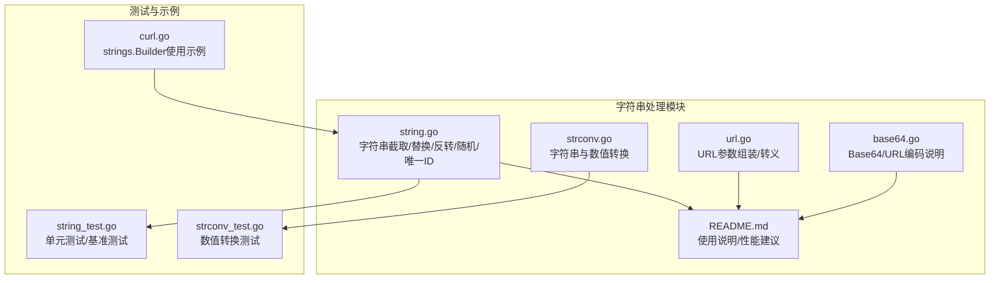
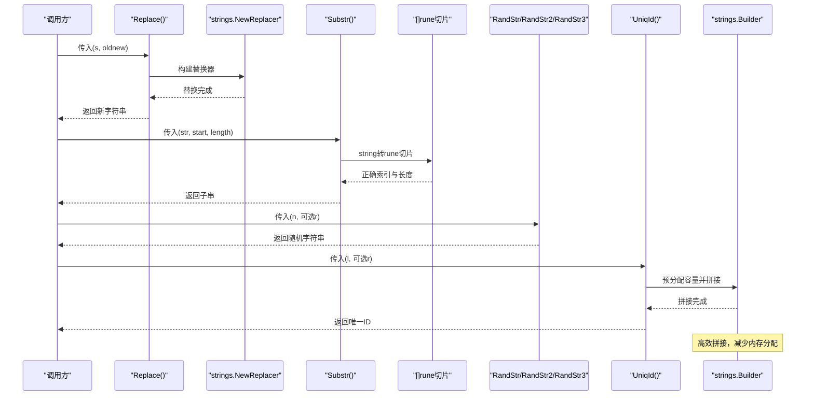
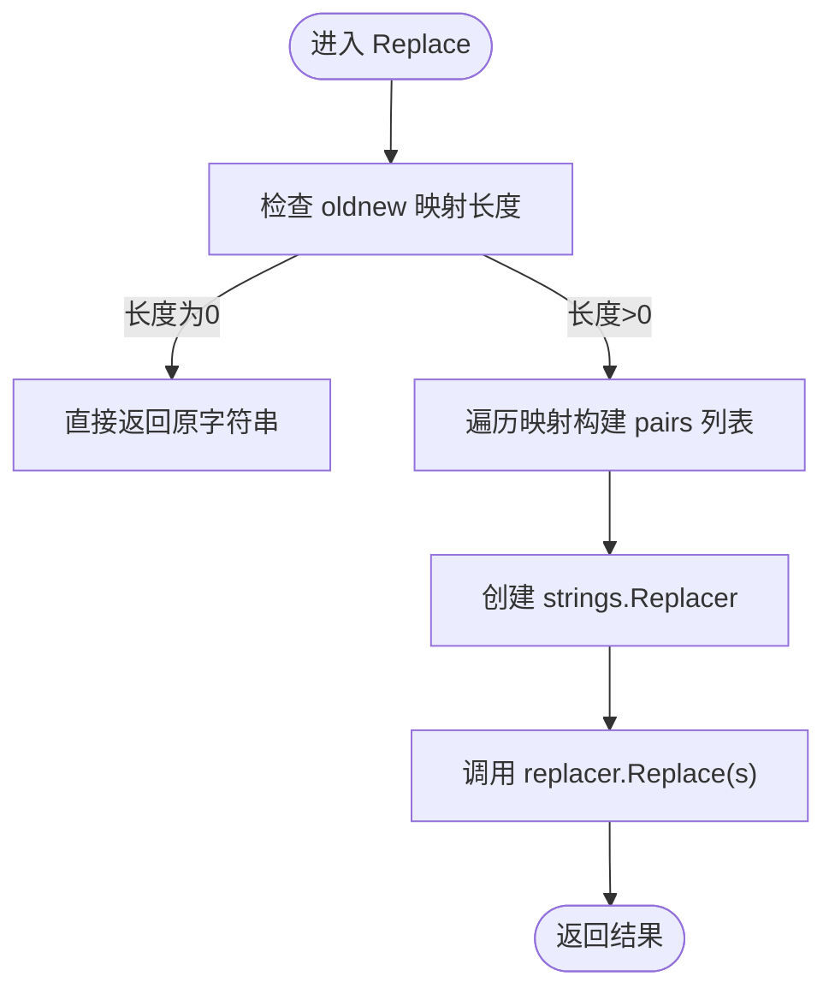
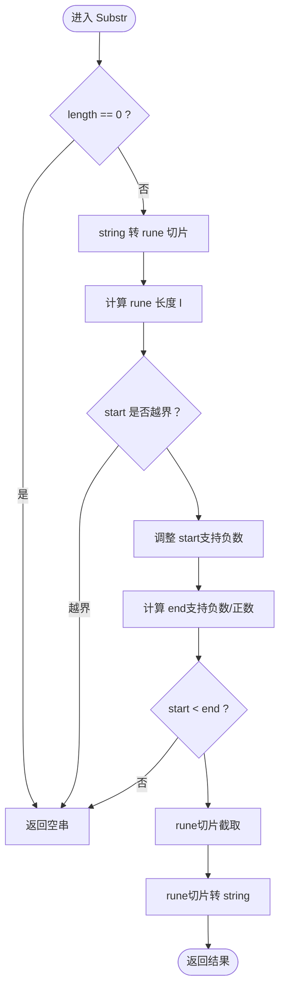
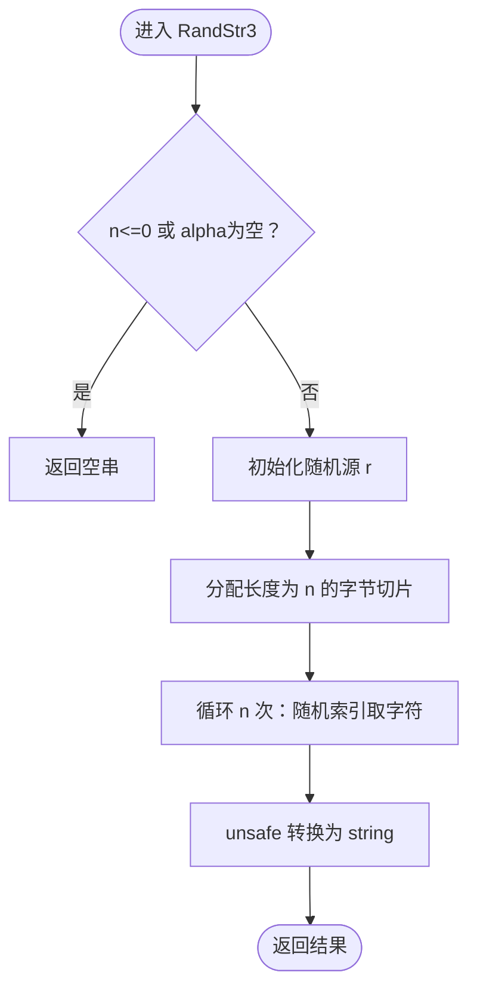
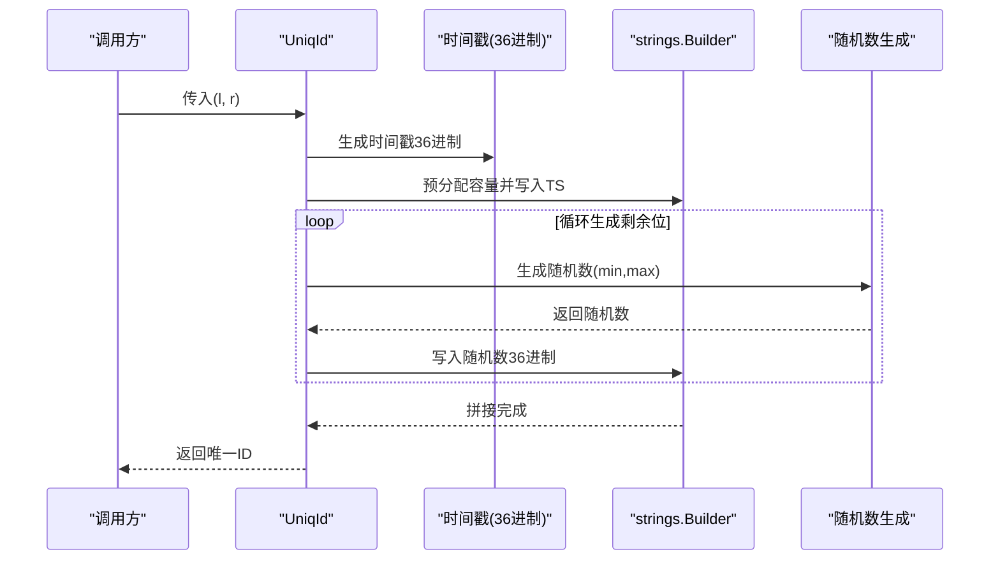
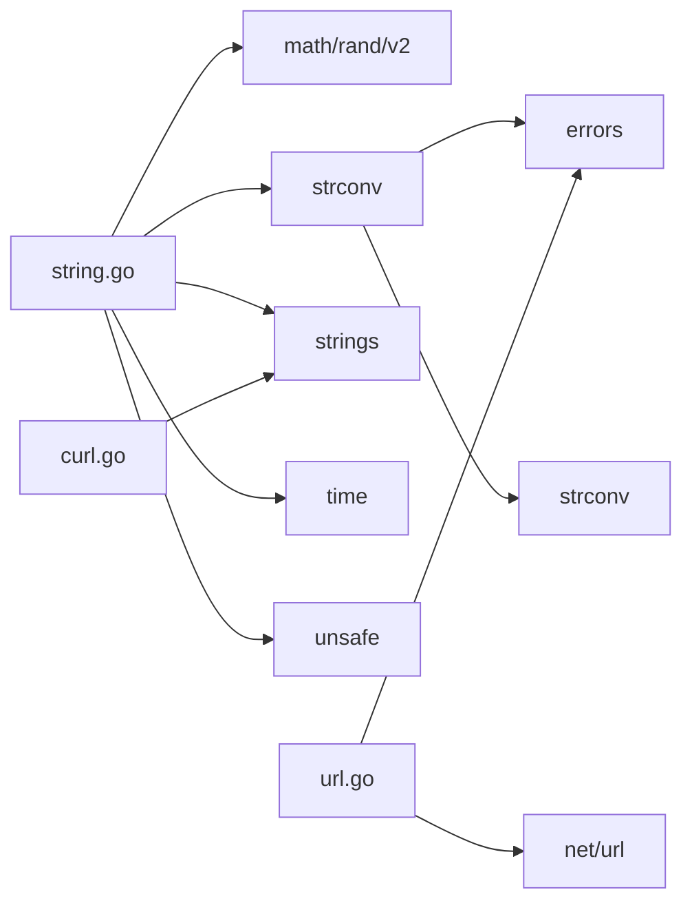

# 字符串处理模块

<cite>
**本文档引用的文件**
- [string.go](file://string.go)
- [string_test.go](file://string_test.go)
- [strconv.go](file://strconv.go)
- [strconv_test.go](file://strconv_test.go)
- [base64.go](file://base64.go)
- [url.go](file://url.go)
- [README.md](file://README.md)
- [curl.go](file://curl.go)
</cite>

## 目录

1. [简介](#简介)
2. [项目结构](#项目结构)
3. [核心组件](#核心组件)
4. [架构总览](#架构总览)
5. [详细组件分析](#详细组件分析)
6. [依赖关系分析](#依赖关系分析)
7. [性能考量](#性能考量)
8. [故障排查指南](#故障排查指南)
9. [结论](#结论)
10. [附录](#附录)

## 简介

本模块专注于字符串处理与编码转换，覆盖字符串截取、拼接、长度计算、查找替换、随机字符串生成、唯一ID生成、Base64编码解码、URL编码解码以及宽字符处理等能力。文档提供函数签名、参数说明、使用示例路径与最佳实践，帮助开发者在保证正确性的前提下获得高性能的字符串处理体验。

## 项目结构

字符串处理相关代码主要分布在以下文件：

- string.go：字符串截取、替换、反转、随机字符串生成、唯一ID生成等核心功能
- strconv.go：字符串与数值类型的转换（十进制、二进制、八进制、十六进制）
- base64.go：Base64编码与URL安全编码的说明
- url.go：URL查询参数组装与转义
- README.md：官方文档，包含字符串处理的使用说明与性能建议
- string_test.go、strconv_test.go：对应功能的单元测试与基准测试
- curl.go：在HTTP请求日志中使用strings.Builder进行高效拼接的示例

图表来源

- [string.go](file://string.go#L1-L187)
- [strconv.go](file://strconv.go#L1-L109)
- [base64.go](file://base64.go#L1-L8)
- [url.go](file://url.go#L1-L27)
- [README.md](file://README.md#L37-L802)
- [string_test.go](file://string_test.go#L1-L292)
- [strconv_test.go](file://strconv_test.go#L1-L145)
- [curl.go](file://curl.go#L547-L560)

章节来源

- [string.go](file://string.go#L1-L187)
- [strconv.go](file://strconv.go#L1-L109)
- [base64.go](file://base64.go#L1-L8)
- [url.go](file://url.go#L1-L27)
- [README.md](file://README.md#L37-L802)

## 核心组件

- 字符串替换：支持多对多替换规则，内部使用strings.NewReplacer进行高效替换
- 字符串截取：支持正负索引与长度控制，内部通过rune切片确保宽字符正确截取
- 字符串反转：基于rune切片反转，保持字符语义完整性
- 随机字符串生成：提供多种规则（仅字母、字母+数字、自定义字符集），支持复用随机源
- 唯一ID生成：结合纳秒级时间戳与随机数，生成可排序的字符串ID
- 数值转换：支持二进制/八进制/十进制/十六进制之间的相互转换
- Base64编码解码：提供标准与URL安全两种编码方案
- URL编码解码：提供查询参数转义与反转义
- 性能优化：大量使用strings.Builder进行高效拼接，避免频繁内存分配

章节来源

- [string.go](file://string.go#L22-L187)
- [strconv.go](file://strconv.go#L8-L109)
- [base64.go](file://base64.go#L1-L8)
- [url.go](file://url.go#L8-L26)
- [README.md](file://README.md#L85-L130)

## 架构总览

字符串处理模块采用“功能内聚、接口清晰”的设计，围绕字符串操作提供统一入口。核心流程如下：

- 输入字符串进入各功能函数
- 根据功能选择合适的算法与数据结构（如rune切片、strings.Builder、strings.Replacer）
- 输出结果并返回给调用方
- 错误通过包装返回，便于上层统一处理

图表来源

- [string.go](file://string.go#L22-L187)
- [curl.go](file://curl.go#L547-L560)

## 详细组件分析

### 字符串替换 Replace

- 功能：根据映射表进行多对多替换
- 参数：
    - s：源字符串
    - oldnew：替换规则映射，键为要替换的字符串，值为替换成的字符串
- 返回：替换后的字符串
- 实现要点：将映射表扁平化为pairs，交由strings.NewReplacer批量替换，避免多次扫描

图表来源

- [string.go](file://string.go#L22-L36)

章节来源

- [string.go](file://string.go#L22-L36)
- [string_test.go](file://string_test.go#L10-L32)

### 字符串截取 Substr

- 功能：支持正负索引与长度控制的宽字符安全截取
- 参数：
    - str：被截取的字符串
    - start：起始索引（支持负数）
    - length：长度（>0表示长度，<0表示结束索引，==0返回空串）
- 返回：截取后的子串
- 实现要点：内部将string转为[]rune，确保中文等宽字符的正确性；对start/end进行边界校验与修正

图表来源

- [string.go](file://string.go#L47-L84)

章节来源

- [string.go](file://string.go#L47-L84)
- [string_test.go](file://string_test.go#L34-L59)

### 字符串反转 StrRev

- 功能：反转字符串，保持宽字符语义
- 参数：str
- 返回：反转后的字符串
- 实现要点：先将字符串转为rune切片，再反转，最后转回字符串

章节来源

- [string.go](file://string.go#L86-L89)
- [string_test.go](file://string_test.go#L61-L87)

### 随机字符串生成

- RandStr：生成仅包含英文字母的随机字符串
- RandStr2：生成字母+数字的随机字符串
- RandStr3：生成自定义字符集的随机字符串
- 参数：
    - n：目标长度
    - r：可选随机源（复用可提升批量生成效率）
- 返回：随机字符串
- 实现要点：使用[]byte构造字符串，配合unsafe指针转换，减少一次拷贝；支持传入随机源以避免重复初始化

图表来源

- [string.go](file://string.go#L113-L131)

章节来源

- [string.go](file://string.go#L91-L131)
- [string_test.go](file://string_test.go#L111-L172)

### 唯一ID生成 UniqId

- 功能：生成长度16-32位的可排序字符串ID
- 参数：
    - l：目标长度（自动约束在[16,32]）
    - r：可选随机源
- 返回：唯一ID字符串
- 实现要点：前12位为纳秒级时间戳的36进制表示；其余位通过多次生成随机数拼接，使用strings.Builder预分配容量，减少内存分配

图表来源

- [string.go](file://string.go#L133-L183)

章节来源

- [string.go](file://string.go#L133-L183)
- [string_test.go](file://string_test.go#L234-L270)

### 数值转换（字符串↔数值）

- 提供十进制、二进制、八进制、十六进制之间的相互转换
- 包含字符串转整数/浮点数的便捷函数
- 错误通过包装返回，便于追踪

章节来源

- [strconv.go](file://strconv.go#L8-L109)
- [strconv_test.go](file://strconv_test.go#L8-L145)

### Base64编码解码

- 提供标准Base64与URL安全Base64的编码/解码说明
- 适用于通用数据编码与URL/文件名场景

章节来源

- [base64.go](file://base64.go#L1-L8)

### URL编码解码与参数组装

- 提供URL查询参数转义与反转义
- 支持将参数合并到URL路径中

章节来源

- [url.go](file://url.go#L8-L26)

## 依赖关系分析

- string.go依赖：
    - math/rand/v2：随机数生成
    - strconv：数值与字符串转换
    - strings：字符串替换与Builder
    - time：时间戳生成
    - unsafe：字符串与字节切片转换
- strconv.go依赖：
    - errors：错误包装
    - strconv：数值解析与格式化
- url.go依赖：
    - errors：错误包装
    - net/url：URL解析与查询参数处理
- curl.go在日志输出中使用strings.Builder进行高效拼接

图表来源

- [string.go](file://string.go#L3-L9)
- [strconv.go](file://strconv.go#L3-L6)
- [url.go](file://url.go#L3-L6)
- [curl.go](file://curl.go#L547-L560)

章节来源

- [string.go](file://string.go#L3-L9)
- [strconv.go](file://strconv.go#L3-L6)
- [url.go](file://url.go#L3-L6)
- [curl.go](file://curl.go#L547-L560)

## 性能考量

- 高效拼接：优先使用strings.Builder并预估容量，减少扩容与复制
- 替换优化：使用strings.NewReplacer一次性构建替换器，避免多次扫描
- 宽字符安全：截取与反转使用rune切片，避免字节层面的错误
- 随机生成：复用随机源，减少初始化开销
- 唯一ID：预分配容量并分段生成随机数，降低内存压力
- 错误处理：统一使用包装返回，便于快速定位问题

章节来源

- [README.md](file://README.md#L85-L130)
- [string.go](file://string.go#L150-L183)
- [curl.go](file://curl.go#L547-L560)

## 故障排查指南

- 宽字符截取异常：确认使用Substr而非直接切片，确保rune层面的索引正确
- 随机字符串重复：检查是否复用同一随机源；批量生成时传入相同的随机源
- 唯一ID冲突：UniqId仅生成字符串并不保证全局唯一，如需唯一性请结合业务策略
- Base64/URL编码问题：区分标准与URL安全编码，避免混用导致解析失败
- URL参数组装：确保参数非空且正确编码，必要时使用UrlPath进行合并

章节来源

- [string_test.go](file://string_test.go#L34-L59)
- [string_test.go](file://string_test.go#L111-L172)
- [string_test.go](file://string_test.go#L234-L270)
- [url.go](file://url.go#L11-L26)

## 结论

字符串处理模块提供了全面而高效的字符串操作能力，涵盖替换、截取、反转、随机生成、唯一ID生成、数值转换、Base64与URL编码解码等。通过合理使用strings.Builder、rune切片与替换器，可在保证正确性的同时显著提升性能。建议在实际项目中遵循模块提供的最佳实践，结合单元测试与基准测试验证性能与稳定性。

## 附录

### 函数清单与参数说明

- Replace(s string, oldnew map[string]string) string
    - s：源字符串
    - oldnew：替换规则映射
- Substr(str string, start, length int) string
    - str：被截取字符串
    - start：起始索引（支持负数）
    - length：长度（>0表示长度，<0表示结束索引，==0返回空串）
- StrRev(str string) string
    - str：待反转字符串
- RandStr(n int, r ...*rand.Rand) string
    - n：目标长度
    - r：可选随机源
- RandStr2(n int, r ...*rand.Rand) string
    - n：目标长度
    - r：可选随机源
- RandStr3(n int, alpha string, r ...*rand.Rand) string
    - n：目标长度
    - alpha：字符集
    - r：可选随机源
- UniqId(l uint8, r ...*rand.Rand) string
    - l：目标长度（16-32）
    - r：可选随机源
- Str2Int(s string) int
    - s：字符串
- Str2Int64(s string) int64
    - s：字符串
- Str2Float(s string) float64
    - s：字符串
- UrlPath(urlPath string, params url.Values) (string, error)
    - urlPath：基础URL
    - params：查询参数

章节来源

- [string.go](file://string.go#L22-L187)
- [strconv.go](file://strconv.go#L8-L109)
- [url.go](file://url.go#L11-L26)

### 使用示例路径

- Replace：参考[string_test.go](file://string_test.go#L10-L32)
- Substr：参考[string_test.go](file://string_test.go#L34-L59)
- StrRev：参考[string_test.go](file://string_test.go#L61-L87)
- RandStr/RandStr2/RandStr3：参考[string_test.go](file://string_test.go#L111-L172)
- UniqId：参考[string_test.go](file://string_test.go#L234-L270)
- 数值转换：参考[strconv_test.go](file://strconv_test.go#L8-L145)