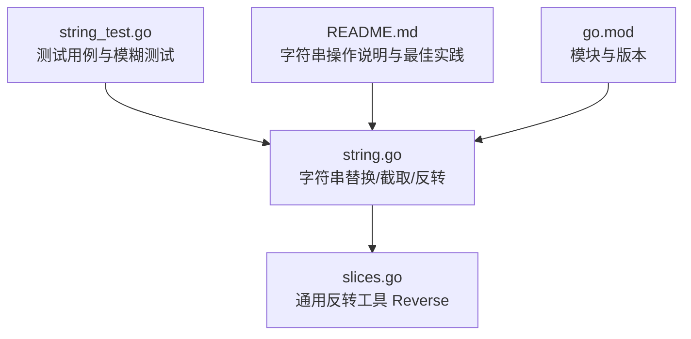
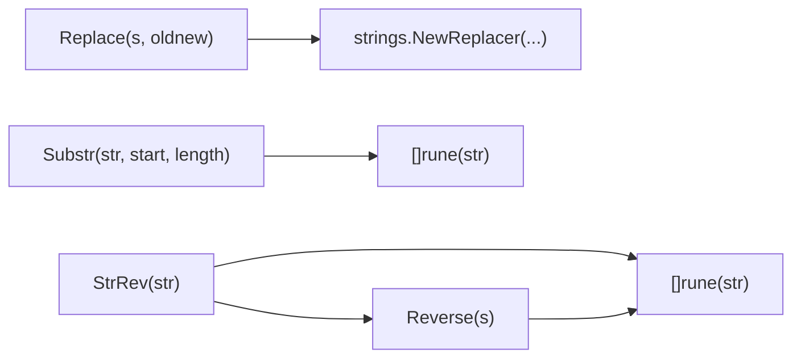
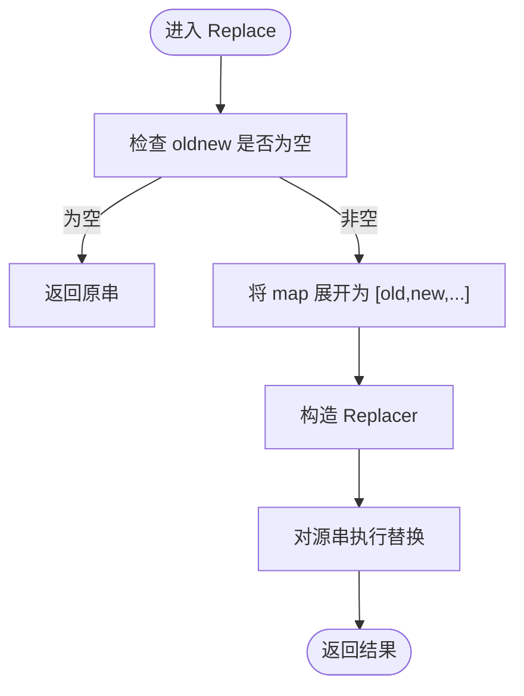
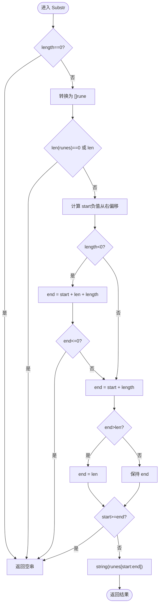
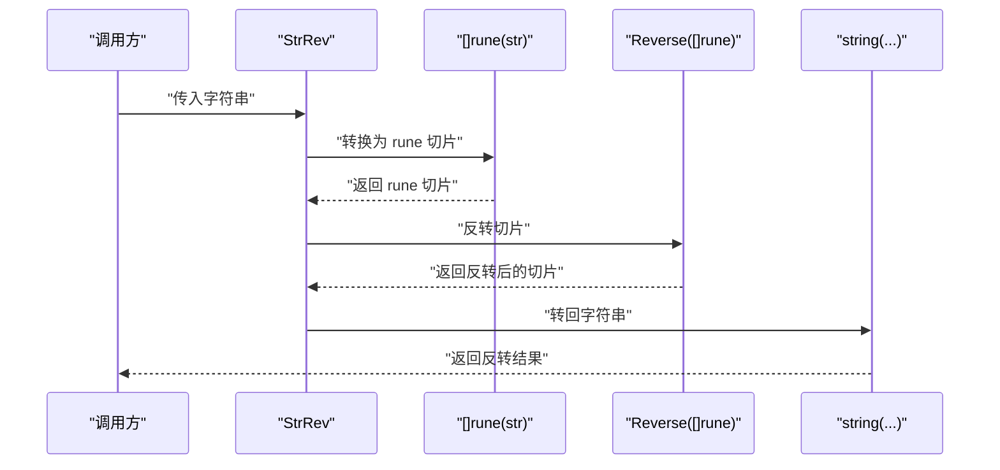
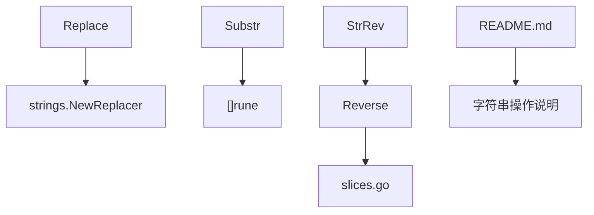

# 字符串操作

<cite>
**本文引用的文件列表**
- [string.go](file://string.go)
- [string_test.go](file://string_test.go)
- [slices.go](file://slices.go)
- [README.md](file://README.md)
- [go.mod](file://go.mod)
</cite>

## 目录

1. [简介](#简介)
2. [项目结构](#项目结构)
3. [核心组件](#核心组件)
4. [架构总览](#架构总览)
5. [详细组件分析](#详细组件分析)
6. [依赖关系分析](#依赖关系分析)
7. [性能考量](#性能考量)
8. [故障排查指南](#故障排查指南)
9. [结论](#结论)
10. [附录](#附录)

## 简介

本章节面向字符串操作功能，重点围绕以下三个函数展开：字符串替换 Replace、字符串截取 Substr、字符串反转
StrRev。文档将深入解析它们的实现原理、边界处理逻辑（尤其是负索引与 UTF-8
字符）、性能优化技巧、最佳实践与常见陷阱，并提供函数签名、参数说明、返回值描述与实际使用示例的定位路径。

## 项目结构

- 字符串相关的核心实现位于 string.go，包含 Replace、Substr、StrRev 等函数。
- 单元测试位于 string_test.go，覆盖了替换、截取、反转等行为验证与模糊测试。
- 反转通用工具 Reverse 在 slices.go 中，StrRev 通过它实现字符串反转。
- README.md 提供了字符串操作的总体说明与推荐实践。
- go.mod 指明模块与 Go 版本要求。

图表来源

- [string.go](file://string.go#L22-L89)
- [slices.go](file://slices.go#L23-L29)
- [string_test.go](file://string_test.go#L10-L109)
- [README.md](file://README.md#L37-L82)
- [go.mod](file://go.mod#L1-L4)

章节来源

- [string.go](file://string.go#L1-L187)
- [string_test.go](file://string_test.go#L1-L292)
- [README.md](file://README.md#L1-L800)
- [go.mod](file://go.mod#L1-L4)

## 核心组件

- Replace(s string, oldnew map[string]string) string
    - 功能：多字符串替换，基于内置 strings.Replacer 批量替换，避免多次扫描。
    - 性能：通过构建一次性替换表，减少重复匹配成本。
    - 使用场景：批量替换多个不同目标字符串，如模板渲染、日志脱敏、格式化文本。
    - 示例定位：[string_test.go](file://string_test.go#L10-L32)

- Substr(str string, start, length int) string
    - 功能：按“字符”粒度进行截取，支持正负索引与 UTF-8 正确处理。
    - 边界处理：
        - start 为负：从右侧偏移，若越界则调整为 0。
        - length 为负：表示结束索引，等于 len(str) + length + 1；若结果小于等于 0，返回空串。
        - length 为正：表示长度，最终结束索引为 start + length，若越界则裁剪至末尾。
    - UTF-8：内部将字符串转换为 rune 切片，确保宽字符视为单字符。
    - 示例定位：[string_test.go](file://string_test.go#L34-L59)

- StrRev(str string) string
    - 功能：反转字符串。
    - 实现：先将字符串转换为 rune 切片，调用通用反转工具 Reverse，再转回字符串。
    - UTF-8：同样基于 rune，保证宽字符反转正确。
    - 示例定位：[string_test.go](file://string_test.go#L61-L87)

章节来源

- [string.go](file://string.go#L22-L89)
- [string_test.go](file://string_test.go#L10-L109)
- [slices.go](file://slices.go#L23-L29)

## 架构总览

下图展示了字符串操作函数之间的关系与调用链：

图表来源

- [string.go](file://string.go#L26-L36)
- [string.go](file://string.go#L47-L84)
- [string.go](file://string.go#L87-L89)
- [slices.go](file://slices.go#L23-L29)

## 详细组件分析

### Replace 函数

- 实现要点
    - 输入为空映射时直接返回原串，避免无意义处理。
    - 将 map 展开为交替的 old/new 序列，构造一次性替换器，随后对整个字符串执行替换。
    - 该策略显著优于逐个替换或多次扫描，尤其在旧串重叠或嵌套时。
- 性能优化
    - 使用 strings.Replacer 的批量替换能力，减少重复匹配与扫描。
    - 若存在大量重叠或嵌套替换，应评估替换顺序与冲突，必要时在上层控制 oldnew 的键序。
- 使用示例
    - 测试用例覆盖了多键替换与标点替换，可参考：
        - [string_test.go](file://string_test.go#L10-L32)

图表来源

- [string.go](file://string.go#L26-L36)

章节来源

- [string.go](file://string.go#L22-L36)
- [string_test.go](file://string_test.go#L10-L32)

### Substr 函数

- 实现要点
    - 将字符串转换为 rune 切片，确保 UTF-8 宽字符按“字符”计数。
    - start 与 length 的负值计算规则明确，避免越界并返回空串。
    - 结束索引 end 的计算区分 length 正负两种情形，最后进行边界裁剪。
- 边界处理逻辑
    - start 为负：start += len(runes)；若仍小于 0，强制为 0。
    - length 为负：end = start + len(runes) + length；若 end <= 0，返回空串。
    - length 为正：end = start + length；若 end > len(runes)，裁剪为 len(runes)。
    - 若 start >= end，返回空串。
- 使用示例
    - 测试用例覆盖了多种 start/length 组合，包括负索引与 UTF-8 混排场景：
        - [string_test.go](file://string_test.go#L34-L59)

图表来源

- [string.go](file://string.go#L47-L84)

章节来源

- [string.go](file://string.go#L38-L84)
- [string_test.go](file://string_test.go#L34-L59)

### StrRev 函数

- 实现要点
    - 将字符串转换为 rune 切片，调用通用反转工具 Reverse，再转回字符串。
    - 由于 rune 按字符处理，因此宽字符也能正确反转。
- 测试与验证
    - 单元测试覆盖了中文、英文、特殊符号与混合场景。
    - 模糊测试验证双次反转等于原串且输出为有效 UTF-8。
    - 参考：
        - [string_test.go](file://string_test.go#L61-L87)
        - [string_test.go](file://string_test.go#L89-L109)

图表来源

- [string.go](file://string.go#L87-L89)
- [slices.go](file://slices.go#L23-L29)

章节来源

- [string.go](file://string.go#L86-L89)
- [slices.go](file://slices.go#L23-L29)
- [string_test.go](file://string_test.go#L61-L109)

## 依赖关系分析

- Replace 依赖 strings.Replacer 进行高效批量替换。
- Substr 依赖 []rune 进行 UTF-8 正确处理。
- StrRev 依赖通用反转工具 Reverse，后者在 slices.go 中实现。
- README.md 提供了字符串操作的总体说明与最佳实践，作为使用指南。

图表来源

- [string.go](file://string.go#L26-L36)
- [string.go](file://string.go#L53-L83)
- [string.go](file://string.go#L87-L89)
- [slices.go](file://slices.go#L23-L29)
- [README.md](file://README.md#L37-L82)

章节来源

- [string.go](file://string.go#L22-L89)
- [slices.go](file://slices.go#L23-L29)
- [README.md](file://README.md#L37-L82)

## 性能考量

- Replace
    - 使用 strings.Replacer 构建一次性替换表，避免重复扫描与多次匹配。
    - 当 oldnew 键数量较多时，建议在上层按优先级排序，减少冲突与重复替换。
- Substr
    - 转换为 rune 切片会带来额外内存分配与拷贝，对于超长字符串应谨慎使用。
    - 若仅需按字节索引，可考虑直接使用字节切片；需要按字符索引时务必使用 rune。
- StrRev
    - rune 转换与反转均为 O(n)；对超长字符串注意内存峰值与 GC 压力。
    - 如需频繁反转，可复用切片缓冲区以降低分配次数。
- 通用建议
    - 大量字符串拼接优先使用 strings.Builder 并预估容量。
    - 需要按字符计数时使用 utf8.RuneCountInString，避免 len 的字节计数误判。
    - 参考 README.md 中关于字符串拼接、长度统计与截取的推荐做法。

章节来源

- [README.md](file://README.md#L37-L82)
- [string.go](file://string.go#L22-L89)
- [slices.go](file://slices.go#L23-L29)

## 故障排查指南

- Replace 返回未预期结果
    - 检查 oldnew 映射是否为空；确认键值是否包含重叠或嵌套模式。
    - 若存在多个目标串互相包含，考虑在上层控制替换顺序或使用更细粒度的替换策略。
    - 参考测试用例定位：
        - [string_test.go](file://string_test.go#L10-L32)
- Substr 返回空串
    - 检查 start 是否越界（负值从右偏移后仍小于 0 会被置为 0）。
    - 检查 length 的正负含义与最终 end 是否小于等于 0。
    - 确认输入字符串是否为空或长度不足。
    - 参考测试用例定位：
        - [string_test.go](file://string_test.go#L34-L59)
- StrRev 输出乱码或非 UTF-8
    - 确保输入字符串为有效 UTF-8。
    - 双次反转应等于原串，可用模糊测试思路进行自测。
    - 参考测试用例定位：
        - [string_test.go](file://string_test.go#L61-L109)

章节来源

- [string_test.go](file://string_test.go#L10-L109)

## 结论

- Replace、Substr、StrRev 三者分别覆盖了多字符串替换、按字符粒度截取与字符串反转三大常用场景。
- Replace 通过一次性替换表实现高性能；Substr 通过 rune 切片保障 UTF-8 正确性；StrRev 通过通用反转工具实现稳定高效的反转。
- 在实际工程中，应结合业务需求选择合适的索引方式（字节 vs 字符），并遵循 README.md 中的字符串操作最佳实践，以获得更好的性能与可维护性。

## 附录

- 函数签名与参数说明
    - Replace(s string, oldnew map[string]string) string
        - s：源字符串
        - oldnew：替换规则映射，键为要替换的目标串，值为替换后的串
        - 返回：替换完成的新字符串
        - 示例定位：[string_test.go](file://string_test.go#L10-L32)
    - Substr(str string, start, length int) string
        - str：被截取的字符串
        - start：起始索引（负值表示从右侧偏移）
        - length：长度（正数表示长度，负数表示结束索引）
        - 返回：截取后的子串
        - 示例定位：[string_test.go](file://string_test.go#L34-L59)
    - StrRev(str string) string
        - str：待反转的字符串
        - 返回：反转后的字符串
        - 示例定位：[string_test.go](file://string_test.go#L61-L87)

章节来源

- [string.go](file://string.go#L22-L89)
- [string_test.go](file://string_test.go#L10-L109)