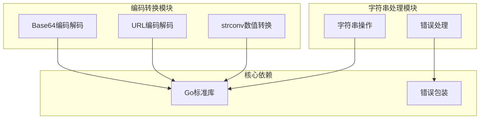
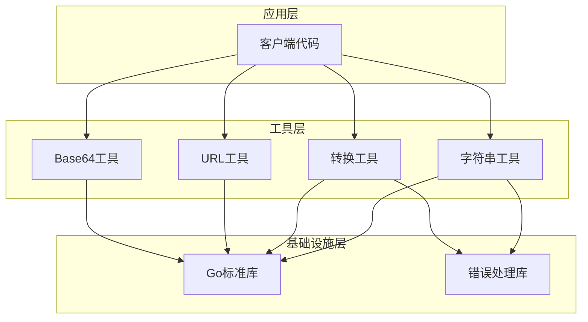
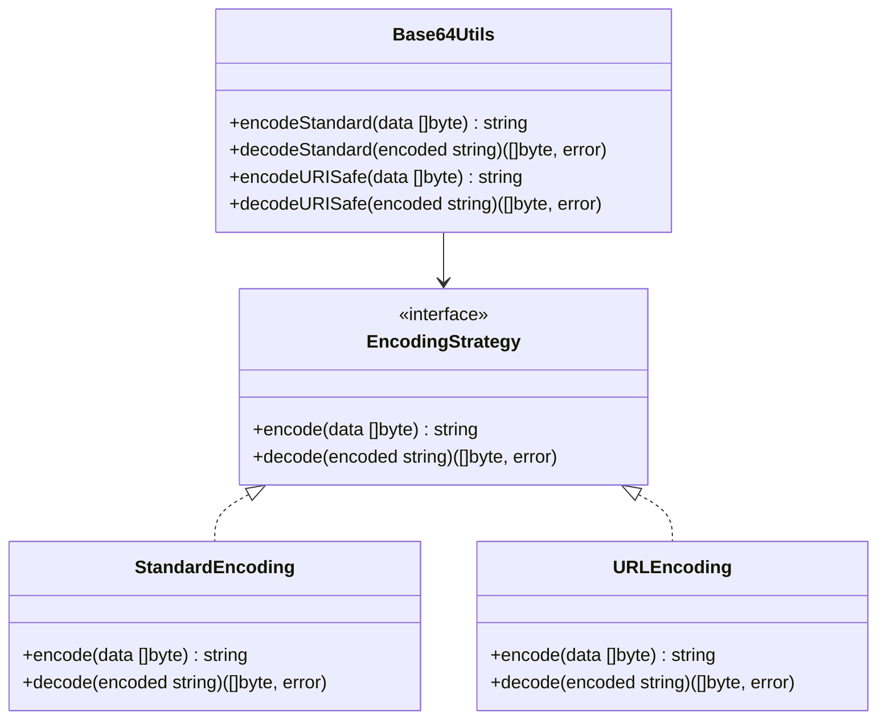
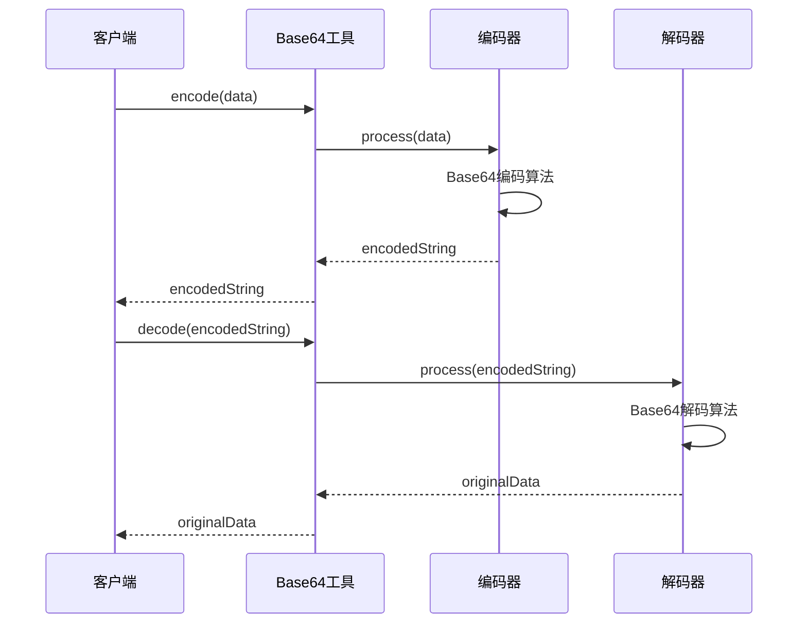
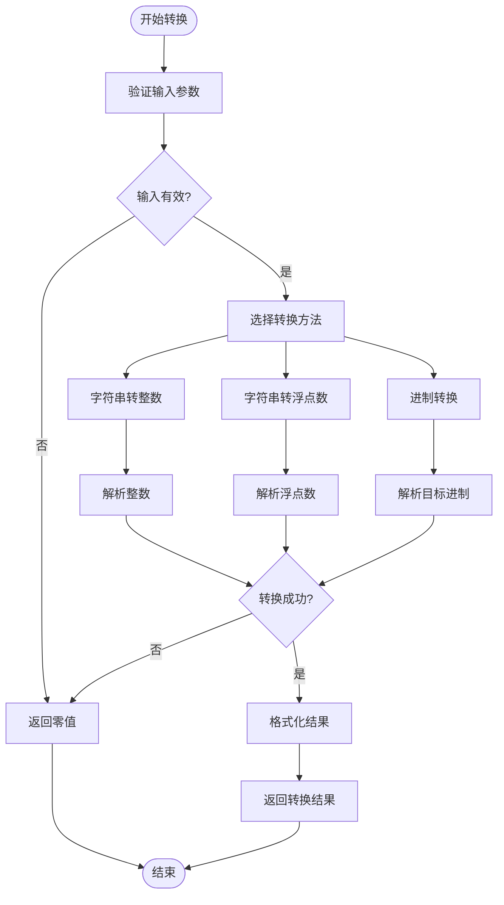
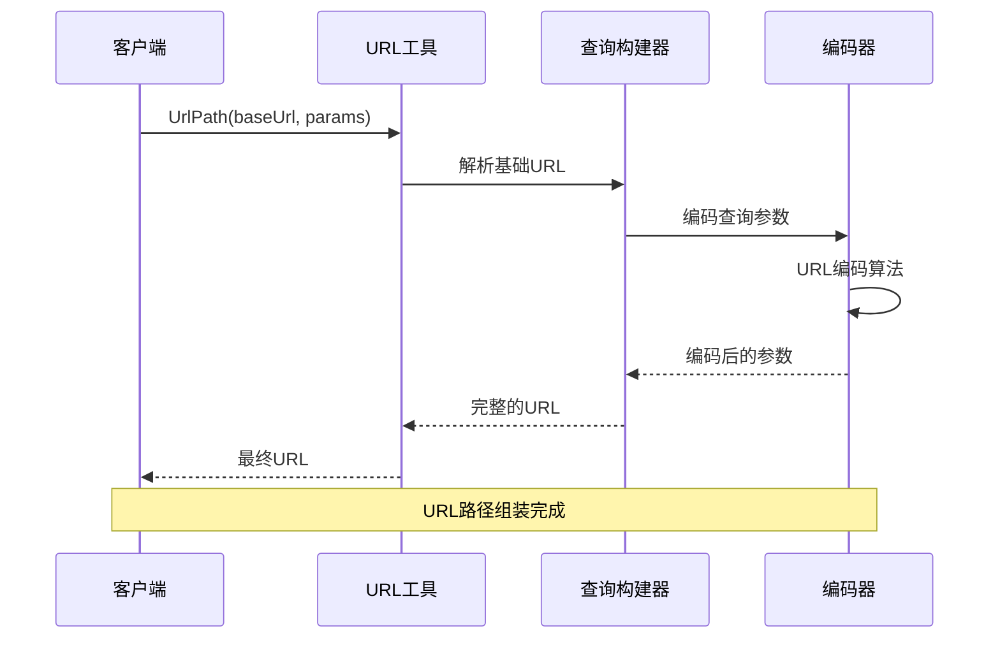
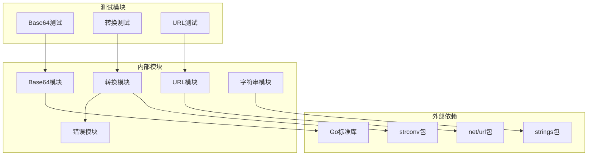
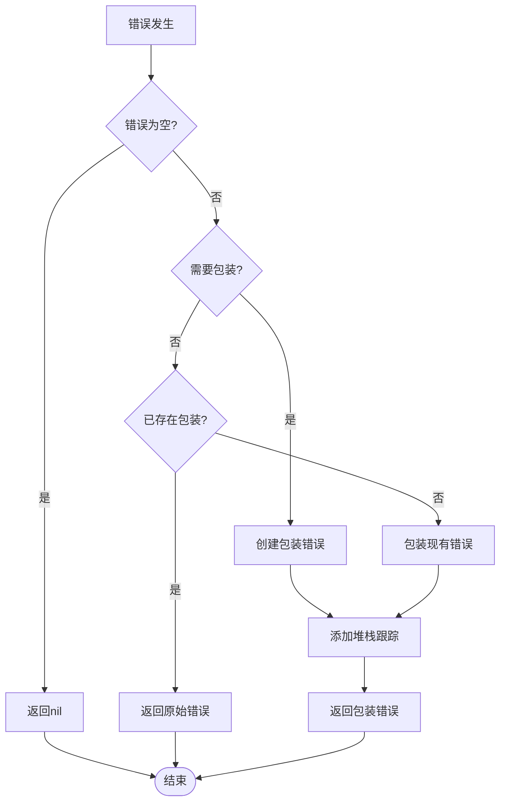

# 编码转换

<cite>
**本文档引用的文件**
- [base64.go](file://base64.go)
- [strconv.go](file://strconv.go)
- [strconv_test.go](file://strconv_test.go)
- [url.go](file://url.go)
- [string.go](file://string.go)
- [errors.go](file://errors/errors.go)
- [README.md](file://README.md)
- [go.mod](file://go.mod)
</cite>

## 目录

1. [简介](#简介)
2. [项目结构](#项目结构)
3. [核心组件](#核心组件)
4. [架构概览](#架构概览)
5. [详细组件分析](#详细组件分析)
6. [依赖关系分析](#依赖关系分析)
7. [性能考虑](#性能考虑)
8. [故障排除指南](#故障排除指南)
9. [结论](#结论)

## 简介

本项目提供了Go语言中常用的编码转换功能，包括Base64编码解码、URL编码解码、数值类型转换等核心功能。这些工具函数旨在简化字符串处理过程中的常见转换任务，提供简洁易用的API接口。

项目基于Go 1.22版本开发，遵循现代Go语言的最佳实践，提供了完整的错误处理机制和性能优化策略。

## 项目结构

该项目采用模块化设计，每个功能模块都有独立的文件和清晰的职责划分：



**图表来源**

- [base64.go](file://base64.go#L1-L8)
- [strconv.go](file://strconv.go#L1-L109)
- [url.go](file://url.go#L1-L27)

**章节来源**

- [go.mod](file://go.mod#L1-L4)

## 核心组件

### Base64编码解码

Base64编码是一种将二进制数据转换为ASCII字符串的标准方法，广泛应用于网络传输和数据存储场景。

#### 标准Base64编码

- **功能**：对任意数据进行Base64编码
- **实现**：使用`base64.StdEncoding.EncodeToString(src)`
- **用途**：通用数据编码，适用于大多数场景

#### URL安全的Base64编码

- **功能**：对URL或文件名进行Base64编码
- **实现**：使用`base64.URLEncoding.EncodeToString(src)`
- **用途**：URL传输、文件名编码等特殊场景

#### 解码功能

- **标准解码**：`base64.StdEncoding.DecodeString(s)`
- **URL安全解码**：`base64.URLEncoding.DecodeString(s)`

### URL编码解码

URL编码用于将特殊字符转换为URL安全的格式，确保URL的正确传输。

#### URL查询编码

- **功能**：对URL查询参数进行编码
- **实现**：`url.QueryEscape(str)`
- **用途**：构建URL参数、表单数据传输

#### URL查询解码

- **功能**：将URL编码的字符串还原
- **实现**：`url.QueryUnescape(str)`
- **用途**：解析URL参数、处理用户输入

### 数值类型转换

项目提供了多种数值类型转换功能，支持不同进制间的转换和标准类型转换。

#### 标准转换函数

- **字符串转整数**：`Str2Int(s string) int`
- **字符串转64位整数**：`Str2Int64(s string) int64`
- **字符串转浮点数**：`Str2Float(s string) float64`

#### 进制转换功能

- **二进制转换**：`BinOct`, `BinDec`, `BinHex`
- **八进制转换**：`OctBin`, `OctDec`, `OctHex`
- **十六进制转换**：`HexBin`, `HexOct`, `HexDec`
- **十进制转换**：`DecBin`, `DecOct`, `DecHex`

**章节来源**

- [base64.go](file://base64.go#L1-L8)
- [strconv.go](file://strconv.go#L1-L109)
- [url.go](file://url.go#L1-L27)

## 架构概览

项目采用分层架构设计，每个功能模块都有明确的职责边界：



**图表来源**

- [base64.go](file://base64.go#L1-L8)
- [strconv.go](file://strconv.go#L1-L109)
- [url.go](file://url.go#L1-L27)
- [string.go](file://string.go#L1-L187)

## 详细组件分析

### Base64编码解码组件

Base64编码组件提供了两种不同的编码方案，满足不同场景的需求。

#### 类图设计



**图表来源**

- [base64.go](file://base64.go#L1-L8)

#### 编码流程



**图表来源**

- [base64.go](file://base64.go#L1-L8)

**章节来源**

- [base64.go](file://base64.go#L1-L8)

### 数值转换组件

数值转换组件提供了丰富的类型转换功能，支持多种进制间的相互转换。

#### 功能类图

```mermaid
classDiagram
class ConversionUtils {
+Str2Int(s string) int
+Str2Int64(s string) int64
+Str2Float(s string) float64
+DecBin(number int64) string
+DecOct(number int64) string
+DecHex(number int64) string
}
class BaseConverter {
<<interface>>
+convertToBase(value interface{}, base int) string
+convertFromBase(encoded string, base int) interface{}
}
class IntConverter {
+convertToBase(value int64, base int) string
+convertFromBase(encoded string, base int) int64
}
class FloatConverter {
+convertToBase(value float64, base int) string
+convertFromBase(encoded string, base int) float64
}
ConversionUtils --> BaseConverter
BaseConverter <|.. IntConverter
BaseConverter <|.. FloatConverter
```

**图表来源**

- [strconv.go](file://strconv.go#L1-L109)

#### 转换算法流程



**图表来源**

- [strconv.go](file://strconv.go#L1-L109)

**章节来源**

- [strconv.go](file://strconv.go#L1-L109)

### URL编码组件

URL编码组件专门处理URL相关的编码和解码任务。

#### URL处理流程



**图表来源**

- [url.go](file://url.go#L1-L27)

**章节来源**

- [url.go](file://url.go#L1-L27)

## 依赖关系分析

项目采用了清晰的依赖管理策略，确保各组件间的松耦合和高内聚。



**图表来源**

- [base64.go](file://base64.go#L1-L8)
- [strconv.go](file://strconv.go#L1-L109)
- [url.go](file://url.go#L1-L27)
- [string.go](file://string.go#L1-L187)

### 错误处理机制

项目实现了统一的错误处理机制，提供完整的错误追踪功能。

#### 错误处理流程



**图表来源**

- [errors.go](file://errors/errors.go#L1-L282)

**章节来源**

- [errors.go](file://errors/errors.go#L1-L282)

## 性能考虑

### 内存优化策略

1. **字符串操作优化**
    - 使用`strings.Builder`进行批量字符串拼接
    - 预分配容量避免重复扩容
    - 使用`[]rune`处理宽字符，避免字符截断

2. **Base64编码优化**
    - 直接使用标准库的高效实现
    - 避免不必要的中间缓冲区创建
    - 利用UTF-8编码特性减少内存占用

3. **数值转换优化**
    - 使用`strconv.FormatInt`避免额外的类型转换
    - 在循环中复用转换结果
    - 避免频繁的字符串分配

### 性能基准测试

基于测试文件的分析，项目提供了完整的性能测试覆盖：

- **字符串转换测试**：验证不同输入场景的转换性能
- **进制转换测试**：测试大量数据的转换效率
- **URL处理测试**：验证URL编码解码的性能表现

**章节来源**

- [strconv_test.go](file://strconv_test.go#L1-L145)

## 故障排除指南

### 常见问题及解决方案

#### Base64编码问题

- **问题**：编码结果包含非法字符
- **解决方案**：使用URL安全的Base64编码方案

#### 数值转换问题

- **问题**：转换结果为零值
- **解决方案**：检查输入字符串的有效性和格式

#### URL编码问题

- **问题**：URL构建失败
- **解决方案**：验证URL格式和参数有效性

### 调试技巧

1. **启用详细日志**：使用`slog`记录详细的转换过程
2. **错误追踪**：利用包装错误功能获取完整的调用栈
3. **单元测试**：通过测试用例验证功能正确性

**章节来源**

- [errors.go](file://errors/errors.go#L1-L282)

## 结论

本编码转换工具库提供了完整而高效的字符串处理解决方案。通过模块化的设计和清晰的API接口，开发者可以轻松地进行各种编码转换操作。

### 主要优势

1. **功能完整性**：涵盖了常见的编码转换需求
2. **性能优化**：采用Go标准库的高效实现
3. **错误处理**：提供完整的错误追踪和处理机制
4. **易于使用**：简洁的API设计降低学习成本

### 最佳实践建议

1. **选择合适的编码方案**：根据具体场景选择标准或URL安全的编码
2. **合理使用缓存**：对于重复的转换操作，考虑使用缓存机制
3. **错误处理**：始终检查返回的错误，确保程序的健壮性
4. **性能监控**：在高并发场景下监控转换操作的性能表现

该工具库为Go语言的字符串处理提供了坚实的基础，适合在各种应用场景中使用。