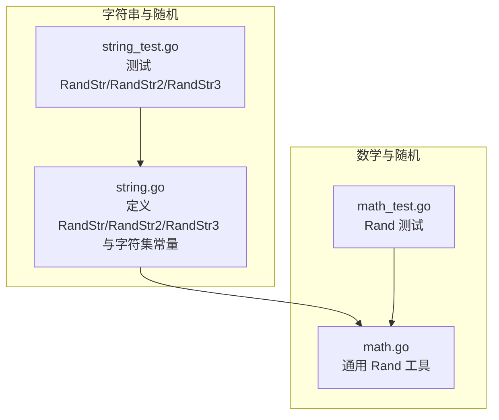
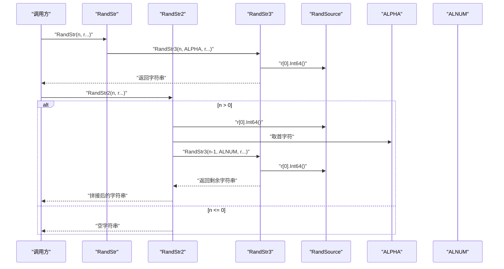
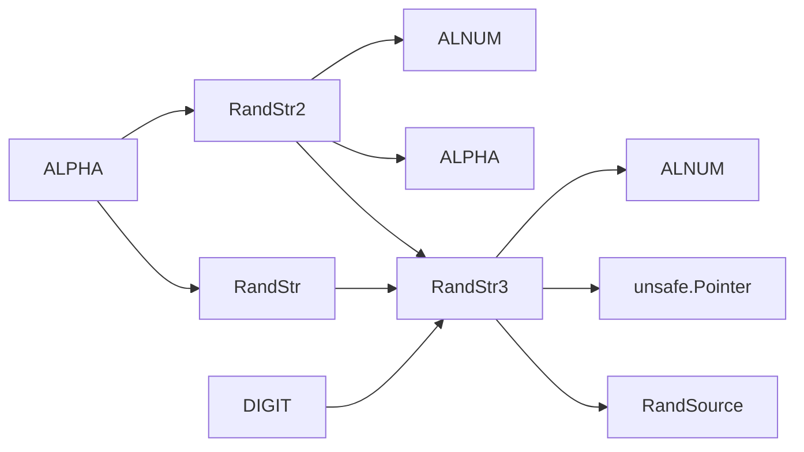

# 随机字符串生成

<cite>
**本文档引用的文件**
- [string.go](file://string.go)
- [string_test.go](file://string_test.go)
- [math.go](file://math.go)
- [math_test.go](file://math_test.go)
</cite>

## 目录

1. [简介](#简介)
2. [项目结构](#项目结构)
3. [核心组件](#核心组件)
4. [架构概览](#架构概览)
5. [详细组件分析](#详细组件分析)
6. [依赖关系分析](#依赖关系分析)
7. [性能考量](#性能考量)
8. [故障排查指南](#故障排查指南)
9. [结论](#结论)
10. [附录](#附录)

## 简介

本文件系统化梳理仓库中随机字符串生成相关的实现与用法，重点覆盖以下内容：

- RandStr、RandStr2、RandStr3 三个函数的实现差异与适用场景
- 随机种子 RandSource 的作用机制与性能优化技巧
- 字符集常量 ALPHA、DIGIT、ALNUM 的用途与组合方式
- 随机字符串生成的算法原理与安全性考量
- 批量生成随机字符串的性能优化建议
- 完整的函数签名、参数说明、字符集配置与实际使用示例

## 项目结构

与随机字符串生成直接相关的文件与职责如下：

- string.go：定义随机字符串生成函数与字符集常量，包含 RandStr、RandStr2、RandStr3 以及 RandSource
- string_test.go：提供对 RandStr、RandStr2、RandStr3 的单元测试与基准测试样例
- math.go：提供通用随机整数工具 Rand，供其他模块复用
- math_test.go：对 Rand 进行并发与边界条件验证

图表来源

- [string.go](file://string.go#L1-L187)
- [string_test.go](file://string_test.go#L1-L292)
- [math.go](file://math.go#L1-L37)
- [math_test.go](file://math_test.go#L1-L82)

章节来源

- [string.go](file://string.go#L1-L187)
- [string_test.go](file://string_test.go#L1-L292)
- [math.go](file://math.go#L1-L37)
- [math_test.go](file://math_test.go#L1-L82)

## 核心组件

本节聚焦随机字符串生成的核心函数与字符集常量，明确其职责与调用关系。

- RandStr：基于英文字母字符集生成随机字符串，内部委托给 RandStr3 使用 ALPHA
- RandStr2：以“首字符必须为字母”的策略生成随机字符串，内部先从 ALPHA 中选择一个字符，再递归调用 RandStr3 使用 ALNUM
- RandStr3：通用的随机字符串生成器，接受自定义字符集 alpha，循环从 alpha 中按索引选取字符
- RandSource：全局随机源，采用 PCG 伪随机数生成器，作为默认随机种子
- 字符集常量：
    - ALPHA：英文字母集合（大小写）
    - DIGIT：数字集合（0-9）
    - ALNUM：字母+数字集合（A-Za-z0-9）

章节来源

- [string.go](file://string.go#L11-L20)
- [string.go](file://string.go#L91-L131)
- [string.go](file://string.go#L185-L187)

## 架构概览

下图展示随机字符串生成函数之间的依赖关系与调用链：

图表来源

- [string.go](file://string.go#L91-L131)
- [string.go](file://string.go#L185-L187)

## 详细组件分析

### RandStr 函数

- 作用：生成仅由英文字母组成的随机字符串
- 实现要点：
    - 内部直接委托给 RandStr3，并使用 ALPHA 作为字符集
    - 支持可变参数 r 传入自定义随机源，便于批量生成时复用同一随机源以提升性能
- 典型使用场景：
    - 生成用户名、验证码（不含数字）、标识符等仅需字母的场景
- 参数说明：
    - n：目标字符串长度
    - r：可选的随机源指针数组，若未提供则使用全局 RandSource
- 性能提示：
    - 在批量生成时，建议预先创建并复用 r，避免每次调用都创建新的随机源

章节来源

- [string.go](file://string.go#L91-L97)

### RandStr2 函数

- 作用：生成首字符为字母、其余字符可为字母或数字的随机字符串
- 实现要点：
    - 当 n <= 0 时直接返回空字符串
    - 若未提供 r，则使用全局 RandSource
    - 首字符从 ALPHA 中随机选取，随后递归调用 RandStr3 使用 ALNUM 生成剩余部分
- 典型使用场景：
    - 需要首字符为字母的标识符、令牌、短码等
- 参数说明：
    - n：目标字符串长度
    - r：可选的随机源指针数组
- 性能提示：
    - 由于存在一次首字符的额外随机选择与一次递归调用，整体开销略高于 RandStr
    - 批量生成时同样建议复用 r

章节来源

- [string.go](file://string.go#L99-L111)

### RandStr3 函数

- 作用：通用随机字符串生成器，支持自定义字符集
- 实现要点：
    - 输入校验：当 n <= 0 或 alpha 为空时返回空字符串
    - 若未提供 r，则使用全局 RandSource
    - 循环从 alpha 中按索引选取字符，最终通过 unsafe 转换返回字符串
- 典型使用场景：
    - 自定义字符集（如仅数字、仅十六进制、ASCII扩展等）
    - 高性能批量生成（通过传入共享随机源）
- 参数说明：
    - n：目标字符串长度
    - alpha：字符集字符串
    - r：可选的随机源指针数组
- 性能提示：
    - 使用一次性分配的字节切片并逐字节填充，减少内存分配
    - 通过 unsafe 转换避免额外拷贝，提高性能

章节来源

- [string.go](file://string.go#L113-L131)

### RandSource 随机种子

- 作用：全局默认随机源，采用 PCG 伪随机数生成器
- 设计意义：
    - 提供统一的随机数生成入口，避免在各处重复创建随机源
    - 通过 PCG 提升随机质量与性能
- 性能优化技巧：
    - 在批量生成场景中，优先传入共享的 r，避免每次调用都创建新随机源
    - 在高并发场景中，建议为每个 goroutine 维护独立的随机源，避免竞争
- 注意事项：
    - 该实现使用 PCG，属于伪随机，不适用于密码学安全场景

章节来源

- [string.go](file://string.go#L185-L187)

### 字符集常量与组合

- ALPHA：英文字母集合（大小写）
- DIGIT：数字集合（0-9）
- ALNUM：字母+数字集合（A-Za-z0-9）
- 组合使用建议：
    - 仅字母：使用 ALPHA
    - 仅数字：使用 DIGIT
    - 字母+数字：使用 ALNUM
    - 自定义字符集：将所需字符拼接为字符串传入 RandStr3 的 alpha 参数

章节来源

- [string.go](file://string.go#L11-L20)

### 算法原理与安全性考量

- 算法原理：
    - 通过随机源生成均匀分布的索引，映射到字符集中的对应字符
    - RandStr3 采用一次性分配与逐字节填充的方式，最后通过 unsafe 转换为字符串
- 安全性：
    - 该实现使用 PCG 伪随机数生成器，属于伪随机，不适合用于密码学安全的随机需求
    - 如需密码学安全的随机字符串，请改用 crypto/rand 包提供的加密安全随机数

章节来源

- [string.go](file://string.go#L118-L131)
- [string.go](file://string.go#L185-L187)

### 使用示例与最佳实践

- 示例路径（不展示具体代码，仅给出路径）：
    - RandStr 基本用法与批量生成示例：[string_test.go](file://string_test.go#L111-L135)
    - RandStr2 并发与基准测试示例：[string_test.go](file://string_test.go#L137-L200)
    - RandStr3 自定义字符集示例：[string_test.go](file://string_test.go#L202-L232)
    - 通用 Rand 工具与并发测试示例：[math_test.go](file://math_test.go#L9-L55)

- 最佳实践：
    - 批量生成时传入共享随机源 r，避免重复创建随机源
    - 高并发场景下为每个 goroutine 维护独立随机源，降低竞争
    - 自定义字符集时确保字符集非空且长度合理，避免极端情况

章节来源

- [string_test.go](file://string_test.go#L111-L232)
- [math_test.go](file://math_test.go#L9-L55)

## 依赖关系分析

- RandStr 依赖 RandStr3 与 ALPHA
- RandStr2 依赖 RandSource、ALPHA、ALNUM 与 RandStr3
- RandStr3 依赖 RandSource 与 unsafe 转换
- 字符集常量 ALPHA、DIGIT、ALNUM 为 RandStr、RandStr2、RandStr3 提供基础字符集

图表来源

- [string.go](file://string.go#L91-L131)
- [string.go](file://string.go#L11-L20)
- [string.go](file://string.go#L185-L187)

章节来源

- [string.go](file://string.go#L91-L131)
- [string.go](file://string.go#L11-L20)
- [string.go](file://string.go#L185-L187)

## 性能考量

- 批量生成优化：
    - 传入共享随机源 r，避免重复初始化随机源
    - 在高并发场景中，为每个 goroutine 维护独立随机源，减少锁竞争
- 内存与拷贝优化：
    - RandStr3 一次性分配字节切片并逐字节填充，减少中间对象
    - 通过 unsafe 转换避免额外字符串拷贝
- 基准测试参考：
    - RandStr2 的基准测试样例可作为性能评估参考：[string_test.go](file://string_test.go#L174-L200)

章节来源

- [string.go](file://string.go#L118-L131)
- [string_test.go](file://string_test.go#L174-L200)

## 故障排查指南

- 常见问题与定位：
    - RandStr3 输入 n <= 0 或 alpha 为空时返回空字符串：检查输入参数与字符集
    - RandStr2 首字符不符合预期：确认是否正确传入 r，避免默认使用全局 RandSource
    - 并发场景下性能不佳：检查是否为每个 goroutine 维护独立随机源
- 单元测试与基准测试：
    - RandStr/RandStr2/RandStr3 的测试样例可帮助验证行为与性能：[string_test.go](file://string_test.go#L111-L232)
    - Rand 的并发与边界条件测试可辅助理解随机数行为：[math_test.go](file://math_test.go#L9-L55)

章节来源

- [string_test.go](file://string_test.go#L111-L232)
- [math_test.go](file://math_test.go#L9-L55)

## 结论

- RandStr、RandStr2、RandStr3 分别面向不同使用场景：仅字母、首字母为字母、自定义字符集
- RandSource 提供统一的高性能随机源，默认使用 PCG，适合一般用途的随机字符串生成
- 在批量与高并发场景中，务必复用随机源并合理拆分随机源，以获得最佳性能
- 若涉及密码学安全需求，请改用加密安全的随机数生成方案

## 附录

- 函数与常量一览（仅列名称与简述，详见源码）：
    - RandStr(n int, r ...*rand.Rand) string：仅字母随机字符串
    - RandStr2(n int, r ...*rand.Rand) string：首字母为字母的随机字符串
    - RandStr3(n int, alpha string, r ...*rand.Rand) string：通用随机字符串生成
    - RandSource：全局随机源
    - ALPHA、DIGIT、ALNUM：字符集常量

章节来源

- [string.go](file://string.go#L91-L131)
- [string.go](file://string.go#L11-L20)
- [string.go](file://string.go#L185-L187)