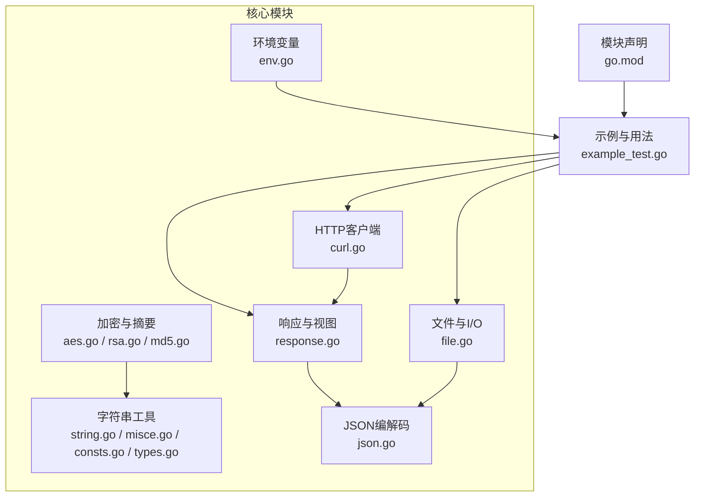
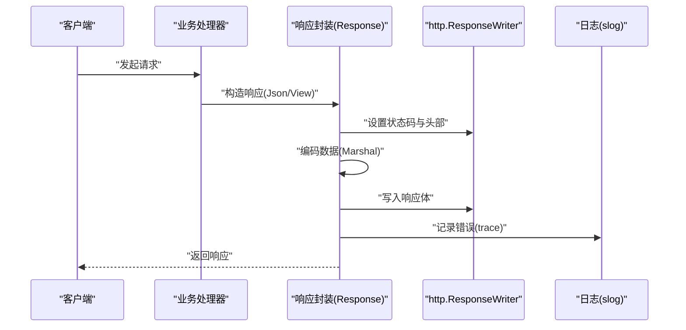
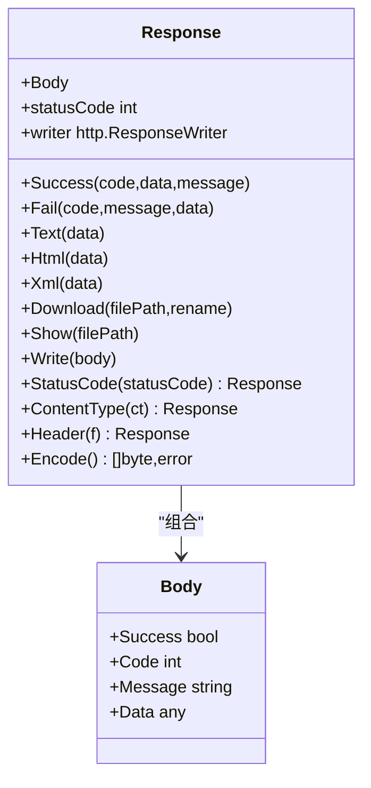
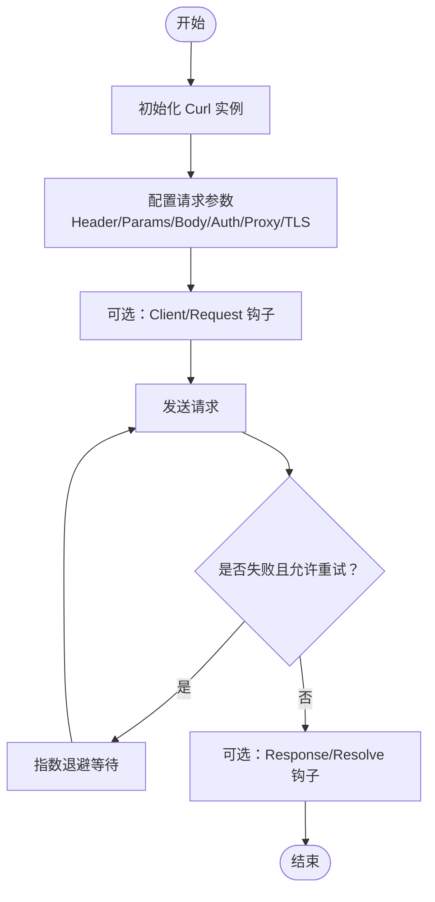
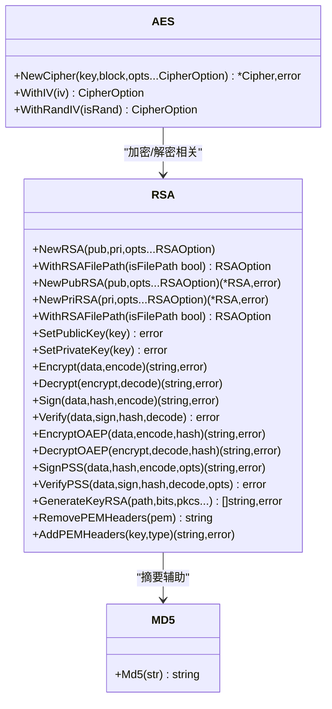
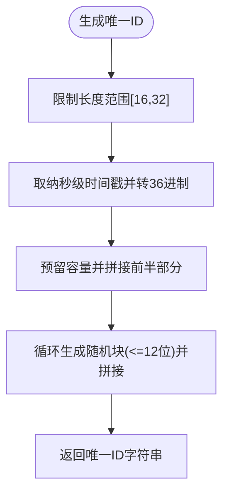
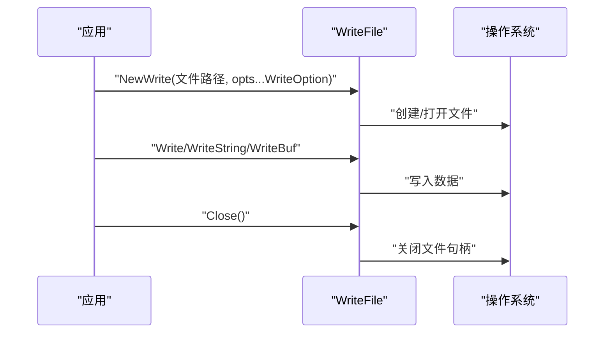
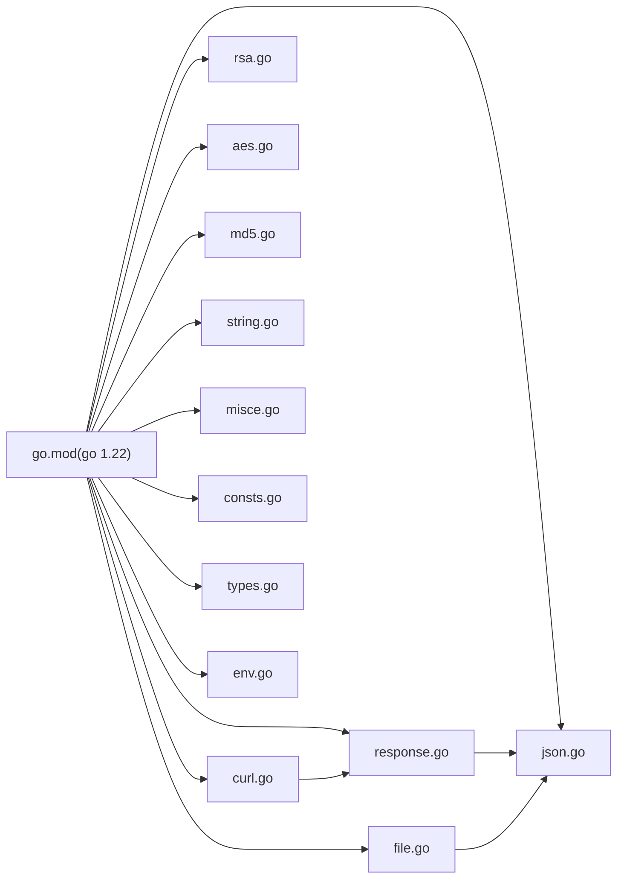

# 快速开始

<cite>
**本文引用的文件**
- [README.md](file://README.md)
- [go.mod](file://go.mod)
- [example_test.go](file://example_test.go)
- [response.go](file://response.go)
- [curl.go](file://curl.go)
- [rsa.go](file://rsa.go)
- [md5.go](file://md5.go)
- [env.go](file://env.go)
- [types.go](file://types.go)
- [consts.go](file://consts.go)
- [misce.go](file://misce.go)
- [file.go](file://file.go)
- [json.go](file://json.go)
- [aes.go](file://aes.go)
- [string.go](file://string.go)
</cite>

## 目录

1. [简介](#简介)
2. [项目结构](#项目结构)
3. [核心组件](#核心组件)
4. [架构总览](#架构总览)
5. [详细组件分析](#详细组件分析)
6. [依赖关系分析](#依赖关系分析)
7. [性能注意事项](#性能注意事项)
8. [故障排查指南](#故障排查指南)
9. [结论](#结论)
10. [附录](#附录)

## 简介

本指南面向希望快速上手 Go Utils 库的开发者，覆盖安装方式（GitHub 与 Gitee）、版本要求（Go 1.22+）、基础导入与使用、Hello World
级别的示例、常见初始化片段与最佳实践。文档兼顾初学者易读性与技术细节，帮助你在最短时间内验证安装并开始使用。

## 项目结构

该仓库采用按功能域划分的文件组织方式，核心模块包括：

- HTTP 响应封装与视图输出：response.go
- HTTP 客户端工具：curl.go
- 加解密与摘要：aes.go、rsa.go、md5.go
- 字符串与通用工具：string.go、misce.go、consts.go、types.go
- 文件系统与I/O：file.go
- JSON 编解码配置：json.go
- 环境变量：env.go
- 示例与用法参考：example_test.go
- 项目元信息：go.mod

**图表来源**

- [response.go](file://response.go#L1-L342)
- [curl.go](file://curl.go#L1-L800)
- [aes.go](file://aes.go#L1-L23)
- [rsa.go](file://rsa.go#L1-L527)
- [md5.go](file://md5.go#L1-L13)
- [string.go](file://string.go#L1-L187)
- [misce.go](file://misce.go#L1-L133)
- [consts.go](file://consts.go#L1-L48)
- [types.go](file://types.go#L1-L98)
- [file.go](file://file.go#L1-L451)
- [json.go](file://json.go#L1-L67)
- [env.go](file://env.go#L1-L19)
- [example_test.go](file://example_test.go#L1-L108)
- [go.mod](file://go.mod#L1-L4)

**章节来源**

- [go.mod](file://go.mod#L1-L4)
- [README.md](file://README.md#L1-L30)

## 核心组件

- 响应与视图：提供统一的 JSON/HTML/XML/文本/文件下载/显示响应封装，简化 HTTP 接口开发。
- HTTP 客户端：提供链式配置的 Curl 工具，支持超时、认证、代理、TLS、重试、日志与回调钩子。
- 加密与摘要：提供 AES/RSA/MD5 等常用能力，并支持长文本分段处理与 PEM 头部管理。
- 字符串与通用工具：提供字符串截取、随机字符串、唯一 ID、三元运算、格式化等。
- 文件与I/O：提供文件存在性判断、拷贝、扫描、行读取、分块读取、大小格式化、类型推断等。
- JSON 编解码：支持在应用入口设置自定义 JSON 编解码器，便于替换高性能第三方库。
- 环境变量：提供带默认值的环境变量读取工具。

**章节来源**

- [response.go](file://response.go#L1-L342)
- [curl.go](file://curl.go#L1-L800)
- [aes.go](file://aes.go#L1-L23)
- [rsa.go](file://rsa.go#L1-L527)
- [md5.go](file://md5.go#L1-L13)
- [string.go](file://string.go#L1-L187)
- [misce.go](file://misce.go#L1-L133)
- [consts.go](file://consts.go#L1-L48)
- [types.go](file://types.go#L1-L98)
- [file.go](file://file.go#L1-L451)
- [json.go](file://json.go#L1-L67)
- [env.go](file://env.go#L1-L19)

## 架构总览

下图展示了典型 Web 服务中，响应封装与 HTTP 客户端的协作关系，以及日志与错误传播路径。

**图表来源**

- [response.go](file://response.go#L24-L116)
- [json.go](file://json.go#L52-L66)

**章节来源**

- [response.go](file://response.go#L1-L342)
- [json.go](file://json.go#L1-L67)

## 详细组件分析

### 安装与版本要求

- 安装方式
    - GitHub 安装：go get -u github.com/Is999/go-utils
    - Gitee 安装：go get -u gitee.com/Is999/go-utils
- 版本要求：Go 1.22+

上述信息来自项目元数据与说明文档，确保你的开发环境满足最低版本要求，避免因语言特性或标准库差异导致的问题。

**章节来源**

- [README.md](file://README.md#L7-L16)
- [go.mod](file://go.mod#L1-L4)

### 基础导入与 Hello World 示例

- 导入方式：import "github.com/Is999/go-utils"
- 示例参考：示例文件展示了如何在 HTTP 处理器中使用响应封装与视图输出，包括 JSON、HTML、XML、文本、文件显示与下载等场景。

你可以基于示例文件中的处理器模式，快速搭建一个“Hello World”接口，例如：

- 使用 Json 返回 {"success":true,"code":10000,"message":"SUCCESS","data":"Hello World"} 的结构化响应
- 或使用 View.Html 输出一段 HTML 文本
- 或使用 View.Text 输出纯文本

这些示例均位于示例文件中，便于直接参考与运行。

**章节来源**

- [example_test.go](file://example_test.go#L17-L107)

### 响应与视图（Response/View）

- 功能要点
    - 统一的响应结构体 Body，包含 success/code/message/data
    - 提供 Success/Fail/Text/Html/Xml/Download/Show 等便捷方法
    - 支持设置状态码、Content-Type、自定义 Header
    - 内置 JSON 编码与 XML 编码，错误时记录 trace 并返回统一错误码
- 典型流程
    - 构造 Response(Json/View)
    - 设置状态码与头部
    - 编码数据并写入响应
    - 出错时记录日志并返回错误响应

**图表来源**

- [response.go](file://response.go#L11-L323)

**章节来源**

- [response.go](file://response.go#L1-L342)
- [json.go](file://json.go#L52-L66)

### HTTP 客户端（Curl）

- 功能要点
    - 链式配置：Header、Params、Body、Timeout、BasicAuth、Proxy、TLS、Cookies、RequestId 等
    - 回调钩子：Client/Request/Response/Resolve/Done
    - 重试机制：指数退避，最多 5 次
    - 日志记录：支持 dump 模式与默认日志输出
- 典型流程
    - NewCurl 初始化
    - 配置 Header/Params/Body/认证/代理/TLS
    - Send/Get/Post 等发起请求
    - 通过 Response/Resolve 钩子处理响应与结果

**图表来源**

- [curl.go](file://curl.go#L435-L772)

**章节来源**

- [curl.go](file://curl.go#L1-L800)

### 加密与摘要（AES/RSA/MD5）

- AES
    - 支持 16/24/32 字节密钥长度校验
    - 支持随机 IV（可选）
- RSA
    - 支持 PKCS1/PKCS8 公钥/私钥解析
    - 支持长文本分段加密/解密
    - 支持多种签名/验签与 OAEP 加解密
    - 支持 PEM 头尾标记的去除与添加
- MD5
    - 提供字符串 MD5 编码

**图表来源**

- [aes.go](file://aes.go#L1-L23)
- [rsa.go](file://rsa.go#L1-L527)
- [md5.go](file://md5.go#L1-L13)

**章节来源**

- [aes.go](file://aes.go#L1-L23)
- [rsa.go](file://rsa.go#L1-L527)
- [md5.go](file://md5.go#L1-L13)

### 字符串与通用工具（String/Misc/Consts/Types）

- 字符串工具
    - Substr：宽字符安全截取
    - Replace：批量替换
    - RandStr/RandStr2/RandStr3：随机字符串生成
    - UniqId：可排序唯一 ID
- 通用工具
    - Ternary：三元运算
    - NumberFormat：千分位格式化
    - Retry：指数退避重试
- 常量与类型
    - 加密模式常量（ECB/CBC/CTR/CFB/OFB）
    - 存储单位常量（Byte/KB/MB/GB/TB/PB/EB）
    - 时间格式化常量
    - 泛型类型别名（Signed/Unsigned/Integer/Float/Number/Ordered/Slice）

**图表来源**

- [string.go](file://string.go#L133-L183)

**章节来源**

- [string.go](file://string.go#L1-L187)
- [misce.go](file://misce.go#L1-L133)
- [consts.go](file://consts.go#L1-L48)
- [types.go](file://types.go#L1-L98)

### 文件与I/O（File/Read/Write）

- 能力
    - 文件存在性、大小、拷贝
    - 目录遍历与文件匹配（前缀/后缀/正则/精确）
    - 三种读取模式：逐行 Scan、行读 Line、分块 Read
    - 写入封装 WriteFile（互斥保护、缓冲写入）
    - 文件类型推断与大小格式化
- 典型流程
    - NewWrite 创建/打开文件
    - Write/WriteString/WriteBuf 写入
    - Close 关闭文件
    - Read/Scan/Line/ReadBlock 读取

**图表来源**

- [file.go](file://file.go#L311-L395)

**章节来源**

- [file.go](file://file.go#L1-L451)

### JSON 编解码（可插拔）

- 能力
    - 在应用入口设置自定义 JSON 编解码器
    - 未设置时默认使用标准库 encoding/json
- 典型流程
    - SetJsonMethod 注册自定义编解码器
    - Marshal/Unmarshal 统一走封装方法

**章节来源**

- [json.go](file://json.go#L1-L67)

### 环境变量（Env）

- 能力
    - GetEnv(key, defaultVal...) 提供默认值
- 典型流程
    - 读取配置项，若未设置则使用默认值

**章节来源**

- [env.go](file://env.go#L1-L19)

## 依赖关系分析

- 模块声明与版本
    - go.mod 指定模块名为 github.com/Is999/go-utils，Go 版本为 1.22
- 内部模块耦合
    - response.go 依赖 json.go 进行编码
    - curl.go 依赖 response.go 的日志与错误追踪
    - file.go 依赖 json.go 进行日志输出
    - rsa.go/rsa.go/rsa.go 依赖标准库 crypto/* 与 PEM 解析
- 外部依赖
    - 标准库：net/http、crypto/*、encoding/json、mime、os、time 等
    - 日志：log/slog

**图表来源**

- [go.mod](file://go.mod#L1-L4)
- [response.go](file://response.go#L1-L342)
- [curl.go](file://curl.go#L1-L800)
- [file.go](file://file.go#L1-L451)
- [rsa.go](file://rsa.go#L1-L527)
- [aes.go](file://aes.go#L1-L23)
- [md5.go](file://md5.go#L1-L13)
- [string.go](file://string.go#L1-L187)
- [misce.go](file://misce.go#L1-L133)
- [consts.go](file://consts.go#L1-L48)
- [types.go](file://types.go#L1-L98)
- [json.go](file://json.go#L1-L67)
- [env.go](file://env.go#L1-L19)

**章节来源**

- [go.mod](file://go.mod#L1-L4)

## 性能注意事项

- 字符串处理
    - 宽字符安全截取使用 rune 切片，避免错误截断
    - 预估容量的 strings.Builder 拼接字符串，减少内存分配
- 文件读写
    - 大文件读取优先使用 Line/Read（分块/行读），避免一次性加载
    - 写入使用 WriteBuf 并显式 Flush，降低系统调用次数
- HTTP 客户端
    - 合理设置超时与重试次数，避免阻塞
    - 使用日志开关与 dump 模式控制日志输出级别
- JSON 编解码
    - 在应用入口设置高性能第三方 JSON 库，减少序列化开销

[本节为通用指导，无需特定文件引用]

## 故障排查指南

- 安装与版本
    - 确认 Go 版本 ≥ 1.22
    - 使用 go mod tidy 同步依赖
- 响应与视图
    - 编码失败时会记录 trace 并返回统一错误码，检查数据结构与 JSON 编码器配置
- HTTP 客户端
    - 检查请求头、认证、代理、TLS 配置
    - 开启 dump 模式查看请求/响应详情
    - 关注重试日志与错误码
- 加密与摘要
    - AES 密钥长度必须为 16/24/32 字节
    - RSA 公钥/私钥需符合 PKCS1/PKCS8 格式，必要时使用 PEM 头尾处理
- 文件与I/O
    - 使用 IsExist/IsFile/IsDir 判断路径状态
    - 读取大文件时调整 Scanner Buffer 或使用分块读取
- 环境变量
    - 使用 GetEnv 提供默认值，避免空值导致异常

**章节来源**

- [response.go](file://response.go#L40-L53)
- [curl.go](file://curl.go#L537-L772)
- [aes.go](file://aes.go#L13-L22)
- [rsa.go](file://rsa.go#L57-L144)
- [file.go](file://file.go#L35-L81)
- [env.go](file://env.go#L9-L18)

## 结论

通过本快速开始指南，你已经了解了 Go Utils 的安装方式、版本要求、基础导入与使用、典型组件与流程，并掌握了常见初始化与最佳实践。建议结合示例文件在本地运行验证，再逐步将组件集成到你的项目中。

[本节为总结性内容，无需特定文件引用]

## 附录

- 快速命令
    - 安装（GitHub）：go get -u github.com/Is999/go-utils
    - 安装（Gitee）：go get -u gitee.com/Is999/go-utils
    - 同步依赖：go mod tidy
- 常见初始化片段
    - 设置自定义 JSON 编解码器：SetJsonMethod(WithJSONEncoder(...), WithJSONDecoder(...))
    - 构造响应：Json(w).Success(10000, data)
    - HTTP 请求：NewCurl().SetHeader("Authorization", "...").Get(url)
    - 生成随机字符串：RandStr(16)
    - 读取文件：Scan(reader, func(...) {...})
- 参考示例
    - 示例文件展示了响应与视图的多种输出方式，可直接参考运行

**章节来源**

- [README.md](file://README.md#L7-L16)
- [go.mod](file://go.mod#L1-L4)
- [example_test.go](file://example_test.go#L17-L107)
- [json.go](file://json.go#L38-L50)
- [response.go](file://response.go#L294-L323)
- [curl.go](file://curl.go#L86-L118)
- [string.go](file://string.go#L91-L111)
- [file.go](file://file.go#L227-L253)