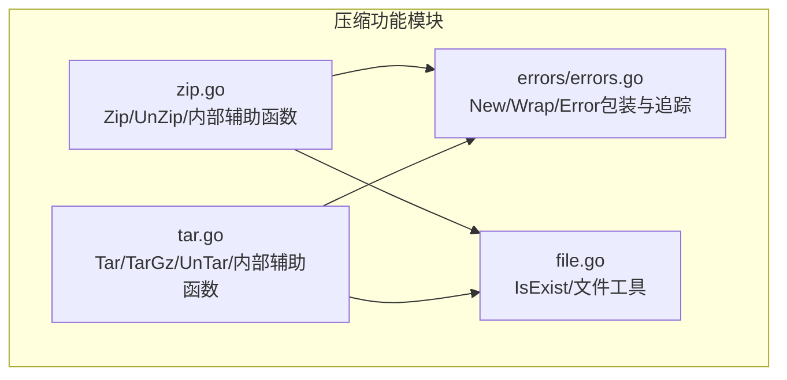
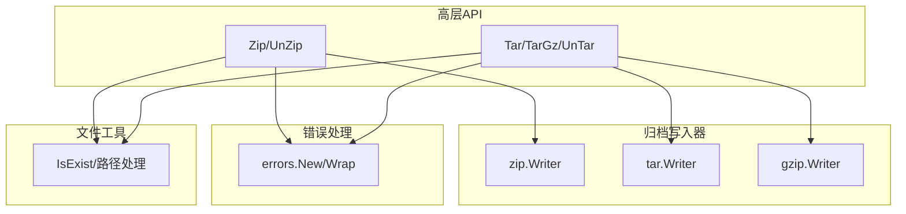
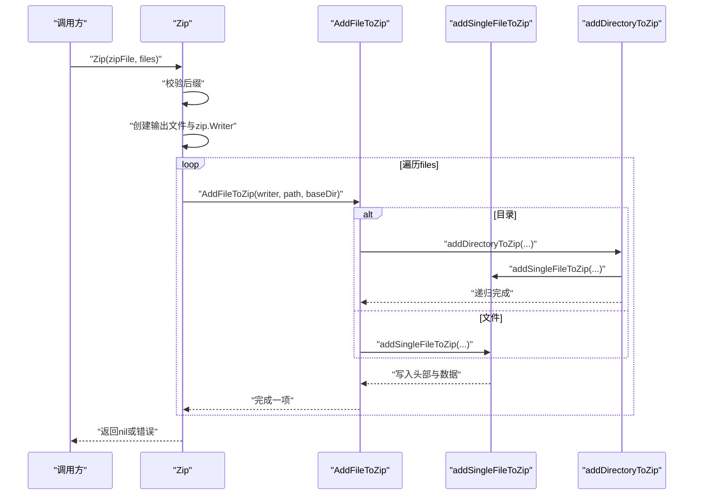
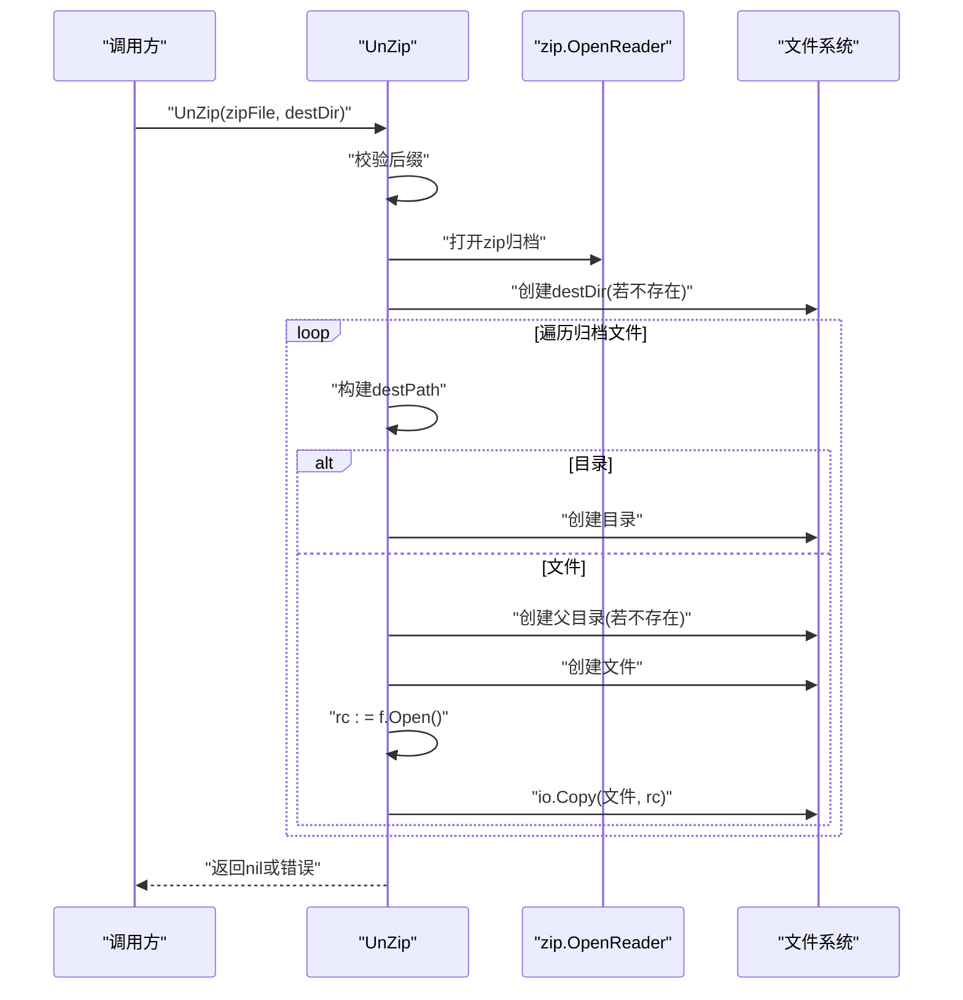
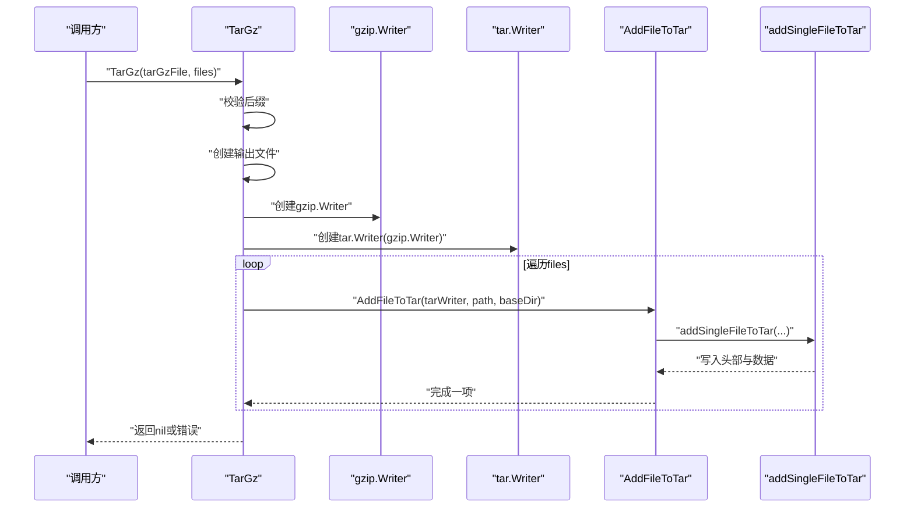
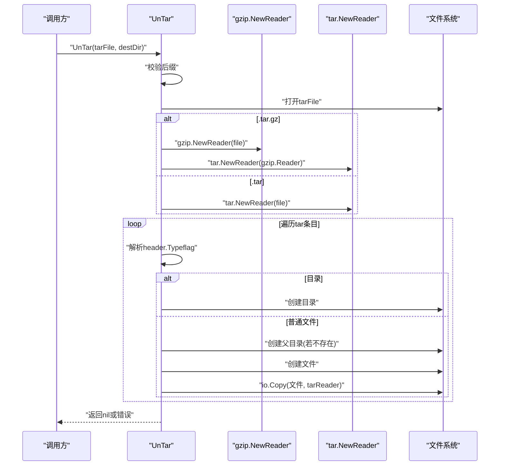
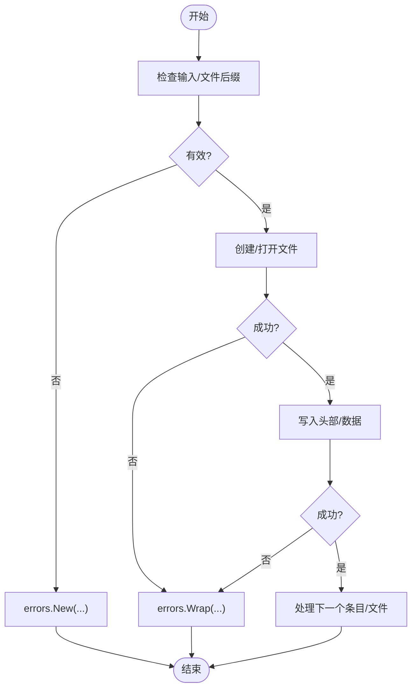
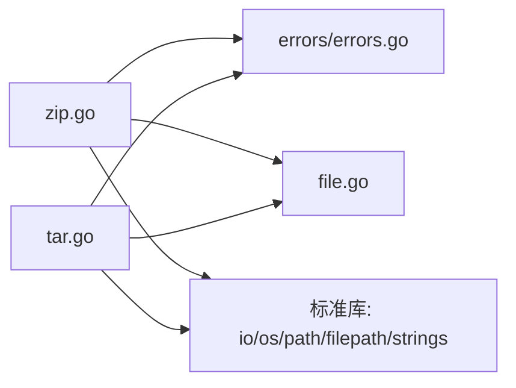

# 压缩功能模块

<cite>
**本文引用的文件**
- [zip.go](file://zip.go)
- [tar.go](file://tar.go)
- [zip_test.go](file://zip_test.go)
- [tar_test.go](file://tar_test.go)
- [errors.go](file://errors/errors.go)
- [file.go](file://file.go)
- [README.md](file://README.md)
</cite>

## 目录

1. [简介](#简介)
2. [项目结构](#项目结构)
3. [核心组件](#核心组件)
4. [架构总览](#架构总览)
5. [详细组件分析](#详细组件分析)
6. [依赖关系分析](#依赖关系分析)
7. [性能考量](#性能考量)
8. [故障排查指南](#故障排查指南)
9. [结论](#结论)
10. [附录](#附录)

## 简介

本文件系统性梳理仓库中的压缩功能模块，重点覆盖以下能力：

- ZIP格式：提供 Zip 与 UnZip 函数，支持文件与目录的打包与解压。
- TAR格式：提供 Tar、TarGz 与 UnTar 函数，支持纯 TAR 与 TAR.GZ 的打包与解压。
- 错误处理：统一通过自定义错误包装与追踪，便于定位问题。
- 性能与最佳实践：基于现有实现总结优化策略与使用建议。
- 使用示例与选择指南：结合单元测试与实现细节，给出不同场景下的格式选择建议。

## 项目结构

压缩功能主要由以下文件构成：

- 压缩与解压实现：zip.go、tar.go
- 错误处理：errors/errors.go
- 辅助工具：file.go（包含 IsExist 等文件存在性检查）
- 测试用例：zip_test.go、tar_test.go
- 文档：README.md（含通用使用说明）

图表来源

- [zip.go](file://zip.go#L1-L213)
- [tar.go](file://tar.go#L1-L263)
- [errors.go](file://errors/errors.go#L1-L282)
- [file.go](file://file.go#L1-L451)

章节来源

- [zip.go](file://zip.go#L1-L213)
- [tar.go](file://tar.go#L1-L263)
- [errors.go](file://errors/errors.go#L1-L282)
- [file.go](file://file.go#L1-L451)

## 核心组件

- ZIP打包与解压
    - Zip(zipFile, files []string)：创建 .zip 文件，支持文件与目录递归打包。
    - UnZip(zipFile, destDir)：解压 .zip 文件至目标目录。
- TAR与TAR.GZ打包与解压
    - Tar(tarFile, files []string)：创建 .tar 文件。
    - TarGz(tarGzFile, files []string)：创建 .tar.gz 文件（内层为 gzip 压缩）。
    - UnTar(tarFile, destDir)：自动识别 .tar 或 .tar.gz 并解压。
- 内部辅助函数
    - AddFileToZip/AddFileToTar：根据路径类型（文件/目录）选择对应添加逻辑。
    - addSingleFileToZip/addSingleFileToTar：创建归档头部并写入文件数据。
    - addDirectoryToZip/addDirectoryToTar：递归遍历目录并逐项添加。

章节来源

- [zip.go](file://zip.go#L12-L41)
- [zip.go](file://zip.go#L140-L212)
- [tar.go](file://tar.go#L13-L43)
- [tar.go](file://tar.go#L45-L79)
- [tar.go](file://tar.go#L176-L262)

## 架构总览

整体采用“高层API + 内部辅助函数”的分层设计：

- 高层API：Zip/Tar/TarGz/UnZip/UnTar
- 归档写入：zip.Writer/tar.Writer
- 压缩链路：TarGz 内部组合 gzip.Writer 与 tar.Writer
- 错误处理：统一使用 errors.New/Wrap 进行包装与追踪
- 文件存在性：使用 IsExist 判断目录/文件是否存在

图表来源

- [zip.go](file://zip.go#L16-L40)
- [tar.go](file://tar.go#L22-L78)
- [errors.go](file://errors/errors.go#L14-L53)
- [file.go](file://file.go#L35-L39)

## 详细组件分析

### ZIP 功能分析

- Zip(zipFile, files []string)
    - 输入校验：仅允许 .zip 结尾。
    - 创建输出文件与 zip.Writer。
    - 遍历 files，逐个调用 AddFileToZip。
- AddFileToZip(zipWriter, fileToCompress, baseDir)
    - 若为目录：调用 addDirectoryToZip 递归添加。
    - 若为文件：调用 addSingleFileToZip。
- addSingleFileToZip(zipWriter, fileToCompress, fileInfo, baseDir)
    - 通过 zip.FileInfoHeader 生成头部。
    - 调整 header.Name 为相对 baseDir 的路径。
    - 设置压缩方法为 Deflate。
    - 通过 zipWriter.CreateHeader 写入头部。
    - 打开文件并使用 io.Copy 写入数据。
- addDirectoryToZip(...)
    - 先写入目录自身头部，再递归处理子项。
- UnZip(zipFile, destDir)
    - 校验 .zip 后缀。
    - 使用 zip.OpenReader 打开归档。
    - 逐项遍历 r.File：
        - 若为目录：创建目录。
        - 若为文件：创建父目录（若不存在）、创建文件并写入数据。
    - 使用 io.Copy 完成数据拷贝。

图表来源

- [zip.go](file://zip.go#L16-L40)
- [zip.go](file://zip.go#L47-L60)
- [zip.go](file://zip.go#L62-L97)
- [zip.go](file://zip.go#L99-L138)

图表来源

- [zip.go](file://zip.go#L144-L212)

章节来源

- [zip.go](file://zip.go#L12-L41)
- [zip.go](file://zip.go#L43-L60)
- [zip.go](file://zip.go#L62-L97)
- [zip.go](file://zip.go#L99-L138)
- [zip.go](file://zip.go#L140-L212)

### TAR 与 TAR.GZ 功能分析

- Tar(tarFile, files []string)
    - 校验 .tar 后缀。
    - 创建输出文件与 tar.Writer。
    - 遍历 files，逐个调用 AddFileToTar。
- TarGz(tarGzFile, files []string)
    - 校验 .tar.gz 后缀。
    - 创建输出文件，构造 gzip.Writer，再构造 tar.Writer。
    - 遍历 files，逐个调用 AddFileToTar。
- AddFileToTar(tarWriter, fileToCompress, baseDir)
    - 目录/文件分支与 ZIP 类似，分别调用 addDirectoryToTar 或 addSingleFileToTar。
- addSingleFileToTar(tarWriter, fileToCompress, fileInfo, baseDir)
    - 通过 tar.FileInfoHeader 生成头部。
    - 调整 header.Name 为相对 baseDir 的路径。
    - tarWriter.WriteHeader 写入头部。
    - 打开文件并使用 io.Copy 写入数据。
- addDirectoryToTar(...)
    - 先写入目录自身头部，再递归处理子项。
- UnTar(tarFile, destDir)
    - 校验 .tar 或 .tar.gz 后缀。
    - 若为 .tar.gz：先用 gzip.NewReader 包裹文件流，再用 tar.NewReader。
    - 遍历 tar 归档条目：
        - 若 Typeflag 为目录：创建目录。
        - 若为普通文件：创建父目录（若不存在）、创建文件并写入数据。

图表来源

- [tar.go](file://tar.go#L49-L79)
- [tar.go](file://tar.go#L61-L67)
- [tar.go](file://tar.go#L85-L98)
- [tar.go](file://tar.go#L100-L133)

图表来源

- [tar.go](file://tar.go#L180-L262)
- [tar.go](file://tar.go#L192-L208)

章节来源

- [tar.go](file://tar.go#L13-L43)
- [tar.go](file://tar.go#L45-L79)
- [tar.go](file://tar.go#L81-L98)
- [tar.go](file://tar.go#L100-L133)
- [tar.go](file://tar.go#L135-L174)
- [tar.go](file://tar.go#L176-L262)

### 错误处理机制

- 统一错误包装
    - errors.New(msg)：创建带追踪的错误。
    - errors.Wrap(err, msg...)：对已有错误进行包装，保留原始错误链。
- 在压缩模块中的应用
    - 文件创建失败、目录创建失败、打开文件失败、写入失败、读取失败等均通过 Wrap 包装后返回。
- 错误追踪
    - errors.Trace(err) 返回 slog.LogValuer，可在日志中输出堆栈追踪信息，便于定位问题。

图表来源

- [zip.go](file://zip.go#L16-L26)
- [zip.go](file://zip.go#L144-L154)
- [tar.go](file://tar.go#L22-L27)
- [tar.go](file://tar.go#L186-L190)
- [errors.go](file://errors/errors.go#L14-L53)

章节来源

- [errors.go](file://errors/errors.go#L14-L53)
- [zip.go](file://zip.go#L23-L25)
- [zip.go](file://zip.go#L150-L154)
- [tar.go](file://tar.go#L24-L27)
- [tar.go](file://tar.go#L188-L190)

## 依赖关系分析

- 模块间耦合
    - zip.go 与 tar.go 均依赖 errors 包进行错误包装。
    - zip.go 与 tar.go 均依赖 file.go 的 IsExist 进行目录存在性判断。
- 外部依赖
    - archive/zip、archive/tar、compress/gzip（标准库）
    - io、os、path/filepath、strings（标准库）

图表来源

- [zip.go](file://zip.go#L3-L10)
- [tar.go](file://tar.go#L3-L11)
- [errors.go](file://errors/errors.go#L1-L12)
- [file.go](file://file.go#L1-L16)

章节来源

- [zip.go](file://zip.go#L3-L10)
- [tar.go](file://tar.go#L3-L11)
- [errors.go](file://errors/errors.go#L1-L12)
- [file.go](file://file.go#L1-L16)

## 性能考量

- 压缩算法与级别
    - ZIP：使用 Deflate 压缩方法，未暴露压缩级别配置。
    - TAR.GZ：通过 compress/gzip.Writer 创建压缩流，未暴露压缩级别配置。
    - 建议：如需精细控制压缩级别，可在上层封装中引入 gzip.WithLevel 等选项（当前实现未提供）。
- 数据拷贝
    - 所有写入均使用 io.Copy，具备较好的内存效率与稳定性。
- 目录递归
    - addDirectoryToZip/addDirectoryToTar 递归遍历，注意大目录树可能导致的 I/O 压力。
- 目录创建
    - 解压前统一创建目标目录，避免多次失败重试带来的额外开销。

章节来源

- [zip.go](file://zip.go#L74-L74)
- [tar.go](file://tar.go#L62-L62)
- [zip.go](file://zip.go#L90-L94)
- [tar.go](file://tar.go#L126-L130)
- [zip.go](file://zip.go#L169-L174)
- [tar.go](file://tar.go#L234-L237)

## 故障排查指南

- 常见错误类型
    - 文件后缀不匹配：Zip/UnZip 校验 .zip；Tar/TarGz 校验 .tar/.tar.gz；UnTar 校验 .tar 或 .tar.gz。
    - 文件/目录不存在：创建输出文件失败、打开输入文件失败、读取目录失败。
    - 权限不足：创建目录/文件失败。
- 定位手段
    - 使用 errors.Trace(err) 输出堆栈信息，结合 Wrap 链路快速定位。
    - 在调用处打印错误并结合日志系统查看。
- 建议修复
    - 确保输出路径存在且具备写权限。
    - 确保输入路径为真实存在的文件或目录。
    - 对于 .tar.gz，确认文件确实经过 gzip 压缩。

章节来源

- [zip.go](file://zip.go#L17-L19)
- [zip.go](file://zip.go#L145-L147)
- [tar.go](file://tar.go#L18-L20)
- [tar.go](file://tar.go#L50-L52)
- [tar.go](file://tar.go#L181-L183)
- [errors.go](file://errors/errors.go#L75-L82)

## 结论

- 该模块提供了 ZIP 与 TAR/TAR.GZ 的基础打包与解压能力，接口简洁、实现清晰。
- 错误处理统一通过 errors 包包装与追踪，便于问题定位。
- 当前未暴露压缩级别配置，如需更细粒度控制，可在上层封装中扩展。
- 建议在生产环境中配合日志系统与错误追踪，确保问题可追溯。

## 附录

### 使用示例与最佳实践

- 示例参考
    - ZIP：见 zip_test.go 中的 Zip/UnZip 测试用例。
    - TAR：见 tar_test.go 中的 Tar/TarGz/UnTar 测试用例。
- 最佳实践
    - 输入校验：始终确保文件后缀与预期一致。
    - 目录管理：解压前确保目标目录存在，必要时使用 IsExist 判断。
    - 大文件/大目录：关注 I/O 压力，合理拆分任务或增加磁盘空间。
    - 错误处理：捕获错误后使用 errors.Trace 输出堆栈，便于定位。
- 格式选择指南
    - ZIP：跨平台兼容性好，适合通用场景。
    - TAR：适合类 Unix 系统与需要保留元数据的场景。
    - TAR.GZ：在 TAR 基础上增加 gzip 压缩，适合网络传输或存储空间敏感场景。

章节来源

- [zip_test.go](file://zip_test.go#L8-L26)
- [zip_test.go](file://zip_test.go#L29-L48)
- [tar_test.go](file://tar_test.go#L8-L26)
- [tar_test.go](file://tar_test.go#L29-L47)
- [tar_test.go](file://tar_test.go#L50-L70)
- [README.md](file://README.md#L13-L25)