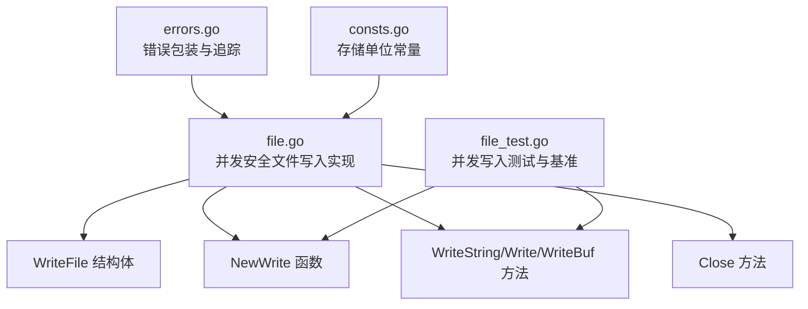
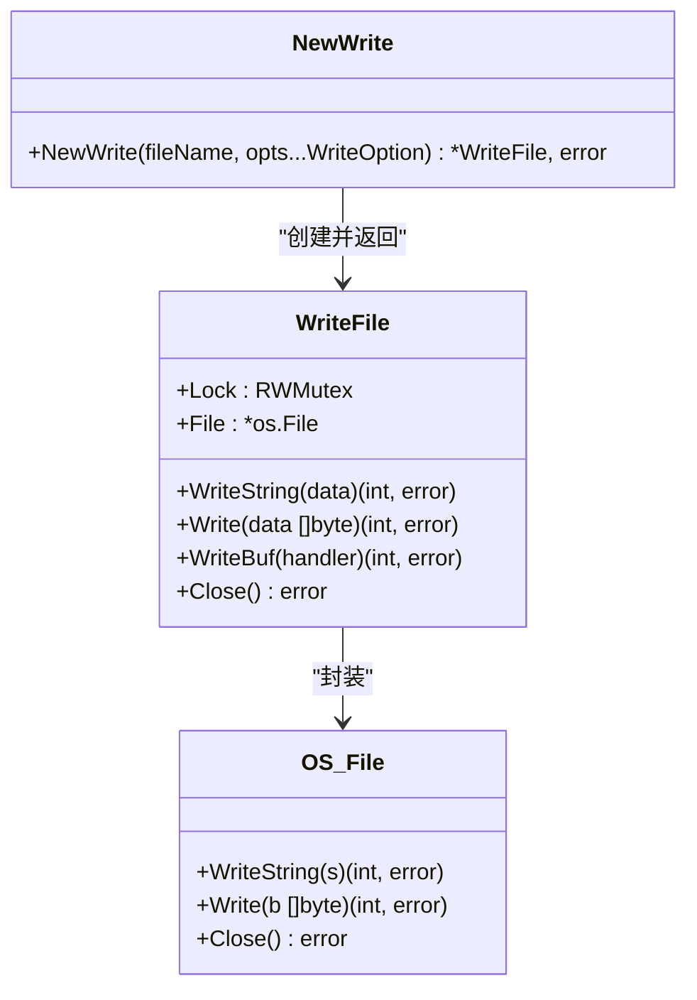
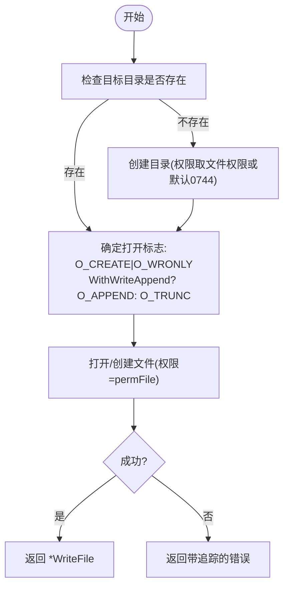
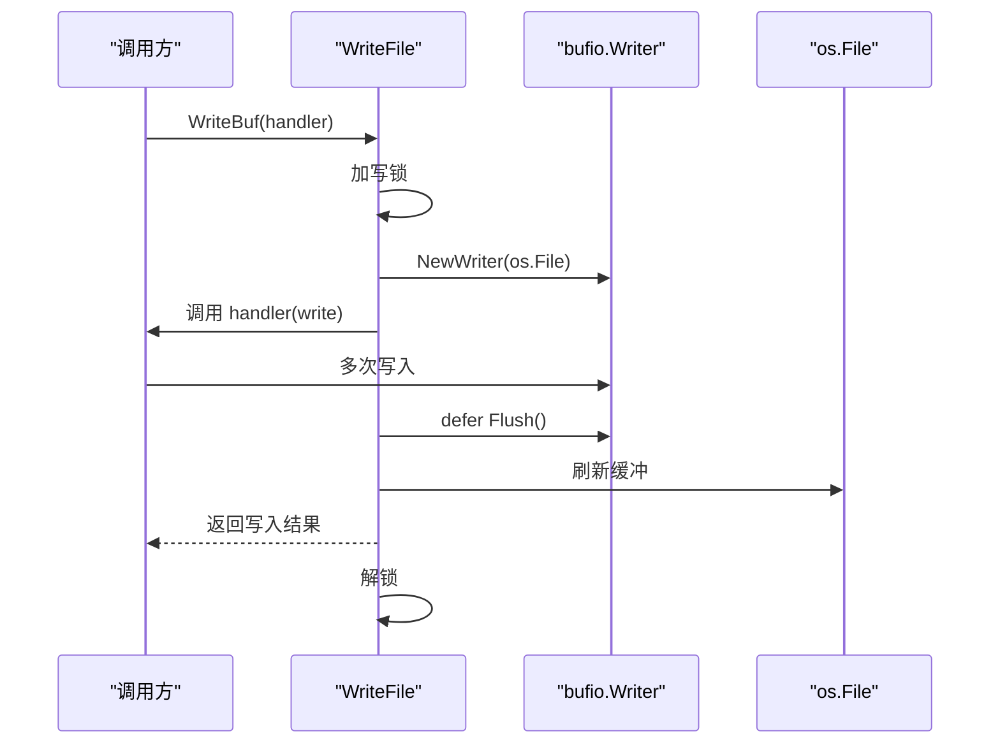
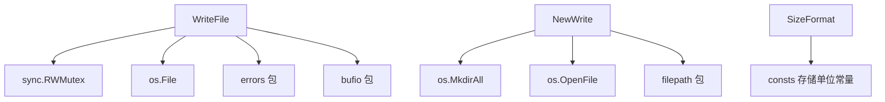

# 并发安全文件写入

<cite>
**本文引用的文件列表**
- [file.go](file://file.go)
- [file_test.go](file://file_test.go)
- [errors.go](file://errors/errors.go)
- [consts.go](file://consts.go)
- [README.md](file://README.md)
</cite>

## 目录

1. [简介](#简介)
2. [项目结构](#项目结构)
3. [核心组件](#核心组件)
4. [架构总览](#架构总览)
5. [详细组件分析](#详细组件分析)
6. [依赖关系分析](#依赖关系分析)
7. [性能考量](#性能考量)
8. [故障排查指南](#故障排查指南)
9. [结论](#结论)
10. [附录](#附录)

## 简介

本文件围绕并发安全文件写入功能展开，重点解析 WriteFile 结构体的设计与 sync.RWMutex 锁机制的使用，详解 NewWrite
函数的文件创建与权限设置流程，对比 WriteString、Write、WriteBuf 三种写入方式的差异与适用场景，并给出缓冲写入 WriteBuf
的性能优势与最佳实践。同时提供并发写入的注意事项、性能优化建议与线程安全考虑，辅以测试用例中的多线程写入示例路径，帮助读者快速掌握该模块在高并发场景下的正确使用方法。

## 项目结构

- 并发安全文件写入能力位于 file.go 中，包含：
    - NewWrite：创建或打开文件并设置权限
    - WriteFile：封装文件句柄与互斥锁
    - WriteString、Write、WriteBuf：三种写入方式
    - Close：关闭文件资源
- 测试用例位于 file_test.go，覆盖 NewWrite、Write、WriteString、WriteBuf 的并发写入场景与基准测试
- 错误包装与追踪位于 errors/errors.go，统一错误处理风格
- 常量定义位于 consts.go，包含存储单位常量，便于格式化输出

图表来源

- [file.go](file://file.go#L311-L395)
- [file_test.go](file://file_test.go#L499-L679)
- [errors.go](file://errors/errors.go#L1-L282)
- [consts.go](file://consts.go#L12-L22)

章节来源

- [file.go](file://file.go#L311-L395)
- [file_test.go](file://file_test.go#L499-L679)
- [errors.go](file://errors/errors.go#L1-L282)
- [consts.go](file://consts.go#L12-L22)

## 核心组件

- WriteFile：封装底层 *os.File 与 sync.RWMutex，确保并发写入的线程安全
- NewWrite：根据输入参数创建目录、设置权限、打开文件，返回 WriteFile 实例
- WriteString：将字符串写入文件，加写锁保护
- Write：将字节切片写入文件，加写锁保护
- WriteBuf：使用 bufio.Writer 进行缓冲写入，加写锁保护并在回调结束后刷新缓冲
- Close：关闭底层文件句柄，统一错误包装

章节来源

- [file.go](file://file.go#L353-L395)

## 架构总览

WriteFile 通过 RWMutex 提供读写分离的并发控制：多个 goroutine 可以并发读取（读锁），但写入时需独占（写锁）。NewWrite
在创建文件时自动处理目录创建与权限设置，WriteBuf 利用 bufio.Writer 将多次小写入合并为更少的系统调用，从而显著提升吞吐量。

图表来源

- [file.go](file://file.go#L353-L395)
- [file.go](file://file.go#L311-L351)

## 详细组件分析

### WriteFile 结构体与锁机制

- 字段
    - Lock：读写锁，允许多个读操作并发，写操作独占
    - File：底层文件句柄
- 设计要点
    - 通过在每个写入方法上加写锁，保证同一时刻只有一个 goroutine 写入，避免竞态
    - 读写分离：读操作（如只读文件场景）可与其他读操作并发，写操作独占，兼顾并发性与一致性

章节来源

- [file.go](file://file.go#L353-L357)

### NewWrite：文件创建与权限设置

- 目录创建
    - 若目标路径不存在，先创建目录
    - 目录权限优先使用传入的文件权限，若未提供则默认 0744
- 打开文件标志
    - 默认 O_CREATE | O_WRONLY
    - WithWriteAppend(true) 时附加 O_APPEND，否则附加 O_TRUNC
- 权限设置
    - 文件权限默认 0644，可通过第三个参数覆盖
- 返回
    - 成功返回 *WriteFile 实例，失败返回带追踪的错误

图表来源

- [file.go](file://file.go#L311-L351)

章节来源

- [file.go](file://file.go#L311-L351)

### WriteString：字符串写入

- 行为
    - 加写锁，调用底层 File.WriteString
    - 返回写入字节数与错误
- 适用场景
    - 单次写入字符串片段，无需额外缓冲
- 线程安全
    - 通过写锁保证并发安全

章节来源

- [file.go](file://file.go#L359-L366)

### Write：字节切片写入

- 行为
    - 加写锁，调用底层 File.Write
    - 返回写入字节数与错误
- 适用场景
    - 已有字节切片数据，直接写入
- 线程安全
    - 通过写锁保证并发安全

章节来源

- [file.go](file://file.go#L368-L375)

### WriteBuf：缓冲写入

- 行为
    - 加写锁，创建 bufio.NewWriter 包裹底层文件
    - 在回调 handler 中使用传入的 *bufio.Writer 进行多次写入
    - 回调结束后自动 Flush 刷新缓冲
- 性能优势
    - 将多次小写入合并为较少的系统调用，减少内核切换成本
    - 适合批量写入、高频小写入场景
- 使用建议
    - 在 handler 内多次调用 write.Write 或 write.WriteString
    - 不要在 handler 外部持有 write 的引用，避免跨 goroutine 使用

图表来源

- [file.go](file://file.go#L377-L387)

章节来源

- [file.go](file://file.go#L377-L387)

### Close：文件关闭与资源清理

- 行为
    - 若底层 File 非空，调用 File.Close 并返回带追踪的错误
    - 若 File 为空，直接返回 nil
- 最佳实践
    - 在 goroutine 退出前或作用域结束时调用 Close
    - 使用 defer 确保异常路径也能释放资源

章节来源

- [file.go](file://file.go#L389-L395)

### 并发安全与多线程写入示例

- 测试用例展示了如何在多个 goroutine 中并发写入同一 WriteFile 实例
- 示例覆盖三种写入方式：Write、WriteString、WriteBuf
- 使用 WaitGroup 等待所有 goroutine 完成，验证数据一致性与无竞态

章节来源

- [file_test.go](file://file_test.go#L499-L587)

## 依赖关系分析

- WriteFile 依赖
    - sync.RWMutex：提供读写锁
    - os.File：底层文件句柄
    - errors 包：统一错误包装与追踪
    - bufio：WriteBuf 使用缓冲写入
- NewWrite 依赖
    - os.MkdirAll：创建目录
    - os.OpenFile：打开/创建文件
    - filepath：路径处理
- 常量依赖
    - consts.go 中的存储单位常量用于格式化输出（与写入功能相关）

图表来源

- [file.go](file://file.go#L353-L395)
- [file.go](file://file.go#L311-L351)
- [consts.go](file://consts.go#L12-L22)

章节来源

- [file.go](file://file.go#L353-L395)
- [file.go](file://file.go#L311-L351)
- [consts.go](file://consts.go#L12-L22)

## 性能考量

- WriteBuf 明显优于频繁的小写入组合（Write/WriteString）：通过缓冲减少系统调用次数，提高吞吐量
- 在高并发场景下，WriteFile 的写锁会成为瓶颈；建议：
    - 将 WriteBuf 作为主要写入方式，集中批量写入
    - 控制单次 WriteBuf 的写入规模，避免一次性写入过大导致阻塞时间过长
    - 合理拆分任务，避免单个 goroutine 长时间占用写锁
- 基准测试参考
    - file_test.go 中提供了 WriteBuf 的基准测试示例，可用于评估不同写入策略的性能表现

章节来源

- [file_test.go](file://file_test.go#L591-L679)

## 故障排查指南

- 常见问题
    - 目录权限不足：NewWrite 在创建目录时使用 0744 或传入的文件权限，若权限不足会导致创建失败
    - 文件权限不符合预期：NewWrite 默认文件权限为 0644，可通过第三个参数覆盖
    - 写入阻塞：大量 goroutine 同时写入可能导致写锁竞争，建议使用 WriteBuf 并合理拆分任务
    - 资源泄漏：未调用 Close 导致文件句柄泄露，应使用 defer 确保关闭
- 错误追踪
    - 所有错误均通过 errors 包进行包装，便于定位调用栈与上下文

章节来源

- [file.go](file://file.go#L311-L351)
- [file.go](file://file.go#L389-L395)
- [errors.go](file://errors/errors.go#L24-L53)

## 结论

WriteFile 通过 sync.RWMutex 提供了简单而有效的并发安全保障，结合 NewWrite 的目录与权限管理、WriteBuf
的缓冲写入策略，能够在高并发场景下稳定地完成文件写入任务。建议优先使用 WriteBuf 进行批量写入，配合合理的任务拆分与资源管理，获得更好的性能与可靠性。

## 附录

- 使用示例与测试参考
    - 并发写入示例：file_test.go 中的 TestWrite
    - WriteBuf 基准测试：file_test.go 中的 BenchmarkWrite
- 相关文档
    - README.md 中包含项目背景与使用说明

章节来源

- [file_test.go](file://file_test.go#L499-L587)
- [file_test.go](file://file_test.go#L591-L679)
- [README.md](file://README.md#L1-L50)